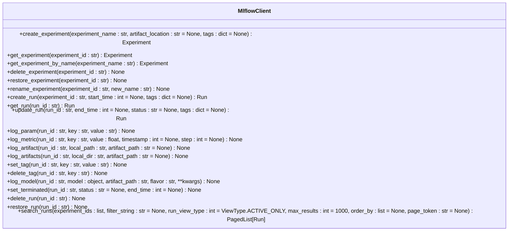

# API Reference

<cite>
**Referenced Files in This Document**   
- [__init__.py](file://mlflow/__init__.py)
- [client.py](file://mlflow/client.py)
- [fluent.py](file://mlflow/tracking/fluent.py)
- [handlers.py](file://mlflow/server/handlers.py)
- [fastapi_app.py](file://mlflow/server/fastapi_app.py)
- [cli/__init__.py](file://mlflow/cli/__init__.py)
- [server/auth/__init__.py](file://mlflow/server/auth/__init__.py)
- [tracking/client.py](file://mlflow/tracking/client.py)
- [entities/__init__.py](file://mlflow/entities/__init__.py)
- [gateway/app.py](file://mlflow/gateway/app.py)
- [types/index.ts](file://libs/typescript/core/src/index.ts)
- [clients/client.ts](file://libs/typescript/core/src/clients/client.ts)
</cite>

## Table of Contents
1. [Introduction](#introduction)
2. [Python API](#python-api)
3. [TypeScript API](#typescript-api)
4. [REST API](#rest-api)
5. [CLI](#cli)
6. [Common Use Cases](#common-use-cases)
7. [Security Considerations](#security-considerations)
8. [Error Handling](#error-handling)
9. [Performance Optimization](#performance-optimization)
10. [Migration Guides](#migration-guides)
11. [Integration Examples](#integration-examples)

## Introduction
MLflow provides a comprehensive set of APIs for managing machine learning experiments, models, and deployments. This documentation covers the public interfaces across multiple languages and protocols, including Python, TypeScript, REST, and CLI. The MLflow platform enables tracking experiments, packaging code into reproducible runs, sharing and reusing models, and managing the end-to-end machine learning lifecycle.

The API ecosystem is designed to be accessible through multiple interfaces, allowing developers to choose the most appropriate tool for their workflow. The Python API offers a fluent interface for tracking experiments and managing models, while the TypeScript API provides similar functionality for JavaScript/TypeScript applications. The REST API enables integration with any language that can make HTTP requests, and the CLI provides command-line tools for common operations.

**Section sources**
- [__init__.py](file://mlflow/__init__.py#L1-L419)
- [client.py](file://mlflow/client.py#L1-L13)

## Python API

### Core Tracking Functions
The MLflow Python API provides a fluent interface for tracking experiments through the top-level `mlflow` module. This interface allows users to log parameters, metrics, artifacts, and models with simple function calls.

Key tracking functions include:
- `start_run()`: Start a new MLflow run
- `log_param()`: Log a single parameter
- `log_metric()`: Log a single metric
- `log_artifact()`: Log a local file or directory as an artifact
- `log_model()`: Log a machine learning model
- `end_run()`: End the current run

The API also supports context manager syntax for automatic run management:

```python
with mlflow.start_run():
    mlflow.log_param("learning_rate", 0.01)
    mlflow.log_metric("accuracy", 0.95)
```

**Section sources**
- [__init__.py](file://mlflow/__init__.py#L1-L419)
- [fluent.py](file://mlflow/tracking/fluent.py#L1-L200)

### MlflowClient Class
The `MlflowClient` class provides a lower-level CRUD interface to MLflow entities, directly translating to REST API calls. This client enables more granular control over experiments, runs, registered models, and model versions.



**Diagram sources**
- [client.py](file://mlflow/client.py#L1-L13)
- [tracking/client.py](file://mlflow/tracking/client.py#L1-L200)

### Model Registry Functions
MLflow provides functions for managing registered models and model versions through the model registry. These functions enable model lifecycle management, versioning, and deployment.

Key model registry functions:
- `register_model()`: Register a model with the model registry
- `search_registered_models()`: Search for registered models
- `search_model_versions()`: Search for model versions
- `set_model_version_tag()`: Set a tag on a model version
- `delete_model_version_tag()`: Delete a tag from a model version
- `transition_model_version_stage()`: Transition a model version to a different stage
- `get_latest_versions()`: Get the latest model versions for a given model

The model registry supports model versioning with stages (None, Staging, Production, Archived) and provides APIs for model discovery and management.

**Section sources**
- [__init__.py](file://mlflow/__init__.py#L250-L405)
- [tracking/client.py](file://mlflow/tracking/client.py#L1-L200)

### Autologging
MLflow's autologging feature automatically logs parameters, metrics, and models for various machine learning frameworks. This eliminates the need for manual logging calls and ensures comprehensive tracking of model development.

Supported frameworks include:
- scikit-learn
- TensorFlow
- Keras
- PyTorch
- XGBoost
- LightGBM
- Spark MLlib
- Fastai
- Gluon
- Statsmodels
- H2O
- Spacy
- OpenAI

Autologging can be enabled with a single function call:

```python
mlflow.autolog()
```

When autologging is enabled, MLflow automatically captures framework-specific parameters, metrics, and models during training.

**Section sources**
- [__init__.py](file://mlflow/__init__.py#L269-L269)
- [tracking/client.py](file://mlflow/tracking/client.py#L1-L200)

## TypeScript API

### Core Module
The TypeScript API provides a JavaScript/TypeScript interface to MLflow functionality, enabling integration with web applications and Node.js services. The API is designed to mirror the Python API while following JavaScript conventions.

```mermaid
classDiagram
class MlflowClient {
+constructor(options : { trackingUri : string; authProvider : AuthProvider })
+getHost() : string
+createTrace(traceInfo : TraceInfo) : Promise<TraceInfo>
+getTrace(traceId : string) : Promise<Trace>
+getTraceInfo(traceId : string) : Promise<TraceInfo>
+uploadTraceData(traceInfo : TraceInfo, traceData : TraceData) : Promise<void>
+createExperiment(name : string, artifactLocation? : string, tags? : Record<string, string>) : Promise<string>
+deleteExperiment(experimentId : string) : Promise<void>
}
class TraceInfo {
+constructor(data : any)
+toJson() : any
+fromJson(json : any) : TraceInfo
}
class Trace {
+constructor(traceInfo : TraceInfo, traceData : TraceData)
}
class TraceData {
+constructor(data : any)
}
class AuthProvider {
+getHeadersProvider() : HeadersProvider
+getHost() : string
}
class HeadersProvider {
+getHeaders() : Record<string, string>
}
MlflowClient --> TraceInfo : "uses"
MlflowClient --> Trace : "creates"
MlflowClient --> TraceData : "uploads"
MlflowClient --> AuthProvider : "depends on"
```

**Diagram sources**
- [types/index.ts](file://libs/typescript/core/src/index.ts#L1-L34)
- [clients/client.ts](file://libs/typescript/core/src/clients/client.ts#L1-L134)

### Key Functions and Interfaces
The TypeScript API exports several key functions and interfaces for working with MLflow:

- `init()`: Initialize the MLflow client configuration
- `getLastActiveTraceId()`: Get the ID of the last active trace
- `getCurrentActiveSpan()`: Get the current active span
- `updateCurrentTrace()`: Update the current trace with new information
- `startSpan()`: Start a new span within the current trace
- `trace()`: Create a new trace
- `withSpan()`: Execute a function within a span context
- `flushTraces()`: Flush any pending trace data to the server
- `MlflowClient`: Client for interacting with the MLflow server

The API also exports type definitions for core entities:
- `LiveSpan`, `Span`: Types for spans within a trace
- `Trace`: Type for a complete trace
- `TraceInfo`, `TokenUsage`: Types for trace metadata
- `TraceData`: Type for trace data
- `SpanStatusCode`: Enum for span status codes
- `UpdateCurrentTraceOptions`, `SpanOptions`, `TraceOptions`: Option interfaces for trace operations

**Section sources**
- [types/index.ts](file://libs/typescript/core/src/index.ts#L1-L34)
- [clients/client.ts](file://libs/typescript/core/src/clients/client.ts#L1-L134)

### Usage Patterns
The TypeScript API follows common JavaScript patterns for asynchronous operations and configuration. Authentication is handled through an `AuthProvider` interface that can be implemented for different authentication methods.

Basic usage pattern:

```typescript
import { MlflowClient } from 'mlflow';

const client = new MlflowClient({
  trackingUri: 'http://localhost:5000',
  authProvider: new BasicAuthProvider('username', 'password')
});

// Create a new experiment
const experimentId = await client.createExperiment('My Experiment');

// Log a trace
const traceInfo = new TraceInfo({
  name: 'my-trace',
  timestamp: Date.now(),
  request_id: '123'
});
await client.createTrace(traceInfo);
```

The API uses promises for all asynchronous operations, making it compatible with async/await syntax and promise chaining.

**Section sources**
- [types/index.ts](file://libs/typescript/core/src/index.ts#L1-L34)
- [clients/client.ts](file://libs/typescript/core/src/clients/client.ts#L1-L134)

## REST API

### HTTP Methods and URL Patterns
The MLflow REST API provides a comprehensive interface to all MLflow functionality through HTTP endpoints. The API follows REST conventions with appropriate HTTP methods for different operations.

Key endpoint patterns:
- `POST /api/2.0/mlflow/experiments/create`: Create a new experiment
- `GET /api/2.0/mlflow/experiments/get`: Get an experiment by ID
- `GET /api/2.0/mlflow/experiments/get-by-name`: Get an experiment by name
- `POST /api/2.0/mlflow/experiments/delete`: Delete an experiment
- `POST /api/2.0/mlflow/experiments/update`: Update an experiment
- `POST /api/2.0/mlflow/runs/create`: Create a new run
- `GET /api/2.0/mlflow/runs/get`: Get a run by ID
- `POST /api/2.0/mlflow/runs/update`: Update a run
- `POST /api/2.0/mlflow/runs/log-parameter`: Log a parameter to a run
- `POST /api/2.0/mlflow/runs/log-metric`: Log a metric to a run
- `POST /api/2.0/mlflow/runs/log-artifact`: Log an artifact to a run
- `POST /api/2.0/mlflow/model-versions/create`: Create a new model version
- `GET /api/2.0/mlflow/model-versions/get`: Get a model version
- `POST /api/2.0/mlflow/model-versions/transition-stage`: Transition a model version to a new stage

The API uses versioned endpoints with the pattern `/api/<version>/mlflow/<resource>/<action>` to ensure backward compatibility.

**Section sources**
- [handlers.py](file://mlflow/server/handlers.py#L1-L800)
- [fastapi_app.py](file://mlflow/server/fastapi_app.py#L1-L63)

### Request/Response Schemas
The REST API uses JSON for request and response payloads, with well-defined schemas for each endpoint. Request bodies contain the necessary parameters for the operation, while responses include the result data and metadata.

Common request/response fields:
- `experiment_id`: Unique identifier for an experiment
- `experiment_name`: Name of the experiment
- `run_id`: Unique identifier for a run
- `run_name`: Name of the run
- `status`: Status of the run (e.g., "RUNNING", "FINISHED")
- `start_time`: Start time of the run in milliseconds
- `end_time`: End time of the run in milliseconds
- `parameters`: Dictionary of parameter key-value pairs
- `metrics`: Dictionary of metric key-value pairs
- `tags`: Dictionary of tag key-value pairs
- `artifact_uri`: URI where artifacts are stored
- `lifecycle_stage`: Lifecycle stage of the entity (e.g., "active", "deleted")

Error responses follow a standard format:
```json
{
  "error_code": "INVALID_PARAMETER_VALUE",
  "message": "Invalid value for parameter 'experiment_name': must not be empty"
}
```

**Section sources**
- [handlers.py](file://mlflow/server/handlers.py#L1-L800)
- [tracking/client.py](file://mlflow/tracking/client.py#L1-L200)

### Authentication Methods
The MLflow REST API supports multiple authentication methods to secure access to the server:

- **Basic Authentication**: Username and password credentials sent in the Authorization header
- **Bearer Tokens**: Token-based authentication using the Authorization: Bearer <token> header
- **Databricks Authentication**: Integration with Databricks workspace authentication
- **OAuth**: Support for OAuth 2.0 authentication flows
- **API Keys**: Long-lived tokens for programmatic access

Authentication is configured through the MLflow server settings, and different authentication methods can be enabled or disabled as needed. The API validates credentials on each request and returns appropriate error codes for unauthorized access attempts.

**Section sources**
- [server/auth/__init__.py](file://mlflow/server/auth/__init__.py#L1-L200)
- [handlers.py](file://mlflow/server/handlers.py#L1-L800)

### Error Handling
The REST API uses standard HTTP status codes to indicate the result of requests:

- `200 OK`: Successful GET, PUT, PATCH, or DELETE request
- `201 Created`: Successful POST request that created a new resource
- `400 Bad Request`: Invalid request parameters or body
- `401 Unauthorized`: Authentication required or failed
- `403 Forbidden`: Authentication successful but insufficient permissions
- `404 Not Found`: Requested resource does not exist
- `409 Conflict`: Request conflicts with current state of the resource
- `500 Internal Server Error`: Server encountered an unexpected condition

Error responses include a JSON body with an error code and message to help diagnose issues. The API also supports rate limiting with appropriate headers to indicate rate limit status.

**Section sources**
- [handlers.py](file://mlflow/server/handlers.py#L786-L797)
- [server/auth/__init__.py](file://mlflow/server/auth/__init__.py#L1-L200)

## CLI

### Commands and Options
The MLflow CLI provides command-line tools for interacting with MLflow servers and managing experiments. The CLI supports the same functionality as the Python API with a command-line interface.

Key commands:
- `mlflow run`: Run an MLflow project from a URI
- `mlflow server`: Run the MLflow tracking server
- `mlflow gc`: Permanently delete runs in the "deleted" lifecycle stage
- `mlflow experiments`: Manage experiments (create, list, delete)
- `mlflow runs`: Manage runs (list, delete)
- `mlflow models`: Manage models (serve, build-docker)
- `mlflow deployments`: Manage model deployments

Common global options:
- `--version`: Show version and exit
- `--env-file`: Load environment variables from a dotenv file
- `--tracking-uri`: MLflow tracking URI

**Section sources**
- [cli/__init__.py](file://mlflow/cli/__init__.py#L1-L800)

### Arguments and Usage Examples
The CLI commands accept various arguments to customize their behavior. Here are examples of common usage patterns:

Run an MLflow project:
```bash
mlflow run . --entry-point train --param-list learning_rate=0.01 --experiment-name "My Experiment"
```

Start the MLflow server:
```bash
mlflow server --backend-store-uri sqlite:///mlflow.db --default-artifact-root ./artifacts --host 0.0.0.0 --port 5000
```

Create a new experiment:
```bash
mlflow experiments create --experiment-name "New Experiment"
```

List runs in an experiment:
```bash
mlflow runs list --experiment-id 1 --view-type ACTIVE_ONLY
```

Delete runs older than 30 days:
```bash
mlflow gc --older-than 30d
```

The CLI provides detailed help for each command with the `--help` option, showing all available arguments and their descriptions.

**Section sources**
- [cli/__init__.py](file://mlflow/cli/__init__.py#L1-L800)

## Common Use Cases

### Experiment Tracking
MLflow's experiment tracking API enables comprehensive logging of machine learning experiments. This includes parameters, metrics, artifacts, and models, providing a complete record of the model development process.

Typical experiment tracking workflow:
1. Set the active experiment
2. Start a new run
3. Log parameters and metrics during training
4. Log artifacts such as models, plots, and data files
5. End the run

```python
import mlflow

# Set the experiment
mlflow.set_experiment("My Experiment")

# Start a run
with mlflow.start_run():
    # Log parameters
    mlflow.log_param("learning_rate", 0.01)
    mlflow.log_param("batch_size", 32)
    
    # Log metrics
    for epoch in range(10):
        accuracy = train_model(epoch)
        mlflow.log_metric("accuracy", accuracy, step=epoch)
    
    # Log artifacts
    mlflow.log_artifact("model.pkl")
    mlflow.log_artifact("training_plot.png")
    
    # Log the model
    mlflow.sklearn.log_model(model, "model")
```

**Section sources**
- [__init__.py](file://mlflow/__init__.py#L1-L419)
- [fluent.py](file://mlflow/tracking/fluent.py#L1-L200)

### Model Management
MLflow's model registry provides a centralized repository for managing machine learning models throughout their lifecycle. This enables collaboration, versioning, and deployment of models.

Model management workflow:
1. Train and log a model
2. Register the model with the model registry
3. Transition model versions through stages (Staging → Production)
4. Deploy models to various environments
5. Archive old model versions

```python
import mlflow

# Train and log a model
with mlflow.start_run():
    model = train_model()
    model_info = mlflow.sklearn.log_model(model, "model")

# Register the model
model_uri = f"runs:/{model_info.run_id}/model"
registered_model = mlflow.register_model(model_uri, "MyModel")

# Transition to production
client = mlflow.MlflowClient()
client.transition_model_version_stage(
    name="MyModel",
    version=1,
    stage="Production"
)
```

**Section sources**
- [__init__.py](file://mlflow/__init__.py#L250-L405)
- [tracking/client.py](file://mlflow/tracking/client.py#L1-L200)

### Model Deployment
MLflow supports multiple deployment options for machine learning models, including local serving, Docker containers, and cloud platforms.

Local model serving:
```bash
mlflow models serve -m runs:/<run_id>/model --port 1234
```

Build a Docker image:
```bash
mlflow models build-docker -m runs:/<run_id>/model -n my-model-image
```

Deploy to cloud platforms:
```python
# Deploy to Azure ML
mlflow.azureml.deploy(model_uri, workspace, name="my-model")

# Deploy to SageMaker
mlflow.sagemaker.deploy(app_name="my-app", model_uri=model_uri)
```

The deployment API supports various flavors (scikit-learn, TensorFlow, PyTorch, etc.) and provides options for customizing the deployment environment.

**Section sources**
- [models/__init__.py](file://mlflow/models/__init__.py)
- [deployments/__init__.py](file://mlflow/deployments/__init__.py)

## Security Considerations

### Authentication and Authorization
MLflow provides multiple authentication mechanisms to secure access to the tracking server and model registry. The authentication system supports pluggable authentication providers, allowing integration with existing identity management systems.

Authentication options:
- **Basic Authentication**: Username and password credentials
- **Bearer Tokens**: Token-based authentication
- **Databricks Authentication**: Integration with Databricks workspace
- **OAuth**: Support for OAuth 2.0 flows
- **LDAP/Active Directory**: Enterprise directory integration

Authorization is role-based, with permissions defined for different operations:
- Experiment creation, reading, updating, and deletion
- Run creation, reading, updating, and deletion
- Model registration and version management
- User management and permissions

The server can be configured to require authentication for all operations or to allow anonymous access with restricted permissions.

**Section sources**
- [server/auth/__init__.py](file://mlflow/server/auth/__init__.py#L1-L200)
- [handlers.py](file://mlflow/server/handlers.py#L727-L1711)

### Data Protection
MLflow implements several measures to protect sensitive data and ensure privacy:

- **Data Encryption**: Support for encrypting data at rest and in transit
- **Access Controls**: Fine-grained permissions for experiments, runs, and models
- **Audit Logging**: Comprehensive logging of all operations for compliance
- **Data Retention**: Configurable retention policies for runs and artifacts
- **Secure Artifacts**: Secure storage and access to model artifacts

The server supports integration with enterprise security systems and can be configured to meet various compliance requirements (GDPR, HIPAA, etc.).

**Section sources**
- [server/auth/__init__.py](file://mlflow/server/auth/__init__.py#L1-L200)
- [tracking/client.py](file://mlflow/tracking/client.py#L1-L200)

## Error Handling

### Exception Types
MLflow defines a comprehensive set of exception types to handle different error conditions:

- `MlflowException`: Base exception class for all MLflow errors
- `RestException`: Exception for REST API errors
- `ExecutionException`: Exception for project execution errors
- `MissingConfigException`: Exception for missing configuration
- `InvalidUrlException`: Exception for invalid URLs
- `IllegalArtifactPathException`: Exception for invalid artifact paths
- `ExecutionTargetException`: Exception for execution target errors
- `ProjectExecutionException`: Exception for project execution errors

These exceptions provide detailed error information including error codes, messages, and root causes to facilitate debugging and error handling.

**Section sources**
- [exceptions.py](file://mlflow/exceptions.py)
- [tracking/client.py](file://mlflow/tracking/client.py#L1-L200)

### Error Recovery Strategies
MLflow provides several strategies for handling and recovering from errors:

- **Retry Logic**: Automatic retry of transient failures (e.g., network issues)
- **Graceful Degradation**: Continue operation with reduced functionality when non-critical components fail
- **Fallback Mechanisms**: Alternative approaches when primary methods fail
- **Error Logging**: Comprehensive logging of errors for diagnosis
- **User-Friendly Messages**: Clear error messages that guide users toward solutions

For critical operations, MLflow implements transactional semantics to ensure data consistency. When errors occur during multi-step operations, the system attempts to roll back to a consistent state.

**Section sources**
- [exceptions.py](file://mlflow/exceptions.py)
- [tracking/client.py](file://mlflow/tracking/client.py#L1-L200)

## Performance Optimization

### Caching Strategies
MLflow implements several caching mechanisms to improve performance:

- **Client-Side Caching**: Cache frequently accessed data on the client to reduce server requests
- **Server-Side Caching**: Cache query results and metadata on the server
- **Artifact Caching**: Cache downloaded artifacts to avoid repeated downloads
- **Connection Pooling**: Reuse database connections to reduce connection overhead

The caching system is configurable, allowing users to adjust cache sizes and expiration times based on their requirements.

**Section sources**
- [tracking/client.py](file://mlflow/tracking/client.py#L1-L200)
- [server/handlers.py](file://mlflow/server/handlers.py#L1-L800)

### Rate Limiting
MLflow supports rate limiting to prevent abuse and ensure fair resource usage:

- **Request Rate Limits**: Limit the number of requests per client
- **Bandwidth Limits**: Limit the amount of data transferred
- **Concurrent Request Limits**: Limit the number of concurrent requests
- **Custom Rate Limiting**: Pluggable rate limiting policies

Rate limiting can be configured globally or per endpoint, with different limits for different user roles. The API returns appropriate headers to indicate rate limit status, allowing clients to implement backoff strategies.

**Section sources**
- [server/handlers.py](file://mlflow/server/handlers.py#L1-L800)
- [server/auth/__init__.py](file://mlflow/server/auth/__init__.py#L1-L200)

## Migration Guides

### Deprecated Features
MLflow periodically deprecates features to improve the platform and remove technical debt. The following features are deprecated and will be removed in future versions:

- **Model Registry Stages**: Will be replaced with a more flexible model lifecycle management system
- **Fluent API Functions**: Some top-level functions will be moved to the client interface
- **Legacy Endpoints**: Older API endpoints will be removed in favor of newer versions

Deprecation notices are included in the documentation and emit warnings when deprecated features are used.

**Section sources**
- [tracking/client.py](file://mlflow/tracking/client.py#L1-L200)
- [__init__.py](file://mlflow/__init__.py#L1-L419)

### Backwards Compatibility
MLflow maintains backwards compatibility for stable APIs and provides migration paths for breaking changes:

- **Versioned APIs**: REST API endpoints are versioned to ensure stability
- **Deprecation Periods**: Deprecated features are maintained for at least one major release
- **Migration Tools**: Utilities to help migrate data and code to new versions
- **Compatibility Testing**: Comprehensive testing to ensure compatibility with previous versions

The project follows semantic versioning, with clear guidelines for when breaking changes are introduced.

**Section sources**
- [version.py](file://mlflow/version.py)
- [tracking/client.py](file://mlflow/tracking/client.py#L1-L200)

## Integration Examples

### Cross-Protocol Integration
MLflow APIs can be combined across different protocols to create comprehensive machine learning workflows. For example, a Python script can use the Python API to train a model, then use the REST API to register it, and finally use the CLI to deploy it.

```python
# Train model using Python API
import mlflow
import mlflow.sklearn

with mlflow.start_run():
    model = train_model()
    mlflow.sklearn.log_model(model, "model")
    model_uri = f"runs:/{mlflow.active_run().info.run_id}/model"

# Register model using REST API
import requests
import json

response = requests.post(
    "http://localhost:5000/api/2.0/mlflow/model-versions/create",
    json={
        "name": "MyModel",
        "source": model_uri
    }
)

# Deploy model using CLI
import subprocess

subprocess.run([
    "mlflow", "models", "serve",
    "-m", model_uri,
    "--port", "1234"
])
```

**Section sources**
- [__init__.py](file://mlflow/__init__.py#L1-L419)
- [tracking/client.py](file://mlflow/tracking/client.py#L1-L200)
- [cli/__init__.py](file://mlflow/cli/__init__.py#L1-L800)

### Multi-Language Workflows
MLflow enables workflows that span multiple programming languages. For example, a data scientist can train a model in Python, a web developer can create a dashboard using the TypeScript API, and a DevOps engineer can deploy the model using the CLI.

Python (training):
```python
import mlflow
import mlflow.sklearn
from sklearn.ensemble import RandomForestClassifier

# Train model
X, y = load_data()
model = RandomForestClassifier()
model.fit(X, y)

# Log model
with mlflow.start_run():
    mlflow.sklearn.log_model(model, "model")
    mlflow.log_metric("accuracy", model.score(X, y))
```

TypeScript (dashboard):
```typescript
import { MlflowClient } from 'mlflow';

const client = new MlflowClient({
  trackingUri: 'http://localhost:5000'
});

// Get latest run
const runs = await client.searchRuns(['1'], "metrics.accuracy > 0.8", {
  maxResults: 1,
  orderBy: ['metrics.accuracy DESC']
});

if (runs.length > 0) {
  const run = runs[0];
  console.log(`Best accuracy: ${run.data.metrics['accuracy']}`);
}
```

Bash (deployment):
```bash
#!/bin/bash
# Deploy latest model
LATEST_RUN=$(mlflow runs list --experiment-id 1 --max-results 1 --view-type ACTIVE_ONLY | tail -1 | awk '{print $1}')
mlflow models serve -m runs:/$LATEST_RUN/model --port 1234
```

**Section sources**
- [__init__.py](file://mlflow/__init__.py#L1-L419)
- [types/index.ts](file://libs/typescript/core/src/index.ts#L1-L34)
- [cli/__init__.py](file://mlflow/cli/__init__.py#L1-L800)