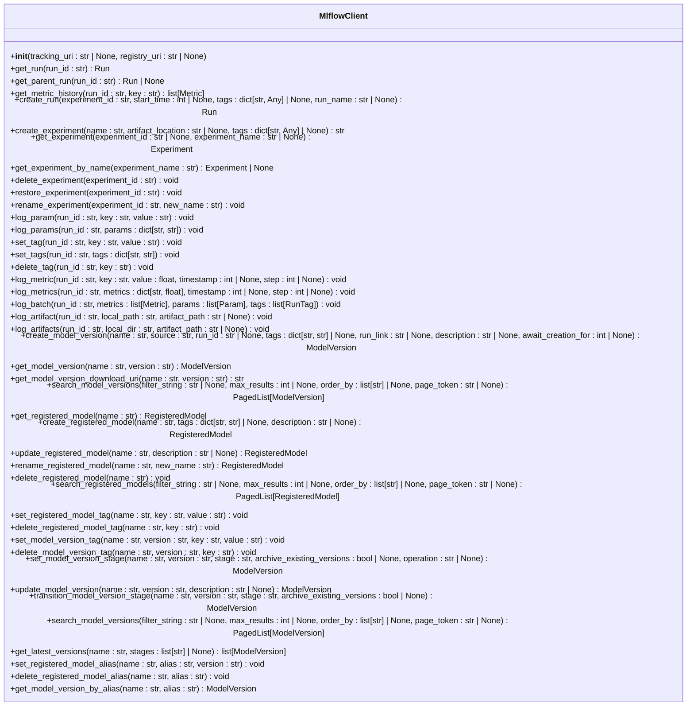
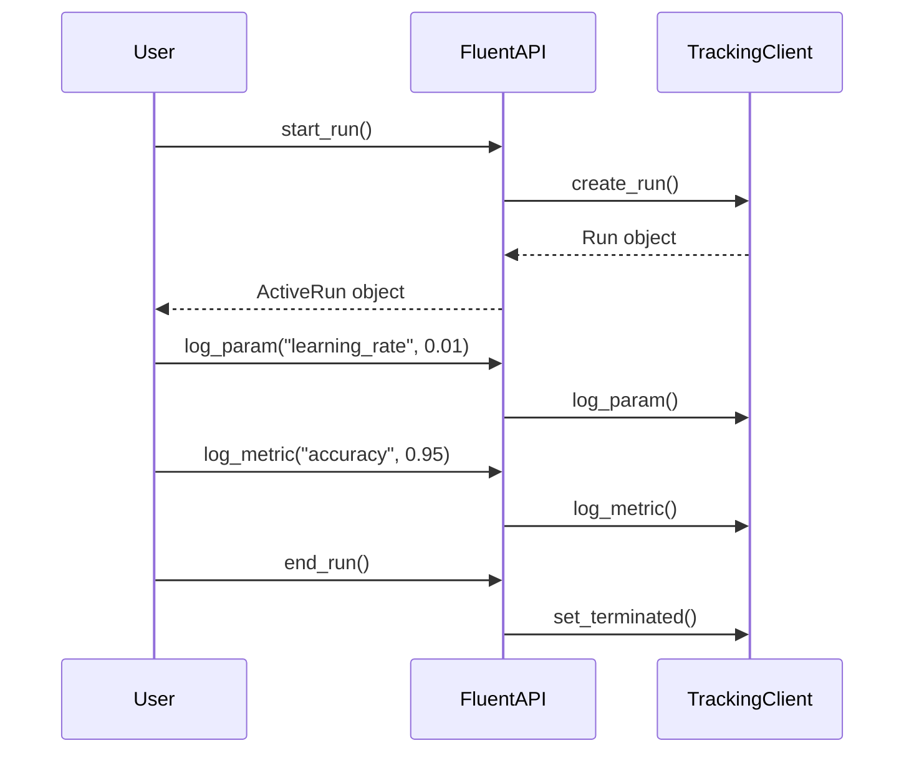
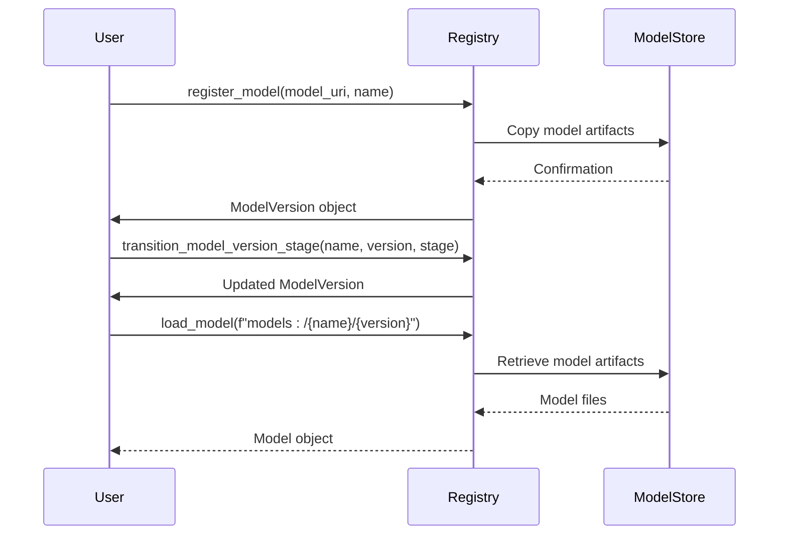
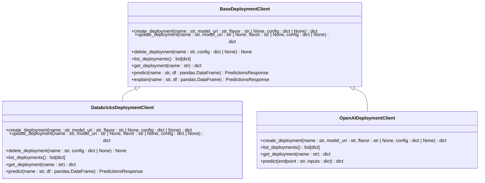

# Python API

<cite>
**Referenced Files in This Document**   
- [mlflow/__init__.py](file://mlflow/__init__.py)
- [mlflow/client.py](file://mlflow/client.py)
- [mlflow/tracking/fluent.py](file://mlflow/tracking/fluent.py)
- [mlflow/tracking/client.py](file://mlflow/tracking/client.py)
- [mlflow/tracking/_model_registry/fluent.py](file://mlflow/tracking/_model_registry/fluent.py)
- [mlflow/deployments/__init__.py](file://mlflow/deployments/__init__.py)
- [mlflow/models/__init__.py](file://mlflow/models/__init__.py)
</cite>

## Table of Contents
1. [Introduction](#introduction)
2. [MlflowClient Class](#mlflowclient-class)
3. [Fluent Tracking API](#fluent-tracking-api)
4. [Model Registry Operations](#model-registry-operations)
5. [Deployment Operations](#deployment-operations)
6. [Tracing Module](#tracing-module)
7. [Performance Optimization](#performance-optimization)
8. [Common Issues and Troubleshooting](#common-issues-and-troubleshooting)
9. [Integration Examples](#integration-examples)
10. [Conclusion](#conclusion)

## Introduction

The MLflow Python API provides a comprehensive interface for managing machine learning experiments, models, and deployments. This documentation covers the public interfaces of MLflow, focusing on the `MlflowClient` class, fluent APIs, model registry operations, and deployment functionality.

MLflow's API is organized into several modules:
- **Tracking**: For logging parameters, metrics, and artifacts during experiments
- **Model Registry**: For managing model versions and stages
- **Deployments**: For deploying models to various serving platforms
- **Tracing**: For monitoring and analyzing model predictions and LLM traces

The API provides both a high-level fluent interface (e.g., `mlflow.start_run()`) and a lower-level client interface (`MlflowClient`) for more granular control.

**Section sources**
- [mlflow/__init__.py](file://mlflow/__init__.py#L1-L419)

## MlflowClient Class

The `MlflowClient` class provides a comprehensive CRUD interface for managing MLflow experiments, runs, model versions, and registered models. It serves as a lower-level API that directly translates to MLflow's REST API calls.



**Diagram sources **
- [mlflow/tracking/client.py](file://mlflow/tracking/client.py#L211-L6567)

### Experiment Operations

The `MlflowClient` provides methods for managing experiments:

- `create_experiment(name, artifact_location=None, tags=None)`: Creates a new experiment with the specified name, artifact location, and tags.
- `get_experiment(experiment_id=None, experiment_name=None)`: Retrieves an experiment by ID or name.
- `get_experiment_by_name(experiment_name)`: Retrieves an experiment by name.
- `delete_experiment(experiment_id)`: Marks an experiment and associated metadata and runs as deleted.
- `restore_experiment(experiment_id)`: Restores a deleted experiment.
- `rename_experiment(experiment_id, new_name)`: Renames an experiment.

### Run Operations

The client provides comprehensive run management capabilities:

- `create_run(experiment_id, start_time=None, tags=None, run_name=None)`: Creates a new run in the specified experiment.
- `get_run(run_id)`: Retrieves information about a specific run.
- `get_parent_run(run_id)`: Gets the parent run for a nested run.
- `log_param(run_id, key, value)`: Logs a parameter for a run.
- `log_params(run_id, params)`: Logs multiple parameters for a run.
- `log_metric(run_id, key, value, timestamp=None, step=None)`: Logs a metric for a run.
- `log_metrics(run_id, metrics, timestamp=None, step=None)`: Logs multiple metrics for a run.
- `log_batch(run_id, metrics, params, tags)`: Logs multiple metrics, params, and tags for a run.
- `set_tag(run_id, key, value)`: Sets a tag for a run.
- `set_tags(run_id, tags)`: Sets multiple tags for a run.
- `delete_tag(run_id, key)`: Deletes a tag from a run.
- `log_artifact(run_id, local_path, artifact_path=None)`: Logs a local file or directory as an artifact.
- `log_artifacts(run_id, local_dir, artifact_path=None)`: Logs all files from a local directory as artifacts.

### Batch Operations

For high-frequency logging scenarios, the `log_batch` method allows logging multiple metrics, parameters, and tags in a single request:

```python
from mlflow import MlflowClient
from mlflow.entities import Metric, Param, RunTag

client = MlflowClient()
run = client.create_run(experiment_id="0")

metrics = [Metric("mse", 0.25, timestamp=123, step=0)]
params = [Param("model_type", "RandomForest")]
tags = [RunTag("stage", "training")]

client.log_batch(run.info.run_id, metrics=metrics, params=params, tags=tags)
```

**Section sources**
- [mlflow/tracking/client.py](file://mlflow/tracking/client.py#L211-L6567)
- [mlflow/tracking/_tracking_service/client.py](file://mlflow/tracking/_tracking_service/client.py#L81-L200)

## Fluent Tracking API

The fluent API provides a high-level interface for managing MLflow runs, designed for ease of use in interactive sessions and scripts.

### Run Management

The core of the fluent API revolves around run management with `start_run()` and `end_run()`:



**Diagram sources **
- [mlflow/tracking/fluent.py](file://mlflow/tracking/fluent.py#L320-L400)

#### Starting and Ending Runs

The `start_run()` function creates and sets an active run:

```python
import mlflow

# Start a new run
with mlflow.start_run() as run:
    mlflow.log_param("param1", "value1")
    mlflow.log_metric("metric1", 0.9)
    # Run automatically ends when exiting the context

# Or use without context manager
run = mlflow.start_run()
mlflow.log_param("param1", "value1")
mlflow.end_run()  # Must be called explicitly
```

Key parameters for `start_run()`:
- `run_id`: Resume an existing run with the specified ID
- `experiment_id`: ID of the experiment to create the run in
- `run_name`: Name of the new run
- `nested`: Whether to create a nested run
- `parent_run_id`: ID of the parent run for nested runs
- `tags`: Dictionary of tags to set on the run
- `description`: Description of the run

#### Logging Parameters and Metrics

The fluent API provides simple functions for logging parameters and metrics:

```python
import mlflow

mlflow.start_run()

# Log individual parameters and metrics
mlflow.log_param("learning_rate", 0.01)
mlflow.log_metric("accuracy", 0.95, step=1)

# Log multiple parameters and metrics
mlflow.log_params({"max_depth": 10, "n_estimators": 100})
mlflow.log_metrics({"accuracy": 0.95, "loss": 0.1}, step=1)

mlflow.end_run()
```

#### Logging Artifacts

Artifacts such as models, images, and data files can be logged:

```python
import mlflow
import matplotlib.pyplot as plt

mlflow.start_run()

# Log a matplotlib figure
plt.plot([1, 2, 3, 4])
plt.ylabel('some numbers')
mlflow.log_figure(plt, "figures/plot.png")

# Log a text file
mlflow.log_text("Hello world!", "output.txt")

# Log a dictionary as JSON
data = {"name": "John", "age": 30}
mlflow.log_dict(data, "data.json")

mlflow.end_run()
```

### Experiment Management

The fluent API includes functions for managing experiments:

```python
import mlflow

# Set the active experiment by name (creates if doesn't exist)
experiment = mlflow.set_experiment("My Experiment")

# Create an experiment with specific artifact location
experiment_id = mlflow.create_experiment(
    "New Experiment", 
    artifact_location="/path/to/artifacts"
)

# Search for experiments
experiments = mlflow.search_experiments(
    filter_string="attribute.name = 'My Experiment'",
    view_type=mlflow.ViewType.ACTIVE_ONLY
)
```

**Section sources**
- [mlflow/tracking/fluent.py](file://mlflow/tracking/fluent.py#L1-L400)
- [mlflow/__init__.py](file://mlflow/__init__.py#L267-L394)

## Model Registry Operations

MLflow provides comprehensive model registry functionality for managing model versions and stages.

### Registering Models

Models can be registered from runs or local paths:

```python
import mlflow
from sklearn.ensemble import RandomForestClassifier
from sklearn.datasets import make_classification
from sklearn.model_selection import train_test_split

# Create and train a model
X, y = make_classification(n_samples=1000, n_features=20, n_classes=2, random_state=42)
X_train, X_test, y_train, y_test = train_test_split(X, y, test_size=0.2, random_state=42)

model = RandomForestClassifier(n_estimators=100, random_state=42)
model.fit(X_train, y_train)

# Log the model in a run
with mlflow.start_run():
    mlflow.sklearn.log_model(model, "model")
    run_id = mlflow.active_run().info.run_id
    
    # Register the model
    model_uri = f"runs:/{run_id}/model"
    mv = mlflow.register_model(model_uri, "RandomForestClassifier")
    
    print(f"Name: {mv.name}")
    print(f"Version: {mv.version}")
```

The `register_model` function accepts:
- `model_uri`: URI referring to the MLmodel directory (runs:/, models:/, or local path)
- `name`: Name of the registered model
- `await_registration_for`: Seconds to wait for model version to be READY
- `tags`: Dictionary of key-value pairs for model version tags
- `env_pack`: Environment packaging configuration for deployment

### Managing Model Versions

Once registered, model versions can be managed:

```python
import mlflow

# Get a specific model version
model_version = mlflow.get_model_version(name="RandomForestClassifier", version=1)

# Update model version description
mlflow.update_model_version(
    name="RandomForestClassifier",
    version=1,
    description="This model version uses improved feature engineering"
)

# Transition model version to a stage
mlflow.transition_model_version_stage(
    name="RandomForestClassifier",
    version=1,
    stage="Production"
)

# Search for model versions
versions = mlflow.search_model_versions(
    filter_string="name='RandomForestClassifier' and tag.release = 'stable'"
)
```

### Model Version Stages

Model versions can be assigned to stages (though stages are being deprecated in favor of aliases):

```python
import mlflow

# Set model version stage
mlflow.set_model_version_stage(
    name="RandomForestClassifier",
    version=1,
    stage="Production",
    archive_existing_versions=True
)

# Get latest versions for specific stages
latest_versions = mlflow.get_latest_versions(
    name="RandomForestClassifier",
    stages=["Production", "Staging"]
)
```

### Using Registered Models

Registered models can be loaded and used for inference:

```python
import mlflow

# Load model by name and version
model = mlflow.pyfunc.load_model(f"models:/RandomForestClassifier/1")

# Load latest production version
model = mlflow.pyfunc.load_model("models:/RandomForestClassifier/Production")

# Load by alias
model = mlflow.pyfunc.load_model("models:/RandomForestClassifier@champion")
```



**Diagram sources **
- [mlflow/tracking/_model_registry/fluent.py](file://mlflow/tracking/_model_registry/fluent.py#L66-L200)
- [mlflow/tracking/client.py](file://mlflow/tracking/client.py#L1497-L1558)

## Deployment Operations

MLflow provides a deployment interface for serving models on various platforms.

### Deployment Client Interface

The deployment API is designed to be extensible with different target platforms:



**Diagram sources **
- [mlflow/deployments/__init__.py](file://mlflow/deployments/__init__.py#L20-L23)

### Creating Deployments

Deployments can be created using the `get_deploy_client` function:

```python
import mlflow

# Get deployment client for Databricks
client = mlflow.deployments.get_deploy_client("databricks")

# Create a deployment
deployment = client.create_deployment(
    name="my-model-deployment",
    model_uri="models:/RandomForestClassifier/Production",
    config={
        "databricks_cluster_id": "my-cluster-id",
        "databricks_host": "https://my-workspace.cloud.databricks.com"
    }
)
```

### Making Predictions

Once deployed, models can be used for inference:

```python
import mlflow
import pandas as pd

client = mlflow.deployments.get_deploy_client("databricks")

# Prepare input data
input_data = pd.DataFrame({
    "feature1": [1.0, 2.0, 3.0],
    "feature2": [4.0, 5.0, 6.0]
})

# Make predictions
predictions = client.predict(
    deployment_name="my-model-deployment",
    df=input_data
)

print(predictions.get_predictions())
```

### Supported Deployment Targets

MLflow supports various deployment targets through plugins:

- **Databricks**: Native integration for deploying models on Databricks
- **OpenAI**: For deploying OpenAI models
- **Local**: For testing deployments locally
- **Custom targets**: Through third-party plugins

```python
# Deploy to OpenAI
client = mlflow.deployments.get_deploy_client("openai")
response = client.predict(
    endpoint="gpt-4o-mini",
    inputs={
        "messages": [
            {"role": "user", "content": "Hello!"}
        ]
    }
)
```

**Section sources**
- [mlflow/deployments/__init__.py](file://mlflow/deployments/__init__.py#L1-L120)
- [mlflow/deployments/cli.py](file://mlflow/deployments/cli.py#L271-L317)

## Tracing Module

The tracing module provides functionality for monitoring and analyzing model predictions and LLM traces.

### Trace Management

The tracing API allows creating and managing traces:

```python
import mlflow

# Start a trace
with mlflow.start_span("my_operation") as span:
    # Log information within the span
    mlflow.log_param("input_size", 100)
    mlflow.log_metric("processing_time", 0.5)
    
    # Start a nested span
    with mlflow.start_span("sub_operation") as sub_span:
        mlflow.log_metric("sub_operation_time", 0.1)

# Get active trace ID
trace_id = mlflow.get_active_trace_id()

# Search traces
traces = mlflow.search_traces(
    filter_string="attributes.input contains 'test'",
    max_results=10
)
```

### Assessment and Feedback

The tracing module supports assessment and feedback collection:

```python
import mlflow

# Log an assessment
assessment = mlflow.log_assessment(
    trace_id="abc123",
    evaluator_name="custom_evaluator",
    metric_value=0.95,
    metric_name="accuracy"
)

# Log feedback
feedback = mlflow.log_feedback(
    trace_id="abc123",
    comment="Model response was helpful",
    rating=5
)
```

### Trace Data Structure

Traces capture comprehensive information about model invocations:

- **Spans**: Represent individual operations or function calls
- **Attributes**: Key-value pairs containing metadata
- **Events**: Timestamped events within spans
- **Status**: Success or error status of operations
- **Inputs/Outputs**: Input and output data for model calls

**Section sources**
- [mlflow/__init__.py](file://mlflow/__init__.py#L175-L189)
- [mlflow/tracing/fluent.py](file://mlflow/tracing/fluent.py)

## Performance Optimization

### High-Frequency Logging

For scenarios requiring high-frequency metric logging, consider these optimization strategies:

#### Batch Logging

Use `log_batch` to reduce network overhead:

```python
import mlflow
from mlflow.entities import Metric

client = mlflow.client.MlflowClient()
run = client.create_run("0")

# Instead of logging metrics individually
for i in range(100):
    client.log_metric(run.info.run_id, "loss", 1.0/i, step=i)

# Batch the operations
metrics = [
    Metric("loss", 1.0/i, step=i) 
    for i in range(100)
]
client.log_batch(run.info.run_id, metrics=metrics)
```

#### Asynchronous Logging

Enable asynchronous logging to avoid blocking:

```python
import os
os.environ["MLFLOW_ENABLE_ASYNC_LOGGING"] = "true"

import mlflow

with mlflow.start_run():
    # These operations will be queued and processed asynchronously
    for i in range(1000):
        mlflow.log_metric("loss", 0.1, step=i)
```

### Connection Management

For applications with multiple threads or processes:

#### Connection Pooling

Reuse client instances when possible:

```python
# Instead of creating a new client for each operation
def log_metric_bad(run_id, key, value):
    client = mlflow.client.MlflowClient()  # New connection each time
    client.log_metric(run_id, key, value)

# Reuse a client instance
_client = None

def get_client():
    global _client
    if _client is None:
        _client = mlflow.client.MlflowClient()
    return _client

def log_metric_good(run_id, key, value):
    client = get_client()
    client.log_metric(run_id, key, value)
```

#### Connection Timeout Configuration

Configure appropriate timeouts for your network environment:

```python
import os

# Set longer timeout for slow networks
os.environ["MLFLOW_TRACKING_INSECURE_TLS"] = "true"
os.environ["MLFLOW_TRACKING_REQUEST_TIMEOUT"] = "60"
```

### Caching Strategies

For repeated operations, implement caching:

```python
from functools import lru_cache
import mlflow

@lru_cache(maxsize=128)
def get_model_version(name, version):
    client = mlflow.client.MlflowClient()
    return client.get_model_version(name, version)

# Subsequent calls with same parameters will use cache
mv1 = get_model_version("my-model", 1)
mv2 = get_model_version("my-model", 1)  # Retrieved from cache
```

**Section sources**
- [mlflow/tracking/client.py](file://mlflow/tracking/client.py#L125-L126)
- [mlflow/environment_variables.py](file://mlflow/environment_variables.py)

## Common Issues and Troubleshooting

### Authentication and Connection Errors

#### Authentication Issues

When connecting to remote tracking servers:

```python
import mlflow
import os

# Set tracking URI
mlflow.set_tracking_uri("https://my-mlflow-server.com")

# Set authentication token
os.environ["MLFLOW_TRACKING_TOKEN"] = "your-token-here"

# Or use basic authentication
os.environ["MLFLOW_TRACKING_USERNAME"] = "username"
os.environ["MLFLOW_TRACKING_PASSWORD"] = "password"
```

#### Connection Timeouts

Handle connection issues gracefully:

```python
import mlflow
from mlflow.exceptions import MlflowException
import time

def robust_log_metric(run_id, key, value, max_retries=3):
    for attempt in range(max_retries):
        try:
            mlflow.log_metric(key, value)
            return True
        except MlflowException as e:
            if attempt == max_retries - 1:
                print(f"Failed to log metric after {max_retries} attempts: {e}")
                return False
            time.sleep(2 ** attempt)  # Exponential backoff
```

### Data Validation Issues

#### Parameter and Metric Validation

Ensure data types are correct:

```python
import mlflow

# Valid parameter values (strings)
mlflow.log_param("model_type", "random_forest")  # OK
mlflow.log_param("max_depth", str(10))  # OK - convert to string

# Invalid - will raise an exception
# mlflow.log_param("max_depth", 10)  # Error - must be string

# Valid metric values (numbers)
mlflow.log_metric("accuracy", 0.95)  # OK
mlflow.log_metric("loss", 0.1)  # OK

# Invalid - will raise an exception
# mlflow.log_metric("accuracy", "0.95")  # Error - must be numeric
```

#### Artifact Size Limits

Be aware of artifact size limitations:

```python
import mlflow
import numpy as np

# For large artifacts, consider chunking or compression
data = np.random.rand(10000, 1000)

# Save and log in chunks if necessary
np.save("large_array_part1.npy", data[:5000])
np.save("large_array_part2.npy", data[5000:])

mlflow.log_artifact("large_array_part1.npy")
mlflow.log_artifact("large_array_part2.npy")
```

### Common Error Patterns

#### Run Management Errors

Avoid common run management mistakes:

```python
import mlflow

# Wrong: Starting multiple runs without ending
mlflow.start_run()
mlflow.start_run()  # This will raise an exception

# Correct: Use context managers or explicitly end runs
with mlflow.start_run():
    mlflow.log_param("test", "value")
# Run automatically ended

# Or explicitly manage runs
run = mlflow.start_run()
mlflow.log_param("test", "value")
mlflow.end_run()  # Must be called
```

#### Model Registry Errors

Handle model registry edge cases:

```python
import mlflow
from mlflow.exceptions import MlflowException

try:
    # This will fail if model doesn't exist
    model = mlflow.pyfunc.load_model("models:/nonexistent-model/1")
except MlflowException as e:
    print(f"Model loading failed: {e}")
    # Handle the error appropriately
```

**Section sources**
- [mlflow/exceptions.py](file://mlflow/exceptions.py)
- [mlflow/tracking/client.py](file://mlflow/tracking/client.py#L163-L167)

## Integration Examples

### Complete ML Workflow

A comprehensive example showing the full MLflow workflow:

```python
import mlflow
import mlflow.sklearn
from sklearn.ensemble import RandomForestClassifier
from sklearn.datasets import make_classification
from sklearn.model_selection import train_test_split
from sklearn.metrics import accuracy_score
import pandas as pd

def train_and_register_model():
    # Set up experiment
    mlflow.set_experiment("Complete ML Workflow")
    
    # Generate data
    X, y = make_classification(n_samples=1000, n_features=20, n_classes=2, random_state=42)
    X_train, X_test, y_train, y_test = train_test_split(X, y, test_size=0.2, random_state=42)
    
    # Train model with autologging
    mlflow.sklearn.autolog()
    
    with mlflow.start_run() as run:
        # Log parameters
        params = {
            "n_estimators": 100,
            "max_depth": 10,
            "random_state": 42
        }
        mlflow.log_params(params)
        
        # Train model
        model = RandomForestClassifier(**params)
        model.fit(X_train, y_train)
        
        # Make predictions
        y_pred = model.predict(X_test)
        
        # Log metrics
        accuracy = accuracy_score(y_test, y_pred)
        mlflow.log_metric("accuracy", accuracy)
        
        # Log artifacts
        feature_importance = pd.DataFrame({
            'feature': [f'feature_{i}' for i in range(20)],
            'importance': model.feature_importances_
        })
        mlflow.log_table(feature_importance, "feature_importance.csv")
        
        # Log model
        mlflow.sklearn.log_model(model, "model")
        
        # Register model
        model_uri = f"runs:/{run.info.run_id}/model"
        mv = mlflow.register_model(model_uri, "CompleteWorkflowModel")
        
        print(f"Model registered: {mv.name} v{mv.version}")
        
        # Return run ID for deployment
        return run.info.run_id

# Execute the workflow
run_id = train_and_register_model()
```

### Model Deployment Integration

Deploying a registered model and making predictions:

```python
import mlflow
import pandas as pd

def deploy_and_predict():
    # Get deployment client
    client = mlflow.deployments.get_deploy_client("databricks")
    
    # Create deployment
    deployment_name = "workflow-model-deployment"
    try:
        # Try to get existing deployment
        deployment = client.get_deployment(name=deployment_name)
        print(f"Using existing deployment: {deployment}")
    except Exception:
        # Create new deployment
        deployment = client.create_deployment(
            name=deployment_name,
            model_uri="models:/CompleteWorkflowModel/Production",
            config={
                "databricks_cluster_id": "your-cluster-id",
                "databricks_host": "https://your-workspace.cloud.databricks.com"
            }
        )
        print(f"Created new deployment: {deployment}")
    
    # Make predictions
    test_data = pd.DataFrame({
        f'feature_{i}': [0.5] for i in range(20)
    })
    
    predictions = client.predict(
        deployment_name=deployment_name,
        df=test_data
    )
    
    print(f"Predictions: {predictions.get_predictions()}")
    
    return deployment

# Deploy and predict
deployment = deploy_and_predict()
```

### Tracing with Model Inference

Combining tracing with model inference:

```python
import mlflow
import numpy as np

def traced_inference():
    with mlflow.start_span("batch_inference") as span:
        # Load model
        model = mlflow.pyfunc.load_model("models:/CompleteWorkflowModel/Production")
        
        # Generate batch data
        batch_data = np.random.rand(100, 20)
        
        # Log input statistics
        mlflow.log_metric("batch_size", len(batch_data))
        mlflow.log_metric("data_mean", np.mean(batch_data))
        
        # Perform inference with tracing
        with mlflow.start_span("model_inference") as inference_span:
            predictions = model.predict(batch_data)
            
            # Log inference metrics
            mlflow.log_metric("inference_time", len(batch_data) * 0.001)  # Simulated
            mlflow.log_metric("prediction_mean", np.mean(predictions))
        
        # Log output statistics
        mlflow.log_metric("prediction_std", np.std(predictions))
        
        return predictions

# Run traced inference
results = traced_inference()
```

**Section sources**
- [mlflow/__init__.py](file://mlflow/__init__.py)
- [mlflow/tracking/fluent.py](file://mlflow/tracking/fluent.py)
- [mlflow/models/__init__.py](file://mlflow/models/__init__.py)

## Conclusion

The MLflow Python API provides a comprehensive set of tools for managing the machine learning lifecycle. The `MlflowClient` class offers a robust interface for experiment, run, and model management, while the fluent API provides a more accessible interface for common operations.

Key takeaways:
- Use the fluent API (`mlflow.start_run()`, `mlflow.log_param()`) for interactive development and simple scripts
- Use `MlflowClient` for more complex workflows requiring fine-grained control
- Leverage the model registry for version control and collaboration
- Utilize deployment APIs to serve models in production
- Implement tracing for monitoring and debugging
- Apply performance optimizations for high-frequency logging scenarios

By following these patterns and best practices, you can effectively use MLflow to manage your machine learning workflows from experimentation to production deployment.

**Section sources**
- [mlflow/__init__.py](file://mlflow/__init__.py)
- [mlflow/client.py](file://mlflow/client.py)
- [mlflow/tracking/fluent.py](file://mlflow/tracking/fluent.py)