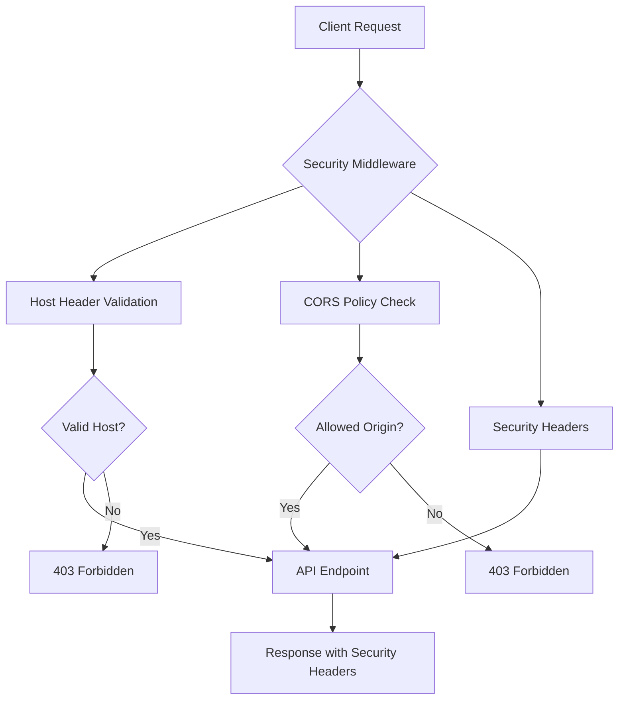
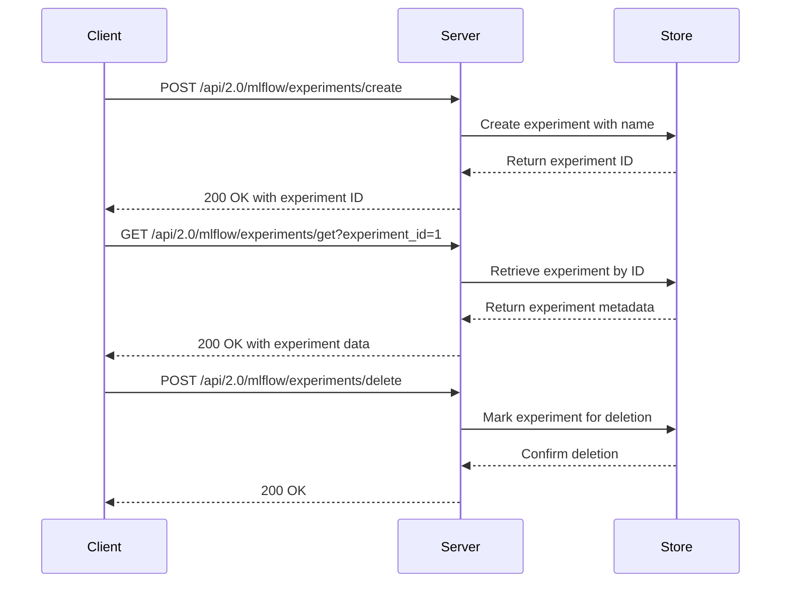
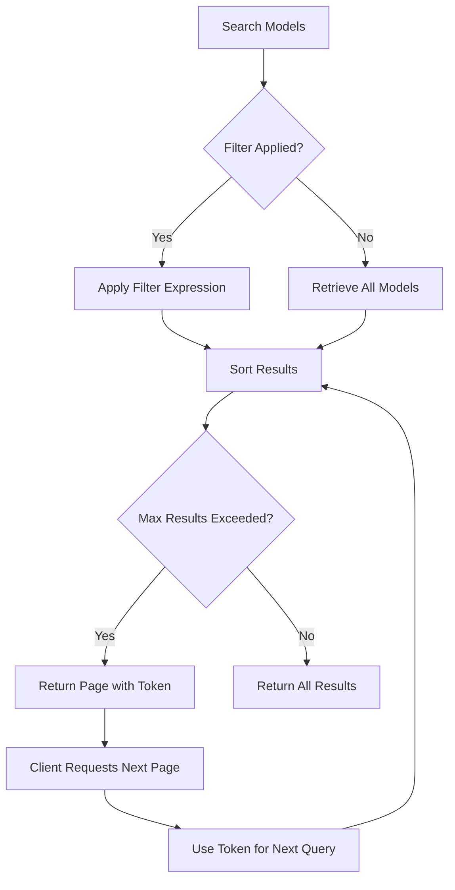
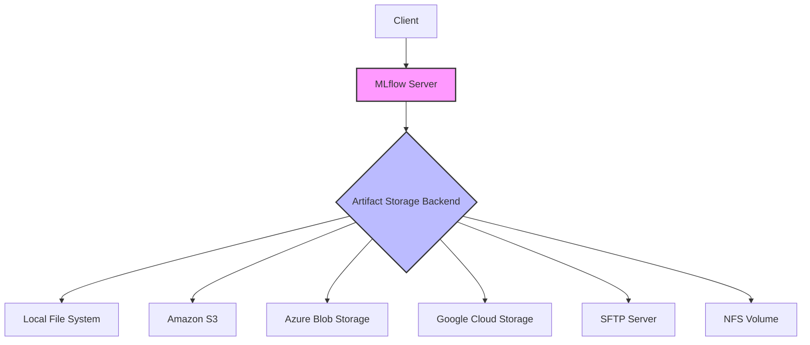
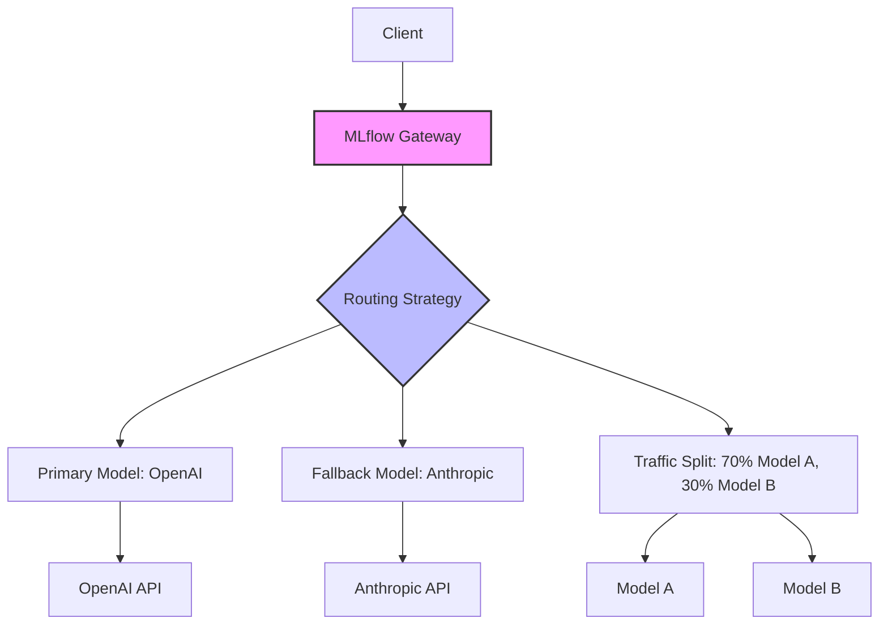
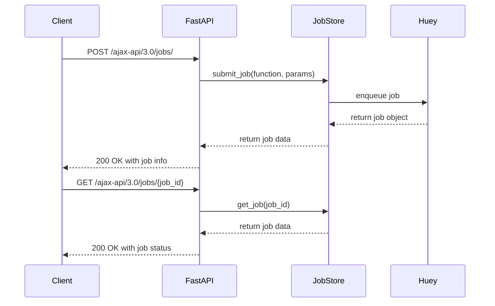
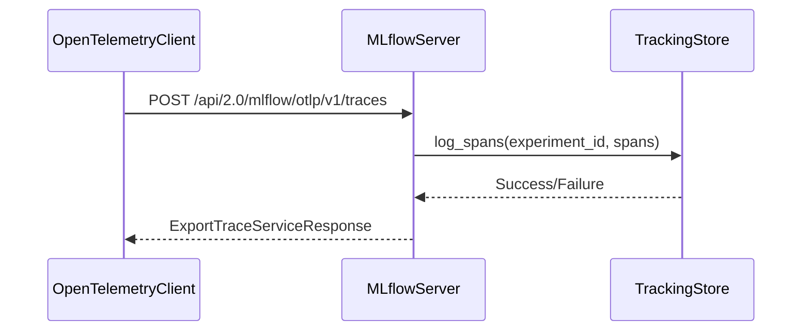
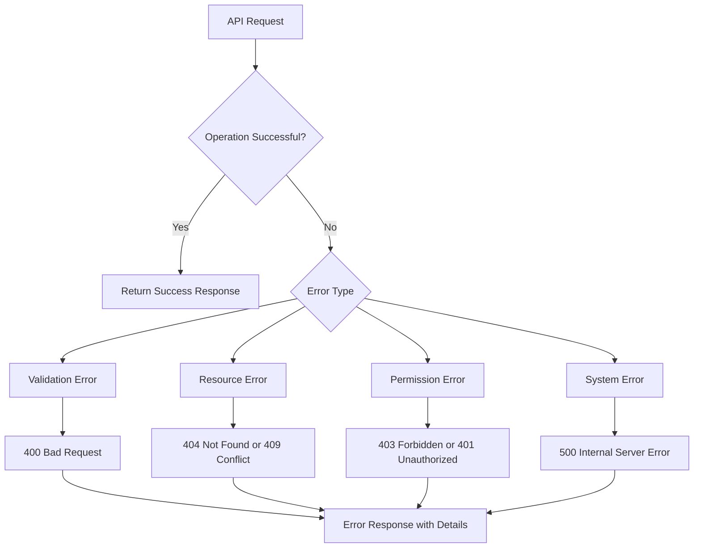

# REST API

<cite>
**Referenced Files in This Document**   
- [handlers.py](file://mlflow/server/handlers.py)
- [fastapi_app.py](file://mlflow/server/fastapi_app.py)
- [gateway_api.py](file://mlflow/server/gateway_api.py)
- [job_api.py](file://mlflow/server/job_api.py)
- [otel_api.py](file://mlflow/server/otel_api.py)
- [service.proto](file://mlflow/protos/service.proto)
- [model_registry.proto](file://mlflow/protos/model_registry.proto)
- [mlflow_artifacts.proto](file://mlflow/protos/mlflow_artifacts.proto)
- [security.py](file://mlflow/server/security.py)
- [auth.py](file://mlflow/server/auth/__init__.py)
</cite>

## Table of Contents
1. [Introduction](#introduction)
2. [API Versioning and Compatibility](#api-versioning-and-compatibility)
3. [Authentication and Authorization](#authentication-and-authorization)
4. [Experiment Tracking Endpoints](#experiment-tracking-endpoints)
5. [Model Registry Endpoints](#model-registry-endpoints)
6. [Artifact Management Endpoints](#artifact-management-endpoints)
7. [Gateway and Deployment Endpoints](#gateway-and-deployment-endpoints)
8. [Job Execution Endpoints](#job-execution-endpoints)
9. [OpenTelemetry Integration](#opentelemetry-integration)
10. [Request and Response Formats](#request-and-response-formats)
11. [Error Handling](#error-handling)
12. [Rate Limiting and Security](#rate-limiting-and-security)
13. [Client Library Generation](#client-library-generation)
14. [API Usage Examples](#api-usage-examples)

## Introduction

The MLflow server provides a comprehensive REST API for experiment tracking, model registry, and deployment operations. This API enables programmatic access to MLflow's core functionality, allowing integration with various machine learning workflows and tools. The API is designed to be consistent, predictable, and developer-friendly, following REST principles and providing clear endpoints for all MLflow operations.

The MLflow REST API is implemented using a combination of Flask and FastAPI, with the primary endpoints exposed through Flask for backward compatibility while leveraging FastAPI for newer endpoints and improved type safety. The API serves as the backbone for MLflow's client libraries in Python, R, Java, and other languages, as well as the web UI.

The API is organized into several logical groups:
- Experiment tracking: Creating and managing experiments, runs, metrics, parameters, and tags
- Model registry: Managing registered models, versions, and stages
- Artifact storage: Uploading, downloading, and managing model artifacts and other files
- Gateway services: Deploying and managing AI gateway endpoints for LLMs and other models
- Job execution: Submitting and managing background jobs
- OpenTelemetry integration: Ingesting trace data from OpenTelemetry clients

All endpoints follow a consistent pattern with versioned paths (e.g., `/api/2.0/mlflow/`) to ensure backward compatibility and support for future API evolution.

**Section sources**
- [handlers.py](file://mlflow/server/handlers.py#L1-L5111)
- [fastapi_app.py](file://mlflow/server/fastapi_app.py#L1-L63)

## API Versioning and Compatibility

MLflow employs a semantic versioning scheme for its REST API, with version numbers following the format `/api/{major}.{minor}/mlflow/`. The current stable API version is 2.0, which has been maintained for backward compatibility across multiple MLflow releases.

The API versioning is implemented through the endpoint definitions in the protobuf service definitions, where each endpoint specifies its version using the `since` field. For example:

```protobuf
rpc createExperiment(CreateExperiment) returns (CreateExperiment.Response) {
  option (rpc) = {
    endpoints: [
      {
        method: "POST"
        path: "/mlflow/experiments/create"
        since: {
          major: 2
          minor: 0
        }
      }
    ]
    visibility: PUBLIC
    rpc_doc_title: "Create Experiment"
  };
}
```

This approach allows MLflow to introduce new features and improvements while maintaining compatibility with existing clients. When backward-incompatible changes are necessary, they are introduced in a new major version (e.g., 3.0), while the previous version continues to be supported.

The API supports both JSON and Protocol Buffer (protobuf) formats for request and response bodies. While JSON is the default and most commonly used format, protobuf is supported for performance-critical applications that require more efficient serialization.

MLflow follows a deprecation policy where API endpoints are marked as deprecated before removal, with clear documentation and migration guidance provided. Deprecated endpoints continue to function for at least two major releases to allow clients sufficient time to migrate.

The server also supports API discovery through the use of OpenAPI/Swagger specifications, which can be generated from the protobuf definitions. This enables automatic client library generation and provides interactive API documentation.

**Section sources**
- [service.proto](file://mlflow/protos/service.proto#L1-L4612)
- [handlers.py](file://mlflow/server/handlers.py#L4590-L4789)

## Authentication and Authorization

MLflow provides flexible authentication and authorization mechanisms to secure the REST API. The server includes built-in security middleware that can be extended or replaced with custom authentication schemes.

### Security Middleware

The MLflow server includes security middleware that provides several layers of protection:

1. **Host header validation**: Prevents DNS rebinding attacks by validating the Host header against a whitelist of allowed hosts.
2. **CORS protection**: Configurable Cross-Origin Resource Sharing policies to control which domains can access the API.
3. **Security headers**: Automatic addition of security headers like X-Content-Type-Options and X-Frame-Options.

The security middleware is implemented in `security.py` and can be disabled using the `MLFLOW_SERVER_DISABLE_SECURITY_MIDDLEWARE` environment variable, though this is not recommended for production deployments.



**Diagram sources**
- [security.py](file://mlflow/server/security.py#L1-L116)

### Authentication Methods

MLflow supports multiple authentication methods through its plugin system:

1. **Basic Authentication**: Built-in support for username/password authentication.
2. **JWT Authentication**: Support for JSON Web Tokens, with example implementations provided.
3. **Custom Authentication**: Pluggable authentication system that allows integration with external identity providers.

The authentication system is configured through the `--app-name` flag when starting the MLflow server. For example:

```bash
mlflow server --app-name basic-auth
```

Custom authentication modules can be implemented by defining an `authenticate_request` function that validates incoming requests and returns appropriate authorization information.

### Authorization and Permissions

MLflow implements a role-based access control system that defines permissions for various operations:

- Experiment management (create, read, update, delete)
- Model registry operations (create, read, update, delete)
- User management
- Scorer operations

The permission system is extensible and can be customized based on organizational requirements. Permissions are enforced at the API endpoint level, with appropriate validation performed before executing operations.

**Section sources**
- [security.py](file://mlflow/server/security.py#L1-L116)
- [auth.py](file://mlflow/server/auth/__init__.py#L727-L1711)
- [jwt_auth.py](file://examples/jwt_auth/jwt_auth.py#L1-L44)

## Experiment Tracking Endpoints

The experiment tracking API provides endpoints for managing experiments, runs, metrics, parameters, and tags. These endpoints form the core of MLflow's experiment tracking functionality.

### Experiment Management

The experiment management endpoints allow creation, retrieval, updating, and deletion of experiments.



**Diagram sources**
- [service.proto](file://mlflow/protos/service.proto#L44-L153)
- [handlers.py](file://mlflow/server/handlers.py#L4616-L4617)

#### Create Experiment
- **Method**: POST
- **URL**: `/api/2.0/mlflow/experiments/create`
- **Request Body**:
```json
{
  "name": "string",
  "artifact_location": "string",
  "tags": [
    {
      "key": "string",
      "value": "string"
    }
  ]
}
```
- **Response**:
```json
{
  "experiment_id": "string"
}
```

#### Get Experiment
- **Method**: GET
- **URL**: `/api/2.0/mlflow/experiments/get?experiment_id={id}`
- **Response**:
```json
{
  "experiment": {
    "experiment_id": "string",
    "name": "string",
    "artifact_location": "string",
    "lifecycle_stage": "string",
    "creation_time": 0,
    "last_update_time": 0,
    "tags": [
      {
        "key": "string",
        "value": "string"
      }
    ]
  }
}
```

### Run Management

Run management endpoints handle the creation and modification of runs within experiments.

#### Create Run
- **Method**: POST
- **URL**: `/api/2.0/mlflow/runs/create`
- **Request Body**:
```json
{
  "experiment_id": "string",
  "run_name": "string",
  "start_time": 0,
  "tags": [
    {
      "key": "string",
      "value": "string"
    }
  ],
  "user_id": "string"
}
```
- **Response**:
```json
{
  "run": {
    "info": {
      "run_uuid": "string",
      "run_id": "string",
      "experiment_id": "string",
      "user_id": "string",
      "status": "string",
      "start_time": 0,
      "end_time": 0,
      "lifecycle_stage": "string",
      "artifact_uri": "string",
      "run_name": "string"
    },
    "data": {
      "tags": [
        {
          "key": "string",
          "value": "string"
        }
      ],
      "metrics": [
        {
          "key": "string",
          "value": 0,
          "timestamp": 0,
          "step": 0
        }
      ],
      "params": [
        {
          "key": "string",
          "value": "string"
        }
      ]
    }
  }
}
```

### Metric and Parameter Logging

The API provides endpoints for logging metrics and parameters to runs.

#### Log Metric
- **Method**: POST
- **URL**: `/api/2.0/mlflow/runs/log-metric`
- **Request Body**:
```json
{
  "run_id": "string",
  "key": "string",
  "value": 0,
  "timestamp": 0,
  "step": 0
}
```

#### Log Parameter
- **Method**: POST
- **URL**: `/api/2.0/mlflow/runs/log-parameter`
- **Request Body**:
```json
{
  "run_id": "string",
  "key": "string",
  "value": "string"
}
```

#### Log Batch
- **Method**: POST
- **URL**: `/api/2.0/mlflow/runs/log-batch`
- **Request Body**:
```json
{
  "run_id": "string",
  "metrics": [
    {
      "key": "string",
      "value": 0,
      "timestamp": 0,
      "step": 0
    }
  ],
  "params": [
    {
      "key": "string",
      "value": "string"
    }
  ],
  "tags": [
    {
      "key": "string",
      "value": "string"
    }
  ]
}
```

This batch endpoint is particularly useful for reducing network overhead when logging multiple metrics, parameters, and tags simultaneously.

**Section sources**
- [service.proto](file://mlflow/protos/service.proto#L174-L200)
- [handlers.py](file://mlflow/server/handlers.py#L4616-L4617)

## Model Registry Endpoints

The model registry API provides endpoints for managing registered models, model versions, and their stages. This functionality enables model lifecycle management and promotes models between stages (e.g., from staging to production).

### Model Registration

The model registration endpoints allow creation and management of registered models.

#### Create Registered Model
- **Method**: POST
- **URL**: `/api/2.0/mlflow/registered-models/create`
- **Request Body**:
```json
{
  "name": "string",
  "tags": [
    {
      "key": "string",
      "value": "string"
    }
  ],
  "description": "string"
}
```
- **Response**:
```json
{
  "registered_model": {
    "name": "string",
    "creation_timestamp": 0,
    "last_updated_timestamp": 0,
    "description": "string",
    "latest_versions": [
      {
        "name": "string",
        "version": "string",
        "creation_timestamp": 0,
        "last_updated_timestamp": 0,
        "description": "string",
        "user_id": "string",
        "current_stage": "string",
        "source": "string",
        "run_id": "string",
        "status": "string",
        "status_message": "string",
        "aliases": [
          "string"
        ],
        "tags": [
          {
            "key": "string",
            "value": "string"
          }
        ]
      }
    ],
    "tags": [
      {
        "key": "string",
        "value": "string"
      }
    ]
  }
}
```

### Model Version Management

Model version endpoints handle the creation, retrieval, and transition of model versions.

#### Create Model Version
- **Method**: POST
- **URL**: `/api/2.0/mlflow/model-versions/create`
- **Request Body**:
```json
{
  "name": "string",
  "source": "string",
  "run_id": "string",
  "run_link": "string",
  "description": "string",
  "tags": [
    {
      "key": "string",
      "value": "string"
    }
  ],
  "await_creation_for": 0
}
```

#### Transition Model Version Stage
- **Method**: POST
- **URL**: `/api/2.0/mlflow/model-versions/transition-stage`
- **Request Body**:
```json
{
  "name": "string",
  "version": "string",
  "stage": "string",
  "archive_existing_versions": false
}
```

This endpoint is crucial for model deployment workflows, allowing controlled promotion of models between stages like "Staging", "Production", and "Archived".

### Model Search and Retrieval

The API provides comprehensive search capabilities for discovering models and versions.

#### Search Registered Models
- **Method**: POST
- **URL**: `/api/2.0/mlflow/registered-models/search`
- **Request Body**:
```json
{
  "filter": "string",
  "max_results": 0,
  "order_by": [
    "string"
  ],
  "page_token": "string"
}
```
- **Response**:
```json
{
  "registered_models": [
    {
      "name": "string",
      "creation_timestamp": 0,
      "last_updated_timestamp": 0,
      "description": "string",
      "latest_versions": [
        {
          "name": "string",
          "version": "string",
          "creation_timestamp": 0,
          "last_updated_timestamp": 0,
          "description": "string",
          "user_id": "string",
          "current_stage": "string",
          "source": "string",
          "run_id": "string",
          "status": "string",
          "status_message": "string",
          "aliases": [
            "string"
          ],
          "tags": [
            {
              "key": "string",
              "value": "string"
            }
          ]
          }
        ],
        "tags": [
          {
            "key": "string",
            "value": "string"
          }
        ]
      }
    ],
    "next_page_token": "string"
  }
```

The search functionality supports filtering by name, tags, and other attributes, with pagination support for large result sets.



**Diagram sources**
- [model_registry.proto](file://mlflow/protos/model_registry.proto#L1-L200)
- [handlers.py](file://mlflow/server/handlers.py#L4617-L4617)

**Section sources**
- [model_registry.proto](file://mlflow/protos/model_registry.proto#L1-L200)
- [handlers.py](file://mlflow/server/handlers.py#L4617-L4617)

## Artifact Management Endpoints

The artifact management API provides endpoints for uploading, downloading, and managing artifacts associated with runs and models. Artifacts can include model files, datasets, images, and any other files generated during the machine learning workflow.

### Artifact Storage Architecture

MLflow supports multiple artifact storage backends, including:
- Local file system
- Amazon S3
- Azure Blob Storage
- Google Cloud Storage
- SFTP servers
- NFS volumes

The artifact storage is configured when starting the MLflow server using the `--default-artifact-root` option. The server acts as a proxy for artifact operations, handling authentication and authorization while delegating storage operations to the appropriate backend.



**Diagram sources**
- [handlers.py](file://mlflow/server/handlers.py#L358-L368)

### Core Artifact Endpoints

#### List Artifacts
- **Method**: GET
- **URL**: `/api/2.0/mlflow/artifacts/list?run_id={run_id}&path={path}`
- **Response**:
```json
{
  "root_uri": "string",
  "files": [
    {
      "path": "string",
      "is_dir": false,
      "file_size": 0
    }
  ]
}
```

#### Download Artifact
- **Method**: GET
- **URL**: `/api/2.0/mlflow/artifacts/download?run_id={run_id}&path={path}`
- **Response**: File content with appropriate Content-Type header

#### Upload Artifact
- **Method**: POST
- **URL**: `/api/2.0/mlflow/artifacts/upload`
- **Request**: Multipart form data with `run_id`, `path`, and `file` fields
- **Response**: 200 OK on success

### Multipart Upload Support

For large artifacts, MLflow supports multipart uploads to improve reliability and enable resumable uploads.

#### Create Multipart Upload
- **Method**: POST
- **URL**: `/api/2.0/mlflow-artifacts/artifacts/create-multipart-upload`
- **Request Body**:
```json
{
  "run_id": "string",
  "path": "string"
}
```
- **Response**:
```json
{
  "upload_id": "string",
  "upload_parts": [
    {
      "part_number": 0,
      "signed_url": "string"
    }
  ]
}
```

#### Complete Multipart Upload
- **Method**: POST
- **URL**: `/api/2.0/mlflow-artifacts/artifacts/complete-multipart-upload`
- **Request Body**:
```json
{
  "run_id": "string",
  "path": "string",
  "upload_id": "string",
  "upload_parts": [
    {
      "part_number": 0,
      "etag": "string"
    }
  ]
}
```

The multipart upload process allows clients to upload large files in smaller chunks, with each chunk uploaded directly to the storage backend using pre-signed URLs. This reduces memory usage on the MLflow server and enables parallel uploads for improved performance.

**Section sources**
- [mlflow_artifacts.proto](file://mlflow/protos/mlflow_artifacts.proto#L72-L80)
- [handlers.py](file://mlflow/server/handlers.py#L377-L383)

## Gateway and Deployment Endpoints

The gateway API provides endpoints for deploying and managing AI gateway endpoints, enabling integration with large language models (LLMs) and other AI services. This functionality allows MLflow to act as a unified interface for various AI models and services.

### Gateway Architecture

The gateway system is designed to provide a consistent interface for different AI providers while supporting advanced features like routing, fallback, and traffic splitting.



**Diagram sources**
- [gateway_api.py](file://mlflow/server/gateway_api.py#L1-L651)

### Endpoint Management

#### Create Gateway Endpoint
- **Method**: POST
- **URL**: `/api/2.0/mlflow/gateway/endpoints`
- **Request Body**:
```json
{
  "name": "string",
  "endpoint_type": "CHAT",
  "route_type": "LLM_V1",
  "models": [
    {
      "name": "string",
      "provider": "OPENAI",
      "config": {
        "openai_api_key": "string",
        "openai_api_base": "string",
        "openai_api_type": "string",
        "openai_api_version": "string",
        "openai_deployment_name": "string"
      },
      "weight": 0.5,
      "linkage_type": "PRIMARY"
    }
  ],
  "routing_strategy": "REQUEST_LEVEL_RANDOM",
  "fallback_config": {
    "strategy": "NEXT_IN_LINE",
    "max_attempts": 3
  }
}
```

The endpoint configuration supports multiple models with different linkage types (PRIMARY, FALLBACK) and weights for traffic splitting. The routing strategy determines how requests are distributed among models, while the fallback configuration specifies behavior when primary models fail.

### Model Invocation

The gateway provides multiple endpoints for model invocation, supporting different client requirements.

#### Unified Invocations Endpoint
- **Method**: POST
- **URL**: `/gateway/{endpoint_name}/mlflow/invocations`
- **Request Body**:
```json
{
  "model": "endpoint_name",
  "messages": [
    {
      "role": "user",
      "content": "Hello, how are you?"
    }
  ],
  "temperature": 0.7,
  "max_tokens": 100
}
```

#### OpenAI-Compatible Endpoint
- **Method**: POST
- **URL**: `/gateway/mlflow/v1/chat/completions`
- **Request Body**:
```json
{
  "model": "endpoint_name",
  "messages": [
    {
      "role": "user",
      "content": "Hello, how are you?"
    }
  ],
  "temperature": 0.7,
  "max_tokens": 100
}
```

The OpenAI-compatible endpoint allows clients to use standard OpenAI SDKs with MLflow gateway endpoints, facilitating integration with existing applications.

### Provider Support

The gateway supports multiple AI providers:

- **OpenAI**: Standard OpenAI models and Azure OpenAI Service
- **Anthropic**: Claude models
- **Amazon Bedrock**: Foundation models via AWS Bedrock
- **Google Gemini**: Gemini models
- **Mistral AI**: Mistral models
- **LiteLLM**: Unified interface for 100+ LLMs

Each provider has specific configuration options that can be set in the endpoint configuration. For example, AWS Bedrock supports multiple authentication methods including IAM roles, access keys, and temporary credentials.

**Section sources**
- [gateway_api.py](file://mlflow/server/gateway_api.py#L1-L651)
- [handlers.py](file://mlflow/server/handlers.py#L5089-L5093)

## Job Execution Endpoints

The job execution API provides endpoints for submitting and managing background jobs. This functionality enables long-running operations to be executed asynchronously, improving the responsiveness of the MLflow server.

### Job API Structure

The job execution endpoints are implemented as FastAPI routes, providing a modern, type-safe interface for job management.



**Diagram sources**
- [job_api.py](file://mlflow/server/job_api.py#L1-L134)

### Job Management Endpoints

#### Submit Job
- **Method**: POST
- **URL**: `/ajax-api/3.0/jobs/`
- **Request Body**:
```json
{
  "job_name": "string",
  "params": {
    "key": "value"
  },
  "timeout": 3600
}
```
- **Response**:
```json
{
  "job_id": "string",
  "creation_time": 0,
  "job_name": "string",
  "params": {
    "key": "value"
  },
  "timeout": 3600,
  "status": "PENDING",
  "result": null,
  "retry_count": 0,
  "last_update_time": 0
}
```

#### Get Job Status
- **Method**: GET
- **URL**: `/ajax-api/3.0/jobs/{job_id}`
- **Response**: Job status information as shown above

#### Cancel Job
- **Method**: PATCH
- **URL**: `/ajax-api/3.0/jobs/cancel/{job_id}`
- **Response**: Updated job information with status set to CANCELLED

#### Search Jobs
- **Method**: POST
- **URL**: `/ajax-api/3.0/jobs/search`
- **Request Body**:
```json
{
  "job_name": "string",
  "params": {
    "key": "value"
  },
  "statuses": ["PENDING", "IN_PROGRESS"]
}
```
- **Response**:
```json
{
  "jobs": [
    {
      "job_id": "string",
      "creation_time": 0,
      "job_name": "string",
      "params": {
        "key": "value"
      },
      "timeout": 3600,
      "status": "PENDING",
      "result": null,
      "retry_count": 0,
      "last_update_time": 0
    }
  ]
}
```

The job execution system uses Huey as the task queue backend, providing reliable job processing with support for retries, scheduling, and monitoring. Jobs are stored in the same database as other MLflow entities, ensuring consistency and enabling comprehensive audit trails.

**Section sources**
- [job_api.py](file://mlflow/server/job_api.py#L1-L134)
- [handlers.py](file://mlflow/server/handlers.py#L531-L556)

## OpenTelemetry Integration

MLflow provides native integration with OpenTelemetry, enabling ingestion of trace data from OpenTelemetry clients. This functionality supports observability and monitoring of machine learning workflows.

### OTLP Endpoint

The OpenTelemetry Protocol (OTLP) endpoint accepts trace data in protobuf format, conforming to the OTLP/HTTP specification.

#### Export Traces
- **Method**: POST
- **URL**: `/api/2.0/mlflow/otlp/v1/traces`
- **Headers**:
  - `Content-Type: application/x-protobuf`
  - `X-MLflow-Experiment-Id: {experiment_id}`
- **Request Body**: OTLP ExportTraceServiceRequest in protobuf format
- **Response**: OTLP ExportTraceServiceResponse in protobuf format

The endpoint requires the `X-MLflow-Experiment-Id` header to specify the experiment where traces should be stored. This enables correlation of trace data with specific experiments and runs.



**Diagram sources**
- [otel_api.py](file://mlflow/server/otel_api.py#L1-L176)

### Trace Data Model

MLflow converts incoming OpenTelemetry spans to its native trace format, preserving key information:

- Span ID and trace ID
- Parent span relationship
- Start and end times
- Attributes and events
- Status and error information

The converted spans are stored in the MLflow tracking store, where they can be queried and visualized alongside other experiment data. This integration enables comprehensive observability of machine learning workflows, from data preprocessing to model inference.

The OTLP endpoint supports gzip compression for improved network efficiency, with the `Content-Encoding: gzip` header indicating compressed payloads. The server automatically decompresses incoming data before processing.

**Section sources**
- [otel_api.py](file://mlflow/server/otel_api.py#L1-L176)
- [handlers.py](file://mlflow/server/handlers.py#L235-L238)

## Request and Response Formats

The MLflow REST API uses consistent request and response formats across all endpoints, making it predictable and easy to use. The API primarily uses JSON for request and response bodies, with Protocol Buffer support for performance-critical applications.

### Common Request Structure

Most API requests follow a similar structure with the following components:

- **HTTP Method**: Typically POST for mutations, GET for queries
- **URL**: Versioned path following the pattern `/api/{version}/mlflow/{resource}/{action}`
- **Headers**: Content-Type, Authorization, and other metadata
- **Body**: JSON object with request parameters

Query parameters are used for simple GET requests, while complex operations use JSON request bodies. For example:

```bash
# Using query parameters for simple GET
GET /api/2.0/mlflow/experiments/get?experiment_id=1

# Using JSON body for complex POST
POST /api/2.0/mlflow/experiments/search
Content-Type: application/json

{
  "filter": "attribute.name = 'production'",
  "max_results": 100
}
```

### Response Structure

API responses follow a consistent pattern:

```json
{
  "resource_name": {
    // Resource data
  },
  "next_page_token": "string"  // For paginated responses
}
```

Successful responses use HTTP status code 200, while errors use appropriate HTTP status codes with detailed error information in the response body.

### Error Response Format

Error responses follow a standardized format:

```json
{
  "error_code": "string",
  "message": "string"
}
```

The `error_code` field provides a machine-readable identifier for the error type, while the `message` field contains a human-readable description. Common error codes include:

- `INVALID_PARAMETER_VALUE`: Invalid or missing parameter
- `RESOURCE_DOES_NOT_EXIST`: Requested resource not found
- `RESOURCE_ALREADY_EXISTS`: Resource already exists
- `PERMISSION_DENIED`: Insufficient permissions
- `INTERNAL_ERROR`: Internal server error

This consistent error handling makes it easier for clients to handle different error conditions appropriately.

**Section sources**
- [handlers.py](file://mlflow/server/handlers.py#L786-L797)
- [service.proto](file://mlflow/protos/service.proto#L1-L4612)

## Error Handling

MLflow's REST API implements comprehensive error handling to provide clear feedback to clients when operations fail. The error handling system is designed to be informative while maintaining security by not exposing sensitive implementation details.

### Error Response Structure

All error responses follow a consistent JSON format:

```json
{
  "error_code": "INVALID_PARAMETER_VALUE",
  "message": "Invalid value for parameter 'experiment_id': must be a non-empty string"
}
```

The response includes:
- **error_code**: A standardized code that identifies the error type
- **message**: A descriptive message explaining the error

The HTTP status code corresponds to the error type, with common mappings including:
- 400 Bad Request: INVALID_PARAMETER_VALUE
- 404 Not Found: RESOURCE_DOES_NOT_EXIST
- 409 Conflict: RESOURCE_ALREADY_EXISTS
- 403 Forbidden: PERMISSION_DENIED
- 500 Internal Server Error: INTERNAL_ERROR

### Common Error Types

#### Validation Errors
Validation errors occur when request parameters fail validation. These include:
- Missing required parameters
- Invalid parameter types
- Values outside allowed ranges
- Malformed JSON

The API provides specific error messages that identify the problematic parameter and suggest corrections.

#### Resource Errors
Resource errors relate to the existence and state of resources:
- RESOURCE_DOES_NOT_EXIST: Requested resource not found
- RESOURCE_ALREADY_EXISTS: Attempt to create a resource that already exists
- INVALID_STATE: Resource is in a state that doesn't allow the requested operation

#### Permission Errors
Permission errors occur when the authenticated user lacks sufficient privileges:
- PERMISSION_DENIED: User doesn't have permission to perform the operation
- UNAUTHENTICATED: No valid authentication credentials provided

#### System Errors
System errors indicate problems with the MLflow server or its dependencies:
- INTERNAL_ERROR: Unspecified internal error
- TEMPORARY_UNAVAILABLE: Service temporarily unavailable
- BAD_REQUEST: Malformed request

The error handling system is implemented in the `catch_mlflow_exception` decorator in `handlers.py`, which wraps all API endpoints to ensure consistent error reporting.



**Diagram sources**
- [handlers.py](file://mlflow/server/handlers.py#L786-L797)

**Section sources**
- [handlers.py](file://mlflow/server/handlers.py#L786-L797)
- [exceptions.py](file://mlflow/exceptions.py#L1-L100)

## Rate Limiting and Security

MLflow implements several security measures to protect the REST API from abuse and ensure reliable service for legitimate users.

### Rate Limiting

While the core MLflow server does not include built-in rate limiting, it can be deployed behind reverse proxies or API gateways that provide rate limiting capabilities. The server's architecture supports integration with external rate limiting systems through custom middleware.

For high-traffic deployments, it is recommended to use a reverse proxy like NGINX or a cloud-based API gateway to implement rate limiting based on:
- IP address
- Authentication token
- API key
- User account

Rate limiting helps prevent denial-of-service attacks and ensures fair resource allocation among users.

### Security Headers

The MLflow server automatically adds security headers to all responses:

- **X-Content-Type-Options: nosniff**: Prevents MIME type sniffing attacks
- **X-Frame-Options**: Controls whether the response can be embedded in frames (configurable via MLFLOW_SERVER_X_FRAME_OPTIONS)
- **Content-Security-Policy**: Not currently implemented, but can be added via reverse proxy

These headers help protect against common web vulnerabilities like cross-site scripting (XSS) and clickjacking.

### Input Validation

The API implements strict input validation to prevent injection attacks and other security issues:

- All string inputs are validated for proper encoding
- Path parameters are validated to prevent directory traversal
- JSON payloads are parsed safely to prevent prototype pollution
- Query parameters are validated against expected types and formats

The validation system is implemented in the `_validate_param_against_schema` function in `handlers.py`, which applies type and value checks to all request parameters.

### Secure Artifact Handling

When serving artifacts, the server takes precautions to prevent security issues:

- Artifacts are always served as attachments to prevent XSS via HTML files
- File paths are validated to prevent directory traversal
- Content types are guessed from file extensions to prevent MIME type confusion

The `_send_artifact` function in `handlers.py` implements these security measures when serving artifact files.

**Section sources**
- [security.py](file://mlflow/server/security.py#L1-L116)
- [handlers.py](file://mlflow/server/handlers.py#L776-L783)

## Client Library Generation

MLflow provides tools and specifications for generating client libraries in various programming languages, enabling integration with different technology stacks.

### OpenAPI/Swagger Specification

The MLflow API can be described using OpenAPI (formerly Swagger) specifications, which provide a machine-readable description of the API. This specification can be used to generate client libraries, documentation, and testing tools.

While MLflow does not currently expose an OpenAPI document directly, the protobuf service definitions can be converted to OpenAPI format using tools like `protoc-gen-openapi`. The conversion process involves:

1. Extracting endpoint information from protobuf service definitions
2. Converting protobuf message types to JSON schemas
3. Generating OpenAPI paths and operations
4. Adding metadata like security schemes and server information

### Client Library Generation

Client libraries can be generated from the OpenAPI specification using code generation tools:

- **Python**: `openapi-generator generate -i spec.yaml -g python -o client`
- **JavaScript**: `openapi-generator generate -i spec.yaml -g javascript -o client`
- **Java**: `openapi-generator generate -i spec.yaml -g java -o client`
- **Go**: `openapi-generator generate -i spec.yaml -g go -o client`

The generated clients provide type-safe interfaces for all API endpoints, with automatic serialization and deserialization of request and response bodies.

### Manual Client Implementation

For languages not supported by code generators, or for custom requirements, manual client implementation is straightforward due to the API's consistent design:

```python
import requests
import json

class MLflowClient:
    def __init__(self, tracking_uri):
        self.tracking_uri = tracking_uri.rstrip("/")
    
    def create_experiment(self, name):
        url = f"{self.tracking_uri}/api/2.0/mlflow/experiments/create"
        response = requests.post(url, json={"name": name})
        response.raise_for_status()
        return response.json()["experiment_id"]
    
    def log_metric(self, run_id, key, value):
        url = f"{self.tracking_uri}/api/2.0/mlflow/runs/log-metric"
        response = requests.post(url, json={
            "run_id": run_id,
            "key": key,
            "value": value
        })
        response.raise_for_status()
```

The MLflow Python client library follows this pattern, providing a convenient interface to the REST API while adding higher-level functionality like automatic run management and artifact handling.

**Section sources**
- [service.proto](file://mlflow/protos/service.proto#L1-L4612)
- [handlers.py](file://mlflow/server/handlers.py#L4590-L4789)

## API Usage Examples

This section provides practical examples of using the MLflow REST API with various HTTP clients.

### Creating an Experiment with curl

```bash
curl -X POST 'http://localhost:5000/api/2.0/mlflow/experiments/create' \
  -H 'Content-Type: application/json' \
  -d '{
    "name": "my-experiment",
    "artifact_location": "/tmp/mlruns/my-experiment"
  }'
```

Response:
```json
{"experiment_id":"1"}
```

### Logging Metrics with Python Requests

```python
import requests
import json

# Create a run
response = requests.post(
    'http://localhost:5000/api/2.0/mlflow/runs/create',
    json={'experiment_id': '1', 'run_name': 'test-run'}
)
run_id = response.json()['run']['info']['run_id']

# Log metrics
metrics = [
    {'key': 'accuracy', 'value': 0.95, 'timestamp': 1234567890, 'step': 1},
    {'key': 'loss', 'value': 0.05, 'timestamp': 1234567890, 'step': 1}
]

response = requests.post(
    'http://localhost:5000/api/2.0/mlflow/runs/log-batch',
    json={'run_id': run_id, 'metrics': metrics}
)
response.raise_for_status()
```

### Registering a Model

```bash
curl -X POST 'http://localhost:5000/api/2.0/mlflow/registered-models/create' \
  -H 'Content-Type: application/json' \
  -d '{
    "name": "my-model",
    "description": "A test model"
  }'
```

### Transitioning a Model Version

```bash
curl -X POST 'http://localhost:5000/api/2.0/mlflow/model-versions/transition-stage' \
  -H 'Content-Type: application/json' \
  -d '{
    "name": "my-model",
    "version": "1",
    "stage": "Production"
  }'
```

### Using the Gateway API

```bash
# Create a gateway endpoint
curl -X POST 'http://localhost:5000/api/2.0/mlflow/gateway/endpoints' \
  -H 'Content-Type: application/json' \
  -d '{
    "name": "openai-chat",
    "endpoint_type": "CHAT",
    "models": [
      {
        "name": "gpt-3.5-turbo",
        "provider": "OPENAI",
        "config": {
          "openai_api_key": "sk-..."
        },
        "linkage_type": "PRIMARY"
      }
    ]
  }'

# Invoke the endpoint
curl -X POST 'http://localhost:5000/gateway/openai-chat/mlflow/invocations' \
  -H 'Content-Type: application/json' \
  -d '{
    "messages": [
      {"role": "user", "content": "Hello, how are you?"}
    ]
  }'
```

### Error Handling Example

```python
import requests

def create_experiment_safely(tracking_uri, name):
    url = f"{tracking_uri}/api/2.0/mlflow/experiments/create"
    
    try:
        response = requests.post(url, json={'name': name})
        response.raise_for_status()
        return response.json()['experiment_id']
    except requests.exceptions.HTTPError as e:
        if e.response.status_code == 400:
            error_data = e.response.json()
            print(f"Validation error: {error_data['message']}")
        elif e.response.status_code == 409:
            print(f"Experiment '{name}' already exists")
        else:
            print(f"HTTP error: {e}")
        return None
    except requests.exceptions.RequestException as e:
        print(f"Request failed: {e}")
        return None

# Usage
experiment_id = create_experiment_safely('http://localhost:5000', 'my-experiment')
```

These examples demonstrate the simplicity and consistency of the MLflow REST API, making it accessible to developers regardless of their preferred programming language or tools.

**Section sources**
- [handlers.py](file://mlflow/server/handlers.py#L4616-L4617)
- [service.proto](file://mlflow/protos/service.proto#L1-L4612)