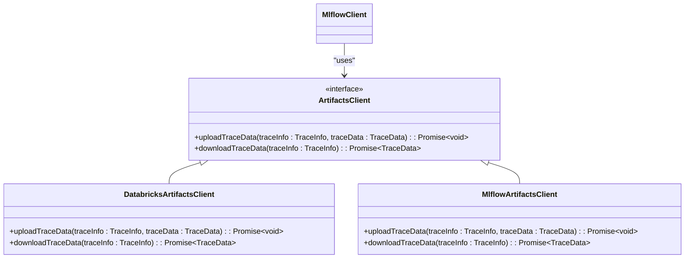
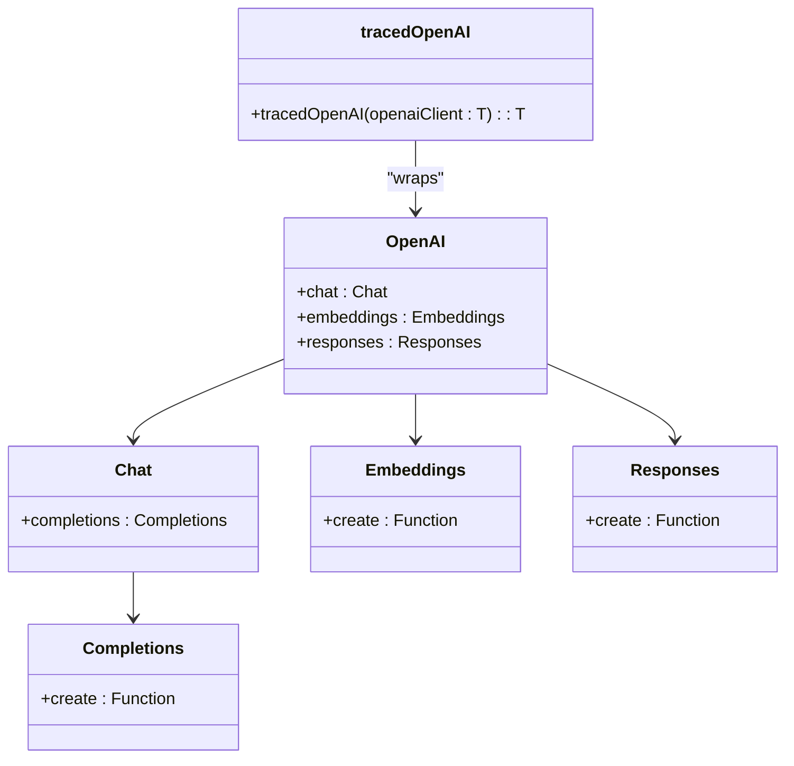
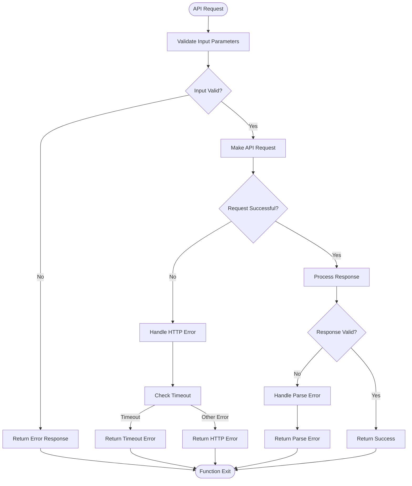

# TypeScript API

<cite>
**Referenced Files in This Document**   
- [index.ts](file://libs/typescript/core/src/index.ts)
- [client.ts](file://libs/typescript/core/src/clients/client.ts)
- [api.ts](file://libs/typescript/core/src/core/api.ts)
- [trace_manager.ts](file://libs/typescript/core/src/core/trace_manager.ts)
- [auth/index.ts](file://libs/typescript/core/src/auth/index.ts)
- [artifacts/index.ts](file://libs/typescript/core/src/clients/artifacts/index.ts)
- [spec.ts](file://libs/typescript/core/src/clients/spec.ts)
- [constants.ts](file://libs/typescript/core/src/core/constants.ts)
- [span.ts](file://libs/typescript/core/src/core/entities/span.ts)
- [trace_info.ts](file://libs/typescript/core/src/core/entities/trace_info.ts)
- [trace_data.ts](file://libs/typescript/core/src/core/entities/trace_data.ts)
- [utils.ts](file://libs/typescript/core/src/clients/utils.ts)
- [integrations/openai/src/index.ts](file://libs/typescript/integrations/openai/src/index.ts)
</cite>

## Table of Contents
1. [Introduction](#introduction)
2. [MlflowClient Class](#mlflowclient-class)
3. [Tracing API](#tracing-api)
4. [Authentication](#authentication)
5. [Artifacts Management](#artifacts-management)
6. [Integration with OpenAI](#integration-with-openai)
7. [Error Handling](#error-handling)
8. [Best Practices](#best-practices)

## Introduction

The MLflow TypeScript SDK provides a comprehensive interface for interacting with MLflow servers from both web applications and Node.js environments. This documentation covers the core `MlflowClient` class and its methods for managing experiments, runs, and model registry operations. It also details the tracing API for capturing LLM application data in JavaScript environments.

The SDK is designed with type safety in mind, providing full TypeScript support with comprehensive type annotations and interfaces. It supports both browser and Node.js environments, making it suitable for a wide range of applications from frontend interfaces to backend services.

**Section sources**
- [index.ts](file://libs/typescript/core/src/index.ts#L1-L34)

## MlflowClient Class

The `MlflowClient` class is the primary interface for interacting with MLflow servers. It provides methods for creating and managing experiments, retrieving runs, and handling model registry operations.

```mermaid
classDiagram
class MlflowClient {
-artifactsClient : ArtifactsClient
-headersProvider : HeadersProvider
-hostUrl : string
+constructor(options : {trackingUri : string, authProvider : AuthProvider})
+getHost() : string
+createTrace(traceInfo : TraceInfo) : Promise~TraceInfo~
+getTrace(traceId : string) : Promise~Trace~
+getTraceInfo(traceId : string) : Promise~TraceInfo~
+uploadTraceData(traceInfo : TraceInfo, traceData : TraceData) : Promise~void~
+createExperiment(name : string, artifactLocation? : string, tags? : Record~string, string~) : Promise~string~
+deleteExperiment(experimentId : string) : Promise~void~
}
class ArtifactsClient {
<<interface>>
+uploadTraceData(traceInfo : TraceInfo, traceData : TraceData) : Promise~void~
+downloadTraceData(traceInfo : TraceInfo) : Promise~TraceData~
}
class HeadersProvider {
<<interface>>
() : Promise~Record~string, string~~
}
MlflowClient --> ArtifactsClient : "uses"
MlflowClient --> HeadersProvider : "depends on"
```

**Diagram sources **
- [client.ts](file://libs/typescript/core/src/clients/client.ts#L16-L134)

### Constructor

The `MlflowClient` constructor requires configuration options to establish a connection to the MLflow server:

```typescript
constructor(options: { trackingUri: string; authProvider: AuthProvider })
```

- `trackingUri`: The tracking URI (e.g., "databricks", "http://localhost:5000")
- `authProvider`: The authentication provider for authenticated requests

**Section sources**
- [client.ts](file://libs/typescript/core/src/clients/client.ts#L32-L41)

### Trace Management Methods

The `MlflowClient` provides several methods for managing traces:

- `createTrace(traceInfo: TraceInfo)`: Creates a new TraceInfo record in the backend store
- `getTrace(traceId: string)`: Retrieves a complete trace by ID, including both trace info and data
- `getTraceInfo(traceId: string)`: Gets trace info using the V3 API
- `uploadTraceData(traceInfo: TraceInfo, traceData: TraceData)`: Uploads trace data to the artifact store

These methods enable comprehensive trace lifecycle management, from creation to retrieval and data upload.

**Section sources**
- [client.ts](file://libs/typescript/core/src/clients/client.ts#L58-L103)

### Experiment Management Methods

The client also provides methods for experiment management:

- `createExperiment(name: string, artifactLocation?: string, tags?: Record<string, string>)`: Creates a new experiment
- `deleteExperiment(experimentId: string)`: Deletes an experiment

These methods allow for programmatic management of MLflow experiments, enabling automation of experiment workflows.

**Section sources**
- [client.ts](file://libs/typescript/core/src/clients/client.ts#L109-L132)

## Tracing API

The MLflow tracing API provides a powerful mechanism for capturing LLM application data in JavaScript environments. It offers both imperative and declarative approaches to tracing.

```mermaid
classDiagram
class SpanOptions {
+name : string
+spanType? : SpanType
+inputs? : any
+attributes? : Record~string, any~
+startTimeNs? : number
+parent? : LiveSpan
}
class TraceOptions {
+name? : string
+spanType? : SpanType
+attributes? : Record~string, any~
}
class LiveSpan {
+traceId : string
+spanId : string
+parentId : string | null
+name : string
+spanType : SpanType
+startTime : HrTime
+endTime : HrTime | null
+status : SpanStatus
+inputs : any
+outputs : any
+attributes : Record~string, any~
+events : SpanEvent[]
+setSpanType(spanType : SpanType) : void
+setInputs(inputs : any) : void
+setOutputs(outputs : any) : void
+setAttribute(key : string, value : any) : void
+setAttributes(attributes : Record~string, any~) : void
+addEvent(event : SpanEvent) : void
+recordException(error : Error) : void
+setStatus(status : SpanStatus | SpanStatusCode | string, description? : string) : void
+end(options? : {outputs? : any, attributes? : Record~string, any~, status? : SpanStatus | SpanStatusCode, endTimeNs? : number}) : void
}
class TraceInfo {
+traceId : string
+traceLocation : TraceLocation
+requestTime : number
+state : TraceState
+requestPreview? : string
+responsePreview? : string
+clientRequestId? : string
+executionDuration? : number
+traceMetadata : Record~string, string~
+tags : Record~string, string~
+assessments : any[]
+tokenUsage : TokenUsage | null
}
class TraceData {
+spans : ISpan[]
+toJson() : SerializedTraceData
+fromJson(json : SerializedTraceData) : TraceData
}
class Trace {
+info : TraceInfo
+data : TraceData
+toJson() : SerializedTrace
+fromJson(json : SerializedTrace) : Trace
}
LiveSpan --> SpanOptions : "implements"
TraceInfo --> TraceMetadataKey : "uses"
Trace --> TraceInfo : "contains"
Trace --> TraceData : "contains"
```

**Diagram sources **
- [api.ts](file://libs/typescript/core/src/core/api.ts#L13-L65)
- [span.ts](file://libs/typescript/core/src/core/entities/span.ts#L71-L648)
- [trace_info.ts](file://libs/typescript/core/src/core/entities/trace_info.ts#L17-L216)
- [trace_data.ts](file://libs/typescript/core/src/core/entities/trace_data.ts#L6-L44)

### Core Tracing Functions

The tracing API exports several key functions for creating and managing spans:

- `startSpan(options: SpanOptions)`: Starts a new span with the given options
- `withSpan(callback: (span: LiveSpan) => T | Promise<T>, options?: Omit<SpanOptions, 'parent'>)`: Executes a function within a span context
- `trace(func: T, options?: TraceOptions)`: Creates a traced version of a function or decorator for class methods

These functions provide flexible approaches to tracing, from manual span management to automatic function wrapping.

**Section sources**
- [api.ts](file://libs/typescript/core/src/core/api.ts#L88-L303)

### Context Management Functions

Additional functions help manage the tracing context:

- `getLastActiveTraceId()`: Gets the last active trace ID
- `getCurrentActiveSpan()`: Gets the current active span in the global context
- `updateCurrentTrace(options: UpdateCurrentTraceOptions)`: Updates the current active trace with the given options

These functions enable access to the current tracing state and modification of trace properties during execution.

**Section sources**
- [api.ts](file://libs/typescript/core/src/core/api.ts#L426-L548)

## Authentication

The MLflow TypeScript SDK supports multiple authentication methods for different deployment scenarios.

```mermaid
classDiagram
class AuthProvider {
<<interface>>
+getHost() : string
+getHeadersProvider() : HeadersProvider
+getDatabricksToken() : string | undefined
}
class AuthOptions {
+trackingUri : string
+host? : string
+databricksToken? : string
+databricksConfigPath? : string
+trackingServerUsername? : string
+trackingServerPassword? : string
+trackingServerToken? : string
}
class HeadersProvider {
<<interface>>
() : Promise~Record~string, string~~
}
AuthProvider --> HeadersProvider : "returns"
AuthProvider --> AuthOptions : "configured with"
```

**Diagram sources **
- [auth/index.ts](file://libs/typescript/core/src/auth/index.ts#L46-L58)
- [auth/index.ts](file://libs/typescript/core/src/auth/index.ts#L63-L84)

### Databricks Authentication

For Databricks-hosted MLflow, authentication is delegated to the Databricks SDK, which supports:
- Personal Access Tokens (DATABRICKS_TOKEN)
- OAuth M2M / Service Principals (DATABRICKS_CLIENT_ID + DATABRICKS_CLIENT_SECRET)
- Azure CLI, Azure MSI, Azure Client Secret
- Google Cloud credentials
- Config file profiles (~/.databrickscfg)

Host resolution follows this order:
1. Explicit `host` option
2. DATABRICKS_HOST environment variable
3. Host from ~/.databrickscfg (for the specified profile)

**Section sources**
- [auth/index.ts](file://libs/typescript/core/src/auth/index.ts#L6-L27)

### OSS MLflow Authentication

For self-hosted MLflow (OSS), authentication is resolved in this order:
1. Basic Auth (MLFLOW_TRACKING_USERNAME + MLFLOW_TRACKING_PASSWORD)
2. Bearer Token (MLFLOW_TRACKING_TOKEN)
3. No authentication

This flexible approach allows for secure access to MLflow servers in various deployment scenarios.

**Section sources**
- [auth/index.ts](file://libs/typescript/core/src/auth/index.ts#L21-L26)

## Artifacts Management

The artifacts management system handles the storage and retrieval of trace data and other artifacts.



**Diagram sources **
- [artifacts/index.ts](file://libs/typescript/core/src/clients/artifacts/index.ts#L1-L51)

### Artifact Client Selection

The appropriate artifacts client is selected based on the tracking URI:
- For Databricks URIs (starting with "databricks"), a `DatabricksArtifactsClient` is used
- For other URIs, an `MlflowArtifactsClient` is used

This automatic selection ensures that the correct artifact storage mechanism is used for each deployment type.

**Section sources**
- [artifacts/index.ts](file://libs/typescript/core/src/clients/artifacts/index.ts#L43-L47)

## Integration with OpenAI

The MLflow SDK provides seamless integration with OpenAI for automatic tracing of LLM calls.



**Diagram sources **
- [integrations/openai/src/index.ts](file://libs/typescript/integrations/openai/src/index.ts#L34-L67)

### Tracing OpenAI Calls

The `tracedOpenAI` function wraps an OpenAI client instance to automatically trace LLM calls:

```typescript
const openai = new OpenAI({ apiKey: 'test-key' });
const wrappedOpenAI = tracedOpenAI(openai);

const response = await wrappedOpenAI.chat.completions.create({
  messages: [{ role: 'user', content: 'Hello!' }],
  model: 'gpt-4o-mini',
  temperature: 0.5
});
```

This automatically creates traces for:
- Chat completions (span type: LLM)
- Embeddings (span type: EMBEDDING)
- Responses (span type: LLM)

Token usage is automatically extracted and stored in the trace.

**Section sources**
- [integrations/openai/src/index.ts](file://libs/typescript/integrations/openai/src/index.ts#L34-L175)

## Error Handling

The MLflow TypeScript SDK implements comprehensive error handling to ensure robust operation in various scenarios.



**Diagram sources **
- [utils.ts](file://libs/typescript/core/src/clients/utils.ts#L9-L64)

### HTTP Request Error Handling

The `makeRequest` function handles various error conditions:

- **Network errors**: Catches and wraps network-level errors
- **HTTP errors**: Converts HTTP status codes to descriptive error messages
- **Timeouts**: Implements configurable request timeouts with default of 30 seconds
- **Empty responses**: Handles 204 responses and empty content appropriately

The timeout can be configured via the `MLFLOW_HTTP_REQUEST_TIMEOUT` environment variable.

**Section sources**
- [utils.ts](file://libs/typescript/core/src/clients/utils.ts#L9-L64)

### Tracing Error Handling

The tracing system includes error handling in several areas:

- Span creation failures result in a `NoOpSpan` to prevent application crashes
- Exception recording within spans captures error details
- Automatic status setting ensures spans are properly marked as ERROR when exceptions occur
- Warning messages are logged for common issues like missing active traces

This robust error handling ensures that tracing does not interfere with application functionality.

**Section sources**
- [api.ts](file://libs/typescript/core/src/core/api.ts#L110-L113)
- [api.ts](file://libs/typescript/core/src/core/api.ts#L160-L168)

## Best Practices

### Type Safety and Async/Await Patterns

The MLflow TypeScript SDK is designed with type safety as a priority. All public APIs are fully typed, and the SDK leverages TypeScript's type system to provide excellent developer experience.

When working with async operations, use async/await patterns for better readability:

```typescript
// Good: Using async/await
async function processWithTracing() {
  const result = await withSpan(async (span) => {
    // Do work
    return processedData;
  }, { name: 'processing' });
  return result;
}

// Avoid: Using raw promises
function processWithTracing() {
  return withSpan((span) => {
    // Do work
    return processedData;
  }, { name: 'processing' }).then(result => result);
}
```

**Section sources**
- [api.ts](file://libs/typescript/core/src/core/api.ts#L131-L199)

### Handling Large Data Payloads

When dealing with large data payloads, consider these strategies:

1. **Stream processing**: Process data in chunks rather than loading everything into memory
2. **Pagination**: Use pagination for large result sets
3. **Selective retrieval**: Retrieve only the data you need
4. **Compression**: Enable compression when supported

The SDK automatically handles large trace data by storing it in the artifact store rather than in the main database.

**Section sources**
- [client.ts](file://libs/typescript/core/src/clients/client.ts#L76-L80)

### Integration with React Applications

When integrating with React applications, consider these patterns:

1. **Custom hooks**: Create custom hooks for common MLflow operations
2. **Context providers**: Use React context to share the MlflowClient instance
3. **Error boundaries**: Implement error boundaries to handle tracing errors
4. **Suspense**: Use Suspense for async data loading

Example custom hook:

```typescript
function useMlflowClient() {
  const [client, setClient] = useState<MlflowClient | null>(null);
  
  useEffect(() => {
    const authProvider = createAuthProvider({ trackingUri: 'http://localhost:5000' });
    const mlflowClient = new MlflowClient({ trackingUri: 'http://localhost:5000', authProvider });
    setClient(mlflowClient);
  }, []);
  
  return client;
}
```

**Section sources**
- [client.ts](file://libs/typescript/core/src/clients/client.ts#L32-L41)
- [auth/index.ts](file://libs/typescript/core/src/auth/index.ts#L118-L123)

### Node.js Backend Integration

For Node.js backends, consider these best practices:

1. **Singleton pattern**: Create a single MlflowClient instance and reuse it
2. **Environment variables**: Use environment variables for configuration
3. **Error logging**: Integrate with your existing logging system
4. **Health checks**: Implement health checks for the MLflow connection

Example singleton implementation:

```typescript
let mlflowClient: MlflowClient | null = null;

function getMlflowClient(): MlflowClient {
  if (!mlflowClient) {
    const authProvider = createAuthProvider({
      trackingUri: process.env.MLFLOW_TRACKING_URI || 'http://localhost:5000'
    });
    mlflowClient = new MlflowClient({
      trackingUri: process.env.MLFLOW_TRACKING_URI || 'http://localhost:5000',
      authProvider
    });
  }
  return mlflowClient;
}
```

**Section sources**
- [client.ts](file://libs/typescript/core/src/clients/client.ts#L32-L41)
- [auth/index.ts](file://libs/typescript/core/src/auth/index.ts#L118-L123)