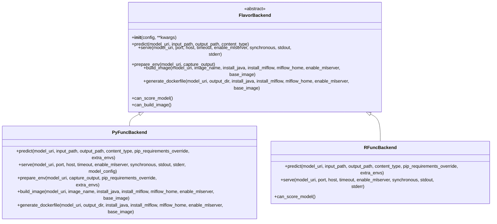
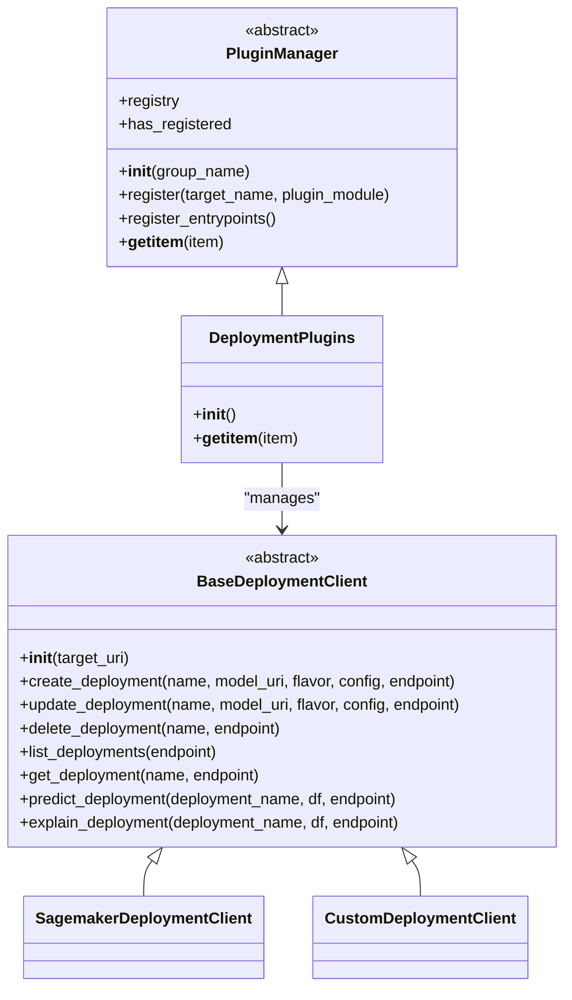
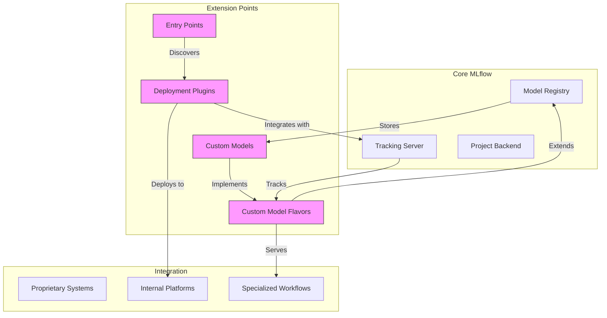

# Advanced Topics

<cite>
**Referenced Files in This Document**   
- [flavor_backend.py](file://mlflow/models/flavor_backend.py)
- [flavor_backend_registry.py](file://mlflow/models/flavor_backend_registry.py)
- [model.py](file://mlflow/models/model.py)
- [pyfunc/backend.py](file://mlflow/pyfunc/backend.py)
- [rfunc/backend.py](file://mlflow/rfunc/backend.py)
- [plugin_manager.py](file://mlflow/deployments/plugin_manager.py)
- [interface.py](file://mlflow/deployments/interface.py)
- [base.py](file://mlflow/deployments/base.py)
- [service.proto](file://mlflow/protos/service.proto)
- [service_pb2.py](file://mlflow/protos/service_pb2.py)
- [test_handlers.py](file://tests/server/test_handlers.py)
</cite>

## Table of Contents
1. [Introduction](#introduction)
2. [Custom Model Flavors](#custom-model-flavors)
3. [Plugin Development](#plugin-development)
4. [Performance Optimization](#performance-optimization)
5. [Scaling Considerations](#scaling-considerations)
6. [Architecture Overview](#architecture-overview)
7. [Best Practices](#best-practices)
8. [Conclusion](#conclusion)

## Introduction
MLflow provides a comprehensive framework for extending and customizing machine learning workflows to meet specialized organizational requirements. This document explores advanced topics in MLflow customization, focusing on creating custom model flavors, developing deployment plugins, optimizing performance, and scaling considerations. The architecture is designed around extensible components such as flavor backends, plugins, entry points, and custom models, enabling seamless integration with proprietary systems and specialized use cases.

The extension mechanisms in MLflow follow a modular design pattern that allows organizations to adapt the platform to their specific infrastructure and requirements. By leveraging the plugin architecture and customization APIs, teams can extend MLflow's capabilities while maintaining compatibility with the core system.

**Section sources**
- [flavor_backend.py](file://mlflow/models/flavor_backend.py#L1-L108)
- [plugin_manager.py](file://mlflow/deployments/plugin_manager.py#L1-L144)

## Custom Model Flavors
Custom model flavors in MLflow enable organizations to define specialized serialization formats and deployment mechanisms for machine learning models. The flavor system provides a standardized interface for model persistence, serving, and deployment across different frameworks and environments.

### Flavor Backend Architecture
The `FlavorBackend` class serves as the foundation for implementing custom model flavors. It defines an abstract interface with methods for prediction, serving, environment preparation, Docker image generation, and capability checking. Each flavor backend must implement these methods to provide complete functionality for model deployment.

Key components of the flavor backend include:
- `predict()`: Generates predictions using a saved MLflow model
- `serve()`: Deploys the model as a local REST API endpoint
- `build_image()`: Creates a Docker image for serving the model
- `can_score_model()`: Checks deployment capability in the current environment
- `prepare_env()`: Prepares the execution environment for prediction or serving

The flavor backend registry maintains a mapping of flavors to their corresponding backend implementations, allowing MLflow to automatically select the appropriate backend when deploying generic models.

**Diagram sources**
- [flavor_backend.py](file://mlflow/models/flavor_backend.py#L1-L108)
- [pyfunc/backend.py](file://mlflow/pyfunc/backend.py#L67-L525)
- [rfunc/backend.py](file://mlflow/rfunc/backend.py#L15-L149)

**Section sources**
- [flavor_backend.py](file://mlflow/models/flavor_backend.py#L1-L108)
- [flavor_backend_registry.py](file://mlflow/models/flavor_backend_registry.py#L1-L37)

### Custom Model Implementation
MLflow supports two approaches for creating custom models: function-based and class-based implementations. The function-based approach is suitable for simple use cases where prediction logic can be encapsulated in a single function. The class-based approach, which extends the `PythonModel` class, provides greater flexibility for complex scenarios requiring custom serialization, data processing, or additional methods.

When implementing custom models, developers can override the prediction method to support various prediction methodologies and accept parameters that dictate prediction behavior. This enables dynamic prediction capabilities and integration with external services or configuration files.

The model serialization process uses `cloudpickle`, which can serialize Python functions, lambda functions, and locally defined classes. This makes it particularly useful for distributed computing environments where code objects need to be transmitted across network boundaries.

**Section sources**
- [pyfunc/__init__.py](file://mlflow/pyfunc/__init__.py#L291-L310)
- [model.py](file://mlflow/models/model.py#L391-L800)

## Plugin Development
MLflow's plugin architecture enables organizations to extend the platform's capabilities by developing custom deployment targets and integration points. The plugin system is built around entry points, which provide a standardized mechanism for discovering and loading extension modules.

### Deployment Plugin Architecture
The deployment plugin system is implemented through the `DeploymentPlugins` class, which manages a registry of available deployment targets. Plugins are discovered through entry points in the `mlflow.deployments` group, allowing third-party modules to register themselves as valid deployment targets.

The plugin manager validates each registered plugin to ensure it implements the required interfaces:
- `target_help`: Provides documentation on target-specific configuration options
- `run_local`: Enables local testing of deployments
- A subclass of `BaseDeploymentClient`: Implements the core deployment functionality

Plugins must contain exactly one subclass of `BaseDeploymentClient` and implement all required interfaces to be considered valid. This ensures consistency across different deployment targets while allowing for target-specific configuration and behavior.

**Diagram sources**
- [plugin_manager.py](file://mlflow/deployments/plugin_manager.py#L21-L144)
- [interface.py](file://mlflow/deployments/interface.py#L1-L103)
- [base.py](file://mlflow/deployments/base.py#L76-L127)

**Section sources**
- [plugin_manager.py](file://mlflow/deployments/plugin_manager.py#L21-L144)
- [interface.py](file://mlflow/deployments/interface.py#L1-L103)

### Plugin Development Process
Developing a deployment plugin involves implementing a module that registers itself as an entry point in the `mlflow.deployments` group. The module must contain:
1. A `target_help()` function that documents target-specific configuration options
2. A `run_local()` function for local deployment testing
3. A class that extends `BaseDeploymentClient` to implement the core deployment functionality

The `BaseDeploymentClient` abstract class defines the standard API for deployment operations, including creating, updating, deleting, and listing deployments, as well as making predictions against deployed models. Plugin developers must implement these methods according to their target platform's requirements.

When users interact with a deployment target, MLflow's `get_deploy_client()` function retrieves the appropriate plugin from the registry and instantiates the corresponding `BaseDeploymentClient` subclass. This provides a consistent interface for deployment operations regardless of the underlying target platform.

**Section sources**
- [interface.py](file://mlflow/deployments/interface.py#L15-L85)
- [base.py](file://mlflow/deployments/base.py#L76-L127)

## Performance Optimization
Optimizing MLflow's performance is critical for large-scale tracking and model serving scenarios. The platform provides several mechanisms for improving performance, particularly in high-throughput environments with extensive metadata and artifact tracking.

### Tracking Performance Optimization
For large-scale tracking performance, MLflow offers several optimization techniques:
- Efficient artifact storage and retrieval through configurable artifact repositories
- Batched operations for logging metrics, parameters, and tags
- Optimized database schema design for high-performance querying
- Caching mechanisms for frequently accessed model metadata

The tracking server's performance can be enhanced by configuring appropriate database backends, optimizing connection pooling, and tuning server parameters for the expected workload. For distributed environments, load balancing and horizontal scaling of tracking servers can further improve performance.

### Model Serving Optimization
Model serving performance can be optimized through several strategies:
- Using MLServer for high-performance model serving with advanced features like model batching and dynamic scaling
- Optimizing Docker image generation by selecting appropriate base images and minimizing image size
- Preparing execution environments in advance to reduce cold start times
- Implementing efficient prediction pipelines with minimal overhead

The `PyFuncBackend` class provides options for performance tuning, including worker configuration, environment management, and MLflow installation options. By carefully configuring these parameters, organizations can achieve optimal serving performance for their specific use cases.

**Section sources**
- [pyfunc/backend.py](file://mlflow/pyfunc/backend.py#L67-L525)
- [service.proto](file://mlflow/protos/service.proto#L2907-L2961)
- [test_handlers.py](file://tests/server/test_handlers.py#L2562-L2602)

## Scaling Considerations
Scaling MLflow for enterprise deployments requires careful consideration of architecture, infrastructure, and operational practices. The platform's modular design enables various scaling strategies to accommodate growing workloads and user bases.

### Horizontal Scaling
MLflow supports horizontal scaling of tracking servers through load balancing and clustering. Multiple tracking server instances can share a common backend store and artifact repository, enabling high availability and increased throughput. Database clustering and read replicas can further enhance scalability for metadata operations.

For model serving, MLflow integrates with container orchestration platforms like Kubernetes, enabling auto-scaling of deployed models based on demand. The Docker image generation capabilities facilitate deployment to containerized environments, while the plugin architecture supports integration with cloud provider-specific scaling mechanisms.

### Data Management
Effective data management is crucial for scaling MLflow deployments. Organizations should implement data retention policies, archive older experiments, and optimize artifact storage. Using distributed file systems or cloud storage for artifacts can improve scalability and reliability.

The model registry provides version control and lifecycle management for models, enabling governance and audit capabilities at scale. By organizing models into registered model names and versions, organizations can manage large model catalogs efficiently.

**Section sources**
- [service.proto](file://mlflow/protos/service.proto#L2907-L2961)
- [service_pb2.py](file://mlflow/protos/service_pb2.py#L805-L827)
- [test_handlers.py](file://tests/server/test_handlers.py#L2562-L2602)

## Architecture Overview
The extensibility architecture of MLflow is designed around modular components that can be customized and extended to meet specific organizational requirements. The core extension mechanisms include flavor backends, plugins, entry points, and custom models, which work together to provide a flexible and adaptable platform.

**Diagram sources**
- [flavor_backend.py](file://mlflow/models/flavor_backend.py#L1-L108)
- [plugin_manager.py](file://mlflow/deployments/plugin_manager.py#L21-L144)
- [model.py](file://mlflow/models/model.py#L391-L800)

**Section sources**
- [flavor_backend.py](file://mlflow/models/flavor_backend.py#L1-L108)
- [plugin_manager.py](file://mlflow/deployments/plugin_manager.py#L21-L144)

## Best Practices
When extending and customizing MLflow for specialized use cases, organizations should follow several best practices to ensure maintainability, compatibility, and performance.

### Compatibility Maintenance
To maintain compatibility with MLflow core components:
- Follow the documented extension APIs and interfaces
- Test plugins and custom flavors against multiple MLflow versions
- Use semantic versioning for custom extensions
- Document breaking changes and provide migration paths

### Development Guidelines
For effective development of custom components:
- Implement comprehensive testing for all extension points
- Follow MLflow's coding standards and patterns
- Provide clear documentation for configuration options
- Include error handling and validation for user inputs

### Performance Monitoring
To ensure optimal performance:
- Monitor resource utilization for tracking servers and model deployments
- Implement logging and metrics collection for custom components
- Regularly review and optimize database queries and indexes
- Test under realistic workloads to identify performance bottlenecks

**Section sources**
- [flavor_backend.py](file://mlflow/models/flavor_backend.py#L1-L108)
- [plugin_manager.py](file://mlflow/deployments/plugin_manager.py#L21-L144)
- [pyfunc/backend.py](file://mlflow/pyfunc/backend.py#L67-L525)

## Conclusion
MLflow's extensible architecture provides powerful mechanisms for organizations to adapt the platform to their specific requirements and integrate with proprietary systems. Through custom model flavors, deployment plugins, and extension APIs, teams can create specialized solutions for unique use cases while maintaining compatibility with the broader MLflow ecosystem.

The flavor backend system enables organizations to define custom serialization formats and deployment mechanisms, while the plugin architecture facilitates integration with internal platforms and cloud services. Performance optimization techniques and scaling considerations ensure that MLflow can handle large-scale tracking and model serving workloads effectively.

By following best practices for extension development and maintenance, organizations can leverage MLflow's flexibility to build robust machine learning workflows that meet their specific needs. The combination of standardized interfaces, modular design, and comprehensive documentation makes MLflow a powerful platform for enterprise machine learning operations.