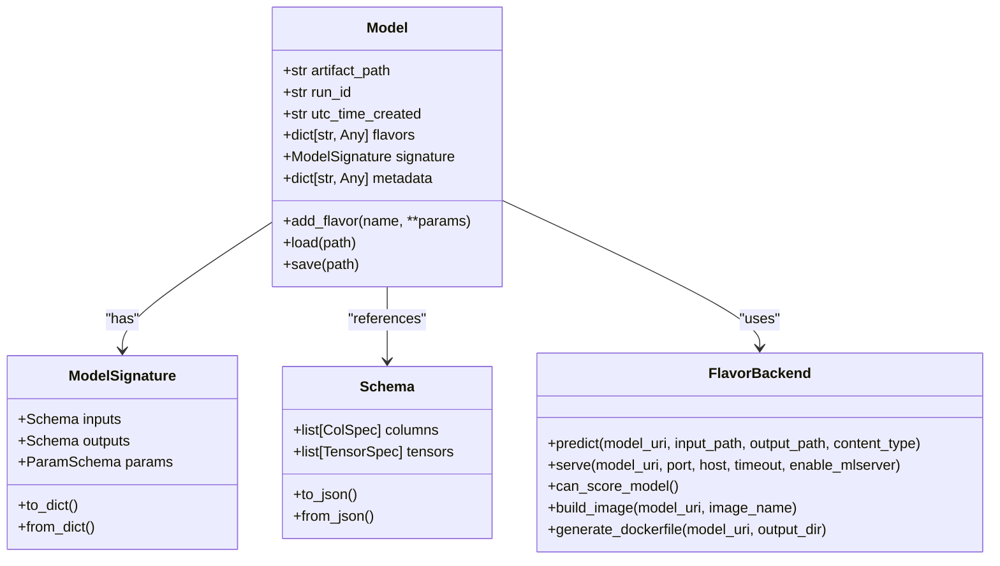
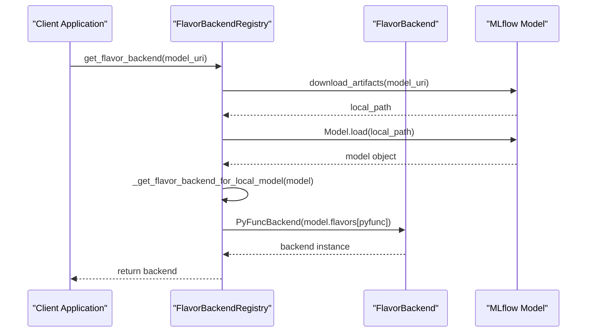
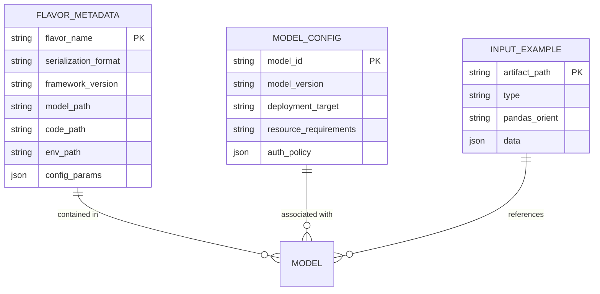
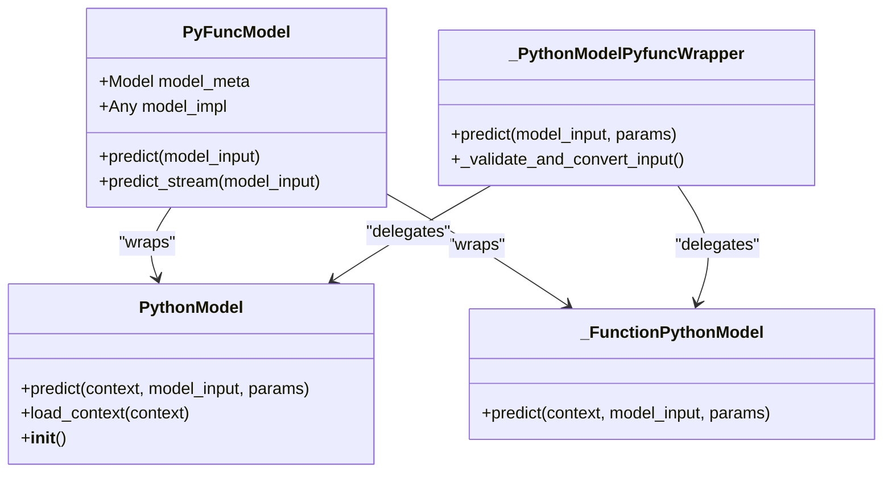
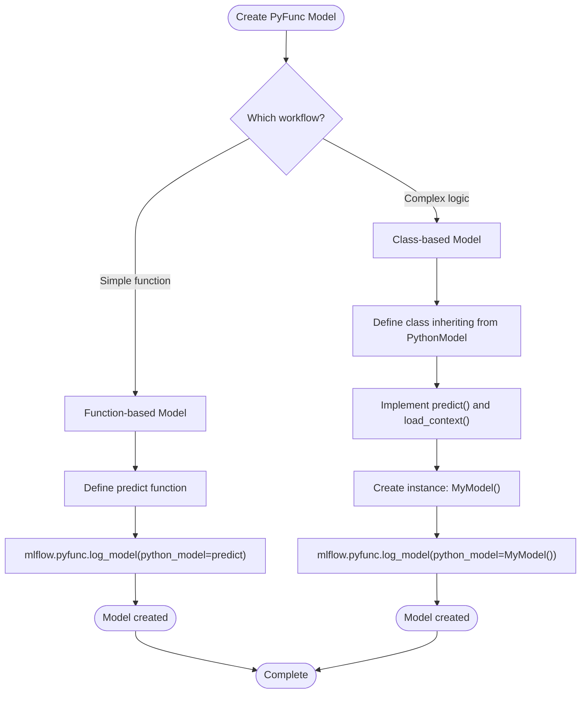
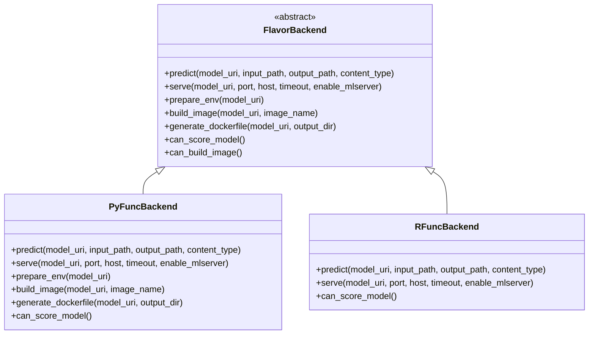
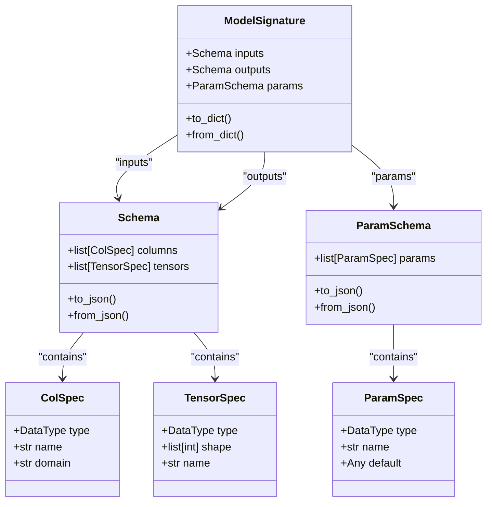
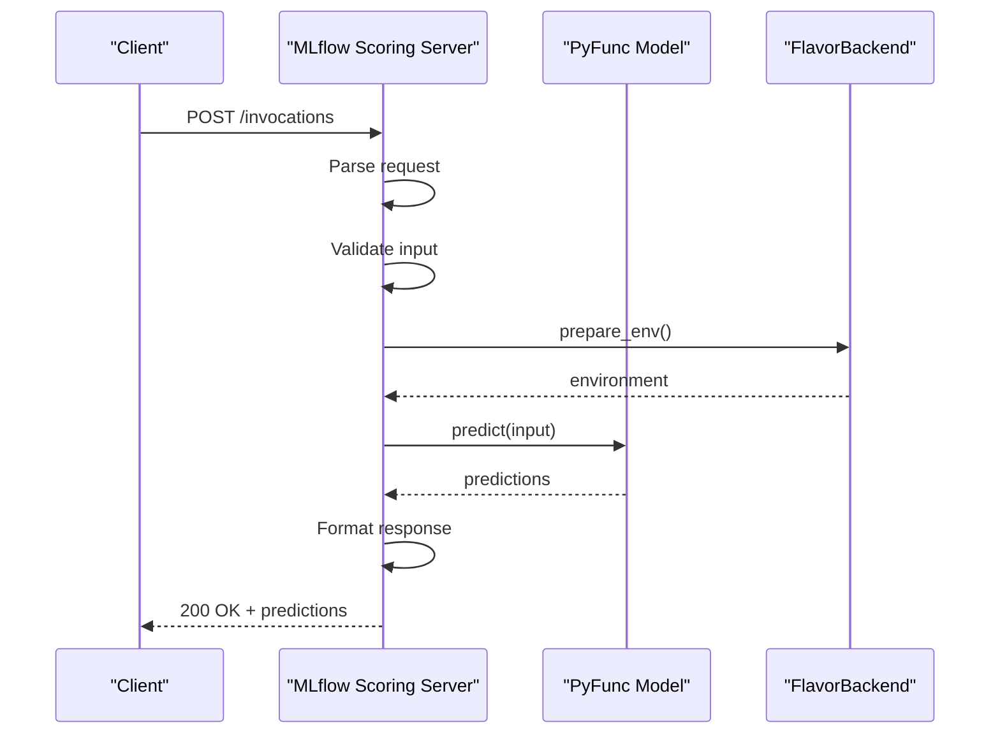
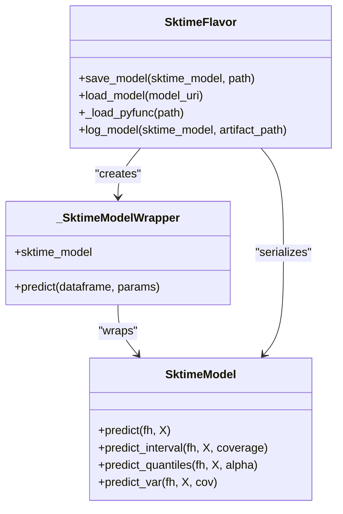

# Custom Model Flavors

<cite>
**Referenced Files in This Document**   
- [flavor.py](file://examples/sktime/flavor.py)
- [flavor_backend.py](file://mlflow/models/flavor_backend.py)
- [flavor_backend_registry.py](file://mlflow/models/flavor_backend_registry.py)
- [__init__.py](file://mlflow/pyfunc/__init__.py)
- [model.py](file://mlflow/models/model.py)
- [backend.py](file://mlflow/pyfunc/backend.py)
- [signature.py](file://mlflow/models/signature.py)
- [utils.py](file://mlflow/models/utils.py)
</cite>

## Table of Contents
1. [Introduction](#introduction)
2. [Core Concepts](#core-concepts)
3. [Flavor Implementation Requirements](#flavor-implementation-requirements)
4. [PyFunc Flavor Integration](#pyfunc-flavor-integration)
5. [Flavor Backend System](#flavor-backend-system)
6. [Model Serialization and Deserialization](#model-serialization-and-deserialization)
7. [Signature and Input Validation](#signature-and-input-validation)
8. [Deployment and Serving](#deployment-and-serving)
9. [Custom Flavor Example: Sktime](#custom-flavor-example-sktime)
10. [Best Practices and Common Issues](#best-practices-and-common-issues)

## Introduction

Custom model flavors in MLflow provide a flexible framework for serializing, storing, and deploying machine learning models from various frameworks and custom implementations. A model flavor defines the interface between a specific machine learning framework and the MLflow model system, enabling standardized model management across different technologies.

The MLflow model format is designed to be extensible, allowing developers to create custom flavors for proprietary or specialized model types. Each flavor implements specific methods for saving, loading, and serving models, while adhering to the core MLflow model conventions. This documentation provides comprehensive guidance on implementing custom model flavors, with detailed explanations of the required components, interfaces, and best practices.

The primary benefits of custom model flavors include:
- Standardized model serialization and storage
- Consistent deployment interfaces across different frameworks
- Support for framework-specific features and optimizations
- Integration with MLflow's tracking, registry, and serving capabilities

**Section sources**
- [flavor_backend.py](file://mlflow/models/flavor_backend.py#L1-L108)
- [model.py](file://mlflow/models/model.py#L1-L800)

## Core Concepts

### Model Flavor Architecture

MLflow's model flavor system is built around several core components that work together to provide a consistent interface for model management. The architecture consists of flavor implementations, backend systems, and the core model registry.

The `Model` class serves as the central component, containing metadata about the model and its available flavors. Each model can support multiple flavors simultaneously, allowing different deployment options for the same underlying model. The model configuration is stored in the MLmodel file, which contains flavor-specific metadata and references to model artifacts.

**Diagram sources** 
- [model.py](file://mlflow/models/model.py#L391-L765)
- [signature.py](file://mlflow/models/signature.py#L64-L181)

### Flavor Backend Registry

The flavor backend registry is responsible for selecting the appropriate backend implementation for a given model. It examines the model's available flavors and selects the most suitable backend based on the deployment requirements.

**Diagram sources** 
- [flavor_backend_registry.py](file://mlflow/models/flavor_backend_registry.py#L22-L54)
- [flavor_backend.py](file://mlflow/models/flavor_backend.py#L7-L108)

## Flavor Implementation Requirements

### Required Methods

Every custom model flavor must implement four core methods to ensure compatibility with the MLflow ecosystem. These methods provide the essential functionality for model persistence, retrieval, and inference.

The `save_model` method is responsible for serializing the model to disk in the MLflow format. It handles the creation of the model directory structure, saving the model artifacts, and generating the MLmodel configuration file. This method must properly handle all flavor-specific serialization requirements while adhering to the standard MLflow model format.

The `log_model` method extends `save_model` by integrating with MLflow's tracking system. It logs the model as an artifact in the current run, enabling versioning and experiment tracking. This method typically calls `save_model` internally and then registers the resulting model directory as an artifact.

The `load_model` method deserializes a model from the MLflow format, reconstructing the original model object. It handles downloading artifacts from remote storage locations and instantiating the appropriate model wrapper. This method ensures that models can be loaded consistently regardless of their storage location.

Finally, the `_load_pyfunc` method provides a standardized interface for loading models as PyFunc instances. This enables generic inference capabilities and ensures compatibility with MLflow's deployment tools. The PyFunc interface abstracts away framework-specific details, providing a consistent prediction API.

**Section sources**
- [flavor.py](file://examples/sktime/flavor.py#L148-L424)
- [__init__.py](file://mlflow/pyfunc/__init__.py#L219-L245)

### Metadata and Configuration

Flavor-specific metadata is stored in the MLmodel file and provides essential information for model deployment and inference. This metadata includes serialization format, framework version, and any flavor-specific configuration parameters.

The metadata structure follows a standardized format that includes:
- **Flavor name**: Identifies the model flavor
- **Serialization format**: Specifies how the model was serialized (pickle, cloudpickle, etc.)
- **Framework version**: Records the version of the underlying framework
- **Artifact paths**: References to model files and dependencies
- **Configuration parameters**: Flavor-specific settings

**Diagram sources** 
- [model.py](file://mlflow/models/model.py#L391-L765)
- [flavor.py](file://examples/sktime/flavor.py#L95-L113)

## PyFunc Flavor Integration

### PyFunc Interface

The PyFunc flavor serves as MLflow's default model interface, providing a standardized prediction API that can be used with any Python model. The PyFunc interface is designed to be simple and flexible, supporting multiple input and output types.

The prediction API accepts various input formats including pandas DataFrames, numpy arrays, Python lists, dictionaries, and Spark DataFrames. The output can be returned as numpy arrays, pandas Series or DataFrames, Python lists, dictionaries, or Spark DataFrames. This flexibility allows the PyFunc interface to accommodate a wide range of model types and use cases.

**Diagram sources** 
- [__init__.py](file://mlflow/pyfunc/__init__.py#L753-L800)
- [model.py](file://mlflow/pyfunc/model.py#L497-L502)

### Model Creation Workflows

MLflow supports two primary workflows for creating custom PyFunc models: class-based and function-based approaches. The choice between these workflows depends on the complexity of the model and the required functionality.

The class-based approach involves creating a class that inherits from `PythonModel`. This approach is suitable for complex models that require custom initialization, preprocessing, or postprocessing logic. The class can define a `load_context` method for loading artifacts and initializing state, and the `predict` method for performing inference.

The function-based approach is simpler and involves passing a standalone prediction function to `log_model`. This approach is ideal for models with straightforward inference logic that don't require additional state management. The function is serialized using cloudpickle and wrapped in a minimal model interface.

**Diagram sources** 
- [__init__.py](file://mlflow/pyfunc/__init__.py#L223-L397)
- [model.py](file://mlflow/pyfunc/model.py#L497-L502)

## Flavor Backend System

### Backend Interface

The `FlavorBackend` abstract class defines the interface for all flavor backend implementations. This interface ensures consistent behavior across different flavors and deployment scenarios. The backend system is responsible for model serving, prediction, and containerization.

The core methods of the `FlavorBackend` interface include:
- `predict`: Generate predictions from a saved model using file or stdin/stdout
- `serve`: Serve the model locally as a REST API endpoint
- `can_score_model`: Check if the backend can be used in the current environment
- `build_image`: Build a Docker image for serving the model
- `generate_dockerfile`: Generate a Dockerfile for the model

**Diagram sources** 
- [flavor_backend.py](file://mlflow/models/flavor_backend.py#L7-L108)
- [backend.py](file://mlflow/pyfunc/backend.py#L67-L350)

### Environment Management

The flavor backend system includes comprehensive environment management capabilities to ensure consistent model execution across different deployment targets. This includes support for conda, virtualenv, and local environments.

The environment management system handles dependency resolution, package installation, and environment activation. It can work with existing environment specifications (conda.yaml, requirements.txt) or create new environments as needed. The system also supports environment variable capture to ensure that all necessary configuration is preserved during deployment.

For Docker-based deployments, the backend generates appropriate Dockerfiles that include the necessary base images, dependency installations, and model loading instructions. The system can optimize Docker image creation by selecting appropriate base images based on the model's requirements.

**Section sources**
- [backend.py](file://mlflow/pyfunc/backend.py#L67-L350)
- [flavor_backend.py](file://mlflow/models/flavor_backend.py#L7-L108)

## Model Serialization and Deserialization

### Serialization Formats

MLflow supports multiple serialization formats for model persistence, with pickle and cloudpickle being the most commonly used. The choice of serialization format depends on the model type and deployment requirements.

Pickle is Python's built-in serialization format and is suitable for most models that don't contain complex custom objects. It provides good performance and compatibility but is limited to Python environments. Cloudpickle extends pickle's capabilities by supporting the serialization of more complex objects, including functions defined in the __main__ scope and dynamically created classes.

The serialization format is specified in the flavor metadata and must be preserved during model loading. Custom flavors can support additional serialization formats by implementing the appropriate save and load logic.

**Section sources**
- [flavor.py](file://examples/sktime/flavor.py#L108-L113)
- [flavor.py](file://examples/sktime/flavor.py#L425-L443)

### Artifact Management

Model artifacts include all files and data required for model execution, such as serialized model weights, configuration files, and preprocessing artifacts. MLflow provides a structured approach to artifact management that ensures all necessary components are properly stored and retrieved.

The artifact system supports both local and remote storage locations, with automatic downloading of artifacts when needed. Artifacts can be referenced by relative paths in the model configuration, making models portable across different environments. The system also supports artifact compression and optimization to reduce storage requirements.

For models with large artifacts, MLflow provides mechanisms for efficient artifact handling, including streaming downloads and caching. This ensures that model loading remains performant even with large model files.

**Section sources**
- [flavor.py](file://examples/sktime/flavor.py#L240-L242)
- [utils.py](file://mlflow/models/utils.py#L29-L30)

## Signature and Input Validation

### Model Signature

The model signature defines the expected input and output schema for a model, enabling input validation and ensuring compatibility between models and their consumers. The signature includes specifications for input columns, output columns, and inference parameters.

Input and output schemas are defined using the `Schema` class, which can describe both column-based and tensor-based data. Column-based schemas specify the name, type, and optional constraints for each column, while tensor-based schemas define the shape and data type of tensor inputs and outputs.

Parameter schemas define the expected inference parameters, including their names, types, and default values. This enables validation of inference parameters and provides documentation for model consumers.

**Diagram sources** 
- [signature.py](file://mlflow/models/signature.py#L64-L181)
- [signature.py](file://mlflow/types/schema.py#L1-L500)

### Input Validation

MLflow performs input validation based on the model signature to ensure that predictions are made with compatible data. The validation system checks the data type, shape, and structure of inputs against the expected schema.

For column-based inputs, the system verifies that all required columns are present and have the correct data types. For tensor inputs, it validates the tensor shape and data type. Parameter validation ensures that inference parameters are of the correct type and within acceptable ranges.

The validation system can be configured to handle schema mismatches in different ways, from strict enforcement to flexible adaptation. This allows models to be robust to minor input variations while maintaining data integrity.

**Section sources**
- [signature.py](file://mlflow/models/signature.py#L182-L200)
- [utils.py](file://mlflow/models/utils.py#L712-L717)

## Deployment and Serving

### Local Serving

MLflow provides multiple options for serving models locally, including direct prediction, REST API serving, and Docker containerization. The serving system is designed to be flexible and support various deployment scenarios.

Local prediction allows models to be used directly in Python applications without requiring a separate serving process. This is suitable for batch processing and interactive analysis. The prediction API supports both file-based and in-memory inputs and outputs.

REST API serving exposes models as HTTP endpoints, enabling integration with web applications and microservices. The serving system includes a built-in scoring server that handles request parsing, input validation, prediction execution, and response formatting.

**Diagram sources** 
- [backend.py](file://mlflow/pyfunc/backend.py#L229-L327)
- [scoring_server.py](file://mlflow/pyfunc/scoring_server.py#L1-L500)

### Containerization

MLflow supports containerization of models through Docker, enabling deployment to various cloud platforms and container orchestration systems. The containerization system generates Dockerfiles and builds images that include the model, its dependencies, and the serving infrastructure.

The Docker image creation process includes:
1. Selecting an appropriate base image based on the model's requirements
2. Installing dependencies from conda or pip specifications
3. Copying the model artifacts to the container
4. Configuring the entry point to start the scoring server
5. Exposing the appropriate ports for serving

The system optimizes image size by using slim base images when possible and minimizing the number of image layers. It also supports custom base images and advanced Docker configurations for specialized deployment requirements.

**Section sources**
- [backend.py](file://mlflow/pyfunc/backend.py#L365-L458)
- [docker_utils.py](file://mlflow/models/docker_utils.py#L1-L500)

## Custom Flavor Example: Sktime

### Sktime Flavor Implementation

The Sktime flavor provides a comprehensive example of a custom model flavor implementation. It demonstrates how to integrate a specialized time series forecasting library with MLflow's model system.

The Sktime flavor supports multiple prediction methods, including point forecasts, prediction intervals, quantile forecasts, and variance forecasts. The implementation uses a configuration-based approach where prediction parameters are passed as a pandas DataFrame with specific columns.

**Diagram sources** 
- [flavor.py](file://examples/sktime/flavor.py#L472-L546)
- [flavor.py](file://examples/sktime/flavor.py#L148-L424)

### Prediction Configuration

The Sktime flavor uses a flexible configuration system that allows users to specify different prediction methods and parameters through a single interface. The configuration is passed as a pandas DataFrame with specific columns that control the prediction behavior.

The configuration supports the following parameters:
- `predict_method`: Specifies the prediction method to use
- `fh`: Forecast horizon, indicating the number of future periods to predict
- `X`: Exogenous regressor values for future time periods
- `coverage`: Nominal coverage value for prediction intervals
- `alpha`: Probability values for prediction quantiles
- `cov`: Whether to compute covariance matrix forecasts

This configuration-based approach enables a single model to support multiple forecasting scenarios without requiring changes to the model code or deployment infrastructure.

**Section sources**
- [flavor.py](file://examples/sktime/flavor.py#L19-L45)
- [flavor.py](file://examples/sktime/flavor.py#L476-L546)

## Best Practices and Common Issues

### Version Compatibility

Maintaining version compatibility is critical for reliable model deployment. This includes compatibility between:
- Python versions used for training and serving
- Framework versions (sktime, scikit-learn, etc.)
- Serialization format versions (pickle protocol)
- MLflow versions

To ensure compatibility, it's recommended to:
1. Pin framework versions in conda or pip specifications
2. Use the same Python version for training and serving
3. Test model loading and prediction in the target environment
4. Document version requirements in the model metadata

### Dependency Management

Effective dependency management ensures that models can be deployed consistently across different environments. Best practices include:
- Using conda or virtualenv to create isolated environments
- Specifying exact dependency versions when possible
- Including all required dependencies in the model environment
- Testing dependency installation during model loading

For models with large dependencies, consider using slim base images and optimizing the installation process to reduce image size and startup time.

### Performance Implications

Custom serialization can have significant performance implications, particularly for large models or high-throughput serving scenarios. Considerations include:
- Serialization format performance (pickle vs. cloudpickle vs. custom formats)
- Model loading time and memory usage
- Prediction latency and throughput
- Disk I/O for large model files

Optimization strategies include:
- Using efficient serialization formats for specific model types
- Implementing lazy loading for large models
- Caching frequently used models
- Optimizing Docker image layers to reduce startup time

**Section sources**
- [flavor.py](file://examples/sktime/flavor.py#L9-L11)
- [backend.py](file://mlflow/pyfunc/backend.py#L45-L52)
- [flavor_backend.py](file://mlflow/models/flavor_backend.py#L81-L108)