# Plugin Development

<cite>
**Referenced Files in This Document**   
- [plugin_manager.py](file://mlflow/deployments/plugin_manager.py)
- [interface.py](file://mlflow/deployments/interface.py)
- [base.py](file://mlflow/deployments/base.py)
- [plugins.py](file://mlflow/utils/plugins.py)
- [registry.py](file://mlflow/tracking/request_auth/registry.py)
- [fake_deployment_plugin.py](file://tests/resources/mlflow-test-plugin/mlflow_test_plugin/fake_deployment_plugin.py)
- [request_auth_provider.py](file://tests/resources/mlflow-test-plugin/mlflow_test_plugin/request_auth_provider.py)
- [sqlalchemy_store.py](file://tests/resources/mlflow-test-plugin/mlflow_test_plugin/sqlalchemy_store.py)
- [providers.py](file://examples/gateway/plugin/my-llm/my_llm/providers.py)
</cite>

## Table of Contents
1. [Introduction](#introduction)
2. [Plugin Architecture Overview](#plugin-architecture-overview)
3. [Deployment Plugins](#deployment-plugins)
4. [Authentication Plugins](#authentication-plugins)
5. [Model Flavor Plugins](#model-flavor-plugins)
6. [Plugin Registration Mechanism](#plugin-registration-mechanism)
7. [Plugin Discovery Process](#plugin-discovery-process)
8. [Implementation Example: Custom Deployment Plugin](#implementation-example-custom-deployment-plugin)
9. [Relationships with Core Components](#relationships-with-core-components)
10. [Common Issues and Debugging](#common-issues-and-debugging)
11. [Testing and Integration](#testing-and-integration)
12. [Best Practices](#best-practices)

## Introduction
MLflow's plugin system enables extensibility through Python entry points, allowing developers to extend MLflow's functionality for various use cases including model deployment, authentication, and model flavor support. This document provides comprehensive guidance on developing MLflow plugins, covering implementation details, registration mechanisms, and integration patterns. The plugin architecture is designed to be modular and extensible, supporting multiple plugin types that can be discovered and loaded at runtime.

## Plugin Architecture Overview

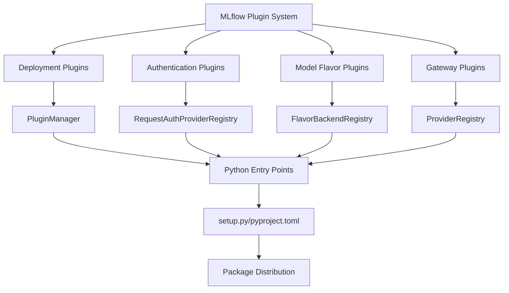

**Diagram sources**
- [plugin_manager.py](file://mlflow/deployments/plugin_manager.py)
- [registry.py](file://mlflow/tracking/request_auth/registry.py)

**Section sources**
- [plugin_manager.py](file://mlflow/deployments/plugin_manager.py#L1-L144)
- [registry.py](file://mlflow/tracking/request_auth/registry.py#L1-L61)

## Deployment Plugins

### Core Interface
Deployment plugins in MLflow implement a standardized interface through the `BaseDeploymentClient` class, which defines the contract for model deployment operations. The interface includes methods for creating, updating, deleting, and listing deployments, as well as prediction and explanation capabilities.

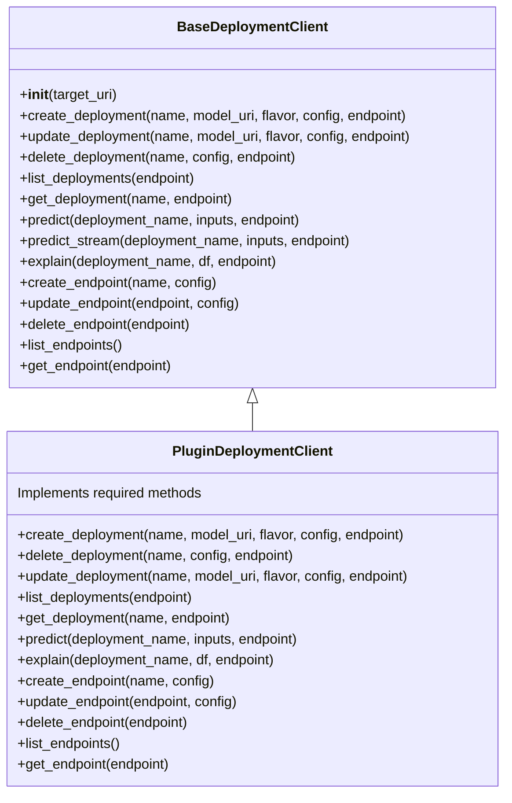

**Diagram sources**
- [base.py](file://mlflow/deployments/base.py#L1-L359)
- [fake_deployment_plugin.py](file://tests/resources/mlflow-test-plugin/mlflow_test_plugin/fake_deployment_plugin.py#L1-L64)

**Section sources**
- [base.py](file://mlflow/deployments/base.py#L1-L359)
- [interface.py](file://mlflow/deployments/interface.py#L1-L103)

### Plugin Manager Implementation
The `DeploymentPlugins` class manages the lifecycle of deployment plugins, handling registration and discovery through Python entry points. It maintains a registry of available plugins and validates their implementation against the required interface.

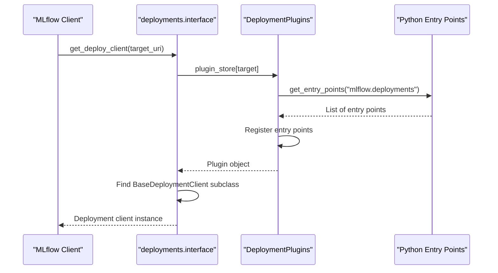

**Diagram sources**
- [plugin_manager.py](file://mlflow/deployments/plugin_manager.py#L1-L144)
- [interface.py](file://mlflow/deployments/interface.py#L1-L103)

## Authentication Plugins

### Request Authentication Provider
Authentication plugins in MLflow implement the `RequestAuthProvider` interface, allowing for custom authentication mechanisms to be integrated with MLflow's tracking server. These plugins are discovered through the `mlflow.request_auth_provider` entry point.

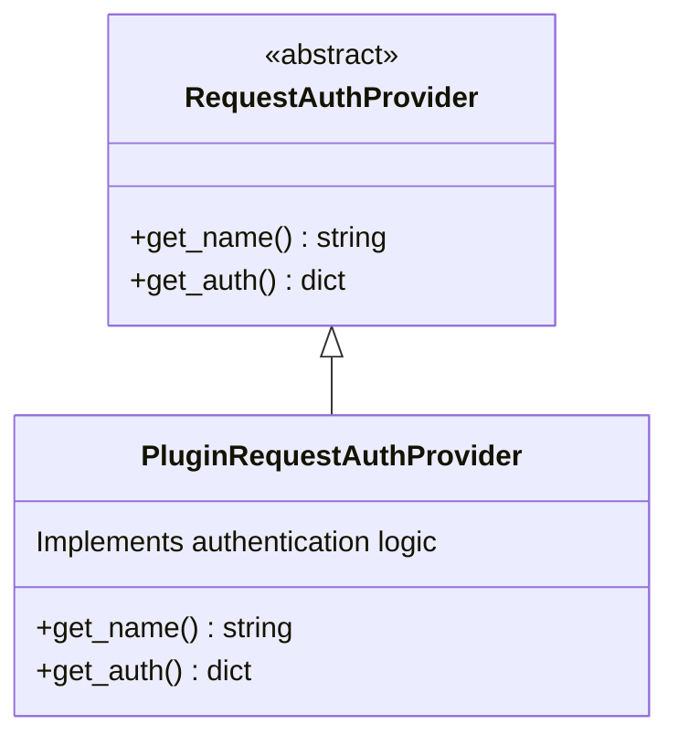

**Diagram sources**
- [request_auth_provider.py](file://tests/resources/mlflow-test-plugin/mlflow_test_plugin/request_auth_provider.py#L1-L12)
- [registry.py](file://mlflow/tracking/request_auth/registry.py#L1-L61)

**Section sources**
- [registry.py](file://mlflow/tracking/request_auth/registry.py#L1-L61)
- [request_auth_provider.py](file://tests/resources/mlflow-test-plugin/mlflow_test_plugin/request_auth_provider.py#L1-L12)

### Authentication Registry
The `RequestAuthProviderRegistry` manages the discovery and registration of authentication plugins, allowing MLflow to dynamically load authentication providers based on configuration.

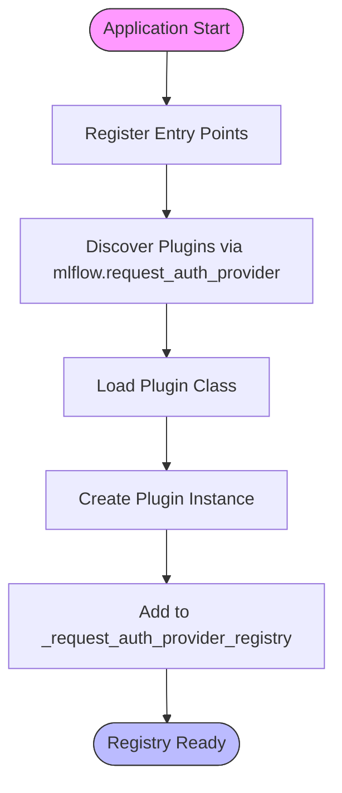

**Diagram sources**
- [registry.py](file://mlflow/tracking/request_auth/registry.py#L1-L61)

## Model Flavor Plugins

### Flavor Backend Registry
Model flavor plugins extend MLflow's model persistence capabilities by implementing custom serialization and deserialization logic for specific model types. These plugins are registered through the `mlflow.model_flavor` entry point and managed by the `FlavorBackendRegistry`.

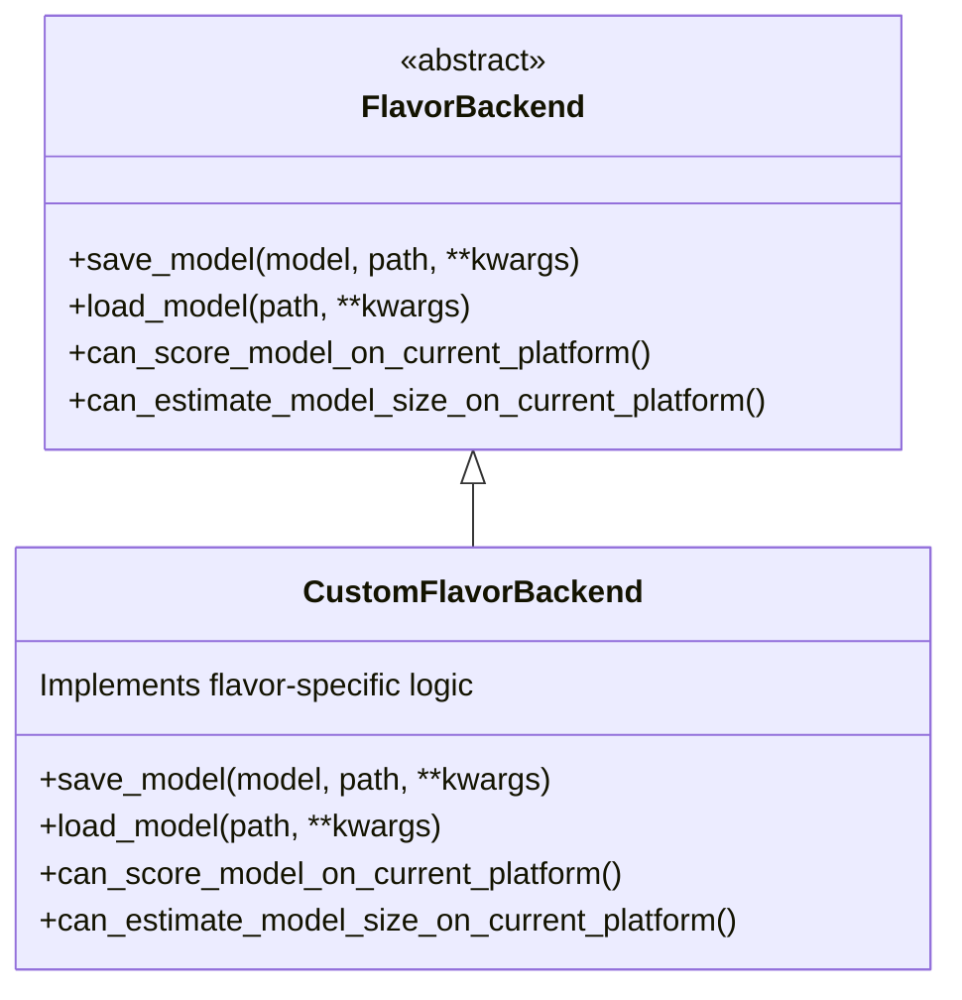

**Section sources**
- [sqlalchemy_store.py](file://tests/resources/mlflow-test-plugin/mlflow_test_plugin/sqlalchemy_store.py#L1-L10)

## Plugin Registration Mechanism

### Entry Point Configuration
Plugins are registered through Python entry points in either `setup.py` or `pyproject.toml`. The entry point configuration specifies the plugin name, module, and entry point group.

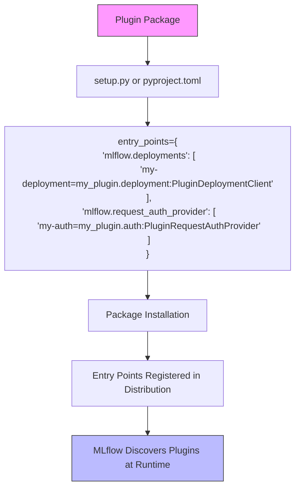

**Section sources**
- [plugin_manager.py](file://mlflow/deployments/plugin_manager.py#L70-L77)
- [registry.py](file://mlflow/tracking/request_auth/registry.py#L15-L26)

## Plugin Discovery Process

### Dynamic Plugin Loading
MLflow discovers and loads plugins at runtime using Python's `importlib.metadata.entry_points()` function. The discovery process occurs when the plugin manager is initialized, ensuring that all available plugins are registered before they are needed.

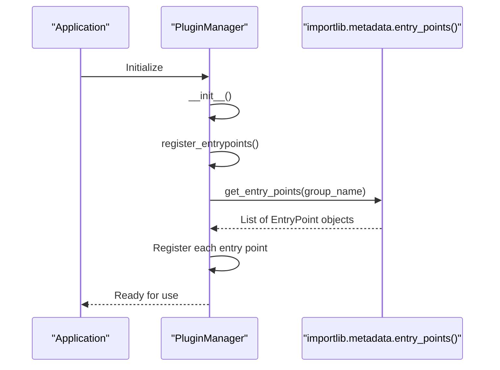

**Diagram sources**
- [plugin_manager.py](file://mlflow/deployments/plugin_manager.py#L70-L77)
- [plugins.py](file://mlflow/utils/plugins.py#L1-L10)

**Section sources**
- [plugin_manager.py](file://mlflow/deployments/plugin_manager.py#L70-L77)
- [plugins.py](file://mlflow/utils/plugins.py#L1-L10)

## Implementation Example: Custom Deployment Plugin

### Plugin Structure
A custom deployment plugin requires implementing the `BaseDeploymentClient` interface, defining the `run_local` and `target_help` functions, and registering the plugin through entry points.

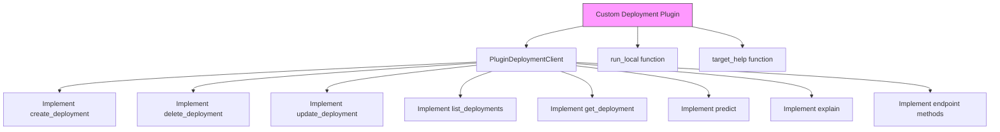

**Section sources**
- [fake_deployment_plugin.py](file://tests/resources/mlflow-test-plugin/mlflow_test_plugin/fake_deployment_plugin.py#L1-L64)

### Required Interface Methods
The plugin must implement all abstract methods from `BaseDeploymentClient` and provide the required top-level functions.

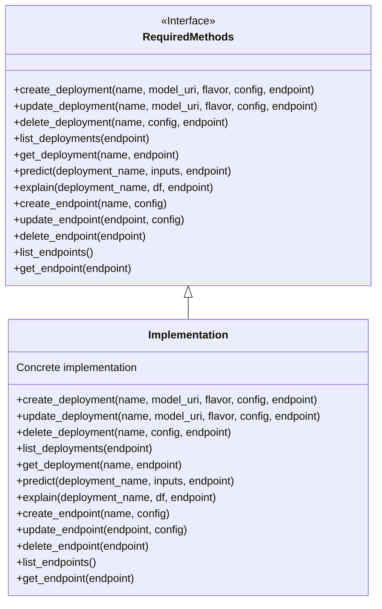

**Diagram sources**
- [base.py](file://mlflow/deployments/base.py#L93-L359)
- [fake_deployment_plugin.py](file://tests/resources/mlflow-test-plugin/mlflow_test_plugin/fake_deployment_plugin.py#L1-L64)

## Relationships with Core Components

### Integration with Deployments API
Deployment plugins integrate with MLflow's deployments API, enabling model deployment operations through the `get_deploy_client` function.

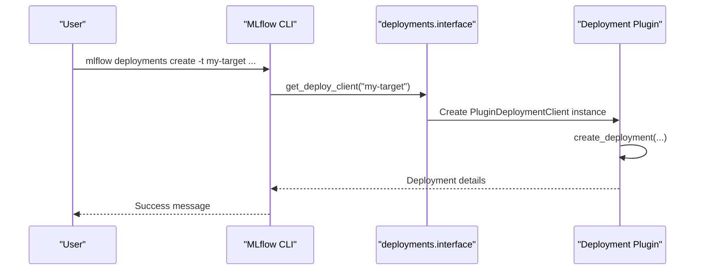

**Section sources**
- [interface.py](file://mlflow/deployments/interface.py#L15-L65)

### Model Registry Integration
Plugins can extend the model registry functionality by implementing custom storage backends or adding new metadata fields.

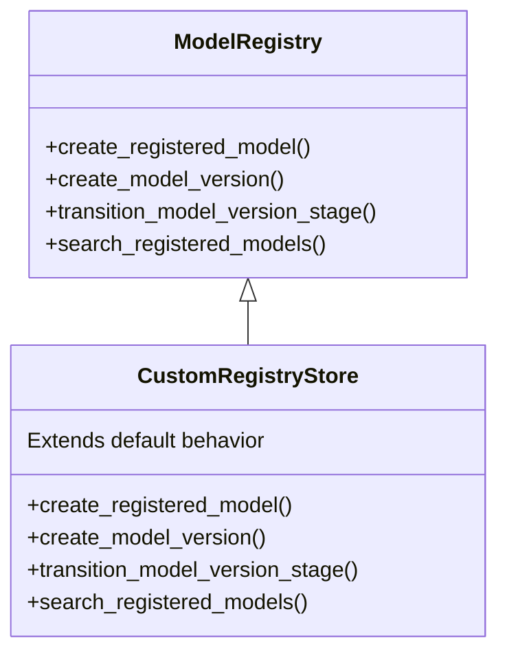

**Section sources**
- [sqlalchemy_store.py](file://tests/resources/mlflow-test-plugin/mlflow_test_plugin/sqlalchemy_store.py#L1-L10)

## Common Issues and Debugging

### Plugin Loading Failures
Common issues with plugin loading include missing entry points, incorrect module paths, and dependency conflicts.

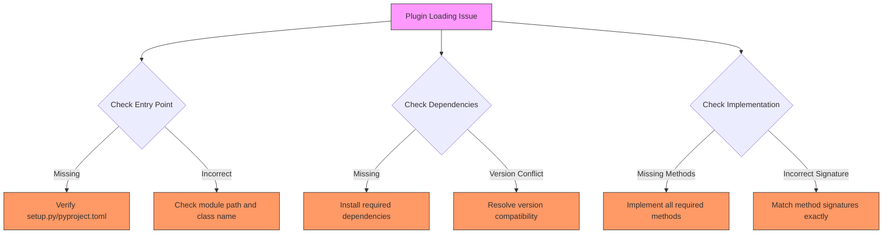

**Section sources**
- [plugin_manager.py](file://mlflow/deployments/plugin_manager.py#L101-L143)
- [registry.py](file://mlflow/tracking/request_auth/registry.py#L15-L26)

### Version Compatibility
Plugin compatibility issues often arise from version mismatches between MLflow and plugin dependencies.

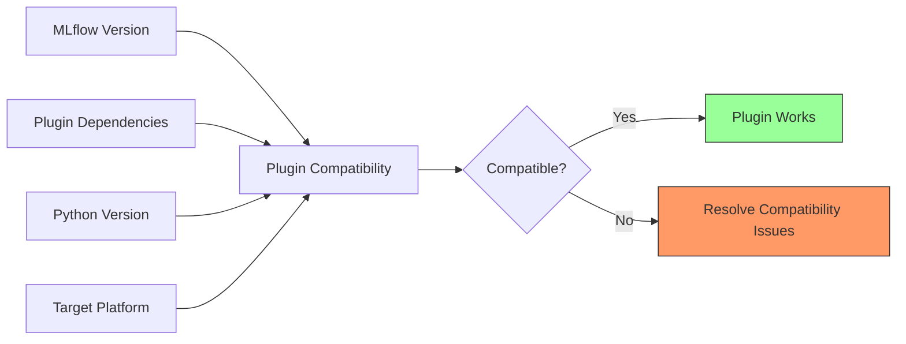

## Testing and Integration

### Unit Testing Plugins
Effective testing of MLflow plugins requires testing both the plugin interface and the integration with MLflow's plugin system.

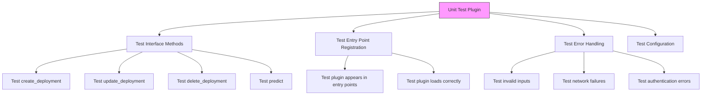

**Section sources**
- [fake_deployment_plugin.py](file://tests/resources/mlflow-test-plugin/mlflow_test_plugin/fake_deployment_plugin.py#L1-L64)

## Best Practices

### Plugin Development Guidelines
Following best practices ensures that plugins are robust, maintainable, and compatible with MLflow's ecosystem.

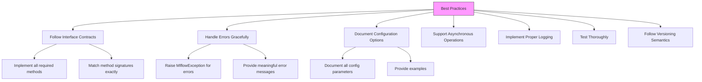

**Section sources**
- [base.py](file://mlflow/deployments/base.py)
- [plugin_manager.py](file://mlflow/deployments/plugin_manager.py)
- [registry.py](file://mlflow/tracking/request_auth/registry.py)