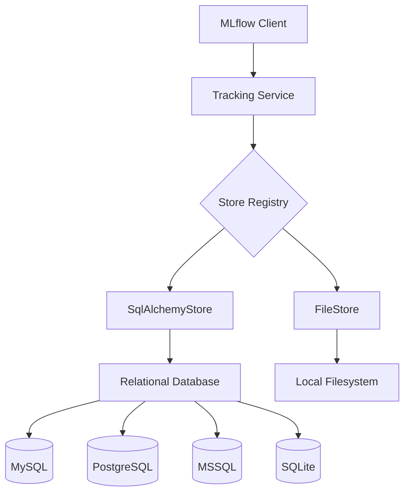
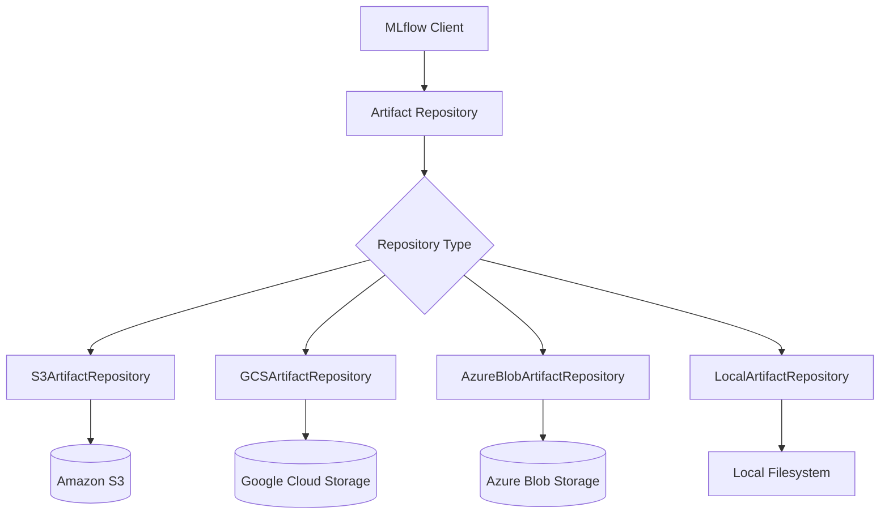
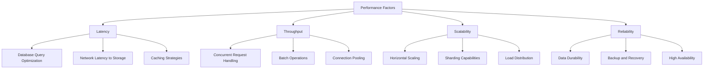
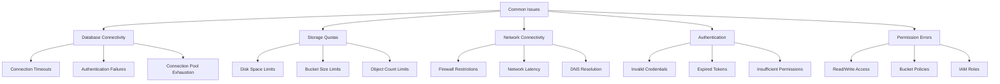
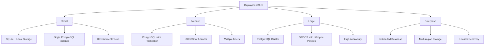

# Backend Configuration

<cite>
**Referenced Files in This Document**   
- [sqlalchemy_store.py](file://mlflow/store/tracking/sqlalchemy_store.py)
- [file_store.py](file://mlflow/store/tracking/file_store.py)
- [environment_variables.py](file://mlflow/environment_variables.py)
- [s3_artifact_repo.py](file://mlflow/store/artifact/s3_artifact_repo.py)
- [gcs_artifact_repo.py](file://mlflow/store/artifact/gcs_artifact_repo.py)
- [azure_blob_artifact_repo.py](file://mlflow/store/artifact/azure_blob_artifact_repo.py)
- [cloud_artifact_repo.py](file://mlflow/store/artifact/cloud_artifact_repo.py)
- [local_artifact_repo.py](file://mlflow/store/artifact/local_artifact_repo.py)
- [utils.py](file://mlflow/utils/_unity_catalog_utils.py)
- [tracking.py](file://mlflow/tracking/_tracking_service/client.py)
- [registry.py](file://mlflow/tracking/_tracking_service/registry.py)
- [dbutils.py](file://mlflow/store/db/utils.py)
</cite>

## Table of Contents
1. [Introduction](#introduction)
2. [Backend Store Configuration](#backend-store-configuration)
3. [Artifact Repository Configuration](#artifact-repository-configuration)
4. [Configuration Options and Environment Variables](#configuration-options-and-environment-variables)
5. [Performance, Scalability, and Reliability](#performance-scalability-and-reliability)
6. [Common Issues and Troubleshooting](#common-issues-and-troubleshooting)
7. [Deployment Size and Requirements Guidance](#deployment-size-and-requirements-guidance)
8. [Advanced Topics](#advanced-topics)
9. [Conclusion](#conclusion)

## Introduction
MLflow provides a comprehensive system for managing machine learning experiments, models, and artifacts. At the core of this system are its backend storage components, which handle the persistence of experiment and run data as well as artifact storage. This document provides detailed information on configuring MLflow's storage systems, covering both backend stores for experiment metadata and artifact repositories for model artifacts and other files. The configuration options include relational databases via SQLAlchemy for backend stores and various storage systems including local filesystem, cloud storage (S3, Azure Blob, GCS), and other remote storage systems for artifact repositories. Understanding these configuration options is essential for deploying MLflow in production environments with appropriate performance, scalability, and reliability characteristics.

## Backend Store Configuration

MLflow's backend store configuration is critical for managing experiment and run data. The system supports multiple storage backends, with the primary implementations being the SQLAlchemy-based store for relational databases and the file-based store for local filesystem storage. The choice of backend store significantly impacts the system's capabilities, performance, and scalability.

The SQLAlchemyStore implementation provides support for multiple database dialects including MySQL, MSSQL, SQLite, and PostgreSQL. This store interacts with the database using SQLAlchemy abstractions and is initialized with a database URI in the format `<dialect>+<driver>://<username>:<password>@<host>:<port>/<database>`. When no driver is specified, SQLAlchemy uses the dialect's default driver. The store automatically handles database initialization, creating tables if they don't exist and running necessary migrations. For production deployments, relational databases are strongly recommended over the file-based store, which is being deprecated.

**Diagram sources**
- [sqlalchemy_store.py](file://mlflow/store/tracking/sqlalchemy_store.py#L211-L232)
- [file_store.py](file://mlflow/store/tracking/file_store.py#L214-L240)
- [registry.py](file://mlflow/tracking/_tracking_service/registry.py#L9-L35)

The store initialization process includes several important steps: creating the SQLAlchemy engine with connection pooling configuration, initializing tables if the database is empty, and verifying the schema version matches the expected version. The system uses Alembic for database migrations, ensuring that the database schema is kept up-to-date with the MLflow version. For high-availability deployments, connection pooling parameters can be configured through environment variables such as MLFLOW_SQLALCHEMYSTORE_POOL_SIZE, MLFLOW_SQLALCHEMYSTORE_POOL_RECYCLE, and MLFLOW_SQLALCHEMYSTORE_MAX_OVERFLOW, allowing fine-tuning of database connection behavior.

**Section sources**
- [sqlalchemy_store.py](file://mlflow/store/tracking/sqlalchemy_store.py#L253-L300)
- [dbutils.py](file://mlflow/store/db/utils.py#L332-L404)
- [registry.py](file://mlflow/tracking/_tracking_service/registry.py#L27-L35)

## Artifact Repository Configuration

MLflow's artifact repository system provides flexible storage options for model artifacts, datasets, and other files generated during machine learning workflows. The system supports multiple storage backends, each with specific configuration requirements and capabilities. The choice of artifact repository impacts data accessibility, performance, and integration with existing infrastructure.

For local filesystem storage, MLflow uses the LocalArtifactRepository class, which stores artifacts in a specified directory on the local filesystem. This is the simplest configuration option and is suitable for development and testing environments. The repository handles file operations including uploading, downloading, and listing artifacts, with proper path validation to prevent directory traversal attacks. For cloud storage, MLflow provides specialized implementations for major cloud providers.

**Diagram sources**
- [s3_artifact_repo.py](file://mlflow/store/artifact/s3_artifact_repo.py#L138-L200)
- [gcs_artifact_repo.py](file://mlflow/store/artifact/gcs_artifact_repo.py#L36-L200)
- [azure_blob_artifact_repo.py](file://mlflow/store/artifact/azure_blob_artifact_repo.py#L61-L90)
- [local_artifact_repo.py](file://mlflow/store/artifact/local_artifact_repo.py#L22-L143)

For Amazon S3 and S3-compatible storage systems, MLflow uses the S3ArtifactRepository class. The repository URI follows the format `s3://<bucket>/<path>`, and authentication is handled through AWS credentials from various sources including IAM roles, AWS credentials file, or environment variables (AWS_ACCESS_KEY_ID and AWS_SECRET_ACCESS_KEY). Additional configuration options include MLFLOW_S3_ENDPOINT_URL for custom S3 endpoints (useful for S3-compatible storage like MinIO), MLFLOW_S3_IGNORE_TLS for disabling TLS verification, and MLFLOW_S3_UPLOAD_EXTRA_ARGS for passing additional arguments to S3 uploads such as server-side encryption settings.

For Google Cloud Storage, the GCSArtifactRepository class is used with URIs in the format `gs://<bucket>/<path>`. Authentication follows Google Cloud's default credential chain, including service account keys, application default credentials, and Google Cloud SDK credentials. The repository supports configurable chunk sizes for uploads and downloads through MLFLOW_GCS_UPLOAD_CHUNK_SIZE and MLFLOW_GCS_DOWNLOAD_CHUNK_SIZE environment variables, allowing optimization for network conditions and file sizes.

For Azure Blob Storage, MLflow supports both the blob and ADLS Gen2 protocols with URIs in the format `wasbs://<container>@<account>.blob.core.windows.net/<path>`. Authentication can be configured through environment variables including AZURE_STORAGE_CONNECTION_STRING, AZURE_STORAGE_ACCESS_KEY, or via Azure's DefaultAzureCredential which supports managed identities and other authentication methods. The system also supports Azure Data Lake Storage with appropriate credential configuration.

**Section sources**
- [s3_artifact_repo.py](file://mlflow/store/artifact/s3_artifact_repo.py#L138-L200)
- [gcs_artifact_repo.py](file://mlflow/store/artifact/gcs_artifact_repo.py#L36-L200)
- [azure_blob_artifact_repo.py](file://mlflow/store/artifact/azure_blob_artifact_repo.py#L61-L90)
- [local_artifact_repo.py](file://mlflow/store/artifact/local_artifact_repo.py#L22-L143)
- [cloud_artifact_repo.py](file://mlflow/store/artifact/cloud_artifact_repo.py#L308-L329)

## Configuration Options and Environment Variables

MLflow provides extensive configuration options through environment variables, allowing fine-grained control over backend storage behavior without modifying code. These variables are categorized into public variables (prefixed with MLFLOW_) and internal-use variables (prefixed with _MLFLOW_). The configuration system enables deployment-specific settings for various aspects of storage operations.

Database connection configuration is managed through several environment variables that control SQLAlchemy engine parameters. MLFLOW_SQLALCHEMYSTORE_POOL_SIZE sets the connection pool size, MLFLOW_SQLALCHEMYSTORE_POOL_RECYCLE configures how frequently connections are recycled, and MLFLOW_SQLALCHEMYSTORE_MAX_OVERFLOW controls the maximum number of connections that can be opened beyond the pool size. These settings are crucial for optimizing database performance under load and preventing connection exhaustion.

```mermaid
flowchart TD
A[Environment Variables] --> B[Database Configuration]
A --> C[Cloud Storage Configuration]
A --> D[Performance Configuration]
A --> E[Security Configuration]
B --> B1[MLFLOW_SQLALCHEMYSTORE_POOL_SIZE]
B --> B2[MLFLOW_SQLALCHEMYSTORE_POOL_RECYCLE]
B --> B3[MLFLOW_SQLALCHEMYSTORE_MAX_OVERFLOW]
C --> C1[MLFLOW_S3_ENDPOINT_URL]
C --> C2[MLFLOW_S3_UPLOAD_EXTRA_ARGS]
C --> C3[MLFLOW_GCS_UPLOAD_CHUNK_SIZE]
C --> C4[MLFLOW_AZURE_STORAGE_ACCESS_KEY]
D --> D1[MLFLOW_MULTIPART_UPLOAD_MINIMUM_FILE_SIZE]
D --> D2[MLFLOW_MULTIPART_UPLOAD_CHUNK_SIZE]
D --> D3[MLFLOW_ENABLE_MULTIPART_UPLOAD]
E --> E1[MLFLOW_TRACKING_TOKEN]
E --> E2[MLFLOW_TRACKING_INSECURE_TLS]
E --> E3[MLFLOW_TRACKING_SERVER_CERT_PATH]
```

**Diagram sources**
- [environment_variables.py](file://mlflow/environment_variables.py#L225-L247)
- [s3_artifact_repo.py](file://mlflow/store/artifact/s3_artifact_repo.py#L14-L20)
- [gcs_artifact_repo.py](file://mlflow/store/artifact/gcs_artifact_repo.py#L15-L19)
- [azure_blob_artifact_repo.py](file://mlflow/store/artifact/azure_blob_artifact_repo.py#L64-L74)

Cloud storage configuration includes variables for optimizing artifact operations. MLFLOW_S3_UPLOAD_EXTRA_ARGS allows passing JSON-formatted extra arguments to S3 uploads, enabling features like server-side encryption with KMS. For example, setting `MLFLOW_S3_UPLOAD_EXTRA_ARGS='{"ServerSideEncryption": "aws:kms", "SSEKMSKeyId": "your-kms-key-id"}'` enables encryption of uploaded artifacts. Similarly, MLFLOW_GCS_UPLOAD_CHUNK_SIZE and MLFLOW_GCS_DOWNLOAD_CHUNK_SIZE control the chunk size for GCS operations, allowing optimization for network conditions.

Performance-related variables include multipart upload configuration. MLFLOW_ENABLE_MULTIPART_UPLOAD enables multipart uploads for large files, with MLFLOW_MULTIPART_UPLOAD_MINIMUM_FILE_SIZE setting the threshold for when multipart uploads are used (default 500MB), and MLFLOW_MULTIPART_UPLOAD_CHUNK_SIZE controlling the size of individual chunks (default 10MB). These settings improve upload reliability and performance for large model artifacts.

Security configuration includes variables for authentication and TLS settings. MLFLOW_TRACKING_TOKEN sets a bearer token for authenticating with the tracking server, while MLFLOW_TRACKING_INSECURE_TLS controls whether to verify TLS connections. For self-signed certificates, MLFLOW_TRACKING_SERVER_CERT_PATH specifies the path to the server certificate bundle.

**Section sources**
- [environment_variables.py](file://mlflow/environment_variables.py#L225-L389)
- [s3_artifact_repo.py](file://mlflow/store/artifact/s3_artifact_repo.py#L14-L20)
- [gcs_artifact_repo.py](file://mlflow/store/artifact/gcs_artifact_repo.py#L15-L19)
- [azure_blob_artifact_repo.py](file://mlflow/store/artifact/azure_blob_artifact_repo.py#L64-L74)

## Performance, Scalability, and Reliability

The performance, scalability, and reliability of MLflow deployments are directly influenced by backend storage configuration choices. Proper configuration is essential for handling large-scale machine learning workflows with thousands of experiments and large model artifacts. The selection of storage backend and its configuration parameters significantly impacts system behavior under various workloads.

For backend stores, relational databases provide superior performance and scalability compared to the file-based store. The file-based store is limited by filesystem performance and lacks concurrent access capabilities, making it unsuitable for multi-user environments. In contrast, relational databases handle concurrent access efficiently and provide transactional integrity for metadata operations. Database connection pooling configuration is critical for performance, with appropriate pool size and overflow settings preventing connection exhaustion under high load.

**Diagram sources**
- [sqlalchemy_store.py](file://mlflow/store/tracking/sqlalchemy_store.py#L253-L300)
- [dbutils.py](file://mlflow/store/db/utils.py#L332-L404)
- [s3_artifact_repo.py](file://mlflow/store/artifact/s3_artifact_repo.py#L138-L200)

For artifact repositories, performance is primarily determined by network bandwidth and storage system characteristics. Cloud storage systems generally provide high durability and availability but may have higher latency than local storage. Multipart uploads significantly improve reliability for large artifact uploads by allowing failed parts to be retried independently. The MLFLOW_MULTIPART_UPLOAD_MINIMUM_FILE_SIZE and MLFLOW_MULTIPART_UPLOAD_CHUNK_SIZE variables allow tuning this behavior based on network conditions and artifact sizes.

Scalability considerations include the ability to handle increasing numbers of experiments and larger artifacts. Relational databases can be scaled vertically by increasing resources or horizontally through read replicas for query load distribution. Cloud storage systems are inherently scalable, automatically handling increased storage demands. For very large deployments, consider using dedicated database instances rather than shared resources to ensure consistent performance.

Reliability is ensured through multiple mechanisms including database transactions for metadata integrity, durable storage for artifacts, and retry mechanisms for transient failures. The system automatically retries failed operations with exponential backoff, configurable through MLFLOW_HTTP_REQUEST_MAX_RETRIES, MLFLOW_HTTP_REQUEST_BACKOFF_FACTOR, and MLFLOW_HTTP_REQUEST_BACKOFF_JITTER. For critical deployments, implement regular backups of the database and consider using database features like point-in-time recovery.

**Section sources**
- [sqlalchemy_store.py](file://mlflow/store/tracking/sqlalchemy_store.py#L253-L300)
- [dbutils.py](file://mlflow/store/db/utils.py#L332-L404)
- [s3_artifact_repo.py](file://mlflow/store/artifact/s3_artifact_repo.py#L138-L200)
- [environment_variables.py](file://mlflow/environment_variables.py#L118-L138)

## Common Issues and Troubleshooting

Several common issues can arise when configuring MLflow's backend storage systems. Understanding these issues and their solutions is essential for maintaining a reliable MLflow deployment. The most frequent problems relate to database connectivity, storage quota limitations, and network connectivity with cloud storage services.

Database connection issues often manifest as connection timeouts or authentication failures. These can be caused by incorrect database credentials, network connectivity problems, or firewall restrictions. For SQLAlchemy-based stores, verify that the database URI is correctly formatted and that the database server is accessible from the MLflow server. Connection pooling issues can occur when the pool size is too small for the workload, leading to connection exhaustion. Monitor database connections and adjust MLFLOW_SQLALCHEMYSTORE_POOL_SIZE and MLFLOW_SQLALCHEMYSTORE_MAX_OVERFLOW as needed.

**Diagram sources**
- [sqlalchemy_store.py](file://mlflow/store/tracking/sqlalchemy_store.py#L253-L300)
- [s3_artifact_repo.py](file://mlflow/store/artifact/s3_artifact_repo.py#L36-L42)
- [gcs_artifact_repo.py](file://mlflow/store/artifact/gcs_artifact_repo.py#L56-L79)
- [azure_blob_artifact_repo.py](file://mlflow/store/artifact/azure_blob_artifact_repo.py#L77-L83)

Storage quota limitations are a common issue with cloud storage services. Monitor storage usage and set up alerts for approaching limits. For S3, be aware of bucket policies and lifecycle rules that might affect artifact availability. Google Cloud Storage has per-bucket size limits and object count limits that should be considered for large deployments. Azure Blob Storage has similar limitations and may require multiple storage accounts for very large deployments.

Network connectivity issues with cloud storage can be caused by firewall restrictions, DNS resolution problems, or network latency. For S3, ensure that the appropriate endpoints are accessible and that MLFLOW_S3_ENDPOINT_URL is correctly configured for S3-compatible storage. For GCS, verify that the google-cloud-storage library can reach the required endpoints. Use tools like traceroute and ping to diagnose network connectivity issues.

Authentication problems often stem from incorrect or missing credentials. For AWS, ensure that IAM roles have the necessary permissions (s3:GetObject, s3:PutObject, s3:ListBucket) and that credentials are properly configured through environment variables, credentials files, or IAM roles. For GCS, verify that service accounts have the Storage Object Admin role. For Azure, ensure that storage account keys or SAS tokens have the necessary permissions.

Permission errors can occur when the storage backend has restrictive access policies. For S3, check bucket policies and IAM roles. For GCS, verify bucket IAM policies. For Azure, check storage account access keys and container ACLs. Use the principle of least privilege when configuring permissions to minimize security risks.

**Section sources**
- [sqlalchemy_store.py](file://mlflow/store/tracking/sqlalchemy_store.py#L253-L300)
- [s3_artifact_repo.py](file://mlflow/store/artifact/s3_artifact_repo.py#L36-L42)
- [gcs_artifact_repo.py](file://mlflow/store/artifact/gcs_artifact_repo.py#L56-L79)
- [azure_blob_artifact_repo.py](file://mlflow/store/artifact/azure_blob_artifact_repo.py#L64-L74)

## Deployment Size and Requirements Guidance

Selecting appropriate backend configurations depends on the deployment size and requirements. MLflow deployments can range from single-user development environments to large-scale enterprise systems with thousands of users and petabytes of data. The storage configuration should align with the expected workload, data volume, and availability requirements.

For small deployments (single user or small team), a SQLite database with local filesystem storage may be sufficient. This configuration is simple to set up and requires minimal maintenance. However, SQLite has limitations in concurrent access and scalability, making it unsuitable for multi-user environments. The file-based store warning in MLflow indicates that this configuration will be deprecated, so even for small deployments, consider using a lightweight relational database like PostgreSQL.

**Diagram sources**
- [sqlalchemy_store.py](file://mlflow/store/tracking/sqlalchemy_store.py#L211-L232)
- [s3_artifact_repo.py](file://mlflow/store/artifact/s3_artifact_repo.py#L138-L200)
- [gcs_artifact_repo.py](file://mlflow/store/artifact/gcs_artifact_repo.py#L36-L200)

For medium deployments (tens of users), a PostgreSQL or MySQL database with cloud storage for artifacts is recommended. Use a managed database service with automatic backups and monitoring. Configure connection pooling appropriately for the expected concurrent users. For artifacts, use S3, GCS, or Azure Blob Storage with appropriate lifecycle policies to manage costs. Implement regular backups and test recovery procedures.

For large deployments (hundreds of users), consider a database cluster with read replicas to distribute query load. Use connection pooling with appropriate sizing to handle peak loads. For artifacts, implement a tiered storage strategy with frequently accessed artifacts in standard storage and older artifacts in lower-cost storage classes. Monitor storage usage and implement quotas to prevent uncontrolled growth.

For enterprise deployments (thousands of users), consider a distributed database architecture with sharding if necessary. Use multi-region cloud storage with replication for high availability and disaster recovery. Implement comprehensive monitoring, alerting, and automated scaling. Consider using dedicated infrastructure rather than shared resources to ensure consistent performance. Implement strict access controls and audit logging for compliance requirements.

Regardless of deployment size, plan for growth and implement monitoring from the beginning. Regularly review storage usage patterns and adjust configurations as needed. Document the configuration and recovery procedures to ensure continuity in case of staff changes or emergencies.

**Section sources**
- [sqlalchemy_store.py](file://mlflow/store/tracking/sqlalchemy_store.py#L211-L232)
- [s3_artifact_repo.py](file://mlflow/store/artifact/s3_artifact_repo.py#L138-L200)
- [gcs_artifact_repo.py](file://mlflow/store/artifact/gcs_artifact_repo.py#L36-L200)
- [environment_variables.py](file://mlflow/environment_variables.py#L225-L247)

## Advanced Topics

### Database Migration Management
MLflow uses Alembic for database schema migrations, ensuring that the database schema evolves with new MLflow versions. The migration system is designed to be backward compatible, allowing older MLflow versions to work with databases created by newer versions when possible. However, forward migrations are required when upgrading MLflow to a newer version with database schema changes.

The migration process is automated during store initialization when the database schema version does not match the expected version. The system checks the current schema revision against the latest revision and applies necessary migrations. This process can be time-consuming for large databases, so plan for potential downtime during upgrades. Before performing migrations, always take a complete backup of the database.

Manual migration management is possible using the `mlflow db upgrade` command, which allows administrators to control when migrations are applied. This is useful for scheduled maintenance windows. The `mlflow db upgrade` command requires the database URI as a parameter and applies all pending migrations. Monitor the migration process and be prepared to roll back if issues occur.

For complex migration scenarios, such as migrating between different database types (e.g., from SQLite to PostgreSQL), use the MLflow export/import tools. These tools allow exporting data from one MLflow instance and importing it into another, effectively migrating the data while changing the underlying database technology. This approach is safer than direct database migrations but requires more downtime.

### Artifact Repository Optimization
Optimizing artifact repositories involves tuning configuration parameters for performance and cost efficiency. For cloud storage, this includes selecting appropriate storage classes based on access patterns. Frequently accessed artifacts should be in standard storage, while older or less frequently accessed artifacts can be moved to lower-cost storage classes like S3 Standard-IA, GCS Nearline, or Azure Cool Blob Storage.

Multipart uploads should be configured based on network conditions and artifact sizes. For high-bandwidth networks, larger chunk sizes can improve upload performance. For unreliable networks, smaller chunk sizes allow more granular retries. The MLFLOW_MULTIPART_UPLOAD_MINIMUM_FILE_SIZE parameter determines when multipart uploads are used, allowing optimization for the typical artifact size in your workflow.

Content delivery optimization can be achieved by integrating with CDN services. For S3, this means using CloudFront. For GCS, use Cloud CDN. For Azure, use Azure CDN. This reduces latency for artifact downloads, especially for geographically distributed teams. Configure appropriate cache policies based on artifact update frequency.

Storage lifecycle policies should be implemented to manage costs. Configure rules to automatically transition older artifacts to lower-cost storage classes and eventually delete them if they are no longer needed. This requires careful planning to balance cost savings with data retention requirements.

**Section sources**
- [dbutils.py](file://mlflow/store/db/utils.py#L262-L289)
- [s3_artifact_repo.py](file://mlflow/store/artifact/s3_artifact_repo.py#L53-L73)
- [gcs_artifact_repo.py](file://mlflow/store/artifact/gcs_artifact_repo.py#L15-L19)
- [environment_variables.py](file://mlflow/environment_variables.py#L537-L557)

## Conclusion
Proper configuration of MLflow's backend storage systems is essential for successful deployment and operation. The choice between relational databases and file-based stores for experiment metadata, and between various storage systems for artifacts, should be based on deployment size, performance requirements, and reliability needs. Relational databases are strongly recommended for production deployments due to their superior performance, scalability, and reliability compared to the file-based store.

Configuration through environment variables provides flexibility and allows fine-tuning of system behavior without code changes. Key configuration areas include database connection pooling, cloud storage authentication and optimization, and performance-related settings like multipart uploads. Monitoring and troubleshooting common issues such as database connectivity problems, storage quota limitations, and network connectivity issues are essential for maintaining system reliability.

For optimal results, align the backend configuration with the deployment size and requirements, starting with simpler configurations for small deployments and scaling to more complex architectures for large enterprise systems. Implement proper monitoring, backup, and recovery procedures from the beginning, and regularly review and optimize the configuration as the deployment evolves. By following these guidelines, organizations can ensure that their MLflow deployments are performant, scalable, and reliable.