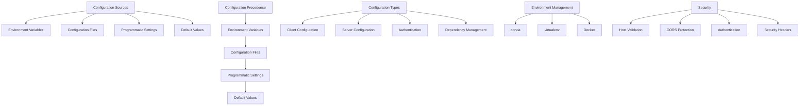
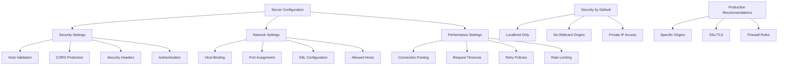
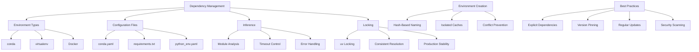

# Configuration

<cite>
**Referenced Files in This Document**   
- [environment_variables.py](file://mlflow/environment_variables.py)
- [server/security.py](file://mlflow/server/security.py)
- [server/security_utils.py](file://mlflow/server/security_utils.py)
- [server/auth/config.py](file://mlflow/server/auth/config.py)
- [utils/environment.py](file://mlflow/utils/environment.py)
- [utils/conda.py](file://mlflow/utils/conda.py)
- [examples/auth/auth.py](file://examples/auth/auth.py)
</cite>

## Table of Contents
1. [Introduction](#introduction)
2. [Configuration Architecture](#configuration-architecture)
3. [Environment Variables](#environment-variables)
4. [Server Configuration](#server-configuration)
5. [Authentication Settings](#authentication-settings)
6. [Dependency Management](#dependency-management)
7. [Configuration Precedence](#configuration-precedence)
8. [Practical Examples](#practical-examples)
9. [Best Practices](#best-practices)
10. [Conclusion](#conclusion)

## Introduction
MLflow's configuration system provides a comprehensive framework for customizing behavior, securing deployments, and managing dependencies across various environments. This document details the architecture and implementation of MLflow's settings and environment management, focusing on key components such as environment variables, server configuration files, authentication mechanisms, and dependency management. The configuration system enables users to adapt MLflow to their specific infrastructure requirements, from local development to production deployments. By understanding the configuration hierarchy and available options, users can effectively control MLflow's behavior, ensure secure access to tracking servers, and maintain reproducible environments for model development and deployment.

## Configuration Architecture
MLflow's configuration architecture is built around a hierarchical system that combines environment variables, configuration files, and programmatic settings to provide flexible control over the platform's behavior. The architecture is designed to support both simple local setups and complex distributed deployments, with clear precedence rules determining which configuration takes effect when multiple sources are present. At the core of this architecture is the separation between client-side and server-side configuration, allowing different aspects of MLflow to be managed independently.

The system follows a layered approach where configuration options are evaluated in a specific order: environment variables take precedence over default values and configuration files, enabling dynamic configuration in different deployment environments. This design allows for seamless integration with containerization platforms, cloud infrastructure, and CI/CD pipelines. The architecture also incorporates security by default principles, with server configurations that restrict access to localhost by default and require explicit configuration for external access.



**Diagram sources**
- [environment_variables.py](file://mlflow/environment_variables.py)
- [server/security.py](file://mlflow/server/security.py)
- [server/security_utils.py](file://mlflow/server/security_utils.py)

**Section sources**
- [environment_variables.py](file://mlflow/environment_variables.py)
- [server/security.py](file://mlflow/server/security.py)
- [server/security_utils.py](file://mlflow/server/security_utils.py)

## Environment Variables
MLflow utilizes a comprehensive set of environment variables to control various aspects of its behavior, from tracking server configuration to dependency management and security settings. These variables follow a consistent naming convention, with public variables beginning with `MLFLOW_` and internal-use variables starting with `_MLFLOW_`. This systematic approach enables users to customize MLflow's behavior without modifying code, making it particularly valuable for containerized deployments and cloud environments.

Key environment variables include `MLFLOW_TRACKING_URI` for specifying the tracking server location, `MLFLOW_S3_ENDPOINT_URL` for configuring S3 artifact storage, and various authentication-related variables such as `MLFLOW_TRACKING_USERNAME` and `MLFLOW_TRACKING_PASSWORD`. The system also includes variables for controlling HTTP request behavior, such as retry policies and timeouts, which are crucial for reliable operation in network-constrained environments. For dependency management, variables like `MLFLOW_ENV_ROOT` determine where virtual environments are created, while `MLFLOW_CONDA_HOME` specifies the conda installation location.

The environment variable system is implemented through the `_EnvironmentVariable` class, which provides type-safe access and default values. Boolean variables use the `_BooleanEnvironmentVariable` subclass, which accepts various true/false representations (true/false, 1/0) for flexibility. This implementation ensures that configuration values are properly typed and validated, reducing configuration errors. The system also includes deprecation warnings for variables that are being phased out, providing a smooth transition path for users.

**Section sources**
- [environment_variables.py](file://mlflow/environment_variables.py)

## Server Configuration
MLflow server configuration focuses on security, accessibility, and performance tuning for the tracking server. The server implements security by default principles, only accepting localhost connections initially and requiring explicit configuration for external access. This approach protects against common security vulnerabilities while allowing flexible deployment options. Server configuration is primarily managed through command-line arguments and environment variables, with options for controlling host binding, port assignment, and SSL configuration.

Key security features include host header validation to prevent DNS rebinding attacks, CORS protection to control cross-origin requests, and security headers to enhance browser security. The server uses environment variables like `MLFLOW_SERVER_ALLOWED_HOSTS` and `MLFLOW_SERVER_CORS_ALLOWED_ORIGINS` to define acceptable hosts and origins, with patterns and wildcards supported for flexible configuration. For production deployments, the recommendation is to specify exact origins rather than using wildcards to minimize security risks.

The server also includes configuration options for performance and reliability, such as connection pooling settings for database connections and timeout configurations for HTTP requests. These settings help optimize server performance under load and ensure reliable operation in distributed environments. The configuration system supports both Flask and FastAPI implementations, providing flexibility in server architecture while maintaining consistent configuration interfaces.



**Diagram sources**
- [server/security.py](file://mlflow/server/security.py)
- [server/security_utils.py](file://mlflow/server/security_utils.py)
- [server/AGENTS.md](file://mlflow/server/AGENTS.md)

**Section sources**
- [server/security.py](file://mlflow/server/security.py)
- [server/security_utils.py](file://mlflow/server/security_utils.py)
- [server/AGENTS.md](file://mlflow/server/AGENTS.md)

## Authentication Settings
MLflow provides robust authentication mechanisms to secure access to tracking servers and protect sensitive model data. The authentication system supports multiple methods, including basic authentication with username/password credentials and token-based authentication. Configuration is managed through environment variables such as `MLFLOW_TRACKING_USERNAME`, `MLFLOW_TRACKING_PASSWORD`, and `MLFLOW_TRACKING_TOKEN`, which take precedence over each other in that order.

The server's authentication framework is extensible, allowing custom authentication functions to be specified in configuration files. This is configured through the `authorization_function` setting in the authentication configuration file, which points to a Python function that handles authentication logic. The default configuration uses basic authentication, but organizations can implement custom authentication schemes to integrate with existing identity management systems.

Authentication configuration is specified through the `MLFLOW_AUTH_CONFIG_PATH` environment variable, which points to an INI-style configuration file. This file contains settings for the default permission level, database URI for storing user credentials, admin credentials, and the authorization function. When starting the server, the `--app-name` flag enables the authentication middleware, activating the configured authentication scheme.

```mermaid
graph TD
A[Authentication Methods] --> B[Basic Authentication]
A --> C[Token Authentication]
A --> D[Custom Authentication]
B --> E[Username/Password]
B --> F[Environment Variables]
B --> G[Configuration File]
C --> H[Bearer Tokens]
C --> I[Environment Variables]
C --> J[Header Injection]
D --> K[Custom Functions]
D --> L[authorization_function]
D --> M[External Identity Providers]
N[Configuration] --> O[MLFLOW_AUTH_CONFIG_PATH]
N --> P[auth_config.ini]
N --> Q[authorization_function]
R[Server Setup] --> S[mlflow server]
R --> T[--app-name basic-auth]
R --> U[Authentication Middleware]
V[Security Best Practices] --> W[HTTPS/SSL]
V --> X[Strong Passwords]
V --> Y[Token Rotation]
V --> Z[Role-Based Access]
```



**Diagram sources**
- [server/auth/config.py](file://mlflow/server/auth/config.py)
- [examples/auth/auth.py](file://examples/auth/auth.py)
- [docs/docs/self-hosting/security/custom.md](file://docs/docs/self-hosting/security/custom.md)

**Section sources**
- [server/auth/config.py](file://mlflow/server/auth/config.py)
- [examples/auth/auth.py](file://examples/auth/auth.py)

## Dependency Management
MLflow's dependency management system provides comprehensive support for creating reproducible environments across different package managers and deployment targets. The system supports multiple environment types including conda, virtualenv, and Docker, allowing users to choose the most appropriate tool for their workflow. Configuration is managed through environment variables like `MLFLOW_ENV_ROOT` for specifying the root directory for environments and `MLFLOW_CONDA_HOME` for locating conda installations.

For conda environments, MLflow uses `conda.yaml` files to specify dependencies, with support for both conda and pip packages within the same environment specification. The system automatically handles the creation of isolated conda environments with unique names based on hash values of the environment specification, preventing naming conflicts. When creating environments, MLflow configures isolated package caches to avoid race conditions that can occur with shared caches in concurrent environments.

The dependency management system also includes advanced features like requirement inference, where MLflow can automatically detect package dependencies by analyzing imported modules in the model code. This is controlled by variables like `MLFLOW_REQUIREMENTS_INFERENCE_TIMEOUT` which sets the timeout for the inference process. For production deployments, the system supports locking requirements using tools like `uv` to ensure consistent dependency resolution across environments.



**Diagram sources**
- [utils/environment.py](file://mlflow/utils/environment.py)
- [utils/conda.py](file://mlflow/utils/conda.py)
- [tests/utils/test_python_env.py](file://tests/utils/test_python_env.py)

**Section sources**
- [utils/environment.py](file://mlflow/utils/environment.py)
- [utils/conda.py](file://mlflow/utils/conda.py)

## Configuration Precedence
MLflow follows a clear precedence hierarchy when multiple configuration sources are present, ensuring predictable behavior across different deployment scenarios. The precedence order is designed to allow environment-specific overrides while maintaining sensible defaults. Environment variables have the highest precedence, followed by configuration files, programmatic settings, and finally default values. This hierarchy enables users to set baseline configurations in files while allowing deployment-specific overrides through environment variables.

When multiple configuration sources specify the same setting, the value from the highest-precedence source is used. For example, if `MLFLOW_TRACKING_URI` is set as an environment variable, it will override any value specified in a configuration file or set programmatically. This design is particularly useful in containerized environments where environment variables can be injected at runtime to adapt MLflow to different infrastructure configurations.

The precedence system also includes special handling for boolean variables and security settings. For authentication, the `MLFLOW_TRACKING_TOKEN` takes precedence over username/password credentials, allowing token-based authentication to override basic authentication when both are configured. Security-related settings like host validation and CORS configuration follow similar precedence rules, with more restrictive settings typically taking precedence to maintain security by default principles.

```mermaid
graph TD
A[Configuration Precedence] --> B[Highest Priority]
A --> C[Medium Priority]
A --> D[Low Priority]
A --> E[Default Values]
B --> F[Environment Variables]
F --> G[MLFLOW_TRACKING_URI]
F --> H[MLFLOW_TRACKING_TOKEN]
F --> I[MLFLOW_SERVER_ALLOWED_HOSTS]
C --> J[Configuration Files]
J --> K[auth_config.ini]
J --> L[conda.yaml]
J --> M[server configuration]
D --> N[Programmatic Settings]
N --> O[mlflow.set_tracking_uri()]
N --> P[mlflow.set_registry_uri()]
N --> Q[client configuration]
E --> R[Default Values]
R --> S[localhost:5000]
R --> T[no authentication]
R --> U[localhost only]
V[Precedence Rules] --> W[Environment > Files]
V --> X[Files > Programmatic]
V --> Y[Programmatic > Defaults]
V --> Z[Token > Username/Password]
```

**Diagram sources**
- [environment_variables.py](file://mlflow/environment_variables.py)
- [server/security.py](file://mlflow/server/security.py)
- [server/auth/config.py](file://mlflow/server/auth/config.py)

**Section sources**
- [environment_variables.py](file://mlflow/environment_variables.py)
- [server/security.py](file://mlflow/server/security.py)

## Practical Examples
This section provides practical examples demonstrating common MLflow configuration scenarios, illustrating how to apply the configuration options in real-world use cases. These examples cover configuring tracking server endpoints, setting up authentication, and managing conda/virtualenv environments, providing concrete guidance for users implementing MLflow in their workflows.

For tracking server configuration, users can set the `MLFLOW_TRACKING_URI` environment variable to point to a custom server, enabling centralized experiment tracking across teams. Authentication can be configured using environment variables for username/password or token-based access, with examples showing how to securely manage credentials in different deployment environments. The examples also demonstrate how to configure S3 artifact storage with custom endpoints and how to set up conda environments with specific dependency requirements.

The practical examples include code snippets and configuration files that users can adapt to their specific needs, with explanations of the key configuration options and their effects on system behavior. These examples are designed to be immediately useful while also illustrating the underlying principles of MLflow's configuration system, helping users understand how to extend and customize the configurations for their specific requirements.

**Section sources**
- [examples/auth/auth.py](file://examples/auth/auth.py)
- [examples/pytorch/torchscript/IrisClassification/README.md](file://examples/pytorch/torchscript/IrisClassification/README.md)
- [docs/docs/self-hosting/security/custom.md](file://docs/docs/self-hosting/security/custom.md)

## Best Practices
Implementing MLflow configuration effectively requires following several best practices to ensure security, reliability, and maintainability. Security should be a primary consideration, with recommendations to use HTTPS for all production deployments, configure specific allowed hosts and origins rather than using wildcards, and implement strong authentication mechanisms. For tracking servers exposed to external networks, it's recommended to use reverse proxies with additional security layers and to regularly update credentials and tokens.

For dependency management, best practices include explicitly specifying all dependencies with version pins, using environment files to ensure reproducibility, and regularly updating packages to address security vulnerabilities. When using conda environments, it's recommended to use isolated package caches to prevent race conditions in concurrent environments. For containerized deployments, minimizing image size by using appropriate base images and cleaning up temporary files can improve deployment efficiency.

Configuration management best practices include using version control for configuration files, implementing consistent naming conventions, and documenting configuration changes. For team environments, establishing clear ownership and review processes for configuration changes can prevent configuration drift and ensure compliance with organizational policies. Monitoring and logging should be enabled to track configuration changes and detect potential security issues.

**Section sources**
- [server/AGENTS.md](file://mlflow/server/AGENTS.md)
- [docs/docs/self-hosting/security/custom.md](file://docs/docs/self-hosting/security/custom.md)
- [examples/auth/auth.py](file://examples/auth/auth.py)

## Conclusion
MLflow's configuration system provides a comprehensive and flexible framework for customizing the platform's behavior across various deployment scenarios. By understanding the architecture of environment variables, server configuration, authentication settings, and dependency management, users can effectively adapt MLflow to their specific requirements. The hierarchical configuration precedence ensures predictable behavior while allowing necessary flexibility for different environments.

The system's design emphasizes security by default, with sensible defaults that protect against common vulnerabilities while allowing customization for specific use cases. The extensive support for different environment management tools and deployment targets makes MLflow suitable for both individual researchers and large organizations with complex infrastructure requirements.

By following the best practices outlined in this document and leveraging the practical examples provided, users can implement robust MLflow configurations that support reproducible machine learning workflows, secure data management, and efficient collaboration. As MLflow continues to evolve, its configuration system will likely expand to support additional deployment scenarios and integration points, further enhancing its versatility in the machine learning ecosystem.