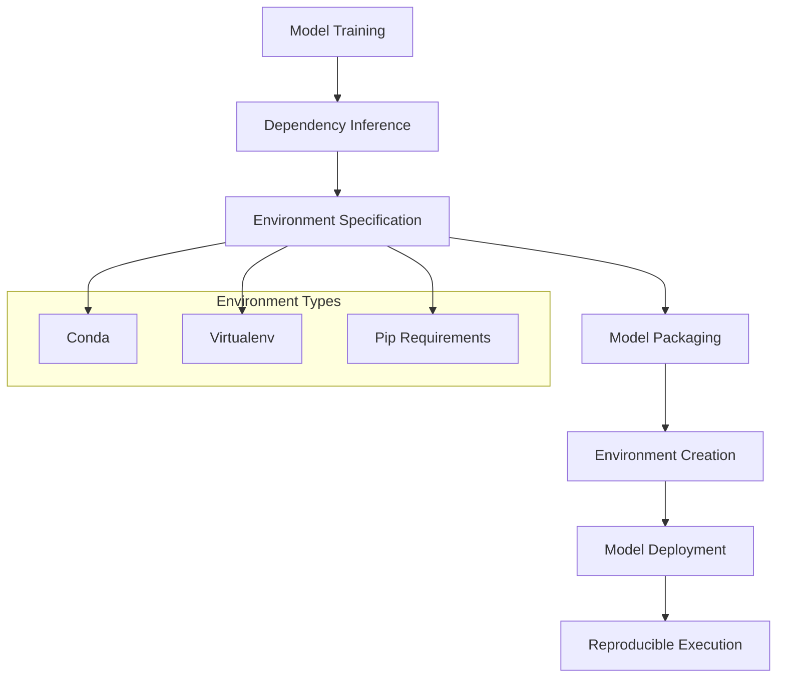
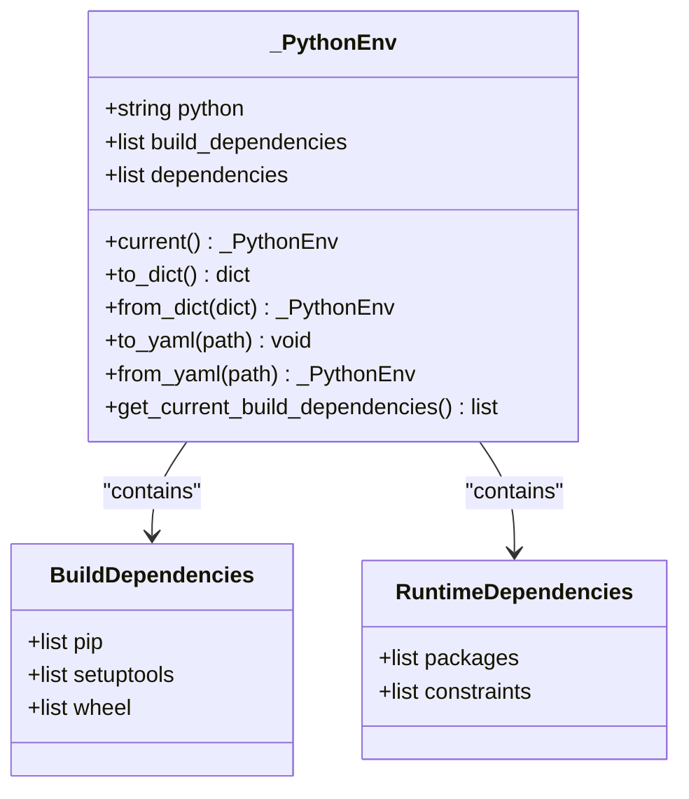
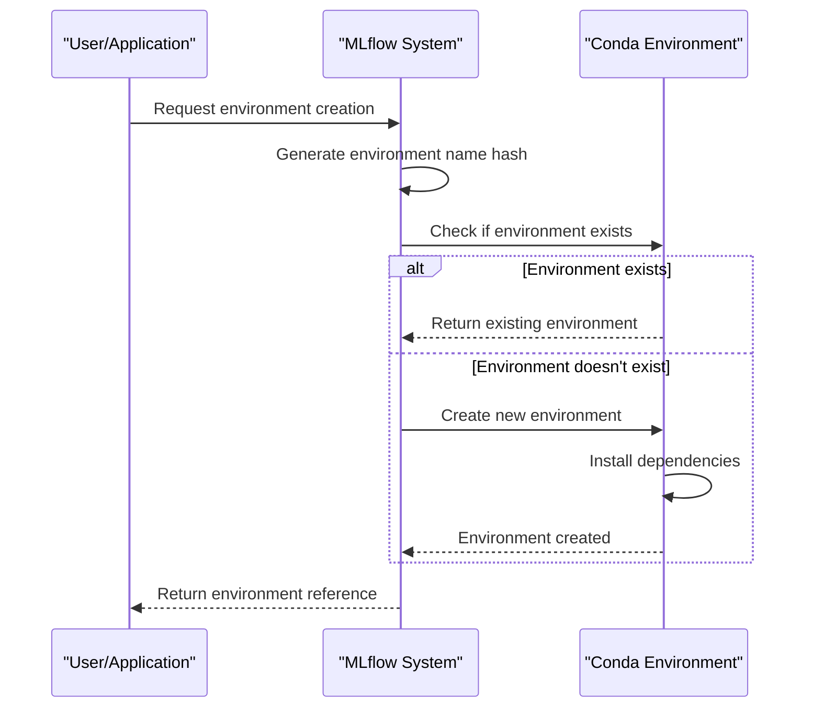
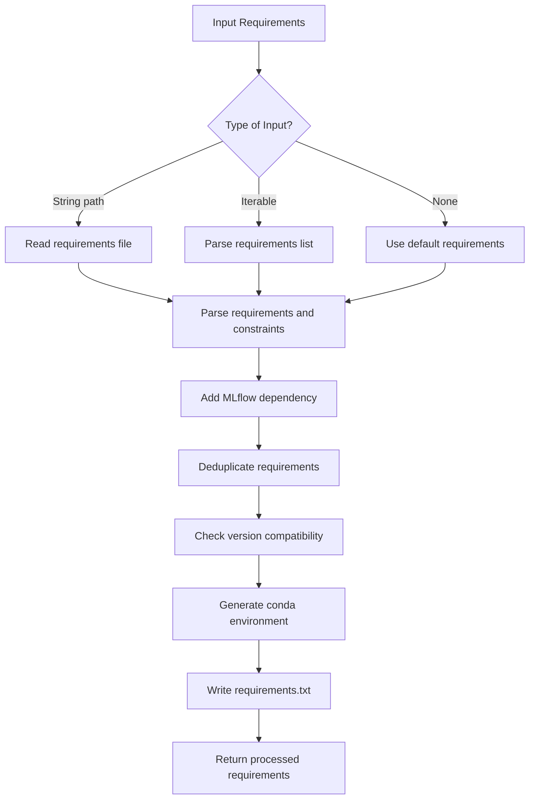
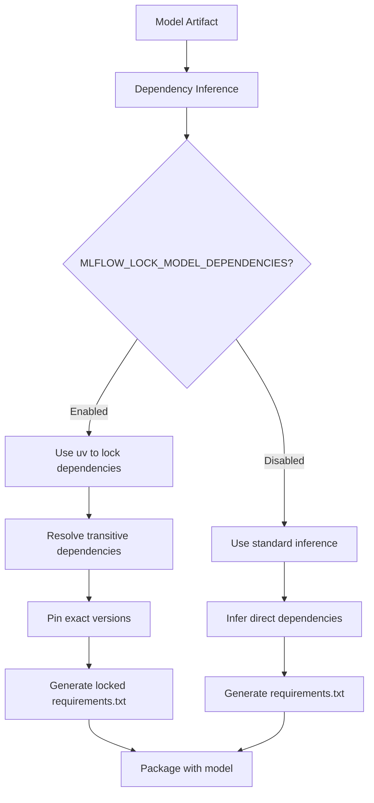
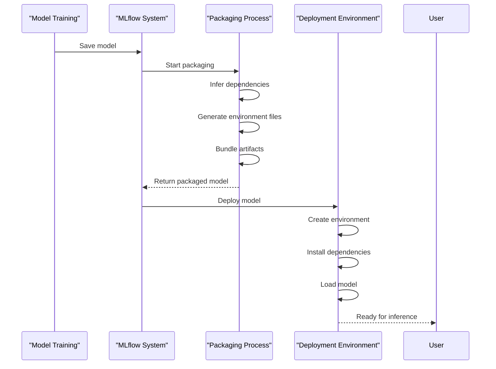

# Dependency Management

<cite>
**Referenced Files in This Document**   
- [mlflow/utils/environment.py](file://mlflow/utils/environment.py)
- [mlflow/utils/conda.py](file://mlflow/utils/conda.py)
- [mlflow/projects/env_type.py](file://mlflow/projects/env_type.py)
- [mlflow/models/wheeled_model.py](file://mlflow/models/wheeled_model.py)
- [mlflow/R/mlflow/R/model-utils.R](file://mlflow/R/mlflow/R/model-utils.R)
- [examples/sklearn_elasticnet_wine/python_env.yaml](file://examples/sklearn_elasticnet_wine/python_env.yaml)
- [examples/tensorflow/conda.yaml](file://examples/tensorflow/conda.yaml)
- [examples/flower_classifier/python_env.yaml](file://examples/flower_classifier/python_env.yaml)
- [examples/virtualenv/project/requirements.txt](file://examples/virtualenv/project/requirements.txt)
- [docs/docs/classic-ml/model/dependencies/index.mdx](file://docs/docs/classic-ml/model/dependencies/index.mdx)
</cite>

## Table of Contents
1. [Introduction](#introduction)
2. [Core Environment Management System](#core-environment-management-system)
3. [Python Environment Specification](#python-environment-specification)
4. [Conda Environment Integration](#conda-environment-integration)
5. [Pip Requirements Handling](#pip-requirements-handling)
6. [Dependency Inference and Locking](#dependency-inference-and-locking)
7. [Model Packaging and Deployment](#model-packaging-and-deployment)
8. [Configuration Options and Best Practices](#configuration-options-and-best-practices)
9. [Common Issues and Troubleshooting](#common-issues-and-troubleshooting)
10. [Advanced Topics](#advanced-topics)

## Introduction
MLflow's environment packaging system provides a comprehensive solution for capturing and managing Python dependencies to ensure reproducible model environments. The system supports multiple environment management approaches including conda, virtualenv, and pip requirements files, allowing users to maintain consistent environments across development, testing, and production deployments. This documentation details the implementation of MLflow's dependency management system, covering configuration options, implementation details, and best practices for ensuring model reproducibility, portability, and deployment reliability.

## Core Environment Management System
MLflow's environment management system is designed to capture the complete dependency graph of machine learning models, ensuring that models can be reliably reproduced and deployed across different environments. The system supports three primary environment types: Docker, Python, and Conda, as defined in the `env_type.py` module. Each environment type provides specific mechanisms for dependency management, with the Python environment being the most commonly used approach for MLflow models.

The core of MLflow's environment management is built around the `_PythonEnv` class in the `environment.py` module, which represents environment information for MLflow models and projects. This class captures Python version specifications, build dependencies (such as pip, setuptools, and wheel), and runtime dependencies. The system automatically generates environment configuration files during model packaging, ensuring that all required dependencies are properly specified and versioned.

**Diagram sources**
- [mlflow/utils/environment.py](file://mlflow/utils/environment.py#L68-L138)
- [mlflow/projects/env_type.py](file://mlflow/projects/env_type.py#L1-L4)

**Section sources**
- [mlflow/utils/environment.py](file://mlflow/utils/environment.py#L68-L138)
- [mlflow/projects/env_type.py](file://mlflow/projects/env_type.py#L1-L4)

## Python Environment Specification
MLflow's Python environment specification system uses the `_PythonEnv` class to capture and manage Python dependencies. This class provides a structured approach to defining environment requirements, with support for Python version specification, build dependencies, and runtime dependencies. The environment specification is stored in a `python_env.yaml` file that accompanies the model artifacts.

The `_PythonEnv` class includes several key methods for environment management:
- `current()`: Creates an environment specification based on the current Python environment
- `to_dict()` and `from_dict()`: Serializes and deserializes environment specifications
- `to_yaml()` and `from_yaml()`: Writes and reads environment specifications to and from YAML files
- `get_current_build_dependencies()`: Retrieves the current versions of build dependencies (pip, setuptools, wheel)

When creating a new environment specification, MLflow captures the current Python version and the versions of essential build tools. This ensures that the environment can be consistently recreated with the same toolchain. The system also supports specifying custom Python versions and dependency lists, providing flexibility for different deployment scenarios.

**Diagram sources**
- [mlflow/utils/environment.py](file://mlflow/utils/environment.py#L68-L138)

**Section sources**
- [mlflow/utils/environment.py](file://mlflow/utils/environment.py#L68-L138)
- [examples/flower_classifier/python_env.yaml](file://examples/flower_classifier/python_env.yaml#L1-L9)
- [examples/sklearn_elasticnet_wine/python_env.yaml](file://examples/sklearn_elasticnet_wine/python_env.yaml#L1-L7)

## Conda Environment Integration
MLflow provides comprehensive support for Conda environments through the `conda.py` module, which handles the creation, management, and activation of Conda environments for MLflow projects and models. The integration allows users to leverage Conda's powerful package management capabilities while maintaining compatibility with MLflow's model packaging and deployment workflows.

The Conda integration includes several key components:
- `get_conda_command()`: Generates the appropriate command sequence to activate a Conda environment based on the operating system
- `get_conda_bin_executable()`: Locates Conda executables, respecting the `MLFLOW_CONDA_HOME` environment variable for custom Conda installations
- `get_or_create_conda_env()`: Creates or retrieves an existing Conda environment based on a specification file
- `_create_conda_env()`: Handles the actual creation of Conda environments with error handling and retry logic for network issues

MLflow uses a consistent naming convention for Conda environments, generating environment names based on a hash of the environment specification. This ensures that environments with identical specifications are reused, while different specifications result in separate environments. The system also supports isolated package caches to prevent conflicts between concurrent environment creations.

**Diagram sources**
- [mlflow/utils/conda.py](file://mlflow/utils/conda.py#L1-L358)
- [mlflow/utils/environment.py](file://mlflow/utils/environment.py#L211-L272)

**Section sources**
- [mlflow/utils/conda.py](file://mlflow/utils/conda.py#L1-L358)
- [examples/tensorflow/conda.yaml](file://examples/tensorflow/conda.yaml#L1-L10)

## Pip Requirements Handling
MLflow's pip requirements handling system provides robust support for managing Python dependencies through pip requirements files. The system automatically generates `requirements.txt` files during model packaging, capturing both direct and transitive dependencies. This ensures that models can be reliably reproduced in different environments.

The pip requirements system includes several key features:
- Automatic inference of model dependencies by analyzing imported packages
- Support for requirements files, direct package specifications, and constraint files
- Version pinning to ensure reproducible environments
- Conflict detection and resolution for dependency versions
- Integration with Conda environments for hybrid package management

MLflow processes pip requirements through the `_process_pip_requirements()` function, which handles the parsing, validation, and processing of dependency specifications. The system automatically adds MLflow itself to the requirements list unless explicitly excluded, ensuring that the MLflow library is available when loading and using the model.

**Diagram sources**
- [mlflow/utils/environment.py](file://mlflow/utils/environment.py#L681-L716)
- [mlflow/utils/environment.py](file://mlflow/utils/environment.py#L346-L389)

**Section sources**
- [mlflow/utils/environment.py](file://mlflow/utils/environment.py#L681-L716)
- [examples/virtualenv/project/requirements.txt](file://examples/virtualenv/project/requirements.txt#L1-L3)

## Dependency Inference and Locking
MLflow's dependency inference system automatically detects the Python packages required by a model by analyzing the code and imported modules. This feature eliminates the need for manual dependency specification, reducing the risk of missing dependencies in production environments. The inference process creates a subprocess to load the model and monitor which packages are imported, ensuring accurate dependency detection.

The system includes advanced features for dependency locking to enhance reproducibility:
- **MLFLOW_LOCK_MODEL_DEPENDENCIES**: When enabled, this environment variable triggers dependency locking using the `uv` tool, which resolves and pins all transitive dependencies to their exact versions
- **Requirement deduplication**: The system automatically merges duplicate package specifications, combining version constraints and extras
- **Version conflict detection**: MLflow validates that specified version constraints are compatible, warning users of potential conflicts
- **Constraint file support**: The system supports pip constraint files to manage version restrictions across multiple packages

Dependency locking provides enhanced reproducibility by capturing the complete dependency tree at the time of model creation. This approach ensures that models can be reliably reproduced even if newer versions of dependencies become available. However, it may increase the size of the requirements file significantly, as all transitive dependencies are explicitly listed.

**Diagram sources**
- [mlflow/utils/environment.py](file://mlflow/utils/environment.py#L400-L454)
- [mlflow/utils/environment.py](file://mlflow/utils/environment.py#L513-L579)
- [docs/docs/classic-ml/model/dependencies/index.mdx](file://docs/docs/classic-ml/model/dependencies/index.mdx#L55-L103)

**Section sources**
- [mlflow/utils/environment.py](file://mlflow/utils/environment.py#L400-L454)
- [mlflow/utils/environment.py](file://mlflow/utils/environment.py#L513-L579)
- [docs/docs/classic-ml/model/dependencies/index.mdx](file://docs/docs/classic-ml/model/dependencies/index.mdx#L55-L103)

## Model Packaging and Deployment
MLflow's model packaging system integrates dependency management into the model serialization process, ensuring that all required dependencies are captured and packaged with the model artifacts. The system generates multiple environment specification files, including `conda.yaml`, `requirements.txt`, and `python_env.yaml`, providing flexibility for different deployment scenarios.

The model packaging workflow follows these steps:
1. **Dependency inference**: Automatically detect the Python packages required by the model
2. **Environment specification**: Create environment configuration files with appropriate dependencies
3. **Artifact packaging**: Bundle the model, environment files, and any additional artifacts
4. **Validation**: Verify that the packaged model can be loaded and executed in a clean environment

For deployment, MLflow supports multiple environment managers, including local virtual environments, Conda environments, and Docker containers. The system provides utilities for installing model dependencies into the target environment, handling both build dependencies (installed first) and runtime dependencies. This two-phase installation process ensures that packages with complex build requirements can be properly installed.

The `wheeled_model.py` module implements an advanced packaging approach that includes pre-compiled wheel files with the model artifacts. This approach eliminates the need for compilation during deployment, significantly reducing deployment time and avoiding potential compilation errors in restricted environments.

**Diagram sources**
- [mlflow/models/wheeled_model.py](file://mlflow/models/wheeled_model.py#L1-L200)
- [mlflow/utils/environment.py](file://mlflow/utils/environment.py#L211-L272)

**Section sources**
- [mlflow/models/wheeled_model.py](file://mlflow/models/wheeled_model.py#L1-L200)
- [mlflow/utils/environment.py](file://mlflow/utils/environment.py#L211-L272)

## Configuration Options and Best Practices
MLflow provides several configuration options for managing dependencies in different scenarios. These options allow users to customize the dependency management behavior to suit their specific requirements and constraints.

### Configuration Environment Variables
- **MLFLOW_CONDA_HOME**: Specifies the path to a custom Conda installation
- **MLFLOW_CONDA_CREATE_ENV_CMD**: Specifies the command to use for creating Conda environments
- **MLFLOW_LOCK_MODEL_DEPENDENCIES**: Enables or disables dependency locking using `uv`
- **MLFLOW_REQUIREMENTS_INFERENCE_RAISE_ERRORS**: Controls whether errors during dependency inference should be raised or handled gracefully
- **MLFLOW_WHEELED_MODEL_PIP_DOWNLOAD_OPTIONS**: Customizes pip download options when creating wheeled models

### Best Practices for Different Scenarios
**Local Development:**
- Use `extra_pip_requirements` parameter when logging models to include additional dependencies
- Regularly update dependencies to incorporate security patches and bug fixes
- Use virtual environments to isolate project dependencies
- Test model loading in a clean environment to verify dependency completeness

**Cloud Deployment:**
- Enable dependency locking (`MLFLOW_LOCK_MODEL_DEPENDENCIES=true`) for maximum reproducibility
- Consider using wheeled models to reduce deployment time and avoid compilation issues
- Use constraint files to manage version compatibility across multiple models
- Monitor dependency sizes to optimize deployment performance

**Containerized Environments:**
- Minimize environment size by removing unnecessary dependencies
- Use multi-stage builds to separate build and runtime dependencies
- Cache dependency installation to speed up container builds
- Consider using slim base images to reduce overall container size

### Recommended Workflow
1. Develop and train models in a consistent environment
2. Use MLflow's automatic dependency inference to capture required packages
3. Add any missing dependencies using the `extra_pip_requirements` parameter
4. Enable dependency locking for production models to ensure reproducibility
5. Test model loading in a clean environment before deployment
6. Monitor and update dependencies regularly to address security vulnerabilities

**Section sources**
- [mlflow/utils/environment.py](file://mlflow/utils/environment.py#L17-L24)
- [docs/docs/classic-ml/model/dependencies/index.mdx](file://docs/docs/classic-ml/model/dependencies/index.mdx#L55-L103)
- [mlflow/models/wheeled_model.py](file://mlflow/models/wheeled_model.py#L92-L95)

## Common Issues and Troubleshooting
Despite MLflow's robust dependency management system, users may encounter various issues related to dependency conflicts, version incompatibilities, and missing packages. Understanding these common issues and their solutions is essential for maintaining reliable model deployments.

### Dependency Conflicts
Dependency conflicts occur when different packages require incompatible versions of the same dependency. MLflow's dependency system includes conflict detection that warns users when incompatible version constraints are detected. To resolve conflicts:
- Update conflicting packages to versions with compatible dependencies
- Use constraint files to specify compatible version ranges
- Consider using virtual environments with isolated dependencies
- Test dependency resolution in a clean environment before deployment

### Version Incompatibilities
Version incompatibilities can arise when a model is trained with specific package versions but deployed with different versions. To prevent this:
- Use version pinning in requirements files
- Enable dependency locking for production models
- Test models with the exact dependency versions used in production
- Monitor package updates for breaking changes

### Missing Packages in Deployment Environments
Missing packages can occur when dependency inference fails to detect all required packages. This commonly happens with:
- Dynamically imported modules
- Optional dependencies used in specific code paths
- System-level dependencies not managed by pip or conda

To address missing packages:
- Use the `extra_pip_requirements` parameter to explicitly specify additional dependencies
- Test model loading in a clean environment to identify missing packages
- Review code for dynamic imports and ensure dependencies are properly specified
- Consider using static analysis tools to detect import patterns

### Troubleshooting Steps
1. **Verify environment creation**: Check that the environment is created successfully and all dependencies are installed
2. **Test model loading**: Attempt to load the model in a clean environment to identify missing dependencies
3. **Check dependency versions**: Verify that installed package versions match the specified requirements
4. **Review logs**: Examine MLflow and package manager logs for error messages and warnings
5. **Validate inference**: Test model inference with sample data to ensure proper functionality

**Section sources**
- [mlflow/utils/environment.py](file://mlflow/utils/environment.py#L719-L758)
- [mlflow/utils/environment.py](file://mlflow/utils/environment.py#L703-L704)
- [docs/docs/classic-ml/model/dependencies/index.mdx](file://docs/docs/classic-ml/model/dependencies/index.mdx#L51-L53)

## Advanced Topics
MLflow's dependency management system includes several advanced features designed to address complex deployment scenarios and optimize model packaging.

### Minimizing Environment Size
Large environments can impact deployment speed and resource usage. Strategies for minimizing environment size include:
- Removing unnecessary dependencies and development packages
- Using slim base images for containerized deployments
- Employing dependency pruning tools to identify unused packages
- Leveraging shared environments across multiple models
- Using wheeled models to eliminate compilation dependencies

### Handling System-Level Dependencies
System-level dependencies (such as C libraries or system tools) require special handling as they cannot be managed by Python package managers. Approaches include:
- Documenting system requirements in model metadata
- Using Docker containers to encapsulate system dependencies
- Providing installation scripts for system dependencies
- Leveraging platform-specific package managers (apt, yum, brew) in deployment scripts

### Cross-Platform Compatibility
Ensuring model compatibility across different operating systems and architectures requires careful dependency management:
- Using platform-independent packages when possible
- Specifying platform-specific dependencies with appropriate markers
- Testing models on target platforms before deployment
- Using containerization to ensure consistent environments across platforms

### Security Considerations
Dependency management has important security implications:
- Regularly updating dependencies to address security vulnerabilities
- Using dependency scanning tools to identify known vulnerabilities
- Pinning dependency versions to prevent automatic updates that may introduce vulnerabilities
- Verifying package integrity through checksums or digital signatures
- Minimizing the attack surface by reducing the number of dependencies

### Performance Optimization
Optimizing dependency management for performance involves:
- Caching dependency installations to speed up repeated deployments
- Using pre-compiled wheels to eliminate compilation time
- Parallelizing dependency installation when possible
- Minimizing the number of network requests during installation
- Optimizing the order of dependency installation to reduce total time

**Section sources**
- [mlflow/models/wheeled_model.py](file://mlflow/models/wheeled_model.py#L92-L95)
- [mlflow/utils/environment.py](file://mlflow/utils/environment.py#L513-L579)
- [docs/docs/classic-ml/model/dependencies/index.mdx](file://docs/docs/classic-ml/model/dependencies/index.mdx#L102-L103)