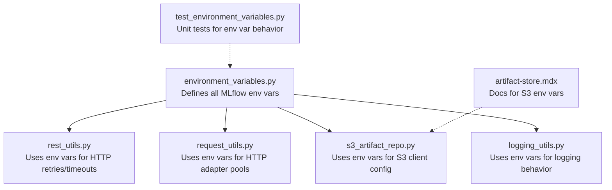
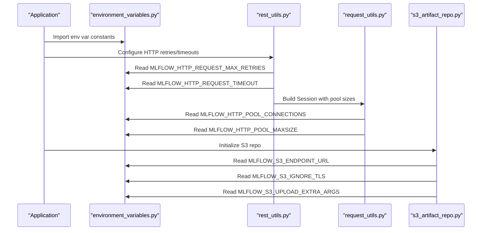
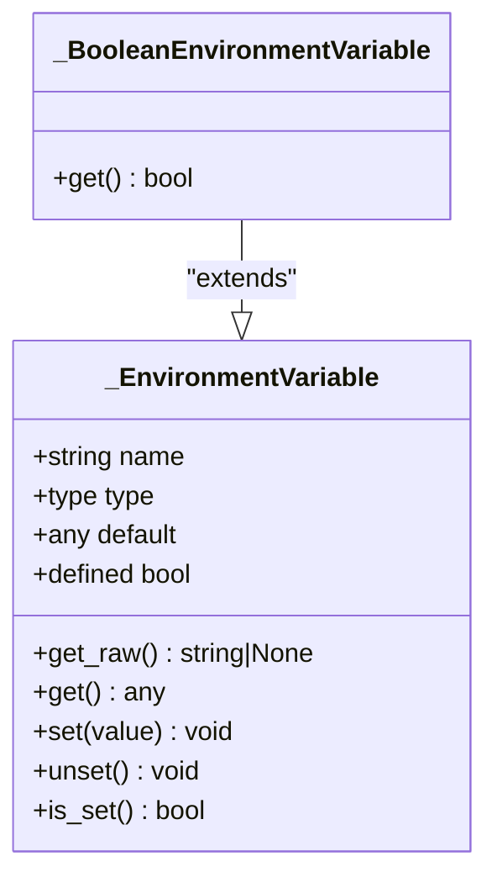
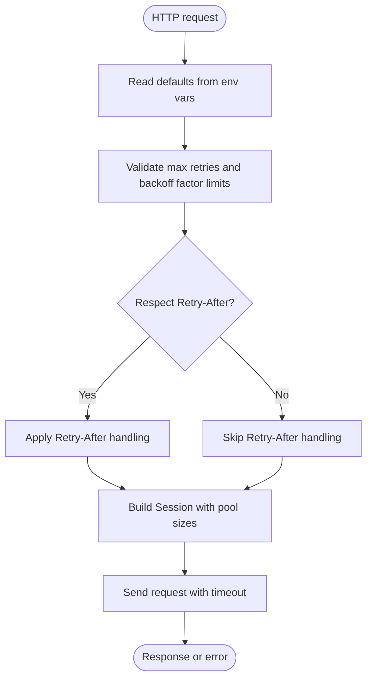
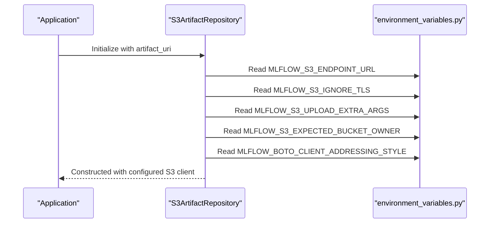
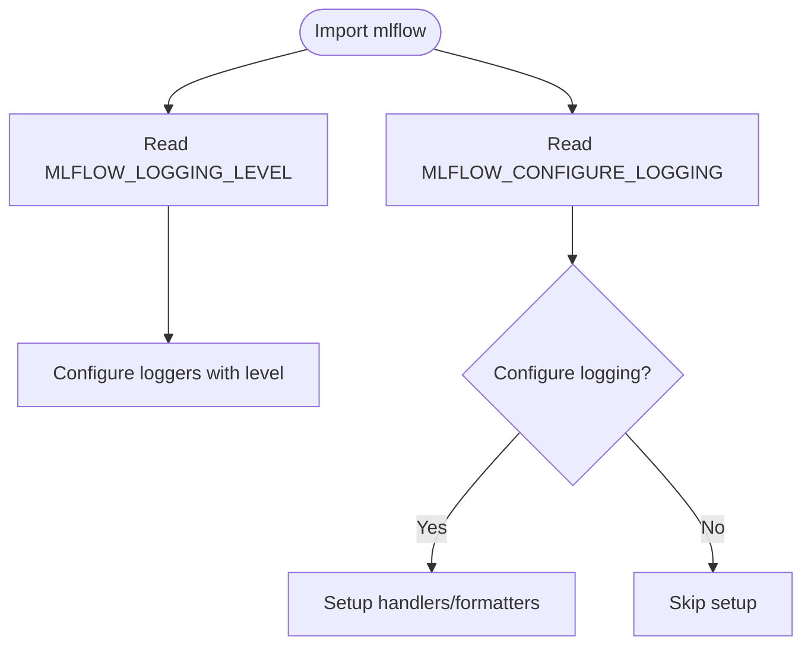
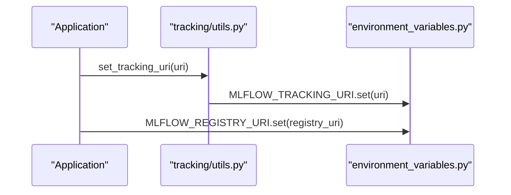
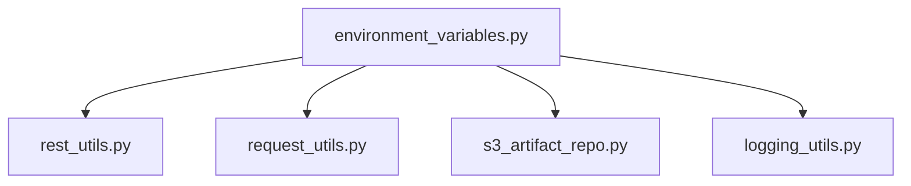

# Environment Variables

<cite>
**Referenced Files in This Document**
- [environment_variables.py](file://mlflow/environment_variables.py)
- [test_environment_variables.py](file://tests/test_environment_variables.py)
- [rest_utils.py](file://mlflow/utils/rest_utils.py)
- [request_utils.py](file://mlflow/utils/request_utils.py)
- [s3_artifact_repo.py](file://mlflow/store/artifact/s3_artifact_repo.py)
- [artifact-store.mdx](file://docs/docs/self-hosting/architecture/artifact-store.mdx)
- [utils/logging_utils.py](file://mlflow/utils/logging_utils.py)
- [test_logging_utils.py](file://tests/utils/test_logging_utils.py)
- [tracking/utils.py](file://mlflow/tracking/_tracking_service/utils.py)
- [_project_spec.py](file://mlflow/projects/_project_spec.py)
- [conftest.py](file://tests/db/conftest.py)
- [README.md](file://examples/pytorch/torchscript/IrisClassification/README.md)
</cite>

## Table of Contents
1. [Introduction](#introduction)
2. [Project Structure](#project-structure)
3. [Core Components](#core-components)
4. [Architecture Overview](#architecture-overview)
5. [Detailed Component Analysis](#detailed-component-analysis)
6. [Dependency Analysis](#dependency-analysis)
7. [Performance Considerations](#performance-considerations)
8. [Troubleshooting Guide](#troubleshooting-guide)
9. [Conclusion](#conclusion)
10. [Appendices](#appendices)

## Introduction
This document explains MLflow’s environment variable system and how environment variables control MLflow behavior across different environments and deployment scenarios. It covers how variables are defined, validated, and accessed throughout the codebase, and provides practical examples for common use cases such as setting the tracking URI, configuring artifact storage, and controlling autologging behavior. It also documents precedence rules when multiple configuration methods are used and offers troubleshooting guidance for common configuration issues.

## Project Structure
MLflow centralizes environment variable definitions in a single module and consumes them across subsystems such as HTTP requests, artifact repositories, logging, and tracing. Tests validate the behavior of environment variables and ensure consistent defaults and conversions.

**Diagram sources**
- [environment_variables.py](file://mlflow/environment_variables.py#L1-L1210)
- [rest_utils.py](file://mlflow/utils/rest_utils.py#L1-L250)
- [request_utils.py](file://mlflow/utils/request_utils.py#L118-L164)
- [s3_artifact_repo.py](file://mlflow/store/artifact/s3_artifact_repo.py#L122-L207)
- [artifact-store.mdx](file://docs/docs/self-hosting/architecture/artifact-store.mdx#L49-L122)
- [test_environment_variables.py](file://tests/test_environment_variables.py#L1-L91)

**Section sources**
- [environment_variables.py](file://mlflow/environment_variables.py#L1-L1210)
- [test_environment_variables.py](file://tests/test_environment_variables.py#L1-L91)

## Core Components
- Environment variable abstraction:
  - A generic class reads raw values from the environment, converts them to the desired type, and returns defaults when not present.
  - A specialized boolean variant enforces accepted values and raises errors for invalid inputs.
- Centralized definitions:
  - All MLflow environment variables are defined in a single module with clear defaults and comments.
- Consumption across subsystems:
  - HTTP utilities read retry/backoff/timeout settings from environment variables.
  - Artifact repositories read S3 endpoint, TLS, and upload extra args from environment variables.
  - Logging utilities read logging level and configure behavior accordingly.
  - Tests validate environment variable behavior and defaults.

**Section sources**
- [environment_variables.py](file://mlflow/environment_variables.py#L13-L120)
- [environment_variables.py](file://mlflow/environment_variables.py#L75-L107)
- [environment_variables.py](file://mlflow/environment_variables.py#L140-L212)
- [environment_variables.py](file://mlflow/environment_variables.py#L194-L212)
- [environment_variables.py](file://mlflow/environment_variables.py#L1028-L1032)
- [test_environment_variables.py](file://tests/test_environment_variables.py#L1-L91)

## Architecture Overview
The environment variable system follows a simple, consistent pattern:
- Define variables with a name, type, and default in the environment variables module.
- Access variables via the module’s attributes to retrieve typed values.
- Subsystems import and consume these variables to adjust runtime behavior.

**Diagram sources**
- [environment_variables.py](file://mlflow/environment_variables.py#L140-L212)
- [rest_utils.py](file://mlflow/utils/rest_utils.py#L60-L120)
- [request_utils.py](file://mlflow/utils/request_utils.py#L118-L164)
- [s3_artifact_repo.py](file://mlflow/store/artifact/s3_artifact_repo.py#L122-L207)

## Detailed Component Analysis

### Environment Variable Abstraction
- Generic environment variable:
  - Reads raw values from the environment.
  - Converts to the specified type; raises an error on conversion failure.
  - Returns the default when not present.
- Boolean environment variable:
  - Accepts “true”, “false”, “1”, “0” (case-insensitive).
  - Raises an error for invalid values.
  - Supports a deprecation warning path for a legacy variable.

**Diagram sources**
- [environment_variables.py](file://mlflow/environment_variables.py#L13-L120)
- [environment_variables.py](file://mlflow/environment_variables.py#L63-L100)

**Section sources**
- [environment_variables.py](file://mlflow/environment_variables.py#L13-L120)
- [environment_variables.py](file://mlflow/environment_variables.py#L63-L100)
- [test_environment_variables.py](file://tests/test_environment_variables.py#L1-L91)

### HTTP Request Configuration
- Retries and backoff:
  - Max retries, backoff factor, jitter, and respect retry-after header are read from environment variables.
  - Limits are enforced to prevent unsafe configurations.
- Timeouts:
  - Single-request timeout and deployment client timeout are configurable.
- Connection pooling:
  - Pool connections and pool maxsize are configurable and used to construct the HTTP adapter.

**Diagram sources**
- [rest_utils.py](file://mlflow/utils/rest_utils.py#L60-L120)
- [rest_utils.py](file://mlflow/utils/rest_utils.py#L197-L206)
- [rest_utils.py](file://mlflow/utils/rest_utils.py#L338-L385)
- [request_utils.py](file://mlflow/utils/request_utils.py#L118-L164)

**Section sources**
- [rest_utils.py](file://mlflow/utils/rest_utils.py#L60-L120)
- [rest_utils.py](file://mlflow/utils/rest_utils.py#L197-L206)
- [rest_utils.py](file://mlflow/utils/rest_utils.py#L338-L385)
- [request_utils.py](file://mlflow/utils/request_utils.py#L118-L164)

### Artifact Storage Configuration (S3-Compatible)
- Endpoint and TLS:
  - S3 endpoint URL and TLS verification toggle are read from environment variables.
- Upload extras:
  - Extra arguments for uploads are read from a JSON string environment variable.
- Bucket ownership verification:
  - Expected bucket owner is read from an environment variable to mitigate takeover risks.
- Addressing style:
  - S3 addressing style is read from an environment variable.

**Diagram sources**
- [s3_artifact_repo.py](file://mlflow/store/artifact/s3_artifact_repo.py#L122-L207)
- [artifact-store.mdx](file://docs/docs/self-hosting/architecture/artifact-store.mdx#L49-L122)

**Section sources**
- [s3_artifact_repo.py](file://mlflow/store/artifact/s3_artifact_repo.py#L122-L207)
- [artifact-store.mdx](file://docs/docs/self-hosting/architecture/artifact-store.mdx#L49-L122)

### Logging Configuration
- Logging level:
  - The logging level is read from an environment variable and applied when configuring loggers.
- Configure logging on import:
  - A boolean environment variable controls whether MLflow configures logging on import.

**Diagram sources**
- [utils/logging_utils.py](file://mlflow/utils/logging_utils.py#L103-L158)
- [environment_variables.py](file://mlflow/environment_variables.py#L1028-L1032)
- [test_logging_utils.py](file://tests/utils/test_logging_utils.py#L156-L194)

**Section sources**
- [utils/logging_utils.py](file://mlflow/utils/logging_utils.py#L103-L158)
- [environment_variables.py](file://mlflow/environment_variables.py#L1028-L1032)
- [test_logging_utils.py](file://tests/utils/test_logging_utils.py#L156-L194)

### Tracking URI and Registry URI
- Tracking URI:
  - The tracking URI environment variable is used to set the current tracking URI and propagate it to subprocesses.
- Registry URI:
  - The registry URI environment variable is used similarly for registry configuration.

**Diagram sources**
- [tracking/utils.py](file://mlflow/tracking/_tracking_service/utils.py#L110-L123)
- [environment_variables.py](file://mlflow/environment_variables.py#L101-L107)

**Section sources**
- [tracking/utils.py](file://mlflow/tracking/_tracking_service/utils.py#L110-L123)
- [environment_variables.py](file://mlflow/environment_variables.py#L101-L107)

### Practical Examples from the Codebase
- Setting the tracking URI:
  - The tracking URI environment variable is used to configure the tracking server address.
  - Example usage appears in documentation and tests.
- Configuring artifact storage:
  - S3 endpoint URL, TLS verification, upload extra args, and addressing style are read from environment variables.
- Controlling autologging behavior:
  - Autologging configuration is controlled via parameters to the autolog function; environment variables can influence logging behavior indirectly via the logging configuration flag.

**Section sources**
- [README.md](file://examples/pytorch/torchscript/IrisClassification/README.md#L41-L44)
- [s3_artifact_repo.py](file://mlflow/store/artifact/s3_artifact_repo.py#L149-L162)
- [artifact-store.mdx](file://docs/docs/self-hosting/architecture/artifact-store.mdx#L49-L122)
- [environment_variables.py](file://mlflow/environment_variables.py#L1028-L1032)
- [mlflow/tracking/fluent.py](file://mlflow/tracking/fluent.py#L3131-L3179)

## Dependency Analysis
- Coupling:
  - HTTP utilities depend on environment variables for retries, timeouts, and pool sizing.
  - Artifact repositories depend on environment variables for S3 configuration.
  - Logging utilities depend on environment variables for level and configure-on-import behavior.
- Cohesion:
  - All environment variable definitions are centralized, improving cohesion and reducing duplication.
- External dependencies:
  - HTTP utilities integrate with requests and urllib3 retry policies.
  - Artifact repositories integrate with boto3 S3 client configuration.

**Diagram sources**
- [environment_variables.py](file://mlflow/environment_variables.py#L140-L212)
- [rest_utils.py](file://mlflow/utils/rest_utils.py#L60-L120)
- [request_utils.py](file://mlflow/utils/request_utils.py#L118-L164)
- [s3_artifact_repo.py](file://mlflow/store/artifact/s3_artifact_repo.py#L122-L207)
- [utils/logging_utils.py](file://mlflow/utils/logging_utils.py#L103-L158)

**Section sources**
- [environment_variables.py](file://mlflow/environment_variables.py#L140-L212)
- [rest_utils.py](file://mlflow/utils/rest_utils.py#L60-L120)
- [request_utils.py](file://mlflow/utils/request_utils.py#L118-L164)
- [s3_artifact_repo.py](file://mlflow/store/artifact/s3_artifact_repo.py#L122-L207)
- [utils/logging_utils.py](file://mlflow/utils/logging_utils.py#L103-L158)

## Performance Considerations
- HTTP retries and backoff:
  - Tune max retries, backoff factor, and jitter to balance resilience and latency under rate limiting or transient failures.
- Connection pooling:
  - Adjust pool connections and pool maxsize to improve concurrency for high-throughput scenarios.
- S3 multipart uploads:
  - Configure multipart thresholds and chunk sizes to optimize large artifact transfers.
- Logging overhead:
  - Control logging verbosity via environment variables to reduce overhead in production.

[No sources needed since this section provides general guidance]

## Troubleshooting Guide
- Boolean environment variables:
  - Only “true”, “false”, “1”, “0” (case-insensitive) are valid for boolean variables. Invalid values raise an error.
- Deprecated logging variable:
  - A legacy logging variable triggers a deprecation warning; use the current logging configuration variable instead.
- HTTP request timeouts:
  - If requests fail with timeouts, increase the HTTP request timeout environment variable.
  - Ensure total retry timeout is not lower than single request timeout to avoid premature failures.
- TLS verification conflicts:
  - Do not set both a TLS verification bypass and a server certificate path simultaneously; they conflict.
- S3 endpoint and credentials:
  - Verify S3 endpoint URL, TLS verification, and upload extra args are correctly set.
  - Ensure addressing style aligns with the S3-compatible service.
- Tracking and registry URIs:
  - Ensure tracking and registry URIs are set consistently across processes and subprocesses.

**Section sources**
- [test_environment_variables.py](file://tests/test_environment_variables.py#L1-L91)
- [rest_utils.py](file://mlflow/utils/rest_utils.py#L387-L406)
- [rest_utils.py](file://mlflow/utils/rest_utils.py#L681-L724)
- [s3_artifact_repo.py](file://mlflow/store/artifact/s3_artifact_repo.py#L149-L162)
- [tracking/utils.py](file://mlflow/tracking/_tracking_service/utils.py#L110-L123)

## Conclusion
MLflow’s environment variable system provides a consistent, centralized mechanism to control behavior across HTTP configuration, artifact storage, logging, and more. By defining variables with clear defaults and consuming them in subsystems, MLflow ensures predictable behavior across diverse deployment scenarios. Tests validate correctness and help prevent misconfiguration.

[No sources needed since this section summarizes without analyzing specific files]

## Appendices

### Appendix A: Significant Environment Variables
- Tracking and registry URIs
  - MLFLOW_TRACKING_URI: Tracking server URI. Default: None.
  - MLFLOW_REGISTRY_URI: Registry server URI. Default: None.
- HTTP request configuration
  - MLFLOW_HTTP_REQUEST_MAX_RETRIES: Max retries for HTTP requests. Default: 7.
  - MLFLOW_HTTP_REQUEST_BACKOFF_FACTOR: Backoff factor for retries. Default: 2.
  - MLFLOW_HTTP_REQUEST_BACKOFF_JITTER: Jitter for backoff. Default: 1.0.
  - MLFLOW_HTTP_REQUEST_TIMEOUT: Single request timeout. Default: 120.
  - MLFLOW_DEPLOYMENT_CLIENT_HTTP_REQUEST_TIMEOUT: Deployment client timeout. Default: 300.
  - MLFLOW_HTTP_RESPECT_RETRY_AFTER_HEADER: Respect Retry-After header. Default: True.
  - MLFLOW_HTTP_POOL_CONNECTIONS: HTTP pool connections. Default: 10.
  - MLFLOW_HTTP_POOL_MAXSIZE: HTTP pool max size. Default: 10.
- S3 artifact storage
  - MLFLOW_S3_ENDPOINT_URL: S3 endpoint URL. Default: None.
  - MLFLOW_S3_IGNORE_TLS: Skip TLS verification. Default: False.
  - MLFLOW_S3_UPLOAD_EXTRA_ARGS: JSON upload extra args. Default: None.
  - MLFLOW_S3_EXPECTED_BUCKET_OWNER: Expected bucket owner account ID. Default: None.
  - MLFLOW_BOTO_CLIENT_ADDRESSING_STYLE: S3 addressing style. Default: "auto".
- Logging and configuration
  - MLFLOW_CONFIGURE_LOGGING: Configure logging on import. Default: True.
  - MLFLOW_LOGGING_LEVEL: Logging level. Default: None.
- Authentication and TLS for tracking
  - MLFLOW_TRACKING_USERNAME: Username for tracking server. Default: None.
  - MLFLOW_TRACKING_PASSWORD: Password for tracking server. Default: None.
  - MLFLOW_TRACKING_TOKEN: Bearer token for tracking server. Default: None.
  - MLFLOW_TRACKING_INSECURE_TLS: Bypass TLS verification. Default: False.
  - MLFLOW_TRACKING_SERVER_CERT_PATH: Server CA bundle path. Default: None.
  - MLFLOW_TRACKING_CLIENT_CERT_PATH: Client certificate path. Default: None.

**Section sources**
- [environment_variables.py](file://mlflow/environment_variables.py#L101-L107)
- [environment_variables.py](file://mlflow/environment_variables.py#L140-L212)
- [environment_variables.py](file://mlflow/environment_variables.py#L194-L212)
- [environment_variables.py](file://mlflow/environment_variables.py#L367-L396)
- [environment_variables.py](file://mlflow/environment_variables.py#L1028-L1032)

### Appendix B: Precedence Rules
- Explicit parameters take precedence over environment variables in APIs that accept parameters.
- Environment variables are consumed by subsystems when parameters are not provided.
- Tests demonstrate that when environment variables are not set, defaults are used; when set, values override defaults.

**Section sources**
- [rest_utils.py](file://mlflow/utils/rest_utils.py#L60-L120)
- [request_utils.py](file://mlflow/utils/request_utils.py#L118-L164)
- [test_environment_variables.py](file://tests/test_environment_variables.py#L52-L85)
- [conftest.py](file://tests/db/conftest.py#L1-L10)