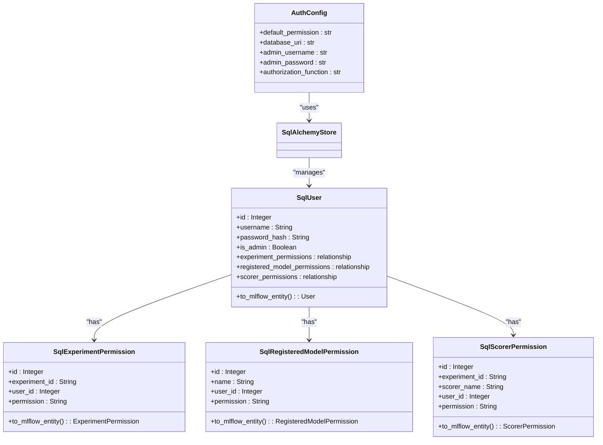
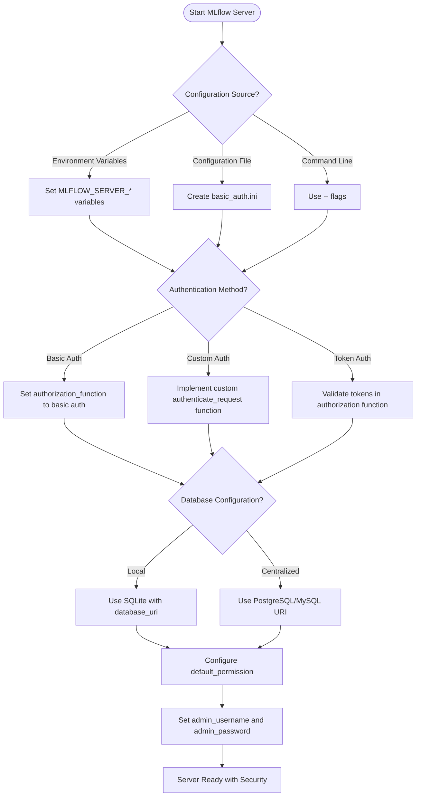
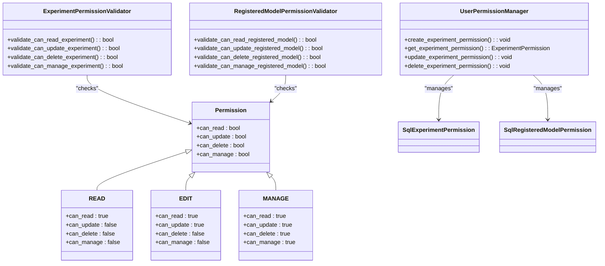

# Security Settings

<cite>
**Referenced Files in This Document**   
- [mlflow/server/auth/config.py](file://mlflow/server/auth/config.py)
- [mlflow/server/auth/basic_auth.ini](file://mlflow/server/auth/basic_auth.ini)
- [mlflow/server/auth/db/models.py](file://mlflow/server/auth/db/models.py)
- [mlflow/server/security.py](file://mlflow/server/security.py)
- [mlflow/server/fastapi_security.py](file://mlflow/server/fastapi_security.py)
- [mlflow/server/security_utils.py](file://mlflow/server/security_utils.py)
- [examples/auth/auth.py](file://examples/auth/auth.py)
- [examples/jwt_auth/jwt_auth.py](file://examples/jwt_auth/jwt_auth.py)
- [mlflow/environment_variables.py](file://mlflow/environment_variables.py)
- [mlflow/server/auth/__init__.py](file://mlflow/server/auth/__init__.py)
- [mlflow/server/auth/routes.py](file://mlflow/server/auth/routes.py)
- [mlflow/server/auth/sqlalchemy_store.py](file://mlflow/server/auth/sqlalchemy_store.py)
</cite>

## Table of Contents
1. [Introduction](#introduction)
2. [Authentication and Authorization Framework](#authentication-and-authorization-framework)
3. [Configuration Options](#configuration-options)
4. [Role-Based Access Control](#role-based-access-control)
5. [Secure Communication and Network Security](#secure-communication-and-network-security)
6. [Advanced Security Topics](#advanced-security-topics)
7. [Best Practices](#best-practices)
8. [Conclusion](#conclusion)

## Introduction

MLflow provides a comprehensive security framework to protect machine learning experiments, models, and artifacts. The security system includes authentication, authorization, network security, and secure communication features that can be configured to meet various deployment requirements. This document details the implementation of MLflow's security settings, focusing on the authentication and authorization system, configuration options, and integration with various components.

The security framework is designed to be flexible and extensible, allowing organizations to implement appropriate security measures based on their specific needs and compliance requirements. Whether deploying MLflow in a development environment or a production setting, administrators can configure security settings to balance usability with protection against unauthorized access.

**Section sources**
- [mlflow/server/auth/__init__.py](file://mlflow/server/auth/__init__.py)
- [mlflow/server/security.py](file://mlflow/server/security.py)

## Authentication and Authorization Framework

MLflow's authentication and authorization system is built on a modular architecture that supports multiple authentication methods and fine-grained access control. The framework is implemented primarily in the `mlflow/server/auth` module and integrates with the MLflow tracking server, model registry, and artifact storage components.

The authentication system supports pluggable authentication providers through the `authorization_function` configuration option. By default, MLflow uses basic HTTP authentication, but custom authentication methods can be implemented by specifying a different function in the configuration. The authentication function must have the signature `authenticate_request() -> Union[Authorization, Response]`, returning either an Authorization object for authenticated requests or a Response object (typically 401: Unauthorized) for unauthenticated requests.



**Diagram sources**
- [mlflow/server/auth/config.py](file://mlflow/server/auth/config.py)
- [mlflow/server/auth/db/models.py](file://mlflow/server/auth/db/models.py)
- [mlflow/server/auth/sqlalchemy_store.py](file://mlflow/server/auth/sqlalchemy_store.py)

The authorization system implements role-based access control (RBAC) with three permission levels: READ, EDIT, and MANAGE. These permissions are applied to resources such as experiments, registered models, and scorers. The system uses a default permission level specified in the configuration, which applies to users who don't have explicit permissions for a resource.

The authentication process begins when a request is received by the MLflow server. The request is first validated against the allowed hosts and CORS policies. Then, the authentication function specified in the configuration is called to authenticate the request. If authentication succeeds, the user's permissions are checked against the requested operation. The permission checking is implemented through validator functions that are registered for specific endpoints.

For example, when a user attempts to read an experiment, the `validate_can_read_experiment()` function is called. This function retrieves the experiment ID from the request parameters, determines the authenticated user's username, and then queries the database for the user's permission on that experiment. If no explicit permission is found, the default permission is used.

The framework also supports custom authentication implementations. As shown in the JWT authentication example, developers can create custom authentication modules that validate tokens and return appropriate authorization objects. This extensibility allows MLflow to integrate with existing identity providers and authentication systems.

**Section sources**
- [mlflow/server/auth/__init__.py](file://mlflow/server/auth/__init__.py)
- [mlflow/server/auth/config.py](file://mlflow/server/auth/config.py)
- [examples/jwt_auth/jwt_auth.py](file://examples/jwt_auth/jwt_auth.py)

## Configuration Options

MLflow provides several configuration options for securing the server, ranging from basic authentication to integration with external identity providers. These options can be configured through environment variables, configuration files, or command-line arguments.

### Basic Authentication Configuration

The primary configuration for authentication is stored in an INI file, typically named `basic_auth.ini`. This file contains settings for the authentication system, including the default permission level, database URI, admin credentials, and the authorization function. The configuration can be overridden using the `MLFLOW_AUTH_CONFIG_PATH` environment variable to point to a custom configuration file.

```ini
[mlflow]
default_permission = READ
database_uri = sqlite:///basic_auth.db
admin_username = admin
admin_password = password1234
authorization_function = mlflow.server.auth:authenticate_request_basic_auth
```

The `database_uri` setting supports various database backends, allowing organizations to use centralized databases like PostgreSQL in multi-node deployments instead of the default SQLite database. This is particularly important for production environments where high availability and data consistency are critical.

### Token-Based Authentication

For token-based authentication, MLflow supports custom implementations through the pluggable authentication system. The JWT authentication example demonstrates how to implement token-based authentication by validating JWT tokens in the Authorization header. While the example uses a hardcoded secret key and is not suitable for production, it illustrates the pattern for implementing secure token validation with proper key management and user verification.

### Environment Variables for Security Configuration

MLflow provides several environment variables for configuring security settings:

- `MLFLOW_SERVER_CORS_ALLOWED_ORIGINS`: Specifies which web applications can make API requests from browsers
- `MLFLOW_SERVER_ALLOWED_HOSTS`: Controls which Host headers the server accepts, preventing DNS rebinding attacks
- `MLFLOW_SERVER_X_FRAME_OPTIONS`: Sets the X-Frame-Options header to control iframe embedding behavior
- `MLFLOW_SERVER_DISABLE_SECURITY_MIDDLEWARE`: Allows disabling security middleware when security is handled by a reverse proxy

These environment variables can also be set via command-line options when starting the MLflow server, providing flexibility in configuration management.



**Diagram sources**
- [mlflow/server/auth/basic_auth.ini](file://mlflow/server/auth/basic_auth.ini)
- [mlflow/environment_variables.py](file://mlflow/environment_variables.py)
- [mlflow/server/auth/config.py](file://mlflow/server/auth/config.py)

The configuration system allows for progressive security enhancement, starting with basic authentication and expanding to more sophisticated methods as needed. Organizations can begin with simple configurations for development and testing, then implement more robust security measures for production deployments.

**Section sources**
- [mlflow/server/auth/basic_auth.ini](file://mlflow/server/auth/basic_auth.ini)
- [mlflow/environment_variables.py](file://mlflow/environment_variables.py)
- [docs/docs/self-hosting/security/basic-http-auth.mdx](file://docs/docs/self-hosting/security/basic-http-auth.mdx)

## Role-Based Access Control

MLflow's role-based access control (RBAC) system provides fine-grained permissions for managing access to experiments, models, and other resources. The system is built around three permission levels that define the operations users can perform on resources.

### Permission Levels

The RBAC system implements three hierarchical permission levels:

1. **READ**: Allows viewing resources but not modifying them
2. **EDIT**: Includes READ permissions plus the ability to modify resources
3. **MANAGE**: Includes EDIT permissions plus administrative operations like deleting resources

These permission levels are implemented as a class hierarchy where higher levels inherit the capabilities of lower levels. This design ensures that users with higher permissions can perform all operations allowed by lower permission levels.

### Permission Management

Permissions are managed through a combination of explicit assignments and default policies. Each user can have explicit permissions assigned for specific resources, such as experiments or registered models. When no explicit permission is found, the system falls back to the default permission level configured in the authentication settings.

The permission system is implemented using SQLAlchemy models that store user permissions in a database. The `SqlExperimentPermission`, `SqlRegisteredModelPermission`, and `SqlScorerPermission` classes represent the permission assignments for different resource types. These models include foreign key relationships to the `SqlUser` model, ensuring referential integrity.



**Diagram sources**
- [mlflow/server/auth/__init__.py](file://mlflow/server/auth/__init__.py)
- [mlflow/server/auth/db/models.py](file://mlflow/server/auth/db/models.py)
- [mlflow/server/auth/permissions.py](file://mlflow/server/auth/permissions.py)

### Permission Inheritance

The RBAC system implements permission inheritance to simplify access management. Certain resources inherit permissions from their parent resources:

- **Runs**: Inherit permissions from their parent experiment
- **Logged Models**: Inherit permissions from their parent experiment
- **Model Versions**: Inherit permissions from their registered model
- **Trace Artifacts**: Inherit permissions from their parent run/experiment

This inheritance model reduces the administrative overhead of managing permissions by allowing users to set permissions at higher levels in the resource hierarchy.

### Admin Users

The system includes a special admin role that bypasses normal permission checks. Admin users are identified by the `is_admin` field in the `SqlUser` model. When an admin user makes a request, they automatically have MANAGE permissions on all resources, allowing them to perform any operation.

The admin role is intended for system administrators who need full access to manage the MLflow instance. The admin account is configured in the authentication configuration file with the `admin_username` and `admin_password` settings.

The example code demonstrates how permissions work in practice. User A creates an experiment and can log metrics to it. User B initially cannot access the experiment but can be granted EDIT permission, allowing them to log metrics. This demonstrates the dynamic nature of the permission system, where access can be granted and revoked as needed.

**Section sources**
- [mlflow/server/auth/__init__.py](file://mlflow/server/auth/__init__.py)
- [mlflow/server/auth/db/models.py](file://mlflow/server/auth/db/models.py)
- [examples/auth/auth.py](file://examples/auth/auth.py)

## Secure Communication and Network Security

MLflow implements several network security features to protect against common web application vulnerabilities and ensure secure communication between clients and the server.

### Host Header Validation

The security system includes host header validation to prevent DNS rebinding attacks. This feature validates incoming requests against a list of allowed hosts, which can be configured via the `MLFLOW_SERVER_ALLOWED_HOSTS` environment variable or the `--allowed-hosts` command-line option. By default, the server accepts connections from localhost variants and private IP ranges, providing a secure default configuration.

The validation uses fnmatch patterns, allowing administrators to specify wildcard patterns for subdomains or IP ranges. For example, "*.company.com" would allow all subdomains of company.com, while "192.168.*" would allow all addresses in the 192.168.x.x range.

### CORS Protection

Cross-Origin Resource Sharing (CORS) protection prevents unauthorized web applications from making API requests to the MLflow server. The allowed origins can be configured via the `MLFLOW_SERVER_CORS_ALLOWED_ORIGINS` environment variable or the `--cors-allowed-origins` command-line option.

The system distinguishes between state-changing methods (POST, PUT, DELETE, PATCH) and read-only methods (GET). State-changing requests from unauthorized origins are actively blocked, while read-only requests may be allowed based on the configuration. This approach balances security with usability, allowing legitimate read access while protecting against unauthorized modifications.

### Security Headers

MLflow adds several security headers to all responses:

- **X-Content-Type-Options**: Set to "nosniff" to prevent MIME type sniffing attacks
- **X-Frame-Options**: Configurable via `MLFLOW_SERVER_X_FRAME_OPTIONS` to control iframe embedding behavior
- **WWW-Authenticate**: Used in authentication challenges to specify the authentication scheme

The X-Frame-Options header helps prevent clickjacking attacks by controlling whether the MLflow UI can be embedded in iframes. The default value of "SAMEORIGIN" allows embedding only from the same origin, while "DENY" prevents all embedding. The "NONE" option allows embedding from any site but should be used with caution.

```mermaid
sequenceDiagram
participant Client
participant SecurityMiddleware
participant MLflowServer
Client->>SecurityMiddleware : HTTP Request
SecurityMiddleware->>SecurityMiddleware : Validate Host Header
alt Invalid Host
SecurityMiddleware-->>Client : 403 Forbidden
deactivate SecurityMiddleware
end
SecurityMiddleware->>SecurityMiddleware : Check CORS Policy
alt State-changing request from unauthorized origin
SecurityMiddleware-->>Client : 403 Forbidden
deactivate SecurityMiddleware
end
SecurityMiddleware->>SecurityMiddleware : Add Security Headers
SecurityMiddleware->>MLflowServer : Forward Request
MLflowServer->>SecurityMiddleware : Response
SecurityMiddleware->>SecurityMiddleware : Add X-Content-Type-Options
SecurityMiddleware->>SecurityMiddleware : Add X-Frame-Options if needed
SecurityMiddleware->>Client : Final Response with Security Headers
```

**Diagram sources**
- [mlflow/server/security.py](file://mlflow/server/security.py)
- [mlflow/server/fastapi_security.py](file://mlflow/server/fastapi_security.py)
- [mlflow/server/security_utils.py](file://mlflow/server/security_utils.py)

### Security Middleware

The security middleware is implemented differently for Flask and FastAPI applications, but provides the same core functionality. For Flask applications, the system uses Flask-CORS for CORS protection and custom before-request handlers for host validation. For FastAPI applications, custom middleware classes handle host validation, CORS blocking, and security headers.

The middleware can be disabled entirely using the `MLFLOW_SERVER_DISABLE_SECURITY_MIDDLEWARE` environment variable. This option is intended for scenarios where security is handled by a reverse proxy or gateway, allowing organizations to centralize security management.

The security system also includes special handling for health endpoints and test endpoints, which are exempt from certain security checks to ensure monitoring and testing can function properly.

**Section sources**
- [mlflow/server/security.py](file://mlflow/server/security.py)
- [mlflow/server/fastapi_security.py](file://mlflow/server/fastapi_security.py)
- [mlflow/server/security_utils.py](file://mlflow/server/security_utils.py)

## Advanced Security Topics

### Securing Production Deployments

When deploying MLflow in production environments, several additional security considerations must be addressed:

1. **Database Security**: Use encrypted connections to database servers and implement proper access controls. For MySQL, MLflow supports SSL connections using the `MLFLOW_MYSQL_SSL_CA`, `MLFLOW_MYSQL_SSL_CERT`, and `MLFLOW_MYSQL_SSL_KEY` environment variables.

2. **Reverse Proxy Integration**: Deploy MLflow behind a reverse proxy that handles SSL termination, authentication, and rate limiting. This allows centralizing security policies and reducing the attack surface of the MLflow server.

3. **Regular Security Audits**: Implement audit logging to track user activities and detect suspicious behavior. While not explicitly detailed in the code, the architecture supports extending the system to include comprehensive audit trails.

4. **Secret Management**: Store sensitive configuration values like database passwords and authentication secrets in secure secret management systems rather than configuration files.

### Compliance with Security Standards

MLflow's security framework can be configured to comply with various security standards:

- **GDPR**: Implement data minimization and user rights by managing user data and access logs appropriately
- **HIPAA**: Ensure protected health information is not stored in MLflow artifacts or metadata
- **SOC 2**: Implement access controls, audit logging, and security monitoring
- **PCI DSS**: Ensure cardholder data is not processed or stored in MLflow

The modular authentication system allows integration with identity providers that support standards like SAML, OAuth, and OpenID Connect, facilitating compliance with organizational security policies.

### Integration with External Identity Providers

While the core MLflow distribution includes basic authentication and a JWT example, the pluggable authentication system enables integration with external identity providers. Organizations can implement custom authentication functions that validate tokens from providers like:

- **OAuth 2.0/OpenID Connect**: Validate ID tokens from providers like Google, Microsoft, or Okta
- **SAML**: Integrate with enterprise identity providers using SAML assertions
- **LDAP/Active Directory**: Authenticate against corporate directory services
- **API Keys**: Implement API key-based authentication for service-to-service communication

The authentication function can be extended to include additional security features like multi-factor authentication, session management, and anomaly detection.

### Artifact Storage Security

MLflow's artifact storage system includes security features to protect model artifacts and other files:

- **Presigned URLs**: Generate time-limited presigned URLs for accessing artifacts, reducing the risk of unauthorized access
- **Credential Management**: Store artifact storage credentials securely and rotate them regularly
- **Access Control**: Apply the same RBAC system to artifact access, ensuring users can only access artifacts for which they have appropriate permissions

The system supports various artifact storage backends, each with its own security considerations. For example, when using cloud storage like AWS S3 or Azure Blob Storage, proper IAM policies and bucket permissions must be configured.

**Section sources**
- [mlflow/server/auth/__init__.py](file://mlflow/server/auth/__init__.py)
- [mlflow/environment_variables.py](file://mlflow/environment_variables.py)
- [mlflow/store/artifact/presigned_url_artifact_repo.py](file://mlflow/store/artifact/presigned_url_artifact_repo.py)

## Best Practices

Implementing effective security in MLflow requires following several best practices:

### Configuration Management

1. **Use Environment Variables**: Store sensitive configuration values in environment variables rather than configuration files to prevent accidental exposure in version control.

2. **Centralized Configuration**: For multi-node deployments, use a centralized database for authentication data rather than the default SQLite database.

3. **Regular Updates**: Keep MLflow and its dependencies updated to benefit from security patches and improvements.

### Authentication and Authorization

1. **Strong Password Policies**: Enforce strong password requirements for user accounts, especially for admin accounts.

2. **Principle of Least Privilege**: Grant users the minimum permissions necessary to perform their tasks, using the default permission level as a baseline.

3. **Regular Permission Reviews**: Periodically review user permissions to ensure they are still appropriate and remove access for users who no longer need it.

### Network Security

1. **Restrict Access**: Limit access to the MLflow server to trusted networks and IP ranges using firewalls and network security groups.

2. **Use HTTPS**: Always use HTTPS for production deployments to encrypt communication between clients and the server.

3. **Monitor for Anomalies**: Implement monitoring and alerting for suspicious activities, such as repeated failed authentication attempts.

### Production Deployment

1. **Defense in Depth**: Implement multiple layers of security, including network controls, authentication, authorization, and monitoring.

2. **Regular Backups**: Implement regular backups of the MLflow database and artifact storage to ensure data recovery in case of security incidents.

3. **Incident Response Plan**: Develop and test an incident response plan for security breaches, including procedures for containment, investigation, and recovery.

The example code demonstrates proper use of the security system, showing how to create users, set permissions, and handle authentication. Following these patterns ensures that security is integrated into the workflow from the beginning.

**Section sources**
- [examples/auth/auth.py](file://examples/auth/auth.py)
- [mlflow/server/auth/basic_auth.ini](file://mlflow/server/auth/basic_auth.ini)
- [docs/docs/self-hosting/security/basic-http-auth.mdx](file://docs/docs/self-hosting/security/basic-http-auth.mdx)

## Conclusion

MLflow's security framework provides a comprehensive set of features for protecting machine learning workflows and data. The system combines authentication, authorization, network security, and secure communication to create a robust security posture that can be adapted to various deployment scenarios.

The modular architecture allows organizations to start with basic security measures and progressively enhance their security posture as needed. The pluggable authentication system enables integration with existing identity providers, while the fine-grained RBAC system provides precise control over resource access.

By following the best practices outlined in this document, organizations can effectively secure their MLflow deployments and protect their machine learning assets. The combination of configurable security settings, comprehensive access controls, and network protection features makes MLflow suitable for both development environments and production deployments with stringent security requirements.

As machine learning becomes increasingly central to business operations, securing the ML lifecycle is critical. MLflow's security framework provides the tools necessary to implement appropriate security measures while maintaining the flexibility and usability required for effective machine learning development and deployment.