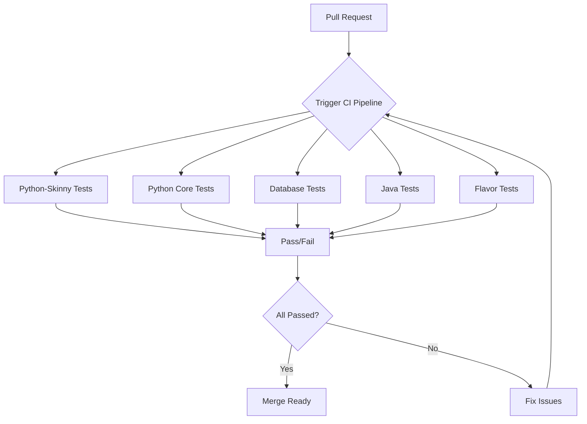
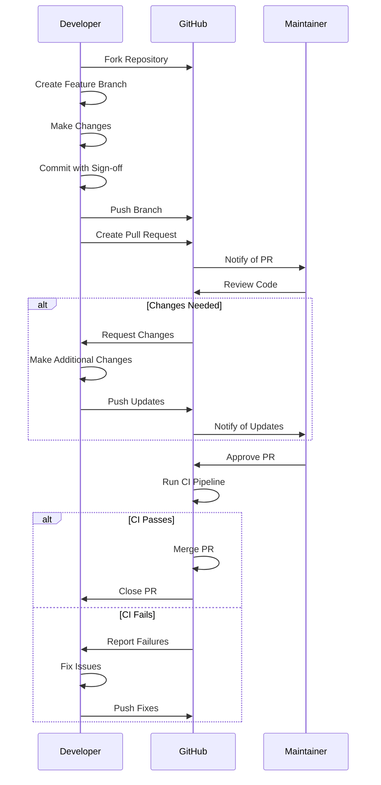

# Contributing

<cite>
**Referenced Files in This Document**   
- [CONTRIBUTING.md](file://CONTRIBUTING.md)
- [CODE_OF_CONDUCT.rst](file://CODE_OF_CONDUCT.rst)
- [ISSUE_POLICY.md](file://ISSUE_POLICY.md)
- [ISSUE_TRIAGE.rst](file://ISSUE_TRIAGE.rst)
- [dev/dev-env-setup.sh](file://dev/dev-env-setup.sh)
- [dev/run-dev-server.sh](file://dev/run-dev-server.sh)
- [dev/format.py](file://dev/format.py)
- [dev/generate-protos.sh](file://dev/generate-protos.sh)
- [requirements/dev-requirements.txt](file://requirements/dev-requirements.txt)
- [requirements/lint-requirements.txt](file://requirements/lint-requirements.txt)
- [requirements/test-requirements.txt](file://requirements/test-requirements.txt)
- [.github/workflows/master.yml](file://.github/workflows/master.yml)
- [pyproject.toml](file://pyproject.toml)
</cite>

## Table of Contents
1. [Introduction](#introduction)
2. [Governance and Community Structure](#governance-and-community-structure)
3. [Contribution Process](#contribution-process)
4. [Development Environment Setup](#development-environment-setup)
5. [Coding Standards](#coding-standards)
6. [Testing Guidelines](#testing-guidelines)
7. [CI/CD Pipeline](#cicd-pipeline)
8. [Contribution Workflows](#contribution-workflows)
9. [Code Review Process](#code-review-process)
10. [Conclusion](#conclusion)

## Introduction

This document provides comprehensive guidance for contributing to the MLflow project. It covers the development process, community guidelines, architecture of the development environment, and practical workflows for external contributors. MLflow is an open-source platform for the complete machine learning lifecycle, and this guide aims to facilitate high-quality contributions while maintaining code consistency and project integrity.

The contribution process is designed to be accessible to both beginners and experienced developers, with clear guidelines for setting up the development environment, adhering to coding standards, writing tests, and navigating the review process. The document also explains how contributions are integrated into the project through automated CI/CD pipelines.

**Section sources**
- [CONTRIBUTING.md](file://CONTRIBUTING.md#L1-L864)

## Governance and Community Structure

MLflow is governed by a Technical Steering Committee (TSC) consisting of founding members Patrick Wendell, Reynold Xin, and Matei Zaharia. The TSC oversees the project's technical direction and governance. The project is maintained by a core team of committers who are responsible for code reviews, issue triage, and release management.

Community members can become committers through a formal nomination process. The evaluation criteria for new committers include code contributions, technical expertise, breadth of subject matter knowledge, community participation, communication skills, and commitment to the project's long-term success. The nomination process requires a nominator and a seconder (a more senior committer), followed by a consensus check among TSC members.

The project adheres to a Code of Conduct based on the Contributor Covenant, which establishes standards for creating a positive and inclusive environment. Unacceptable behaviors include harassment, trolling, insulting comments, and publishing private information without permission. Project maintainers have the responsibility to enforce the Code of Conduct and can take corrective actions including removing or editing contributions, or banning contributors.

**Section sources**
- [CONTRIBUTING.md](file://CONTRIBUTING.md#L43-L68)
- [COMMITTER.md](file://COMMITTER.md#L1-L39)
- [CODE_OF_CONDUCT.rst](file://CODE_OF_CONDUCT.rst#L1-L85)

## Contribution Process

The MLflow contribution process begins with filing a GitHub issue, which must fall into one of four categories: feature requests, bug reports, documentation fixes, or installation issues. Each category has a specific issue template that should be used. Before filing an issue, contributors should search for existing related issues to avoid duplication.

For support questions, contributors should use Stack Overflow rather than GitHub issues. The issue triage process involves assigning process labels (such as "needs design" or "help wanted"), marking priority levels, and labeling relevant areas or components. Priority levels follow a Kubernetes-style system with categories including critical-urgent, important-soon, important-longterm, backlog, and awaiting-more-evidence.

For significant changes, contributors are encouraged to write design documents and discuss them with committers before implementation. This is particularly important for changes to the MLflow REST API, new user-facing APIs, additions of library dependencies, or modifications to critical internal abstractions. The issue triage process helps identify when a design is needed, typically labeled with "needs design."

**Section sources**
- [CONTRIBUTING.md](file://CONTRIBUTING.md#L69-L183)
- [ISSUE_POLICY.md](file://ISSUE_POLICY.md#L1-L93)
- [ISSUE_TRIAGE.rst](file://ISSUE_TRIAGE.rst#L1-L103)

## Development Environment Setup

MLflow provides multiple options for setting up a development environment, with automated and manual configuration methods available. The recommended approach is to use the automated development environment setup script (`dev/dev-env-setup.sh`), which creates a standardized environment with the required Python packages, linting tools, and configurations.

The automated setup script uses pyenv to manage Python versions and creates a virtual environment with the minimum required Python version (currently 3.10) to ensure compatibility. The script can be run with various options, including specifying the virtual environment directory, installing full development requirements, running in quiet mode, or overriding the Python version. For example:

```bash
dev/dev-env-setup.sh -d .venvs/mlflow-dev -q
```

For manual setup, contributors can use conda or virtualenv. The process involves configuring git with user name and email, installing MLflow from source, and installing development dependencies. The pre-commit git hook is recommended to ensure code is properly formatted and signed before commits.

JavaScript and UI development requires Node.js and yarn. Dependencies can be installed by running `yarn install` in the `mlflow/server/js` directory. The development UI can be launched by running the MLflow server in one shell and the JavaScript dev server in another, with the UI available at http://localhost:3000 and the server at http://localhost:5000.

**Section sources**
- [CONTRIBUTING.md](file://CONTRIBUTING.md#L208-L377)
- [dev/dev-env-setup.sh](file://dev/dev-env-setup.sh#L1-L397)

## Coding Standards

MLflow follows strict coding standards to maintain code quality and consistency across the codebase. For Python code, the project adheres to Google's Python Style Guide for docstrings, which requires comprehensive documentation for all public APIs, classes, methods, and functions. Docstrings should include descriptions, parameter details, return values, and exceptions.

The codebase uses several automated formatting and linting tools integrated through pre-commit hooks. These include ruff for code formatting and linting, black for code style, and mypy for type checking. The linting requirements are specified in `requirements/lint-requirements.txt`. Contributors should ensure their code passes all CI checks, which validate proper formatting and style.

For JavaScript code, the project uses prettier for consistent formatting. React components should be tested using the Jest testing framework, with tests placed in the same directory as the component. The project also uses taplo for consistent TOML formatting across configuration files.

All commits must be signed off to certify that the contributor has the right to submit the code under the project's open-source license. This can be done manually with the `-s` flag in git commit or automatically through the pre-commit hook.

**Section sources**
- [CONTRIBUTING.md](file://CONTRIBUTING.md#L184-L207)
- [requirements/lint-requirements.txt](file://requirements/lint-requirements.txt#L1-L10)
- [pyproject.toml](file://pyproject.toml#L167-L185)

## Testing Guidelines

MLflow has a comprehensive testing framework that includes unit, integration, and end-to-end tests. The project uses pytest as the primary testing framework for Python code, with tests organized in the `tests` directory. Contributors should write tests for any new code they add, particularly for new model flavors, autologging functionality, or API changes.

The testing strategy includes several specialized test categories:
- Unit tests for individual functions and methods
- Integration tests for component interactions
- Database tests for SQL backend functionality
- Flavor-specific tests for model serialization and deployment
- End-to-end tests for complete workflows

The project uses a matrix testing approach in CI/CD to avoid memory issues when running multiple model tests in the same process. Certain model tests are not well-isolated and can result in out-of-memory errors, so they are run in separate pytest invocations.

For Python tests, the `tracking_uri_mock` pytest fixture automatically sets up a mock tracking URI for each test, ensuring isolation and cleanup. Tests that require SSH access or wheel serving can be run with specific flags. The full test suite can be executed with:

```bash
pre-commit run --all-files
pytest tests --quiet --requires-ssh --ignore-flavors --serve-wheel \
  --ignore=tests/examples --ignore=tests/evaluate
```

**Section sources**
- [CONTRIBUTING.md](file://CONTRIBUTING.md#L588-L647)
- [requirements/test-requirements.txt](file://requirements/test-requirements.txt#L1-L41)

## CI/CD Pipeline

MLflow's CI/CD pipeline is configured through GitHub Actions in the `.github/workflows/master.yml` file. The pipeline runs on pull requests and pushes to the master branch and includes several parallel jobs to ensure comprehensive testing while maintaining reasonable execution times.

The pipeline architecture includes:
- Python-skinny tests: A subset of functionality with minimal dependencies
- Python tests: Comprehensive testing of core functionality
- Database tests: Validation of SQL backend compatibility
- Java tests: Verification of Java client functionality
- Flavor tests: Testing of specific model flavors

Each job runs on Ubuntu-latest with specific timeout limits. The pipeline uses uv (a fast Python package installer and resolver) for dependency management, which improves installation speed compared to traditional pip. The matrix strategy allows tests to be split across multiple runners to prevent timeouts and improve reliability.

The pipeline includes several specialized actions:
- Setup of Python, Java, and pyenv environments
- Disk space cleanup to prevent runner failures
- Version reporting for debugging
- Dependency tree visualization
- Import checking to ensure proper module loading

The database testing job uses Docker Compose to spin up PostgreSQL, MySQL, and MSSQL containers for testing the SQL backend functionality. Migration checks ensure that database schema changes are properly handled across versions.



**Diagram sources **
- [.github/workflows/master.yml](file://.github/workflows/master.yml#L1-L401)
- [dev/run-dev-server.sh](file://dev/run-dev-server.sh#L1-L92)

**Section sources**
- [.github/workflows/master.yml](file://.github/workflows/master.yml#L1-L401)

## Contribution Workflows

This section outlines practical workflows for common contribution types, including fixing bugs, adding features, and improving documentation.

### Bug Fix Workflow
1. Search for existing issues and create a new bug report if none exists
2. Reproduce the issue in a local development environment
3. Write a test that fails with the current code (reproducing the bug)
4. Implement the fix
5. Verify the test now passes
6. Run the full test suite to ensure no regressions
7. Submit a pull request with a clear description of the issue and fix

### Feature Addition Workflow
1. Create a feature request issue and discuss the design with committers
2. For significant changes, write a design document and get approval
3. Consider whether the feature could be implemented as an MLflow Plugin
4. Implement the feature with comprehensive tests
5. Update documentation and examples
6. Submit a pull request with a detailed description

### Documentation Improvement Workflow
1. Identify outdated, unclear, or missing documentation
2. Make the necessary changes to the documentation files
3. For API changes, regenerate documentation using the appropriate tools
4. Verify the changes render correctly
5. Submit a pull request

The contribution workflow from fork to merge follows these steps:
1. Fork the MLflow repository
2. Create a feature branch from master
3. Make changes and commit with signed-off messages
4. Push changes to the forked repository
5. Create a pull request against the upstream repository
6. Address review comments and make additional commits as needed
7. Once approved, the pull request is merged by a committer



**Diagram sources **
- [CONTRIBUTING.md](file://CONTRIBUTING.md#L84-L97)

**Section sources**
- [CONTRIBUTING.md](file://CONTRIBUTING.md#L69-L97)

## Code Review Process

The code review process in MLflow is designed to ensure code quality, maintainability, and alignment with project goals. When a pull request is submitted, it is automatically assigned for review based on the affected components. The review process includes several key aspects:

1. **Technical correctness**: The code must be functionally correct and free of bugs
2. **Code quality**: The code should follow MLflow's coding standards and best practices
3. **Test coverage**: New code must be accompanied by appropriate tests
4. **Documentation**: Public APIs and significant changes require documentation
5. **Backwards compatibility**: Changes should not break existing functionality
6. **Performance**: The code should be efficient and not introduce performance regressions

Reviewers may request changes to improve any of these aspects. The process is collaborative, with reviewers providing constructive feedback and contributors responding to comments. For significant changes, multiple rounds of review may be necessary.

The project encourages community participation in code reviews. Experienced contributors are welcome to review pull requests, though only committers can approve and merge changes. The review process also considers whether a feature might be better implemented as an MLflow Plugin rather than in the core codebase.

**Section sources**
- [CONTRIBUTING.md](file://CONTRIBUTING.md#L84-L97)

## Conclusion

Contributing to MLflow provides an opportunity to impact a widely-used open-source platform for machine learning. By following the guidelines outlined in this document, contributors can ensure their work aligns with project standards and has a smooth path to integration.

The development process emphasizes collaboration, code quality, and backwards compatibility. The automated tooling for environment setup, code formatting, and testing helps maintain consistency across contributions. The CI/CD pipeline provides comprehensive validation of changes before they are merged.

New contributors are encouraged to start with smaller issues labeled as "good first issue" or "help wanted" to become familiar with the codebase and contribution process. As contributors gain experience, they can take on more complex tasks and eventually become committers themselves.

By adhering to the contribution guidelines and participating in the community, developers can help MLflow continue to evolve as a robust and reliable platform for the machine learning lifecycle.

**Section sources**
- [CONTRIBUTING.md](file://CONTRIBUTING.md#L1-L864)