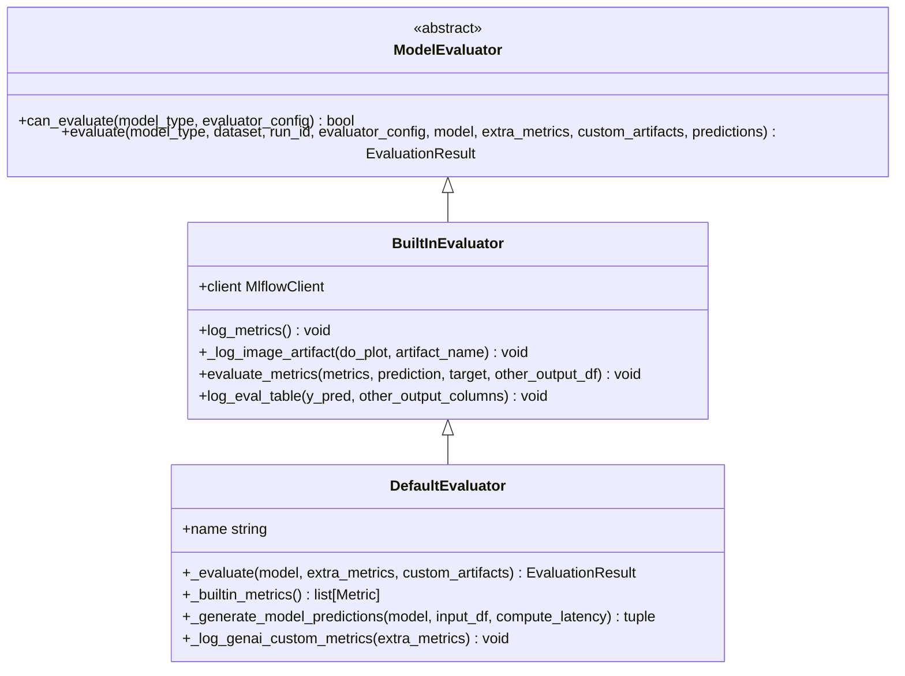
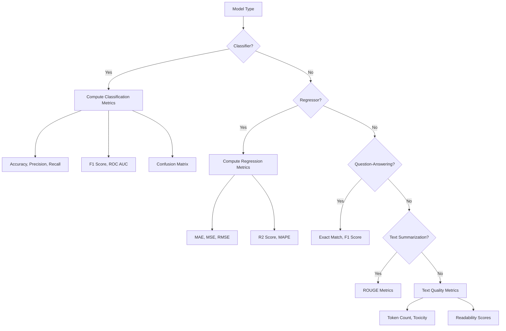
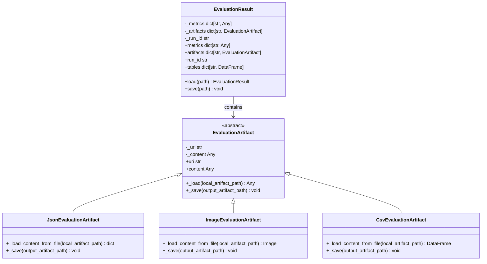
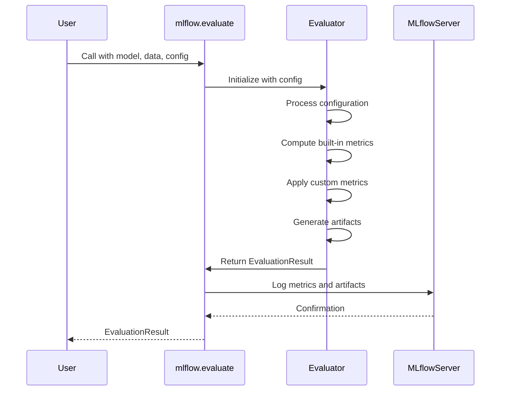
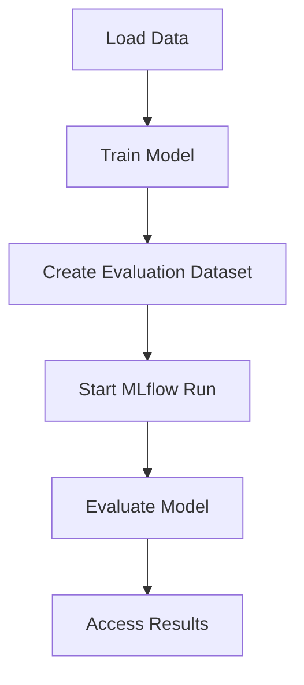
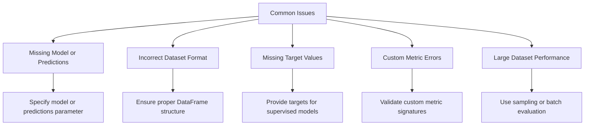

# Automated Evaluation

<cite>
**Referenced Files in This Document**   
- [mlflow/models/evaluation/__init__.py](file://mlflow/models/evaluation/__init__.py)
- [mlflow/models/evaluation/base.py](file://mlflow/models/evaluation/base.py)
- [mlflow/models/evaluation/default_evaluator.py](file://mlflow/models/evaluation/default_evaluator.py)
- [mlflow/models/evaluation/evaluators/default.py](file://mlflow/models/evaluation/evaluators/default.py)
- [mlflow/models/evaluation/evaluators/classifier.py](file://mlflow/models/evaluation/evaluators/classifier.py)
- [mlflow/models/evaluation/evaluators/regressor.py](file://mlflow/models/evaluation/evaluators/regressor.py)
- [examples/evaluation/evaluate_on_binary_classifier.py](file://examples/evaluation/evaluate_on_binary_classifier.py)
- [examples/evaluation/evaluate_on_multiclass_classifier.py](file://examples/evaluation/evaluate_on_multiclass_classifier.py)
- [examples/evaluation/evaluate_on_regressor.py](file://examples/evaluation/evaluate_on_regressor.py)
- [examples/evaluation/evaluate_with_custom_metrics.py](file://examples/evaluation/evaluate_with_custom_metrics.py)
- [examples/evaluation/evaluate_with_function.py](file://examples/evaluation/evaluate_with_function.py)
</cite>

## Table of Contents
1. [Introduction](#introduction)
2. [Evaluation Architecture](#evaluation-architecture)
3. [Default Evaluator Implementation](#default-evaluator-implementation)
4. [Model Type-Specific Evaluation](#model-type-specific-evaluation)
5. [EvaluationResult Domain Model](#evaluationresult-domain-model)
6. [Configuration and Customization](#configuration-and-customization)
7. [Practical Examples](#practical-examples)
8. [Common Issues and Troubleshooting](#common-issues-and-troubleshooting)
9. [Conclusion](#conclusion)

## Introduction

MLflow's automated evaluation system provides a comprehensive framework for assessing machine learning model performance across various model types. The system is designed to automatically compute standard metrics based on the specified model type, offering both simplicity for beginners and extensibility for advanced users. The core of this system is the `mlflow.evaluate()` function, which orchestrates the evaluation process by selecting appropriate evaluators, computing metrics, and organizing results.

The evaluation system supports multiple model types including classifiers, regressors, and specialized models like question-answering and text summarization systems. It automatically determines which metrics to compute based on the model type and can be extended with custom metrics and artifacts. The system is built around a pluggable evaluator architecture that allows for both built-in and custom evaluators, providing flexibility while maintaining consistency in evaluation results.

This documentation provides a detailed examination of the MLflow evaluation system, focusing on the implementation of the default evaluator, the relationship between `mlflow.evaluate()` and underlying evaluator classes, and the structure of evaluation results. It also includes practical examples and guidance for common use cases and troubleshooting.

**Section sources**
- [mlflow/models/evaluation/__init__.py](file://mlflow/models/evaluation/__init__.py#L1-L24)
- [mlflow/models/evaluation/base.py](file://mlflow/models/evaluation/base.py#L1-L800)

## Evaluation Architecture

The MLflow evaluation system follows a modular architecture with clear separation of concerns between the evaluation API, evaluator classes, and result models. The primary entry point is the `mlflow.evaluate()` function, which serves as a facade that coordinates the evaluation process by delegating to appropriate evaluator classes based on the model type and configuration.

```mermaid
graph TD
A[mlflow.evaluate()] --> B[Model Evaluator Registry]
B --> C{Model Type}
C --> |Classifier| D[ClassifierEvaluator]
C --> |Regressor| E[RegressorEvaluator]
C --> |Other| F[DefaultEvaluator]
D --> G[EvaluationResult]
E --> G
F --> G
G --> H[Metric Computation]
G --> I[Artifact Generation]
H --> J[MLflow Run]
I --> J
```

**Diagram sources **
- [mlflow/models/evaluation/base.py](file://mlflow/models/evaluation/base.py#L703-L758)
- [mlflow/models/evaluation/default_evaluator.py](file://mlflow/models/evaluation/default_evaluator.py#L275-L895)

The evaluation process begins when `mlflow.evaluate()` is called with a model, dataset, and configuration parameters. The function first determines which evaluators to use based on the `evaluators` parameter. If not specified, it defaults to the "default" evaluator. The system then resolves the appropriate evaluator class by checking which evaluators can handle the specified model type through their `can_evaluate()` method.

Each evaluator is responsible for computing metrics and generating artifacts specific to its domain. The evaluators inherit from the `ModelEvaluator` abstract base class, which defines the contract for evaluation functionality. The `BuiltInEvaluator` class provides common functionality used across built-in evaluators, such as metric logging and artifact handling.

The evaluation results are encapsulated in an `EvaluationResult` object that contains both scalar metrics and generated artifacts. This object serves as the return value from the evaluation process and can be used for further analysis or comparison between models.

**Section sources**
- [mlflow/models/evaluation/base.py](file://mlflow/models/evaluation/base.py#L703-L800)
- [mlflow/models/evaluation/default_evaluator.py](file://mlflow/models/evaluation/default_evaluator.py#L275-L320)

## Default Evaluator Implementation

The DefaultEvaluator is the primary implementation responsible for handling various model types in MLflow's evaluation system. It serves as the foundation for model evaluation and is designed to automatically compute appropriate metrics based on the specified model type. The evaluator is implemented as a class that inherits from `BuiltInEvaluator` and implements the required evaluation interface.



**Diagram sources **
- [mlflow/models/evaluation/default_evaluator.py](file://mlflow/models/evaluation/default_evaluator.py#L275-L895)
- [mlflow/models/evaluation/evaluators/default.py](file://mlflow/models/evaluation/evaluators/default.py#L41-L237)

The DefaultEvaluator class is designed with several key methods that handle different aspects of the evaluation process. The `can_evaluate()` class method determines whether the evaluator can handle a given model type, returning `True` for any valid model type or `None`. The core evaluation logic is implemented in the `_evaluate()` method, which coordinates the entire evaluation process including model prediction generation, metric computation, and result compilation.

A critical component of the DefaultEvaluator is the `_builtin_metrics()` method, which returns a list of appropriate metrics based on the model type. For example, question-answering models receive metrics like exact match, while text summarization models receive ROUGE metrics. The method also includes text quality metrics like token count, toxicity, and readability scores for relevant model types.

The evaluator handles model prediction generation through the `_generate_model_predictions()` method, which can work with both provided models and pre-computed predictions. This method also supports latency measurement by timing individual predictions when requested. The predictions are then processed to extract the primary output column and any additional output columns for further analysis.

**Section sources**
- [mlflow/models/evaluation/evaluators/default.py](file://mlflow/models/evaluation/evaluators/default.py#L41-L237)
- [mlflow/models/evaluation/default_evaluator.py](file://mlflow/models/evaluation/default_evaluator.py#L275-L895)

## Model Type-Specific Evaluation

MLflow's evaluation system automatically adapts its metric computation based on the specified model type, providing appropriate metrics for different machine learning tasks. The system supports several model types including classifiers, regressors, question-answering, text summarization, and retriever models, each with their own set of relevant metrics.

For classifier models, the system computes standard classification metrics such as accuracy, precision, recall, F1 score, and area under the ROC curve. These metrics are computed using the true labels and predicted probabilities or class predictions. For binary classification, additional metrics like log loss and balanced accuracy are also computed.



**Diagram sources **
- [mlflow/models/evaluation/evaluators/classifier.py](file://mlflow/models/evaluation/evaluators/classifier.py)
- [mlflow/models/evaluation/evaluators/regressor.py](file://mlflow/models/evaluation/evaluators/regressor.py)
- [mlflow/models/evaluation/evaluators/default.py](file://mlflow/models/evaluation/evaluators/default.py#L92-L129)

For regressor models, the system computes regression-specific metrics including mean absolute error (MAE), mean squared error (MSE), root mean squared error (RMSE), R2 score, and mean absolute percentage error (MAPE). These metrics quantify the difference between predicted and actual continuous values, providing insights into the model's predictive accuracy.

Specialized model types like question-answering and text summarization receive domain-specific metrics. Question-answering models are evaluated using exact match and F1 score metrics that compare predicted answers to ground truth answers. Text summarization models are evaluated using ROUGE metrics (ROUGE-1, ROUGE-2, ROUGE-L, and ROUGE-Lsum) that measure the overlap between predicted and reference summaries.

The system also supports text models with metrics that assess text quality, including token count, toxicity, and readability scores (Flesch-Kincaid grade level and Automated Readability Index). Retriever models are evaluated using ranking metrics like precision at k, recall at k, and normalized discounted cumulative gain (NDCG) at k, with k defaulting to 3 if not specified.

**Section sources**
- [mlflow/models/evaluation/evaluators/default.py](file://mlflow/models/evaluation/evaluators/default.py#L92-L129)
- [mlflow/models/evaluation/evaluators/classifier.py](file://mlflow/models/evaluation/evaluators/classifier.py)
- [mlflow/models/evaluation/evaluators/regressor.py](file://mlflow/models/evaluation/evaluators/regressor.py)

## EvaluationResult Domain Model

The EvaluationResult class serves as the central domain model for encapsulating the outcomes of the MLflow evaluation process. It provides a structured representation of evaluation metrics, artifacts, and tables, making it easy to access and analyze model performance data. The class is designed to be both comprehensive and accessible, containing all relevant evaluation information in a single object.



**Diagram sources **
- [mlflow/models/evaluation/base.py](file://mlflow/models/evaluation/base.py#L597-L700)
- [mlflow/models/evaluation/artifacts.py](file://mlflow/models/evaluation/artifacts.py)

The EvaluationResult object contains three primary components: metrics, artifacts, and tables. The metrics property returns a dictionary mapping metric names to their computed values. These are typically scalar values representing model performance, such as accuracy for classifiers or mean squared error for regressors.

The artifacts property returns a dictionary mapping artifact names to EvaluationArtifact objects. These artifacts can include various types of generated content such as confusion matrices, ROC curves, feature importance plots, and custom visualizations. Each EvaluationArtifact has a URI pointing to its location in the MLflow artifact store and content that can be loaded on demand.

The tables property provides access to evaluation result tables as pandas DataFrames. The primary table is the "eval_results_table" which contains predictions, targets, and per-row metric scores when available. This allows for detailed analysis of model performance at the individual prediction level.

The EvaluationResult class also provides methods for persistence, allowing results to be saved to and loaded from the local filesystem. This enables sharing and comparison of evaluation results across different sessions or team members.

**Section sources**
- [mlflow/models/evaluation/base.py](file://mlflow/models/evaluation/base.py#L597-L700)
- [mlflow/models/evaluation/artifacts.py](file://mlflow/models/evaluation/artifacts.py)

## Configuration and Customization

MLflow's evaluation system provides extensive configuration options that allow users to customize the evaluation process according to their specific needs. The primary configuration mechanism is the `evaluator_config` parameter in the `mlflow.evaluate()` function, which accepts a dictionary of configuration options that are passed to the evaluator.

Key configuration options include:
- `model_type`: Specifies the type of model being evaluated (e.g., "classifier", "regressor")
- `metric_prefix`: Adds a prefix to all logged metric names
- `log_model_explainability`: Enables model explainability logging for supported models
- `explainability_nsamples`: Controls the number of samples used for explainability calculations
- `col_mapping`: Maps column names in the data to expected parameter names in custom metrics
- `retriever_k`: Specifies the value of k for retriever model metrics (defaults to 3)



**Diagram sources **
- [mlflow/models/evaluation/base.py](file://mlflow/models/evaluation/base.py#L1387-L1412)
- [mlflow/models/evaluation/default_evaluator.py](file://mlflow/models/evaluation/default_evaluator.py#L860-L895)

The system also supports custom metrics through the `extra_metrics` parameter, which accepts a list of EvaluationMetric objects created using the `make_metric()` function. Custom metrics allow users to define domain-specific evaluation criteria beyond the built-in metrics. Each custom metric is defined by an evaluation function that takes predictions, targets, and other parameters, and returns a metric value.

Custom artifacts can be generated using the `custom_artifacts` parameter, which accepts a list of callable functions. These functions receive the evaluation dataframe, computed metrics, and a temporary directory path, and return a dictionary of artifacts to be logged. This enables the creation of custom visualizations, reports, or other analysis outputs.

The evaluation system also supports various dataset formats, including pandas DataFrames, numpy arrays, and lists. When using DataFrames, the `targets` parameter specifies the column name containing the ground truth labels, while the `predictions` parameter can specify which column to use when models return multiple outputs.

**Section sources**
- [mlflow/models/evaluation/base.py](file://mlflow/models/evaluation/base.py#L1387-L1412)
- [mlflow/models/evaluation/default_evaluator.py](file://mlflow/models/evaluation/default_evaluator.py#L860-L895)
- [examples/evaluation/evaluate_with_custom_metrics.py](file://examples/evaluation/evaluate_with_custom_metrics.py)

## Practical Examples

The MLflow evaluation system can be used with various machine learning frameworks including scikit-learn, PyTorch, and TensorFlow. The following examples demonstrate how to evaluate models from these frameworks using the automated evaluation system.

For scikit-learn models, the evaluation process is straightforward and follows a consistent pattern:



**Diagram sources **
- [examples/evaluation/evaluate_on_binary_classifier.py](file://examples/evaluation/evaluate_on_binary_classifier.py)
- [examples/evaluation/evaluate_on_regressor.py](file://examples/evaluation/evaluate_on_regressor.py)

The evaluation process begins by training a model using the chosen framework. The trained model is then logged to MLflow using the appropriate flavor (e.g., `mlflow.sklearn.log_model()`). The evaluation dataset is prepared, typically as a pandas DataFrame containing features and target labels. The `mlflow.evaluate()` function is called with the model URI, evaluation data, target column name, model type, and evaluator specification.

For PyTorch and TensorFlow models, the process is similar but requires using the appropriate MLflow flavor for logging the model (e.g., `mlflow.pytorch.log_model()` or `mlflow.tensorflow.log_model()`). The evaluation function automatically handles the model loading and prediction generation, making it framework-agnostic from the evaluation perspective.

The system also supports evaluating models without logging them to MLflow by passing a prediction function directly to `mlflow.evaluate()`. This is useful for evaluating models that are not easily serializable or when you want to evaluate a model without creating an MLflow artifact.

**Section sources**
- [examples/evaluation/evaluate_on_binary_classifier.py](file://examples/evaluation/evaluate_on_binary_classifier.py)
- [examples/evaluation/evaluate_on_multiclass_classifier.py](file://examples/evaluation/evaluate_on_multiclass_classifier.py)
- [examples/evaluation/evaluate_on_regressor.py](file://examples/evaluation/evaluate_on_regressor.py)
- [examples/evaluation/evaluate_with_function.py](file://examples/evaluation/evaluate_with_function.py)

## Common Issues and Troubleshooting

Several common issues may arise when using MLflow's evaluation system, and understanding how to address them is crucial for effective model evaluation. One frequent issue is the requirement for either a model or predictions to be specified. When neither is provided, the evaluation will fail with a clear error message indicating that either a model or set of predictions must be specified.

Another common issue relates to dataset formatting. When using pandas DataFrames, it's essential to ensure that the target column is properly specified and that the data types are compatible with the model type. For example, classification models typically expect integer or string labels, while regression models expect numeric targets.



**Diagram sources **
- [mlflow/models/evaluation/default_evaluator.py](file://mlflow/models/evaluation/default_evaluator.py#L873-L883)
- [mlflow/models/evaluation/base.py](file://mlflow/models/evaluation/base.py#L1405-L1411)

For large datasets, evaluation performance may become a concern. The system processes the entire dataset for evaluation, which can be time-consuming for very large datasets. In such cases, consider using a representative sample of the data for evaluation, or implement batch evaluation strategies.

Custom metrics and artifacts may also present challenges, particularly when they have dependencies on specific parameters or columns that are not available in the evaluation data. The system provides detailed error messages when custom metrics cannot be evaluated due to missing parameters, helping users diagnose and fix these issues.

When working with models that return multiple outputs, it's important to specify the `predictions` parameter to indicate which output column should be used for evaluation. Failure to do so will result in an error if the model returns multiple columns and no output column is specified.

**Section sources**
- [mlflow/models/evaluation/default_evaluator.py](file://mlflow/models/evaluation/default_evaluator.py#L873-L883)
- [mlflow/models/evaluation/base.py](file://mlflow/models/evaluation/base.py#L1405-L1411)
- [mlflow/models/evaluation/default_evaluator.py](file://mlflow/models/evaluation/default_evaluator.py#L577-L639)

## Conclusion

MLflow's automated evaluation system provides a robust and flexible framework for assessing machine learning model performance across various model types. The system's architecture, centered around the `mlflow.evaluate()` function and pluggable evaluator classes, offers both simplicity for common use cases and extensibility for specialized requirements.

The DefaultEvaluator implementation automatically computes appropriate metrics based on the specified model type, from classification and regression metrics to specialized metrics for question-answering and text summarization models. The EvaluationResult domain model provides a comprehensive representation of evaluation outcomes, including scalar metrics, generated artifacts, and detailed result tables.

The system supports extensive configuration options and customization capabilities, allowing users to tailor the evaluation process to their specific needs. This includes support for custom metrics, custom artifacts, and various dataset formats. The examples provided demonstrate how to use the system with popular machine learning frameworks like scikit-learn, PyTorch, and TensorFlow.

For users encountering common issues, the system provides clear error messages and diagnostic information to facilitate troubleshooting. Understanding these common issues and their solutions enables more effective use of the evaluation system in practice.

Overall, MLflow's evaluation system represents a comprehensive solution for model assessment that balances ease of use with powerful customization options, making it suitable for both beginners and experienced practitioners in the machine learning field.