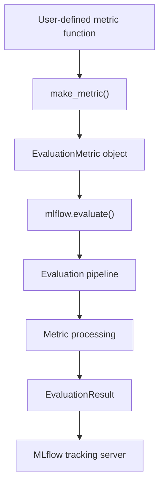
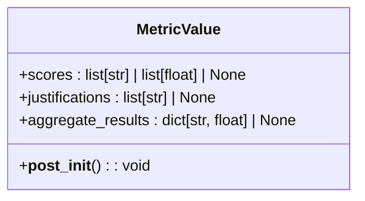
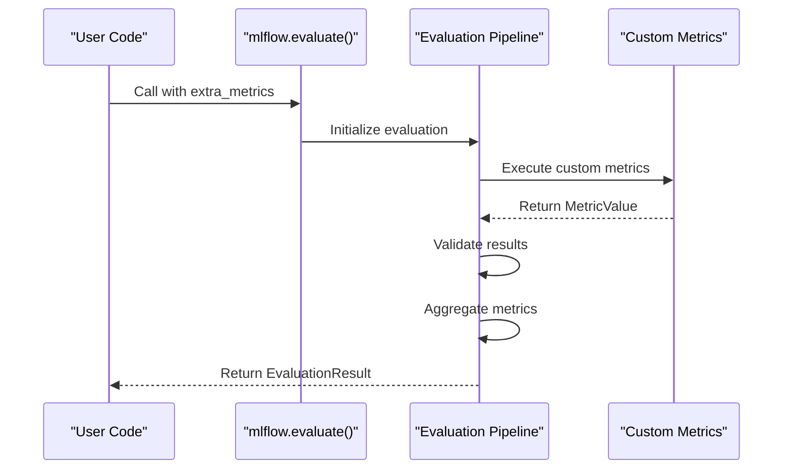
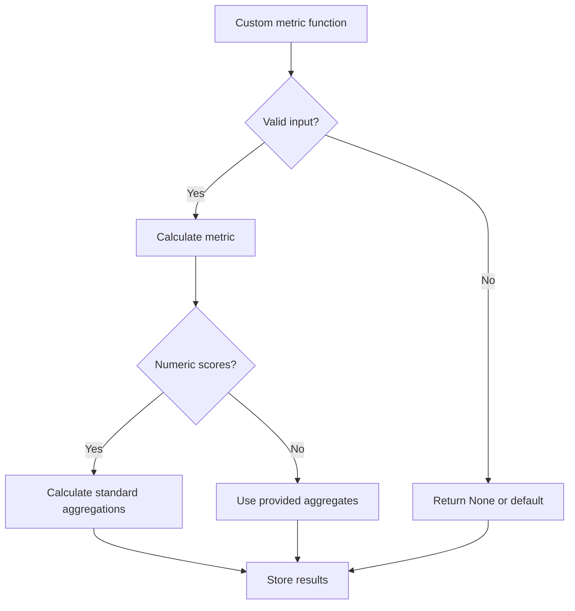

# Custom Metrics

<cite>
**Referenced Files in This Document**   
- [mlflow/metrics/__init__.py](file://mlflow/metrics/__init__.py)
- [mlflow/metrics/base.py](file://mlflow/metrics/base.py)
- [mlflow/metrics/metric_definitions.py](file://mlflow/metrics/metric_definitions.py)
- [mlflow/models/__init__.py](file://mlflow/models/__init__.py)
- [mlflow/models/evaluation/utils/metric.py](file://mlflow/models/evaluation/utils/metric.py)
- [examples/evaluation/evaluate_with_custom_metrics.py](file://examples/evaluation/evaluate_with_custom_metrics.py)
- [examples/evaluation/evaluate_with_custom_metrics_comprehensive.py](file://examples/evaluation/evaluate_with_custom_metrics_comprehensive.py)
- [examples/evaluation/evaluate_with_custom_code_metrics.py](file://examples/evaluation/evaluate_with_custom_code_metrics.py)
</cite>

## Table of Contents
1. [Introduction](#introduction)
2. [Core Components](#core-components)
3. [Architecture Overview](#architecture-overview)
4. [Detailed Component Analysis](#detailed-component-analysis)
5. [Performance Considerations](#performance-considerations)
6. [Troubleshooting Guide](#troubleshooting-guide)
7. [Conclusion](#conclusion)

## Introduction
This document provides comprehensive guidance on extending MLflow's evaluation capabilities through custom metrics. It details the implementation of user-defined metrics using `mlflow.metrics.make_metric()`, covering the integration with MLflow's evaluation pipeline, configuration options, and practical examples. The content is designed to be accessible to beginners while providing sufficient technical depth for experienced developers working with advanced metric patterns.

## Core Components

The custom metrics system in MLflow revolves around the `make_metric()` function, which enables users to define evaluation metrics with specific parameters. Key components include the `EvaluationMetric` class, `MetricValue` data structure, and the evaluation pipeline that processes these metrics. The system supports both simple scalar metrics and complex metrics with detailed scoring and justification information.

**Section sources**
- [mlflow/metrics/__init__.py](file://mlflow/metrics/__init__.py#L31)
- [mlflow/metrics/base.py](file://mlflow/metrics/base.py#L16)
- [mlflow/models/__init__.py](file://mlflow/models/__init__.py#L40)

## Architecture Overview

The custom metrics architecture in MLflow follows a modular design where user-defined metrics are integrated into the evaluation pipeline through the `make_metric()` function. When `mlflow.evaluate()` is called with custom metrics, these metrics are processed alongside built-in metrics, with results aggregated and stored in the `EvaluationResult` structure.



**Diagram sources**
- [mlflow/models/__init__.py](file://mlflow/models/__init__.py#L40)
- [mlflow/models/evaluation/utils/metric.py](file://mlflow/models/evaluation/utils/metric.py#L14)

## Detailed Component Analysis

### Custom Metric Implementation

Custom metrics in MLflow are created using the `make_metric()` function, which requires several key parameters:

- **evaluation_fn**: The function that computes the metric value
- **greater_is_better**: Boolean indicating whether higher values are better
- **name**: The name of the metric
- **version**: Optional version identifier for the metric
- **metric_type**: Optional type specification for the metric

The evaluation function receives parameters including predictions, targets, and built-in metrics, allowing for flexible metric computation based on model outputs and ground truth values.

#### Example: Simple Custom Metric
```python
def squared_diff_plus_one(eval_df, _builtin_metrics):
    return np.sum(np.abs(eval_df["prediction"] - eval_df["target"] + 1) ** 2)

custom_metric = make_metric(
    eval_fn=squared_diff_plus_one,
    greater_is_better=False,
)
```

#### Example: Business-Specific Metric
```python
def revenue_impact_metric(eval_df, builtin_metrics):
    # Calculate revenue impact based on prediction accuracy
    price = eval_df["price"]
    predicted_demand = eval_df["prediction"]
    actual_demand = eval_df["target"]
    
    # Revenue calculation logic
    predicted_revenue = price * predicted_demand
    actual_revenue = price * actual_demand
    revenue_difference = abs(predicted_revenue - actual_revenue)
    
    # Return average revenue impact
    return np.mean(revenue_difference)
```

**Section sources**
- [examples/evaluation/evaluate_with_custom_metrics.py](file://examples/evaluation/evaluate_with_custom_metrics.py#L32)
- [examples/evaluation/evaluate_with_custom_metrics_comprehensive.py](file://examples/evaluation/evaluate_with_custom_metrics_comprehensive.py#L31)

### Metric Value Structure

The `MetricValue` class defines the structure for custom metric results, containing three main components:

- **scores**: Per-row metric values as a list
- **justifications**: Optional explanations for each score
- **aggregate_results**: Dictionary of aggregated metric values

When a custom metric function returns a numeric value, it is automatically wrapped in a `MetricValue` with the aggregate result. For more complex metrics, the function should return a `MetricValue` object directly.



**Diagram sources**
- [mlflow/metrics/base.py](file://mlflow/metrics/base.py#L16)

### Evaluation Pipeline Integration

Custom metrics are integrated into MLflow's evaluation pipeline through the `extra_metrics` parameter in `mlflow.evaluate()`. The pipeline processes custom metrics in the same way as built-in metrics, with validation and aggregation performed automatically.

The evaluation pipeline follows these steps:
1. Collect predictions from the model
2. Prepare evaluation data with predictions and targets
3. Execute custom metric functions
4. Validate metric results
5. Aggregate and store results



**Diagram sources**
- [mlflow/models/evaluation/utils/metric.py](file://mlflow/models/evaluation/utils/metric.py#L44)
- [mlflow/models/__init__.py](file://mlflow/models/__init__.py#L38)

### Advanced Metric Patterns

#### Pairwise Comparison Metrics
For scenarios requiring comparison between model outputs, custom metrics can implement pairwise evaluation:

```python
def pairwise_comparison_metric(predictions, targets, builtin_metrics):
    scores = []
    for i in range(len(predictions) - 1):
        # Compare adjacent predictions
        diff = abs(predictions[i] - predictions[i + 1])
        scores.append(diff)
    
    # Pad scores to match original length
    scores.append(scores[-1] if scores else 0)
    
    return MetricValue(
        scores=scores,
        aggregate_results={"mean_pairwise_diff": np.mean(scores)}
    )
```

#### Probabilistic Metrics
For models that output probabilities, custom metrics can evaluate confidence and uncertainty:

```python
def confidence_metric(predictions, targets, builtin_metrics):
    # Assuming predictions contain probability distributions
    confidence_scores = [max(pred) for pred in predictions]
    
    return MetricValue(
        scores=confidence_scores,
        aggregate_results={
            "mean_confidence": np.mean(confidence_scores),
            "confidence_variance": np.var(confidence_scores)
        }
    )
```

**Section sources**
- [examples/evaluation/evaluate_with_custom_metrics_comprehensive.py](file://examples/evaluation/evaluate_with_custom_metrics_comprehensive.py#L40)
- [mlflow/metrics/metric_definitions.py](file://mlflow/metrics/metric_definitions.py#L8)

### Configuration and Aggregation

Custom metrics support various configuration options for aggregation and null value handling. The system automatically calculates standard aggregations (mean, variance, p90) when per-row scores are provided and are numeric.

For metrics that return only aggregate values, the `aggregate_results` dictionary should contain the final metric value. The metric name is used as the key in the results dictionary unless otherwise specified.

Null value handling is managed through the metric function, which should return appropriate values (such as None) for invalid inputs and log warnings as needed.



**Diagram sources**
- [mlflow/metrics/base.py](file://mlflow/metrics/base.py#L8)
- [mlflow/models/evaluation/utils/metric.py](file://mlflow/models/evaluation/utils/metric.py#L87)

## Performance Considerations

When implementing custom metrics, consider the following performance implications:

- **Computation complexity**: Complex metric calculations can significantly slow down evaluation
- **Memory usage**: Large intermediate results should be managed carefully
- **Parallel execution**: The evaluation pipeline processes metrics sequentially by default
- **Caching**: Consider caching expensive computations when possible

For metrics that require external API calls (such as LLM-based evaluation), be aware of rate limits and latency impacts on the overall evaluation process.

## Troubleshooting Guide

Common issues when implementing custom metrics include:

- **Return type errors**: Ensure the metric function returns a `MetricValue` or numeric value
- **Parameter mismatches**: Verify the function signature matches expected parameters
- **Data type issues**: Handle null values and type conversions appropriately
- **Performance bottlenecks**: Optimize expensive computations

Debugging tips:
- Use logging to trace metric execution
- Test with small datasets first
- Validate input data before computation
- Check for proper error handling in edge cases

The system provides warning messages when metrics return invalid results, helping identify implementation issues.

**Section sources**
- [mlflow/models/evaluation/utils/metric.py](file://mlflow/models/evaluation/utils/metric.py#L72)
- [examples/evaluation/evaluate_with_custom_code_metrics.py](file://examples/evaluation/evaluate_with_custom_code_metrics.py#L23)

## Conclusion

Custom metrics in MLflow provide a powerful mechanism for extending model evaluation capabilities beyond built-in metrics. By using `make_metric()`, users can implement business-specific, domain-specific, or research-oriented metrics that capture the unique requirements of their ML applications. The flexible architecture supports various metric patterns, from simple scalar values to complex metrics with detailed scoring and justification information. With proper implementation and consideration of performance implications, custom metrics enhance the evaluation process and provide deeper insights into model behavior and impact.