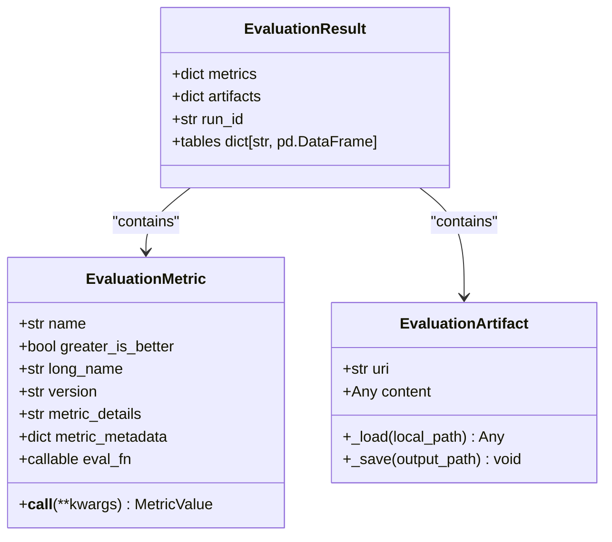
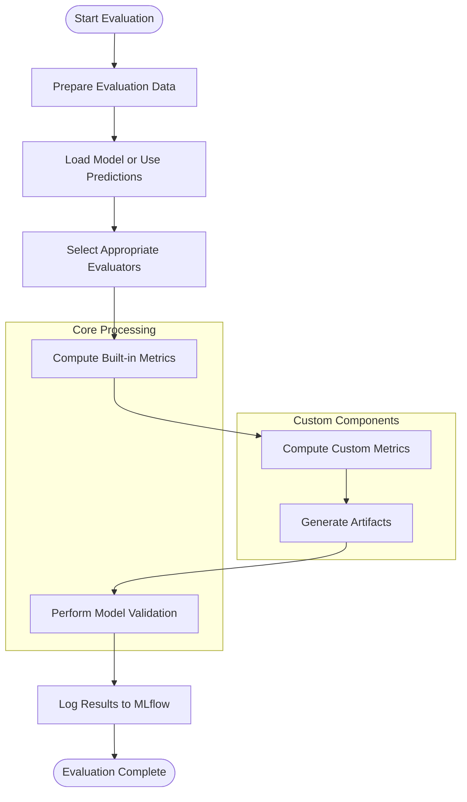
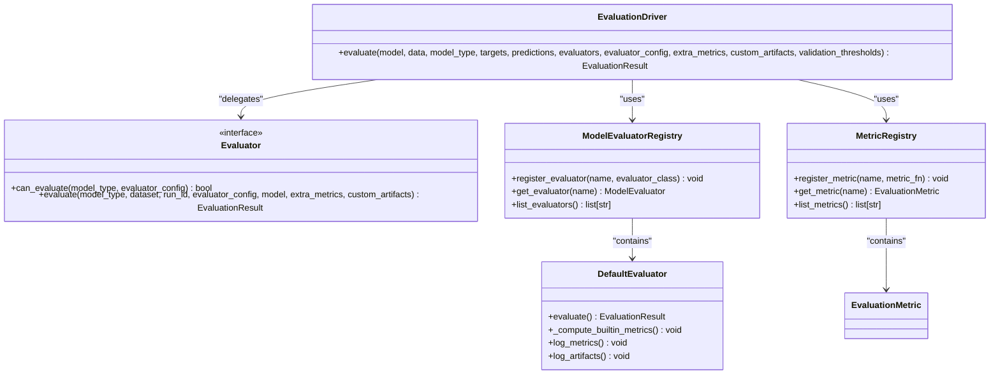
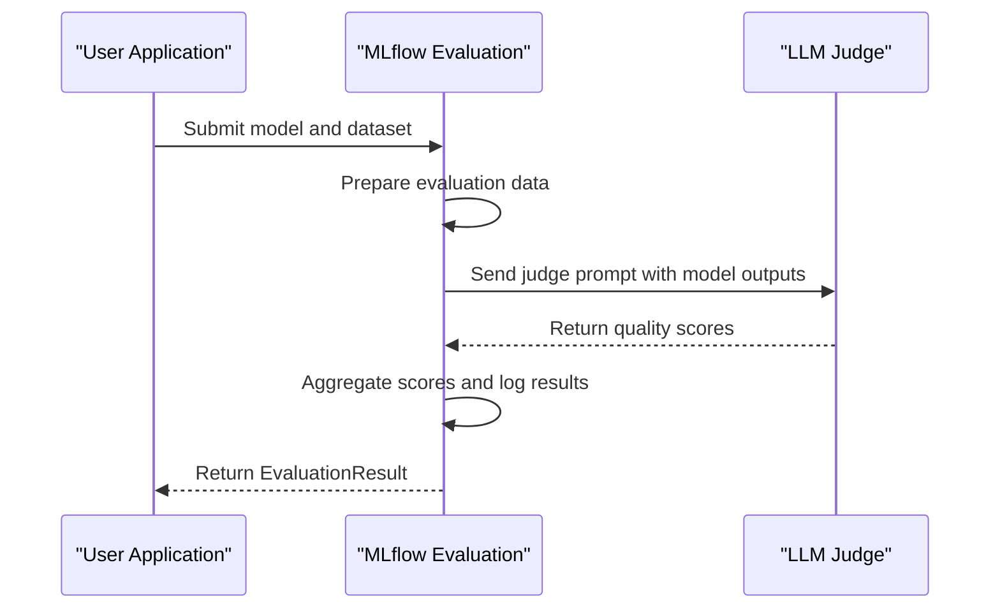
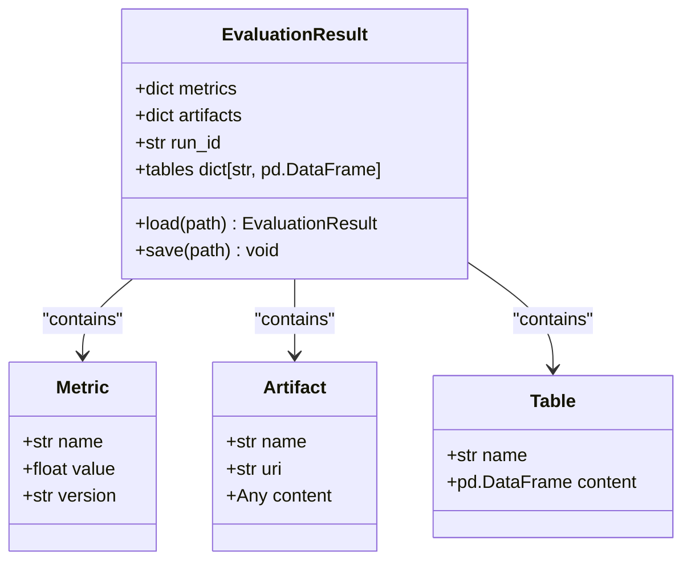

# Evaluation

<cite>
**Referenced Files in This Document**   
- [evaluation.py](file://mlflow/evaluation/evaluation.py)
- [base.py](file://mlflow/models/evaluation/base.py)
- [assessment.py](file://mlflow/entities/assessment.py)
- [genai_metric.py](file://mlflow/metrics/genai/genai_metric.py)
- [evaluate_on_binary_classifier.py](file://examples/evaluation/evaluate_on_binary_classifier.py)
- [evaluate_with_custom_metrics.py](file://examples/evaluation/evaluate_with_custom_metrics.py)
- [evaluate_with_llm_judge.py](file://examples/evaluation/evaluate_with_llm_judge.py)
- [evaluate_with_model_validation.py](file://examples/evaluation/evaluate_with_model_validation.py)
- [evaluate_with_static_dataset.py](file://examples/evaluation/evaluate_with_static_dataset.py)
</cite>

## Table of Contents
1. [Introduction](#introduction)
2. [Core Evaluation Concepts](#core-evaluation-concepts)
3. [Evaluation Architecture](#evaluation-architecture)
4. [Built-in Metrics](#built-in-metrics)
5. [Custom Metrics](#custom-metrics)
6. [LLM Judges and GenAI Evaluation](#llm-judges-and-genai-evaluation)
7. [Model Validation](#model-validation)
8. [Performance Monitoring](#performance-monitoring)
9. [Practical Examples](#practical-examples)
10. [API Reference](#api-reference)
11. [Troubleshooting Guide](#troubleshooting-guide)
12. [Conclusion](#conclusion)

## Introduction

MLflow's evaluation framework provides a comprehensive system for quantifying model performance, comparing model variants, and ensuring quality before deployment. The framework supports both traditional machine learning models and LLM applications through a unified interface that enables systematic assessment of model behavior across different domains.

The evaluation capabilities are centered around the `evaluate()` function, which serves as the primary entry point for model assessment. This function computes metrics, generates artifacts, and logs results to MLflow Tracking, creating a complete record of model performance. The evaluation results are encapsulated in an `EvaluationResult` object that contains both scalar metrics and rich artifacts such as plots and tables.

MLflow evaluation supports various model types including classifiers, regressors, and LLM applications with specialized evaluation logic for each. The framework is extensible through custom metrics and artifacts, allowing organizations to implement domain-specific evaluation criteria. For LLM applications, MLflow provides specialized capabilities like LLM-as-a-judge metrics that use large language models to assess response quality.

**Section sources**
- [base.py](file://mlflow/models/evaluation/base.py#L597-L611)
- [evaluation.py](file://mlflow/evaluation/evaluation.py#L207-L246)

## Core Evaluation Concepts

### Evaluation Metrics
Evaluation metrics in MLflow are represented by the `EvaluationMetric` class, which encapsulates a metric computation function along with metadata about the metric. Each metric has a name, a boolean flag indicating whether greater values are better, and optional long name, version, and descriptive details.

Metrics can be either built-in or custom. Built-in metrics are automatically computed based on the model type, while custom metrics are user-defined functions that implement specific business logic or domain-specific evaluation criteria. The framework distinguishes between metrics that return simple scalar values and those that return `MetricValue` objects containing additional information like per-row scores and justifications.



**Diagram sources **
- [base.py](file://mlflow/models/evaluation/base.py#L78-L158)
- [base.py](file://mlflow/models/evaluation/base.py#L597-L678)

### Assessments
Assessments represent qualitative judgments about model outputs and are implemented through the `Assessment` class hierarchy. There are two main types of assessments: expectations and feedback. Expectations represent the expected value for a particular operation, such as the correct answer to a question. Feedback represents quality judgments about model outputs, which can come from human evaluators, heuristic scorers, or LLM-as-a-judge systems.

Each assessment includes a name, source, rationale, metadata, and timestamps. The source indicates how the assessment was generated (e.g., human, code, LLM judge). Assessments can be associated with specific traces and spans in the MLflow tracing system, enabling detailed analysis of model behavior throughout the inference process.

**Section sources**
- [assessment.py](file://mlflow/entities/assessment.py#L32-L85)
- [base.py](file://mlflow/models/evaluation/base.py#L78-L158)

## Evaluation Architecture

### Evaluation Workflow
The MLflow evaluation workflow follows a structured process that begins with data preparation and ends with result logging and analysis. The workflow is orchestrated by the `evaluate()` function, which coordinates multiple evaluators based on the model type and configuration.



**Diagram sources **
- [base.py](file://mlflow/models/evaluation/base.py#L1412-L1770)
- [default.py](file://mlflow/models/evaluation/evaluators/default.py#L85-L105)

### Component Interactions
The evaluation system is built on a modular architecture with clear separation of concerns between components. The main components include the evaluation driver, model evaluators, metric registry, and artifact generators.



**Diagram sources **
- [base.py](file://mlflow/models/evaluation/base.py#L703-L758)
- [base.py](file://mlflow/models/evaluation/base.py#L761-L768)

## Built-in Metrics

MLflow provides a comprehensive set of built-in metrics that are automatically computed based on the model type. These metrics are designed to cover common evaluation scenarios for different types of models.

### Classifier Metrics
For classification models, MLflow computes standard metrics including:
- Accuracy
- Precision, recall, and F1-score (macro, micro, and weighted)
- ROC-AUC and PR-AUC
- Confusion matrix
- Per-class metrics

The classifier evaluator automatically detects whether the dataset is binary or multiclass and adjusts the computed metrics accordingly. For binary classification, it also computes metrics specific to the positive class when a positive label is specified.

### Regressor Metrics
For regression models, MLflow computes standard regression metrics including:
- Mean Squared Error (MSE) and Root MSE (RMSE)
- Mean Absolute Error (MAE)
- R² score
- Explained variance

These metrics provide a comprehensive view of regression model performance, capturing both overall fit and error distribution characteristics.

### Text and LLM Metrics
For text-based models and LLM applications, MLflow provides specialized metrics including:
- Token count (input, output, total)
- Toxicity score
- Readability metrics (Flesch-Kincaid grade level, Automated Readability Index)
- Exact match and fuzzy match for question answering
- Answer similarity and relevance

These metrics help assess both the quality and safety of LLM-generated content, providing insights into response characteristics beyond simple accuracy.

**Section sources**
- [default.py](file://mlflow/models/evaluation/evaluators/default.py#L85-L105)
- [classifier.py](file://mlflow/models/evaluation/evaluators/classifier.py#L120-L145)

## Custom Metrics

### Creating Custom Metrics
Custom metrics in MLflow are created using the `make_metric()` function, which takes a metric computation function and metadata to create an `EvaluationMetric` object. The metric function must follow a specific signature that includes parameters for predictions, targets, built-in metrics, and any additional arguments needed for the computation.

```python
def custom_metric_fn(predictions, targets, metrics, threshold=0.5):
    # Custom metric logic here
    pass

custom_metric = make_metric(
    eval_fn=custom_metric_fn,
    greater_is_better=True,
    name="custom_accuracy",
    long_name="Custom Accuracy with Threshold",
    metric_details="Accuracy computed with custom threshold"
)
```

The `make_metric()` function validates the metric name and sets up the appropriate call signature for the metric function. Custom metrics can access both the prediction and target data as well as the built-in metrics computed by the default evaluator, enabling the creation of derived metrics that combine multiple evaluation criteria.

### Custom Artifacts
In addition to custom metrics, MLflow supports custom artifacts that generate rich outputs such as plots, tables, and reports. Custom artifact functions are passed the evaluation data, built-in metrics, and an artifacts directory where they can save generated files.

```python
def custom_plot_artifact(eval_df, builtin_metrics, artifacts_dir):
    # Generate a custom plot
    plt.figure(figsize=(10, 6))
    plt.scatter(eval_df["prediction"], eval_df["target"])
    plt.xlabel("Predicted Values")
    plt.ylabel("Actual Values")
    plt.title("Prediction vs. Actual")
    
    # Save the plot
    plot_path = os.path.join(artifacts_dir, "prediction_vs_actual.png")
    plt.savefig(plot_path)
    plt.close()
    
    # Return artifact dictionary
    return {"prediction_vs_actual_plot": plot_path}
```

Custom artifacts can return multiple artifacts by including multiple file paths in the returned dictionary. These artifacts are automatically logged to MLflow and can be viewed in the MLflow UI.

**Section sources**
- [base.py](file://mlflow/models/evaluation/base.py#L325-L537)
- [evaluate_with_custom_metrics.py](file://examples/evaluation/evaluate_with_custom_metrics.py#L32-L60)

## LLM Judges and GenAI Evaluation

### LLM-as-a-Judge Metrics
MLflow supports LLM-as-a-judge evaluation through specialized metrics that use large language models to assess the quality of model outputs. These metrics are created using the `make_genai_metric_from_prompt()` function, which takes a judge prompt and optional parameters for the judge model.



**Diagram sources **
- [genai_metric.py](file://mlflow/metrics/genai/genai_metric.py#L221-L312)
- [evaluate_with_llm_judge.py](file://examples/evaluation/evaluate_with_llm_judge.py#L30-L31)

### GenAI Metric Configuration
GenAI metrics are configured with several key parameters:
- **Judge prompt**: The prompt template used to instruct the judge model, which can include variables like {inputs}, {predictions}, and {targets}
- **Judge model**: The LLM used as the judge, specified by model URI (e.g., "openai:/gpt-4")
- **Inference parameters**: Parameters for the judge model such as temperature, max_tokens, and top_p
- **Aggregations**: Methods for aggregating scores across multiple examples (mean, median, variance, p90)
- **Examples**: Optional few-shot examples to guide the judge model's scoring behavior

The framework handles the complexity of sending multiple evaluation examples to the judge model in parallel, aggregating the results, and logging them to MLflow. This enables efficient evaluation of large datasets while maintaining consistency in scoring.

**Section sources**
- [genai_metric.py](file://mlflow/metrics/genai/genai_metric.py#L221-L312)
- [instructions_judge/__init__.py](file://mlflow/genai/judges/instructions_judge/__init__.py#L96-L114)

## Model Validation

### Validation Thresholds
MLflow supports model validation through the specification of validation thresholds for metrics. These thresholds define acceptable performance ranges and can be used to automatically determine whether a model meets quality standards.

Validation thresholds are specified as a dictionary mapping metric names to threshold values. For each metric, the threshold can be a single value (for metrics where greater_is_better is True) or a dictionary with "min" and/or "max" keys for more complex constraints.

```python
validation_thresholds = {
    "accuracy": 0.8,
    "precision": {"min": 0.75},
    "recall": {"min": 0.7, "max": 0.95},
    "f1_score": 0.75
}
```

When validation thresholds are specified, the evaluation process checks whether the model meets all thresholds and returns a validation status that can be used in automated deployment pipelines.

### Baseline Model Comparison
In addition to absolute thresholds, MLflow supports comparison against baseline models. This approach evaluates whether a candidate model performs better than a reference model on key metrics.

```python
results = mlflow.evaluate(
    model=candidate_model_uri,
    data=eval_data,
    model_type="classifier",
    baseline_model=baseline_model_uri,
    validation_thresholds=validation_thresholds
)
```

The framework computes metrics for both the candidate and baseline models and compares them according to the specified thresholds. This enables relative performance assessment that accounts for dataset characteristics and provides more meaningful comparisons than absolute thresholds alone.

**Section sources**
- [evaluate_with_model_validation.py](file://examples/evaluation/evaluate_with_model_validation.py)
- [base.py](file://mlflow/models/evaluation/base.py#L1412-L1770)

## Performance Monitoring

### Evaluation Result Structure
The `EvaluationResult` object returned by the `evaluate()` function contains a comprehensive set of performance metrics and artifacts. This object serves as the primary interface for accessing and analyzing evaluation results.



**Diagram sources **
- [base.py](file://mlflow/models/evaluation/base.py#L597-L678)

### Metrics Access and Analysis
Evaluation metrics can be accessed directly from the `EvaluationResult` object through its `metrics` property, which returns a dictionary mapping metric names to values. The metric names include the metric version as a suffix (e.g., "accuracy/v1") to support multiple versions of the same metric.

For more detailed analysis, the `tables` property provides access to structured data such as the evaluation results table, which contains per-row predictions, targets, and computed metrics. This enables advanced analysis like error analysis, performance by segment, and identification of specific failure modes.

The artifacts property provides access to generated artifacts like plots and reports, which can be used for visual analysis of model performance. These artifacts are stored in MLflow and can be accessed programmatically or through the MLflow UI.

**Section sources**
- [base.py](file://mlflow/models/evaluation/base.py#L659-L698)

## Practical Examples

### Evaluating a Binary Classifier
The following example demonstrates how to evaluate a binary classifier model using MLflow's built-in evaluation capabilities:

```python
import shap
import xgboost
from sklearn.model_selection import train_test_split
import mlflow
from mlflow.models import infer_signature

# Load data and train model
X, y = shap.datasets.adult()
X_train, X_test, y_train, y_test = train_test_split(X, y, test_size=0.33, random_state=42)
model = xgboost.XGBClassifier().fit(X_train, y_train)

# Log model and evaluate
with mlflow.start_run() as run:
    model_info = mlflow.sklearn.log_model(model, name="model", signature=infer_signature(X_train, model.predict(X_train)))
    result = mlflow.evaluate(
        model_info.model_uri,
        X_test,
        targets=y_test,
        model_type="classifier",
        evaluators=["default"]
    )
```

This example loads the Adult dataset, trains an XGBoost classifier, logs the model to MLflow, and evaluates it using the default evaluator. The evaluation computes standard classification metrics and logs them to the MLflow run.

**Section sources**
- [evaluate_on_binary_classifier.py](file://examples/evaluation/evaluate_on_binary_classifier.py)

### Custom Metrics for Regression
The following example shows how to create and use custom metrics for a regression model:

```python
def squared_diff_plus_one(eval_df, _builtin_metrics):
    return np.sum(np.abs(eval_df["prediction"] - eval_df["target"] + 1) ** 2)

def sum_on_target_divided_by_two(_eval_df, builtin_metrics):
    return builtin_metrics["sum_on_target"] / 2

def prediction_target_scatter(eval_df, _builtin_metrics, artifacts_dir):
    plt.scatter(eval_df["prediction"], eval_df["target"])
    plt.xlabel("Targets")
    plt.ylabel("Predictions")
    plot_path = os.path.join(artifacts_dir, "example_scatter_plot.png")
    plt.savefig(plot_path)
    return {"example_scatter_plot_artifact": plot_path}

with mlflow.start_run():
    result = mlflow.evaluate(
        model=model_info.model_uri,
        data=eval_data,
        targets="target",
        model_type="regressor",
        extra_metrics=[
            make_metric(eval_fn=squared_diff_plus_one, greater_is_better=False),
            make_metric(eval_fn=sum_on_target_divided_by_two, greater_is_better=True),
        ],
        custom_artifacts=[prediction_target_scatter],
    )
```

This example defines two custom metrics and one custom artifact function, then uses them in the evaluation process. The custom metrics demonstrate both direct computation on evaluation data and derivation from built-in metrics.

**Section sources**
- [evaluate_with_custom_metrics.py](file://examples/evaluation/evaluate_with_custom_metrics.py)

### LLM Evaluation with LLM Judge
The following example demonstrates how to evaluate an LLM application using an LLM-as-a-judge approach:

```python
example = EvaluationExample(
    input="What is MLflow?",
    output="MLflow is an open-source platform for managing machine learning workflows...",
    score=4,
    justification="The definition effectively explains what MLflow is...",
    grading_context={"ground_truth": "MLflow is an open-source platform for managing the end-to-end machine learning (ML) lifecycle..."}
)

answer_similarity_metric = answer_similarity(examples=[example])

with mlflow.start_run():
    logged_model = mlflow.openai.log_model(
        model="gpt-4o-mini",
        task=openai.chat.completions,
        name="model",
        messages=[{"role": "system", "content": "Answer the following question in two sentences"}, {"role": "user", "content": "{question}"}],
    )
    
    results = mlflow.evaluate(
        logged_model.model_uri,
        eval_df,
        targets="ground_truth",
        model_type="question-answering",
        extra_metrics=[answer_similarity_metric],
    )
```

This example creates a similarity metric based on a few-shot example, logs an OpenAI model to MLflow, and evaluates it using both built-in metrics and the custom similarity metric. The evaluation assesses the quality of the model's responses compared to ground truth answers.

**Section sources**
- [evaluate_with_llm_judge.py](file://examples/evaluation/evaluate_with_llm_judge.py)

## API Reference

### evaluate() Function
The primary evaluation function in MLflow has the following signature and parameters:

```python
def evaluate(
    model=None,
    data=None,
    model_type=None,
    targets=None,
    predictions=None,
    evaluators=None,
    evaluator_config=None,
    extra_metrics=None,
    custom_artifacts=None,
    validation_thresholds=None,
    baseline_model=None,
    dataset_name=None,
    dataset_path=None,
    results_table=None,
    prompts=None,
):
    """
    Evaluate a model on a dataset and return evaluation results.
    
    Args:
        model: The model to evaluate, specified as a model URI or a callable.
        data: The dataset to use for evaluation, as a pandas DataFrame, numpy array, or MLflow Dataset.
        model_type: The type of model being evaluated (e.g., "classifier", "regressor", "question-answering").
        targets: The name of the column containing target values, or the target values themselves.
        predictions: The name of the column containing model predictions, if the model returns multiple columns.
        evaluators: The evaluators to use for evaluation. If None, uses the default evaluator.
        evaluator_config: Configuration parameters for the evaluators.
        extra_metrics: Additional custom metrics to compute.
        custom_artifacts: Custom artifact functions to generate additional outputs.
        validation_thresholds: Thresholds for validating model performance.
        baseline_model: A baseline model to compare against.
        dataset_name: Name of the dataset for logging purposes.
        dataset_path: Path to the dataset for logging purposes.
        results_table: Name of the table to log evaluation results to.
        prompts: Prompts used in the evaluation, for LLM applications.
    
    Returns:
        EvaluationResult: An object containing the evaluation metrics and artifacts.
    """
```

### make_metric() Function
The function for creating custom metrics has the following signature:

```python
def make_metric(
    *,
    eval_fn,
    greater_is_better,
    name=None,
    long_name=None,
    version=None,
    metric_details=None,
    metric_metadata=None,
):
    """
    Create a custom evaluation metric.
    
    Args:
        eval_fn: The function that computes the metric value.
        greater_is_better: Whether higher values of the metric indicate better performance.
        name: The name of the metric.
        long_name: A longer, more descriptive name for the metric.
        version: The version of the metric.
        metric_details: A description of how the metric is calculated.
        metric_metadata: Additional metadata for the metric.
    
    Returns:
        EvaluationMetric: A custom metric object that can be used in evaluation.
    """
```

**Section sources**
- [base.py](file://mlflow/models/evaluation/base.py#L325-L537)
- [base.py](file://mlflow/models/evaluation/base.py#L1412-L1770)

## Troubleshooting Guide

### Common Issues and Solutions
1. **Missing pandas dependency**: The evaluation framework requires pandas for data processing. Ensure pandas is installed in your environment.

2. **Model loading errors**: When evaluating a logged model, ensure the model URI is correct and the model flavor is supported by the evaluation framework.

3. **Custom metric signature errors**: Custom metrics must follow the expected signature with parameters for predictions, targets, and built-in metrics.

4. **LLM judge rate limits**: When using LLM-as-a-judge metrics, you may encounter rate limits from the LLM provider. Consider reducing the number of evaluation examples or implementing retry logic.

5. **Memory issues with large datasets**: For very large evaluation datasets, consider using sampling or batched evaluation to reduce memory usage.

### Debugging Evaluation Results
When evaluation results are unexpected, consider the following debugging steps:
1. Check the evaluation data for data type mismatches or missing values.
2. Verify that the model_type parameter matches the actual model type.
3. Examine the evaluation results table for patterns in model errors.
4. Use custom artifacts to generate diagnostic plots that visualize model performance.
5. Compare results against a simple baseline model to establish expected performance ranges.

**Section sources**
- [base.py](file://mlflow/models/evaluation/base.py)
- [evaluate_with_custom_metrics.py](file://examples/evaluation/evaluate_with_custom_metrics.py)

## Conclusion

MLflow's evaluation framework provides a comprehensive and flexible system for assessing model performance across different domains and use cases. The framework supports both traditional machine learning models and LLM applications through a unified interface that enables systematic evaluation, comparison, and validation.

The architecture is designed to be extensible, allowing organizations to implement custom metrics and artifacts that reflect their specific business requirements. For LLM applications, the framework provides specialized capabilities like LLM-as-a-judge evaluation that leverage large language models to assess response quality.

By integrating evaluation into the MLflow ecosystem, organizations can establish consistent evaluation practices, ensure model quality before deployment, and maintain comprehensive records of model performance over time. The framework's support for model validation and baseline comparison enables automated quality gates in MLOps pipelines, helping to prevent the deployment of models that do not meet performance standards.

As machine learning applications become more complex, particularly with the rise of LLMs, systematic evaluation becomes increasingly important. MLflow's evaluation capabilities provide the tools needed to ensure model reliability, safety, and effectiveness in production environments.