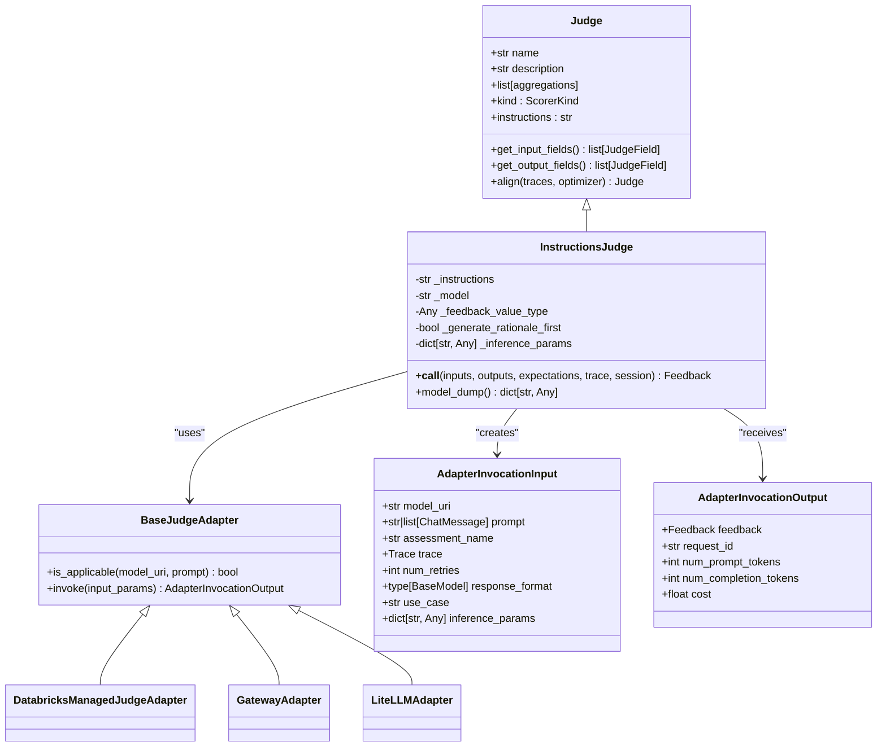
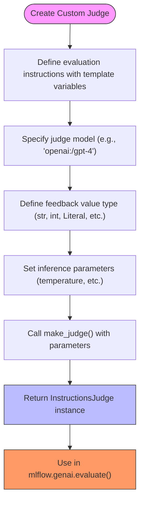
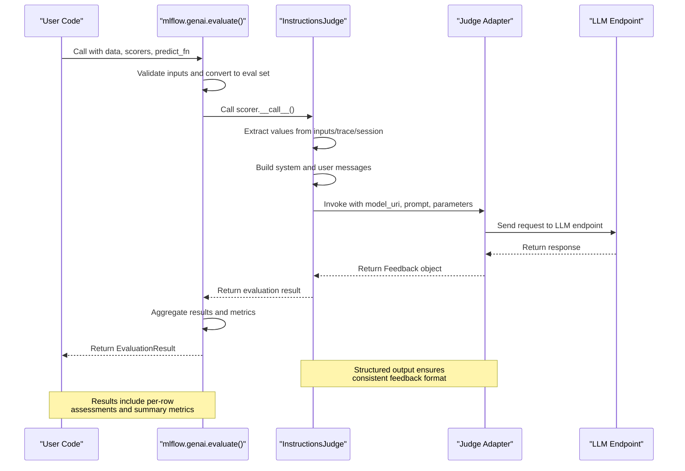
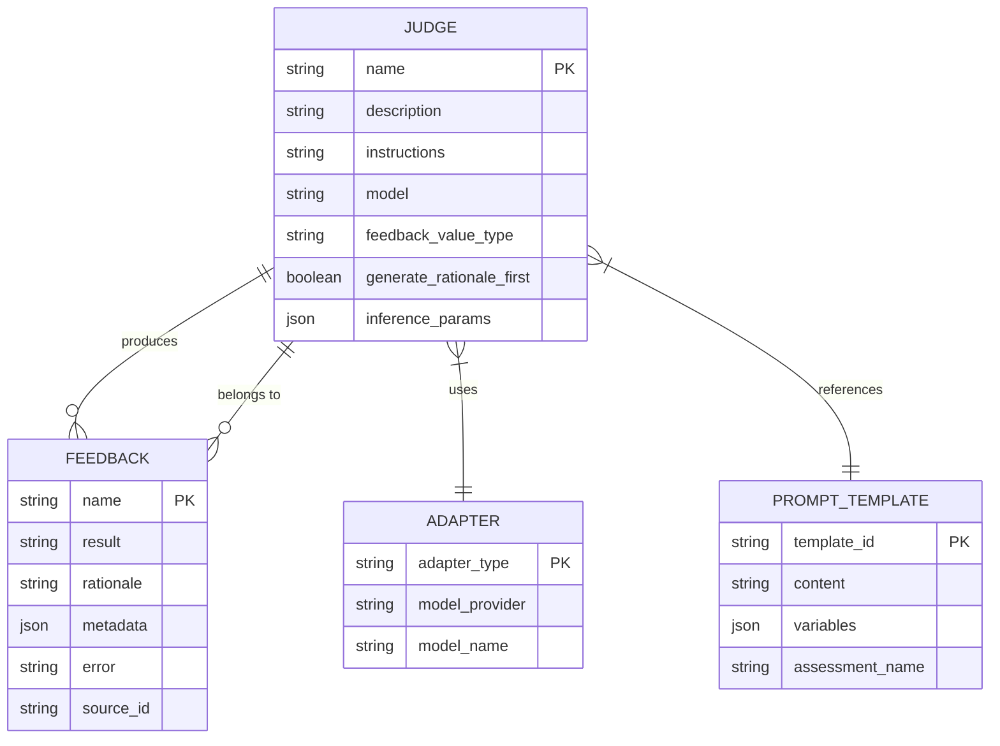

# LLM Judges

<cite>
**Referenced Files in This Document**   
- [base.py](file://mlflow/genai/judges/base.py)
- [builtin.py](file://mlflow/genai/judges/builtin.py)
- [make_judge.py](file://mlflow/genai/judges/make_judge.py)
- [custom_prompt_judge.py](file://mlflow/genai/judges/custom_prompt_judge.py)
- [instructions_judge/__init__.py](file://mlflow/genai/judges/instructions_judge/__init__.py)
- [evaluation/base.py](file://mlflow/genai/evaluation/base.py)
- [adapters/base_adapter.py](file://mlflow/genai/judges/adapters/base_adapter.py)
- [adapters/databricks_managed_judge_adapter.py](file://mlflow/genai/judges/adapters/databricks_managed_judge_adapter.py)
- [adapters/gateway_adapter.py](file://mlflow/genai/judges/adapters/gateway_adapter.py)
- [adapters/litellm_adapter.py](file://mlflow/genai/judges/adapters/litellm_adapter.py)
- [prompts/relevance_to_query.py](file://mlflow/genai/judges/prompts/relevance_to_query.py)
- [prompts/safety.py](file://mlflow/genai/judges/prompts/safety.py)
- [prompts/correctness.py](file://mlflow/genai/judges/prompts/correctness.py)
- [prompts/groundedness.py](file://mlflow/genai/judges/prompts/groundedness.py)
- [prompts/context_sufficiency.py](file://mlflow/genai/judges/prompts/context_sufficiency.py)
- [prompts/tool_call_efficiency.py](file://mlflow/genai/judges/prompts/tool_call_efficiency.py)
- [prompts/tool_call_correctness.py](file://mlflow/genai/judges/prompts/tool_call_correctness.py)
- [prompts/guidelines.py](file://mlflow/genai/judges/prompts/guidelines.py)
- [evaluate_with_llm_judge.py](file://examples/evaluation/evaluate_with_llm_judge.py)
</cite>

## Table of Contents
1. [Introduction](#introduction)
2. [Core Architecture](#core-architecture)
3. [Built-in Judges](#built-in-judges)
4. [Custom Prompt Judges](#custom-prompt-judges)
5. [Judge Invocation and Evaluation Flow](#judge-invocation-and-evaluation-flow)
6. [Domain Model](#domain-model)
7. [Configuration Options](#configuration-options)
8. [Common Issues and Best Practices](#common-issues-and-best-practices)
9. [Conclusion](#conclusion)

## Introduction

MLflow's LLM judge framework provides a comprehensive system for evaluating large language model applications using other LLMs as judges. This framework enables automated assessment of various quality dimensions including relevance, coherence, safety, and correctness through both pre-built evaluators and customizable judging logic. The system is designed to work seamlessly with MLflow's tracing capabilities, allowing evaluation of both single-turn and multi-turn conversational applications. Judges can be configured with specific evaluation criteria, model backends, and inference parameters to suit different evaluation needs while providing consistent feedback through standardized output formats.

**Section sources**
- [base.py](file://mlflow/genai/judges/base.py#L1-L131)
- [builtin.py](file://mlflow/genai/judges/builtin.py#L1-L697)

## Core Architecture

The LLM judge framework in MLflow follows a modular architecture with clear separation between judge definition, execution, and integration layers. At its core is the `Judge` class that inherits from `Scorer` and provides the foundation for all judging capabilities. The framework supports multiple judge types through a factory pattern implemented in `make_judge`, which creates instances of `InstructionsJudge` configured with specific evaluation criteria. 

The architecture employs adapter patterns to support various model providers, with adapters handling the specifics of interacting with different LLM endpoints. The system distinguishes between field-based evaluation (using inputs, outputs, expectations) and trace-based evaluation (using full execution traces), allowing flexible assessment approaches. Built-in judges are implemented as wrapper functions around the core judging infrastructure, providing convenient access to common evaluation patterns while maintaining consistency with the underlying framework.



**Diagram sources **
- [base.py](file://mlflow/genai/judges/base.py#L1-L131)
- [instructions_judge/__init__.py](file://mlflow/genai/judges/instructions_judge/__init__.py#L51-L744)
- [adapters/base_adapter.py](file://mlflow/genai/judges/adapters/base_adapter.py#L1-L123)

**Section sources**
- [base.py](file://mlflow/genai/judges/base.py#L1-L131)
- [make_judge.py](file://mlflow/genai/judges/make_judge.py#L1-L245)
- [instructions_judge/__init__.py](file://mlflow/genai/judges/instructions_judge/__init__.py#L51-L744)

## Built-in Judges

MLflow provides several built-in judges for common evaluation scenarios, each implemented as a wrapper function that leverages the core judging infrastructure. These include `is_context_relevant` for assessing whether retrieved context is relevant to a query, `is_context_sufficient` for determining if context contains enough information to answer a question, and `is_grounded` for verifying that responses are supported by provided context. 

The framework also includes `is_correct` for evaluating whether responses contain expected facts, `is_safe` for detecting unsafe content, and `meets_guidelines` for checking adherence to specified guidelines. Specialized judges like `is_tool_call_correct` and `is_tool_call_efficient` evaluate agent behavior in tool-using applications, analyzing both the correctness of tool selection and arguments as well as efficiency in avoiding redundant calls. These built-in judges follow a consistent API pattern with parameters for request, response, context, and optional expectations, making them easy to use across different evaluation scenarios.

```mermaid
classDiagram
class BuiltInJudge {
+str request
+str response
+Any context
+list[str] expected_facts
+str expected_response
+str name
+str model
}
class RelevanceJudge {
+is_context_relevant(request, context, name, model) Feedback
+is_context_sufficient(request, context, expected_facts, expected_response, name, model) Feedback
}
class CorrectnessJudge {
+is_correct(request, response, expected_facts, expected_response, name, model) Feedback
+is_grounded(request, response, context, name, model) Feedback
}
class SafetyJudge {
+is_safe(content, name, model) Feedback
+meets_guidelines(guidelines, context, name, model) Feedback
}
class ToolCallJudge {
+is_tool_call_correct(request, tools_called, available_tools, expected_tool_calls, include_arguments, check_order, name, model) Feedback
+is_tool_call_efficient(request, tools_called, available_tools, name, model) Feedback
}
BuiltInJudge <|-- RelevanceJudge
BuiltInJudge <|-- CorrectnessJudge
BuiltInJudge <|-- SafetyJudge
BuiltInJudge <|-- ToolCallJudge
RelevanceJudge --> [prompts/relevance_to_query.py] : "uses prompt"
RelevanceJudge --> [prompts/context_sufficiency.py] : "uses prompt"
CorrectnessJudge --> [prompts/correctness.py] : "uses prompt"
CorrectnessJudge --> [prompts/groundedness.py] : "uses prompt"
SafetyJudge --> [prompts/safety.py] : "uses prompt"
SafetyJudge --> [prompts/guidelines.py] : "uses prompt"
ToolCallJudge --> [prompts/tool_call_correctness.py] : "uses prompt"
ToolCallJudge --> [prompts/tool_call_efficiency.py] : "uses prompt"
```

**Diagram sources **
- [builtin.py](file://mlflow/genai/judges/builtin.py#L1-L697)
- [prompts/relevance_to_query.py](file://mlflow/genai/judges/prompts/relevance_to_query.py)
- [prompts/correctness.py](file://mlflow/genai/judges/prompts/correctness.py)
- [prompts/groundedness.py](file://mlflow/genai/judges/prompts/groundedness.py)
- [prompts/context_sufficiency.py](file://mlflow/genai/judges/prompts/context_sufficiency.py)
- [prompts/safety.py](file://mlflow/genai/judges/prompts/safety.py)
- [prompts/guidelines.py](file://mlflow/genai/judges/prompts/guidelines.py)
- [prompts/tool_call_correctness.py](file://mlflow/genai/judges/prompts/tool_call_correctness.py)
- [prompts/tool_call_efficiency.py](file://mlflow/genai/judges/prompts/tool_call_efficiency.py)

**Section sources**
- [builtin.py](file://mlflow/genai/judges/builtin.py#L1-L697)

## Custom Prompt Judges

The framework supports custom prompt judges through both the `make_judge` function and the deprecated `custom_prompt_judge` function. The `make_judge` function allows creation of judges with natural language instructions containing template variables like `{{ inputs }}`, `{{ outputs }}`, `{{ expectations }}`, `{{ conversation }}`, or `{{ trace }}` to reference evaluation data. This approach provides flexibility in defining evaluation criteria while maintaining structured output through type specification.

Custom judges can specify the expected type of the feedback value using the `feedback_value_type` parameter, supporting primitive types (str, int, float, bool), Literal types for categorical choices, and collections (dict, list) of primitive types. The system validates these types and enforces structured output generation. For backward compatibility, the `custom_prompt_judge` function uses a different syntax with double square brackets `[[choice]]` to denote evaluation categories, but this approach is deprecated in favor of the more flexible `make_judge` interface.



**Diagram sources **
- [make_judge.py](file://mlflow/genai/judges/make_judge.py#L94-L245)
- [custom_prompt_judge.py](file://mlflow/genai/judges/custom_prompt_judge.py#L22-L171)

**Section sources**
- [make_judge.py](file://mlflow/genai/judges/make_judge.py#L94-L245)
- [custom_prompt_judge.py](file://mlflow/genai/judges/custom_prompt_judge.py#L22-L171)

## Judge Invocation and Evaluation Flow

The invocation relationship between `mlflow.genai.eval()` and the underlying judge infrastructure follows a structured flow that begins with evaluation data preparation and ends with result aggregation. When `mlflow.genai.evaluate()` is called with a dataset and scorers (including judges), it first validates the input data and converts it to a standardized evaluation set. For each scorer, including judges, the system determines the appropriate evaluation approach based on the data available.

For trace-based evaluation, the system extracts inputs, outputs, and expectations from trace objects. For field-based evaluation, it uses the provided columns directly. The `InstructionsJudge.__call__()` method then processes the evaluation request by building appropriate system and user messages based on the judge's instructions and template variables. The system routes the evaluation to the appropriate adapter based on the model URI, with adapters handling provider-specific details of model invocation.

The evaluation flow includes automatic handling of different evaluation modes (single-turn vs. multi-turn), structured output generation, and feedback formatting. Results are returned as `Feedback` objects containing both the evaluation result and rationale, with metadata about the evaluation process. The system also handles error cases gracefully, returning feedback with error information when evaluations fail.



**Diagram sources **
- [evaluation/base.py](file://mlflow/genai/evaluation/base.py#L52-L495)
- [instructions_judge/__init__.py](file://mlflow/genai/judges/instructions_judge/__init__.py#L444-L547)
- [adapters/base_adapter.py](file://mlflow/genai/judges/adapters/base_adapter.py#L83-L123)

**Section sources**
- [evaluation/base.py](file://mlflow/genai/evaluation/base.py#L52-L495)
- [instructions_judge/__init__.py](file://mlflow/genai/judges/instructions_judge/__init__.py#L444-L547)

## Domain Model

The domain model for MLflow's judge system centers around the `Judge` and `InstructionsJudge` classes, which define the core evaluation capabilities. Judges are configured with instructions that contain template variables referencing evaluation data (`{{ inputs }}`, `{{ outputs }}`, `{{ expectations }}`, `{{ conversation }}`, `{{ trace }}`). The system validates these instructions to ensure they contain at least one supported variable and rejects custom variables to maintain consistency.

Each judge produces feedback with standardized output fields: `result` containing the evaluation outcome and `rationale` providing the reasoning behind the assessment. The `feedback_value_type` parameter allows specification of the result type, enabling both categorical (Literal) and continuous (int, float) evaluations. The model supports both field-based evaluation (direct parameter passing) and trace-based evaluation (data extraction from execution traces), with automatic resolution of values when traces are provided.

The domain model also includes adapter interfaces that abstract away provider-specific details, allowing the same judging logic to work across different model backends. Evaluation context is preserved through the feedback object, which can include metadata about the evaluation process, token usage, and costs when available from the underlying model provider.



**Diagram sources **
- [base.py](file://mlflow/genai/judges/base.py#L1-L131)
- [instructions_judge/__init__.py](file://mlflow/genai/judges/instructions_judge/__init__.py#L51-L744)
- [builtin.py](file://mlflow/genai/judges/builtin.py#L1-L697)

**Section sources**
- [base.py](file://mlflow/genai/judges/base.py#L1-L131)
- [instructions_judge/__init__.py](file://mlflow/genai/judges/instructions_judge/__init__.py#L51-L744)
- [builtin.py](file://mlflow/genai/judges/builtin.py#L1-L697)

## Configuration Options

The judge system provides several configuration options to customize evaluation behavior. The `model` parameter allows selection of different LLM backends, supporting both native integrations (Databricks) and provider URIs (e.g., "openai:/gpt-4", "anthropic:/claude-3"). The `inference_params` dictionary enables fine-grained control over model behavior with parameters like temperature, top_p, and max_tokens, allowing users to balance creativity and determinism in evaluations.

For custom judges created with `make_judge`, the `feedback_value_type` parameter specifies the expected type of the evaluation result, enabling structured output with type enforcement. The `generate_rationale_first` parameter controls whether the rationale is generated before the final value in the output. The system also supports configuration through environment variables like `MLFLOW_GENAI_EVAL_MAX_WORKERS` to control evaluation concurrency.

Judges can be configured with different levels of strictness through their instructions and evaluation criteria. For example, relevance assessment can be tuned by adjusting the specificity of the instructions or by providing expected facts for comparison. The framework also supports alignment optimization through the `align()` method, which can improve judge accuracy by learning from traces containing human feedback.

**Section sources**
- [make_judge.py](file://mlflow/genai/judges/make_judge.py#L94-L245)
- [instructions_judge/__init__.py](file://mlflow/genai/judges/instructions_judge/__init__.py#L81-L114)
- [evaluation/base.py](file://mlflow/genai/evaluation/base.py#L12-L13)

## Common Issues and Best Practices

When using MLflow's judge framework, several common issues and best practices should be considered. Judge consistency can be improved by using lower temperature settings for more deterministic evaluations and by providing clear, specific instructions that minimize ambiguity. Cost management is important when using commercial LLM APIs, and can be addressed by selecting appropriate model tiers, setting token limits, and batching evaluations when possible.

Handling ambiguous responses requires careful design of evaluation criteria and instructions. For categorical evaluations, using `Literal` types with clearly defined options helps ensure consistent results. For multi-turn evaluations, ensuring that conversation history is properly formatted and that the judge instructions account for context retention across turns is crucial.

Best practices include validating judge outputs on a sample dataset before full evaluation, using the `align()` method to improve judge accuracy with human feedback, and monitoring evaluation costs and performance. When developing custom judges, starting with simple evaluation criteria and gradually increasing complexity helps identify issues early. The framework's support for structured output and type validation should be leveraged to ensure reliable integration with downstream systems.

**Section sources**
- [make_judge.py](file://mlflow/genai/judges/make_judge.py#L100-L141)
- [instructions_judge/__init__.py](file://mlflow/genai/judges/instructions_judge/__init__.py#L108-L110)
- [evaluation/base.py](file://mlflow/genai/evaluation/base.py#L293-L302)

## Conclusion

MLflow's LLM judge framework provides a robust and flexible system for evaluating large language model applications. The architecture combines a clean separation of concerns with powerful customization options, enabling both simple built-in evaluations and sophisticated custom judging logic. The integration with MLflow's tracing system allows comprehensive assessment of application behavior, while the adapter pattern ensures compatibility with various model providers.

The framework's support for both field-based and trace-based evaluation, combined with structured output and type safety, makes it suitable for a wide range of evaluation scenarios. By following best practices for judge configuration and optimization, users can create reliable and cost-effective evaluation pipelines that provide valuable insights into their LLM applications' performance and quality.