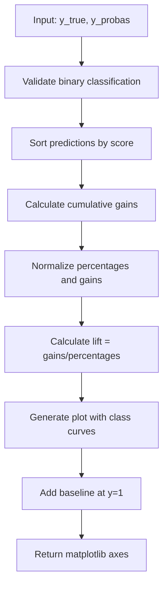
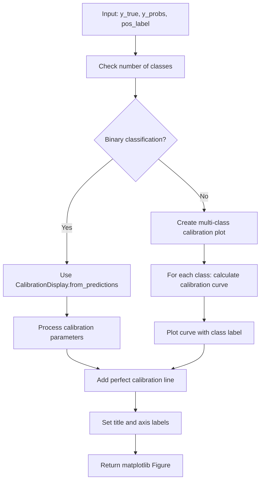
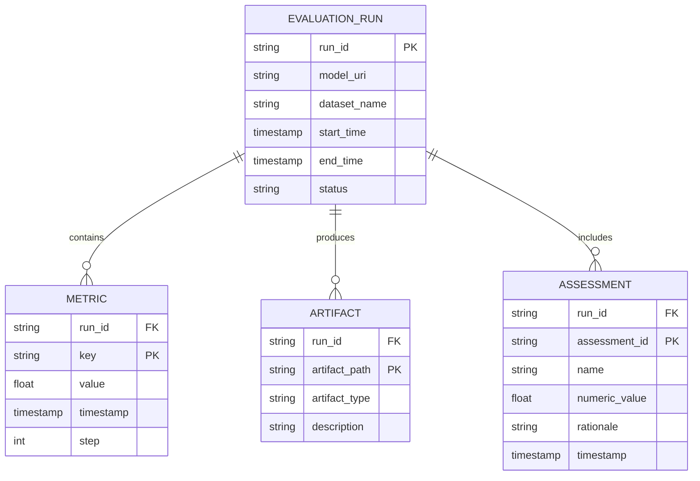
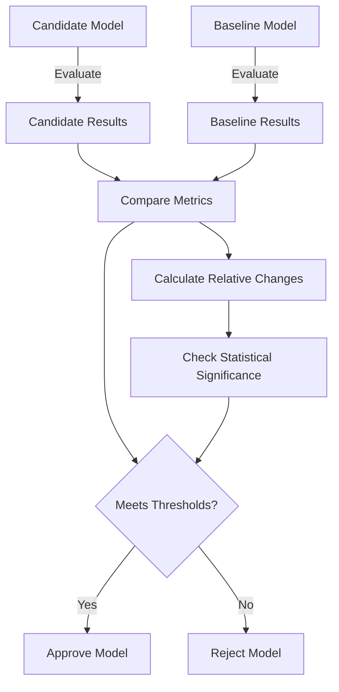
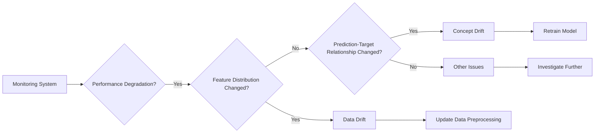

# Performance Monitoring

<cite>
**Referenced Files in This Document**   
- [lift_curve.py](file://mlflow/models/evaluation/lift_curve.py)
- [calibration_curve.py](file://mlflow/models/evaluation/calibration_curve.py)
- [validation.py](file://mlflow/models/evaluation/validation.py)
- [evaluate_with_model_validation.py](file://examples/evaluation/evaluate_with_model_validation.py)
- [evaluate_on_binary_classifier.py](file://examples/evaluation/evaluate_on_binary_classifier.py)
- [assessment.py](file://mlflow/evaluation/assessment.py)
- [evaluation.py](file://mlflow/evaluation/evaluation.py)
- [index.mdx](file://docs/docs/classic-ml/dataset/index.mdx)
</cite>

## Table of Contents
1. [Introduction](#introduction)
2. [Core Performance Monitoring Metrics](#core-performance-monitoring-metrics)
3. [Lift Curves Analysis](#lift-curves-analysis)
4. [Calibration Curves Analysis](#calibration-curves-analysis)
5. [Prediction Distribution Analysis](#prediction-distribution-analysis)
6. [Evaluation Runs and Artifact Relationships](#evaluation-runs-and-artifact-relationships)
7. [Model Version Comparison](#model-version-comparison)
8. [Performance Monitoring Configuration](#performance-monitoring-configuration)
9. [Establishing Performance Baselines](#establishing-performance-baselines)
10. [Concept Drift vs Data Drift](#concept-drift-vs-data-drift)
11. [Common Issues and Troubleshooting](#common-issues-and-troubleshooting)
12. [Integration with Production Systems](#integration-with-production-systems)

## Introduction

MLflow provides comprehensive performance monitoring capabilities that enable data scientists and machine learning engineers to track model performance over time and detect degradation. The system offers specialized tools for analyzing model behavior through various diagnostic plots and metrics, including lift curves, calibration curves, and prediction distribution analysis. These monitoring features are designed to work seamlessly with MLflow's experiment tracking system, allowing for systematic evaluation of model performance across different versions and deployment stages.

The performance monitoring framework in MLflow is built around the concept of evaluation runs, which capture not only standard metrics but also rich artifacts that provide deeper insights into model behavior. These evaluations can be configured to run automatically at specified intervals, enabling continuous monitoring of model performance in production environments. The system supports comparison across model versions, making it easier to identify when a model's performance has degraded below acceptable thresholds.

**Section sources**
- [index.mdx](file://docs/docs/classic-ml/dataset/index.mdx#L516-L594)

## Core Performance Monitoring Metrics

MLflow's performance monitoring system revolves around several key metrics and evaluation methods that provide comprehensive insights into model behavior. The framework supports both automated and custom metrics, allowing users to define specific performance criteria relevant to their use cases. At the core of the system are evaluation results that capture metrics, artifacts, and assessments from model evaluations.

The evaluation process generates a rich set of performance indicators that go beyond simple accuracy measurements. These include precision, recall, F1-score, and other domain-specific metrics that can be customized based on the problem type. The system also captures evaluation artifacts such as confusion matrices, ROC curves, and feature importance plots, which provide visual representations of model performance.

A critical component of the performance monitoring system is the ability to define validation thresholds for metrics. These thresholds can be absolute values or relative changes compared to baseline models, enabling sophisticated model validation strategies. The system supports both greater-is-better and lower-is-better metrics, with configurable thresholds for absolute and relative changes.

**Section sources**
- [evaluation.py](file://mlflow/evaluation/evaluation.py#L1-L412)
- [assessment.py](file://mlflow/evaluation/assessment.py#L1-L370)

## Lift Curves Analysis

Lift curves are a powerful diagnostic tool for evaluating the effectiveness of binary classifiers. MLflow implements lift curve analysis through the `plot_lift_curve` function in the evaluation module, which generates visualizations that help assess how much better a model performs compared to random selection. The lift curve shows the ratio of the response rate of the model to the overall response rate, plotted against the percentage of the population targeted.

The implementation follows standard practices from the scikit-plot package, ensuring consistency with established machine learning visualization techniques. The function takes true labels and predicted probabilities as inputs and generates a plot with two curves representing the lift for each class. A baseline curve at y=1 represents random selection, while curves above this line indicate better-than-random performance. The further the curve is above the baseline, the more effective the model is at identifying positive cases.

Lift curves are particularly valuable in business contexts where targeting resources efficiently is crucial. For example, in marketing campaigns, a high lift at low percentages indicates that the model can identify the most responsive customers with minimal outreach. This allows organizations to optimize their resource allocation by focusing on the segments most likely to respond positively.

**Diagram sources**
- [lift_curve.py](file://mlflow/models/evaluation/lift_curve.py#L70-L179)

## Calibration Curves Analysis

Calibration curves are essential for assessing the reliability of predicted probabilities from classification models. MLflow provides comprehensive support for calibration analysis through the `plot_calibration_curve` function, which visualizes how well predicted probabilities match actual probabilities. A well-calibrated model produces predicted probabilities that closely match the observed frequencies of positive outcomes.

The implementation supports both binary and multi-class classification scenarios. For binary classifiers, the function uses scikit-learn's CalibrationDisplay to generate the curve, plotting the mean predicted probability against the fraction of true positives. For multi-class problems, it creates a separate calibration curve for each class, allowing for detailed analysis of calibration across different categories.

Properly calibrated models are crucial in applications where decision thresholds matter, such as medical diagnosis or risk assessment. The calibration curve helps identify systematic biases in probability estimates, such as over-confidence (where predicted probabilities are higher than actual frequencies) or under-confidence (where predicted probabilities are lower than actual frequencies). This information can guide model selection and calibration techniques like Platt scaling or isotonic regression.

**Diagram sources**
- [calibration_curve.py](file://mlflow/models/evaluation/calibration_curve.py#L58-L110)

## Prediction Distribution Analysis

Prediction distribution analysis provides insights into how a model's predictions are distributed across different values or classes. This analysis helps identify potential issues such as prediction bias, over-concentration of predictions, or unexpected shifts in prediction patterns over time. MLflow captures prediction distributions as evaluation artifacts, allowing for systematic monitoring and comparison across model versions.

The analysis typically involves examining histograms or density plots of predicted probabilities or scores. For classification models, this reveals whether predictions are well-distributed across the probability spectrum or clustered at extreme values (0 or 1), which might indicate over-confidence. For regression models, it shows the range and concentration of predicted values, helping to identify potential outliers or distribution shifts.

Monitoring prediction distributions over time is particularly valuable for detecting model drift. Changes in the distribution might indicate that the underlying data distribution has changed (data drift) or that the relationship between features and target has evolved (concept drift). By establishing baseline distributions during model validation, organizations can set up automated alerts when prediction distributions deviate significantly from expected patterns.

**Section sources**
- [index.mdx](file://docs/docs/classic-ml/dataset/index.mdx#L704-L740)

## Evaluation Runs and Artifact Relationships

Evaluation runs in MLflow represent the execution of model evaluation processes and serve as containers for all evaluation artifacts and metrics. Each evaluation run captures a comprehensive snapshot of model performance at a specific point in time, including input data, predictions, targets, metrics, and assessment results. These runs form the foundation of performance monitoring by providing structured, versioned records of model behavior.

The relationship between evaluation runs and artifacts follows a hierarchical structure where each run generates multiple artifacts that provide different perspectives on model performance. Key artifacts include diagnostic plots (lift curves, calibration curves), statistical summaries, and assessment results from human or automated evaluators. These artifacts are stored alongside scalar metrics, creating a rich, multi-dimensional view of model performance.

Evaluation runs can be linked to specific model versions, allowing for direct comparison of performance across different iterations. They can also be associated with specific datasets or data slices, enabling targeted analysis of model behavior on particular segments of the data. This relationship structure supports sophisticated monitoring strategies, such as tracking performance on edge cases or monitoring specific demographic groups.

**Diagram sources**
- [evaluation.py](file://mlflow/evaluation/evaluation.py#L22-L203)
- [assessment.py](file://mlflow/evaluation/assessment.py#L17-L198)

## Model Version Comparison

MLflow enables systematic comparison of model performance across different versions through its evaluation and validation framework. This capability is essential for determining whether a new model version represents an improvement over the current production model or whether performance has degraded. The comparison process involves evaluating both the candidate and baseline models on the same test dataset and analyzing the differences in their performance metrics.

The system supports multiple comparison strategies, including absolute threshold validation and relative improvement requirements. For absolute thresholds, a model must achieve a minimum performance level on key metrics to be considered acceptable. For relative comparisons, the candidate model must show a specified minimum improvement over the baseline model, either in absolute terms (e.g., 0.05 higher accuracy) or relative terms (e.g., 10% improvement).

Model version comparison is particularly valuable in continuous integration/continuous deployment (CI/CD) pipelines for machine learning, where automated validation can prevent the deployment of models that fail to meet performance criteria. The framework also supports statistical significance testing to ensure that observed improvements are not due to random variation in the evaluation dataset.

**Diagram sources**
- [evaluate_with_model_validation.py](file://examples/evaluation/evaluate_with_model_validation.py#L31-L55)

## Performance Monitoring Configuration

MLflow provides flexible configuration options for setting up performance monitoring systems tailored to specific use cases and requirements. The configuration framework allows users to define monitoring frequency, establish performance baselines, set alert thresholds, and specify evaluation parameters. These configurations can be applied at different levels, from individual model evaluations to organization-wide monitoring policies.

Monitoring frequency can be configured based on various factors, including data update cycles, business requirements, and computational constraints. For high-stakes applications, monitoring might occur with each new batch of data, while for less critical systems, daily or weekly evaluations may suffice. The system supports both scheduled evaluations and event-triggered evaluations (e.g., when new data reaches a certain volume).

Alert thresholds can be configured using the MetricThreshold class, which supports multiple types of conditions: absolute thresholds, minimum absolute changes, and minimum relative changes. These thresholds can be combined to create sophisticated validation rules that ensure models meet multiple criteria before being approved for deployment. Configurations can also specify whether higher or lower metric values are preferred, accommodating different types of performance metrics.

**Section sources**
- [validation.py](file://mlflow/models/evaluation/validation.py#L54-L393)
- [evaluate_with_model_validation.py](file://examples/evaluation/evaluate_with_model_validation.py#L31-L55)

## Establishing Performance Baselines

Establishing meaningful performance baselines is a critical step in effective model monitoring. A performance baseline serves as a reference point against which future model versions and performance measurements are compared. MLflow supports several approaches to baseline establishment, including using previous production models, simple heuristic models, or models trained on historical data.

The choice of baseline depends on the specific use case and available resources. In production environments, the current model often serves as the baseline for evaluating new versions. For new projects without existing models, simple baselines like random guessing, majority class prediction, or rule-based systems can provide meaningful comparison points. The key is selecting a baseline that represents a reasonable minimum performance expectation.

When establishing baselines, it's important to consider the evaluation dataset and conditions. The baseline should be evaluated on the same data and under the same conditions as future models to ensure fair comparisons. MLflow's evaluation framework supports this by allowing users to specify the exact dataset and evaluation parameters used for baseline assessment, ensuring consistency across evaluations.

**Section sources**
- [evaluate_with_model_validation.py](file://examples/evaluation/evaluate_with_model_validation.py#L17-L19)
- [validation.py](file://mlflow/models/evaluation/validation.py#L380-L384)

## Concept Drift vs Data Drift

Distinguishing between concept drift and data drift is essential for effective model monitoring and maintenance. Data drift refers to changes in the input feature distribution over time, while concept drift refers to changes in the relationship between input features and the target variable. MLflow provides tools to detect and analyze both types of drift, enabling appropriate responses to each.

Data drift detection focuses on monitoring changes in feature distributions, such as shifts in mean, variance, or correlation structure. This can be caused by changes in data collection methods, population characteristics, or external factors affecting the input variables. MLflow's dataset monitoring capabilities can track statistical properties of features over time and alert when significant deviations from baseline distributions are detected.

Concept drift detection examines changes in model performance and prediction patterns that cannot be explained by changes in input distributions alone. This might indicate that the underlying relationship between features and target has changed, such as customer behavior evolving over time or market conditions shifting. MLflow's performance monitoring metrics, particularly those tracking prediction distributions and calibration, are valuable for identifying potential concept drift.

**Diagram sources**
- [index.mdx](file://docs/docs/classic-ml/dataset/index.mdx#L551-L569)

## Common Issues and Troubleshooting

Several common issues arise in performance monitoring that require careful attention and troubleshooting. One frequent challenge is establishing appropriate thresholds that balance sensitivity to real performance degradation with robustness to normal variation. Setting thresholds too tightly can result in excessive false alarms, while thresholds that are too loose may fail to detect meaningful degradation.

Another common issue is dealing with insufficient or biased evaluation data. Performance monitoring is only as reliable as the evaluation dataset, and using unrepresentative data can lead to misleading conclusions. MLflow addresses this by supporting evaluation on multiple data slices and encouraging the use of diverse, representative datasets for monitoring.

Interpreting conflicting signals from different metrics can also be challenging. A model might show improved accuracy but degraded calibration, or better overall performance but worse performance on critical subgroups. The comprehensive evaluation framework in MLflow helps address this by providing multiple perspectives on model performance, allowing for more nuanced decision-making.

**Section sources**
- [validation.py](file://mlflow/models/evaluation/validation.py#L47-L75)
- [test_validation.py](file://tests/evaluate/test_validation.py#L47-L713)

## Integration with Production Systems

Integrating MLflow's performance monitoring capabilities with production systems requires careful planning and implementation. The framework supports various integration patterns, from batch evaluation pipelines to real-time monitoring systems. In batch scenarios, evaluations can be scheduled to run periodically on accumulated data, providing regular performance reports.

For real-time monitoring, MLflow can be integrated with streaming data pipelines to evaluate model performance on incoming data. This allows for immediate detection of performance issues and faster response times. The system can be configured to trigger alerts or automated actions when performance thresholds are breached, enabling proactive maintenance of model quality.

Integration with CI/CD pipelines is particularly valuable, allowing performance monitoring to become part of the automated model deployment process. By incorporating evaluation and validation steps into the deployment pipeline, organizations can ensure that only models meeting performance criteria are promoted to production, reducing the risk of deploying degraded models.

**Section sources**
- [evaluate_with_model_validation.py](file://examples/evaluation/evaluate_with_model_validation.py#L62-L105)
- [evaluate_on_binary_classifier.py](file://examples/evaluation/evaluate_on_binary_classifier.py#L25-L37)