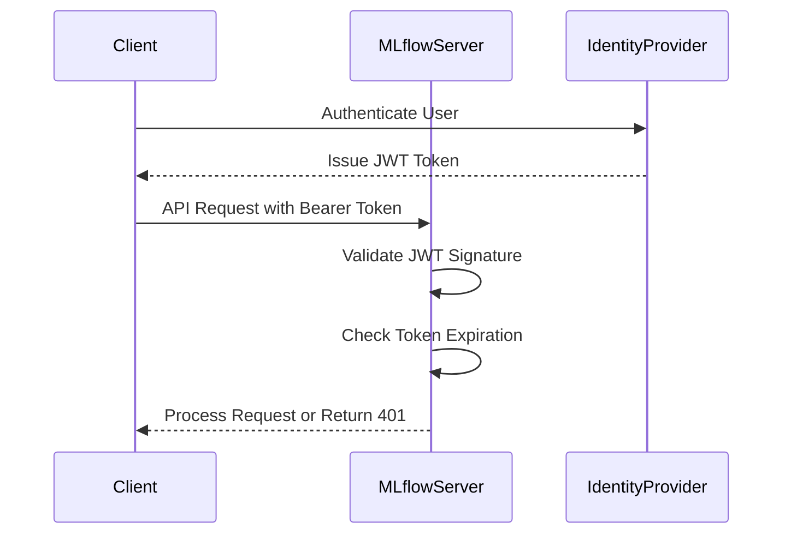
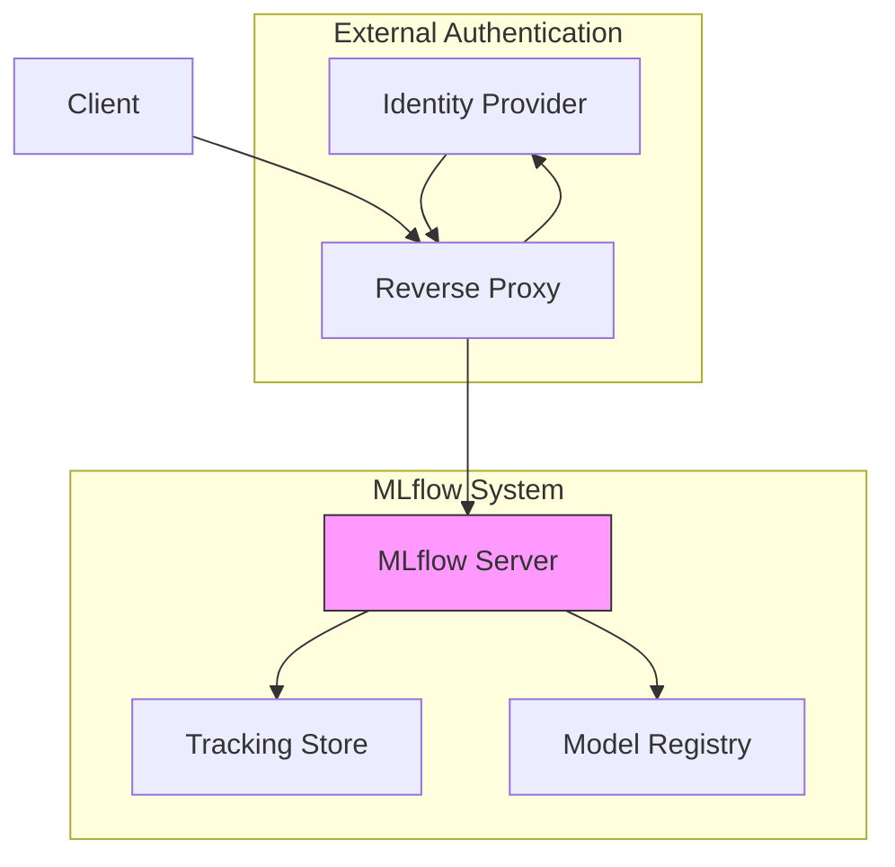
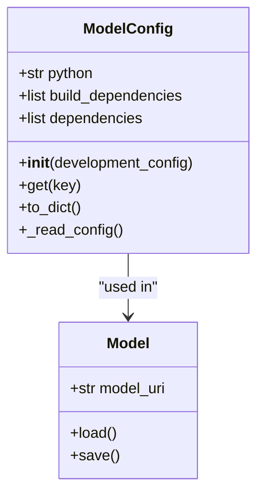
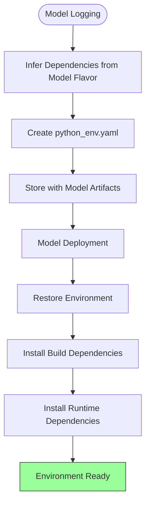
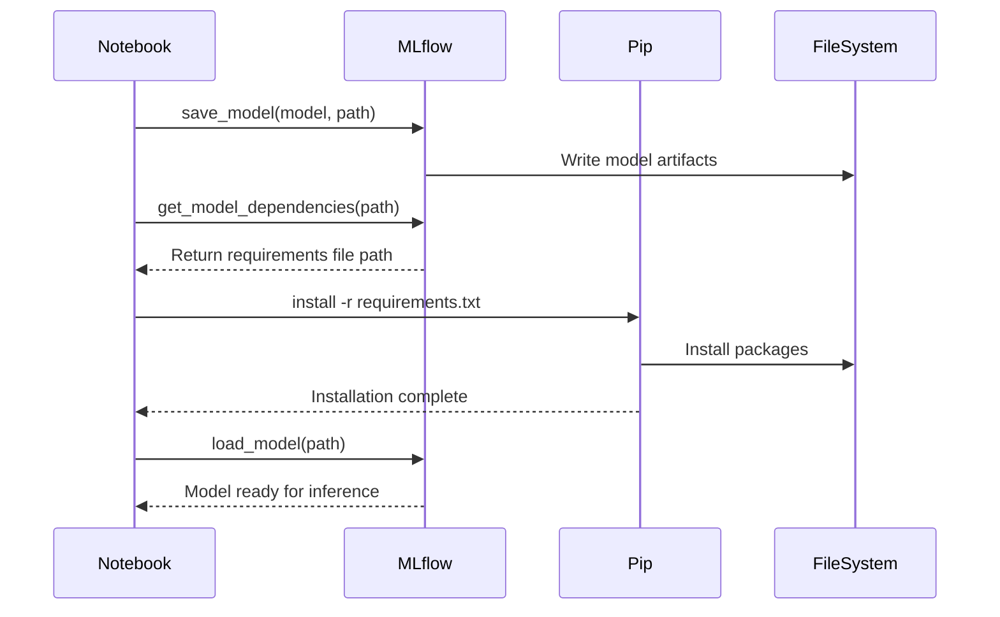
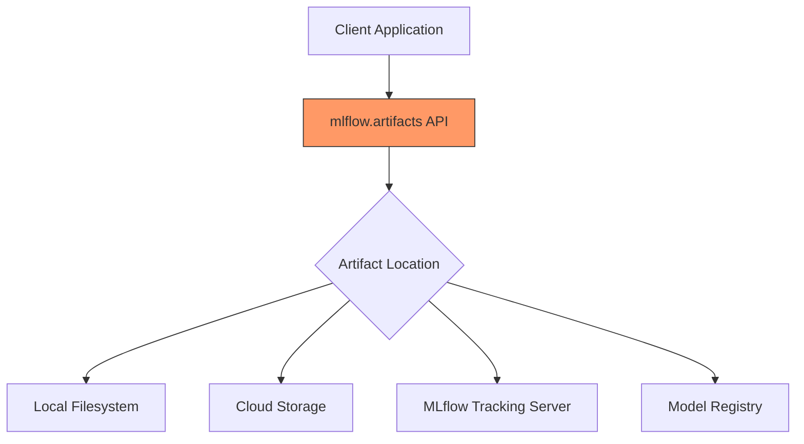

# Best Practices

<cite>
**Referenced Files in This Document**   
- [jwt_auth.py](file://examples/jwt_auth/jwt_auth.py)
- [security.py](file://mlflow/server/security.py)
- [__init__.py](file://mlflow/server/auth/__init__.py)
- [model_config.py](file://mlflow/models/model_config.py)
- [virtualenv.py](file://mlflow/utils/virtualenv.py)
- [environment.py](file://mlflow/utils/environment.py)
- [__init__.py](file://mlflow/artifacts/__init__.py)
- [SECURITY.md](file://SECURITY.md)
- [sso.mdx](file://docs/docs/self-hosting/security/sso.mdx)
- [index.mdx](file://docs/docs/classic-ml/model/dependencies/index.mdx)
- [restore_model_dependencies_example.ipynb](file://examples/restore_model_dependencies/restore_model_dependencies_example.ipynb)
- [python_env.yaml](file://examples/supply_chain_security/python_env.yaml)
- [train.py](file://examples/supply_chain_security/train.py)
</cite>

## Table of Contents
1. [Introduction](#introduction)
2. [Secure Authentication](#secure-authentication)
3. [Model Configuration Management](#model-configuration-management)
4. [Dependency Restoration](#dependency-restoration)
5. [Supply Chain Security](#supply-chain-security)
6. [Artifact Handling](#artifact-handling)
7. [Project Organization](#project-organization)
8. [Conclusion](#conclusion)

## Introduction

MLflow provides a comprehensive platform for managing the machine learning lifecycle, from experimentation to deployment. This document outlines best practices for optimal usage patterns and recommended approaches when working with MLflow. The practices described here ensure maintainable, secure, and reproducible ML workflows by addressing critical aspects such as secure authentication, proper model configuration management, dependency restoration, supply chain security, and artifact handling.

The guidance provided caters to both beginners seeking conceptual overviews and experienced developers requiring technical details. By following these best practices, organizations can avoid common pitfalls like hardcoded credentials, unversioned dependencies, and insecure artifact storage while implementing robust security measures throughout the ML lifecycle.

**Section sources**
- [SECURITY.md](file://SECURITY.md#L1-L34)

## Secure Authentication

### JWT Authentication Implementation

MLflow supports various authentication mechanisms, with JWT (JSON Web Tokens) being a recommended approach for production environments. The example implementation in `jwt_auth.py` demonstrates the basic structure of JWT authentication, though it explicitly warns that this implementation is "NOT SUITABLE FOR PRODUCTION USE" due to hardcoded keys and lack of proper user validation.

For production deployments, implement JWT authentication with secure key management practices:
- Use environment variables or secret management systems for storing secret keys
- Implement proper token validation and expiration checks
- Integrate with established identity providers (IdP) like Okta, Azure AD, or Google Workspace



**Diagram sources **
- [jwt_auth.py](file://examples/jwt_auth/jwt_auth.py#L1-L45)

### Server Authentication Configuration

MLflow's server authentication is implemented through Flask-based middleware that handles various authentication schemes. The authentication system provides comprehensive permission management for different MLflow resources including experiments, registered models, and scorers. Key features include:

- Role-based access control with permissions for read, update, delete, and manage operations
- Support for both Basic Auth and custom authentication modules
- Integration with external identity providers through proxy configuration

When deploying MLflow in production, consider using a reverse proxy (such as NGINX, Traefik, or cloud gateways) to handle authentication. This approach allows you to:
1. Configure your proxy to authenticate users against your IdP
2. After successful login, inject user identity headers (e.g., `X-Email` or `X-Forwarded-User`)
3. Run MLflow without Basic Auth and rely on the proxy as the enforcement layer

This pattern keeps MLflow stateless while delegating token validation and MFA enforcement to systems designed for these purposes.



**Diagram sources **
- [__init__.py](file://mlflow/server/auth/__init__.py#L1-L800)
- [sso.mdx](file://docs/docs/self-hosting/security/sso.mdx#L36-L42)

### Security Middleware

MLflow implements comprehensive security middleware to protect against common web vulnerabilities. The security middleware configures:
- Host header validation to prevent DNS rebinding attacks
- CORS (Cross-Origin Resource Sharing) protection
- Security headers including X-Content-Type-Options and X-Frame-Options

The middleware is automatically initialized when the MLflow server starts and can be configured through environment variables such as `MLFLOW_SERVER_DISABLE_SECURITY_MIDDLEWARE` and `MLFLOW_SERVER_X_FRAME_OPTIONS`. For enhanced security, ensure that:
- Allowed hosts are properly configured to prevent host header attacks
- CORS origins are restricted to trusted domains
- Security headers are properly set to prevent MIME type sniffing and clickjacking

**Section sources**
- [security.py](file://mlflow/server/security.py#L1-L116)

## Model Configuration Management

### Model Configuration with ModelConfig Class

MLflow provides the `ModelConfig` class for managing model-specific configurations. This class allows you to read YAML configuration files or dictionaries containing model parameters and settings. The `ModelConfig` class supports two modes of operation:

1. **Development mode**: Pass a `development_config` parameter containing either a path to a YAML file or a dictionary with configuration values
2. **Production mode**: Configuration is overridden when the model is logged, ensuring that the deployed model uses the configuration specified at logging time

The `ModelConfig` class provides methods for accessing configuration values:
- `get(key)`: Retrieves a top-level parameter value
- `to_dict()`: Returns the entire configuration as a dictionary
- `_read_config()`: Internal method that parses and returns the YAML content

When using `ModelConfig`, note that the `development_config` parameter is only used during development and is overridden when the model is logged. This ensures that the production model uses the configuration specified at logging time rather than any local development configuration.



**Diagram sources **
- [model_config.py](file://mlflow/models/model_config.py#L1-L151)

### Configuration Best Practices

To ensure secure and maintainable model configurations:
- Store configuration files in version control with appropriate access controls
- Use environment-specific configuration files for development, staging, and production
- Avoid storing sensitive information (credentials, API keys) directly in configuration files
- Use MLflow's parameter logging capabilities for hyperparameters and model settings
- Leverage the model registry to manage configuration changes across model versions

When logging models with configurations, explicitly pass the `model_config` parameter to ensure consistency between development and production environments. This approach prevents configuration drift and ensures that models are deployed with the intended settings.

**Section sources**
- [model_config.py](file://mlflow/models/model_config.py#L1-L151)

## Dependency Restoration

### Python Environment Management

MLflow provides robust mechanisms for managing Python environments through the `PythonEnv` class and associated utilities. The system supports multiple environment managers including virtualenv and uv, with uv being recommended for its performance advantages.

Key components of MLflow's dependency management system:
- `python_env.yaml`: Configuration file specifying Python version, build dependencies, and runtime dependencies
- Automatic dependency inference for supported model flavors
- Support for both conda and pip-based dependency specifications
- Environment isolation to prevent dependency conflicts

The `PythonEnv` class handles environment specification with the following attributes:
- `python`: Python version for the environment
- `build_dependencies`: Dependencies required before installing runtime dependencies
- `dependencies`: Runtime dependencies for the environment



**Diagram sources **
- [environment.py](file://mlflow/utils/environment.py#L75-L985)
- [virtualenv.py](file://mlflow/utils/virtualenv.py#L1-L471)

### Virtual Environment Creation

MLflow's virtual environment system creates isolated Python environments for model execution. The process involves:
1. Determining the required Python version from the model configuration
2. Installing the specified Python version using pyenv if necessary
3. Creating a virtual environment with virtualenv or uv
4. Installing dependencies in the isolated environment

The system includes security measures to prevent command injection attacks during dependency installation. Tests verify that malicious dependency specifications (using semicolons, pipes, or backticks) are properly blocked, preventing code execution vulnerabilities.

When restoring model dependencies, MLflow uses a temporary directory approach to handle models stored in read-only locations. The system attempts to create symbolic links to the model directory, falling back to copying if symlinks are not supported. This ensures compatibility with various deployment scenarios, including containerized environments and cloud storage mounts.

**Section sources**
- [virtualenv.py](file://mlflow/utils/virtualenv.py#L1-L471)

### Dependency Restoration Workflow

The recommended workflow for dependency restoration involves:
1. Using `mlflow.pyfunc.get_model_dependencies()` to extract dependency information from a model
2. Installing dependencies in an isolated environment before loading the model
3. Validating that all required packages are available before model execution

The `restore_model_dependencies_example.ipynb` demonstrates this workflow by:
- Saving a scikit-learn model with `mlflow.sklearn.save_model()`
- Extracting dependencies with `mlflow.pyfunc.get_model_dependencies()`
- Installing dependencies with pip
- Loading and using the model in the restored environment

This approach ensures reproducibility by recreating the exact environment used during model training, preventing "it works on my machine" issues in production.



**Diagram sources **
- [restore_model_dependencies_example.ipynb](file://examples/restore_model_dependencies/restore_model_dependencies_example.ipynb#L1-L109)
- [environment.py](file://mlflow/utils/environment.py#L75-L985)

## Supply Chain Security

### Secure Dependency Management

MLflow implements several security measures to protect against supply chain attacks:
- Input validation for dependency specifications to prevent command injection
- Isolated dependency installation environments
- Comprehensive testing for security vulnerabilities

The system specifically blocks command injection attempts through various shell metacharacters:
- Semicolons (`;`)
- Pipes (`|`)
- Backticks (`` ` ``)
- Other shell operators

These protections are verified through unit tests that attempt to execute malicious commands during dependency installation. If any injection attempt succeeds, the tests fail, ensuring that the security measures remain effective.

When specifying dependencies in `python_env.yaml`, follow these best practices:
- Pin dependency versions explicitly to prevent unexpected updates
- Use trusted package indexes
- Regularly audit dependencies for known vulnerabilities
- Consider using dependency lock files for reproducible builds

```yaml
python: "3.10"
build_dependencies:
  - pip
dependencies:
  - numpy==1.24.3
  - pandas==2.0.3
  - scikit-learn==1.3.0
  - mlflow==2.9.0
```

**Section sources**
- [python_env.yaml](file://examples/supply_chain_security/python_env.yaml#L1-L10)
- [train.py](file://examples/supply_chain_security/train.py#L1-L27)
- [test_container.py](file://tests/models/test_container.py#L53-L233)

### Model Signing and Verification

While not explicitly implemented in the provided code, supply chain security best practices recommend:
- Digitally signing models before registration
- Verifying model signatures before deployment
- Implementing a chain of trust from development to production
- Using trusted registries with access controls

Organizations should integrate MLflow with their existing software supply chain security practices, including:
- Static analysis of model code
- Vulnerability scanning of dependencies
- Digital signatures for model artifacts
- Immutable model registries

The model registry should be configured with appropriate permissions to prevent unauthorized modifications, ensuring that only approved models can be deployed to production environments.

**Section sources**
- [SECURITY.md](file://SECURITY.md#L1-L34)

## Artifact Handling

### Artifact Storage and Retrieval

MLflow provides comprehensive APIs for interacting with artifacts through the `mlflow.artifacts` module. The system supports multiple artifact storage backends including:
- Local filesystem
- Cloud storage (S3, GCS, Azure Blob Storage)
- MLflow tracking server
- Model registry

The artifact APIs support various operations:
- `download_artifacts()`: Download artifacts to a local directory
- `list_artifacts()`: List artifacts at a specified URI
- `load_text()`: Load text artifacts as strings
- `load_dict()`: Load JSON artifacts as dictionaries
- `load_image()`: Load image artifacts as PIL Image objects

Artifact URIs follow standardized formats:
- `runs:/<run_id>/<path>`: Artifacts from MLflow runs
- `models:/<model_name>/<stage>`: Registered models by stage
- `models:/<model_name>/<version>`: Registered models by version
- Cloud storage URIs (s3://, gs://, etc.)



**Diagram sources **
- [__init__.py](file://mlflow/artifacts/__init__.py#L1-L273)

### Secure Artifact Practices

To ensure secure artifact handling:
- Configure artifact storage with appropriate access controls
- Use encrypted storage for sensitive model artifacts
- Implement retention policies to manage storage costs
- Monitor artifact access patterns for suspicious activity
- Use signed URLs for temporary access to artifacts

When working with artifacts, always validate artifact URIs and handle errors appropriately. The artifact system includes comprehensive error handling for invalid URIs, missing artifacts, and permission issues.

For production deployments, consider using a dedicated artifact storage solution with:
- High availability and durability guarantees
- Access logging and monitoring
- Integration with your organization's identity and access management system
- Data encryption at rest and in transit

**Section sources**
- [__init__.py](file://mlflow/artifacts/__init__.py#L1-L273)

## Project Organization

### Recommended Project Structure

Organize MLflow projects with a clear structure that separates concerns and facilitates collaboration:
```
project/
├── src/                    # Source code
├── notebooks/             # Jupyter notebooks for exploration
├── models/                # Model definitions and configurations
├── configs/               # Configuration files
├── data/                  # Data processing scripts
└── MLproject              # MLflow project specification
```

The `MLproject` file should specify:
- Project name
- Environment configuration (python_env.yaml or conda.yaml)
- Entry points with their commands
- Parameters and their default values

Use version control to track changes to models, configurations, and code. Implement branching strategies that support experimentation while maintaining stability in production models.

### Configuration Management

Centralize configuration management using MLflow's built-in capabilities:
- Use `python_env.yaml` for Python environment specifications
- Store hyperparameters as MLflow parameters
- Log metrics and artifacts for reproducibility
- Use the model registry to manage model versions and stages

Implement configuration hierarchies where appropriate:
- Base configurations for common settings
- Environment-specific overrides (development, staging, production)
- Experiment-specific configurations

This approach ensures consistency while allowing necessary flexibility for different use cases.

**Section sources**
- [MLproject](file://examples/supply_chain_security/MLproject#L1-L5)
- [python_env.yaml](file://examples/supply_chain_security/python_env.yaml#L1-L10)

## Conclusion

Implementing these best practices ensures that your MLflow deployments are maintainable, secure, and reproducible. By following the recommended approaches for authentication, configuration management, dependency restoration, supply chain security, and artifact handling, organizations can build robust ML workflows that scale effectively from experimentation to production.

Key takeaways include:
- Use secure authentication mechanisms and avoid hardcoded credentials
- Manage model configurations explicitly and consistently
- Restore dependencies in isolated environments to ensure reproducibility
- Protect against supply chain attacks through input validation and dependency pinning
- Handle artifacts securely with appropriate access controls and encryption
- Organize projects with clear structures and version control

By adhering to these practices, teams can avoid common pitfalls and build ML systems that are reliable, secure, and maintainable over time.