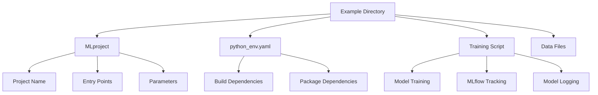
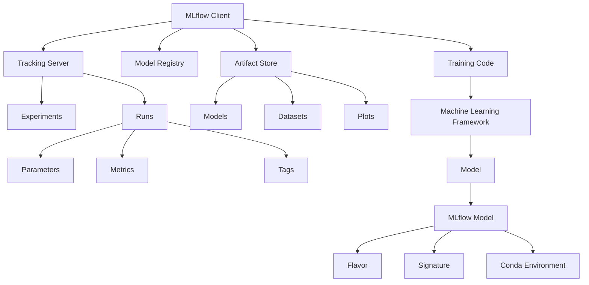
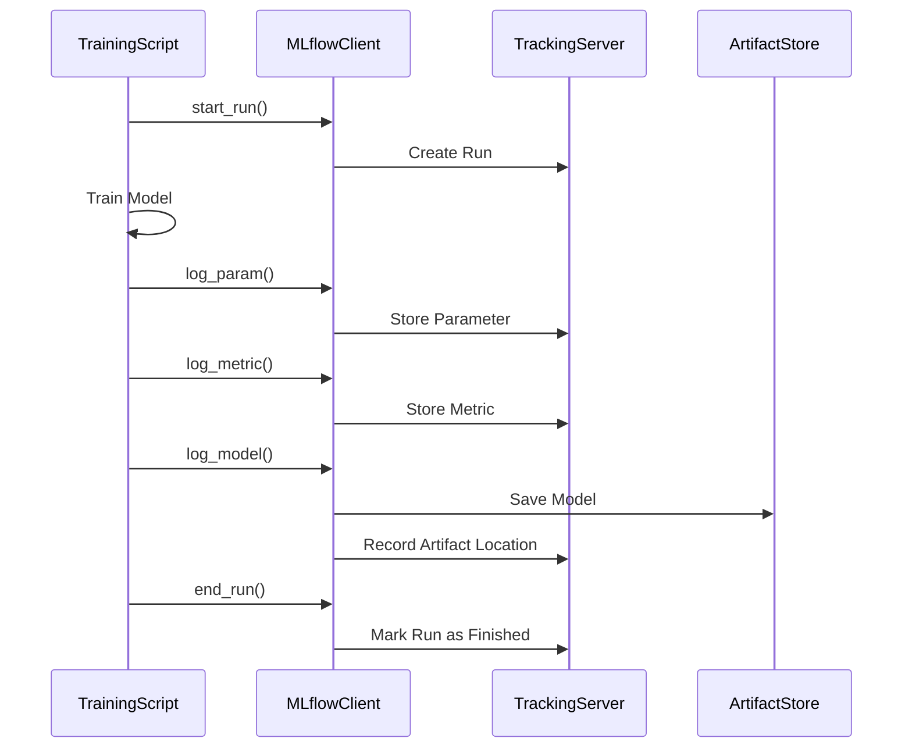
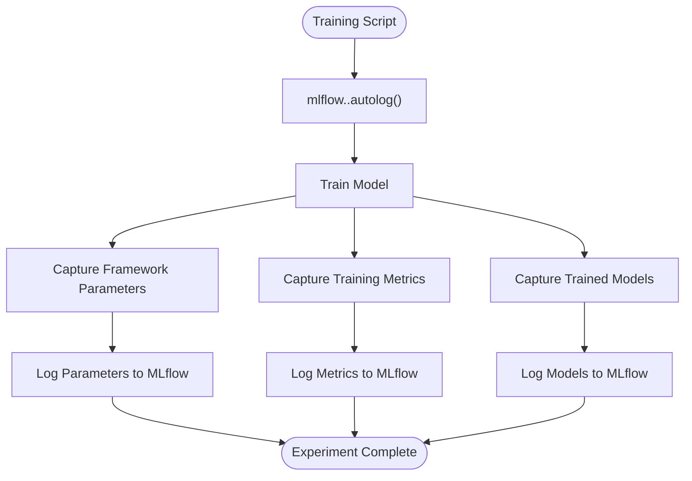
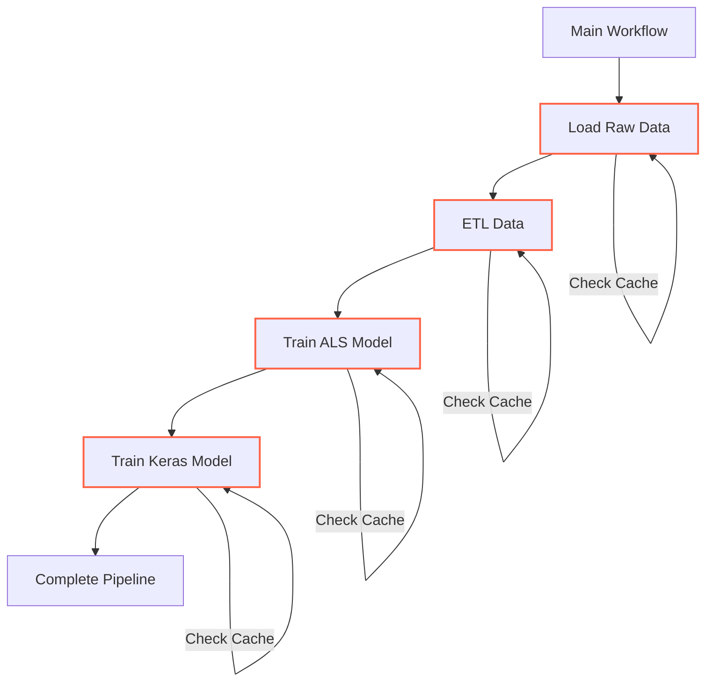
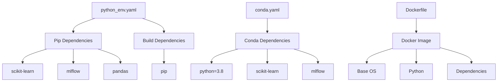

# Complete Examples

<cite>
**Referenced Files in This Document**   
- [MLproject](file://examples/sklearn_elasticnet_wine/MLproject)
- [python_env.yaml](file://examples/sklearn_elasticnet_wine/python_env.yaml)
- [train.py](file://examples/sklearn_elasticnet_wine/train.py)
- [train.py](file://examples/tensorflow/train.py)
- [train.py](file://examples/xgboost/xgboost_native/train.py)
- [train.py](file://examples/lightgbm/lightgbm_sklearn/train.py)
- [train.py](file://examples/keras/train.py)
- [grid_search_cv.py](file://examples/sklearn_autolog/grid_search_cv.py)
- [main.py](file://examples/multistep_workflow/main.py)
- [train.py](file://examples/docker/train.py)
</cite>

## Table of Contents
1. [Introduction](#introduction)
2. [Project Structure](#project-structure)
3. [Core Components](#core-components)
4. [Architecture Overview](#architecture-overview)
5. [Detailed Component Analysis](#detailed-component-analysis)
6. [Dependency Analysis](#dependency-analysis)
7. [Performance Considerations](#performance-considerations)
8. [Troubleshooting Guide](#troubleshooting-guide)
9. [Conclusion](#conclusion)

## Introduction
This document provides comprehensive coverage of complete examples demonstrating end-to-end machine learning workflows using MLflow with various machine learning frameworks. The examples showcase full lifecycle management from model training to logging and artifact storage, illustrating how MLflow enables reproducible and trackable machine learning experiments. These examples serve as practical guides for both beginners learning MLflow concepts and experienced developers implementing advanced features in production environments.

The examples cover a wide range of machine learning frameworks including scikit-learn, TensorFlow, Keras, XGBoost, LightGBM, and others, demonstrating consistent patterns for experiment tracking, model logging, and artifact management. Each example follows MLflow's conventions for project structure, configuration, and code organization, providing a standardized approach to machine learning workflow management.

## Project Structure
The MLflow examples follow a consistent directory structure that enables reproducible and shareable machine learning projects. Each example is organized as a self-contained directory with configuration files, training scripts, and data assets. The structure supports both simple and complex workflows, from basic model training to multi-step pipelines.

**Diagram sources**
- [MLproject](file://examples/sklearn_elasticnet_wine/MLproject)
- [python_env.yaml](file://examples/sklearn_elasticnet_wine/python_env.yaml)
- [train.py](file://examples/sklearn_elasticnet_wine/train.py)

**Section sources**
- [MLproject](file://examples/sklearn_elasticnet_wine/MLproject)
- [python_env.yaml](file://examples/sklearn_elasticnet_wine/python_env.yaml)
- [train.py](file://examples/sklearn_elasticnet_wine/train.py)

## Core Components
The MLflow examples demonstrate several core components that form the foundation of end-to-end machine learning workflows. These components include experiment tracking, model logging, artifact storage, and project management. The examples show how to use MLflow's API to log parameters, metrics, models, and artifacts during the training process.

The core components are implemented consistently across different machine learning frameworks, demonstrating MLflow's framework-agnostic design. Each example shows how to start a run, log parameters and metrics, and save models with signatures for production deployment. The examples also demonstrate advanced features like model registry integration and conditional model registration based on the tracking store type.

**Section sources**
- [train.py](file://examples/sklearn_elasticnet_wine/train.py)
- [train.py](file://examples/tensorflow/train.py)
- [train.py](file://examples/xgboost/xgboost_native/train.py)

## Architecture Overview
The architecture of MLflow examples follows a standardized pattern that enables reproducible and trackable machine learning experiments. The architecture consists of several interconnected components that work together to manage the machine learning lifecycle.

**Diagram sources**
- [train.py](file://examples/sklearn_elasticnet_wine/train.py)
- [train.py](file://examples/tensorflow/train.py)

## Detailed Component Analysis

### Model Training and Tracking
The model training and tracking component demonstrates how to integrate MLflow with various machine learning frameworks to automatically log parameters, metrics, and models. The examples show both manual logging and autologging approaches, highlighting the benefits of each method.

**Diagram sources**
- [train.py](file://examples/sklearn_elasticnet_wine/train.py)
- [train.py](file://examples/tensorflow/train.py)

**Section sources**
- [train.py](file://examples/sklearn_elasticnet_wine/train.py)
- [train.py](file://examples/tensorflow/train.py)

### Autologging Integration
The autologging integration component demonstrates how MLflow can automatically capture parameters, metrics, and models from various machine learning frameworks without requiring explicit logging calls. This feature significantly reduces the amount of code needed to track experiments while ensuring comprehensive logging.

**Diagram sources**
- [train.py](file://examples/xgboost/xgboost_native/train.py)
- [train.py](file://examples/lightgbm/lightgbm_sklearn/train.py)
- [train.py](file://examples/keras/train.py)

**Section sources**
- [train.py](file://examples/xgboost/xgboost_native/train.py)
- [train.py](file://examples/lightgbm/lightgbm_sklearn/train.py)
- [train.py](file://examples/keras/train.py)

### Multi-step Workflows
The multi-step workflow component demonstrates how to orchestrate complex machine learning pipelines using MLflow Projects. This includes data preparation, feature engineering, model training, and evaluation steps that can be executed in sequence with proper dependency management.

**Diagram sources**
- [main.py](file://examples/multistep_workflow/main.py)

**Section sources**
- [main.py](file://examples/multistep_workflow/main.py)

## Dependency Analysis
The MLflow examples demonstrate a consistent approach to managing dependencies through configuration files. The dependency management system supports multiple environment types, allowing users to choose the most appropriate option for their use case.

**Diagram sources**
- [python_env.yaml](file://examples/sklearn_elasticnet_wine/python_env.yaml)
- [MLproject](file://examples/sklearn_elasticnet_wine/MLproject)

**Section sources**
- [python_env.yaml](file://examples/sklearn_elasticnet_wine/python_env.yaml)
- [MLproject](file://examples/sklearn_elasticnet_wine/MLproject)

## Performance Considerations
The MLflow examples are designed with performance considerations in mind, particularly for large-scale machine learning workflows. The examples demonstrate efficient data handling, memory management, and logging practices that minimize overhead while maximizing the value of tracked information.

The autologging feature is particularly important for performance, as it reduces the amount of custom logging code while ensuring comprehensive tracking. The examples also show how to use step-based metric logging for iterative algorithms, which provides detailed training progress information without overwhelming the tracking server.

The multi-step workflow example demonstrates performance optimization through caching and reuse of intermediate results. This prevents redundant computation when running similar experiments, significantly reducing execution time and resource consumption.

**Section sources**
- [train.py](file://examples/tensorflow/train.py)
- [main.py](file://examples/multistep_workflow/main.py)

## Troubleshooting Guide
When working with MLflow examples, several common issues may arise. This section provides guidance for troubleshooting these issues and ensuring successful execution of the examples.

Common issues include dependency conflicts, tracking server connectivity problems, and model serialization errors. The examples use explicit dependency specifications in python_env.yaml or conda.yaml files to minimize dependency conflicts. When encountering dependency issues, verify that the environment is properly created and activated before running the examples.

For tracking server connectivity issues, ensure that the MLflow tracking URI is correctly configured and accessible. The examples typically use the default local tracking server, but can be configured to use remote servers for collaborative environments.

Model serialization errors may occur when saving models with complex dependencies. The examples demonstrate best practices for model saving, including using appropriate flavors and including necessary dependencies in the model environment specification.

**Section sources**
- [train.py](file://examples/sklearn_elasticnet_wine/train.py)
- [train.py](file://examples/tensorflow/train.py)
- [train.py](file://examples/docker/train.py)

## Conclusion
The MLflow examples provide comprehensive demonstrations of end-to-end machine learning workflows across various frameworks. These examples illustrate the core principles of experiment tracking, model management, and reproducible research that are essential for modern machine learning development.

The consistent structure and patterns demonstrated in these examples make it easy to adapt them to new projects and use cases. By following the patterns shown in these examples, developers can quickly implement robust machine learning workflows that are trackable, reproducible, and deployable.

The examples cover a wide range of complexity, from simple model training scripts to multi-step pipelines, providing a learning progression for users at different skill levels. The integration of autologging features with various machine learning frameworks demonstrates MLflow's commitment to reducing the overhead of experiment tracking while maximizing the value of captured information.