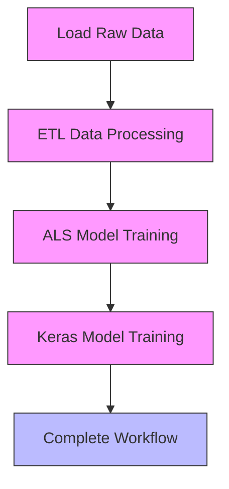
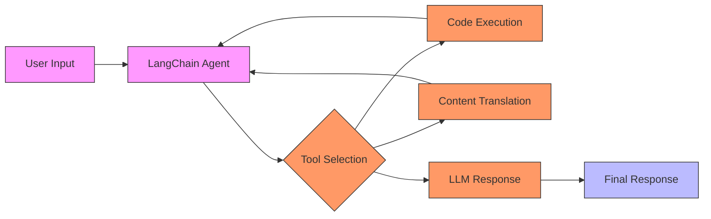

# Examples and Tutorials

<cite>
**Referenced Files in This Document**   
- [examples/README.md](file://examples/README.md)
- [examples/demos/pythonmodel_agent_with_uc_tools.ipynb](file://examples/demos/pythonmodel_agent_with_uc_tools.ipynb)
- [examples/demos/pythonmodel_type_hints_quickstart.ipynb](file://examples/demos/pythonmodel_type_hints_quickstart.ipynb)
- [examples/deployments/README.md](file://examples/deployments/README.md)
- [examples/docker/train.py](file://examples/docker/train.py)
- [examples/multistep_workflow/main.py](file://examples/multistep_workflow/main.py)
- [examples/hyperparam/train.py](file://examples/hyperparam/train.py)
- [examples/llms/README.md](file://examples/llms/README.md)
- [examples/evaluation/README.md](file://examples/evaluation/README.md)
- [examples/llms/summarization/summarization.py](file://examples/llms/summarization/summarization.py)
- [examples/evaluation/evaluate_on_binary_classifier.py](file://examples/evaluation/evaluate_on_binary_classifier.py)
- [examples/supply_chain_security/train.py](file://examples/supply_chain_security/train.py)
- [examples/quickstart/mlflow_tracking.py](file://examples/quickstart/mlflow_tracking.py)
- [examples/r_wine/train.R](file://examples/r_wine/train.R)
</cite>

## Table of Contents
1. [Introduction](#introduction)
2. [Learning Progression](#learning-progression)
3. [Project Structure and Configuration](#project-structure-and-configuration)
4. [Core Example Categories](#core-example-categories)
5. [End-to-End ML Workflows](#end-to-end-ml-workflows)
6. [LLM Application Development](#llm-application-development)
7. [Hyperparameter Tuning](#hyperparameter-tuning)
8. [Model Deployment Scenarios](#model-deployment-scenarios)
9. [Evaluation and Validation](#evaluation-and-validation)
10. [Advanced Security Practices](#advanced-security-practices)
11. [Cross-Language Implementation](#cross-language-implementation)
12. [Conclusion](#conclusion)

## Introduction
The MLflow examples and tutorials repository provides a comprehensive collection of practical implementations that demonstrate the platform's capabilities across various machine learning domains. These examples serve as both educational resources for beginners and reference implementations for experienced developers, showcasing best practices in experiment tracking, model management, and deployment. The repository contains a diverse set of examples ranging from basic tracking demonstrations to complex end-to-end workflows involving large language models (LLMs) and multi-step pipelines. Each example is designed to illustrate specific MLflow features while maintaining real-world applicability, making them valuable resources for understanding how to effectively use MLflow in production ML systems.

**Section sources**
- [examples/README.md](file://examples/README.md)

## Learning Progression
The examples follow a structured learning progression from basic to advanced concepts, enabling users to gradually build their understanding of MLflow's capabilities. The progression begins with the quickstart example that introduces fundamental tracking concepts, then moves to domain-specific implementations, and finally advances to complex, integrated workflows. Beginners start with simple parameter and metric logging in the quickstart example, then progress to understanding project packaging with conda environments in examples like sklearn_elasticnet_wine_quality. Intermediate users explore specialized domains such as hyperparameter tuning and model evaluation, while advanced users engage with complex scenarios involving LLMs, multi-step workflows, and secure deployment practices. This structured approach ensures that users can build their expertise incrementally, with each example reinforcing concepts from previous ones while introducing new capabilities.

**Section sources**
- [examples/README.md](file://examples/README.md)
- [examples/quickstart/mlflow_tracking.py](file://examples/quickstart/mlflow_tracking.py)

## Project Structure and Configuration
The MLflow examples follow a consistent project structure that emphasizes reproducibility and ease of use. Each example typically includes an MLproject file that defines the project configuration, specifying entry points, parameters, and environment dependencies. The python_env.yaml or conda.yaml files define the required Python packages and dependencies for each project, ensuring consistent execution environments across different systems. Configuration patterns vary based on the use case, with simpler examples using basic conda environments while more complex ones leverage Docker for dependency management. The multistep_workflow example demonstrates a sophisticated project structure with multiple entry points and interdependent steps, showcasing how MLflow can manage complex pipelines through its project specification format.

**Section sources**
- [examples/README.md](file://examples/README.md)
- [examples/docker/train.py](file://examples/docker/train.py)
- [examples/multistep_workflow/main.py](file://examples/multistep_workflow/main.py)

## Core Example Categories
The repository organizes examples into distinct categories based on their primary focus and use case. These categories include basic tracking examples, domain-specific implementations (such as h2o, keras, and pytorch), workflow management examples, and specialized use cases like supply chain security. Each category serves a specific purpose in demonstrating MLflow's versatility across different ML domains and requirements. The examples range from simple single-script implementations to complex multi-file projects, providing users with a comprehensive view of how MLflow can be applied in various contexts. This categorization helps users quickly identify relevant examples for their specific needs, whether they are working with traditional ML models, deep learning frameworks, or LLM applications.

**Section sources**
- [examples/README.md](file://examples/README.md)

## End-to-End ML Workflows
The multistep_workflow example provides a comprehensive demonstration of an end-to-end machine learning pipeline built as an MLflow project. This example illustrates how to structure a complete data science workflow, from data extraction and transformation to model training and evaluation. The workflow consists of multiple interconnected steps, including data loading, ETL processing, ALS model training, and Keras neural network training, with each step represented as a separate entry point in the MLproject file. The implementation uses a caching mechanism to avoid re-running completed steps, improving efficiency during development and experimentation. This example showcases how MLflow can manage complex dependencies between pipeline components and maintain reproducibility across the entire workflow.

**Diagram sources**
- [examples/multistep_workflow/main.py](file://examples/multistep_workflow/main.py)

## LLM Application Development
The LLM examples demonstrate how to build and manage applications using large language models within the MLflow ecosystem. The summarization and question answering examples showcase prompt engineering techniques and model evaluation for LLMs, while the PythonModel with type hints examples illustrate how to create robust LLM applications with input validation. These examples leverage MLflow's langchain and openai flavors to package and log LLM-based models, enabling seamless integration with the MLflow tracking and registry systems. The demos directory contains advanced examples that combine LLMs with Unity Catalog functions as tools, demonstrating how to build agents that can execute code and translate content. These implementations highlight MLflow's capabilities in managing the unique challenges of LLM development, including prompt versioning, model evaluation, and deployment.

**Diagram sources**
- [examples/demos/pythonmodel_agent_with_uc_tools.ipynb](file://examples/demos/pythonmodel_agent_with_uc_tools.ipynb)
- [examples/llms/summarization/summarization.py](file://examples/llms/summarization/summarization.py)

## Hyperparameter Tuning
The hyperparam example demonstrates how to perform hyperparameter tuning with MLflow and popular optimization libraries. This example trains a Keras deep learning model on the wine quality dataset, using MLflow to track different hyperparameter configurations and their corresponding performance metrics. The implementation includes a custom MlflowCheckpoint callback that logs metrics during training and automatically saves the best model based on validation performance. By logging both training and validation metrics at each epoch, this example enables comprehensive comparison of different hyperparameter settings and training trajectories. The use of MLflow's parameter logging functionality allows for easy identification of optimal hyperparameter combinations, facilitating model selection and optimization.

**Section sources**
- [examples/hyperparam/train.py](file://examples/hyperparam/train.py)

## Model Deployment Scenarios
The deployments directory provides examples of how to deploy MLflow models in various environments, with a focus on Databricks integration. These examples demonstrate the process of packaging models, configuring deployment targets, and managing model serving infrastructure. The docker example illustrates how to create and run an MLflow project using Docker instead of conda for dependency management, showcasing containerized deployment scenarios. The implementation includes Kubernetes configuration files and job templates, highlighting how MLflow can integrate with container orchestration systems. These examples provide practical guidance on deploying models in production environments, addressing challenges such as environment consistency, scalability, and monitoring.

**Section sources**
- [examples/deployments/README.md](file://examples/deployments/README.md)
- [examples/docker/train.py](file://examples/docker/train.py)

## Evaluation and Validation
The evaluation examples demonstrate how to use MLflow's evaluation API to assess model performance and validate model quality. These examples cover various model types, including binary classifiers, multiclass classifiers, and regressors, showing how to evaluate models on different datasets using built-in and custom metrics. The evaluate_with_model_validation example illustrates how to set validation thresholds for model metrics, enabling automated quality checks during the model development process. By logging evaluation results to MLflow Tracking, these examples enable comparison of different models and configurations, facilitating data-driven model selection. The use of comprehensive evaluation metrics helps ensure that models meet performance requirements before deployment.

**Section sources**
- [examples/evaluation/README.md](file://examples/evaluation/README.md)
- [examples/evaluation/evaluate_on_binary_classifier.py](file://examples/evaluation/evaluate_on_binary_classifier.py)

## Advanced Security Practices
The supply_chain_security example demonstrates how to strengthen the security of ML projects against supply-chain attacks by enforcing hash checks on Python packages. This example shows how to use explicit model logging to control the conda environment and pip requirements, ensuring that only approved package versions are used in the model environment. By disabling autologging and manually specifying dependencies, this approach provides greater control over the model's execution environment and reduces the risk of vulnerabilities from third-party packages. This practice is particularly important in production environments where security and reproducibility are critical requirements.

**Section sources**
- [examples/supply_chain_security/train.py](file://examples/supply_chain_security/train.py)

## Cross-Language Implementation
The repository includes examples that demonstrate MLflow's capabilities across different programming languages, with a notable example in R. The r_wine example shows how to use MLflow from R to log parameters, metrics, and models, providing a complete workflow for ML experimentation in the R language. This example uses the mlflow R package to track an elastic net model trained on the wine quality dataset, demonstrating how MLflow's tracking functionality is consistent across languages. The implementation includes parameter logging, metric tracking, and model serialization, showing that the core MLflow concepts are applicable regardless of the programming language being used. This cross-language support enables teams to use MLflow in heterogeneous environments where different team members may prefer different languages.

**Section sources**
- [examples/r_wine/train.R](file://examples/r_wine/train.R)

## Conclusion
The MLflow examples and tutorials repository provides a comprehensive set of practical implementations that demonstrate the platform's capabilities across various machine learning domains. From basic tracking demonstrations to complex end-to-end workflows involving large language models and multi-step pipelines, these examples serve as valuable resources for understanding how to effectively use MLflow in production ML systems. The structured learning progression, consistent project organization, and diverse range of use cases make these examples accessible to users of all skill levels, from beginners learning the basics of experiment tracking to advanced users implementing sophisticated ML workflows. By following the patterns and best practices demonstrated in these examples, users can leverage MLflow to improve the reproducibility, scalability, and reliability of their machine learning projects.