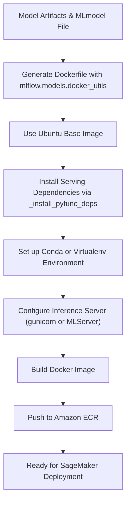
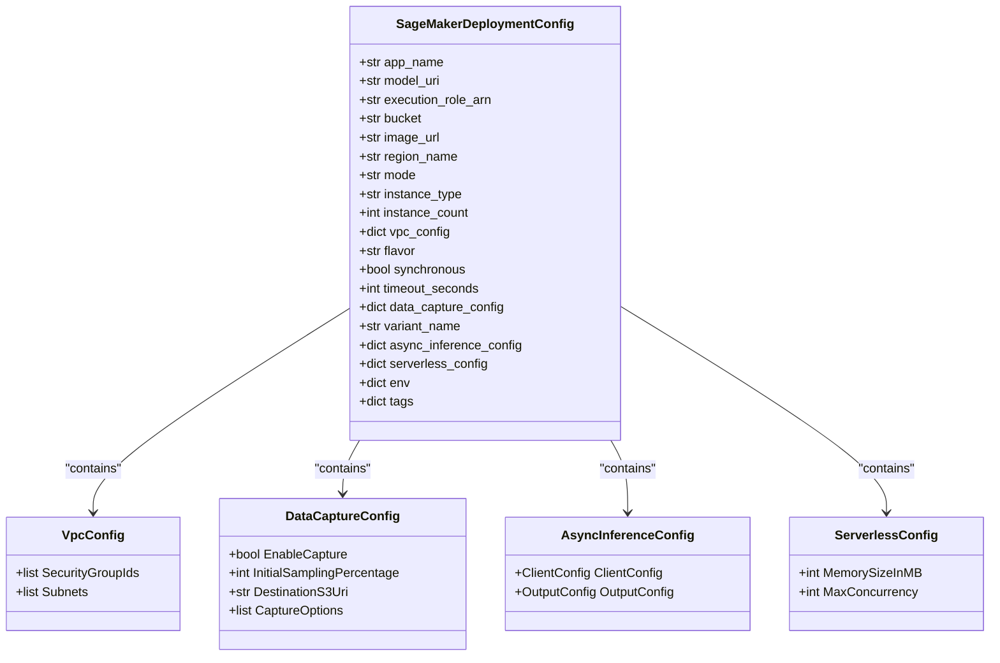
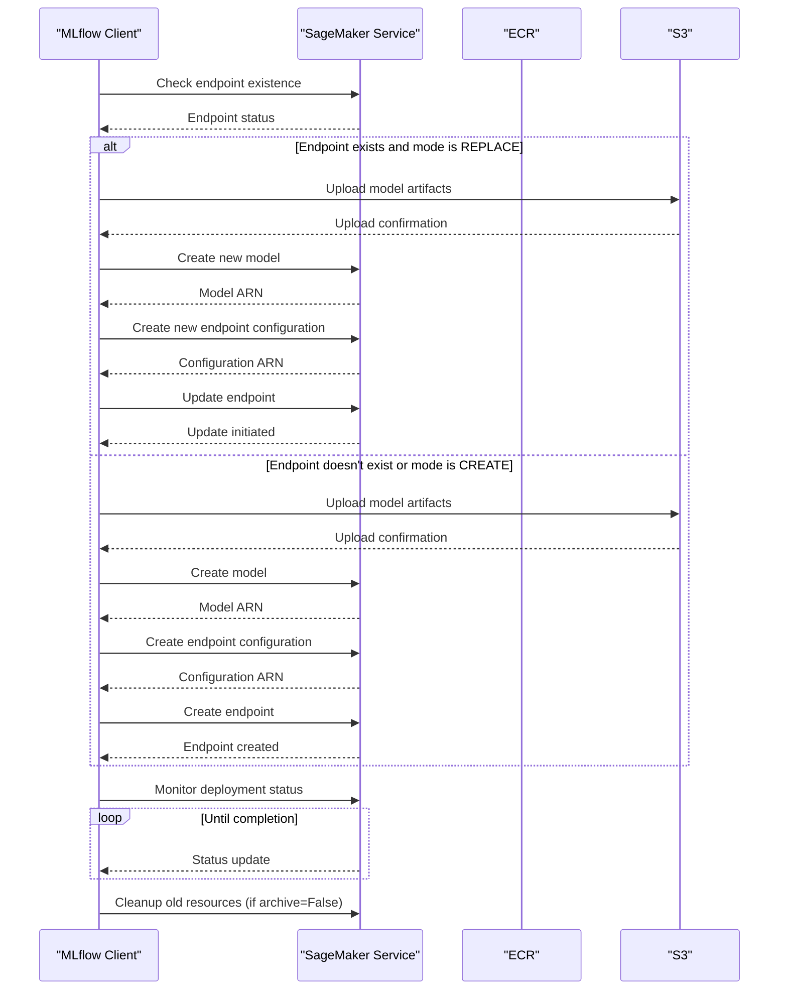
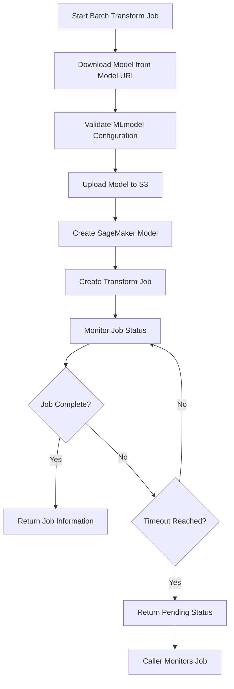
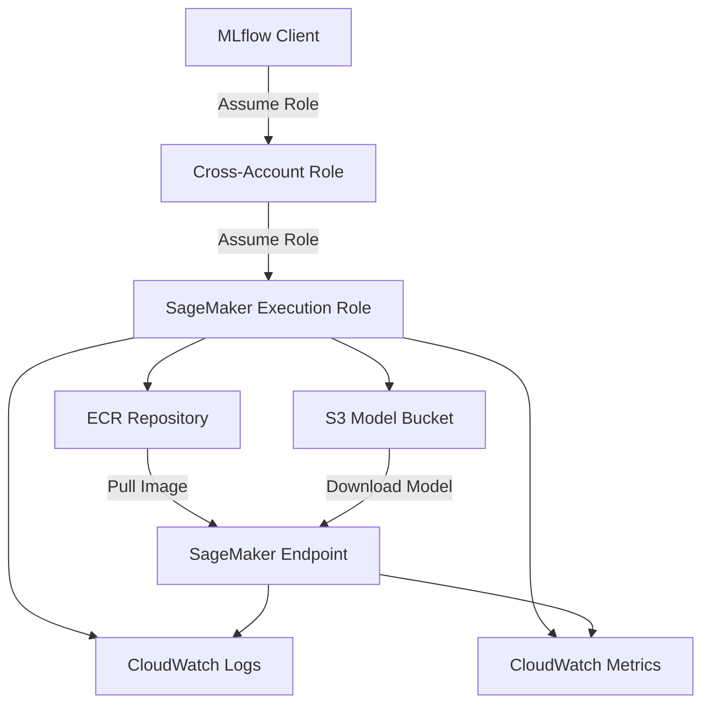
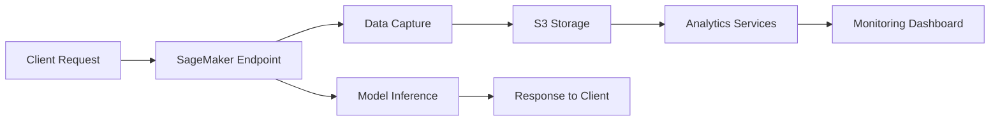
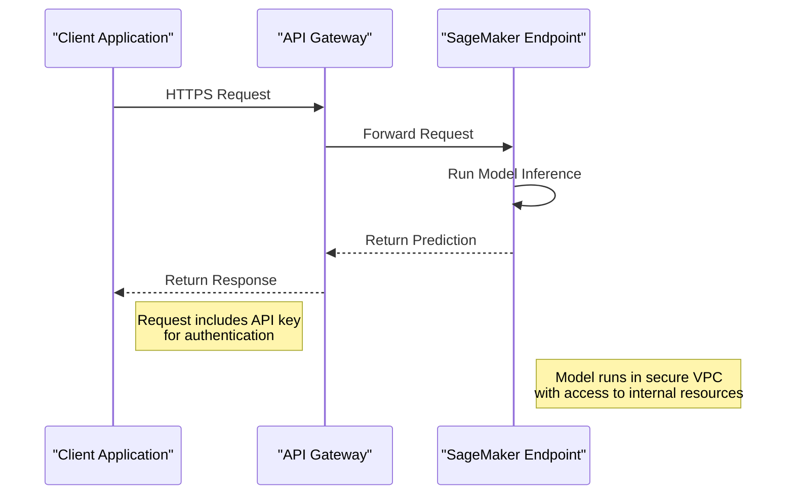

# Amazon SageMaker Deployment

<cite>
**Referenced Files in This Document**   
- [__init__.py](file://mlflow/sagemaker/__init__.py)
- [cli.py](file://mlflow/sagemaker/cli.py)
- [push_image_to_ecr.sh](file://mlflow/sagemaker/push_image_to_ecr.sh)
- [__init__.py](file://mlflow/models/container/__init__.py)
- [README.md](file://examples/deployments/README.md)
</cite>

## Table of Contents
1. [Introduction](#introduction)
2. [Model Packaging and Containerization](#model-packaging-and-containerization)
3. [SageMaker Deployment Configuration](#sagemaker-deployment-configuration)
4. [Deployment Modes and Endpoint Management](#deployment-modes-and-endpoint-management)
5. [Batch Transform Jobs](#batch-transform-jobs)
6. [IAM Permissions and Security Configuration](#iam-permissions-and-security-configuration)
7. [Advanced Deployment Features](#advanced-deployment-features)
8. [Client Application Integration](#client-application-integration)
9. [Common Issues and Troubleshooting](#common-issues-and-troubleshooting)
10. [Best Practices and Optimization](#best-practices-and-optimization)

## Introduction

Amazon SageMaker deployment through MLflow provides a streamlined process for serving machine learning models in production environments. MLflow's SageMaker integration enables data scientists and engineers to deploy models with minimal configuration, handling the complexities of containerization, infrastructure provisioning, and endpoint management. This documentation details the complete workflow for deploying MLflow models to SageMaker, covering container creation, deployment configuration, endpoint management, and integration patterns.

The MLflow SageMaker plugin abstracts away much of the infrastructure complexity while maintaining flexibility for advanced use cases. It supports both real-time inference endpoints and batch transform jobs, allowing organizations to choose the appropriate serving pattern based on their latency, throughput, and cost requirements. The integration leverages SageMaker's managed infrastructure while maintaining MLflow's model registry and tracking capabilities.

**Section sources**
- [__init__.py](file://mlflow/sagemaker/__init__.py#L1-L50)

## Model Packaging and Containerization

### Container Image Creation

MLflow models are deployed to SageMaker through Docker containers that encapsulate the model artifacts, dependencies, and serving logic. The containerization process begins with the `build-and-push-container` command, which creates a Docker image compatible with SageMaker's execution environment. This process generates a Dockerfile that inherits from a base Ubuntu image and installs the necessary serving dependencies.

The container initialization process is managed by the `_init` function in the models container module, which handles both serving and training commands. When the container starts in serve mode, it loads the MLmodel configuration, sets up the appropriate environment, and starts the inference server. The serving environment supports both traditional gunicorn-based servers and MLServer for more advanced serving patterns.

**Diagram sources**
- [__init__.py](file://mlflow/sagemaker/__init__.py#L339-L386)
- [__init__.py](file://mlflow/models/container/__init__.py#L51-L64)

### Inference Server Configuration

The inference server within the container is configured to handle incoming prediction requests and route them to the appropriate model implementation. MLflow supports multiple serving patterns through its container module, with the primary distinction being between traditional gunicorn-based serving and MLServer-based serving. The choice between these patterns is controlled by environment variables such as `ENABLE_MLSERVER`.

For traditional serving, MLflow uses gunicorn with gevent workers to handle concurrent requests efficiently. The number of workers is configurable via the `MLFLOW_MODELS_WORKERS` environment variable, defaulting to the number of available CPU cores. For MLServer deployments, the framework provides additional capabilities such as model mesh, advanced metrics, and support for multiple model formats beyond MLflow's pyfunc.

The container's entrypoint script initializes the serving environment by first installing model dependencies into a conda environment or virtualenv, then installing the serving dependencies (gunicorn or MLServer), and finally starting the server with the appropriate configuration. This two-phase installation process ensures that model-specific dependencies are isolated from the serving infrastructure dependencies.

**Section sources**
- [__init__.py](file://mlflow/models/container/__init__.py#L66-L304)

## SageMaker Deployment Configuration

### Deployment Parameters

Deploying a model to SageMaker requires configuring several parameters that define the infrastructure, security, and operational characteristics of the endpoint. The core deployment function `_deploy` accepts parameters including the application name, model URI, execution role ARN, S3 bucket for artifacts, Docker image URL, AWS region, instance type and count, VPC configuration, and deployment mode.

The model URI can reference models in various locations including local filesystem paths, S3 buckets, MLflow runs, or the model registry. This flexibility allows for deployment from development environments, artifact repositories, or registered models. The execution role ARN specifies the IAM role that SageMaker will assume to access the Docker image in ECR and the model artifacts in S3.

**Diagram sources**
- [__init__.py](file://mlflow/sagemaker/__init__.py#L174-L493)

### Environment Variables and Configuration

MLflow provides several environment variables to customize the deployment process without modifying code. The `MLFLOW_SAGEMAKER_DEPLOY_IMG_URL` variable can specify the ECR image URL for deployment, while `MLFLOW_DEPLOYMENT_FLAVOR_NAME` can specify the model flavor to use. These variables allow for environment-specific configuration without code changes.

The deployment process also respects AWS-specific environment variables such as AWS credentials, region configuration, and proxy settings. The `no_proxy` environment variable is explicitly handled to ensure proper network configuration when deploying in environments with proxy servers.

Configuration parameters can be provided programmatically through the deployment API or via command-line arguments when using the MLflow CLI. The configuration system supports type conversion, automatically converting string values to integers for fields like `instance_count` and `timeout_seconds`, and handling boolean values for flags like `synchronous` and `archive`.

**Section sources**
- [__init__.py](file://mlflow/sagemaker/__init__.py#L2126-L2139)

## Deployment Modes and Endpoint Management

### Deployment Mode Operations

MLflow supports three deployment modes for SageMaker endpoints: CREATE, REPLACE, and ADD. The CREATE mode deploys a new endpoint with the specified model, failing if an endpoint with the same name already exists. The REPLACE mode updates an existing endpoint by replacing its model configuration, or creates a new endpoint if none exists. The ADD mode adds a new model to an existing endpoint as an additional production variant, allowing for A/B testing and canary deployments.

The deployment mode selection is critical for different deployment strategies. For blue-green deployments, the ADD mode can be used to deploy a new model version alongside the current version, then traffic can be gradually shifted using SageMaker's endpoint weight management. For simple updates, the REPLACE mode provides a straightforward way to update the model without managing endpoint lifecycle manually.

**Diagram sources**
- [__init__.py](file://mlflow/sagemaker/__init__.py#L434-L475)
- [__init__.py](file://mlflow/sagemaker/__init__.py#L457-L475)

### Endpoint Lifecycle Management

The SageMaker deployment client provides comprehensive lifecycle management for deployed endpoints, including creation, updating, and deletion operations. The `SageMakerDeploymentClient` class implements the MLflow deployments interface, allowing for consistent interaction with SageMaker endpoints alongside other deployment targets.

Endpoint deletion can be performed with or without archiving. When archiving is enabled, SageMaker resources such as models and endpoint configurations are preserved, allowing for potential rollback or audit purposes. When archiving is disabled, these resources are deleted along with the endpoint, reducing AWS costs but eliminating the ability to quickly restore previous configurations.

The deployment operations support both synchronous and asynchronous execution. Synchronous mode blocks until the operation completes or times out, providing immediate feedback on success or failure. Asynchronous mode returns immediately after initiating the operation, requiring the caller to monitor the endpoint status independently. The timeout parameter controls how long synchronous operations will wait for completion before returning.

**Section sources**
- [__init__.py](file://mlflow/sagemaker/__init__.py#L496-L595)

## Batch Transform Jobs

### Transform Job Configuration

In addition to real-time inference endpoints, MLflow supports SageMaker batch transform jobs for processing large datasets asynchronously. The `deploy_transform_job` function creates a batch transform job that applies the model to input data stored in S3 and writes the results to an output location.

Batch transform jobs are configured with parameters including the job name, input data type (e.g., "S3Prefix" or "ManifestFile"), S3 input URI, content type, S3 output path, compression type, split type, and various filtering options. These parameters control how the input data is processed and how the output is formatted.

The batch transform deployment follows a similar pattern to real-time endpoint deployment, creating a SageMaker model from the MLflow model artifacts, then creating a transform job that uses this model. The process handles the same model flavors and environment configurations as real-time deployments, ensuring consistency between development and production environments.

**Diagram sources**
- [__init__.py](file://mlflow/sagemaker/__init__.py#L597-L800)
- [cli.py](file://mlflow/sagemaker/cli.py#L25-L216)

### Use Cases and Performance Considerations

Batch transform jobs are ideal for scenarios where low-latency responses are not required, such as daily model scoring, data processing pipelines, or model validation on large datasets. They offer cost advantages over real-time endpoints for sporadic or periodic workloads, as you only pay for the compute time used during the transform job rather than maintaining always-on infrastructure.

Performance can be optimized by configuring the instance type and count appropriately for the workload. Large datasets can be processed more quickly by using multiple instances, while memory-intensive models may require instances with higher RAM. The split type parameter controls how input files are divided among instances, with options including "None", "Line", and "RecordIO" for different data formats.

Data capture can be enabled for batch transform jobs to monitor input and output data, which is valuable for model monitoring and debugging. The captured data is stored in S3 and can be analyzed to detect data drift, model performance degradation, or other issues.

**Section sources**
- [__init__.py](file://mlflow/sagemaker/__init__.py#L597-L800)

## IAM Permissions and Security Configuration

### Execution Role Configuration

Proper IAM configuration is critical for successful SageMaker deployments. The execution role specified in the deployment configuration must have permissions to access the ECR repository containing the Docker image and the S3 bucket containing the model artifacts. This role is assumed by SageMaker when creating the model and starting the endpoint.

The minimum required permissions include:
- `s3:GetObject` and `s3:ListBucket` for the model artifacts bucket
- `ecr:GetDownloadUrlForLayer`, `ecr:BatchGetImage`, and `ecr:GetAuthorizationToken` for the ECR repository
- `logs:CreateLogGroup`, `logs:CreateLogStream`, and `logs:PutLogEvents` for CloudWatch logging
- `cloudwatch:PutMetricData` for metric reporting

Cross-account deployments are supported through the assume role functionality, allowing models to be deployed to SageMaker in a different AWS account than where the MLflow tracking server is hosted. This requires an additional IAM role that grants permission to assume the execution role in the target account.

**Diagram sources**
- [__init__.py](file://mlflow/sagemaker/__init__.py#L1240-L1268)
- [__init__.py](file://mlflow/sagemaker/__init__.py#L221-L231)

### VPC and Network Configuration

For enhanced security, SageMaker endpoints can be deployed within a Virtual Private Cloud (VPC) using the vpc_config parameter. This configuration specifies the security groups and subnets where the endpoint instances will be launched, allowing for fine-grained network access control.

VPC deployment is essential when the model needs to access resources that are not publicly accessible, such as internal databases, data lakes, or other services within the organization's network. It also provides additional security by isolating the inference infrastructure from the public internet.

The VPC configuration must specify at least one subnet and one security group. The subnets should be in different availability zones for high availability, and the security groups should allow inbound traffic on the appropriate ports (typically 8080 for SageMaker) from trusted sources. Outbound access is required for the endpoint to write logs to CloudWatch and metrics to CloudWatch.

**Section sources**
- [__init__.py](file://mlflow/sagemaker/__init__.py#L273-L294)

## Advanced Deployment Features

### Data Capture and Monitoring

SageMaker's data capture feature can be enabled during deployment to automatically capture input and output data from the endpoint. This captured data is invaluable for monitoring model performance, detecting data drift, and debugging issues. The data capture configuration specifies whether capture is enabled, the sampling percentage, the S3 destination, and which data to capture (input, output, or both).

The captured data is stored in JSON Lines format in the specified S3 bucket, with each line containing a timestamp, the request/response data, and metadata. This data can be processed using AWS analytics services like Athena, EMR, or Glue to generate monitoring reports and alerts.

**Diagram sources**
- [__init__.py](file://mlflow/sagemaker/__init__.py#L313-L329)

### Serverless and Async Inference

For workloads with unpredictable traffic patterns, SageMaker offers serverless inference and async inference options. Serverless inference automatically provisions and scales compute resources based on demand, eliminating the need to manage instance types and counts. Async inference is designed for long-running predictions that exceed the timeout limits of real-time endpoints.

The serverless configuration specifies the memory size and maximum concurrency, while the async inference configuration specifies the output S3 location and notification settings. These features are particularly useful for computer vision models, natural language processing models, or any model with variable or long processing times.

Both serverless and async inference integrate seamlessly with MLflow's deployment API, requiring only the appropriate configuration parameters to enable. This allows organizations to choose the most cost-effective serving pattern for their specific use case without changing their deployment workflow.

**Section sources**
- [__init__.py](file://mlflow/sagemaker/__init__.py#L331-L356)

## Client Application Integration

### Endpoint Invocation

Client applications interact with deployed SageMaker endpoints through the SageMaker Runtime API. The endpoint URL follows the pattern `https://runtime.sagemaker.{region}.amazonaws.com/endpoints/{endpoint-name}/invocations`. Clients must have IAM permissions to invoke the endpoint, typically granted through a role or user policy.

The invocation request should include the prediction data in the appropriate format (JSON, CSV, etc.) and can include custom headers for additional context. The response contains the model's predictions in the format specified by the model's signature, if one was defined during model logging.

For applications requiring higher availability or custom domain names, SageMaker endpoints can be integrated with API Gateway. This provides additional features such as custom domains, usage plans, API keys, and enhanced monitoring through CloudWatch.

**Diagram sources**
- [__init__.py](file://mlflow/sagemaker/__init__.py#L434-L475)

### Authentication Methods

Authentication to SageMaker endpoints can be implemented through several methods. The most common approach uses AWS Signature Version 4, where requests are signed with AWS credentials. For applications outside the AWS ecosystem, API Gateway can be used to add API key authentication, JWT validation, or OAuth integration.

When using API Gateway, additional security features such as usage plans, rate limiting, and request validation can be configured. This provides a more robust API layer that can handle authentication, authorization, and rate limiting before requests reach the SageMaker endpoint.

For internal applications, IAM roles can be assigned to EC2 instances, ECS tasks, or Lambda functions, allowing them to invoke SageMaker endpoints without managing API keys or credentials. This approach follows the principle of least privilege and reduces the risk of credential exposure.

**Section sources**
- [__init__.py](file://mlflow/sagemaker/__init__.py#L221-L231)

## Common Issues and Troubleshooting

### Deployment Timeouts and Failures

Deployment timeouts are a common issue when deploying large models or in regions with limited capacity. The default timeout of 1200 seconds (20 minutes) may be insufficient for complex models or high-latency networks. Increasing the timeout parameter can resolve this issue, but it's also important to monitor the underlying cause.

Common causes of deployment failures include:
- Insufficient IAM permissions for the execution role
- Network connectivity issues between SageMaker and ECR/S3
- Model artifacts that exceed size limits
- Docker image compatibility issues
- VPC configuration errors

The deployment logs in CloudWatch can provide detailed error messages to diagnose these issues. Enabling detailed logging in the container image by setting appropriate log levels can also help identify problems during the container startup phase.

### Model Size and Performance Limitations

SageMaker has limits on model size and container startup time that can impact deployment success. Large models may exceed the 5GB limit for model artifacts or take too long to download and initialize. Strategies to address this include:

- Model pruning and quantization to reduce size
- Using model parallelism to distribute large models
- Leveraging SageMaker's model parallelism library
- Using incremental loading for models that support it

Performance issues can often be addressed by selecting appropriate instance types with sufficient CPU, memory, and GPU resources. Monitoring tools like CloudWatch can help identify bottlenecks and guide instance selection.

**Section sources**
- [__init__.py](file://mlflow/sagemaker/__init__.py#L477-L489)

## Best Practices and Optimization

### Cost Optimization Strategies

Optimizing costs for SageMaker deployments involves selecting the appropriate instance type, using auto-scaling, and leveraging spot instances when possible. For predictable workloads, reserved instances can provide significant cost savings. For variable workloads, auto-scaling policies can dynamically adjust capacity based on demand.

Serverless inference can be more cost-effective for sporadic workloads, as you only pay for the compute time used during inference rather than maintaining always-on infrastructure. Batch transform jobs are often more economical than real-time endpoints for periodic processing tasks.

Monitoring and analyzing usage patterns can identify opportunities for optimization, such as downgrading instance types during off-peak hours or implementing caching for frequently requested predictions.

### Canary Deployments and A/B Testing

MLflow's ADD deployment mode enables canary deployments and A/B testing by allowing multiple model variants to coexist on the same endpoint. Traffic can be routed between variants using SageMaker's endpoint weight management, allowing for gradual rollout of new models.

This approach reduces risk by enabling organizations to validate new models with a small percentage of traffic before full rollout. Performance metrics can be compared between variants to make data-driven decisions about which model to promote.

The deployment process can be automated as part of a CI/CD pipeline, with tests and approvals required before increasing the traffic percentage to the new model. This creates a robust deployment workflow that balances innovation with stability.

**Section sources**
- [__init__.py](file://mlflow/sagemaker/__init__.py#L2436-L2445)