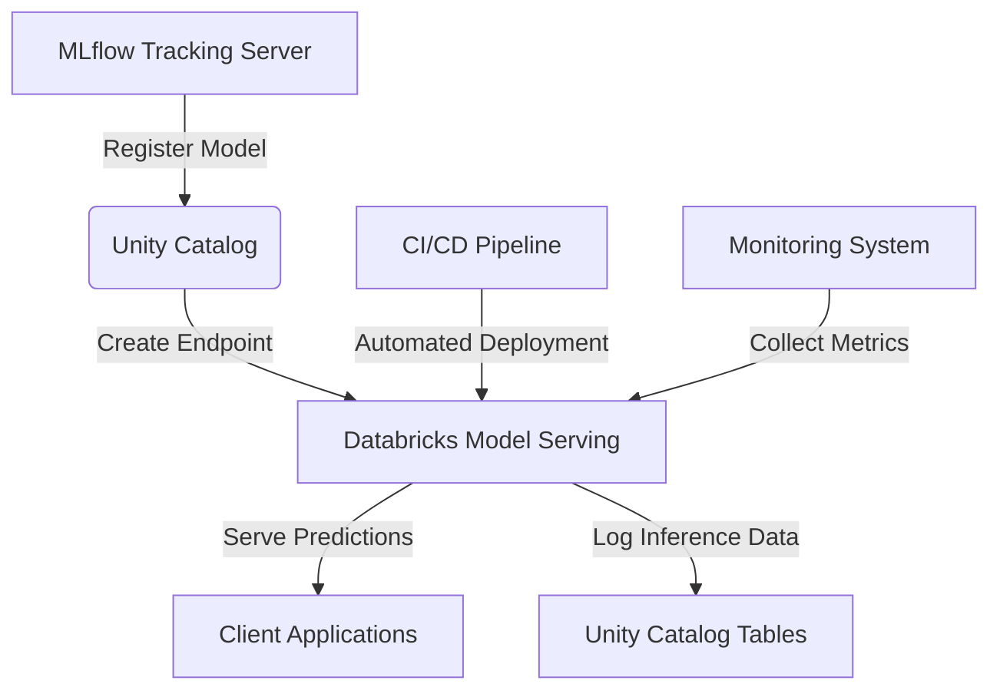
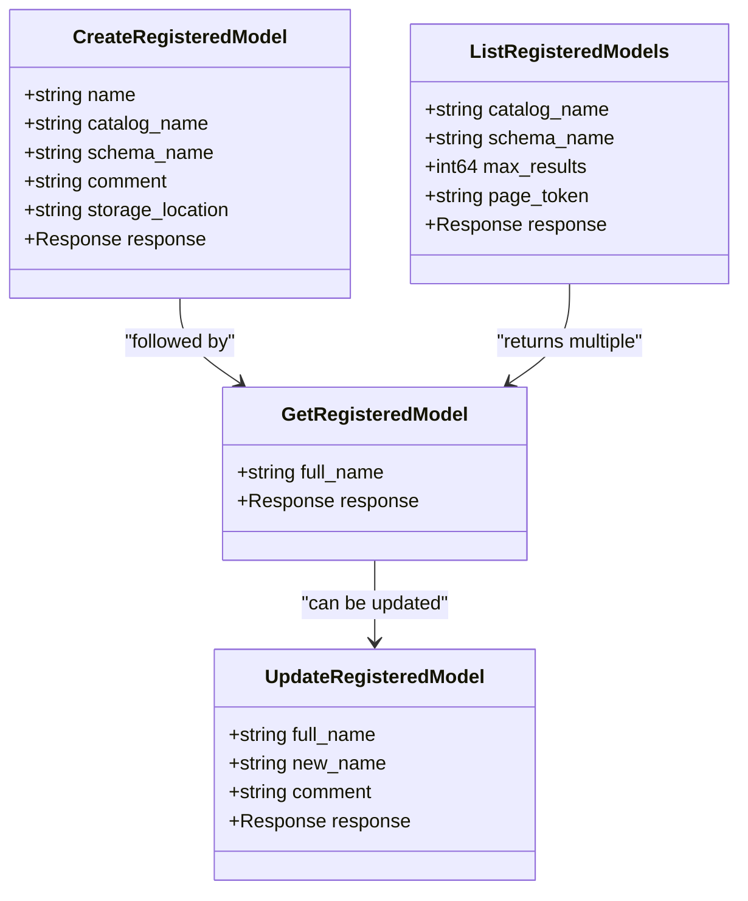
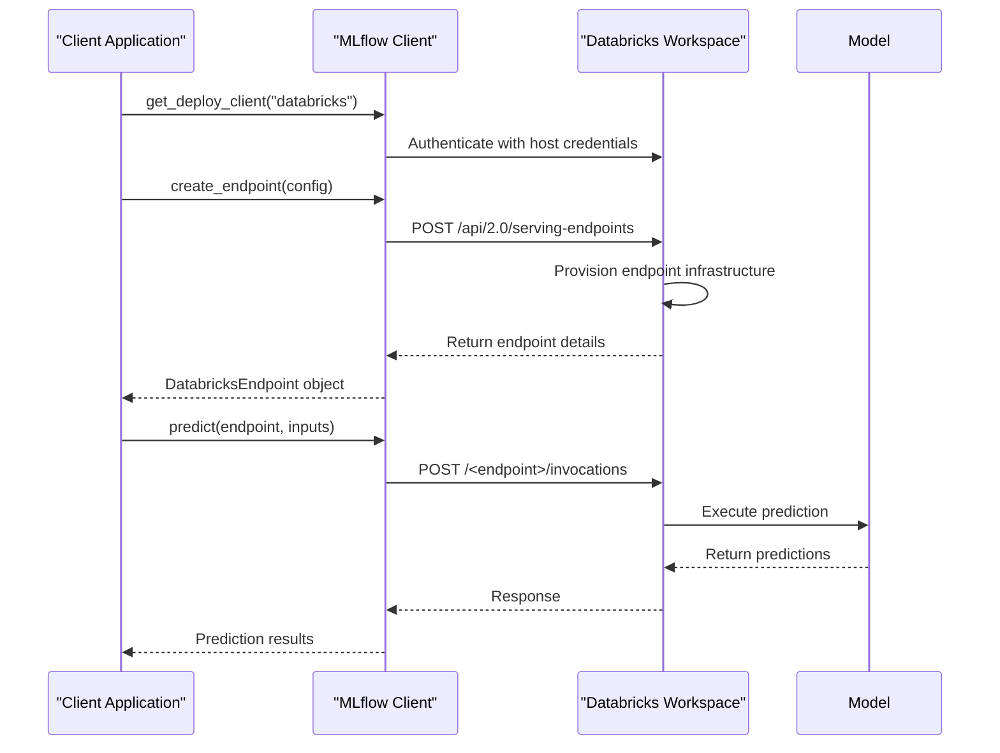

# Databricks Deployment

<cite>
**Referenced Files in This Document**   
- [databricks.py](file://examples/deployments/databricks/databricks.py)
- [__init__.py](file://mlflow/deployments/databricks/__init__.py)
- [cli.py](file://mlflow/deployments/cli.py)
- [unity_catalog_oss_messages.proto](file://mlflow/protos/unity_catalog_oss_messages.proto)
- [unity_catalog_oss_service.proto](file://mlflow/protos/unity_catalog_oss_service.proto)
- [databricks_evaluation_dataset_source.py](file://mlflow/genai/datasets/databricks_evaluation_dataset_source.py)
- [provider.py](file://mlflow/legacy_databricks_cli/configure/provider.py)
</cite>

## Table of Contents
1. [Introduction](#introduction)
2. [Databricks Model Serving Overview](#databricks-model-serving-overview)
3. [Model Registration in Unity Catalog](#model-registration-in-unity-catalog)
4. [Creating and Managing Serving Endpoints](#creating-and-managing-serving-endpoints)
5. [Authentication and Security](#authentication-and-security)
6. [Client-Side Model Invocation](#client-side-model-invocation)
7. [CI/CD Pipeline Integration](#cicd-pipeline-integration)
8. [Monitoring and Troubleshooting](#monitoring-and-troubleshooting)
9. [Best Practices for Databricks Deployment](#best-practices-for-databricks-deployment)

## Introduction

This document provides comprehensive guidance on deploying MLflow models on Databricks, focusing on the integration between MLflow and Databricks Model Serving through Unity Catalog. The deployment process enables organizations to operationalize machine learning models with enterprise-grade security, scalability, and governance. The implementation leverages Databricks' unified data intelligence platform to streamline the transition from model development to production serving.

The deployment architecture centers around Databricks Model Serving, which provides managed, scalable endpoints for model inference. Models are registered in Unity Catalog, Databricks' unified governance solution, ensuring consistent access controls, audit logging, and lineage tracking across the organization's data and AI assets. This integration enables seamless deployment workflows from MLflow tracking to production endpoints.

**Section sources**
- [databricks.py](file://examples/deployments/databricks/databricks.py#L1-L113)
- [__init__.py](file://mlflow/deployments/databricks/__init__.py#L1-L852)

## Databricks Model Serving Overview

Databricks Model Serving provides a managed infrastructure for deploying machine learning models as scalable REST APIs. The service integrates directly with MLflow to enable one-click deployment of models tracked in MLflow experiments. Model endpoints are automatically provisioned with monitoring, scaling, and security features, reducing the operational burden on machine learning teams.

The serving infrastructure supports various model types, including traditional machine learning models, deep learning models, and large language models (LLMs). Each endpoint is configured with auto-scaling capabilities that respond to traffic patterns, ensuring optimal performance while controlling costs. The service also provides built-in support for canary deployments and A/B testing, enabling safe rollout of new model versions.

Model Serving endpoints are accessible via REST APIs that accept JSON payloads containing input data and return predictions in a standardized format. The endpoints support both synchronous and streaming responses, accommodating different application requirements. For LLM workloads, the streaming capability enables real-time, token-by-token response generation for interactive applications.

**Diagram sources**
- [__init__.py](file://mlflow/deployments/databricks/__init__.py#L211-L269)
- [databricks.py](file://examples/deployments/databricks/databricks.py#L22-L113)

## Model Registration in Unity Catalog

Unity Catalog serves as the centralized governance layer for MLflow models deployed on Databricks. Models are registered as assets within Unity Catalog, inheriting its comprehensive security model, audit logging, and data lineage capabilities. The registration process creates a persistent record of the model that can be shared across workspaces and teams.

The model registration workflow begins with logging a model to MLflow during the training process. Once validated, the model can be registered in Unity Catalog using either the MLflow API or Databricks CLI. The registration includes metadata such as model name, version, description, and input/output schema, which are stored in the catalog's metadata layer.

Unity Catalog implements a hierarchical namespace (catalog.schema.model) that aligns with organizational structures and data domains. This enables fine-grained access control through SQL-standard GRANT and REVOKE statements. Data stewards can define policies that govern who can register models, deploy endpoints, or access prediction results.

The protobuf definitions in `unity_catalog_oss_messages.proto` specify the API contracts for model registration operations, including CreateRegisteredModel, DeleteRegisteredModel, GetRegisteredModel, and UpdateRegisteredModel. These messages define the request and response structures for interacting with the Unity Catalog service, ensuring consistency across client implementations.

**Diagram sources**
- [unity_catalog_oss_messages.proto](file://mlflow/protos/unity_catalog_oss_messages.proto#L47-L117)
- [unity_catalog_oss_service.proto](file://mlflow/protos/unity_catalog_oss_service.proto#L1-L50)

**Section sources**
- [unity_catalog_oss_messages.proto](file://mlflow/protos/unity_catalog_oss_messages.proto#L47-L117)
- [unity_catalog_oss_service.proto](file://mlflow/protos/unity_catalog_oss_service.proto#L1-L50)

## Creating and Managing Serving Endpoints

The creation and management of serving endpoints is accomplished through the DatabricksDeploymentClient interface, which provides methods for the full endpoint lifecycle. The `create_endpoint` method provisions a new serving endpoint with the specified configuration, while `update_endpoint_config`, `update_endpoint_tags`, and `update_endpoint_rate_limits` enable modification of existing endpoints.

Endpoint configuration is defined as a JSON structure that specifies the served entities, scaling policies, and traffic routing rules. For external models like OpenAI, the configuration includes provider-specific parameters such as API keys (referenced via Databricks secrets) and task types. The configuration also supports rate limiting policies that control request volume on a per-key basis, preventing abuse and ensuring fair resource allocation.

The deployment process follows a declarative model where the desired endpoint state is specified, and the serving infrastructure ensures convergence to that state. This approach enables infrastructure-as-code practices and simplifies rollback procedures. The `list_endpoints` and `get_endpoint` methods provide visibility into the current state of deployed endpoints, facilitating monitoring and audit requirements.

**Diagram sources**
- [__init__.py](file://mlflow/deployments/databricks/__init__.py#L353-L491)
- [databricks.py](file://examples/deployments/databricks/databricks.py#L26-L56)

**Section sources**
- [__init__.py](file://mlflow/deployments/databricks/__init__.py#L353-L491)
- [databricks.py](file://examples/deployments/databricks/databricks.py#L26-L56)

## Authentication and Security

Authentication and security for Databricks model deployments are managed through a multi-layered approach that combines workspace-level authentication with endpoint-specific access controls. The primary authentication mechanism uses Databricks personal access tokens (PATs) or OAuth tokens, which are validated by the workspace before processing any deployment requests.

Credential management follows security best practices by avoiding hard-coded secrets in configuration files. Instead, sensitive values like API keys are stored in Databricks Secrets, and references to these secrets are included in endpoint configurations using the `{{secrets/scope/key}}` syntax. This ensures that credentials are encrypted at rest and only exposed to authorized processes during execution.

Network security is enforced through Databricks' network isolation features, which can restrict endpoint access to specific IP ranges or require requests to originate from within the organization's network. For highly sensitive workloads, private endpoints can be configured to prevent public internet access entirely, ensuring that model inference occurs within the organization's secure network perimeter.

The `provider.py` file contains configuration providers that handle different authentication methods, including support for OAuth credentials in Databricks Model Serving environments. These providers abstract the authentication details from the deployment logic, allowing the same deployment code to work across different security configurations.

**Section sources**
- [__init__.py](file://mlflow/deployments/databricks/__init__.py#L18-L23)
- [provider.py](file://mlflow/legacy_databricks_cli/configure/provider.py#L296-L329)

## Client-Side Model Invocation

Client applications interact with deployed models through the predict and predict_stream methods of the DatabricksDeploymentClient. The predict method sends a synchronous request to the endpoint and waits for the complete response, making it suitable for applications with low-latency requirements and small response sizes.

For applications that benefit from incremental response processing, such as chat interfaces with large language models, the predict_stream method provides a generator that yields response chunks as they become available. This streaming capability enables real-time user experiences where responses appear token-by-token, improving perceived performance and enabling early processing of partial results.

The invocation interface abstracts the underlying HTTP communication, handling authentication, error retry logic, and response parsing. Client applications only need to provide the endpoint name and input data in the expected format. The client library automatically handles connection pooling, timeout management, and transient error recovery, increasing application resilience.

The example in `databricks_evaluation_dataset_source.py` demonstrates how evaluation datasets can be queried from Databricks endpoints, showing the integration between model serving and model evaluation workflows. This pattern enables continuous monitoring of model performance by regularly scoring evaluation datasets against deployed endpoints.

**Section sources**
- [__init__.py](file://mlflow/deployments/databricks/__init__.py#L211-L352)
- [databricks_evaluation_dataset_source.py](file://mlflow/genai/datasets/databricks_evaluation_dataset_source.py#L1-L100)

## CI/CD Pipeline Integration

Continuous integration and continuous deployment (CI/CD) pipelines for Databricks model deployments leverage the programmatic interfaces provided by MLflow and Databricks APIs. The deployment process can be automated using the Databricks CLI or directly through the MLflow deployments API, enabling integration with popular CI/CD platforms like Jenkins, GitHub Actions, or GitLab CI.

The typical CI/CD workflow begins with model training and validation in a development environment. Once a model meets performance criteria, it is registered in Unity Catalog with a staging status. Automated tests validate the model's functionality and performance characteristics before promoting it to production.

The promotion process can be implemented using the update_endpoint_config method to switch traffic between model versions or by creating new endpoints with production routing. Pipeline scripts can incorporate approval gates, canary testing, and rollback procedures to ensure safe deployments. The entire process is version-controlled and auditable, meeting compliance requirements for regulated industries.

The `cli.py` file provides command-line interfaces for all deployment operations, making it easy to incorporate deployment steps into shell scripts or pipeline configuration files. These commands can be parameterized with environment variables to support different deployment targets (development, staging, production) from the same codebase.

**Section sources**
- [cli.py](file://mlflow/deployments/cli.py#L1-L469)
- [databricks.py](file://examples/deployments/databricks/databricks.py#L1-L113)

## Monitoring and Troubleshooting

Monitoring and troubleshooting Databricks model deployments involves tracking both system-level metrics and model-specific performance indicators. The Databricks platform provides built-in monitoring for endpoint availability, latency, error rates, and resource utilization, which can be accessed through the workspace UI or programmatically via APIs.

For model-specific monitoring, organizations can implement custom logging to capture prediction inputs and outputs, enabling analysis of model drift, data quality issues, and performance degradation over time. The AI Gateway configuration accessible through update_endpoint_ai_gateway allows enabling usage tracking and inference logging to Unity Catalog tables, providing a comprehensive audit trail of model usage.

Common issues in Databricks deployments include authentication failures, network connectivity problems, and model compatibility issues. Authentication issues are typically resolved by verifying personal access tokens and secret references in endpoint configurations. Network issues may require adjusting firewall rules or configuring private endpoints. Model compatibility problems often stem from version mismatches between training and serving environments, which can be mitigated through containerization and dependency pinning.

The predict method includes configurable timeout parameters (MLFLOW_DEPLOYMENT_PREDICT_TIMEOUT and MLFLOW_DEPLOYMENT_PREDICT_TOTAL_TIMEOUT) that help prevent client applications from hanging indefinitely when endpoints are unresponsive. These timeouts can be adjusted based on the expected latency of different model types.

**Section sources**
- [__init__.py](file://mlflow/deployments/databricks/__init__.py#L127-L166)
- [cli.py](file://mlflow/deployments/cli.py#L308-L327)

## Best Practices for Databricks Deployment

Effective deployment of MLflow models on Databricks requires adherence to several best practices that ensure reliability, security, and maintainability. First, organizations should implement a consistent naming convention for models and endpoints that reflects their purpose, environment, and version, facilitating discovery and management.

Security best practices include using Databricks Secrets for all sensitive configuration values, implementing the principle of least privilege in access controls, and regularly rotating authentication credentials. Network security should be enforced through appropriate isolation policies, with public endpoints protected by rate limiting and private endpoints used for sensitive workloads.

Performance optimization involves selecting appropriate instance types for model serving, configuring auto-scaling policies based on expected traffic patterns, and implementing caching for computationally expensive models. For LLM workloads, careful consideration should be given to token limits, response streaming, and cost management.

Operational excellence is achieved through comprehensive monitoring, automated testing, and well-documented deployment procedures. Organizations should establish clear ownership and escalation paths for production models, implement regular model retraining schedules, and maintain rollback procedures for rapid recovery from issues.

Finally, governance and compliance requirements should be addressed through comprehensive logging, audit trails, and integration with organizational data governance frameworks. Unity Catalog provides the foundation for these capabilities, but organizations should supplement it with custom policies and procedures that reflect their specific regulatory environment.

**Section sources**
- [__init__.py](file://mlflow/deployments/databricks/__init__.py#L1-L852)
- [databricks.py](file://examples/deployments/databricks/databricks.py#L1-L113)