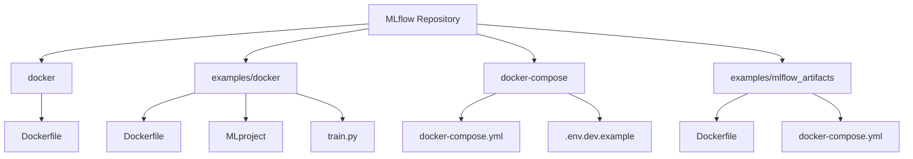
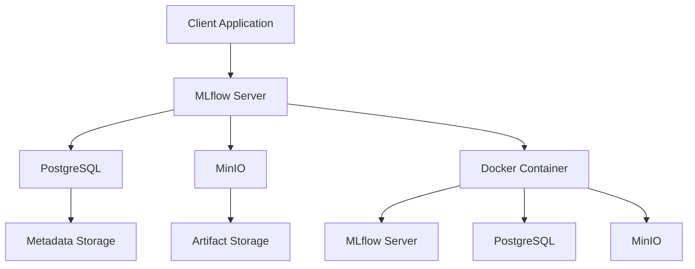
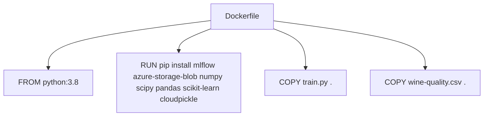
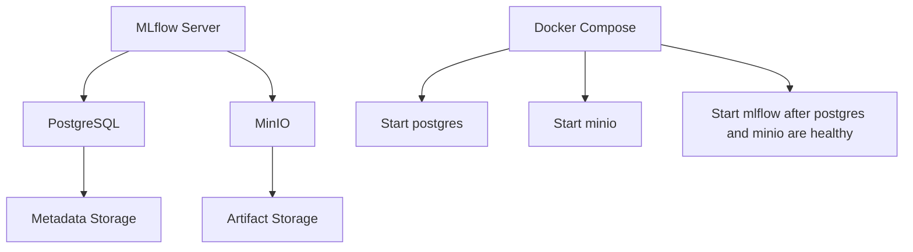

# Docker Deployment

<cite>
**Referenced Files in This Document**   
- [Dockerfile](file://docker\Dockerfile)
- [examples/docker/Dockerfile](file://examples\docker\Dockerfile)
- [examples/docker/MLproject](file://examples\docker\MLproject)
- [examples/docker/README.rst](file://examples\docker\README.rst)
- [examples/docker/train.py](file://examples\docker\train.py)
- [docker-compose/docker-compose.yml](file://docker-compose\docker-compose.yml)
- [docker-compose/.env.dev.example](file://docker-compose\.env.dev.example)
- [docker-compose/README.md](file://docker-compose\README.md)
- [examples/mlflow_artifacts/Dockerfile](file://examples\mlflow_artifacts\Dockerfile)
- [examples/mlflow_artifacts/docker-compose.yml](file://examples\mlflow_artifacts\docker-compose.yml)
</cite>

## Table of Contents
1. [Introduction](#introduction)
2. [Project Structure](#project-structure)
3. [Core Components](#core-components)
4. [Architecture Overview](#architecture-overview)
5. [Detailed Component Analysis](#detailed-component-analysis)
6. [Dependency Analysis](#dependency-analysis)
7. [Performance Considerations](#performance-considerations)
8. [Troubleshooting Guide](#troubleshooting-guide)
9. [Conclusion](#conclusion)

## Introduction
This document provides comprehensive guidance on deploying MLflow models using Docker containers. It covers the implementation details of packaging models with Docker, including Dockerfile definition, MLproject configuration, and entry point scripts. The document also details the process of building container images, pushing them to registries, and running them locally or in orchestration systems like Kubernetes. It includes concrete examples from the codebase showing dependency handling, model endpoint exposure, and environment variable management. The invocation relationship between client applications and the containerized model server is explained, including REST API specifications and input/output serialization formats. Common issues such as image size optimization, port conflicts, and health check configuration are addressed, along with guidance on scaling containerized deployments and integrating with CI/CD pipelines.

## Project Structure
The MLflow repository contains several key directories for Docker deployment. The `docker` directory contains the base Dockerfile for MLflow, while the `examples/docker` directory provides a complete example of a Dockerized MLflow project. The `docker-compose` directory contains configurations for running MLflow with PostgreSQL and MinIO using Docker Compose. The `examples/mlflow_artifacts` directory demonstrates artifact storage configurations. These directories collectively provide a comprehensive framework for deploying MLflow models in containerized environments.



**Diagram sources**
- [docker\Dockerfile](file://docker\Dockerfile)
- [examples\docker\Dockerfile](file://examples\docker\Dockerfile)
- [examples\docker\MLproject](file://examples\docker\MLproject)
- [docker-compose\docker-compose.yml](file://docker-compose\docker-compose.yml)
- [examples\mlflow_artifacts\Dockerfile](file://examples\mlflow_artifacts\Dockerfile)

**Section sources**
- [docker\Dockerfile](file://docker\Dockerfile)
- [examples\docker\Dockerfile](file://examples\docker\Dockerfile)
- [examples\docker\MLproject](file://examples\docker\MLproject)
- [docker-compose\docker-compose.yml](file://docker-compose\docker-compose.yml)
- [examples\mlflow_artifacts\Dockerfile](file://examples\mlflow_artifacts\Dockerfile)

## Core Components
The core components for Docker deployment in MLflow include the Dockerfile for container image creation, the MLproject file for defining the project environment and entry points, and the train.py script for model training. These components work together to create a reproducible and portable environment for ML model deployment. The Dockerfile specifies the base image and dependencies, the MLproject file defines the execution environment and parameters, and the train.py script contains the model training logic.

**Section sources**
- [examples\docker\Dockerfile](file://examples\docker\Dockerfile)
- [examples\docker\MLproject](file://examples\docker\MLproject)
- [examples\docker\train.py](file://examples\docker\train.py)

## Architecture Overview
The architecture for Docker deployment in MLflow consists of several interconnected components. The MLflow server runs in a Docker container, connected to a PostgreSQL database for metadata storage and MinIO for artifact storage. This setup allows for a complete MLflow environment to be deployed and scaled using container orchestration systems. The architecture supports both local development and production deployment scenarios.



**Diagram sources**
- [docker-compose\docker-compose.yml](file://docker-compose\docker-compose.yml)
- [examples\mlflow_artifacts\docker-compose.yml](file://examples\mlflow_artifacts\docker-compose.yml)

## Detailed Component Analysis

### Dockerfile Analysis
The Dockerfile is the foundation of containerized MLflow deployments. It defines the base image, installs required dependencies, and sets up the environment for running MLflow. The Dockerfile in the examples/docker directory demonstrates a typical configuration for a Dockerized MLflow project.



**Diagram sources**
- [examples\docker\Dockerfile](file://examples\docker\Dockerfile)

**Section sources**
- [examples\docker\Dockerfile](file://examples\docker\Dockerfile)

### MLproject Analysis
The MLproject file defines the execution environment and entry points for an MLflow project. It specifies the Docker container environment and the command to run the training script. This file is crucial for ensuring reproducibility and portability of ML experiments.

```mermaid
graph TD
A[MLproject] --> B[name: docker-example]
A --> C[docker_env: image: mlflow-docker-example]
A --> D[entry_points: main: parameters: alpha, l1_ratio]
A --> E[command: "python train.py --alpha {alpha} --l1-ratio {l1_ratio}"]
```

**Diagram sources**
- [examples\docker\MLproject](file://examples\docker\MLproject)

**Section sources**
- [examples\docker\MLproject](file://examples\docker\MLproject)

### docker-compose.yml Analysis
The docker-compose.yml file defines a multi-container MLflow environment with PostgreSQL for metadata storage and MinIO for artifact storage. This configuration enables a complete MLflow stack to be deployed with a single command.

```mermaid
graph TD
A[docker-compose.yml] --> B[postgres: image: postgres:15]
A --> C[minio: image: minio/minio:latest]
A --> D[mlflow: image: ghcr.io/mlflow/mlflow:${MLFLOW_VERSION}]
B --> E[environment: POSTGRES_USER, POSTGRES_PASSWORD, POSTGRES_DB]
C --> F[environment: MINIO_ROOT_USER, MINIO_ROOT_PASSWORD]
D --> G[environment: MLFLOW_BACKEND_STORE_URI, MLFLOW_S3_ENDPOINT_URL]
D --> H[command: mlflow server --backend-store-uri ...]
```

**Diagram sources**
- [docker-compose\docker-compose.yml](file://docker-compose\docker-compose.yml)

**Section sources**
- [docker-compose\docker-compose.yml](file://docker-compose\docker-compose.yml)

## Dependency Analysis
The dependency analysis reveals the relationships between various components in the Docker deployment setup. The MLflow server depends on PostgreSQL for metadata storage and MinIO for artifact storage. The Docker Compose configuration manages these dependencies, ensuring that services are started in the correct order and that the MLflow server only starts after its dependencies are ready.



**Diagram sources**
- [docker-compose\docker-compose.yml](file://docker-compose\docker-compose.yml)

**Section sources**
- [docker-compose\docker-compose.yml](file://docker-compose\docker-compose.yml)

## Performance Considerations
When deploying MLflow models with Docker, several performance considerations should be taken into account. Image size optimization is crucial for reducing deployment times and storage requirements. Using slim base images and minimizing the number of layers in the Dockerfile can significantly reduce image size. Port conflicts should be managed by using unique port numbers for different services. Health check configuration ensures that services are properly monitored and restarted if they fail.

## Troubleshooting Guide
Common issues in Docker deployments of MLflow include connectivity problems between services, incorrect environment variable configuration, and permission issues with artifact storage. To troubleshoot these issues, verify that the MLFLOW_TRACKING_URI is correctly set, check the logs of individual containers for error messages, and ensure that the PostgreSQL and MinIO services are running and accessible. Port conflicts can be resolved by changing the port numbers in the .env file and restarting the stack.

**Section sources**
- [docker-compose\README.md](file://docker-compose\README.md)
- [docker-compose\.env.dev.example](file://docker-compose\.env.dev.example)

## Conclusion
Deploying MLflow models using Docker containers provides a powerful and flexible way to create reproducible and portable ML environments. By using Dockerfiles, MLproject files, and Docker Compose configurations, ML practitioners can create complete MLflow stacks that can be easily deployed and scaled. The examples provided in the MLflow repository demonstrate best practices for containerized ML deployments, including proper dependency management, environment configuration, and service orchestration. With these tools and techniques, organizations can streamline their ML workflows and improve the reliability and reproducibility of their ML experiments.