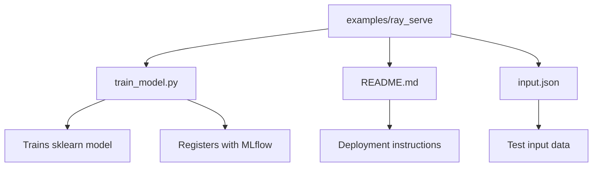
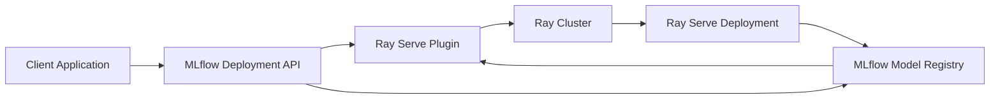
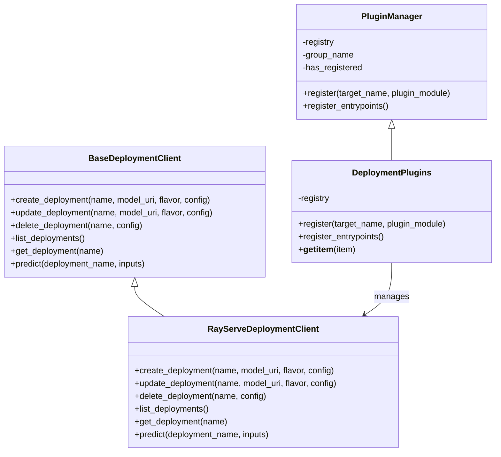
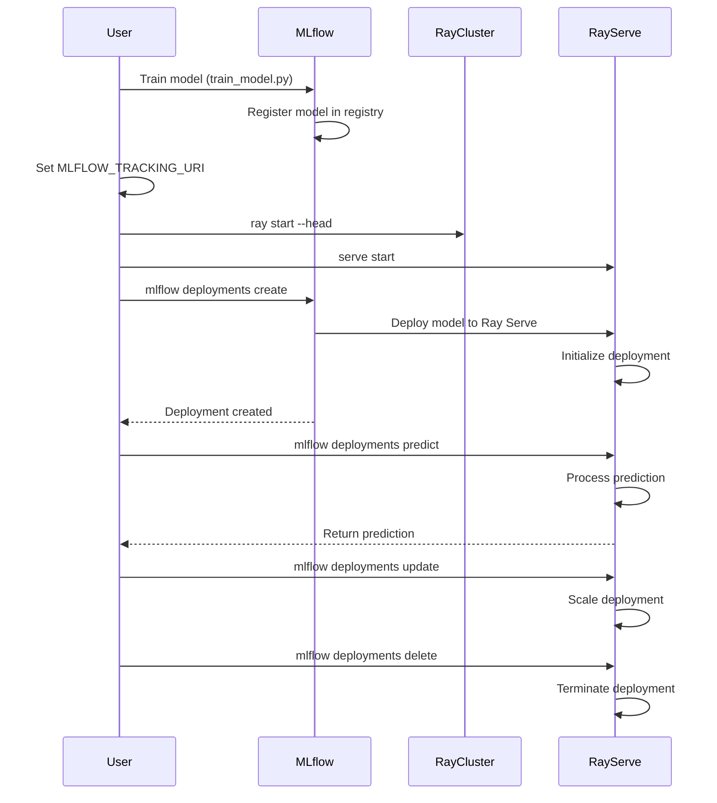
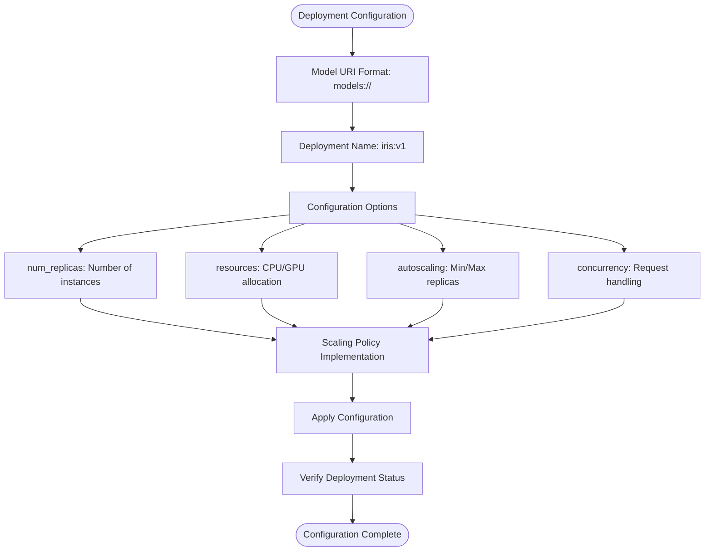
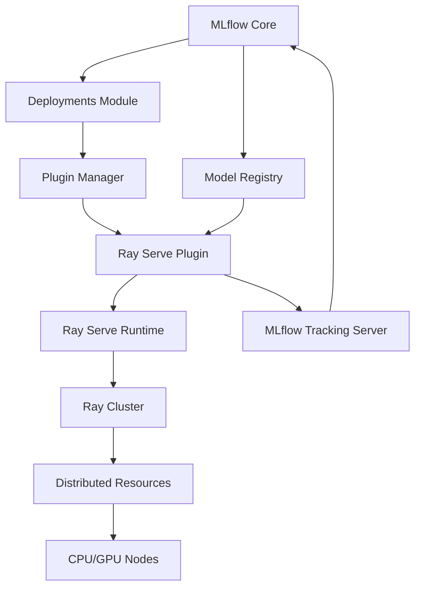

# Ray Serve Deployment

<cite>
**Referenced Files in This Document**   
- [train_model.py](file://examples/ray_serve/train_model.py)
- [README.md](file://examples/ray_serve/README.md)
- [input.json](file://examples/ray_serve/input.json)
- [base.py](file://mlflow/deployments/base.py)
- [plugin_manager.py](file://mlflow/deployments/plugin_manager.py)
- [interface.py](file://mlflow/deployments/interface.py)
</cite>

## Table of Contents
1. [Introduction](#introduction)
2. [Project Structure](#project-structure)
3. [Core Components](#core-components)
4. [Architecture Overview](#architecture-overview)
5. [Detailed Component Analysis](#detailed-component-analysis)
6. [Dependency Analysis](#dependency-analysis)
7. [Performance Considerations](#performance-considerations)
8. [Troubleshooting Guide](#troubleshooting-guide)
9. [Conclusion](#conclusion)

## Introduction
This document provides comprehensive guidance on deploying MLflow models using Ray Serve, a scalable inference system. The integration enables users to deploy machine learning models at scale with flexible configuration options for deployment parameters, scaling policies, and model version management. The implementation leverages MLflow's deployment plugin architecture to interface with Ray Serve, allowing both command-line and Python API access for model deployment, prediction, scaling, and lifecycle management. This documentation details the complete workflow from model training to deployment, including infrastructure setup, configuration, and operational procedures.

## Project Structure
The MLflow repository contains a dedicated example for Ray Serve deployment under the `examples/ray_serve` directory. This example demonstrates the complete workflow of training a model, registering it with MLflow, and deploying it via Ray Serve. The structure follows MLflow's standard examples pattern, with specific files for training, configuration, and testing deployments.

**Diagram sources**
- [train_model.py](file://examples/ray_serve/train_model.py)
- [README.md](file://examples/ray_serve/README.md)
- [input.json](file://examples/ray_serve/input.json)

**Section sources**
- [train_model.py](file://examples/ray_serve/train_model.py)
- [README.md](file://examples/ray_serve/README.md)

## Core Components
The Ray Serve deployment functionality in MLflow is built on the deployment plugin architecture, which provides a standardized interface for deploying models to various serving platforms. The core components include the deployment client interface, plugin management system, and target-specific implementations. The integration allows users to create, update, delete, and query deployments through a consistent API, whether using the command line or Python interface. Key operations include deployment creation, prediction serving, scaling configuration, and lifecycle management, all orchestrated through MLflow's deployment system that interfaces with Ray Serve.

**Section sources**
- [base.py](file://mlflow/deployments/base.py)
- [plugin_manager.py](file://mlflow/deployments/plugin_manager.py)
- [interface.py](file://mlflow/deployments/interface.py)

## Architecture Overview
The MLflow-Ray Serve integration follows a plugin-based architecture where MLflow serves as the model management and tracking system, while Ray Serve provides the scalable serving infrastructure. The architecture consists of three main components: the MLflow tracking server that stores model artifacts and metadata, the Ray cluster that provides distributed computing resources, and the Ray Serve deployment that hosts the actual model instances. Communication flows from client applications through the MLflow deployment API to the Ray Serve plugin, which manages the deployment lifecycle on the Ray cluster. This separation of concerns allows MLflow to focus on model governance while leveraging Ray Serve's capabilities for scalable inference.

**Diagram sources**
- [base.py](file://mlflow/deployments/base.py)
- [interface.py](file://mlflow/deployments/interface.py)

## Detailed Component Analysis

### Deployment Plugin Architecture
The deployment system in MLflow is designed as a plugin architecture that allows integration with various serving platforms, including Ray Serve. This modular design enables extensibility while maintaining a consistent interface for users.

**Diagram sources**
- [base.py](file://mlflow/deployments/base.py)
- [plugin_manager.py](file://mlflow/deployments/plugin_manager.py)

**Section sources**
- [base.py](file://mlflow/deployments/base.py)
- [plugin_manager.py](file://mlflow/deployments/plugin_manager.py)

### Model Deployment Workflow
The process of deploying MLflow models to Ray Serve follows a standardized workflow that begins with model training and registration, followed by deployment configuration and serving infrastructure setup.

**Diagram sources**
- [train_model.py](file://examples/ray_serve/train_model.py)
- [README.md](file://examples/ray_serve/README.md)

**Section sources**
- [train_model.py](file://examples/ray_serve/train_model.py)
- [README.md](file://examples/ray_serve/README.md)

### Configuration and Scaling Management
The deployment configuration system allows for flexible management of deployment parameters, particularly scaling policies that control resource allocation and performance characteristics.

**Diagram sources**
- [base.py](file://mlflow/deployments/base.py)
- [README.md](file://examples/ray_serve/README.md)

**Section sources**
- [base.py](file://mlflow/deployments/base.py)
- [README.md](file://examples/ray_serve/README.md)

## Dependency Analysis
The MLflow-Ray Serve integration depends on several key components within the MLflow ecosystem and external dependencies for Ray Serve functionality. The primary dependencies include the MLflow deployment plugin interface, Ray Serve runtime, and the underlying machine learning model flavors. The plugin system relies on entry point registration to dynamically load the Ray Serve deployment client, while the deployment operations depend on proper configuration of the MLflow tracking URI and Ray cluster connectivity. Understanding these dependencies is crucial for successful deployment and troubleshooting.

**Diagram sources**
- [plugin_manager.py](file://mlflow/deployments/plugin_manager.py)
- [interface.py](file://mlflow/deployments/interface.py)

**Section sources**
- [plugin_manager.py](file://mlflow/deployments/plugin_manager.py)
- [interface.py](file://mlflow/deployments/interface.py)

## Performance Considerations
Deploying MLflow models with Ray Serve offers several performance optimization opportunities. The ability to configure the number of replicas allows for horizontal scaling to handle increased request throughput. Proper resource allocation, including CPU and GPU specifications, ensures that model inference can proceed efficiently. The integration supports batch inference, which can significantly improve throughput for certain workloads. Monitoring performance metrics such as latency, throughput, and resource utilization is essential for optimizing deployment configurations. Additionally, considering cold start latency when scaling deployments is important for maintaining consistent performance, particularly in environments with variable traffic patterns.

## Troubleshooting Guide
Common issues when deploying MLflow models with Ray Serve include connectivity problems between MLflow and the Ray cluster, configuration errors in deployment parameters, and model compatibility issues. Ensuring that the MLflow tracking URI is correctly set and that the Ray cluster is properly initialized is critical for successful deployment. When encountering issues with deployment creation or prediction, verifying the model URI format and checking the Ray Serve logs can help identify the root cause. For scaling issues, validating that sufficient resources are available in the Ray cluster and that the configuration parameters are correctly specified is essential. Version rollback procedures should be tested in advance to ensure smooth recovery from deployment issues.

**Section sources**
- [README.md](file://examples/ray_serve/README.md)
- [train_model.py](file://examples/ray_serve/train_model.py)

## Conclusion
The integration of MLflow with Ray Serve provides a powerful solution for deploying machine learning models at scale. By leveraging MLflow's model management capabilities and Ray Serve's scalable inference system, organizations can streamline their model deployment workflows while maintaining flexibility and control over deployment parameters. The plugin-based architecture ensures extensibility and consistency across different deployment targets, while the comprehensive API supports both command-line and programmatic access. With proper configuration and monitoring, this integration enables reliable, high-performance model serving that can adapt to changing workload requirements.