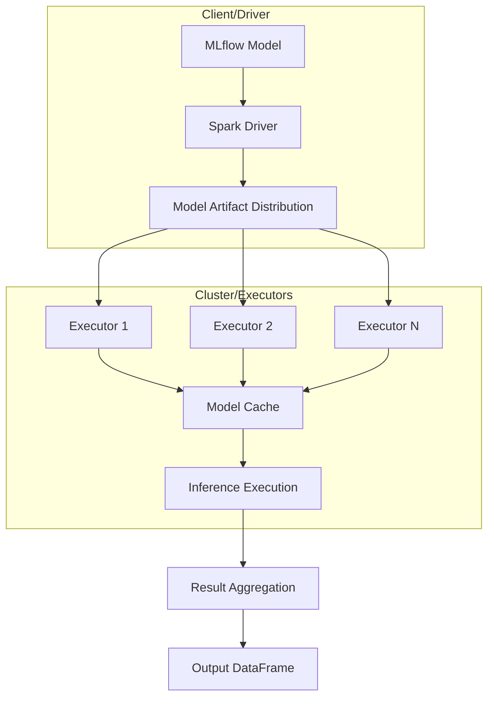
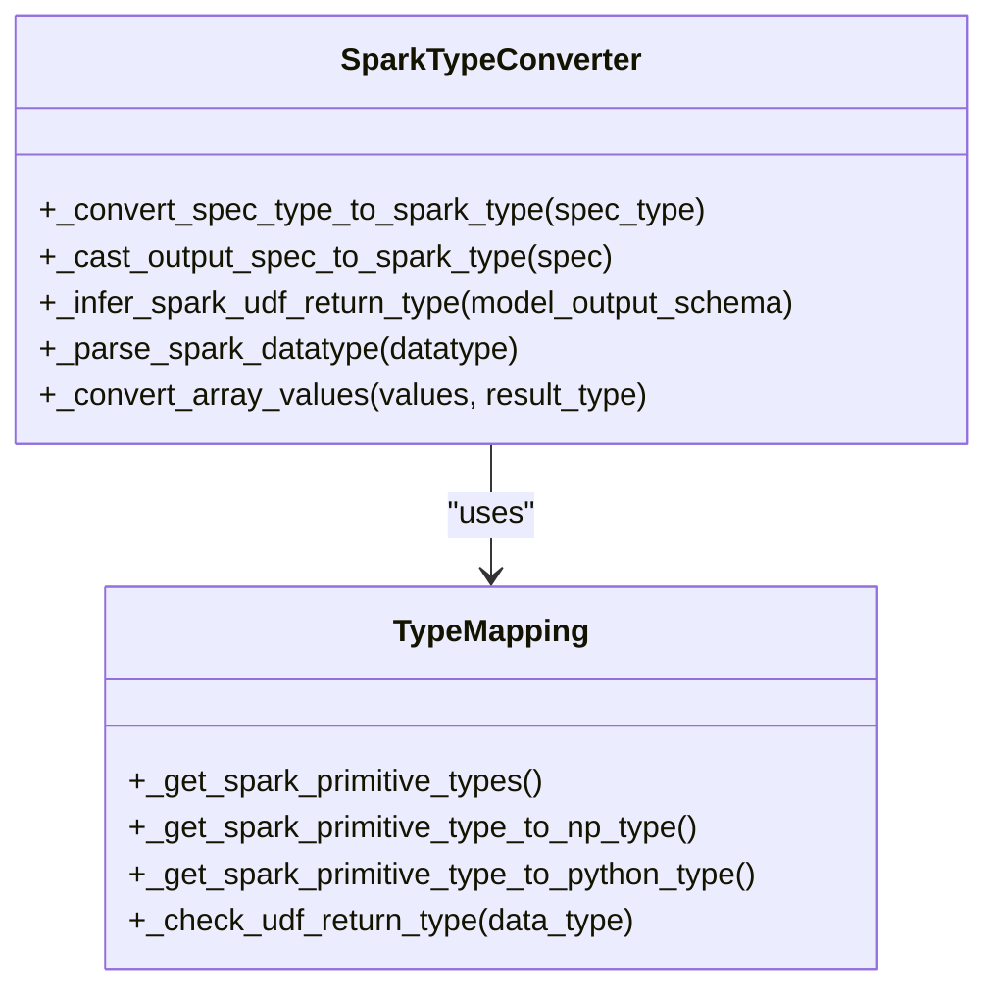
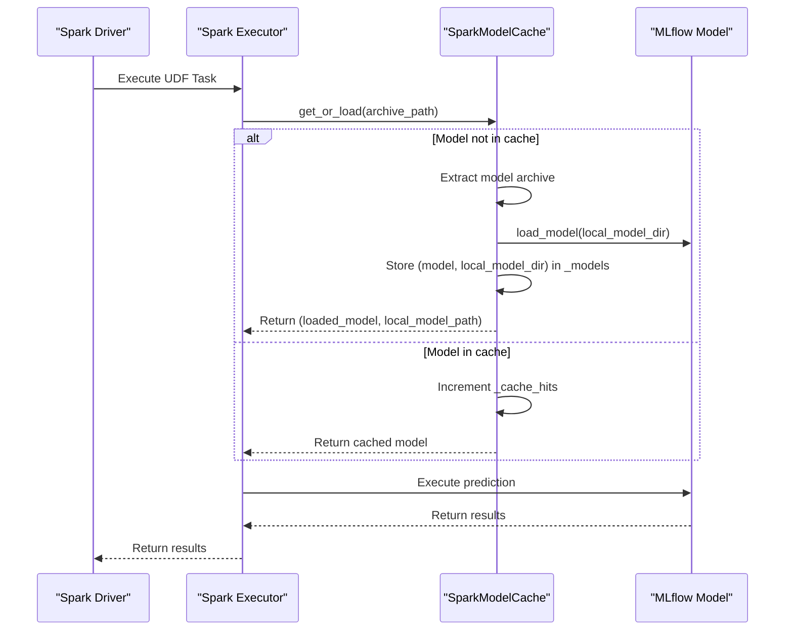
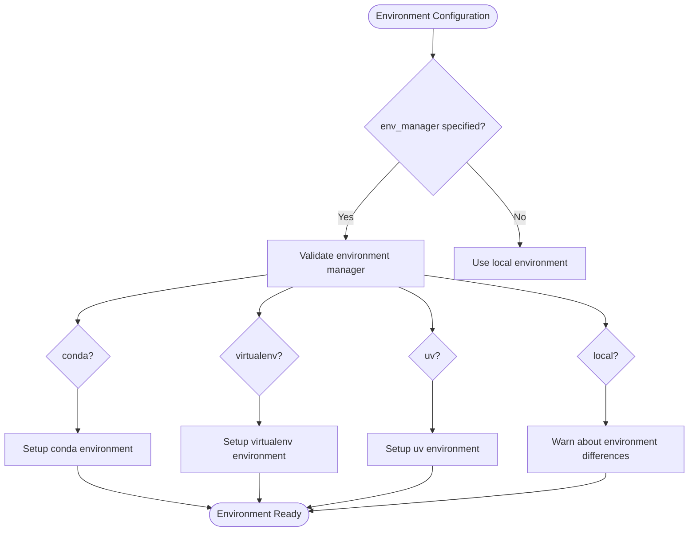
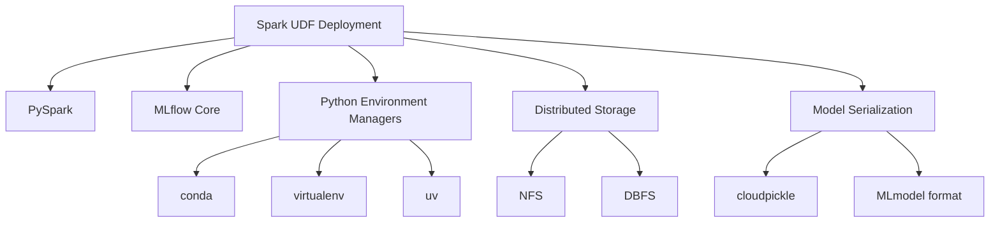

# Spark UDF Deployment

<cite>
**Referenced Files in This Document**   
- [spark_udf.py](file://examples/spark_udf/spark_udf.py)
- [structs_and_arrays.py](file://examples/spark_udf/structs_and_arrays.py)
- [spark_udf_datetime.py](file://examples/spark_udf/spark_udf_datetime.py)
- [spark_udf_with_prebuilt_env.py](file://examples/spark_udf/spark_udf_with_prebuilt_env.py)
- [__init__.py](file://mlflow/pyfunc/__init__.py)
- [spark_model_cache.py](file://mlflow/pyfunc/spark_model_cache.py)
- [test_spark.py](file://tests/pyfunc/test_spark.py)
</cite>

## Table of Contents
1. [Introduction](#introduction)
2. [Core Components](#core-components)
3. [Architecture Overview](#architecture-overview)
4. [Detailed Component Analysis](#detailed-component-analysis)
5. [Dependency Analysis](#dependency-analysis)
6. [Performance Considerations](#performance-considerations)
7. [Troubleshooting Guide](#troubleshooting-guide)
8. [Conclusion](#conclusion)

## Introduction
This document provides comprehensive guidance on deploying MLflow models as Spark User-Defined Functions (UDFs). It details the implementation of converting MLflow models to Spark UDFs, covering serialization, dependency management, type conversion between Python and Scala/Java, model registration, Spark session configuration, and performance optimization for large-scale data processing. The content includes concrete examples from the codebase demonstrating the use of MLflow's PyFunc model flavor with Spark, handling complex data types like arrays and structs, managing model caching, and addressing common issues such as serialization errors and memory constraints.

## Core Components
The deployment of MLflow models as Spark UDFs revolves around several core components that enable seamless integration between MLflow's model management capabilities and Spark's distributed computing framework. These components include the `spark_udf` function, model serialization mechanisms, type conversion utilities, and environment management systems. The implementation supports various data types and complex structures, allowing models to be registered as temporary or permanent UDFs with appropriate configuration of Spark session settings.

**Section sources**
- [__init__.py](file://mlflow/pyfunc/__init__.py#L2047-L2582)
- [spark_model_cache.py](file://mlflow/pyfunc/spark_model_cache.py#L1-L49)

## Architecture Overview
The architecture for deploying MLflow models as Spark UDFs follows a client-server pattern where the Spark driver coordinates distributed inference across executors. The system leverages Spark's Pandas UDF capabilities to enable efficient data processing while maintaining compatibility with MLflow's model format. Model artifacts are distributed to executors using various mechanisms depending on the deployment environment, including NFS caching, Spark's artifact distribution, or pre-built environment archives.

**Diagram sources**
- [__init__.py](file://mlflow/pyfunc/__init__.py#L2047-L2582)
- [spark_model_cache.py](file://mlflow/pyfunc/spark_model_cache.py#L1-L49)

## Detailed Component Analysis

### MLflow PyFunc Spark UDF Implementation
The `mlflow.pyfunc.spark_udf` function serves as the primary interface for deploying MLflow models as Spark UDFs. It creates a Pandas UDF that applies the model's predict method to input data, handling the conversion between Spark DataFrame columns and the model's expected input format. The implementation supports various input patterns, including direct column references and struct-wrapped inputs.

#### Type Conversion and Schema Handling
The system includes comprehensive type conversion capabilities that handle the mapping between Spark SQL types and Python/NumPy types. This ensures proper data representation during inference and result processing. The implementation includes specific handling for primitive types, arrays, and complex structures.

**Diagram sources**
- [__init__.py](file://mlflow/pyfunc/__init__.py#L1505-L1700)
- [__init__.py](file://mlflow/pyfunc/__init__.py#L1655-L1691)

#### Model Caching Mechanism
To optimize performance in distributed environments, MLflow implements a model caching system that prevents repeated model loading on Spark executors. The `SparkModelCache` class maintains a static map of loaded models, enabling reuse across multiple UDF invocations within the same executor process.

**Diagram sources**
- [spark_model_cache.py](file://mlflow/pyfunc/spark_model_cache.py#L1-L49)
- [__init__.py](file://mlflow/pyfunc/__init__.py#L2229-L2230)

### Environment Management and Dependency Handling
The deployment system provides flexible environment management options to ensure consistent execution environments across distributed workers. This includes support for various environment managers and pre-built environment archives for optimized deployment scenarios.

#### Environment Manager Configuration
The implementation supports multiple environment managers including conda, virtualenv, uv, and local environments. Each manager type has specific use cases and deployment considerations, with the system providing appropriate warnings and validation for each configuration.

**Diagram sources**
- [__init__.py](file://mlflow/pyfunc/__init__.py#L2238-L2393)
- [__init__.py](file://mlflow/pyfunc/__init__.py#L2346-L2357)

## Dependency Analysis
The Spark UDF deployment system has several key dependencies that enable its functionality across different deployment scenarios. These dependencies include Spark's distributed computing framework, MLflow's model management system, and various Python environment management tools.

**Diagram sources**
- [__init__.py](file://mlflow/pyfunc/__init__.py#L2047-L2582)
- [spark_model_cache.py](file://mlflow/pyfunc/spark_model_cache.py#L1-L49)

## Performance Considerations
Deploying MLflow models as Spark UDFs requires careful consideration of performance implications, particularly in distributed environments. The system implements several optimization strategies to minimize overhead and maximize throughput.

### Model Distribution Strategies
The implementation employs different model distribution strategies based on the deployment environment:
- **Local mode**: Direct file system access
- **Cluster mode**: Spark's artifact distribution
- **NFS environments**: Shared file system caching
- **Databricks environments**: Pre-built environment archives

These strategies balance the trade-offs between distribution overhead, storage requirements, and execution efficiency.

### Memory Management
The system includes mechanisms to manage memory usage effectively:
- Model caching to prevent repeated loading
- Efficient type conversion to minimize memory footprint
- Streamlined data transfer between Spark and Python processes
- Proper cleanup of temporary resources

The implementation also provides guidance on configuring Spark session settings to optimize memory allocation for UDF execution.

**Section sources**
- [__init__.py](file://mlflow/pyfunc/__init__.py#L2310-L2314)
- [spark_model_cache.py](file://mlflow/pyfunc/spark_model_cache.py#L15-L18)

## Troubleshooting Guide
Common issues encountered when deploying MLflow models as Spark UDFs include serialization errors, environment mismatches, and performance bottlenecks. The following guidance addresses these common challenges:

### Serialization Issues
- Ensure model artifacts are properly packaged with all dependencies
- Verify that custom model classes are serializable
- Check for compatibility between cloudpickle versions on driver and executors

### Environment Configuration Problems
- Validate that the specified environment manager is available on all cluster nodes
- Ensure that required Python packages are installed in the target environment
- Verify that environment variables are properly propagated to executors

### Performance Optimization
- Use pre-built environment archives when available
- Configure appropriate Spark memory settings
- Leverage model caching for repeated inference operations
- Optimize data types to minimize serialization overhead

**Section sources**
- [__init__.py](file://mlflow/pyfunc/__init__.py#L2362-L2371)
- [__init__.py](file://mlflow/pyfunc/__init__.py#L2347-L2356)

## Conclusion
The deployment of MLflow models as Spark UDFs provides a powerful mechanism for integrating machine learning models into distributed data processing pipelines. The implementation offers robust support for various deployment scenarios, from local development to production-scale clusters. By leveraging Spark's distributed computing capabilities and MLflow's model management features, organizations can efficiently deploy and scale machine learning inference across large datasets. The system's flexibility in environment management, type conversion, and performance optimization makes it suitable for both batch processing workloads and streaming applications.