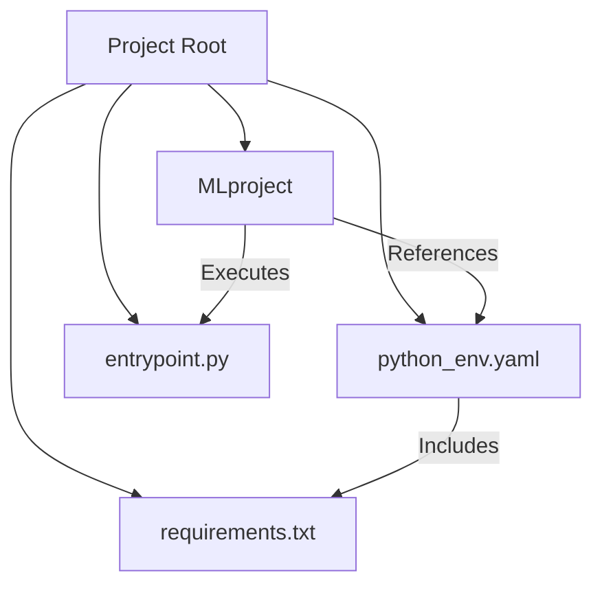
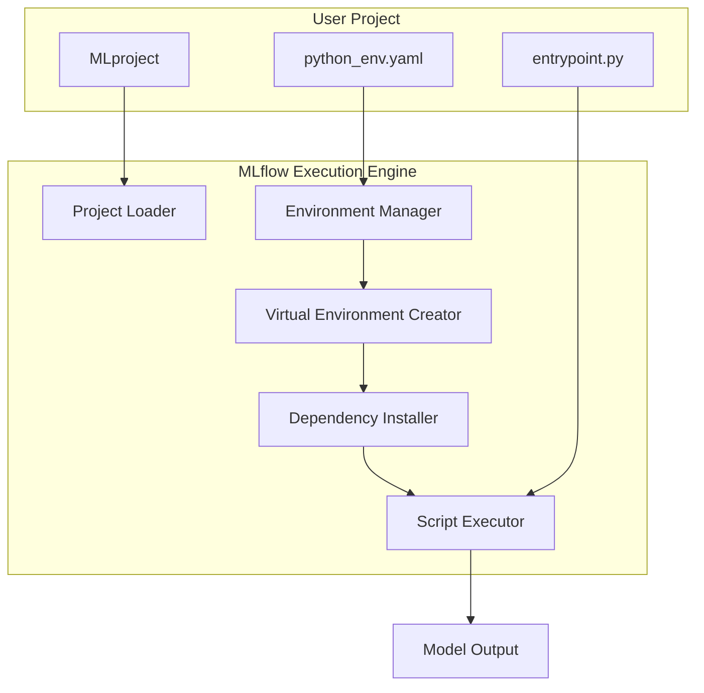
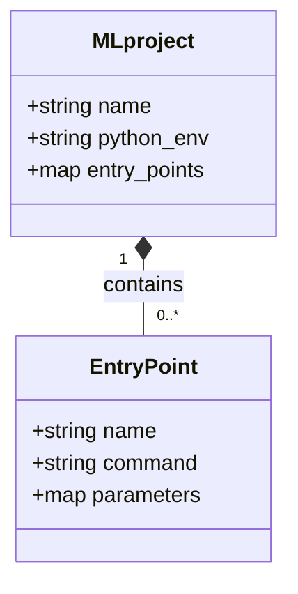
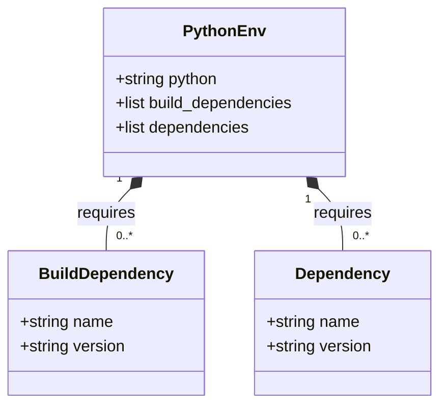
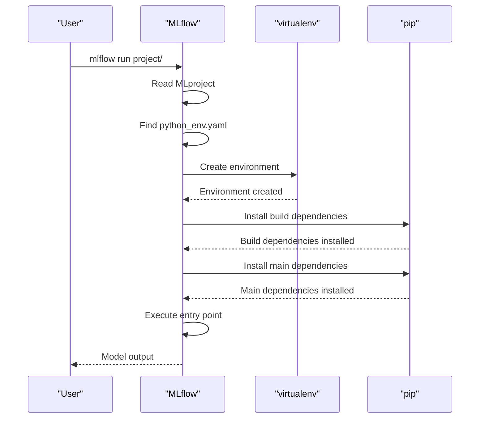
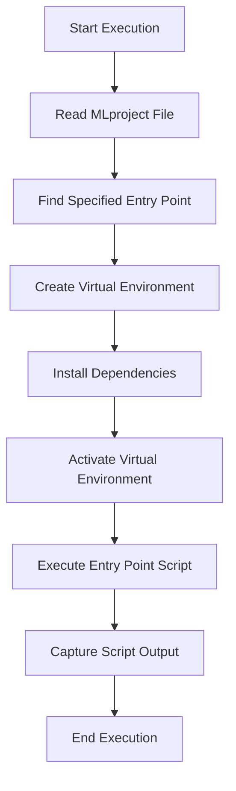

# Virtualenv Deployment

<cite>
**Referenced Files in This Document**   
- [MLproject](file://examples/virtualenv/project/MLproject)
- [python_env.yaml](file://examples/virtualenv/project/python_env.yaml)
- [entrypoint.py](file://examples/virtualenv/project/entrypoint.py)
- [requirements.txt](file://examples/virtualenv/project/requirements.txt)
- [environment.py](file://mlflow/utils/environment.py)
- [virtualenv.py](file://mlflow/utils/virtualenv.py)
- [env_type.py](file://mlflow/projects/env_type.py)
- [flower_classifier/MLproject](file://examples/flower_classifier/MLproject)
- [pytorch/MLproject](file://examples/pytorch/MLproject)
- [multistep_workflow/MLproject](file://examples/multistep_workflow/MLproject)
- [dev-env-setup.sh](file://dev/dev-env-setup.sh)
</cite>

## Table of Contents
1. [Introduction](#introduction)
2. [Project Structure](#project-structure)
3. [Core Components](#core-components)
4. [Architecture Overview](#architecture-overview)
5. [Detailed Component Analysis](#detailed-component-analysis)
6. [Dependency Analysis](#dependency-analysis)
7. [Performance Considerations](#performance-considerations)
8. [Troubleshooting Guide](#troubleshooting-guide)
9. [Conclusion](#conclusion)

## Introduction
This document provides comprehensive guidance on deploying MLflow models using virtualenv environments. It details the implementation of packaging models with virtualenv, including defining dependency requirements, creating isolated Python environments, and managing package compatibility. The document covers configuration of MLproject files for virtualenv usage, handling system-level dependencies, and ensuring reproducible deployments. It includes concrete examples from the codebase showing project directory structures, entry point definitions, and environment variable management. The invocation relationship between client applications and virtualenv-deployed models is explained, including script execution and process management. Common issues such as dependency conflicts, Python version compatibility, and environment activation in automated workflows are addressed, along with guidance on optimizing virtualenv deployments for different operating systems and integration with process managers.

## Project Structure
The MLflow virtualenv deployment system follows a structured approach to model packaging and execution. The core structure revolves around the MLproject file that defines the project configuration, a python_env.yaml file that specifies the Python environment requirements, and entry point scripts that contain the actual model code. This structure enables reproducible and isolated execution environments for ML models.



**Diagram sources**
- [MLproject](file://examples/virtualenv/project/MLproject)
- [python_env.yaml](file://examples/virtualenv/project/python_env.yaml)
- [entrypoint.py](file://examples/virtualenv/project/entrypoint.py)
- [requirements.txt](file://examples/virtualenv/project/requirements.txt)

**Section sources**
- [MLproject](file://examples/virtualenv/project/MLproject)
- [python_env.yaml](file://examples/virtualenv/project/python_env.yaml)

## Core Components
The virtualenv deployment system in MLflow consists of several key components that work together to create isolated, reproducible execution environments for machine learning models. These components include the MLproject configuration file, the python_env.yaml environment specification, the requirements.txt dependency file, and the entry point Python scripts. The system leverages the Python standard library's venv module or the virtualenv package to create isolated environments, ensuring that model deployments are not affected by system-wide package installations or version conflicts.

**Section sources**
- [MLproject](file://examples/virtualenv/project/MLproject)
- [python_env.yaml](file://examples/virtualenv/project/python_env.yaml)
- [entrypoint.py](file://examples/virtualenv/project/entrypoint.py)
- [requirements.txt](file://examples/virtualenv/project/requirements.txt)

## Architecture Overview
The MLflow virtualenv deployment architecture follows a layered approach that separates environment configuration from model code and execution logic. When a project is executed, MLflow reads the MLproject file to determine the environment type and entry points. If a python_env.yaml file is specified, MLflow creates a new virtual environment using the specified Python version and installs the required dependencies. The entry point script is then executed within this isolated environment, ensuring that the model runs with exactly the dependencies it was developed and tested with.



**Diagram sources**
- [MLproject](file://examples/virtualenv/project/MLproject)
- [python_env.yaml](file://examples/virtualenv/project/python_env.yaml)
- [virtualenv.py](file://mlflow/utils/virtualenv.py)
- [environment.py](file://mlflow/utils/environment.py)

## Detailed Component Analysis

### MLproject Configuration Analysis
The MLproject file serves as the entry point configuration for MLflow projects using virtualenv environments. It specifies the project name, the environment configuration file, and the entry points that can be executed. The MLproject file uses a simple YAML format to define these components, making it easy to understand and modify.



**Diagram sources**
- [MLproject](file://examples/virtualenv/project/MLproject)
- [flower_classifier/MLproject](file://examples/flower_classifier/MLproject)
- [pytorch/MLproject](file://examples/pytorch/MLproject)

**Section sources**
- [MLproject](file://examples/virtualenv/project/MLproject)
- [flower_classifier/MLproject](file://examples/flower_classifier/MLproject)
- [pytorch/MLproject](file://examples/pytorch/MLproject)

### Python Environment Specification Analysis
The python_env.yaml file defines the Python environment requirements for the MLflow project. It specifies the Python version to use, build dependencies that must be installed before other dependencies, and the main dependencies required by the project. This file enables reproducible environments across different systems and ensures that the model runs with the exact Python version and package versions it was developed with.



**Diagram sources**
- [python_env.yaml](file://examples/virtualenv/project/python_env.yaml)
- [environment.py](file://mlflow/utils/environment.py)

**Section sources**
- [python_env.yaml](file://examples/virtualenv/project/python_env.yaml)
- [environment.py](file://mlflow/utils/environment.py)

### Virtual Environment Creation Process
The virtual environment creation process in MLflow is handled by the utils/virtualenv.py module. When a project is executed with a python_env.yaml specification, MLflow creates a new virtual environment using the virtualenv package. The process involves determining the appropriate Python interpreter, creating the environment directory, installing build dependencies first, and then installing the main dependencies. This ensures that packages with complex build requirements are properly compiled in the isolated environment.



**Diagram sources**
- [virtualenv.py](file://mlflow/utils/virtualenv.py)
- [environment.py](file://mlflow/utils/environment.py)
- [MLproject](file://examples/virtualenv/project/MLproject)

**Section sources**
- [virtualenv.py](file://mlflow/utils/virtualenv.py)
- [environment.py](file://mlflow/utils/environment.py)

### Entry Point Execution Analysis
The entry point execution process ensures that the model code runs within the isolated virtual environment. When MLflow executes an entry point, it activates the virtual environment and runs the specified command within that context. This guarantees that the model uses the exact package versions specified in the environment configuration, preventing conflicts with system-wide packages or other projects.



**Diagram sources**
- [entrypoint.py](file://examples/virtualenv/project/entrypoint.py)
- [virtualenv.py](file://mlflow/utils/virtualenv.py)
- [MLproject](file://examples/virtualenv/project/MLproject)

**Section sources**
- [entrypoint.py](file://examples/virtualenv/project/entrypoint.py)
- [virtualenv.py](file://mlflow/utils/virtualenv.py)

## Dependency Analysis
The dependency management system in MLflow's virtualenv deployment ensures that all required packages are installed in the correct order and with the specified versions. The system distinguishes between build dependencies and main dependencies, installing build dependencies first to ensure that packages with compilation requirements can be properly built. This two-phase installation process prevents common issues with package installation and ensures reproducible environments.

```mermaid
graph TD
subgraph "Dependency Installation"
BuildDeps["Build Dependencies"]
MainDeps["Main Dependencies"]
end
subgraph "Package Types"
PipPackage["pip"]
CompilerTools["Compiler Tools"]
PythonPackage["Python Packages"]
MLFramework["ML Frameworks"]
end
BuildDeps --> PipPackage
BuildDeps --> CompilerTools
MainDeps --> PythonPackage
MainDeps --> MLFramework
BuildDeps --> MainDeps : "Installed First"
```

**Diagram sources**
- [python_env.yaml](file://examples/virtualenv/project/python_env.yaml)
- [requirements.txt](file://examples/virtualenv/project/requirements.txt)
- [environment.py](file://mlflow/utils/environment.py)

**Section sources**
- [python_env.yaml](file://examples/virtualenv/project/python_env.yaml)
- [requirements.txt](file://examples/virtualenv/project/requirements.txt)
- [environment.py](file://mlflow/utils/environment.py)

## Performance Considerations
While virtualenv deployment ensures reproducibility and isolation, it does introduce some performance overhead. The creation of a new virtual environment and installation of dependencies adds startup time to model execution. For production deployments, it's recommended to pre-create the virtual environment and reuse it across executions. The use of requirements.txt files with pinned versions can also speed up dependency resolution and installation. For high-performance scenarios, consider using containerization instead of virtualenv, as containers can be pre-built with all dependencies installed.

## Troubleshooting Guide
Common issues with MLflow virtualenv deployment include dependency conflicts, Python version incompatibilities, and missing system-level dependencies. When encountering dependency conflicts, check that all package versions are compatible and consider using virtualenv's --no-deps option to install packages in a specific order. For Python version issues, ensure that the specified Python version in python_env.yaml is available on the system. System-level dependencies (like C libraries) must be installed separately, as virtualenv only manages Python packages. When integrating with process managers like systemd or supervisor, ensure that the virtual environment is properly activated in the execution context.

**Section sources**
- [dev-env-setup.sh](file://dev/dev-env-setup.sh)
- [virtualenv.py](file://mlflow/utils/virtualenv.py)
- [environment.py](file://mlflow/utils/environment.py)

## Conclusion
MLflow's virtualenv deployment system provides a robust solution for creating isolated, reproducible execution environments for machine learning models. By leveraging virtualenv and careful dependency management, MLflow ensures that models run with the exact package versions they were developed with, preventing common issues with package conflicts and version incompatibilities. The system's modular design, with separate configuration for environment specifications and execution logic, makes it easy to understand and maintain. While there is some performance overhead associated with environment creation, the benefits of reproducibility and isolation make virtualenv deployment a valuable approach for both development and production scenarios.