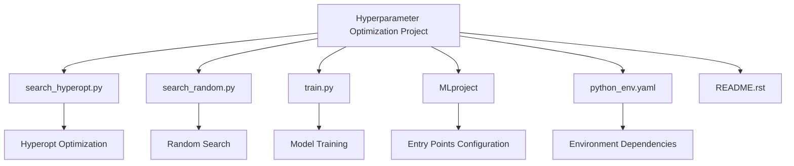
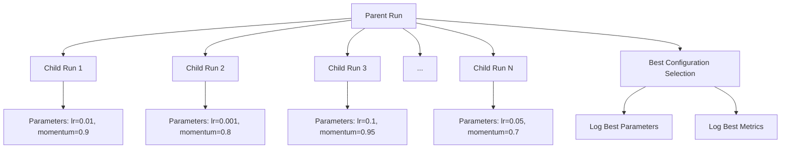
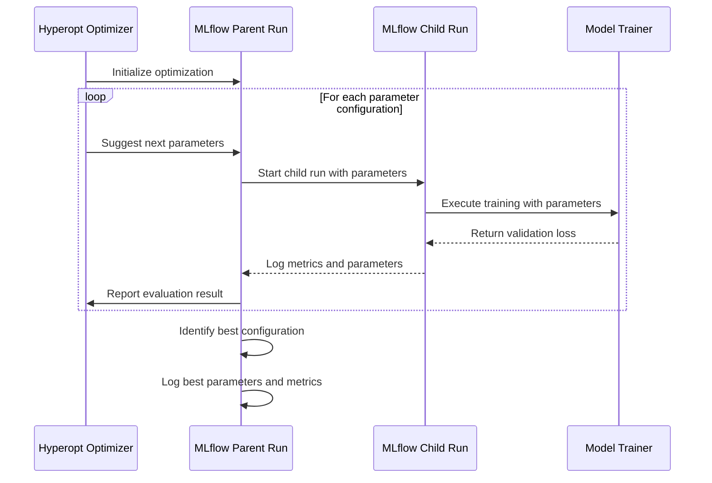
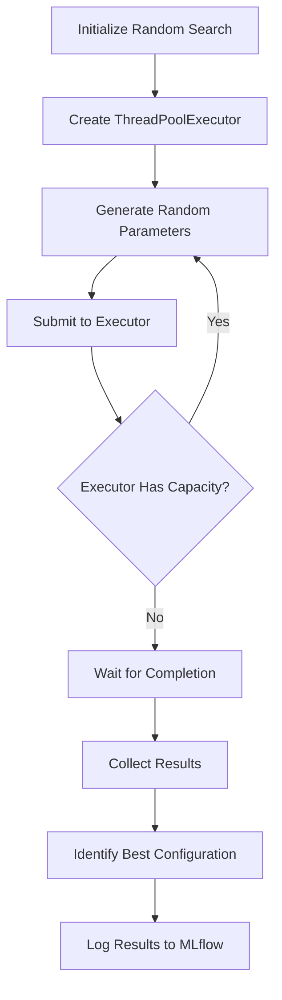
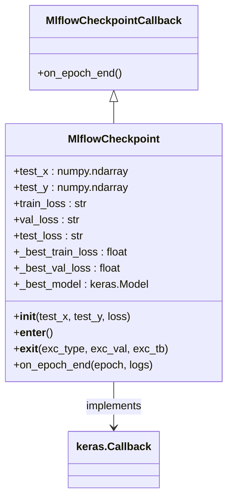
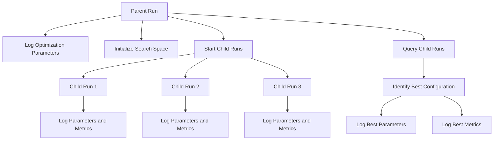

# Hyperparameter Optimization

<cite>
**Referenced Files in This Document**   
- [search_hyperopt.py](file://examples/hyperparam/search_hyperopt.py)
- [search_random.py](file://examples/hyperparam/search_random.py)
- [train.py](file://examples/hyperparam/train.py)
- [MLproject](file://examples/hyperparam/MLproject)
- [python_env.yaml](file://examples/hyperparam/python_env.yaml)
- [README.rst](file://examples/hyperparam/README.rst)
</cite>

## Table of Contents
1. [Introduction](#introduction)
2. [Project Structure](#project-structure)
3. [Core Components](#core-components)
4. [Architecture Overview](#architecture-overview)
5. [Detailed Component Analysis](#detailed-component-analysis)
6. [Hyperparameter Search Strategies](#hyperparameter-search-strategies)
7. [Integration with MLflow Tracking](#integration-with-mlflow-tracking)
8. [Resource Management and Parallel Execution](#resource-management-and-parallel-execution)
9. [Results Analysis and Best Practices](#results-analysis-and-best-practices)
10. [Conclusion](#conclusion)

## Introduction

Hyperparameter optimization is a critical process in machine learning that involves finding the optimal set of hyperparameters for a model to achieve the best performance. This document provides a comprehensive guide to implementing hyperparameter optimization workflows using MLflow with Hyperopt, focusing on distributed hyperparameter tuning, integration with MLflow's autologging capabilities, and effective strategies for managing optimization runs.

The documentation is based on the hyperparameter tuning example provided in the MLflow repository, which demonstrates how to optimize a Keras deep learning model on a wine quality dataset. The example showcases two approaches: random search and Hyperopt-based optimization, both integrated with MLflow for comprehensive experiment tracking and result analysis.

**Section sources**
- [README.rst](file://examples/hyperparam/README.rst#L1-L61)

## Project Structure

The hyperparameter optimization example is organized within the `examples/hyperparam` directory of the MLflow repository. This directory contains all the necessary components for implementing and running hyperparameter optimization experiments.

The project structure consists of:
- **search_hyperopt.py**: Implements hyperparameter optimization using the Hyperopt library
- **search_random.py**: Implements random search for hyperparameter optimization
- **train.py**: Contains the training logic for the Keras model with hyperparameter configuration
- **MLproject**: Defines the project configuration with entry points for different optimization strategies
- **python_env.yaml**: Specifies the Python environment dependencies required for the project
- **README.rst**: Provides documentation and instructions for running the example

The MLproject file defines four entry points: "train" for basic model training, "random" for random search optimization, "hyperopt" for Hyperopt-based optimization, and "main" as a default entry point. This structure enables users to easily switch between different optimization strategies while maintaining consistent experiment tracking through MLflow.

**Diagram sources **
- [MLproject](file://examples/hyperparam/MLproject#L1-L60)
- [python_env.yaml](file://examples/hyperparam/python_env.yaml#L1-L14)

**Section sources**
- [MLproject](file://examples/hyperparam/MLproject#L1-L60)
- [python_env.yaml](file://examples/hyperparam/python_env.yaml#L1-L14)

## Core Components

The hyperparameter optimization workflow consists of three core components that work together to enable effective hyperparameter tuning: the search scripts (search_hyperopt.py and search_random.py), the training script (train.py), and the MLflow integration layer that coordinates experiment tracking.

The search scripts serve as the optimization controllers, managing the hyperparameter search process by defining the search space, invoking the training process with different parameter combinations, and evaluating the results. The training script implements the actual model training logic with configurable hyperparameters, while the MLflow integration ensures that all experiments are properly tracked, logged, and organized for analysis.

These components follow a modular design pattern where the optimization logic is separated from the training logic, allowing for flexibility in choosing different optimization algorithms while maintaining consistent training and evaluation procedures. This separation of concerns enables researchers to experiment with various optimization strategies without modifying the core training code.

**Section sources**
- [search_hyperopt.py](file://examples/hyperparam/search_hyperopt.py#L1-L170)
- [search_random.py](file://examples/hyperparam/search_random.py#L1-L123)
- [train.py](file://examples/hyperparam/train.py#L1-L170)

## Architecture Overview

The hyperparameter optimization architecture follows a hierarchical run structure where a parent run manages multiple child runs, each representing a specific hyperparameter configuration evaluation. This architecture leverages MLflow's nested run capabilities to organize optimization experiments in a logical and traceable manner.

The optimization process begins with a parent run that initializes the search space and optimization parameters. For each hyperparameter configuration to be evaluated, a child run is created that executes the training process with the specified parameters. The results from each child run are then aggregated by the parent run to determine the optimal hyperparameter combination.

This hierarchical structure provides several benefits:
- Clear organization of optimization experiments
- Easy comparison of different hyperparameter configurations
- Efficient tracking of optimization progress
- Simplified identification of the best-performing configuration

The architecture also supports different optimization algorithms through a consistent interface, allowing users to switch between random search, Hyperopt, or other optimization libraries with minimal code changes.

**Diagram sources **
- [search_hyperopt.py](file://examples/hyperparam/search_hyperopt.py#L130-L168)
- [search_random.py](file://examples/hyperparam/search_random.py#L86-L119)

## Detailed Component Analysis

### Hyperopt Search Implementation

The Hyperopt-based search implementation provides a sophisticated approach to hyperparameter optimization using Bayesian optimization techniques. The search_hyperopt.py script implements the optimization process using Hyperopt's Tree of Parzen Estimators (TPE) algorithm, which intelligently explores the hyperparameter space to find optimal configurations.

The implementation defines a search space for two key hyperparameters: learning rate (sampled uniformly between 1e-5 and 1e-1) and momentum (sampled uniformly between 0.0 and 1.0). The optimization process evaluates each configuration by launching a separate MLflow run that trains the model with the specified parameters and returns the validation set loss as the objective function value.

A key feature of this implementation is its use of nested MLflow runs, where each hyperparameter evaluation is conducted as a child run of the parent optimization run. This creates a clear hierarchical structure in the MLflow UI, making it easy to navigate and compare different configurations. The parent run aggregates the results from all child runs and identifies the best-performing configuration based on the validation metric.

**Diagram sources **
- [search_hyperopt.py](file://examples/hyperparam/search_hyperopt.py#L24-L170)

**Section sources**
- [search_hyperopt.py](file://examples/hyperparam/search_hyperopt.py#L1-L170)

### Random Search Implementation

The random search implementation provides a baseline optimization strategy that explores the hyperparameter space through random sampling. Unlike the Hyperopt approach, which uses intelligent sampling based on previous evaluations, random search evaluates parameter configurations independently and without considering past results.

The search_random.py script implements parallel execution capabilities, allowing multiple hyperparameter configurations to be evaluated simultaneously. This is achieved using Python's ThreadPoolExecutor, which manages a pool of worker threads that execute the training process for different parameter combinations concurrently.

The random search implementation shares the same hierarchical run structure as the Hyperopt approach, with a parent run managing multiple child runs. Each child run represents an independent evaluation of a randomly selected hyperparameter configuration. The parent run collects the results from all child runs and determines the best-performing configuration based on the validation metric.

This approach is particularly useful for establishing performance baselines and for cases where the hyperparameter space is relatively small or where parallel computational resources are available. The simplicity of random search also makes it easier to debug and understand compared to more complex optimization algorithms.

**Diagram sources **
- [search_random.py](file://examples/hyperparam/search_random.py#L12-L123)

**Section sources**
- [search_random.py](file://examples/hyperparam/search_random.py#L1-L123)

### Training Script Implementation

The training script (train.py) implements the core model training logic with configurable hyperparameters. It uses a simple Keras deep learning model trained on the wine quality dataset, with two primary hyperparameters: learning rate and momentum.

The script follows a structured training process that includes data preprocessing, model definition, compilation, and training with validation. The model architecture consists of a sequential network with dense layers and ReLU activation functions, designed to predict wine quality based on various chemical properties.

A key feature of the training implementation is the MlflowCheckpoint callback, which extends Keras' Callback class to integrate with MLflow. This callback monitors the validation loss during training and automatically logs the best-performing model to MLflow. When the validation loss improves, the callback saves the current model state and evaluates it on the test set, ensuring that the final logged model represents the best generalization performance.

The training script also implements proper data splitting, dividing the dataset into training (56%), validation (19%), and test (25%) sets. This three-way split allows for proper hyperparameter selection on the validation set while providing an unbiased estimate of model performance on the test set.

**Diagram sources **
- [train.py](file://examples/hyperparam/train.py#L40-L99)

**Section sources**
- [train.py](file://examples/hyperparam/train.py#L1-L170)

## Hyperparameter Search Strategies

### Search Space Configuration

The hyperparameter search space is defined differently in the two optimization approaches. In the Hyperopt implementation, the search space is explicitly defined using Hyperopt's distribution functions, which specify the range and distribution of possible values for each hyperparameter.

For the learning rate parameter, a uniform distribution is used with values ranging from 1e-5 to 1e-1, reflecting the common practice of searching over several orders of magnitude for learning rates. The momentum parameter uses a uniform distribution between 0.0 and 1.0, which is the standard range for momentum values in stochastic gradient descent.

The search space configuration plays a crucial role in the effectiveness of hyperparameter optimization. A well-defined search space should:
- Cover the plausible range of values for each hyperparameter
- Use appropriate distributions (uniform, log-uniform, categorical) based on the parameter type
- Avoid excessively wide ranges that could make optimization inefficient
- Consider known relationships between hyperparameters

Proper search space configuration ensures that the optimization algorithm can efficiently explore the most promising regions of the parameter space, leading to better model performance in fewer evaluations.

**Section sources**
- [search_hyperopt.py](file://examples/hyperparam/search_hyperopt.py#L125-L128)
- [search_random.py](file://examples/hyperparam/search_random.py#L89-L90)

### Objective Function Design

The objective function in hyperparameter optimization defines what metric the algorithm should optimize for. In this implementation, the objective function is designed to minimize the validation set loss (RMSE) while also evaluating the test set performance to verify generalization.

The objective function implementation follows a pattern where each hyperparameter configuration evaluation involves:
1. Starting a nested MLflow run to isolate the evaluation
2. Executing the training process with the specified parameters
3. Retrieving the evaluation metrics from the completed run
4. Returning the validation metric as the optimization objective

A key consideration in objective function design is the trade-off between optimization speed and evaluation accuracy. The implementation includes safeguards to handle failed runs by returning a high loss value, ensuring that the optimization algorithm does not select configurations that failed to train properly.

The objective function also incorporates early stopping logic by evaluating the best model on the test set only when validation performance improves, reducing unnecessary computation while still providing reliable performance estimates.

**Section sources**
- [search_hyperopt.py](file://examples/hyperparam/search_hyperopt.py#L40-L122)
- [search_random.py](file://examples/hyperparam/search_random.py#L40-L85)

## Integration with MLflow Tracking

### Nested Run Hierarchy

The integration with MLflow tracking leverages the nested run hierarchy to organize hyperparameter optimization experiments. The parent run represents the overall optimization process, while each child run corresponds to a specific hyperparameter configuration evaluation.

This hierarchical structure provides several advantages for experiment tracking:
- Clear organization of related experiments
- Easy comparison of different configurations
- Aggregation of results at the parent level
- Simplified identification of the best-performing configuration

The parent run logs metadata about the optimization process, including the search algorithm used, the number of runs evaluated, and the optimization parameters. Each child run logs the specific hyperparameters used, the training metrics, and the evaluation results. The parent run then queries its child runs to identify the best configuration and logs this information as the final result of the optimization process.

This approach creates a comprehensive audit trail of the optimization process, making it easy to reproduce results and understand the decision-making process behind the final model selection.

**Diagram sources **
- [search_hyperopt.py](file://examples/hyperparam/search_hyperopt.py#L130-L168)
- [search_random.py](file://examples/hyperparam/search_random.py#L86-L119)

**Section sources**
- [search_hyperopt.py](file://examples/hyperparam/search_hyperopt.py#L130-L168)
- [search_random.py](file://examples/hyperparam/search_random.py#L86-L119)

### Metric and Parameter Logging

The integration with MLflow includes comprehensive logging of both metrics and parameters for each hyperparameter configuration evaluation. Parameters such as learning rate and momentum are logged at the beginning of each child run, while metrics including training, validation, and test set performance are logged throughout the training process.

The logging implementation follows MLflow's best practices by:
- Using consistent metric names across runs for easy comparison
- Logging parameters before training begins to ensure they are captured even if training fails
- Using step-based logging for time-series metrics like loss curves
- Including both raw metrics and derived metrics (e.g., RMSE from MSE)

The implementation also handles edge cases such as failed runs by logging appropriate status information and using sentinel values for missing metrics. This ensures that the optimization process can continue even when some configurations fail to train properly.

The logged information is structured to support effective analysis in the MLflow UI, with clear parameter names, consistent metric naming, and appropriate data types for filtering and sorting.

**Section sources**
- [search_hyperopt.py](file://examples/hyperparam/search_hyperopt.py#L94-L117)
- [search_random.py](file://examples/hyperparam/search_random.py#L61-L82)
- [train.py](file://examples/hyperparam/train.py#L28-L31)

## Resource Management and Parallel Execution

### Parallel Execution Capabilities

The random search implementation includes built-in support for parallel execution through the use of Python's ThreadPoolExecutor. This allows multiple hyperparameter configurations to be evaluated simultaneously, significantly reducing the total optimization time when computational resources are available.

The parallel execution is configured through the `max_p` parameter, which specifies the maximum number of parallel runs. The implementation creates a thread pool with the specified number of workers and submits each hyperparameter evaluation as a task to the pool. The executor manages the concurrency, ensuring that no more than the specified number of runs are executed simultaneously.

In contrast, the Hyperopt implementation currently does not support parallel execution, as noted in the code comments. This limitation is due to the sequential nature of the TPE algorithm, which uses information from previous evaluations to guide the selection of subsequent configurations. However, this could be addressed in future implementations by using parallelizable optimization algorithms or by implementing asynchronous evaluation with result aggregation.

The choice between parallel and sequential execution depends on several factors, including the available computational resources, the time required for each evaluation, and the characteristics of the optimization algorithm.

**Section sources**
- [search_random.py](file://examples/hyperparam/search_random.py#L28-L29)
- [search_random.py](file://examples/hyperparam/search_random.py#L90-L94)
- [search_hyperopt.py](file://examples/hyperparam/search_hyperopt.py#L11)

### Resource Allocation Strategies

Effective resource allocation is crucial for efficient hyperparameter optimization, especially when computational resources are limited. The implementation provides several mechanisms for managing resource usage:

1. **Batch processing**: The training script allows configuration of batch size, which affects memory usage and training speed.
2. **Epoch control**: The number of training epochs can be specified, allowing trade-offs between training time and model performance.
3. **Parallelism control**: The random search implementation allows control over the number of parallel runs, enabling users to match resource availability.
4. **Early stopping**: The MlflowCheckpoint callback implements early stopping based on validation performance, preventing unnecessary training when performance plateaus.

These resource management features enable users to adapt the optimization process to their specific computational constraints, whether running on a local machine with limited resources or on a cluster with abundant computational power.

Best practices for resource allocation include:
- Starting with a small number of parallel runs and gradually increasing based on resource availability
- Using early stopping to prevent overfitting and reduce training time
- Monitoring resource usage and adjusting batch sizes or parallelism accordingly
- Using validation metrics to guide the allocation of additional resources to promising configurations

**Section sources**
- [train.py](file://examples/hyperparam/train.py#L105-L108)
- [search_random.py](file://examples/hyperparam/search_random.py#L27-L28)
- [search_hyperopt.py](file://examples/hyperparam/search_hyperopt.py#L27-L28)

## Results Analysis and Best Practices

### Analyzing Optimization Results

Analyzing the results of hyperparameter optimization involves several key steps to ensure that the selected configuration represents a genuine improvement in model performance. The MLflow UI provides powerful tools for comparing different runs, including parameter and metric visualization, filtering, and sorting capabilities.

When analyzing optimization results, it's important to consider:
- The consistency of performance across different metrics (training, validation, and test)
- The stability of the optimization process (whether the best configuration was found early or late in the search)
- The trade-offs between different hyperparameter values and their impact on model performance
- The generalization gap between validation and test performance

The hierarchical run structure in MLflow makes it easy to navigate from the parent optimization run to the individual child runs, allowing for detailed examination of specific configurations. Users can compare learning curves, analyze parameter interactions, and identify patterns in the optimization process.

Best practices for results analysis include:
- Verifying that the best configuration performs well on the test set, not just the validation set
- Checking for overfitting by examining the gap between training and validation performance
- Considering the computational cost of different configurations when selecting the final model
- Documenting the rationale for the final model selection

**Section sources**
- [README.rst](file://examples/hyperparam/README.rst#L12-L13)
- [search_hyperopt.py](file://examples/hyperparam/search_hyperopt.py#L144-L165)
- [search_random.py](file://examples/hyperparam/search_random.py#L97-L118)

### Selecting Search Algorithms

Choosing the appropriate search algorithm depends on several factors, including the size of the hyperparameter space, the computational budget, and the characteristics of the model being optimized. The two algorithms demonstrated in this example—random search and Hyperopt—represent different approaches with distinct advantages and limitations.

Random search is simple, reliable, and easily parallelizable. It works well when the hyperparameter space is relatively small or when computational resources allow for a large number of evaluations. Its main advantage is that it can explore the entire search space without bias, making it less likely to get stuck in local optima.

Hyperopt, using the TPE algorithm, is more sophisticated and can often find better configurations with fewer evaluations by learning from previous results. It is particularly effective when the computational cost of each evaluation is high, as it can focus on the most promising regions of the search space. However, it requires sequential evaluation and may be more complex to configure and debug.

When selecting a search algorithm, consider:
- The computational cost of each evaluation
- The availability of parallel computational resources
- The size and complexity of the hyperparameter space
- The need for reproducibility and interpretability
- The time available for optimization

In practice, a hybrid approach may be effective: starting with random search to establish a baseline and explore the search space broadly, followed by more focused optimization with Hyperopt or other intelligent search algorithms.

**Section sources**
- [search_hyperopt.py](file://examples/hyperparam/search_hyperopt.py#L1-L12)
- [search_random.py](file://examples/hyperparam/search_random.py#L9-L10)
- [MLproject](file://examples/hyperparam/MLproject#L21-L51)

## Conclusion

The hyperparameter optimization workflow demonstrated in this example provides a comprehensive framework for systematically exploring hyperparameter spaces and identifying optimal model configurations. By integrating MLflow with Hyperopt and random search, the implementation offers flexible and scalable approaches to hyperparameter tuning that can be adapted to various machine learning tasks and computational environments.

Key takeaways from this implementation include:
- The importance of structured experiment tracking using MLflow's nested run hierarchy
- The value of separating optimization logic from training logic for flexibility and maintainability
- The trade-offs between different search algorithms and the importance of selecting the appropriate approach for the specific use case
- The benefits of comprehensive metric and parameter logging for effective results analysis

The example serves as a template for implementing hyperparameter optimization in machine learning projects, demonstrating best practices for experiment organization, resource management, and results interpretation. By following this approach, practitioners can systematically improve model performance while maintaining clear documentation and reproducibility of their optimization processes.

Future enhancements could include support for additional optimization algorithms, improved parallel execution capabilities for intelligent search methods, and more sophisticated early stopping and resource allocation strategies.

**Section sources**
- [README.rst](file://examples/hyperparam/README.rst#L1-L61)
- [search_hyperopt.py](file://examples/hyperparam/search_hyperopt.py#L1-L170)
- [search_random.py](file://examples/hyperparam/search_random.py#L1-L123)
- [train.py](file://examples/hyperparam/train.py#L1-L170)