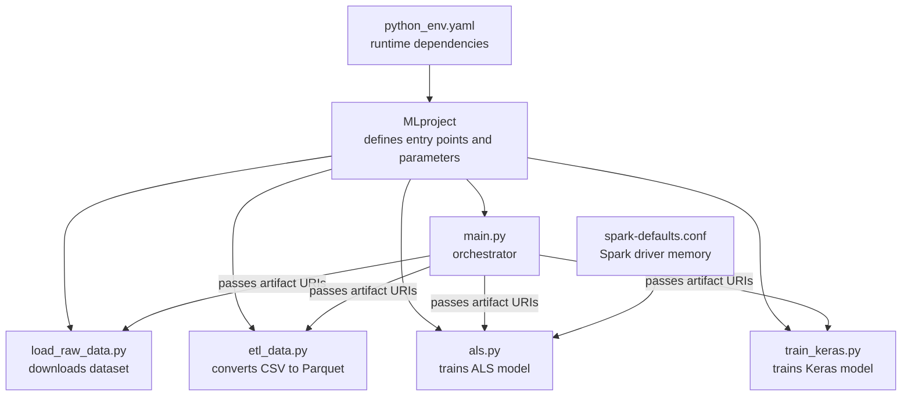
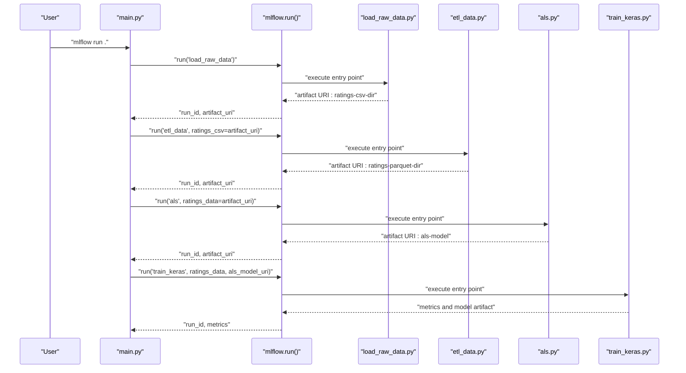
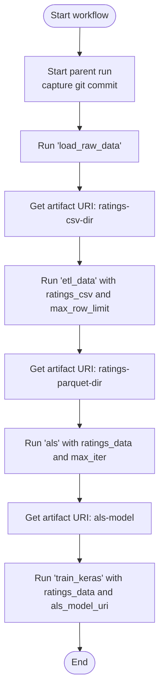
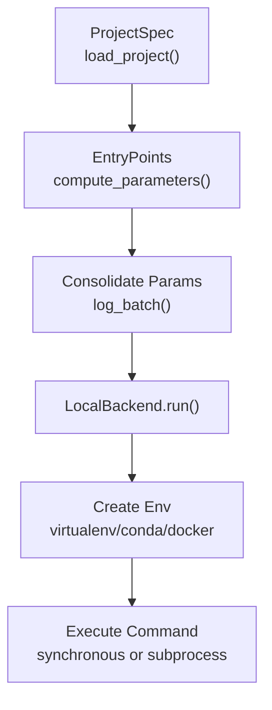

# Workflow Orchestration

<cite>
**Referenced Files in This Document**
- [MLproject](file://examples/multistep_workflow/MLproject)
- [main.py](file://examples/multistep_workflow/main.py)
- [python_env.yaml](file://examples/multistep_workflow/python_env.yaml)
- [load_raw_data.py](file://examples/multistep_workflow/load_raw_data.py)
- [etl_data.py](file://examples/multistep_workflow/etl_data.py)
- [als.py](file://examples/multistep_workflow/als.py)
- [train_keras.py](file://examples/multistep_workflow/train_keras.py)
- [spark-defaults.conf](file://examples/multistep_workflow/spark-defaults.conf)
- [README.rst](file://examples/multistep_workflow/README.rst)
- [mlflow/projects/__init__.py](file://mlflow/projects/__init__.py)
- [mlflow/projects/backend/local.py](file://mlflow/projects/backend/local.py)
- [mlflow/projects/_project_spec.py](file://mlflow/projects/_project_spec.py)
- [mlflow/projects/utils.py](file://mlflow/projects/utils.py)
- [docs/classic-ml/projects/index.mdx](file://docs/classic-ml/projects/index.mdx)
</cite>

## Table of Contents
1. [Introduction](#introduction)
2. [Project Structure](#project-structure)
3. [Core Components](#core-components)
4. [Architecture Overview](#architecture-overview)
5. [Detailed Component Analysis](#detailed-component-analysis)
6. [Dependency Analysis](#dependency-analysis)
7. [Performance Considerations](#performance-considerations)
8. [Troubleshooting Guide](#troubleshooting-guide)
9. [Conclusion](#conclusion)
10. [Appendices](#appendices)

## Introduction
This document explains how to orchestrate multi-step machine learning workflows using MLflow Projects. It focuses on structuring projects with multiple entry points, managing inter-step dependencies, and passing data between stages. It documents the MLproject configuration, environment management via python_env.yaml, chaining experiments using run IDs, and the invocation relationship between the main orchestrator and component scripts. It also covers parameter passing, data path resolution, environment consistency, error propagation, progress monitoring, and debugging failed steps using the multistep_workflow example.

## Project Structure
The multistep_workflow example demonstrates a complete ML pipeline with four steps:
- Entry point “load_raw_data”: downloads the MovieLens dataset and logs it as an artifact.
- Entry point “etl_data”: converts CSV to Parquet using Spark and logs artifacts.
- Entry point “als”: trains a recommendation model with Spark ML and logs the model.
- Entry point “train_keras”: trains a neural network using ALS features and logs the model.
- Entry point “main”: orchestrates the workflow, coordinates steps, and passes artifacts between them.

Key configuration files:
- MLproject defines entry points, parameters, and environment linkage.
- python_env.yaml specifies runtime dependencies for the project.
- spark-defaults.conf sets Spark driver memory for resource-intensive steps.
- main.py implements the orchestrator that invokes steps and manages caching.

**Diagram sources**
- [MLproject](file://examples/multistep_workflow/MLproject#L1-L38)
- [main.py](file://examples/multistep_workflow/main.py#L74-L108)
- [load_raw_data.py](file://examples/multistep_workflow/load_raw_data.py#L1-L44)
- [etl_data.py](file://examples/multistep_workflow/etl_data.py#L1-L44)
- [als.py](file://examples/multistep_workflow/als.py#L1-L71)
- [train_keras.py](file://examples/multistep_workflow/train_keras.py#L1-L118)
- [python_env.yaml](file://examples/multistep_workflow/python_env.yaml#L1-L10)
- [spark-defaults.conf](file://examples/multistep_workflow/spark-defaults.conf#L1-L2)

**Section sources**
- [MLproject](file://examples/multistep_workflow/MLproject#L1-L38)
- [main.py](file://examples/multistep_workflow/main.py#L74-L108)
- [README.rst](file://examples/multistep_workflow/README.rst#L1-L65)

## Core Components
- MLproject: Declares entry points with typed parameters and commands. It links to python_env.yaml for environment management.
- Orchestrator (main.py): Starts a parent run, computes git commit for cache matching, and invokes steps via mlflow.run. It resolves artifact URIs produced by prior steps and passes them downstream.
- Steps:
  - load_raw_data.py: Downloads dataset and logs an artifact directory.
  - etl_data.py: Reads CSV, filters and writes Parquet, logs artifacts.
  - als.py: Reads Parquet, splits data, fits ALS model, logs metrics and model.
  - train_keras.py: Loads ALS model, joins features, builds and trains Keras model, logs metrics and model.

Environment and configuration:
- python_env.yaml: Declares build/runtime dependencies for the project.
- spark-defaults.conf: Overrides Spark driver memory for the ALS step.

**Section sources**
- [MLproject](file://examples/multistep_workflow/MLproject#L1-L38)
- [main.py](file://examples/multistep_workflow/main.py#L74-L108)
- [load_raw_data.py](file://examples/multistep_workflow/load_raw_data.py#L1-L44)
- [etl_data.py](file://examples/multistep_workflow/etl_data.py#L1-L44)
- [als.py](file://examples/multistep_workflow/als.py#L1-L71)
- [train_keras.py](file://examples/multistep_workflow/train_keras.py#L1-L118)
- [python_env.yaml](file://examples/multistep_workflow/python_env.yaml#L1-L10)
- [spark-defaults.conf](file://examples/multistep_workflow/spark-defaults.conf#L1-L2)

## Architecture Overview
The orchestrator coordinates four steps in sequence. Each step is an MLflow entry point that runs independently. Artifacts produced by earlier steps become inputs for subsequent steps. The orchestrator ensures environment consistency by reusing the same experiment and environment configuration across runs.

**Diagram sources**
- [main.py](file://examples/multistep_workflow/main.py#L74-L108)
- [load_raw_data.py](file://examples/multistep_workflow/load_raw_data.py#L1-L44)
- [etl_data.py](file://examples/multistep_workflow/etl_data.py#L1-L44)
- [als.py](file://examples/multistep_workflow/als.py#L1-L71)
- [train_keras.py](file://examples/multistep_workflow/train_keras.py#L1-L118)

## Detailed Component Analysis

### MLproject Configuration
- Defines the project name and links to python_env.yaml for environment management.
- Declares multiple entry points with typed parameters and commands:
  - load_raw_data: no parameters.
  - etl_data: accepts ratings_csv and max_row_limit.
  - als: accepts ratings_data, max_iter, reg_param, rank.
  - train_keras: accepts ratings_data, als_model_uri, hidden_units.
  - main: orchestrator entry point with parameters for tuning steps.

Parameter typing and defaults enable robust chaining and reproducibility.

**Section sources**
- [MLproject](file://examples/multistep_workflow/MLproject#L1-L38)

### Environment Management with python_env.yaml
- python_env.yaml declares build_dependencies and dependencies for the project.
- When env_manager is not explicitly specified, MLflow detects python_env.yaml and uses virtualenv to create an isolated environment for each run.
- Ensures consistent dependencies across steps, preventing drift between runs.

**Section sources**
- [python_env.yaml](file://examples/multistep_workflow/python_env.yaml#L1-L10)
- [mlflow/projects/backend/local.py](file://mlflow/projects/backend/local.py#L138-L178)

### Orchestrator main.py
- Starts a parent run and captures the git commit tag to enable cache matching across runs.
- Implements a cache-checking routine that searches for previously successful runs with matching entry point, parameters, and commit.
- Uses mlflow.run to launch each step, passing artifact URIs produced by prior steps as parameters.
- Sets SPARK_CONF_DIR to point to the project directory to pick up spark-defaults.conf for the ALS step.

**Diagram sources**
- [main.py](file://examples/multistep_workflow/main.py#L74-L108)

**Section sources**
- [main.py](file://examples/multistep_workflow/main.py#L74-L108)
- [spark-defaults.conf](file://examples/multistep_workflow/spark-defaults.conf#L1-L2)

### Data Passing Between Steps
- Each step logs artifacts to a named directory (e.g., ratings-csv-dir, ratings-parquet-dir, als-model).
- The orchestrator constructs artifact URIs from the previous run’s artifact_uri and the expected directory name, then passes them as parameters to the next step.
- This approach decouples steps while preserving explicit data dependencies.

**Section sources**
- [main.py](file://examples/multistep_workflow/main.py#L82-L103)
- [load_raw_data.py](file://examples/multistep_workflow/load_raw_data.py#L1-L44)
- [etl_data.py](file://examples/multistep_workflow/etl_data.py#L1-L44)
- [als.py](file://examples/multistep_workflow/als.py#L1-L71)
- [train_keras.py](file://examples/multistep_workflow/train_keras.py#L1-L118)

### Parameter Propagation and Type Safety
- MLproject defines parameter types and defaults for each entry point.
- The orchestrator passes parameters explicitly to each step, ensuring type safety and reproducibility.
- The Python API consolidates and logs parameters for each run.

**Section sources**
- [MLproject](file://examples/multistep_workflow/MLproject#L1-L38)
- [mlflow/projects/utils.py](file://mlflow/projects/utils.py#L292-L309)

### Step-by-Step Breakdown

#### ETL Step (etl_data.py)
- Reads CSV from the provided path, drops unused columns, applies row limit, and writes Parquet.
- Logs artifacts to a directory for downstream consumption.

**Section sources**
- [etl_data.py](file://examples/multistep_workflow/etl_data.py#L1-L44)

#### ALS Step (als.py)
- Reads Parquet, splits into train/test, fits ALS model, evaluates metrics, and logs the model.
- Uses Spark ML and logs metrics and model artifacts.

**Section sources**
- [als.py](file://examples/multistep_workflow/als.py#L1-L71)

#### Keras Training Step (train_keras.py)
- Loads the ALS model, joins user/item factors with ratings, prepares features, builds a Keras model, trains, evaluates, and logs metrics and model.

**Section sources**
- [train_keras.py](file://examples/multistep_workflow/train_keras.py#L1-L118)

## Dependency Analysis
- Project loading and entry point resolution:
  - MLproject is parsed to discover entry points and environment configuration.
  - Parameters are consolidated and validated before execution.
- Backend execution:
  - Local backend creates environments (virtualenv/conda/docker) and executes commands synchronously or via subprocess.
  - Environment consistency is ensured by selecting the appropriate env manager based on project env type.

**Diagram sources**
- [mlflow/projects/_project_spec.py](file://mlflow/projects/_project_spec.py#L177-L221)
- [mlflow/projects/utils.py](file://mlflow/projects/utils.py#L292-L309)
- [mlflow/projects/backend/local.py](file://mlflow/projects/backend/local.py#L1-L200)

**Section sources**
- [mlflow/projects/_project_spec.py](file://mlflow/projects/_project_spec.py#L177-L221)
- [mlflow/projects/utils.py](file://mlflow/projects/utils.py#L292-L309)
- [mlflow/projects/backend/local.py](file://mlflow/projects/backend/local.py#L1-L200)

## Performance Considerations
- Resource allocation: The ALS step benefits from increased Spark driver memory via spark-defaults.conf.
- Data size control: The ETL step supports limiting rows to reduce compute overhead during development.
- Caching: The orchestrator avoids redundant runs by matching entry point, parameters, and git commit, reducing total runtime.

**Section sources**
- [spark-defaults.conf](file://examples/multistep_workflow/spark-defaults.conf#L1-L2)
- [etl_data.py](file://examples/multistep_workflow/etl_data.py#L1-L44)
- [main.py](file://examples/multistep_workflow/main.py#L20-L58)

## Troubleshooting Guide
Common issues and resolutions:
- Data path resolution:
  - Ensure artifact URIs are constructed from the previous run’s artifact_uri plus the expected directory name.
  - Verify that the step that produces artifacts logs them to the expected directory.
- Environment consistency:
  - python_env.yaml ensures consistent dependencies across steps.
  - When using local backend, MLflow selects virtualenv for python_env projects; confirm env_manager alignment.
- Error propagation:
  - The Python API marks runs as FAILED if a step fails; use synchronous execution or wait on SubmittedRun to detect failures.
  - Inspect run status and logs in the tracking server.
- Monitoring progress:
  - Use mlflow server to visualize runs and metrics.
  - Enable verbose logging by setting MLFLOW_LOGGING_LEVEL to DEBUG.

**Section sources**
- [main.py](file://examples/multistep_workflow/main.py#L74-L108)
- [mlflow/projects/__init__.py](file://mlflow/projects/__init__.py#L377-L410)
- [docs/classic-ml/projects/index.mdx](file://docs/classic-ml/projects/index.mdx#L696-L767)

## Conclusion
The multistep_workflow example demonstrates a robust pattern for orchestrating ML pipelines with MLflow Projects. By defining clear entry points, managing environments consistently, and explicitly passing artifacts between steps, teams can build reproducible, modular workflows. The orchestrator’s caching mechanism and parameter typing further enhance reliability and maintainability.

## Appendices

### MLproject Entry Points Reference
- load_raw_data: No parameters; downloads dataset and logs an artifact directory.
- etl_data: ratings_csv (path), max_row_limit (int, default).
- als: ratings_data (path), max_iter (int, default), reg_param (float, default), rank (int, default).
- train_keras: ratings_data (path), als_model_uri (string), hidden_units (int, default).
- main: orchestrator with als_max_iter, keras_hidden_units, max_row_limit.

**Section sources**
- [MLproject](file://examples/multistep_workflow/MLproject#L1-L38)

### Environment Configuration Notes
- python_env.yaml: Declares build_dependencies and dependencies for the project.
- Local backend behavior:
  - If python_env.yaml is present, MLflow uses virtualenv to create an environment.
  - Conda environments are supported via conda.yaml; mixing conda with python_env is not allowed for the local backend.

**Section sources**
- [python_env.yaml](file://examples/multistep_workflow/python_env.yaml#L1-L10)
- [mlflow/projects/backend/local.py](file://mlflow/projects/backend/local.py#L101-L108)