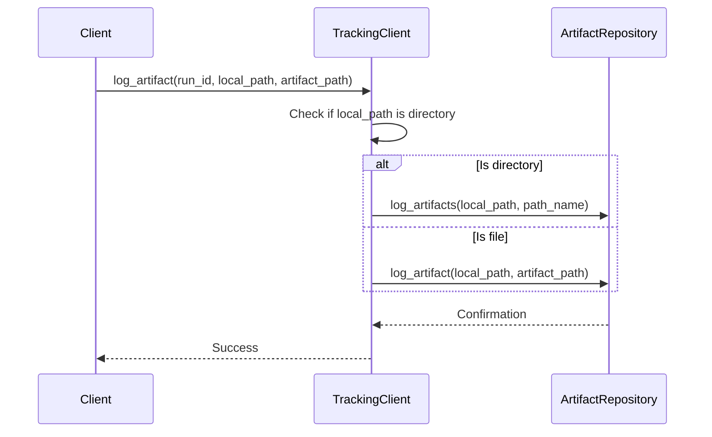
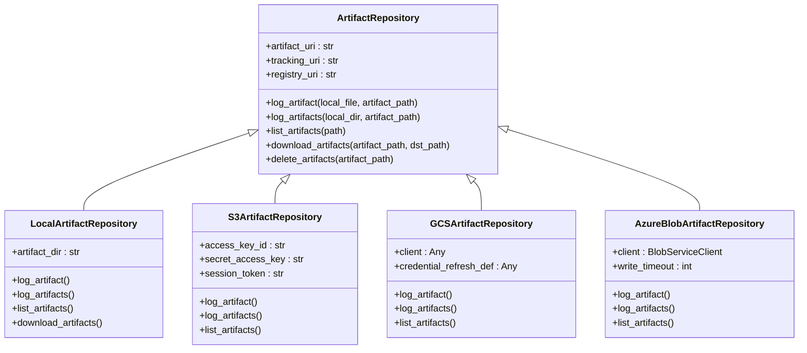
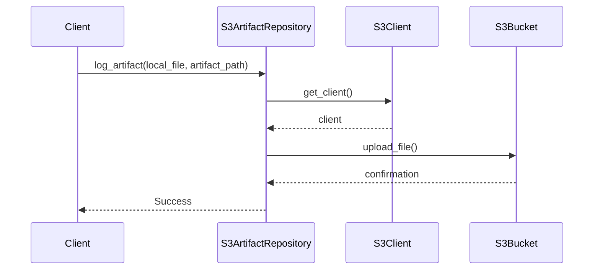
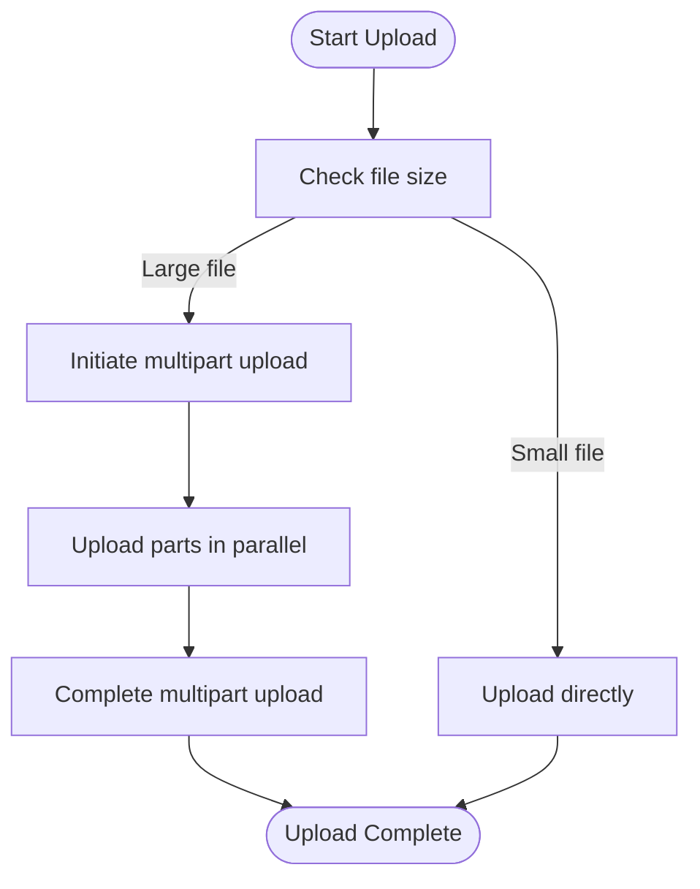
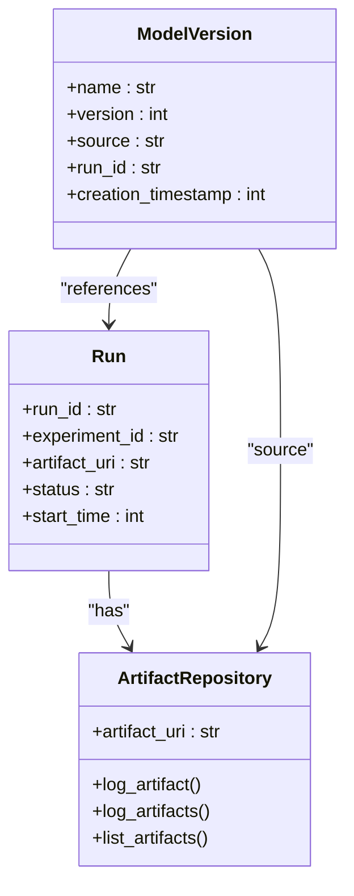

# Artifact Storage

<cite>
**Referenced Files in This Document**   
- [client.py](file://mlflow/tracking/_tracking_service/client.py)
- [artifact_repo.py](file://mlflow/store/artifact/artifact_repo.py)
- [local_artifact_repo.py](file://mlflow/store/artifact/local_artifact_repo.py)
- [s3_artifact_repo.py](file://mlflow/store/artifact/s3_artifact_repo.py)
- [gcs_artifact_repo.py](file://mlflow/store/artifact/gcs_artifact_repo.py)
- [azure_blob_artifact_repo.py](file://mlflow/store/artifact/azure_blob_artifact_repo.py)
- [artifact_repository_registry.py](file://mlflow/store/artifact/artifact_repository_registry.py)
- [presigned_url_artifact_repo.py](file://mlflow/store/artifact/presigned_url_artifact_repo.py)
- [azure_data_lake_artifact_repo.py](file://mlflow/store/artifact/azure_data_lake_artifact_repo.py)
- [databricks_artifact_repo.py](file://mlflow/store/artifact/databricks_artifact_repo.py)
- [models_artifact_repo.py](file://mlflow/store/artifact/models_artifact_repo.py)
- [dbfs_artifact_repo.py](file://mlflow/store/artifact/dbfs_artifact_repo.py)
- [http_artifact_repo.py](file://mlflow/store/artifact/http_artifact_repo.py)
- [ftp_artifact_repo.py](file://mlflow/store/artifact/ftp_artifact_repo.py)
- [hdfs_artifact_repo.py](file://mlflow/store/artifact/hdfs_artifact_repo.py)
</cite>

## Table of Contents
1. [Introduction](#introduction)
2. [Core Artifact Storage API](#core-artifact-storage-api)
3. [Artifact Repository Implementations](#artifact-repository-implementations)
4. [Large File and Directory Support](#large-file-and-directory-support)
5. [Configuration and Environment Variables](#configuration-and-environment-variables)
6. [Relationships with Runs and Models](#relationships-with-runs-and-models)
7. [Common Issues and Best Practices](#common-issues-and-best-practices)
8. [Conclusion](#conclusion)

## Introduction

MLflow provides a comprehensive artifact storage system that enables tracking, versioning, and management of machine learning artifacts such as models, datasets, and other files generated during the ML lifecycle. The artifact storage system is designed to be flexible, supporting multiple storage backends while providing a consistent API for storing and retrieving artifacts.

The core functionality revolves around the `log_artifact()` and `log_artifacts()` methods, which allow users to store individual files or entire directories as artifacts associated with MLflow runs. These artifacts can include model checkpoints, training datasets, evaluation results, and any other files relevant to the machine learning workflow.

MLflow's artifact storage architecture is built on a pluggable repository system that supports various storage backends including local filesystem, Amazon S3, Google Cloud Storage (GCS), Azure Blob Storage, and others. This flexibility allows organizations to choose the storage solution that best fits their infrastructure and requirements.

**Section sources**
- [client.py](file://mlflow/tracking/_tracking_service/client.py#L658-L688)

## Core Artifact Storage API

The MLflow artifact storage API provides methods for logging, retrieving, and managing artifacts associated with MLflow runs. The primary methods are `log_artifact()` for individual files and `log_artifacts()` for directories.

The `log_artifact()` method takes a local file path and uploads it to the configured artifact storage location. It accepts an optional `artifact_path` parameter that specifies the directory within the run's artifact directory where the file should be stored. This allows for organizing artifacts in a hierarchical structure.

**Diagram sources**
- [client.py](file://mlflow/tracking/_tracking_service/client.py#L658-L675)

The `log_artifacts()` method handles directory uploads by recursively traversing the directory structure and uploading each file. It preserves the directory hierarchy in the artifact storage, making it easy to organize complex artifact structures.

The artifact repository system is designed with extensibility in mind, using an abstract base class `ArtifactRepository` that defines the core interface for all storage implementations. This interface includes methods for:
- `log_artifact()`: Upload a single file
- `log_artifacts()`: Upload a directory of files
- `list_artifacts()`: List artifacts at a given path
- `download_artifacts()`: Download artifacts to a local directory
- `delete_artifacts()`: Remove artifacts from storage

**Section sources**
- [artifact_repo.py](file://mlflow/store/artifact/artifact_repo.py#L127-L167)
- [client.py](file://mlflow/tracking/_tracking_service/client.py#L658-L675)

## Artifact Repository Implementations

MLflow supports multiple artifact repository implementations through a registry-based system that maps URI schemes to specific repository classes. The `ArtifactRepositoryRegistry` maintains this mapping and instantiates the appropriate repository based on the artifact URI scheme.

**Diagram sources**
- [artifact_repo.py](file://mlflow/store/artifact/artifact_repo.py#L73-L477)
- [artifact_repository_registry.py](file://mlflow/store/artifact/artifact_repository_registry.py#L24-L125)

### Local File System Storage

The `LocalArtifactRepository` stores artifacts on the local filesystem using standard file operations. It converts the artifact URI to a local path and uses `shutil` for file operations. This implementation is suitable for development and testing environments.

### Amazon S3 Storage

The `S3ArtifactRepository` provides integration with Amazon S3 and S3-compatible storage systems. It uses the boto3 library for S3 operations and supports various authentication methods including AWS credentials, IAM roles, and environment variables.

**Diagram sources**
- [s3_artifact_repo.py](file://mlflow/store/artifact/s3_artifact_repo.py#L138-L200)

### Google Cloud Storage

The `GCSArtifactRepository` enables artifact storage on Google Cloud Storage. It uses the google-cloud-storage library and supports authentication through default credentials, service account keys, or OAuth tokens.

### Azure Blob Storage

The `AzureBlobArtifactRepository` provides integration with Azure Blob Storage using the wasbs:// URI scheme. It supports authentication through connection strings, access keys, or DefaultAzureCredential.

### Other Storage Implementations

Additional implementations include:
- `HttpArtifactRepository`: For HTTP/HTTPS endpoints
- `FtpArtifactRepository`: For FTP servers
- `HdfsArtifactRepository`: For Hadoop Distributed File System
- `DbfsArtifactRepository`: For Databricks File System
- `ModelsArtifactRepository`: For model registry artifacts

**Section sources**
- [local_artifact_repo.py](file://mlflow/store/artifact/local_artifact_repo.py#L22-L143)
- [s3_artifact_repo.py](file://mlflow/store/artifact/s3_artifact_repo.py#L138-L200)
- [gcs_artifact_repo.py](file://mlflow/store/artifact/gcs_artifact_repo.py#L36-L200)
- [azure_blob_artifact_repo.py](file://mlflow/store/artifact/azure_blob_artifact_repo.py#L32-L200)
- [artifact_repository_registry.py](file://mlflow/store/artifact/artifact_repository_registry.py#L105-L125)

## Large File and Directory Support

MLflow's artifact storage system is designed to handle large files and complex directory structures efficiently. The system supports both single-file uploads and multipart uploads for large files, with automatic content type detection and configurable upload parameters.

For large files, MLflow implements multipart upload functionality through the `MultipartUploadMixin` interface. This allows breaking large files into smaller chunks that can be uploaded in parallel, improving upload reliability and performance.

**Diagram sources**
- [artifact_repo.py](file://mlflow/store/artifact/artifact_repo.py#L417-L470)
- [s3_artifact_repo.py](file://mlflow/store/artifact/s3_artifact_repo.py#L138-L200)

The system also supports parallel operations for improved performance when dealing with multiple files or large directories. The `ArtifactRepository` base class includes a thread pool that limits the number of concurrent operations based on available CPU resources, preventing resource exhaustion.

Directory uploads are handled recursively, preserving the original directory structure in the artifact storage. Empty directories are also preserved through the use of placeholder files or directory markers, ensuring that the complete directory structure is maintained.

**Section sources**
- [artifact_repo.py](file://mlflow/store/artifact/artifact_repo.py#L167-L176)
- [local_artifact_repo.py](file://mlflow/store/artifact/local_artifact_repo.py#L59-L70)

## Configuration and Environment Variables

MLflow's artifact storage system can be configured through various environment variables that control authentication, performance, and behavior. These variables provide flexibility in adapting the system to different environments and requirements.

### S3 Configuration

For S3 storage, the following environment variables are available:
- `AWS_ACCESS_KEY_ID`: AWS access key ID for authentication
- `AWS_SECRET_ACCESS_KEY`: AWS secret access key for authentication
- `AWS_SESSION_TOKEN`: AWS session token for temporary credentials
- `AWS_DEFAULT_REGION`: Default AWS region for S3 operations
- `MLFLOW_S3_ENDPOINT_URL`: Custom S3 endpoint URL (for S3-compatible storage)
- `MLFLOW_S3_IGNORE_TLS`: Set to 'true' to disable TLS verification
- `MLFLOW_S3_UPLOAD_EXTRA_ARGS`: JSON string of extra arguments for S3 uploads
- `MLFLOW_BOTO_CLIENT_ADDRESSING_STYLE`: S3 addressing style ('path' or 'virtual')

### GCS Configuration

For Google Cloud Storage:
- `MLFLOW_GCS_DOWNLOAD_CHUNK_SIZE`: Chunk size for GCS downloads
- `MLFLOW_GCS_UPLOAD_CHUNK_SIZE`: Chunk size for GCS uploads
- `MLFLOW_ARTIFACT_UPLOAD_DOWNLOAD_TIMEOUT`: Timeout for upload/download operations

### Azure Configuration

For Azure Blob Storage:
- `AZURE_STORAGE_CONNECTION_STRING`: Azure storage connection string
- `AZURE_STORAGE_ACCESS_KEY`: Azure storage access key
- `MLFLOW_ARTIFACT_UPLOAD_DOWNLOAD_TIMEOUT`: Timeout for upload/download operations

### General Configuration

Shared configuration options:
- `MLFLOW_TRACKING_URI`: URI of the MLflow tracking server
- `MLFLOW_REGISTRY_URI`: URI of the MLflow model registry

**Section sources**
- [s3_artifact_repo.py](file://mlflow/store/artifact/s3_artifact_repo.py#L149-L157)
- [gcs_artifact_repo.py](file://mlflow/store/artifact/gcs_artifact_repo.py#L15-L19)
- [azure_blob_artifact_repo.py](file://mlflow/store/artifact/azure_blob_artifact_repo.py#L14-L15)

## Relationships with Runs and Models

Artifacts in MLflow are closely integrated with runs and models, forming a cohesive system for tracking machine learning experiments and their outputs.

Each MLflow run has an associated artifact URI that defines the storage location for its artifacts. When a run is created, the tracking service determines the appropriate artifact repository based on the run's artifact URI scheme. This repository is then used for all artifact operations related to that run.

**Diagram sources**
- [client.py](file://mlflow/tracking/_tracking_service/client.py#L628-L656)
- [artifact_repository_registry.py](file://mlflow/store/artifact/artifact_repository_registry.py#L105-L125)

The model registry system also leverages artifact storage, with model versions pointing to artifacts stored in the artifact repository. When a model is registered, the source path typically references artifacts from a specific run, creating a traceable lineage from experiment to production model.

This integration enables powerful features such as:
- Model versioning with complete artifact history
- Reproducibility through artifact provenance
- Experiment comparison based on artifact differences
- Automated model deployment from artifact storage

**Section sources**
- [client.py](file://mlflow/tracking/_tracking_service/client.py#L628-L656)
- [artifact_repository_registry.py](file://mlflow/store/artifact/artifact_repository_registry.py#L105-L125)

## Common Issues and Best Practices

### Storage Costs Management

Large artifact storage can lead to significant costs, especially with cloud storage providers. To manage costs effectively:

1. **Implement lifecycle policies**: Configure automatic deletion or archival of old artifacts
2. **Use appropriate storage classes**: Move infrequently accessed artifacts to cheaper storage tiers
3. **Compress artifacts**: Compress large files before logging to reduce storage footprint
4. **Selective logging**: Only log essential artifacts needed for reproducibility and analysis

### Access Control

Proper access control is crucial for security and compliance:

1. **Use IAM roles and policies**: Implement least-privilege access for cloud storage
2. **Enable encryption**: Use server-side encryption for sensitive artifacts
3. **Audit access**: Enable logging and monitoring of artifact access patterns
4. **Secure credentials**: Use secure credential management practices

### Performance Optimization

For optimal performance with large artifacts:

1. **Configure appropriate chunk sizes**: Adjust upload/download chunk sizes based on network conditions
2. **Use parallel operations**: Leverage MLflow's built-in parallelism for directory operations
3. **Monitor timeouts**: Configure appropriate timeouts for large file operations
4. **Cache frequently accessed artifacts**: Implement local caching for frequently accessed artifacts

### Best Practices

1. **Organize artifacts logically**: Use meaningful directory structures and naming conventions
2. **Document artifact contents**: Include README files or metadata describing artifact contents
3. **Version control artifacts**: Use consistent versioning schemes for model artifacts
4. **Validate artifact integrity**: Implement checksums or validation for critical artifacts
5. **Monitor storage usage**: Track storage growth and set alerts for unexpected increases

**Section sources**
- [s3_artifact_repo.py](file://mlflow/store/artifact/s3_artifact_repo.py#L65-L70)
- [gcs_artifact_repo.py](file://mlflow/store/artifact/gcs_artifact_repo.py#L60-L64)
- [azure_blob_artifact_repo.py](file://mlflow/store/artifact/azure_blob_artifact_repo.py#L53-L54)

## Conclusion

MLflow's artifact storage system provides a robust and flexible solution for managing machine learning artifacts across various storage backends. The system's pluggable architecture supports multiple storage providers while maintaining a consistent API for artifact operations.

Key strengths of the system include:
- Support for multiple storage backends (local, S3, GCS, Azure, etc.)
- Efficient handling of large files and directory structures
- Integration with runs and model registry for complete lineage tracking
- Configurable performance and security settings
- Extensible design that allows for custom repository implementations

By following best practices for cost management, access control, and performance optimization, organizations can effectively leverage MLflow's artifact storage capabilities to support their machine learning workflows while maintaining security, compliance, and cost efficiency.

The system's design enables seamless integration into existing ML workflows, providing a reliable foundation for experiment tracking, model versioning, and reproducible machine learning.