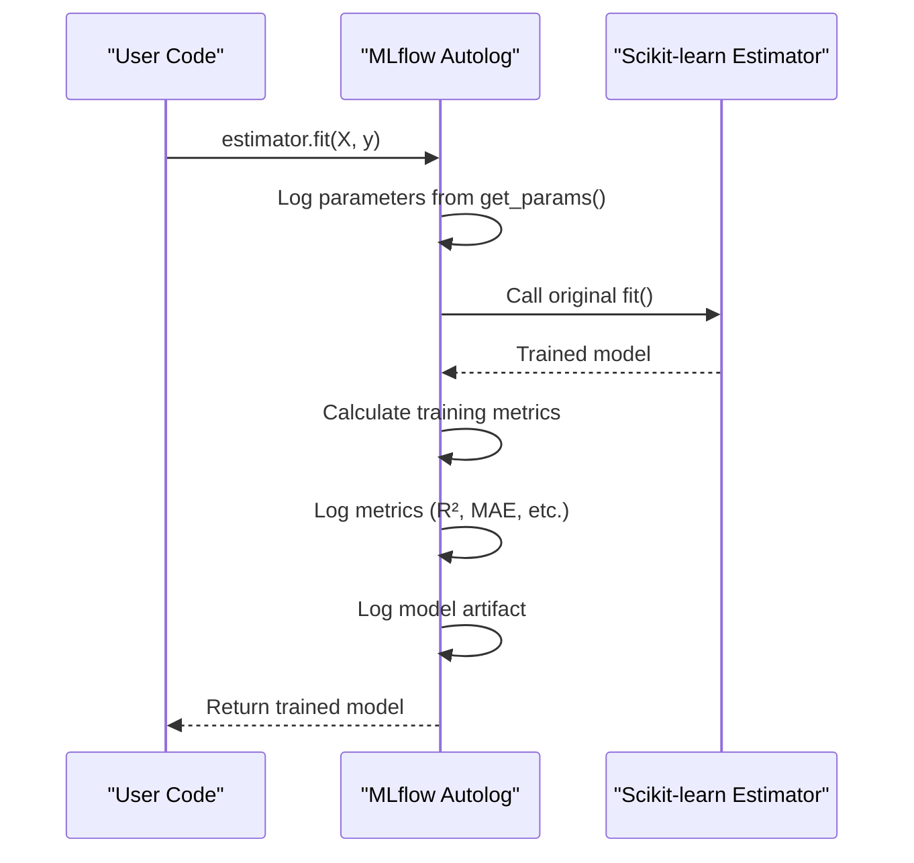
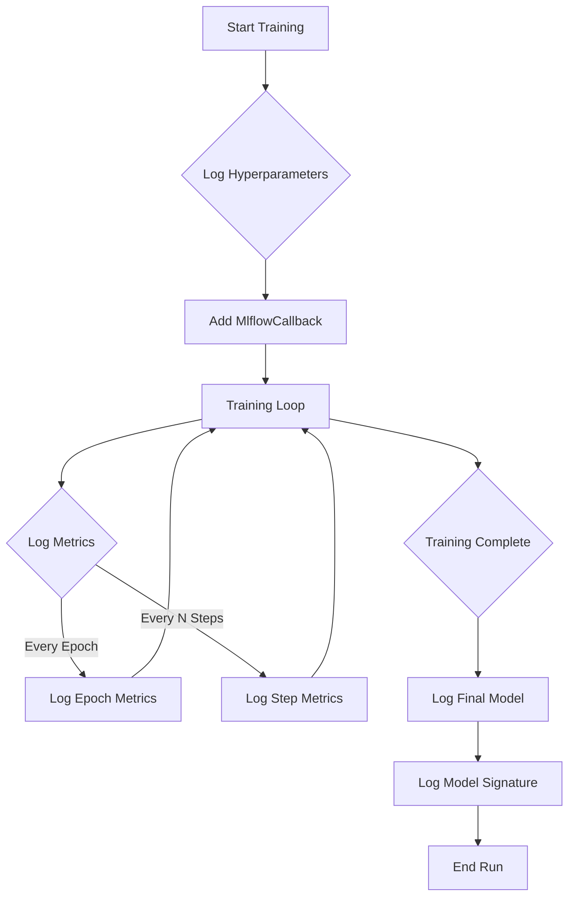
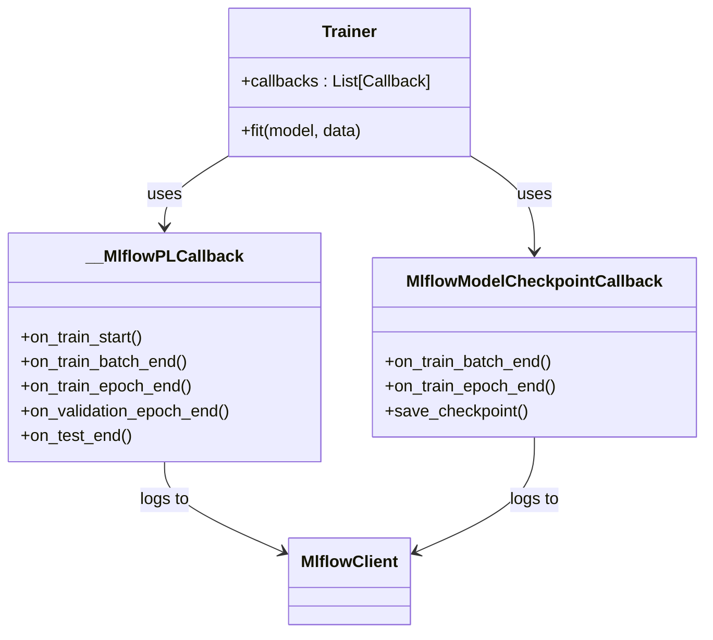
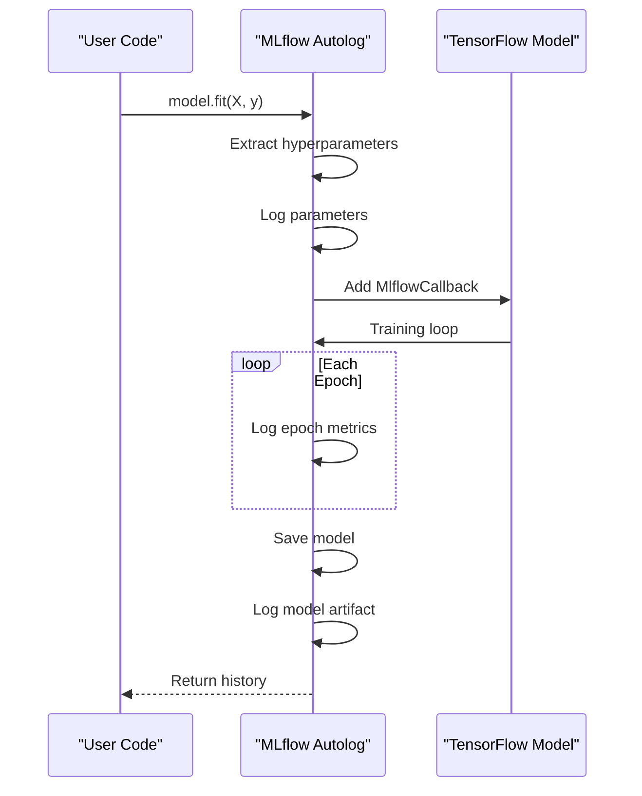
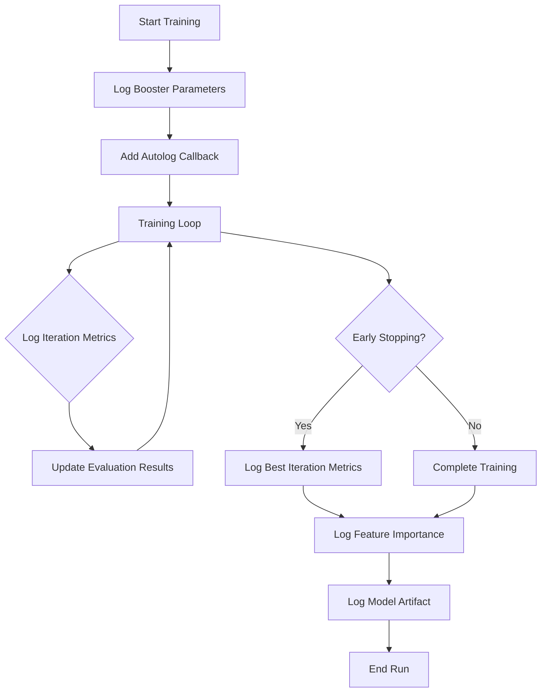

# Autologging

<cite>
**Referenced Files in This Document**   
- [mlflow/tracking/fluent.py](file://mlflow/tracking/fluent.py)
- [mlflow/sklearn/__init__.py](file://mlflow/sklearn/__init__.py)
- [mlflow/keras/autologging.py](file://mlflow/keras/autologging.py)
- [mlflow/pytorch/_pytorch_autolog.py](file://mlflow/pytorch/_pytorch_autolog.py)
- [mlflow/pytorch/_lightning_autolog.py](file://mlflow/pytorch/_lightning_autolog.py)
- [mlflow/tensorflow/__init__.py](file://mlflow/tensorflow/__init__.py)
- [mlflow/xgboost/__init__.py](file://mlflow/xgboost/__init__.py)
- [mlflow/utils/autologging_utils/safety.py](file://mlflow/utils/autologging_utils/safety.py)
</cite>

## Table of Contents
1. [Introduction](#introduction)
2. [Core Autologging Mechanism](#core-autologging-mechanism)
3. [Framework-Specific Implementations](#framework-specific-implementations)
   - [Scikit-learn](#scikit-learn)
   - [Keras](#keras)
   - [PyTorch](#pytorch)
   - [TensorFlow](#tensorflow)
   - [XGBoost](#xgboost)
4. [Configuration and Activation](#configuration-and-activation)
5. [Integration with Model Registry and Experiment Tracking](#integration-with-model-registry-and-experiment-tracking)
6. [Common Issues and Best Practices](#common-issues-and-best-practices)
7. [Conclusion](#conclusion)

## Introduction
Autologging in MLflow is a powerful feature that automatically captures parameters, metrics, and models from popular machine learning frameworks without requiring modifications to the existing training code. This system simplifies the experiment tracking process by eliminating the need for manual logging calls, thereby reducing boilerplate code and minimizing the risk of human error. The autologging system is designed to work seamlessly with various ML frameworks, providing a consistent interface for logging while preserving the native functionality of each framework. This document provides a comprehensive overview of the autologging implementation, detailing its architecture, framework-specific integrations, configuration options, and best practices for effective usage.

## Core Autologging Mechanism

The autologging system in MLflow operates through a sophisticated patching mechanism that intercepts key function calls within ML frameworks to automatically log relevant information. At its core, the system uses the `safe_patch` utility from `mlflow.utils.autologging_utils` to dynamically replace original framework functions with instrumented versions that perform logging before or after executing the original logic. This approach allows MLflow to capture parameters, metrics, and model artifacts without requiring users to modify their training code.

The system is governed by a global configuration stored in the `AUTOLOGGING_INTEGRATIONS` dictionary, which tracks the state and settings for each enabled framework integration. When `mlflow.autolog()` is called, it configures the global settings that are then inherited by framework-specific autolog functions unless they are explicitly called with different parameters. The `autologging_integration` decorator is used to define autolog functions for each framework, ensuring they are properly registered and can be managed by the core autologging system.

A critical component of the autologging mechanism is the `AutologgingSessionManager` class, which tracks active autologging sessions to prevent conflicts and ensure proper cleanup. This manager uses thread-local storage to maintain session state and provides context managers for safely starting and ending autologging sessions. The system also includes safety features such as exception handling and cleanup callbacks to ensure that even if an error occurs during autologging, the original framework functionality remains intact and resources are properly released.

```mermaid
graph TD
A[User Code] --> B[Framework Function Call]
B --> C{Autologging Enabled?}
C --> |Yes| D[Intercepted by MLflow Patch]
C --> |No| E[Original Framework Function]
D --> F[Log Parameters/Metrics]
F --> G[Execute Original Function]
G --> H[Log Model Artifacts]
H --> I[Return Result]
E --> I
J[mlflow.autolog()] --> K[Global Configuration]
K --> L[Framework-Specific Settings]
L --> D
M[AutologgingSessionManager] --> N[Track Active Sessions]
N --> D
```

**Diagram sources**
- [mlflow/tracking/fluent.py](file://mlflow/tracking/fluent.py#L3174-L3369)
- [mlflow/utils/autologging_utils/safety.py](file://mlflow/utils/autologging_utils/safety.py#L733-L782)

**Section sources**
- [mlflow/tracking/fluent.py](file://mlflow/tracking/fluent.py#L3174-L3369)
- [mlflow/utils/autologging_utils/safety.py](file://mlflow/utils/autologging_utils/safety.py#L733-L782)

## Framework-Specific Implementations

### Scikit-learn
The scikit-learn autologging implementation captures parameters, metrics, and models when using scikit-learn estimators. It patches the `fit`, `fit_predict`, and `fit_transform` methods of estimators to automatically log relevant information. The system captures all parameters obtained through `estimator.get_params(deep=True)`, which includes parameters from child estimators in meta-estimators like pipelines. For classification models, it logs common metrics such as precision, recall, F1 score, and ROC AUC. For regression models, it logs metrics like R² score, mean absolute error, and root mean squared error.

The implementation includes special handling for parameter search estimators like `GridSearchCV` and `RandomizedSearchCV`, creating child runs to track individual parameter combinations. It also logs feature importance for estimators that support it and captures input examples and model signatures when configured to do so. The autologging system is designed to work with scikit-learn's pipeline and meta-estimator patterns, ensuring that parameters from all components in a pipeline are properly logged.



**Diagram sources**
- [mlflow/sklearn/__init__.py](file://mlflow/sklearn/__init__.py#L1027-L1374)

**Section sources**
- [mlflow/sklearn/__init__.py](file://mlflow/sklearn/__init__.py#L1027-L1374)

### Keras
The Keras autologging implementation integrates with the Keras training workflow by patching the `model.fit` method. When autologging is enabled, it adds an `MlflowCallback` to the list of callbacks passed to `model.fit`, which handles the logging of metrics and parameters during training. The system logs hyperparameters such as optimizer settings, batch size, and learning rate schedule. It captures training and validation metrics at each epoch or at specified intervals, depending on the configuration.

The implementation supports both Keras models and TensorFlow 2.x models, automatically detecting the model type and applying the appropriate logging strategy. It can log the model in either `.keras` format (containing architecture and weights) or as a saved model (compiled graph suitable for serving). The system also logs dataset metadata when configured to do so, capturing information about the training and validation datasets. For models with custom objects, it automatically handles the serialization and deserialization of these objects to ensure the model can be properly loaded later.



**Diagram sources**
- [mlflow/keras/autologging.py](file://mlflow/keras/autologging.py#L114-L281)

**Section sources**
- [mlflow/keras/autologging.py](file://mlflow/keras/autologging.py#L114-L281)

### PyTorch
The PyTorch autologging implementation provides support for both native PyTorch training loops and PyTorch Lightning workflows. For native PyTorch, it patches tensorboard logging functions to capture hyperparameters and metrics. The system intercepts calls to `add_hparams` and `add_scalar` methods of tensorboard writers, converting them into MLflow log calls. This allows it to capture hyperparameter configurations and training metrics without requiring changes to the training code.

For PyTorch Lightning, the implementation uses a custom callback system that integrates with the Lightning training loop. It creates an `__MlflowPLCallback` that logs optimizer parameters, training and validation metrics, and early stopping information. The callback is added to the trainer's callback list and participates in the training lifecycle, logging metrics at the appropriate stages. The system also supports automatic model checkpointing through the `MlflowModelCheckpointCallback`, which saves model checkpoints as MLflow artifacts.



**Diagram sources**
- [mlflow/pytorch/_lightning_autolog.py](file://mlflow/pytorch/_lightning_autolog.py#L78-L709)

**Section sources**
- [mlflow/pytorch/_lightning_autolog.py](file://mlflow/pytorch/_lightning_autolog.py#L78-L709)

### TensorFlow
The TensorFlow autologging implementation supports both Keras models and TensorFlow 2.x core models. It patches the `model.fit` method to automatically log parameters, metrics, and models. The system captures hyperparameters from the model configuration, optimizer settings, and training arguments. It logs training and validation metrics at each epoch or at specified intervals, depending on the configuration.

The implementation includes special handling for TensorFlow's distributed training strategies, ensuring that logging works correctly in multi-GPU and multi-node setups. It supports logging models in both Keras format and SavedModel format, with options to include or exclude the model architecture. The system also captures input examples and infers model signatures when configured to do so, enabling proper deployment and serving of the logged models.



**Diagram sources**
- [mlflow/tensorflow/__init__.py](file://mlflow/tensorflow/__init__.py#L114-L281)

**Section sources**
- [mlflow/tensorflow/__init__.py](file://mlflow/tensorflow/__init__.py#L114-L281)

### XGBoost
The XGBoost autologging implementation captures parameters, metrics, and models when using XGBoost's training functions. It patches the `xgboost.train` function to automatically log booster parameters, evaluation metrics, and feature importance. The system captures all parameters passed to the training function, including those in the `params` dictionary and function arguments.

For models with evaluation datasets, it logs training and validation metrics at each iteration. If early stopping is enabled, it logs the best iteration and corresponding metrics. The implementation also captures feature importance and generates plots for visualization. It supports both the native XGBoost API and the scikit-learn API, ensuring consistent logging behavior across different usage patterns.



**Diagram sources**
- [mlflow/xgboost/__init__.py](file://mlflow/xgboost/__init__.py#L452-L837)

**Section sources**
- [mlflow/xgboost/__init__.py](file://mlflow/xgboost/__init__.py#L452-L837)

## Configuration and Activation
Autologging in MLflow can be activated and configured through several methods, providing flexibility for different use cases. The primary method is calling `mlflow.autolog()` at the beginning of the training script, which enables autologging for all supported frameworks with default settings. This global configuration can be customized by passing parameters to `mlflow.autolog()`, such as `log_models`, `log_datasets`, and `disable_for_unsupported_versions`.

Framework-specific autolog functions can also be called directly to override the global configuration. For example, `mlflow.sklearn.autolog(log_models=True)` enables autologging for scikit-learn with model logging enabled, regardless of the global setting. This allows fine-grained control over autologging behavior for different frameworks within the same script.

The autologging system supports several configuration options that control its behavior:
- `log_models`: Determines whether trained models are logged as MLflow model artifacts
- `log_datasets`: Controls whether dataset information is logged to MLflow Tracking
- `log_input_examples`: Specifies whether input examples from training datasets are collected and logged
- `log_model_signatures`: Enables or disables logging of model signatures describing inputs and outputs
- `disable`: Globally disables autologging for all frameworks
- `exclusive`: Controls whether autologged content is logged to user-created runs or only to autologging-managed runs

These configuration options can be set globally through `mlflow.autolog()` or framework-specifically through individual autolog functions. The system also supports environment variables and configuration files for setting default values, allowing organizations to establish consistent autologging policies across teams and projects.

**Section sources**
- [mlflow/tracking/fluent.py](file://mlflow/tracking/fluent.py#L3174-L3369)

## Integration with Model Registry and Experiment Tracking
The autologging system is tightly integrated with MLflow's model registry and experiment tracking capabilities, providing a seamless workflow from model training to deployment. When autologging is enabled, each training run is automatically associated with an MLflow experiment, and all logged parameters, metrics, and artifacts are stored as part of the run. This creates a complete record of the training process that can be used for comparison, reproduction, and auditing.

For models that are registered with the model registry, autologging automatically creates new model versions when `registered_model_name` is specified in the autolog configuration. This enables a continuous integration/continuous deployment (CI/CD) workflow where new models are automatically registered and can be transitioned through staging environments. The system also captures lineage information, linking registered models back to their training runs and associated artifacts.

The integration with experiment tracking provides several benefits:
- Automatic run creation and management, eliminating the need for manual `start_run` and `end_run` calls
- Consistent tagging of runs with framework and model information
- Automatic capture of system metrics and resource utilization during training
- Support for nested runs to capture complex training workflows
- Integration with MLflow's search and comparison tools for analyzing multiple runs

This tight integration ensures that all aspects of the machine learning lifecycle are captured and organized in a way that supports collaboration, reproducibility, and governance.

**Section sources**
- [mlflow/tracking/fluent.py](file://mlflow/tracking/fluent.py#L3174-L3369)

## Common Issues and Best Practices
While the autologging system is designed to work seamlessly with minimal configuration, there are several common issues and best practices to consider for optimal usage. One common issue is conflicts with existing logging code, where manual logging calls may interfere with autologging. To avoid this, it's recommended to either use autologging exclusively or carefully coordinate manual and automatic logging to prevent duplicate entries.

Performance overhead is another consideration, as autologging can add latency to training loops, particularly when logging large models or frequent metrics. To minimize this impact, users can configure autologging to log less frequently (e.g., every N steps instead of every step) or disable certain aspects of autologging (e.g., not logging models or datasets).

Best practices for using autologging include:
- Calling `mlflow.autolog()` at the beginning of the training script, before importing ML frameworks
- Using framework-specific autolog functions to customize behavior for different frameworks
- Setting appropriate values for `log_models`, `log_datasets`, and other configuration options based on storage and performance requirements
- Monitoring the size of logged artifacts to avoid excessive storage usage
- Using the `registered_model_name` parameter to automatically register models with the model registry
- Testing autologging configurations with small datasets before running large-scale training jobs

For complex workflows involving multiple frameworks or custom training loops, it may be necessary to combine autologging with manual logging to capture all relevant information. In such cases, careful planning and testing are essential to ensure a complete and accurate record of the training process.

**Section sources**
- [mlflow/tracking/fluent.py](file://mlflow/tracking/fluent.py#L3174-L3369)

## Conclusion
The autologging system in MLflow provides a powerful and flexible solution for automatically capturing machine learning experiments without requiring modifications to existing training code. By leveraging dynamic function patching and a modular architecture, it supports a wide range of ML frameworks while maintaining the native functionality of each framework. The system's integration with MLflow's experiment tracking and model registry capabilities creates a comprehensive solution for managing the machine learning lifecycle, from experimentation to deployment.

Through its configurable design, autologging can be tailored to meet the specific needs of different projects and organizations, balancing the benefits of automatic logging with considerations for performance and storage. As machine learning workflows continue to grow in complexity, the autologging system provides a valuable tool for ensuring reproducibility, facilitating collaboration, and supporting governance and compliance requirements.