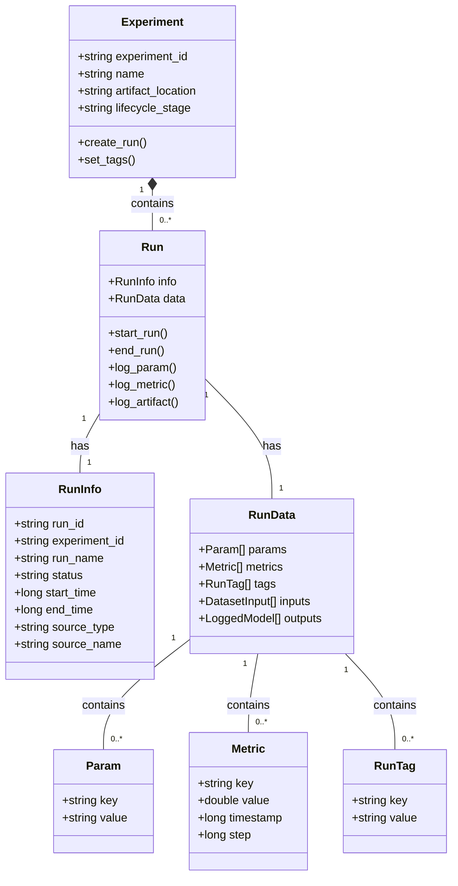
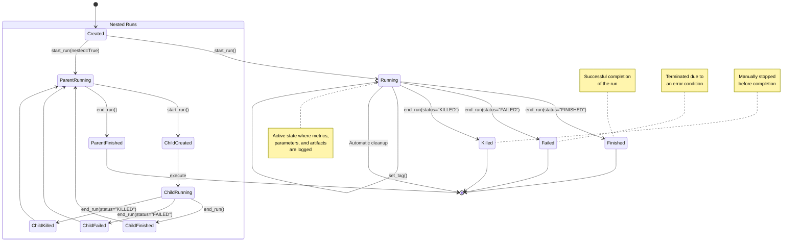
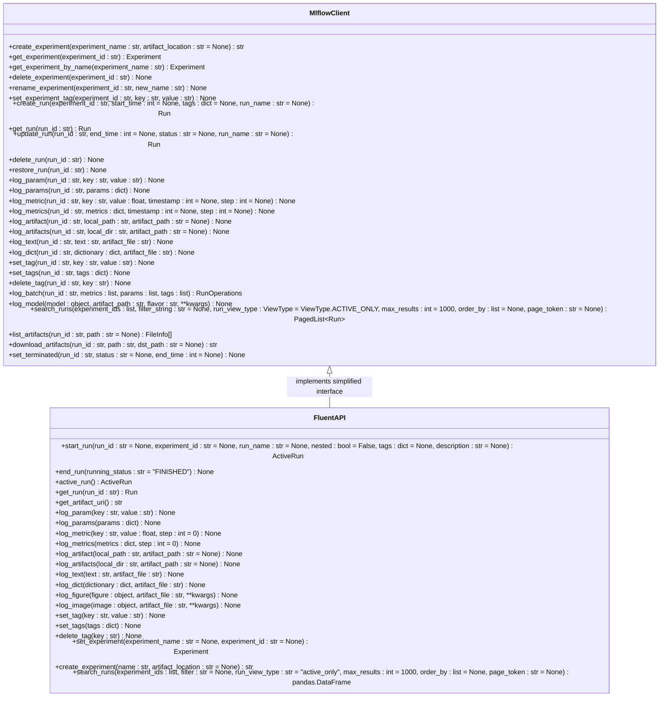
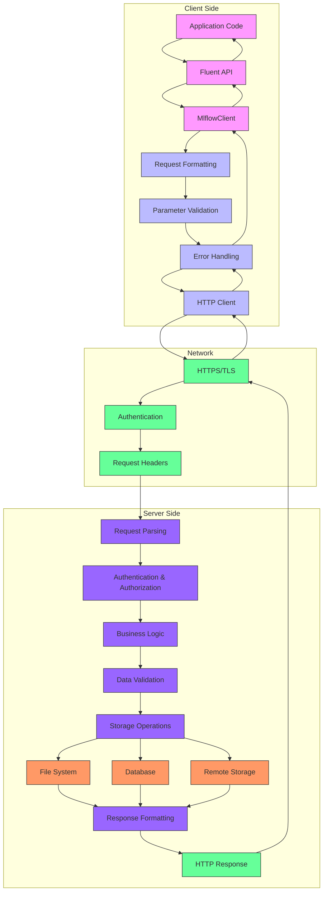

# Experiment Tracking

<cite>
**Referenced Files in This Document**   
- [mlflow/__init__.py](file://mlflow/__init__.py)
- [mlflow/tracking/client.py](file://mlflow/tracking/client.py)
- [mlflow/tracking/fluent.py](file://mlflow/tracking/fluent.py)
- [mlflow/tracking/_tracking_service/client.py](file://mlflow/tracking/_tracking_service/client.py)
- [mlflow/tracking/_tracking_service/utils.py](file://mlflow/tracking/_tracking_service/utils.py)
- [mlflow/store/tracking/file_store.py](file://mlflow/store/tracking/file_store.py)
- [mlflow/entities/run.py](file://mlflow/entities/run.py)
- [mlflow/entities/run_info.py](file://mlflow/entities/run_info.py)
- [mlflow/entities/run_data.py](file://mlflow/entities/run_data.py)
- [mlflow/entities/experiment.py](file://mlflow/entities/experiment.py)
- [examples/quickstart/mlflow_tracking.py](file://examples/quickstart/mlflow_tracking.py)
</cite>

## Table of Contents
1. [Introduction](#introduction)
2. [Core Concepts](#core-concepts)
3. [Architecture Overview](#architecture-overview)
4. [Run Lifecycle Management](#run-lifecycle-management)
5. [Data Persistence Mechanisms](#data-persistence-mechanisms)
6. [Public Interfaces and Function Signatures](#public-interfaces-and-function-signatures)
7. [Practical Examples](#practical-examples)
8. [Client-Server Pattern](#client-server-pattern)
9. [Conclusion](#conclusion)

## Introduction

MLflow Experiment Tracking is a component of the MLflow platform designed to capture and manage machine learning experiments throughout their lifecycle. It provides a systematic approach to recording parameters, code versions, metrics, and output files across multiple runs, enabling reproducibility, comparison, and collaboration in machine learning projects. The system is built around the concept of runs, which represent individual executions of machine learning code, and experiments, which are collections of runs organized around a specific objective.

The tracking system supports both a high-level fluent API for ease of use and a lower-level client API for more granular control. Key components include the `MlflowClient` class for direct interaction with the tracking server, `start_run()` for initiating new runs, and logging functions like `log_metric()` and `log_artifact()` for recording experiment data. The system is designed to be flexible, supporting various storage backends including local file systems, SQL databases, and remote tracking servers.

**Section sources**
- [mlflow/__init__.py](file://mlflow/__init__.py#L1-L419)
- [mlflow/tracking/fluent.py](file://mlflow/tracking/fluent.py#L1-L3711)

## Core Concepts

MLflow Experiment Tracking revolves around several fundamental concepts that form the foundation of its functionality. An experiment is a named collection of runs that share a common purpose or objective. Each run represents a single execution of machine learning code and contains comprehensive metadata about that execution. Runs can be organized hierarchically with parent-child relationships, enabling the tracking of complex workflows.

Each run captures various types of information: parameters (input values for the model), metrics (quantitative measurements of model performance), artifacts (output files like models, images, or data), and tags (arbitrary metadata for categorization). The system automatically captures additional context such as the start and end time of the run, the source code version (when available via Git integration), and the execution environment. This comprehensive data collection enables detailed analysis and comparison of different model configurations and training processes.

The tracking system supports both synchronous and asynchronous logging operations, allowing for efficient data recording even in high-frequency logging scenarios. It also provides mechanisms for run management, including the ability to set run names, add descriptions, and organize runs within experiments. The system is designed to be minimally invasive, allowing researchers to add tracking capabilities to existing code with minimal modifications.



**Diagram sources **
- [mlflow/entities/experiment.py](file://mlflow/entities/experiment.py)
- [mlflow/entities/run.py](file://mlflow/entities/run.py)
- [mlflow/entities/run_info.py](file://mlflow/entities/run_info.py)
- [mlflow/entities/run_data.py](file://mlflow/entities/run_data.py)

**Section sources**
- [mlflow/entities/experiment.py](file://mlflow/entities/experiment.py#L1-L200)
- [mlflow/entities/run.py](file://mlflow/entities/run.py#L1-L98)
- [mlflow/entities/run_info.py](file://mlflow/entities/run_info.py#L1-L300)
- [mlflow/entities/run_data.py](file://mlflow/entities/run_data.py#L1-L200)

## Architecture Overview

The MLflow Experiment Tracking system follows a client-server architecture with a pluggable storage backend. The architecture consists of three main components: the client interface, the tracking service, and the storage layer. This design enables flexibility in deployment, allowing the system to operate in standalone mode with local storage or in distributed mode with a remote tracking server.

The client interface provides both high-level and low-level APIs for interacting with the tracking system. The high-level fluent API, accessed through the top-level `mlflow` module, is designed for ease of use with functions like `start_run()` and `log_metric()`. The lower-level `MlflowClient` API provides more granular control and direct access to tracking server operations. Both interfaces ultimately communicate with the tracking service, which handles the business logic of run management and data validation.

The tracking service acts as an intermediary between the client and the storage layer, implementing the core functionality of experiment and run management. It is responsible for creating and retrieving experiments, managing run lifecycles, and coordinating the logging of parameters, metrics, and artifacts. The service uses a registry pattern to support multiple storage backends, allowing seamless switching between different storage technologies without changing the client code.

The storage layer is implemented as pluggable store classes that handle the persistence of tracking data. Different store implementations are available for various storage technologies, including file-based storage, SQL databases, and remote REST APIs. Each store implementation adheres to a common interface, ensuring consistent behavior across different storage backends. This modular architecture allows users to choose the storage solution that best fits their requirements, from simple local file storage for individual researchers to scalable database-backed storage for enterprise deployments.

```mermaid
graph TB
subgraph "Client Layer"
A[Fluent API<br>mlflow.start_run()] --> B[MlflowClient]
C[Direct API Calls] --> B
end
subgraph "Service Layer"
B --> D[Tracking Service]
end
subgraph "Storage Layer"
D --> E[File Store]
D --> F[SQL Store]
D --> G[REST Store]
D --> H[Custom Store]
end
subgraph "Storage Backends"
E --> I[Local File System]
F --> J[SQL Database]
G --> K[Remote Server]
H --> L[Custom Backend]
end
style A fill:#f9f,stroke:#333
style B fill:#f9f,stroke:#333
style D fill:#bbf,stroke:#333
style E fill:#9f9,stroke:#333
style F fill:#9f9,stroke:#333
style G fill:#9f9,stroke:#333
style H fill:#9f9,stroke:#333
```

**Diagram sources **
- [mlflow/tracking/client.py](file://mlflow/tracking/client.py#L1-L6569)
- [mlflow/tracking/_tracking_service/client.py](file://mlflow/tracking/_tracking_service/client.py#L1-L1000)
- [mlflow/store/tracking/abstract_store.py](file://mlflow/store/tracking/abstract_store.py#L1-L100)
- [mlflow/store/tracking/file_store.py](file://mlflow/store/tracking/file_store.py#L1-L2878)

**Section sources**
- [mlflow/tracking/client.py](file://mlflow/tracking/client.py#L1-L6569)
- [mlflow/tracking/_tracking_service/client.py](file://mlflow/tracking/_tracking_service/client.py#L1-L1000)
- [mlflow/store/tracking/abstract_store.py](file://mlflow/store/tracking/abstract_store.py#L1-L100)

## Run Lifecycle Management

The run lifecycle in MLflow Experiment Tracking follows a well-defined sequence of states from creation to termination. A run begins when it is created, either explicitly through the `create_run()` method or implicitly through the `start_run()` context manager. Upon creation, the run enters the "RUNNING" state and is assigned a unique run ID, which serves as its primary identifier throughout its lifecycle.

During the running phase, various operations can be performed on the run, including logging parameters, metrics, and artifacts. The system supports both synchronous and asynchronous logging, with asynchronous operations improving performance in high-frequency logging scenarios. Parameters are typically logged at the beginning of a run to capture configuration settings, while metrics are often logged repeatedly during model training to track progress over time.

A run can be terminated in one of several states: "FINISHED" (successful completion), "FAILED" (terminated due to an error), or "KILLED" (manually stopped). The termination state provides important context for interpreting the results of the run. Once terminated, a run enters a read-only state where no further modifications can be made, ensuring the integrity of the recorded experiment data.

The system also supports nested runs, allowing for hierarchical organization of related experiments. This feature is particularly useful for hyperparameter tuning, where a parent run can represent the overall tuning process while child runs represent individual parameter combinations. The lifecycle of child runs is independent of their parent, allowing for flexible experimentation patterns.



**Diagram sources **
- [mlflow/entities/run_info.py](file://mlflow/entities/run_info.py#L1-L300)
- [mlflow/tracking/fluent.py](file://mlflow/tracking/fluent.py#L1-L3711)
- [mlflow/runs.py](file://mlflow/runs.py#L1-L246)

**Section sources**
- [mlflow/entities/run_info.py](file://mlflow/entities/run_info.py#L1-L300)
- [mlflow/tracking/fluent.py](file://mlflow/tracking/fluent.py#L1-L3711)
- [mlflow/runs.py](file://mlflow/runs.py#L1-L246)

## Data Persistence Mechanisms

MLflow Experiment Tracking employs a flexible and extensible architecture for data persistence, supporting multiple storage backends through a pluggable store interface. The system is designed to handle various types of experiment data, including metadata, metrics, parameters, tags, and artifacts, each with different storage requirements and access patterns.

For metadata storage, the system uses structured formats to persist experiment and run information. In the file-based store, this data is stored in YAML files organized in a hierarchical directory structure, with experiments as top-level directories and runs as subdirectories. Each run has a `meta.yaml` file containing its metadata, including run ID, experiment ID, start and end times, status, and other run information. This structure enables efficient querying and retrieval of experiment data while maintaining human readability.

Metrics and parameters are stored separately from metadata to optimize for their different access patterns. Metrics are typically stored in individual files organized by metric name, with each file containing a time series of metric values. This organization allows for efficient retrieval of metric history and supports operations like finding the maximum or minimum value over time. Parameters are stored in a similar fashion, with one file per parameter containing its value. This separation enables efficient updates and retrieval of individual parameters without loading the entire run data.

Artifacts, which can include models, images, datasets, and other output files, are stored in a dedicated artifacts directory. The system supports both local file storage and remote storage backends like Amazon S3, Azure Blob Storage, and Google Cloud Storage. When using remote storage, the system generates presigned URLs for secure access to artifacts. The artifacts directory structure mirrors the run hierarchy, with each run having its own subdirectory for storing artifacts, enabling organized and scalable storage of large files.

```mermaid
flowchart TD
A[Run Data] --> B[Metadata]
A --> C[Metrics]
A --> D[Parameters]
A --> E[Tags]
A --> F[Artifacts]
B --> G[File Store: meta.yaml]
B --> H[SQL Store: run_info table]
B --> I[REST Store: API calls]
C --> J[File Store: metrics/metric_name]
C --> K[SQL Store: metrics table]
C --> L[REST Store: API calls]
D --> M[File Store: params/param_name]
D --> N[SQL Store: params table]
D --> O[REST Store: API calls]
E --> P[File Store: tags/tag_name]
E --> Q[SQL Store: tags table]
E --> R[REST Store: API calls]
F --> S[File Store: artifacts/]
F --> T[Remote Storage: S3, GCS, etc.]
F --> U[REST Store: API calls]
style G fill:#f96,stroke:#333
style H fill:#f96,stroke:#333
style I fill:#f96,stroke:#333
style J fill:#6f9,stroke:#333
style K fill:#6f9,stroke:#333
style L fill:#6f9,stroke:#333
style M fill:#6f9,stroke:#333
style N fill:#6f9,stroke:#333
style O fill:#6f9,stroke:#333
style P fill:#6f9,stroke:#333
style Q fill:#6f9,stroke:#333
style R fill:#6f9,stroke:#333
style S fill:#96f,stroke:#333
style T fill:#96f,stroke:#333
style U fill:#96f,stroke:#333
classDef store fill:#ddd,stroke:#333;
class G,H,I,J,K,L,M,N,O,P,Q,R,S,T,U store;
```



**Diagram sources **
- [mlflow/store/tracking/file_store.py](file://mlflow/store/tracking/file_store.py#L1-L2878)
- [mlflow/store/tracking/sqlalchemy_store.py](file://mlflow/store/tracking/sqlalchemy_store.py#L1-L2000)
- [mlflow/store/tracking/rest_store.py](file://mlflow/store/tracking/rest_store.py#L1-L2000)
- [mlflow/store/artifact/artifact_repo.py](file://mlflow/store/artifact/artifact_repo.py#L1-L500)

**Section sources**
- [mlflow/store/tracking/file_store.py](file://mlflow/store/tracking/file_store.py#L1-L2878)
- [mlflow/store/tracking/sqlalchemy_store.py](file://mlflow/store/tracking/sqlalchemy_store.py#L1-L2000)
- [mlflow/store/artifact/artifact_repo.py](file://mlflow/store/artifact/artifact_repo.py#L1-L500)

## Public Interfaces and Function Signatures

The MLflow Experiment Tracking system provides a comprehensive set of public interfaces for managing experiments and runs. The primary entry point is the `MlflowClient` class, which offers methods for creating and managing experiments, runs, and associated data. Key methods include `create_experiment()` for creating new experiments, `create_run()` for initiating new runs, and various logging methods for recording experiment data.

The fluent API, accessible through the top-level `mlflow` module, provides a more user-friendly interface for common operations. The `start_run()` function creates and activates a new run, returning a context manager that automatically handles run termination. This function accepts parameters such as `experiment_id` to specify the target experiment, `run_name` to provide a human-readable name, and `tags` to add metadata for filtering and organization.

For data logging, the system provides several specialized functions: `log_param()` for recording single parameters, `log_params()` for logging multiple parameters at once, `log_metric()` for recording quantitative measurements, `log_metrics()` for logging multiple metrics simultaneously, and `log_artifact()` for storing output files. Each of these functions takes a `run_id` parameter to specify the target run, with a default value of the currently active run when using the fluent API.

The system also provides methods for retrieving and querying experiment data. `get_run()` retrieves detailed information about a specific run, including its parameters, metrics, and tags. `search_runs()` enables querying runs based on various criteria, supporting filtering by experiment ID, parameter values, metric thresholds, and tag values. The search functionality supports complex queries with logical operators and sorting, enabling sophisticated analysis of experiment results.



**Diagram sources **
- [mlflow/tracking/client.py](file://mlflow/tracking/client.py#L1-L6569)
- [mlflow/tracking/fluent.py](file://mlflow/tracking/fluent.py#L1-L3711)
- [mlflow/client.py](file://mlflow/client.py#L1-L13)

**Section sources**
- [mlflow/tracking/client.py](file://mlflow/tracking/client.py#L1-L6569)
- [mlflow/tracking/fluent.py](file://mlflow/tracking/fluent.py#L1-L3711)
- [mlflow/client.py](file://mlflow/client.py#L1-L13)

## Practical Examples

The MLflow Experiment Tracking system can be applied to various machine learning workflows, from simple parameter logging to complex hyperparameter tuning experiments. A basic example demonstrates the core functionality of logging parameters, metrics, and artifacts within a single run. This pattern is useful for tracking individual model training sessions and capturing the complete context of each experiment.

For hyperparameter tuning, the system supports both manual and automated approaches. In a manual approach, researchers can create multiple runs with different parameter combinations, using the experiment organization features to group related runs. The system's search and comparison capabilities enable easy identification of the best-performing configurations. For automated hyperparameter tuning, the system can be integrated with optimization libraries like Optuna or Hyperopt, with each trial represented as a separate run in the tracking system.

Model training workflows benefit from the system's ability to capture not only the final model but also intermediate artifacts and metrics throughout the training process. This comprehensive tracking enables detailed analysis of model convergence, identification of overfitting, and reproduction of results. The artifact logging functionality allows researchers to store trained models, evaluation results, and visualizations, creating a complete record of the training process.

The system also supports collaborative workflows, where multiple researchers can contribute to the same experiment. Each researcher's runs are recorded with their identity (when available), enabling attribution and comparison of different approaches. The tagging system allows for flexible organization and filtering of runs, supporting complex experimental designs with multiple variables and conditions.

```mermaid
sequenceDiagram
participant Researcher
participant FluentAPI as mlflow
participant Client as MlflowClient
participant Store as Tracking Store
Researcher->>FluentAPI : start_run(experiment_id="1", run_name="hyperparam_trial_1")
FluentAPI->>Client : create_run(experiment_id="1", tags={...})
Client->>Store : create_run(...)
Store-->>Client : Run object
Client-->>FluentAPI : Run object
FluentAPI-->>Researcher : ActiveRun object
Researcher->>FluentAPI : log_param("learning_rate", "0.01")
FluentAPI->>Client : log_param(run_id, "learning_rate", "0.01")
Client->>Store : log_param(...)
Store-->>Client : confirmation
Client-->>FluentAPI : confirmation
FluentAPI-->>Researcher : confirmation
loop Training Epochs
Researcher->>FluentAPI : log_metric("loss", 0.25, step=epoch)
FluentAPI->>Client : log_metric(run_id, "loss", 0.25, step=epoch)
Client->>Store : log_metric(...)
Store-->>Client : confirmation
Client-->>FluentAPI : confirmation
FluentAPI-->>Researcher : confirmation
end
Researcher->>FluentAPI : log_artifact("model.pkl")
FluentAPI->>Client : log_artifact(run_id, "model.pkl")
Client->>Store : get_artifact_repository(artifact_uri)
Store-->>Client : ArtifactRepository
Client->>ArtifactRepository : log_artifact("model.pkl")
ArtifactRepository-->>Client : confirmation
Client-->>FluentAPI : confirmation
FluentAPI-->>Researcher : confirmation
Researcher->>FluentAPI : end_run(status="FINISHED")
FluentAPI->>Client : update_run(run_id, status="FINISHED", end_time=...)
Client->>Store : update_run(...)
Store-->>Client : confirmation
Client-->>FluentAPI : confirmation
FluentAPI-->>Researcher : confirmation
note right of Researcher
Complete experiment tracking
workflow with parameter,
metric, and artifact logging
end note
```

**Diagram sources **
- [examples/quickstart/mlflow_tracking.py](file://examples/quickstart/mlflow_tracking.py#L1-L21)
- [mlflow/tracking/fluent.py](file://mlflow/tracking/fluent.py#L1-L3711)
- [mlflow/tracking/_tracking_service/client.py](file://mlflow/tracking/_tracking_service/client.py#L1-L1000)

**Section sources**
- [examples/quickstart/mlflow_tracking.py](file://examples/quickstart/mlflow_tracking.py#L1-L21)
- [mlflow/tracking/fluent.py](file://mlflow/tracking/fluent.py#L1-L3711)

## Client-Server Pattern

The client-server pattern in MLflow Experiment Tracking enables distributed operation and centralized data management. The client component, implemented in the `MlflowClient` class, provides a local interface for interacting with the tracking system. It handles request formatting, parameter validation, and error handling before communicating with the server component. The client is designed to be lightweight and can operate in various environments, from local development machines to cloud-based training instances.

The server component, implemented in the tracking service and store classes, handles the core business logic of experiment management and data persistence. It receives requests from clients, validates them, and performs the necessary operations on the underlying storage system. The server can be deployed as a standalone service, allowing multiple clients to share a common tracking backend. This centralized architecture enables collaboration, as all team members can access the same experiment data regardless of their local environment.

Communication between client and server occurs through a well-defined API, which can be implemented over various transport protocols. In the local file-based scenario, the "server" is simply the file system, with the client directly reading and writing files. In remote scenarios, communication occurs over HTTP/HTTPS using a REST API, with JSON-formatted requests and responses. This flexibility allows the system to adapt to different deployment requirements, from simple local tracking to enterprise-scale distributed tracking.

The client-server pattern also supports various authentication and authorization mechanisms, enabling secure access to tracking data. When deployed as a remote service, the server can implement user authentication, role-based access control, and audit logging. This security infrastructure is particularly important in enterprise environments where experiment data may contain sensitive information or intellectual property.



**Diagram sources **
- [mlflow/tracking/client.py](file://mlflow/tracking/client.py#L1-L6569)
- [mlflow/server/handlers.py](file://mlflow/server/handlers.py#L1-L2000)
- [mlflow/store/tracking/rest_store.py](file://mlflow/store/tracking/rest_store.py#L1-L2000)

**Section sources**
- [mlflow/tracking/client.py](file://mlflow/tracking/client.py#L1-L6569)
- [mlflow/server/handlers.py](file://mlflow/server/handlers.py#L1-L2000)
- [mlflow/store/tracking/rest_store.py](file://mlflow/store/tracking/rest_store.py#L1-L2000)

## Conclusion

MLflow Experiment Tracking provides a comprehensive solution for capturing and managing machine learning experiments throughout their lifecycle. By systematically recording parameters, code versions, metrics, and output files, the system enables reproducibility, comparison, and collaboration in machine learning projects. The architecture, based on a client-server pattern with pluggable storage backends, offers flexibility in deployment and scalability for different use cases.

The system's run lifecycle management provides a structured approach to experiment execution, from creation through termination, with support for both flat and hierarchical organization of runs. The data persistence mechanisms are designed to handle various types of experiment data efficiently, with optimized storage for metadata, metrics, parameters, and artifacts. The public interfaces, including both the high-level fluent API and the lower-level `MlflowClient`, provide accessible entry points for users of different experience levels.

Practical applications of the system range from simple parameter logging to complex hyperparameter tuning experiments and collaborative model development workflows. The client-server pattern enables distributed operation and centralized data management, supporting both local development and enterprise-scale deployments. As machine learning projects grow in complexity and scale, MLflow Experiment Tracking provides the infrastructure needed to maintain rigor, transparency, and efficiency in the experimentation process.