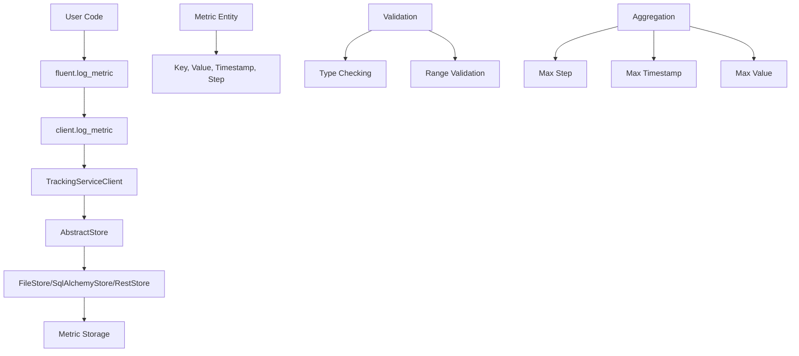
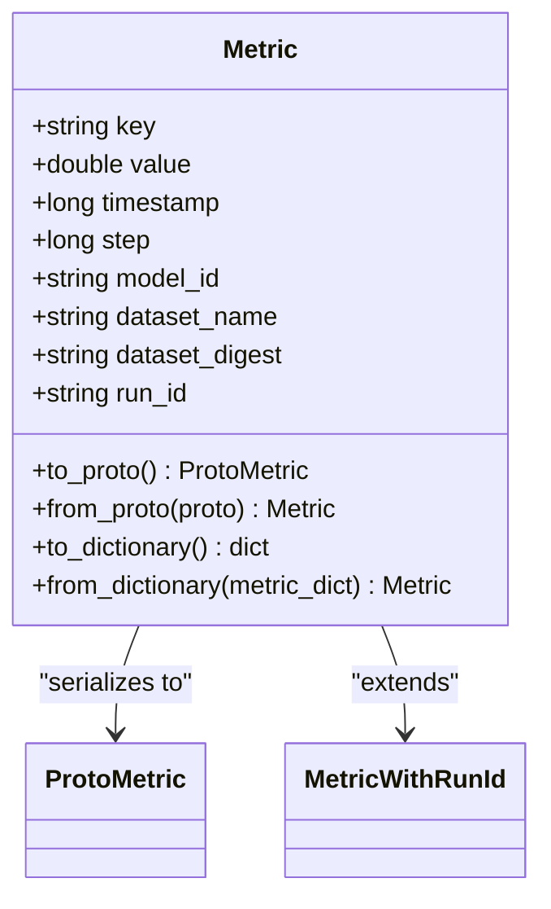
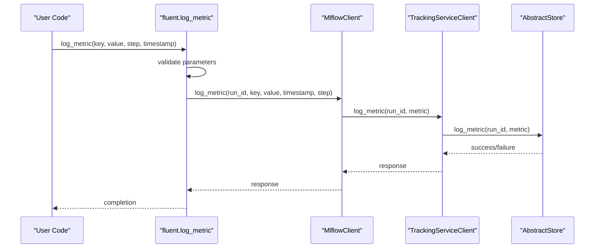
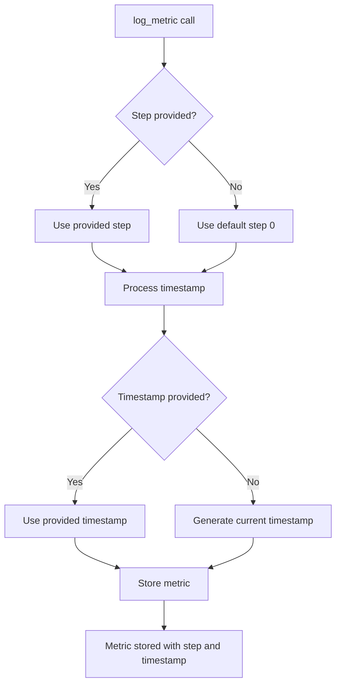
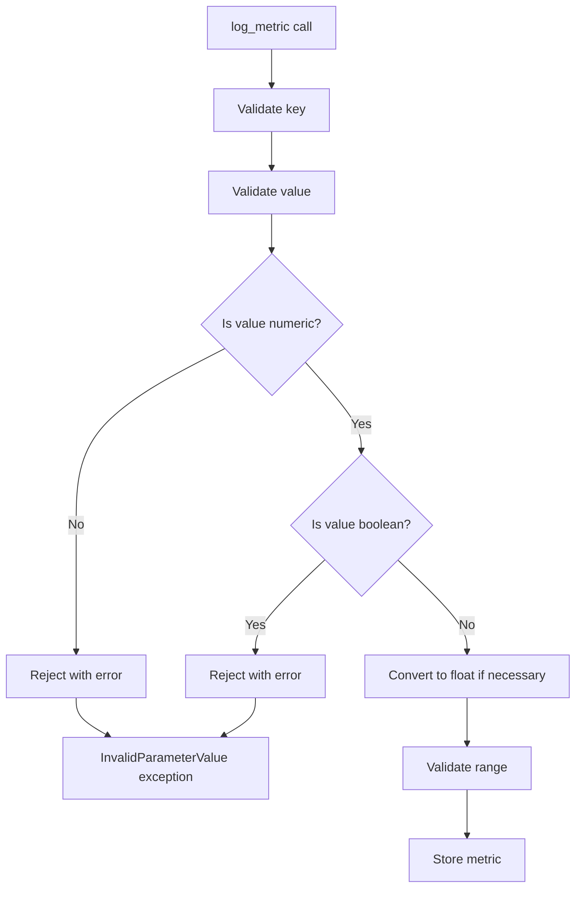
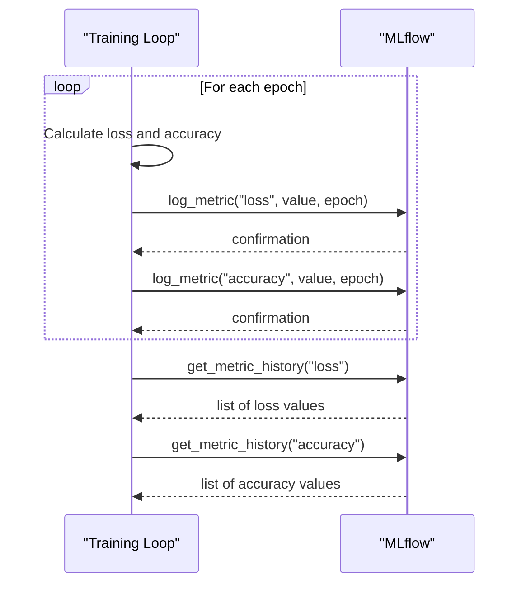
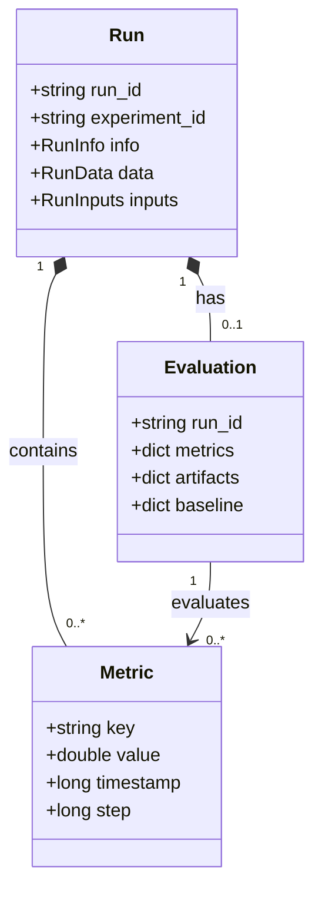
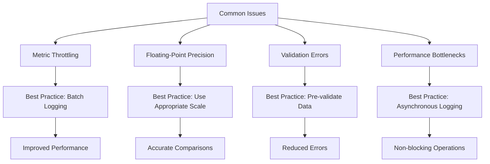

# Metric Logging

<cite>
**Referenced Files in This Document**   
- [metric.py](file://mlflow/entities/metric.py)
- [fluent.py](file://mlflow/tracking/fluent.py)
- [client.py](file://mlflow/tracking/client.py)
- [abstract_store.py](file://mlflow/store/tracking/abstract_store.py)
- [validation.py](file://mlflow/utils/validation.py)
- [test_file_store.py](file://tests/store/tracking/test_file_store.py)
- [rest-api.rst](file://docs/api_reference/source/rest-api.rst)
</cite>

## Table of Contents
1. [Introduction](#introduction)
2. [Core Components](#core-components)
3. [Metric Data Structure](#metric-data-structure)
4. [log_metric Implementation](#log_metric-implementation)
5. [Step and Timestamp Handling](#step-and-timestamp-handling)
6. [Metric Aggregation and Retrieval](#metric-aggregation-and-retrieval)
7. [Numeric Type Validation](#numeric-type-validation)
8. [Large Metrics Considerations](#large-metrics-considerations)
9. [Training Example](#training-example)
10. [Relationship with Runs and Model Evaluation](#relationship-with-runs-and-model-evaluation)
11. [Common Issues and Best Practices](#common-issues-and-best-practices)
12. [Conclusion](#conclusion)

## Introduction
MLflow provides comprehensive metric logging capabilities that enable tracking of model performance throughout the machine learning lifecycle. The `log_metric()` function serves as the primary interface for recording numerical values during model training, evaluation, and inference. This documentation details the implementation of metric logging, covering support for step values, timestamp tracking, automatic aggregation of metrics with the same name, and handling of numeric types. The system is designed to efficiently manage large numbers of metrics while maintaining precision and providing robust validation.

**Section sources**
- [metric.py](file://mlflow/entities/metric.py#L1-L198)
- [fluent.py](file://mlflow/tracking/fluent.py#L1-L3711)

## Core Components
The metric logging system in MLflow consists of several interconnected components that work together to provide a seamless experience for tracking model performance. At the core is the `Metric` entity class that defines the structure of logged metrics, including key, value, timestamp, and step information. The fluent API provides the `log_metric()` function as the primary interface for users, while the underlying tracking service handles communication with the backend store. The system supports both synchronous and asynchronous logging operations, with validation occurring at multiple levels to ensure data integrity.



**Diagram sources**
- [metric.py](file://mlflow/entities/metric.py#L1-L198)
- [fluent.py](file://mlflow/tracking/fluent.py#L1-L3711)
- [client.py](file://mlflow/tracking/client.py#L1-L6569)
- [abstract_store.py](file://mlflow/store/tracking/abstract_store.py#L1-L1000)

## Metric Data Structure
The `Metric` class in MLflow defines the fundamental structure for logged metrics, containing essential attributes that capture the complete context of each measurement. Each metric consists of a key (name), numeric value, timestamp (in milliseconds since Unix epoch), and step (integer representing the iteration or epoch). The class implements proper equality and hashing methods to support comparison and storage operations. The implementation ensures that all required fields are present and properly typed, with validation occurring at both the entity level and during storage operations.



**Diagram sources**
- [metric.py](file://mlflow/entities/metric.py#L1-L198)

## log_metric Implementation
The `log_metric()` function implementation follows a layered architecture that provides both user-friendly interfaces and robust backend operations. The fluent API function serves as the entry point, performing initial validation and delegating to the tracking client. The client then communicates with the tracking service, which routes the request to the appropriate backend store implementation. This architecture allows for consistent behavior across different storage backends while providing flexibility for optimization and extension.



**Diagram sources**
- [fluent.py](file://mlflow/tracking/fluent.py#L1001-L1050)
- [client.py](file://mlflow/tracking/client.py#L2110-L2150)
- [abstract_store.py](file://mlflow/store/tracking/abstract_store.py#L570-L575)

## Step and Timestamp Handling
MLflow's metric logging system provides sophisticated handling of step and timestamp values to support various use cases in machine learning workflows. The step parameter allows users to associate metrics with specific iterations, epochs, or batches during training, enabling time-series analysis of model performance. Timestamps are recorded in milliseconds since the Unix epoch, providing precise timing information for each metric. The system automatically generates timestamps when not explicitly provided, ensuring consistent time tracking across different environments and execution contexts.



**Diagram sources**
- [fluent.py](file://mlflow/tracking/fluent.py#L1001-L1050)
- [test_file_store.py](file://tests/store/tracking/test_file_store.py#L1130-L1157)

## Metric Aggregation and Retrieval
MLflow automatically aggregates metrics with the same name within a run, providing a consolidated view of model performance. When multiple values are logged for the same metric key, the system maintains the complete history while exposing the most relevant value based on step, timestamp, and value precedence. The aggregation follows a specific priority order: higher step values take precedence, followed by more recent timestamps, and finally higher values in case of ties. This ensures that the most up-to-date and significant metric values are readily accessible for analysis and comparison.

```mermaid
flowchart TD
A[Metric History] --> B{Multiple values for same key?}
B --> |No| C[Return single value]
B --> |Yes| D[Sort by step (descending)]
D --> E{Steps equal?}
E --> |Yes| F[Sort by timestamp (descending)]
F --> G{Timestamps equal?}
G --> |Yes| H[Sort by value (descending)]
G --> |No| I[Select highest timestamp]
E --> |No| J[Select highest step]
H --> K[Select highest value]
I --> L[Return selected metric]
J --> L
K --> L
L --> M[Aggregated metric value]
```

**Diagram sources**
- [test_file_store.py](file://tests/store/tracking/test_file_store.py#L1130-L1157)
- [fluent.py](file://mlflow/tracking/fluent.py#L1001-L1050)

## Numeric Type Validation
The metric logging system enforces strict validation of numeric types to ensure data integrity and consistency. Only numeric values (integers and floating-point numbers) are accepted, with boolean values explicitly excluded despite being numeric in Python. The validation occurs at multiple levels, from the fluent API through to the storage backend, preventing invalid data from being recorded. This validation helps maintain the reliability of metric data and prevents common errors that could compromise model evaluation and comparison.



**Diagram sources**
- [validation.py](file://mlflow/utils/validation.py#L194-L228)
- [metric.py](file://mlflow/entities/metric.py#L1-L198)

## Large Metrics Considerations
When dealing with large numbers of metrics, MLflow provides mechanisms to optimize performance and resource usage. The system supports batch logging operations through the `log_metrics()` function, which reduces overhead by minimizing the number of individual API calls. For extremely large metric sets, asynchronous logging is available to prevent blocking the main execution thread. The backend stores are designed to handle high-volume metric logging efficiently, with indexing and storage optimizations that maintain performance even with thousands of metrics per run.

```mermaid
flowchart TD
A[Large number of metrics] --> B{Use batch logging?}
B --> |Yes| C[log_metrics(dict, step)]
B --> |No| D[Multiple log_metric calls]
C --> E[Single batch operation]
D --> F[Multiple individual operations]
E --> G[Optimized storage]
F --> H[Standard storage]
G --> I[Improved performance]
H --> J[Standard performance]
I --> K[Efficient handling of large metrics]
J --> K
```

**Diagram sources**
- [fluent.py](file://mlflow/tracking/fluent.py#L1157-L1200)
- [client.py](file://mlflow/tracking/client.py#L2151-L2200)

## Training Example
A typical use case for metric logging is tracking training progress in machine learning models. The following example demonstrates how to log training loss and accuracy metrics during model training. The step parameter is used to track the epoch number, while timestamps are automatically generated. This approach enables detailed analysis of model convergence and performance over time, supporting both real-time monitoring and post-training evaluation.



**Diagram sources**
- [fluent.py](file://mlflow/tracking/fluent.py#L1001-L1050)
- [client.py](file://mlflow/tracking/client.py#L2110-L2150)

## Relationship with Runs and Model Evaluation
Metrics in MLflow are intrinsically linked to runs, which represent individual executions of machine learning workflows. Each metric is associated with a specific run, enabling organized tracking of performance across different experiments and configurations. The system integrates closely with model evaluation capabilities, allowing metrics to be used for automated model validation and comparison. This integration supports comprehensive assessment of model quality, with metrics serving as key indicators for decision-making in the model development lifecycle.



**Diagram sources**
- [metric.py](file://mlflow/entities/metric.py#L1-L198)
- [fluent.py](file://mlflow/tracking/fluent.py#L1-L3711)

## Common Issues and Best Practices
Several common issues can arise when using metric logging in MLflow, along with corresponding best practices for optimal usage. Metric throttling can occur when logging very frequently, which can be mitigated by batching operations or adjusting logging frequency. Floating-point precision issues may affect comparison operations, particularly with very small or very large numbers. Best practices include using appropriate step values for temporal organization, leveraging batch logging for efficiency, and implementing proper error handling for validation failures.



**Diagram sources**
- [fluent.py](file://mlflow/tracking/fluent.py#L1001-L1200)
- [validation.py](file://mlflow/utils/validation.py#L194-L228)

## Conclusion
MLflow's metric logging system provides a robust and flexible framework for tracking model performance throughout the machine learning lifecycle. The `log_metric()` function and its supporting infrastructure enable precise recording of numerical values with comprehensive metadata, including step and timestamp information. The system's design supports both simple use cases and complex scenarios involving large numbers of metrics, with built-in validation and aggregation features that ensure data quality and usability. By following best practices and understanding the underlying implementation, users can effectively leverage MLflow's metric logging capabilities to monitor and optimize model performance over time.