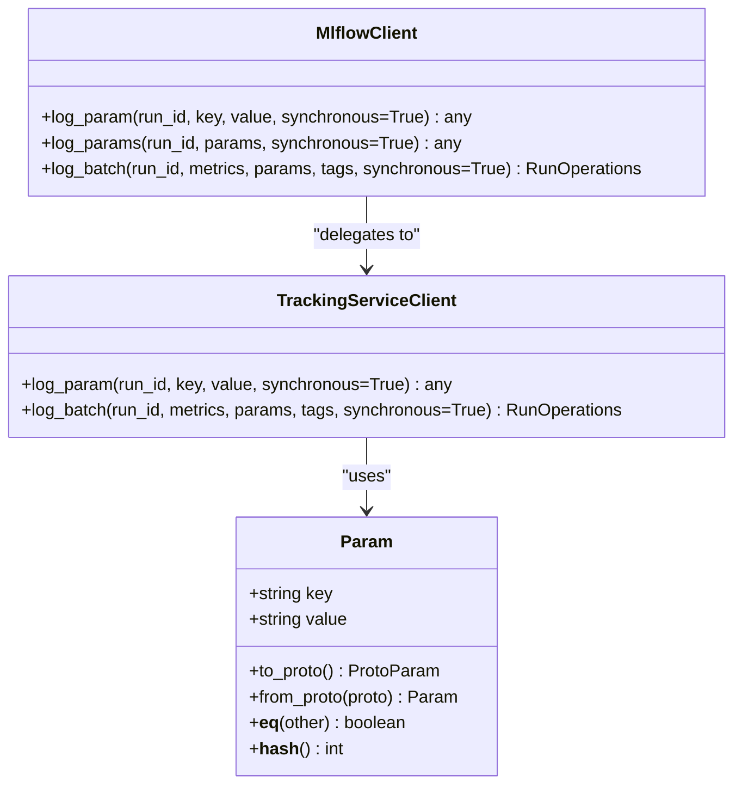
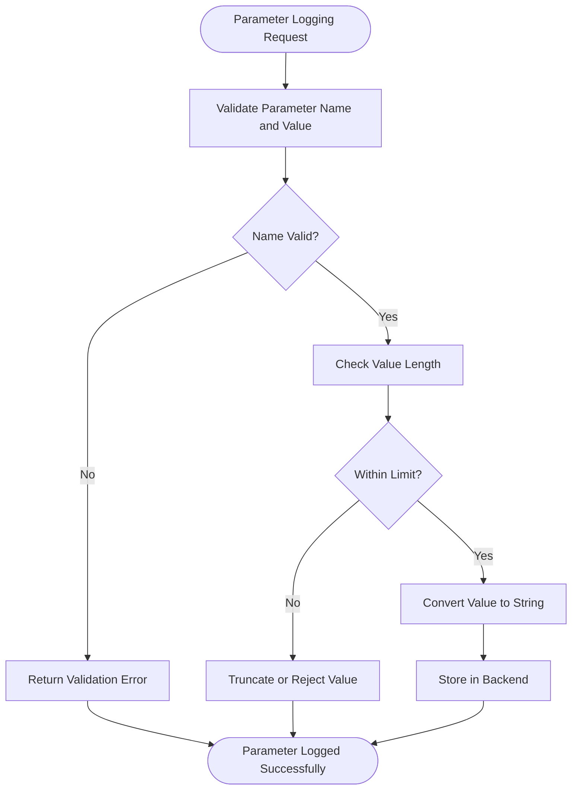
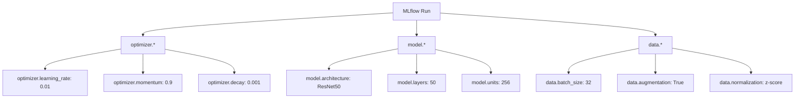
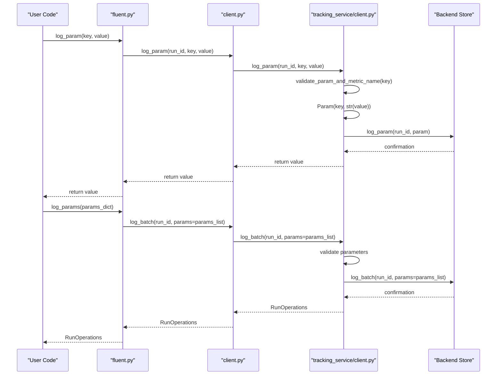
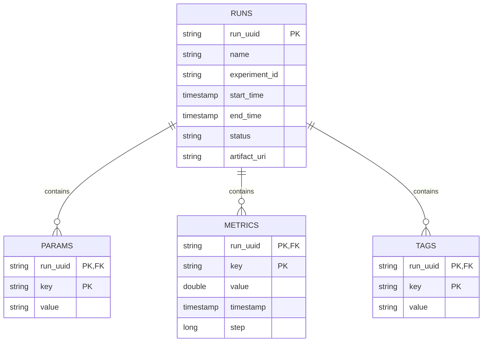
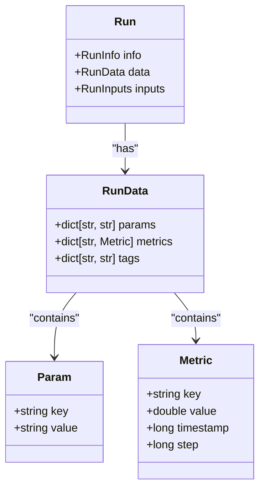
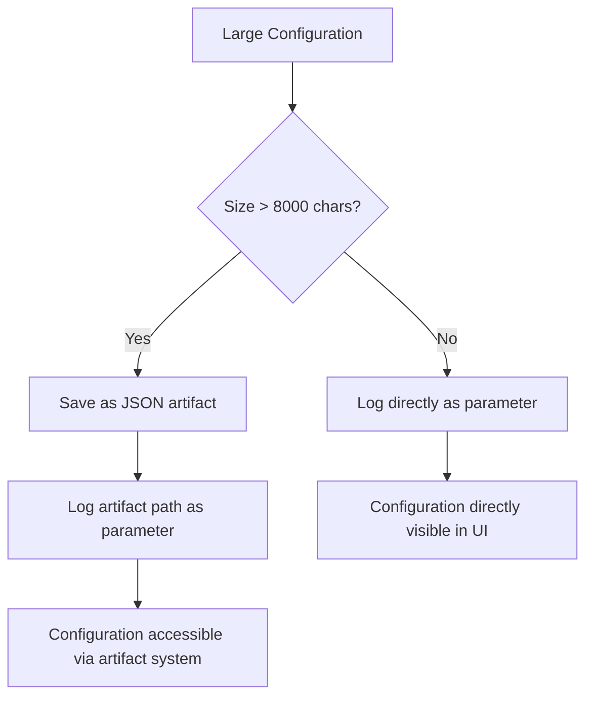

# Parameter Logging

<cite>
**Referenced Files in This Document**   
- [param.py](file://mlflow/entities/param.py)
- [client.py](file://mlflow/tracking/client.py)
- [fluent.py](file://mlflow/tracking/fluent.py)
- [tracking_service/client.py](file://mlflow/tracking/_tracking_service/client.py)
- [train.py](file://examples/hyperparam/train.py)
- [test_sqlalchemy_store.py](file://tests/store/tracking/test_sqlalchemy_store.py)
- [test_param.py](file://tests/entities/test_param.py)
- [2d6e25af4d3e_increase_max_param_val_length.py](file://mlflow/store/db_migrations/versions/2d6e25af4d3e_increase_max_param_val_length.py)
- [cc1f77228345_change_param_value_length_to_500.py](file://mlflow/store/db_migrations/versions/cc1f77228345_change_param_value_length_to_500.py)
- [validation.py](file://mlflow/utils/validation.py)
</cite>

## Table of Contents
1. [Introduction](#introduction)
2. [Core API Implementation](#core-api-implementation)
3. [Parameter Validation and Constraints](#parameter-validation-and-constraints)
4. [Hierarchical Parameter Support](#hierarchical-parameter-support)
5. [Client-Server Invocation Flow](#client-server-invocation-flow)
6. [Backend Storage Mechanism](#backend-storage-mechanism)
7. [Hyperparameter Logging Examples](#hyperparameter-logging-examples)
8. [Relationships with Runs and Metrics](#relationships-with-runs-and-metrics)
9. [Common Issues and Best Practices](#common-issues-and-best-practices)
10. [Conclusion](#conclusion)

## Introduction
Parameter logging in MLflow provides a systematic way to track hyperparameters and configuration values associated with machine learning experiments. The system enables researchers and engineers to log scalar parameters using `log_param()` for single values and `log_params()` for multiple values, creating a comprehensive record of model configurations. This documentation details the implementation of parameter logging, covering type validation, length constraints, hierarchical parameter support, and the complete workflow from client API invocation to server storage. The system is designed to handle various data types while maintaining consistency and integrity across distributed environments.

## Core API Implementation

The parameter logging functionality in MLflow is implemented through a layered architecture that provides both high-level and low-level interfaces for logging parameters. The core implementation revolves around the `log_param()` and `log_params()` functions, which are exposed through the fluent API and tracking client.

The `Param` class in `mlflow/entities/param.py` serves as the fundamental data structure for parameters, encapsulating a key-value pair where both are stored as strings. This class implements basic functionality including equality comparison and hashing based on the parameter key, ensuring that duplicate parameter names within a run are properly handled.



**Diagram sources**
- [param.py](file://mlflow/entities/param.py#L7-L50)
- [client.py](file://mlflow/tracking/client.py#L212-L800)
- [tracking_service/client.py](file://mlflow/tracking/_tracking_service/client.py#L81-L800)

**Section sources**
- [param.py](file://mlflow/entities/param.py#L1-L50)
- [client.py](file://mlflow/tracking/client.py#L212-L800)

## Parameter Validation and Constraints

MLflow implements comprehensive validation for parameter logging to ensure data integrity and consistency. The validation process occurs at multiple levels, from client-side checks to database schema constraints.

The system enforces strict naming conventions for parameter keys, allowing only alphanumeric characters, underscores, periods, dashes, colons, and spaces. This validation is implemented in the `validate_param_and_metric_name()` function in `mlflow/utils/validation.py`, which uses regular expressions to verify compliance with these rules.



**Diagram sources**
- [validation.py](file://mlflow/utils/validation.py#L149-L157)
- [test_sqlalchemy_store.py](file://tests/store/tracking/test_sqlalchemy_store.py#L1381-L1402)

**Section sources**
- [validation.py](file://mlflow/utils/validation.py#L124-L157)
- [test_sqlalchemy_store.py](file://tests/store/tracking/test_sqlalchemy_store.py#L1381-L1402)

The database schema imposes length constraints on parameter values, with the maximum length evolving through database migrations. Initially, parameter values were limited to 250 characters, then increased to 500 characters in migration `cc1f77228345_change_param_value_length_to_500.py`, and further expanded to 8000 characters in migration `2d6e25af4d3e_increase_max_param_val_length.py`. This progressive increase reflects the growing need to store more complex parameter values, such as JSON strings representing nested configurations.

The system handles various edge cases, including empty strings and null values. Tests in `test_sqlalchemy_store.py` verify that empty strings can be successfully logged as parameter values, ensuring flexibility in representing different types of configuration data.

## Hierarchical Parameter Support

While MLflow's core parameter system is designed around flat key-value pairs, the framework provides mechanisms to support hierarchical parameter organization through naming conventions and nested runs. This approach allows users to create logical groupings of related parameters without requiring changes to the underlying data model.

The system supports hierarchical organization through dot notation in parameter names, enabling users to create namespaces for related parameters. For example, parameters related to a neural network's optimizer can be named "optimizer.learning_rate" and "optimizer.momentum", creating a logical grouping that can be easily filtered and analyzed.



**Diagram sources**
- [train.py](file://examples/hyperparam/train.py#L100-L113)
- [fluent.py](file://mlflow/tracking/fluent.py#L320-L382)

**Section sources**
- [train.py](file://examples/hyperparam/train.py#L100-L113)

Additionally, MLflow supports true hierarchical organization through parent-child run relationships. A parent run can represent a high-level experiment or model architecture, while child runs represent individual iterations or variations with their own parameter sets. This nested structure enables complex hyperparameter search strategies, such as Bayesian optimization or grid search, where each iteration is captured as a child run under a parent optimization process.

The parent-child relationship is established through the `nested=True` parameter in `start_run()` or by explicitly specifying a `parent_run_id`. This creates a hierarchical structure that can be visualized and queried in the MLflow UI, allowing users to navigate between high-level experiments and individual trials.

## Client-Server Invocation Flow

The parameter logging process in MLflow follows a well-defined client-server architecture, with clear separation between the client API and server storage layers. This architecture enables both synchronous and asynchronous logging operations, providing flexibility for different use cases and performance requirements.



**Diagram sources**
- [fluent.py](file://mlflow/tracking/fluent.py#L320-L382)
- [client.py](file://mlflow/tracking/client.py#L212-L800)
- [tracking_service/client.py](file://mlflow/tracking/_tracking_service/client.py#L390-L421)

**Section sources**
- [fluent.py](file://mlflow/tracking/fluent.py#L320-L382)
- [client.py](file://mlflow/tracking/client.py#L212-L800)

The invocation flow begins with user code calling `log_param()` or `log_params()` from the fluent API. For single parameter logging, the fluent API delegates to the `MlflowClient.log_param()` method, which in turn calls the `TrackingServiceClient.log_param()` method. The tracking service client performs validation on the parameter name and converts the value to a string before creating a `Param` object and forwarding the request to the backend store.

For multiple parameter logging via `log_params()`, the fluent API converts the dictionary of parameters into a list of `Param` objects and uses the `log_batch()` method for efficiency. This batch operation reduces the number of network round-trips and improves performance when logging multiple parameters simultaneously. The `log_batch()` method also handles chunking of large parameter sets to comply with server-imposed limits on batch sizes.

The system supports both synchronous and asynchronous logging operations. By default, parameter logging is synchronous, blocking until the operation is confirmed by the server. However, users can enable asynchronous logging by setting `synchronous=False`, which returns a `RunOperations` object representing the ongoing logging operation. This allows for non-blocking execution, which can be beneficial in performance-critical applications.

## Backend Storage Mechanism

The backend storage mechanism for parameters in MLflow is designed for reliability, scalability, and cross-platform compatibility. Parameters are stored in a dedicated database table with a simple schema that captures the run ID, parameter key, and parameter value.

The database schema for parameters is defined in the SQLAlchemy models, with a table named "params" that has three columns: "run_uuid" (foreign key to the runs table), "key" (parameter name), and "value" (parameter value). This simple structure ensures efficient storage and retrieval while maintaining referential integrity with the runs table.



**Diagram sources**
- [param.py](file://mlflow/entities/param.py#L7-L50)
- [test_sqlalchemy_store.py](file://tests/store/tracking/test_sqlalchemy_store.py#L1381-L1402)

**Section sources**
- [test_sqlalchemy_store.py](file://tests/store/tracking/test_sqlalchemy_store.py#L1381-L1402)

The storage implementation handles parameter logging through the `log_param()` and `log_batch()` methods in the backend store classes. When a parameter is logged, the system checks if a parameter with the same key already exists for the run. Unlike metrics, which support multiple values with the same key at different timestamps, parameters are typically expected to have a single value per key within a run. However, MLflow allows parameter values to be updated, with the most recent value taking precedence.

The database migrations system has been used to modify the parameter value column to accommodate larger values. The migration `cc1f77228345_change_param_value_length_to_500.py` increased the maximum length from 250 to 500 characters, and subsequent migration `2d6e25af4d3e_increase_max_param_val_length.py` further increased it to 8000 characters. These changes were implemented using Alembic's batch alter table functionality to ensure compatibility across different database backends.

The storage layer also implements transactional integrity, ensuring that parameter logging operations are atomic. This prevents partial updates in case of failures and maintains data consistency. The system supports various database backends, including SQLite, MySQL, and PostgreSQL, through the SQLAlchemy ORM, providing flexibility in deployment scenarios.

## Hyperparameter Logging Examples

The examples directory contains practical demonstrations of parameter logging in MLflow, particularly in the context of hyperparameter tuning for machine learning models. The `examples/hyperparam/train.py` file provides a concrete example of how parameters are logged during model training.

In this example, hyperparameters such as epochs, batch size, learning rate, and momentum are passed as command-line arguments and logged using the `log_param()` function. The code demonstrates a typical training workflow where parameters are logged at the beginning of a run, followed by metrics logging during training epochs.

```python
@click.command()
@click.option("--epochs", type=click.INT, default=100)
@click.option("--batch-size", type=click.INT, default=16)
@click.option("--learning-rate", type=click.FLOAT, default=1e-2)
@click.option("--momentum", type=click.FLOAT, default=0.9)
@click.argument("training_data")
def run(training_data, epochs, batch_size, learning_rate, momentum, seed):
    with mlflow.start_run():
        # Log hyperparameters
        mlflow.log_param("epochs", epochs)
        mlflow.log_param("batch_size", batch_size)
        mlflow.log_param("learning_rate", learning_rate)
        mlflow.log_param("momentum", momentum)
        
        # Training code here...
```

**Section sources**
- [train.py](file://examples/hyperparam/train.py#L100-L138)

This example illustrates best practices for hyperparameter logging, including logging all relevant configuration values at the start of a run. The parameters are then available for comparison across different runs in the MLflow UI, enabling easy identification of the best-performing configurations.

Additional examples in the hyperparameter directory demonstrate more advanced use cases, such as grid search and random search strategies. These examples show how to systematically explore hyperparameter spaces by creating multiple runs with different parameter combinations, facilitating comprehensive model optimization.

## Relationships with Runs and Metrics

Parameters in MLflow are intrinsically linked to runs, forming one of the core data components alongside metrics, artifacts, and tags. Each run maintains a collection of parameters that represent the configuration state for that specific experiment iteration.

The relationship between parameters and runs is one-to-many, with each run containing multiple parameters but each parameter belonging to exactly one run. This relationship is enforced through the database schema, where the parameter table has a foreign key constraint on the run ID. This ensures data integrity and enables efficient querying of parameters for specific runs.



**Diagram sources**
- [param.py](file://mlflow/entities/param.py#L7-L50)
- [client.py](file://mlflow/tracking/client.py#L283-L326)

**Section sources**
- [param.py](file://mlflow/entities/param.py#L7-L50)
- [client.py](file://mlflow/tracking/client.py#L283-L326)

Parameters and metrics serve complementary roles in experiment tracking. While parameters capture the static configuration of a run (inputs to the experiment), metrics capture the dynamic results (outputs of the experiment). This distinction is crucial for understanding model performance and conducting comparative analysis. For example, a user might filter runs by a specific parameter value (e.g., learning_rate=0.01) and then compare the resulting metrics (e.g., accuracy, loss) across those runs.

The system also supports relationships between parameters and other MLflow entities such as artifacts and models. Parameters can be used to describe the configuration used to generate specific artifacts, and logged models can include parameter information as part of their metadata. This creates a comprehensive provenance trail that links model configurations to their outputs.

## Common Issues and Best Practices

When working with parameter logging in MLflow, users may encounter several common issues related to naming conflicts, size limitations, and organizational challenges. Understanding these issues and following best practices can help ensure effective use of the parameter logging system.

One common issue is parameter name conflicts, which can occur when multiple parts of a codebase attempt to log parameters with the same name. Since MLflow allows parameter values to be updated, the last write wins, potentially overwriting important configuration data. To avoid this, it's recommended to use hierarchical naming with prefixes that reflect the component or module responsible for the parameter (e.g., "model.learning_rate" vs "optimizer.learning_rate").

Size limitations have been a historical constraint in MLflow, with parameter values initially limited to 250 characters. Although this limit has been increased to 8000 characters, very large parameter values (such as complex JSON configurations) may still exceed practical limits. For such cases, it's recommended to log the large configuration as an artifact and store a reference or hash in the parameter value.



**Diagram sources**
- [2d6e25af4d3e_increase_max_param_val_length.py](file://mlflow/store/db_migrations/versions/2d6e25af4d3e_increase_max_param_val_length.py#L1-L31)
- [cc1f77228345_change_param_value_length_to_500.py](file://mlflow/store/db_migrations/versions/cc1f77228345_change_param_value_length_to_500.py#L1-L32)

**Section sources**
- [2d6e25af4d3e_increase_max_param_val_length.py](file://mlflow/store/db_migrations/versions/2d6e25af4d3e_increase_max_param_val_length.py#L1-L31)

Best practices for organizing hyperparameters include using consistent naming conventions, grouping related parameters with shared prefixes, and logging all relevant configuration values at the start of a run. For complex models with many hyperparameters, consider using nested runs to create a hierarchical structure that reflects the experimental design.

Another best practice is to log parameters before logging metrics, ensuring that the complete configuration is recorded before any results are generated. This creates a clear audit trail and prevents scenarios where metrics are logged without their corresponding parameters.

For hyperparameter tuning workflows, it's recommended to use parent-child run relationships to organize search strategies. The parent run can represent the overall optimization process, while child runs represent individual trials with specific hyperparameter combinations. This structure provides both high-level overview and detailed access to individual experiments.

## Conclusion
Parameter logging in MLflow provides a robust and flexible system for tracking hyperparameters and configuration values in machine learning experiments. The implementation spans multiple layers, from the high-level fluent API to the low-level storage mechanisms, ensuring reliable and efficient logging of parameter data. The system supports both single and batch parameter logging, with comprehensive validation and constraints to maintain data integrity. Through hierarchical naming and nested runs, MLflow enables sophisticated organization of hyperparameters, facilitating complex experimental designs and comprehensive analysis. By following best practices for parameter organization and being aware of common issues, users can effectively leverage MLflow's parameter logging capabilities to improve experiment tracking and model optimization.