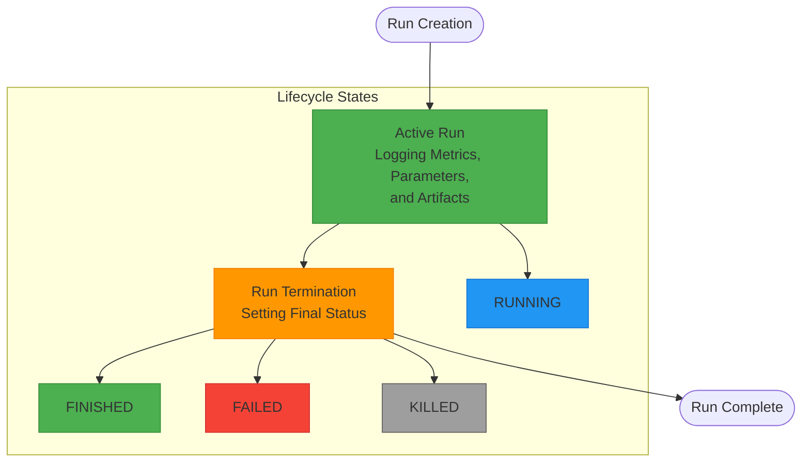
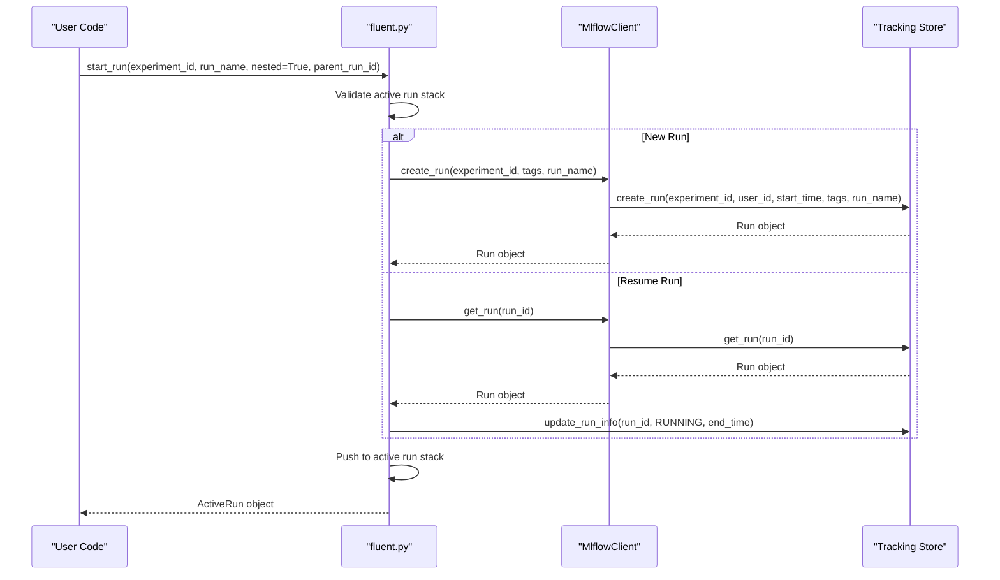

# Run Management

<cite>
**Referenced Files in This Document**   
- [mlflow/runs.py](file://mlflow/runs.py)
- [mlflow/entities/run.py](file://mlflow/entities/run.py)
- [mlflow/entities/run_info.py](file://mlflow/entities/run_info.py)
- [mlflow/entities/run_status.py](file://mlflow/entities/run_status.py)
- [mlflow/tracking/fluent.py](file://mlflow/tracking/fluent.py)
- [mlflow/tracking/client.py](file://mlflow/tracking/client.py)
- [mlflow/tracking/_tracking_service/client.py](file://mlflow/tracking/_tracking_service/client.py)
- [mlflow/store/tracking/rest_store.py](file://mlflow/store/tracking/rest_store.py)
</cite>

## Table of Contents
1. [Introduction](#introduction)
2. [Run Lifecycle Management](#run-lifecycle-management)
3. [Run States and Statuses](#run-states-and-statuses)
4. [Run Identifiers and Hierarchical Relationships](#run-identifiers-and-hierarchical-relationships)
5. [Run Creation and Active Run Management](#run-creation-and-active-run-management)
6. [Run Termination](#run-termination)
7. [Run Tagging and Metadata](#run-tagging-and-metadata)
8. [Relationships with Experiments and Artifacts](#relationships-with-experiments-and-artifacts)
9. [Common Issues and Solutions](#common-issues-and-solutions)
10. [Advanced Scenarios](#advanced-scenarios)

## Introduction
MLflow's experiment tracking system provides comprehensive run management capabilities that enable users to organize, monitor, and analyze machine learning experiments effectively. This document details the run management system, focusing on the complete run lifecycle from creation to termination, hierarchical run relationships, state management, and integration with other MLflow components. The run management system is designed to support both simple experimentation workflows and complex distributed training scenarios, providing robust tools for tracking experiment progress and results.

## Run Lifecycle Management

The run lifecycle in MLflow follows a well-defined sequence from creation to termination, with clear states that track the progress of each experiment. The lifecycle begins with run creation through the `start_run()` function, which initializes a new run or resumes an existing one. During the active phase, various metrics, parameters, and artifacts can be logged to the run. The lifecycle concludes with run termination through the `end_run()` function, which finalizes the run and sets its final status.

The run lifecycle is managed through a stack-based approach where active runs are maintained in a thread-local stack. This design ensures that nested runs can be properly managed and that the correct active run is always accessible. When a run is started, it is pushed onto the stack, and when it is ended, it is popped from the stack. This mechanism prevents conflicts between concurrent runs and ensures proper nesting relationships.



**Diagram sources**
- [mlflow/tracking/fluent.py](file://mlflow/tracking/fluent.py#L320-L687)
- [mlflow/entities/run_status.py](file://mlflow/entities/run_status.py#L4-L42)

**Section sources**
- [mlflow/tracking/fluent.py](file://mlflow/tracking/fluent.py#L320-L687)
- [mlflow/entities/run_status.py](file://mlflow/entities/run_status.py#L4-L42)

## Run States and Statuses

MLflow defines several run states that represent the different stages of a run's lifecycle. These states are implemented in the `RunStatus` class and include ACTIVE, FINISHED, FAILED, and KILLED. The ACTIVE state indicates that a run is currently in progress and can accept new metrics, parameters, and artifacts. When a run is terminated, it transitions to one of the terminal states: FINISHED (successful completion), FAILED (error during execution), or KILLED (explicit termination).

The `RunStatus` class provides utility methods for converting between string representations and enum values, as well as determining whether a status represents a terminated state. This design allows for flexible status management while maintaining type safety and consistency across the system. The status transitions are strictly controlled to prevent invalid state changes, such as attempting to resume a run that has already been marked as FINISHED.

```mermaid
classDiagram
class RunStatus {
+RUNNING
+SCHEDULED
+FINISHED
+FAILED
+KILLED
+from_string(status_str)
+to_string(status)
+is_terminated(status)
+all_status()
}
class RunInfo {
+run_id
+experiment_id
+user_id
+status
+start_time
+end_time
+lifecycle_stage
+artifact_uri
+run_name
}
RunInfo --> RunStatus : "has"
note right of RunStatus
Enum for status of an MLflow run.
Provides methods for string conversion
and termination status checking.
end note
```

**Diagram sources**
- [mlflow/entities/run_status.py](file://mlflow/entities/run_status.py#L4-L42)
- [mlflow/entities/run_info.py](file://mlflow/entities/run_info.py#L29-L189)

**Section sources**
- [mlflow/entities/run_status.py](file://mlflow/entities/run_status.py#L4-L42)
- [mlflow/entities/run_info.py](file://mlflow/entities/run_info.py#L29-L189)

## Run Identifiers and Hierarchical Relationships

Each run in MLflow is uniquely identified by a run ID, which is a UUID generated when the run is created. This identifier serves as the primary key for accessing and managing the run throughout its lifecycle. In addition to the run ID, runs can have optional human-readable names that make them easier to identify in the UI and API responses.

MLflow supports hierarchical run relationships through parent-child nesting. A child run can be created under a parent run, establishing a parent-child relationship that is represented by the `mlflow.parentRunId` tag. This hierarchical structure enables organizing related experiments, such as hyperparameter searches where each parameter combination is a child run of a parent optimization run. The nesting relationship is enforced by the system, which validates that the parent run is active when a child run is created.

```mermaid
graph TD
A[Parent Run] --> B[Child Run 1]
A --> C[Child Run 2]
A --> D[Child Run 3]
B --> E[Grandchild Run 1]
B --> F[Grandchild Run 2]
C --> G[Grandchild Run 3]
style A fill:#4CAF50,stroke:#388E3C
style B fill:#2196F3,stroke:#1976D2
style C fill:#2196F3,stroke:#1976D2
style D fill:#2196F3,stroke:#1976D2
style E fill:#FF9800,stroke:#F57C00
style F fill:#FF9800,stroke:#F57C00
style G fill:#FF9800,stroke:#F57C00
note right of A
Parent run serves as container
for related child runs
end note
note right of B
Child runs represent individual
experiments or trials
end note
note right of E
Grandchild runs can represent
sub-experiments or iterations
end note
```

**Diagram sources**
- [mlflow/tracking/fluent.py](file://mlflow/tracking/fluent.py#L320-L687)
- [mlflow/entities/run_info.py](file://mlflow/entities/run_info.py#L29-L189)

**Section sources**
- [mlflow/tracking/fluent.py](file://mlflow/tracking/fluent.py#L320-L687)
- [mlflow/entities/run_info.py](file://mlflow/entities/run_info.py#L29-L189)

## Run Creation and Active Run Management

Run creation in MLflow is primarily handled through the `start_run()` function, which initializes a new run or resumes an existing one. The function accepts several parameters including experiment ID, run name, nesting configuration, parent run ID, tags, and description. When a run is created, it is assigned a unique run ID, start time, and initial status of RUNNING. The run is then pushed onto the active run stack, making it the current active run for logging operations.

The `start_run()` function supports multiple creation modes, including creating a new run, resuming an existing run by ID, and creating nested runs. When resuming a run, the system validates that the run exists and is not in a deleted state before setting its status back to RUNNING. For nested runs, the system ensures that the parent run is active and properly sets the parent-child relationship through the `mlflow.parentRunId` tag.



**Diagram sources**
- [mlflow/tracking/fluent.py](file://mlflow/tracking/fluent.py#L320-L687)
- [mlflow/tracking/client.py](file://mlflow/tracking/client.py#L440-L495)
- [mlflow/store/tracking/rest_store.py](file://mlflow/store/tracking/rest_store.py#L335-L362)

**Section sources**
- [mlflow/tracking/fluent.py](file://mlflow/tracking/fluent.py#L320-L687)
- [mlflow/tracking/client.py](file://mlflow/tracking/client.py#L440-L495)

## Run Termination

Run termination in MLflow is managed through the `end_run()` function, which finalizes the current active run and sets its final status. The function pops the run from the active run stack, updates the run's status and end time in the tracking store, and performs any necessary cleanup operations. By default, runs are terminated with a status of FINISHED, but the status can be explicitly set to FAILED or KILLED to indicate different termination conditions.

The `end_run()` function is designed to work seamlessly with Python's context manager protocol, allowing runs to be automatically terminated when exiting a `with` block. When used as a context manager, the run status is automatically set to FINISHED if the block completes successfully, or to FAILED if an exception is raised. This design ensures that runs are always properly terminated, even in the event of errors.

```mermaid
flowchart TD
A[Call end_run()] --> B{Active Run Stack Empty?}
B --> |No| C[Pop Run from Stack]
B --> |Yes| D[No Active Run]
C --> E[Set End Time]
E --> F{Exception Occurred?}
F --> |No| G[Set Status to FINISHED]
F --> |Yes| H[Set Status to FAILED]
G --> I[Update Run in Store]
H --> I
I --> J[Cleanup Resources]
J --> K[Run Terminated]
style D fill:#FF9800,stroke:#F57C00
style K fill:#4CAF50,stroke:#388E3C
```

**Diagram sources**
- [mlflow/tracking/fluent.py](file://mlflow/tracking/fluent.py#L589-L637)
- [mlflow/tracking/_tracking_service/client.py](file://mlflow/tracking/_tracking_service/client.py#L782-L800)

**Section sources**
- [mlflow/tracking/fluent.py](file://mlflow/tracking/fluent.py#L589-L637)
- [mlflow/tracking/_tracking_service/client.py](file://mlflow/tracking/_tracking_service/client.py#L782-L800)

## Run Tagging and Metadata

Run tagging in MLflow provides a flexible way to add metadata and categorization to runs. Tags are key-value pairs that can be used to organize, filter, and search runs. MLflow supports both user-defined tags and system tags, with system tags providing standardized metadata such as run names, parent relationships, and source information.

Tags are implemented as part of the run's data structure and are stored alongside metrics and parameters. They can be added during run creation or modified during the run's lifecycle. The tagging system supports hierarchical relationships through special tags like `mlflow.parentRunId`, which establishes parent-child relationships between runs. Tags can also be used to implement custom workflows and organizational structures, such as tagging runs with environment, priority, or team information.

```mermaid
classDiagram
class Run {
+info : RunInfo
+data : RunData
+inputs : RunInputs
+outputs : RunOutputs
}
class RunData {
+metrics : List[Metric]
+params : List[Param]
+tags : List[RunTag]
}
class RunTag {
+key : str
+value : str
}
Run --> RunData
RunData --> RunTag
note right of RunTag
Key-value pairs for run metadata
and categorization
end note
note right of RunData
Container for run data including
metrics, parameters, and tags
end note
```

**Diagram sources**
- [mlflow/entities/run.py](file://mlflow/entities/run.py#L12-L98)
- [mlflow/entities/run_data.py](file://mlflow/entities/run_data.py)
- [mlflow/entities/run_tag.py](file://mlflow/entities/run_tag.py)

**Section sources**
- [mlflow/entities/run.py](file://mlflow/entities/run.py#L12-L98)
- [mlflow/entities/run_data.py](file://mlflow/entities/run_data.py)
- [mlflow/entities/run_tag.py](file://mlflow/entities/run_tag.py)

## Relationships with Experiments and Artifacts

Runs in MLflow are organized within experiments, which serve as containers for related runs. Each run belongs to exactly one experiment, identified by the experiment ID stored in the run's metadata. Experiments provide a higher-level organizational structure that enables grouping related runs and applying experiment-wide settings and configurations.

The relationship between runs and artifacts is managed through the artifact repository system. Each run has an associated artifact URI that serves as the root directory for storing run-specific artifacts. Artifacts can include model files, datasets, plots, and other output files generated during the run. The artifact system supports various storage backends, including local file systems, cloud storage, and database-backed storage.

```mermaid
graph TD
A[Experiment] --> B[Run 1]
A --> C[Run 2]
A --> D[Run 3]
B --> E[Artifacts<br>model.pkl, plot.png]
C --> F[Artifacts<br>model.h5, metrics.csv]
D --> G[Artifacts<br>model.pt, weights.bin]
style A fill:#4CAF50,stroke:#388E3C
style B fill:#2196F3,stroke:#1976D2
style C fill:#2196F3,stroke:#1976D2
style D fill:#2196F3,stroke:#1976D2
style E fill:#FF9800,stroke:#F57C00
style F fill:#FF9800,stroke:#F57C00
style G fill:#FF9800,stroke:#F57C00
note right of A
Experiment as container for
related runs
end note
note right of B
Individual runs with unique
identifiers and metadata
end note
note right of E
Artifacts stored in run-specific
directory with versioning
end note
```

**Diagram sources**
- [mlflow/entities/run_info.py](file://mlflow/entities/run_info.py#L29-L189)
- [mlflow/store/artifact/runs_artifact_repo.py](file://mlflow/store/artifact/runs_artifact_repo.py)

**Section sources**
- [mlflow/entities/run_info.py](file://mlflow/entities/run_info.py#L29-L189)
- [mlflow/store/artifact/runs_artifact_repo.py](file://mlflow/store/artifact/runs_artifact_repo.py)

## Common Issues and Solutions

One common issue in run management is orphaned runs, which occur when a run is started but not properly terminated due to process interruption or errors. MLflow addresses this issue through several mechanisms, including automatic cleanup on process exit and the ability to manually terminate runs. The system also provides tools for identifying and managing orphaned runs through the API and CLI.

Another common issue is conflicts between concurrent runs, particularly in distributed training scenarios. MLflow prevents these conflicts through its thread-local active run stack, which ensures that each thread has its own run context. For distributed scenarios, users can explicitly manage run IDs to coordinate between processes.

```mermaid
flowchart TD
A[Orphaned Run Issue] --> B{Run Still Active?}
B --> |Yes| C[Identify Run ID]
C --> D[Use end_run() with Run ID]
D --> E[Run Properly Terminated]
B --> |No| F[Run Already Terminated]
G[Concurrent Run Issue] --> H{Same Thread?}
H --> |Yes| I[Use Nested Runs]
H --> |No| J[Use Thread-Local Storage]
I --> K[Proper Hierarchy]
J --> L[Isolated Contexts]
style E fill:#4CAF50,stroke:#388E3C
style F fill:#4CAF50,stroke:#388E3C
style K fill:#4CAF50,stroke:#388E3C
style L fill:#4CAF50,stroke:#388E3C
```

**Diagram sources**
- [mlflow/tracking/fluent.py](file://mlflow/tracking/fluent.py#L634-L639)
- [mlflow/utils/thread_utils.py](file://mlflow/utils/thread_utils.py)

**Section sources**
- [mlflow/tracking/fluent.py](file://mlflow/tracking/fluent.py#L634-L639)
- [mlflow/utils/thread_utils.py](file://mlflow/utils/thread_utils.py)

## Advanced Scenarios

MLflow's run management system supports advanced scenarios such as distributed training and hyperparameter optimization. In distributed training scenarios, multiple processes can coordinate their runs by sharing run IDs or using hierarchical relationships to organize worker runs under a master run. This approach enables comprehensive tracking of distributed experiments while maintaining clear relationships between components.

For hyperparameter optimization, MLflow's nested run feature is particularly valuable. The optimization process can be structured as a parent run, with each parameter combination as a child run. This organization makes it easy to compare results across different parameter settings and analyze the optimization process as a whole.

```mermaid
graph TD
A[Master Run] --> B[Worker Run 1]
A --> C[Worker Run 2]
A --> D[Worker Run 3]
B --> E[Metrics]
B --> F[Artifacts]
C --> G[Metrics]
C --> H[Artifacts]
D --> I[Metrics]
D --> J[Artifacts]
style A fill:#4CAF50,stroke:#388E3C
style B fill:#2196F3,stroke:#1976D2
style C fill:#2196F3,stroke:#1976D2
style D fill:#2196F3,stroke:#1976D2
note right of A
Master run coordinates
distributed training
end note
note right of B
Worker runs execute
individual tasks
end note
```

**Diagram sources**
- [mlflow/tracking/fluent.py](file://mlflow/tracking/fluent.py#L320-L687)
- [mlflow/entities/run_info.py](file://mlflow/entities/run_info.py#L29-L189)

**Section sources**
- [mlflow/tracking/fluent.py](file://mlflow/tracking/fluent.py#L320-L687)
- [mlflow/entities/run_info.py](file://mlflow/entities/run_info.py#L29-L189)