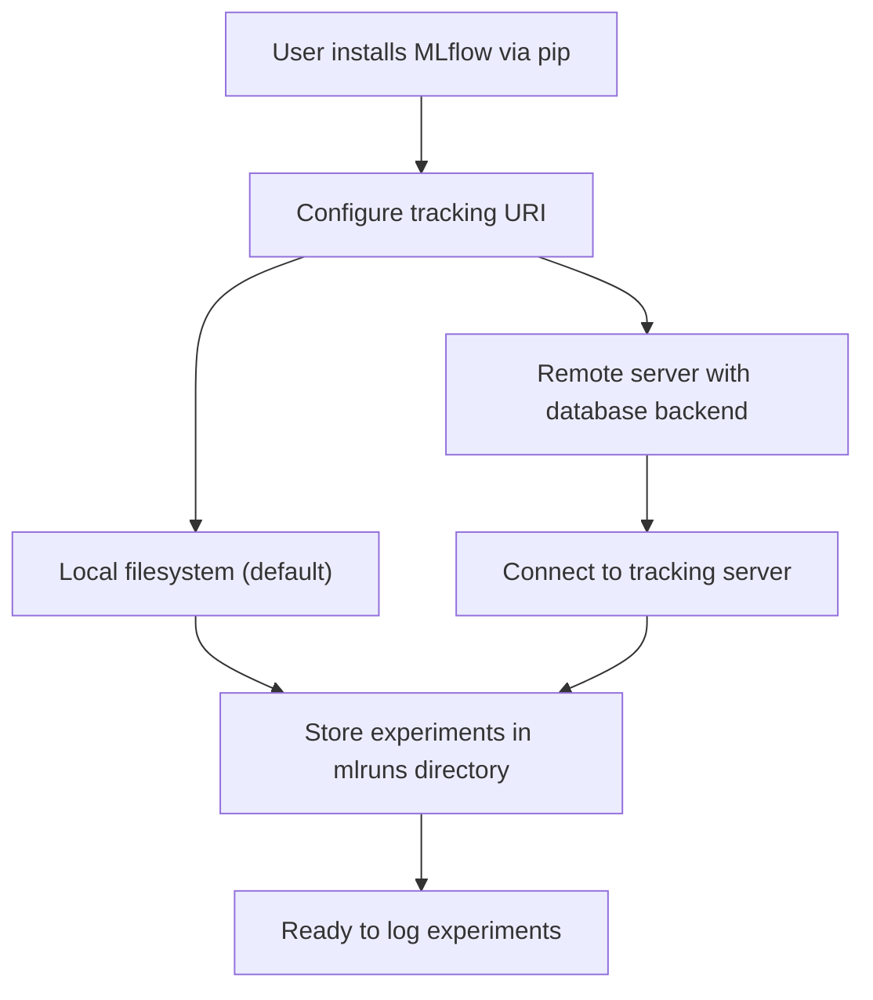
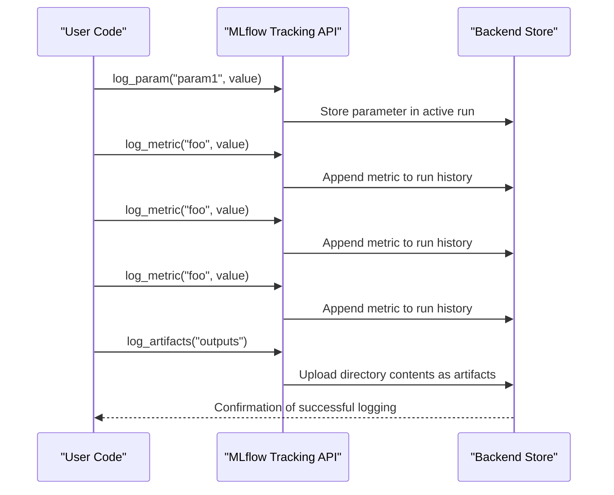
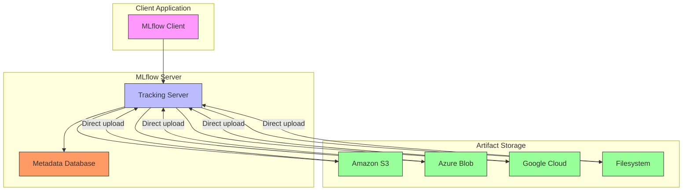

# Getting Started

<cite>
**Referenced Files in This Document**   
- [mlflow_tracking.py](file://examples/quickstart/mlflow_tracking.py)
- [README.md](file://README.md)
- [environment_variables.py](file://mlflow/environment_variables.py)
- [fluent.py](file://mlflow/tracking/fluent.py)
- [client.py](file://mlflow/tracking/client.py)
- [index.mdx](file://docs/docs/self-hosting/architecture/backend-store.mdx)
- [index.mdx](file://docs/docs/self-hosting/architecture/tracking-server.mdx)
- [index.mdx](file://docs/docs/self-hosting/security/network.mdx)
</cite>

## Table of Contents
1. [Introduction](#introduction)
2. [Installation Methods](#installation-methods)
3. [Basic Setup and Configuration](#basic-setup-and-configuration)
4. [Quickstart Example Walkthrough](#quickstart-example-walkthrough)
5. [Tracking Server and Artifact Storage](#tracking-server-and-artifact-storage)
6. [Common Issues and Solutions](#common-issues-and-solutions)
7. [Platform-Specific Considerations](#platform-specific-considerations)
8. [Conclusion](#conclusion)

## Introduction
MLflow is an open-source platform designed to streamline the development, tracking, and deployment of machine learning models and AI applications. This guide provides a comprehensive introduction for new users, covering installation, basic setup, configuration, and initial workflow execution. The content is designed to be accessible to beginners while providing sufficient technical depth to understand the underlying mechanisms of MLflow's tracking system, experiment management, and artifact storage.

The guide focuses on the core MLflow tracking functionality, which enables users to log parameters, metrics, and artifacts during model training and evaluation. It also covers the relationship between the tracking server, artifact storage, and client configuration, providing practical examples and solutions to common issues encountered during onboarding.

**Section sources**
- [README.md](file://README.md#L1-L324)

## Installation Methods
MLflow can be installed using pip, the Python package manager, which is the recommended method for most users. The installation process is straightforward and can be completed with a single command:

```bash
pip install mlflow
```

This command installs the core MLflow package with all necessary dependencies for tracking experiments, managing models, and deploying applications. MLflow also supports alternative distributions through other package managers and language ecosystems:

- **TypeScript/JavaScript**: Available via npm as `mlflow-tracing`
- **Java**: Available via Maven Central as `org.mlflow/mlflow-client`
- **R**: Available via CRAN as `mlflow`

For users who want to minimize dependencies, MLflow offers a "skinny" client distribution that omits data science libraries and SQL dependencies. This lightweight version is suitable for environments where only tracking functionality is needed without the overhead of additional machine learning libraries.

The installation process automatically configures the necessary environment variables and command-line interfaces, making MLflow immediately available for use after installation. No additional configuration is required for basic local usage, as MLflow defaults to storing data in the local filesystem.

**Section sources**
- [README.md](file://README.md#L38-L45)
- [environment_variables.py](file://mlflow/environment_variables.py#L1-L1210)

## Basic Setup and Configuration
After installation, MLflow requires minimal setup to begin tracking experiments. By default, MLflow uses the local filesystem to store tracking data and artifacts, with the default location being a directory named `mlruns` in the current working directory. This default configuration allows users to start logging experiments immediately without any additional configuration.

The primary configuration mechanism in MLflow is through environment variables, which control various aspects of the tracking system. Key environment variables include:

- `MLFLOW_TRACKING_URI`: Specifies the tracking URI for storing experiment data
- `MLFLOW_ARTIFACT_ROOT`: Defines the root directory for storing artifacts
- `MLFLOW_S3_ENDPOINT_URL`: Configures the S3 endpoint URL for S3 artifact operations
- `MLFLOW_TRACKING_AWS_SIGV4`: Enables AWS signature version 4 for tracking requests

Users can configure MLflow either through environment variables or programmatically using the MLflow API. The tracking URI can be set using the `mlflow.set_tracking_uri()` function, which directs all subsequent tracking operations to the specified location. This flexibility allows users to switch between local and remote tracking servers without modifying their code.

For production environments, it's recommended to use a database backend (such as PostgreSQL or MySQL) instead of the default file-based storage, as it provides better performance, reliability, and concurrency support. The file system backend is in maintenance mode and no longer receives new feature updates.



**Diagram sources**
- [README.md](file://README.md#L144-L160)
- [index.mdx](file://docs/docs/self-hosting/architecture/backend-store.mdx#L31-L52)

**Section sources**
- [README.md](file://README.md#L144-L160)
- [index.mdx](file://docs/docs/self-hosting/architecture/backend-store.mdx#L31-L52)
- [environment_variables.py](file://mlflow/environment_variables.py#L1-L1210)

## Quickstart Example Walkthrough
The MLflow quickstart example demonstrates the fundamental workflow of logging parameters, metrics, and artifacts. This example, located in `examples/quickstart/mlflow_tracking.py`, provides a concrete illustration of how to use MLflow's tracking capabilities.

The example begins by importing the necessary modules and initializing the MLflow tracking API:

```python
from mlflow import log_param, log_metric, log_artifacts
```

The core workflow consists of three main operations:

1. **Logging parameters**: Using `log_param()` to record hyperparameters or configuration values
2. **Logging metrics**: Using `log_metric()` to record performance metrics during training
3. **Logging artifacts**: Using `log_artifacts()` to save files generated during the experiment

The example demonstrates logging a random parameter value, recording multiple metric values (simulating training progress), and saving a text file as an artifact. The workflow follows a simple pattern:



The example creates an "outputs" directory, writes a text file to it, and logs the entire directory as artifacts. This pattern is commonly used to save model checkpoints, evaluation results, or any other files generated during an experiment.

When executed, this code creates a new MLflow run, logs the specified data, and stores everything in the configured backend store. Users can then view the results in the MLflow UI by running `mlflow server` and accessing the web interface.

**Diagram sources**
- [mlflow_tracking.py](file://examples/quickstart/mlflow_tracking.py#L1-L21)

**Section sources**
- [mlflow_tracking.py](file://examples/quickstart/mlflow_tracking.py#L1-L21)
- [fluent.py](file://mlflow/tracking/fluent.py#L1-L200)

## Tracking Server and Artifact Storage
MLflow's architecture separates the tracking server from artifact storage, allowing for flexible deployment configurations. The tracking server manages metadata about experiments, runs, parameters, and metrics, while artifact storage handles larger files such as models, datasets, and output files.

The tracking server can be started using the `mlflow server` command, which launches a web server that exposes REST APIs for tracking operations. Key command-line options include:

- `--backend-store-uri`: Specifies the database or filesystem location for tracking data
- `--artifacts-destination`: Defines the root location for artifact storage
- `--host` and `--port`: Configure the network interface and port for the server
- `--serve-artifacts`: Enables artifact serving through the tracking server

For remote storage, MLflow supports various artifact repositories including Amazon S3, Azure Blob Storage, Google Cloud Storage, and HDFS. To configure access to these storage systems, users must set appropriate environment variables with credentials and endpoint information.

When using a remote tracking server, clients must configure the tracking URI to point to the server's address. This can be done either through the `MLFLOW_TRACKING_URI` environment variable or programmatically using `mlflow.set_tracking_uri()`. Once configured, all tracking operations are automatically routed to the remote server.

The separation between tracking metadata and artifact storage enables efficient handling of large files while maintaining fast access to experiment metadata. Artifacts are stored with a reference in the tracking database, allowing users to retrieve them through the MLflow API or directly from the storage location.



**Diagram sources**
- [index.mdx](file://docs/docs/self-hosting/architecture/tracking-server.mdx#L455-L471)
- [index.mdx](file://docs/docs/self-hosting/security/network.mdx#L77-L125)

**Section sources**
- [index.mdx](file://docs/docs/self-hosting/architecture/tracking-server.mdx#L455-L471)
- [index.mdx](file://docs/docs/self-hosting/security/network.mdx#L77-L125)
- [client.py](file://mlflow/tracking/client.py#L1-L200)

## Common Issues and Solutions
New users often encounter several common issues when getting started with MLflow. Understanding these problems and their solutions can help streamline the onboarding process.

**Connection Errors**: When connecting to a remote tracking server, users may encounter connection timeouts or authentication failures. These issues are typically resolved by:
- Verifying the tracking URI is correctly formatted
- Ensuring network connectivity to the server
- Configuring appropriate authentication credentials
- Checking firewall settings and security groups

**Configuration Problems**: Issues with MLflow configuration often stem from environment variable conflicts or incorrect URI formats. Common solutions include:
- Using absolute paths for local storage URIs
- Properly formatting database connection strings
- Setting environment variables before starting the tracking server
- Validating configuration with `mlflow server --help`

**Artifact Storage Issues**: Problems with artifact storage frequently occur when using cloud storage systems. These can be addressed by:
- Setting the appropriate S3 endpoint URL with `MLFLOW_S3_ENDPOINT_URL`
- Configuring AWS credentials through environment variables or IAM roles
- Ensuring proper permissions for the storage location
- Verifying network connectivity to the storage service

**Performance Issues**: Slow operations, particularly with large artifacts, can be mitigated by:
- Enabling multipart upload for large files
- Configuring appropriate timeout values
- Using database backends instead of file-based storage
- Optimizing network connectivity between client and server

For troubleshooting, users should check the MLflow server logs, verify environment variable settings, and consult the documentation for specific error messages. The MLflow community and documentation provide extensive resources for resolving common issues.

**Section sources**
- [environment_variables.py](file://mlflow/environment_variables.py#L1-L1210)
- [index.mdx](file://docs/docs/self-hosting/security/network.mdx#L77-L125)

## Platform-Specific Considerations
MLflow operates across various platforms and environments, each with specific considerations for optimal performance and compatibility.

**Operating Systems**: MLflow supports all major operating systems including Windows, macOS, and Linux. While the core functionality is consistent across platforms, there are some differences to consider:
- File path handling and separators
- Environment variable syntax and management
- System-specific performance characteristics
- Integration with platform-specific tools and services

**Cloud Environments**: When deploying MLflow in cloud environments, users should consider:
- Integration with managed services (Amazon SageMaker, Azure ML, Databricks)
- Configuration of virtual private clouds and network security
- Management of storage costs and data transfer
- Compliance with security and regulatory requirements

**Containerized Deployments**: For containerized environments using Docker or Kubernetes:
- Proper configuration of volume mounts for artifact storage
- Management of environment variables in container orchestration
- Network configuration for inter-container communication
- Resource allocation and scaling considerations

**Distributed Computing**: When using MLflow with distributed computing frameworks:
- Coordination of tracking across multiple nodes
- Management of concurrent access to the tracking store
- Optimization of artifact transfer over the network
- Handling of fault tolerance and recovery

Platform-specific configuration often involves setting appropriate environment variables and ensuring compatibility between the MLflow client and server versions. Users should consult the documentation for specific guidance related to their deployment environment.

**Section sources**
- [README.md](file://README.md#L144-L160)
- [environment_variables.py](file://mlflow/environment_variables.py#L1-L1210)

## Conclusion
This getting started guide has provided a comprehensive introduction to MLflow, covering installation, basic setup, configuration, and the core tracking workflow. By following the examples and understanding the underlying architecture, new users can quickly begin tracking their machine learning experiments and leveraging MLflow's powerful features.

The quickstart example demonstrates the fundamental operations of logging parameters, metrics, and artifacts, forming the basis for more complex workflows. Understanding the relationship between the tracking server, metadata storage, and artifact storage is crucial for effective deployment and scaling of MLflow in various environments.

As users become more familiar with MLflow, they can explore advanced features such as autologging, model registry, and deployment capabilities. The platform's flexibility and extensibility make it suitable for a wide range of machine learning workflows, from simple experiments to complex production systems.

By addressing common issues and understanding platform-specific considerations, users can ensure a smooth onboarding experience and maximize the benefits of using MLflow for their machine learning projects.