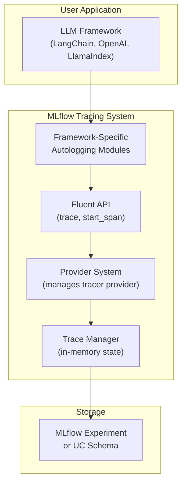
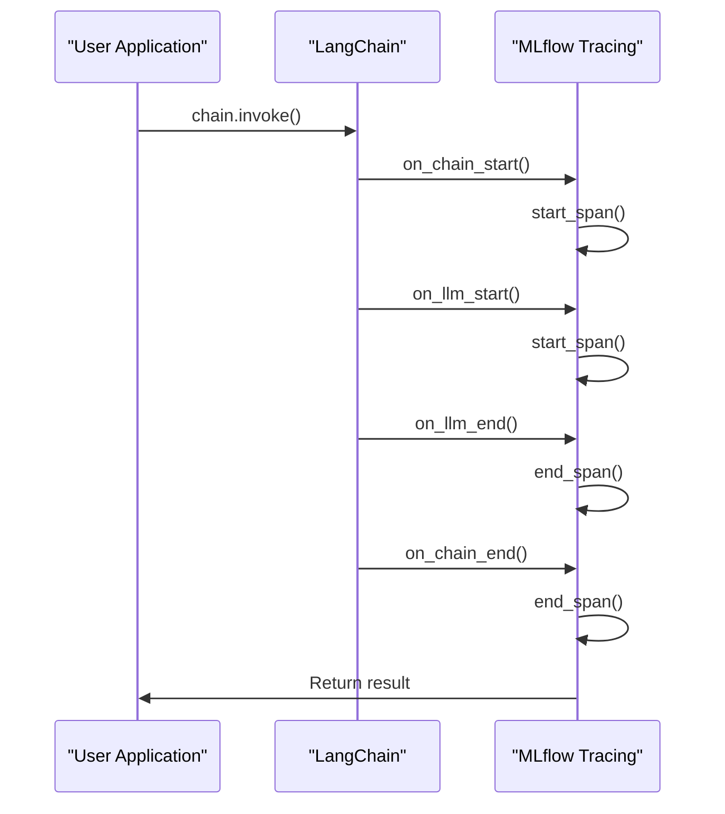
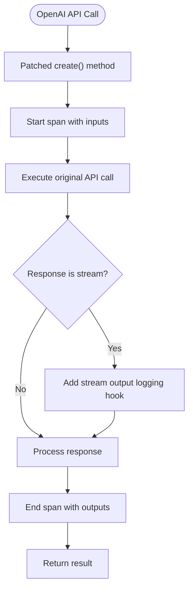
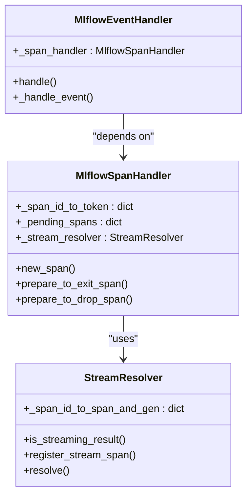
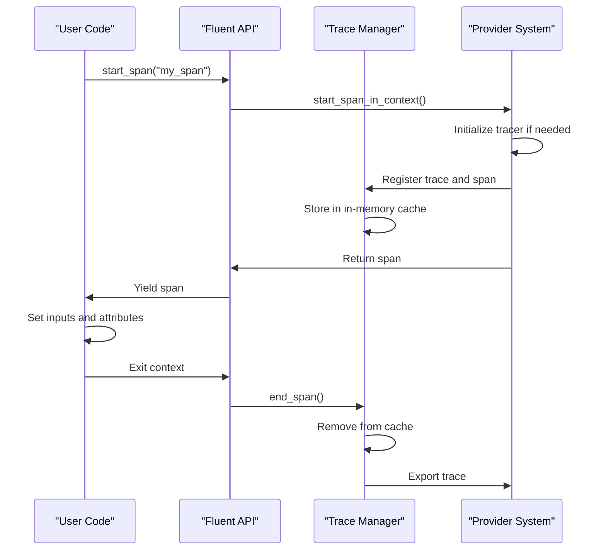
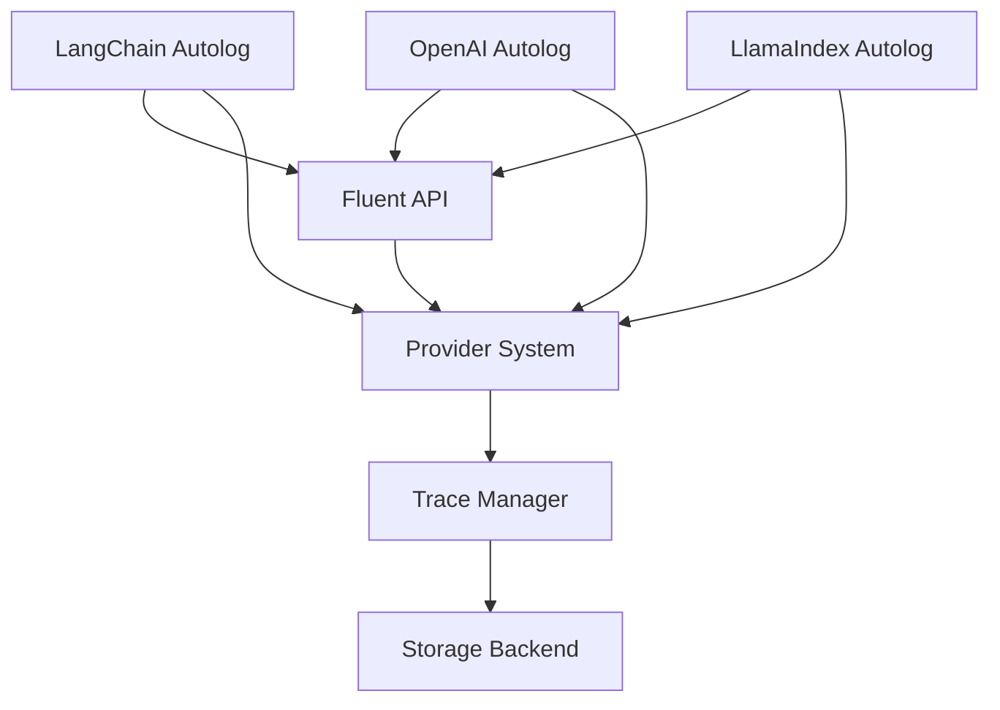

# Automatic Tracing

<cite>
**Referenced Files in This Document**   
- [mlflow/langchain/autolog.py](file://mlflow/langchain/autolog.py)
- [mlflow/openai/autolog.py](file://mlflow/openai/autolog.py)
- [mlflow/llama_index/autolog.py](file://mlflow/llama_index/autolog.py)
- [mlflow/tracing/provider.py](file://mlflow/tracing/provider.py)
- [mlflow/tracing/fluent.py](file://mlflow/tracing/fluent.py)
- [mlflow/tracing/trace_manager.py](file://mlflow/tracing/trace_manager.py)
- [mlflow/langchain/langchain_tracer.py](file://mlflow/langchain/langchain_tracer.py)
- [mlflow/llama_index/tracer.py](file://mlflow/llama_index/tracer.py)
- [examples/langchain/chain_autolog.py](file://examples/langchain/chain_autolog.py)
- [examples/openai/autologging/chat_completions.py](file://examples/openai/autologging/chat_completions.py)
</cite>

## Table of Contents
1. [Introduction](#introduction)
2. [Core Components](#core-components)
3. [Architecture Overview](#architecture-overview)
4. [Detailed Component Analysis](#detailed-component-analysis)
5. [Dependency Analysis](#dependency-analysis)
6. [Performance Considerations](#performance-considerations)
7. [Troubleshooting Guide](#troubleshooting-guide)
8. [Conclusion](#conclusion)

## Introduction
MLflow's LLM observability framework provides automatic tracing capabilities for popular LLM frameworks such as LangChain, OpenAI, and LlamaIndex. This automatic tracing captures detailed information about prompts, completions, and agent workflows without requiring code modifications. The system is enabled through the `mlflow.autolog()` function and its framework-specific variants, which configure and activate tracing for different LLM integrations. The tracing system captures execution data through a fluent API that works in conjunction with a provider system and trace manager to collect and store trace information. This documentation explains the implementation details, configuration options, and best practices for using automatic tracing in MLflow.

## Core Components
The automatic tracing system in MLflow consists of several core components that work together to capture and manage trace data from LLM frameworks. The system is built around a fluent API that provides a simple interface for enabling and configuring tracing. The provider system manages the global tracer provider and ensures compatibility with other OpenTelemetry-based systems. The trace manager maintains in-memory state for active traces and spans. Framework-specific autologging modules (for LangChain, OpenAI, and LlamaIndex) implement the integration with each framework, using patching and callback mechanisms to capture execution data. The system also includes utilities for handling streaming responses, token usage calculation, and error handling during trace collection.

**Section sources**
- [mlflow/tracing/fluent.py](file://mlflow/tracing/fluent.py#L1-L1487)
- [mlflow/tracing/provider.py](file://mlflow/tracing/provider.py#L1-L696)
- [mlflow/tracing/trace_manager.py](file://mlflow/tracing/trace_manager.py#L1-L213)

## Architecture Overview
The automatic tracing architecture in MLflow follows a layered design that separates concerns between the fluent API, provider system, and framework-specific integrations. The fluent API provides a high-level interface for starting and managing spans and traces. The provider system acts as an abstraction layer between MLflow's tracing implementation and the underlying OpenTelemetry SDK, allowing MLflow to control the tracer provider initialization and prevent conflicts with other libraries that use OpenTelemetry. Framework-specific autologging modules use safe patching techniques to inject tracing callbacks into the target frameworks without modifying their core functionality. The trace manager maintains the state of active traces in memory and coordinates the export of completed traces to the configured destination. This architecture enables non-invasive tracing that captures detailed execution data while maintaining compatibility with the target frameworks.

**Diagram sources **
- [mlflow/tracing/fluent.py](file://mlflow/tracing/fluent.py#L1-L1487)
- [mlflow/tracing/provider.py](file://mlflow/tracing/provider.py#L1-L696)
- [mlflow/tracing/trace_manager.py](file://mlflow/tracing/trace_manager.py#L1-L213)

## Detailed Component Analysis

### LangChain Integration
The LangChain integration in MLflow uses a callback-based approach to capture execution data. When `mlflow.langchain.autolog()` is called, it patches the `BaseCallbackManager.__init__` method to inject the `MlflowLangchainTracer` callback into all LangChain runs. This tracer implements the LangChain callback interface and creates MLflow spans for various events such as LLM starts, chain executions, tool calls, and retriever operations. The tracer handles both synchronous and asynchronous execution, and properly manages the span context across different execution contexts. It also captures additional metadata such as token usage, retry attempts, and agent actions. The integration supports streaming responses by creating special span events for each token and properly ending the span when the stream completes.

**Diagram sources **
- [mlflow/langchain/autolog.py](file://mlflow/langchain/autolog.py#L1-L161)
- [mlflow/langchain/langchain_tracer.py](file://mlflow/langchain/langchain_tracer.py#L1-L677)

### OpenAI Integration
The OpenAI integration uses method patching to intercept API calls and create traces. When `mlflow.openai.autolog()` is enabled, it patches the `create` methods of various OpenAI client classes (ChatCompletions, Completions, Embeddings) to wrap the original function calls with span creation and management logic. The patched functions create a span before the API call, capture the input parameters as span attributes, and process the response to extract outputs and token usage information. For streaming responses, the integration adds a hook to the response iterator to capture each chunk as a span event and reconstruct the complete response when the stream ends. The integration also handles asynchronous calls through separate patched functions for async methods.

**Diagram sources **
- [mlflow/openai/autolog.py](file://mlflow/openai/autolog.py#L1-L488)

### LlamaIndex Integration
The LlamaIndex integration uses LlamaIndex's native instrumentation system to capture execution data. When `mlflow.llama_index.autolog()` is called, it registers an `MlflowSpanHandler` and `MlflowEventHandler` with LlamaIndex's global dispatcher. The span handler creates MLflow spans for various LlamaIndex components (LLMs, retrievers, agents) and manages their lifecycle. The event handler processes additional events from LlamaIndex to capture metadata such as model parameters, prompt templates, and token usage. The integration handles streaming responses by using a `StreamResolver` that tracks pending spans and resolves them when the stream completes. It also properly handles the hierarchical structure of LlamaIndex workflows, maintaining parent-child relationships between spans.

**Diagram sources **
- [mlflow/llama_index/autolog.py](file://mlflow/llama_index/autolog.py#L1-L59)
- [mlflow/llama_index/tracer.py](file://mlflow/llama_index/tracer.py#L1-L570)

### Fluent API and Trace Management
The fluent API provides a simple interface for manual tracing and integrates with the automatic tracing system. Functions like `trace()` and `start_span()` create spans that are managed by the trace manager. The trace manager maintains an in-memory cache of active traces and spans, coordinating their lifecycle from creation to export. It uses a thread-safe data structure to handle concurrent access and properly manages the context for active spans. The provider system ensures that the tracer provider is properly initialized and configured, handling cases where tracing is disabled or multiple destinations are configured. This layered architecture allows the fluent API to work seamlessly with automatic tracing, enabling users to add custom spans within automatically traced workflows.

**Diagram sources **
- [mlflow/tracing/fluent.py](file://mlflow/tracing/fluent.py#L1-L1487)
- [mlflow/tracing/trace_manager.py](file://mlflow/tracing/trace_manager.py#L1-L213)
- [mlflow/tracing/provider.py](file://mlflow/tracing/provider.py#L1-L696)

## Dependency Analysis
The automatic tracing system in MLflow has a well-defined dependency structure that ensures proper initialization and operation. The fluent API depends on the provider system to manage the tracer provider and create spans. The provider system depends on the trace manager to maintain the state of active traces. Framework-specific autologging modules depend on both the fluent API and the provider system to create and manage spans. The trace manager has no external dependencies within the tracing system, making it a central component that coordinates the other components. This dependency structure ensures that components are initialized in the correct order and that the system can properly handle cases where tracing is disabled or re-enabled.

**Diagram sources **
- [mlflow/tracing/fluent.py](file://mlflow/tracing/fluent.py#L1-L1487)
- [mlflow/tracing/provider.py](file://mlflow/tracing/provider.py#L1-L696)
- [mlflow/tracing/trace_manager.py](file://mlflow/tracing/trace_manager.py#L1-L213)
- [mlflow/langchain/autolog.py](file://mlflow/langchain/autolog.py#L1-L161)
- [mlflow/openai/autolog.py](file://mlflow/openai/autolog.py#L1-L488)
- [mlflow/llama_index/autolog.py](file://mlflow/llama_index/autolog.py#L1-L59)

## Performance Considerations
Automatic tracing in MLflow is designed to have minimal impact on the performance of LLM applications. The system uses efficient data structures and algorithms to minimize overhead. For high-volume LLM applications, several performance considerations should be taken into account. The in-memory trace manager uses a thread-safe cache with configurable timeout to prevent memory leaks from incomplete traces. The system batches trace exports to reduce the number of storage operations. For streaming responses, the integration is designed to avoid consuming the generator prematurely, which could impact the application's performance. Users can disable tracing for specific frameworks or globally when performance is critical. The system also provides configuration options to control the level of detail captured in traces, allowing users to balance observability with performance.

**Section sources**
- [mlflow/tracing/trace_manager.py](file://mlflow/tracing/trace_manager.py#L1-L213)
- [mlflow/tracing/provider.py](file://mlflow/tracing/provider.py#L1-L696)

## Troubleshooting Guide
Common issues with automatic tracing in MLflow include missing traces due to improper setup, incorrect span hierarchies, and problems with streaming responses. To resolve missing traces, ensure that `mlflow.autolog()` or the framework-specific autolog function is called before any LLM operations. For issues with span hierarchies, verify that the correct parent spans are being used and that context propagation is working properly. Problems with streaming responses can often be resolved by ensuring that the stream is properly consumed and that the final chunk event is processed. The system provides logging and debugging utilities that can help diagnose issues with trace collection. Users should also check that the required dependencies are installed and compatible with the MLflow version being used.

**Section sources**
- [mlflow/tracing/fluent.py](file://mlflow/tracing/fluent.py#L1-L1487)
- [mlflow/tracing/provider.py](file://mlflow/tracing/provider.py#L1-L696)
- [mlflow/langchain/langchain_tracer.py](file://mlflow/langchain/langchain_tracer.py#L1-L677)

## Conclusion
MLflow's automatic tracing system provides comprehensive observability for LLM applications built with popular frameworks like LangChain, OpenAI, and LlamaIndex. The system uses a combination of method patching, callback injection, and fluent API integration to capture detailed execution data without requiring code modifications. The architecture is designed to be non-invasive and compatible with the target frameworks, while providing rich tracing capabilities that include prompts, completions, agent workflows, and token usage. The system is configurable through the `mlflow.autolog()` function and its framework-specific variants, allowing users to control the level of detail captured in traces. For production deployment, users should consider the performance implications and configure the system appropriately for their use case. The automatic tracing capabilities in MLflow enable developers to gain deep insights into their LLM applications, facilitating debugging, optimization, and monitoring.