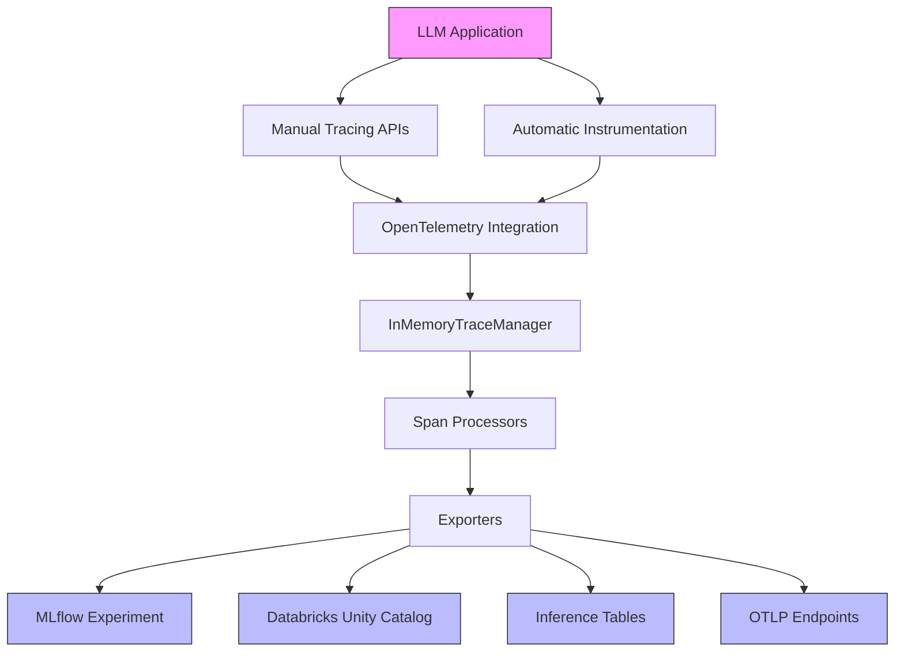
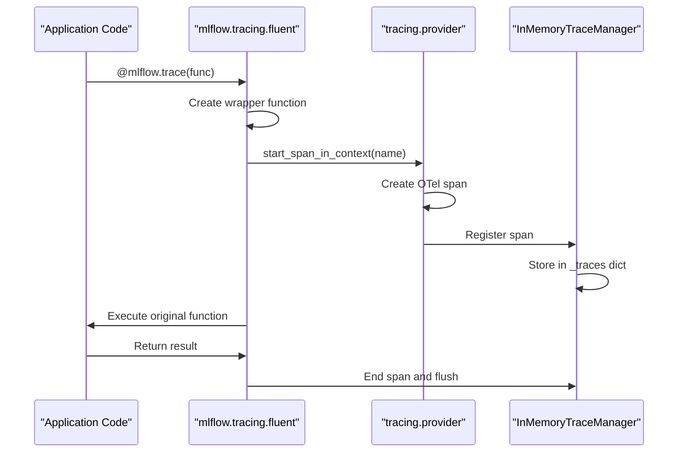
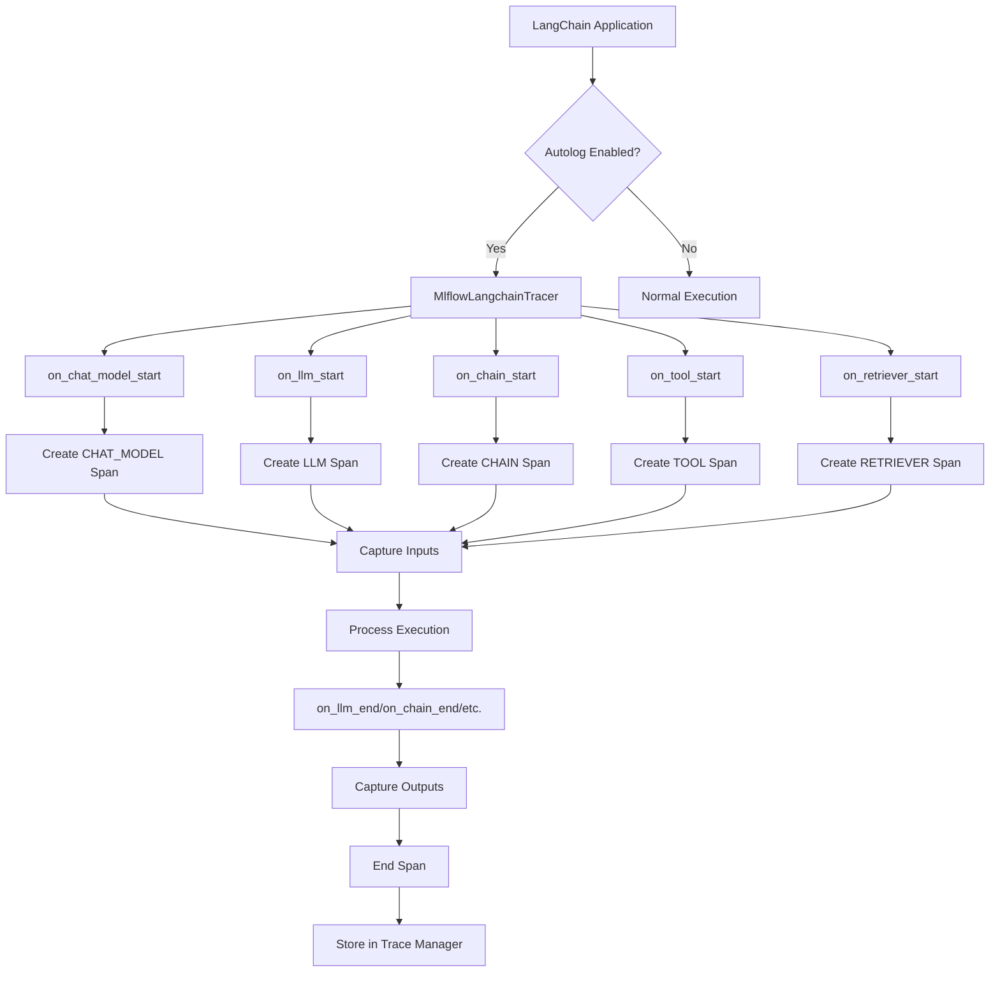
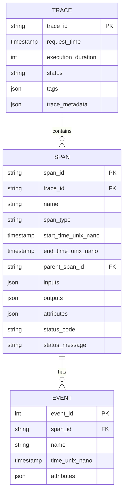
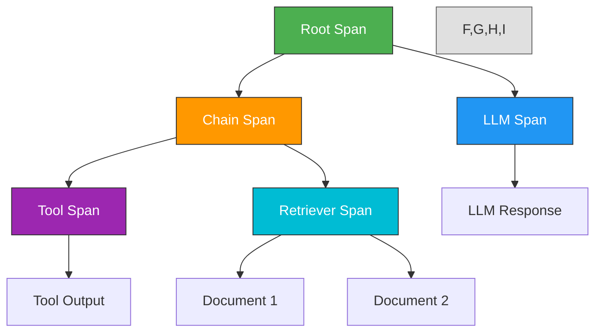

# LLM Tracing

<cite>
**Referenced Files in This Document**   
- [fluent.py](file://mlflow/tracing/fluent.py)
- [span.py](file://mlflow/entities/span.py)
- [trace.py](file://mlflow/entities/trace.py)
- [langchain_tracer.py](file://mlflow/langchain/langchain_tracer.py)
- [provider.py](file://mlflow/tracing/provider.py)
- [trace_manager.py](file://mlflow/tracing/trace_manager.py)
- [constant.py](file://mlflow/tracing/constant.py)
- [tracing.py](file://mlflow/tracing/__init__.py)
</cite>

## Table of Contents
1. [Introduction](#introduction)
2. [Core Concepts](#core-concepts)
3. [Architecture Overview](#architecture-overview)
4. [Manual Tracing APIs](#manual-tracing-apis)
5. [Automatic Instrumentation](#automatic-instrumentation)
6. [OpenTelemetry Integration](#opentelemetry-integration)
7. [Trace Data Model](#trace-data-model)
8. [Trace Visualization](#trace-visualization)
9. [Practical Examples](#practical-examples)
10. [API Reference](#api-reference)
11. [Troubleshooting Guide](#troubleshooting-guide)
12. [Conclusion](#conclusion)

## Introduction

MLflow's LLM tracing framework provides comprehensive observability for large language model applications by automatically capturing and visualizing the execution flow of LLM-powered systems. This framework enables developers and data scientists to gain deep insights into their LLM applications by tracing prompts, completions, agent workflows, and tool interactions throughout the entire application lifecycle.

The tracing system is designed to work seamlessly with various LLM frameworks and providers, offering both automatic instrumentation for popular libraries like LangChain and manual tracing APIs for custom implementations. By capturing detailed information about each step in an LLM workflow—including inputs, outputs, metadata, and performance metrics—MLflow tracing helps users debug prompt engineering issues, monitor agent performance, optimize costs, and ensure the reliability of their LLM applications.

This documentation provides a comprehensive guide to MLflow's tracing capabilities, covering conceptual overviews for beginners and detailed technical information for experienced developers. The content includes architecture diagrams, practical examples, and API references to help users effectively implement and leverage tracing in their LLM applications.

## Core Concepts

MLflow tracing revolves around several fundamental concepts that form the foundation of the observability framework. At the core of this system are **traces** and **spans**, which represent the execution flow of LLM applications. A trace is a collection of spans that represents a complete workflow or transaction, while a span represents an individual operation or unit of work within that workflow.

The framework supports various span types that categorize different components of LLM applications, including LLM, CHAIN, AGENT, TOOL, CHAT_MODEL, RETRIEVER, PARSER, EMBEDDING, RERANKER, MEMORY, UNKNOWN, WORKFLOW, TASK, GUARDRAIL, and EVALUATOR. These span types help organize and visualize the different components of complex LLM workflows, making it easier to understand the flow of execution and identify performance bottlenecks.

Traces capture comprehensive information about each operation, including inputs, outputs, attributes, events, and status. The system automatically records metadata such as execution duration, timestamps, and error information, providing a complete picture of each workflow's execution. This rich data enables detailed analysis and debugging of LLM applications, allowing users to understand exactly how their models are processing inputs and generating outputs.

The tracing framework also supports hierarchical relationships between spans, where child spans can be nested within parent spans to represent complex workflows. This hierarchical structure is particularly valuable for agent-based systems where multiple tools and sub-tasks are orchestrated to accomplish a larger goal. The parent-child relationships between spans help visualize the call hierarchy and execution flow, making it easier to understand complex interactions within LLM applications.

**Section sources**
- [span.py](file://mlflow/entities/span.py#L43-L64)
- [trace.py](file://mlflow/entities/trace.py#L25-L32)
- [constant.py](file://mlflow/tracing/constant.py#L4-L64)

## Architecture Overview

The MLflow tracing architecture is designed as a layered system that integrates seamlessly with LLM applications while providing comprehensive observability. The architecture consists of several key components that work together to capture, process, and store trace data from LLM workflows.

At the application level, the tracing system provides both manual and automatic instrumentation capabilities. The manual tracing APIs allow developers to explicitly define spans and traces within their code using decorators and context managers. Meanwhile, automatic instrumentation hooks into popular LLM frameworks like LangChain to capture execution data without requiring code modifications.

Below the application layer, the tracing system leverages OpenTelemetry as its underlying instrumentation framework. This integration allows MLflow to benefit from OpenTelemetry's robust tracing capabilities while providing a higher-level, ML-focused API. The OpenTelemetry integration handles the low-level details of span creation, context propagation, and data serialization, while MLflow adds domain-specific functionality for LLM observability.

The trace data flows through a series of processors and exporters that transform and route the data to appropriate storage locations. The InMemoryTraceManager acts as a central coordinator, managing the lifecycle of traces and spans, maintaining parent-child relationships, and ensuring data consistency. When a trace is completed, the data is exported to the configured destination, which can be an MLflow experiment, Databricks Unity Catalog, or other supported storage backends.



**Diagram sources **
- [provider.py](file://mlflow/tracing/provider.py#L115-L696)
- [trace_manager.py](file://mlflow/tracing/trace_manager.py#L52-L213)
- [fluent.py](file://mlflow/tracing/fluent.py#L63-L800)

**Section sources**
- [provider.py](file://mlflow/tracing/provider.py#L1-L696)
- [trace_manager.py](file://mlflow/tracing/trace_manager.py#L1-L213)
- [fluent.py](file://mlflow/tracing/fluent.py#L1-L800)

## Manual Tracing APIs

MLflow provides a comprehensive set of manual tracing APIs that allow developers to instrument their LLM applications with fine-grained control over trace creation and data capture. The primary API is the `@mlflow.trace` decorator, which can be applied to functions to automatically create spans that capture inputs, outputs, and execution metadata.

The `trace` decorator supports several parameters that allow customization of the tracing behavior. The `name` parameter specifies the span name, while `span_type` categorizes the span (e.g., LLM, CHAIN, AGENT). The `attributes` parameter allows adding custom metadata to the span, and `output_reducer` can be used to process the outputs of generator functions. For root spans, the `trace_destination` parameter specifies where the trace data should be stored.



In addition to the decorator, MLflow provides the `start_span` context manager for creating spans around arbitrary code blocks. This allows for more granular control over what is traced and enables the capture of inputs and outputs that may not be easily accessible through function parameters. The context manager automatically handles span lifecycle management, ensuring that spans are properly closed even if exceptions occur.

The fluent API also includes utility functions like `get_trace` and `search_traces` for retrieving trace data after execution. These functions allow developers to access trace information programmatically for analysis, debugging, or integration with other systems. The `search_traces` function supports filtering, sorting, and pagination, making it suitable for analyzing large volumes of trace data.

**Section sources**
- [fluent.py](file://mlflow/tracing/fluent.py#L63-L800)
- [provider.py](file://mlflow/tracing/provider.py#L115-L237)

## Automatic Instrumentation

MLflow's automatic instrumentation capability provides seamless tracing integration with popular LLM frameworks without requiring code modifications. The most comprehensive support is available for LangChain, where the framework automatically captures execution data from various components including LLMs, chains, agents, tools, and retrievers.

The automatic instrumentation is implemented through callback handlers that integrate with LangChain's execution pipeline. The `MlflowLangchainTracer` class implements the LangChain callback interface and hooks into the framework's event system to capture execution data. When a LangChain component executes, the tracer creates appropriate spans with the correct span types (e.g., CHAT_MODEL for LLM calls, TOOL for tool executions, RETRIEVER for retrieval operations).



The automatic instrumentation captures rich metadata specific to each component type. For LLM calls, it records token usage, model names, and invocation parameters. For tools, it captures input parameters and execution results. For retrievers, it records the query and retrieved documents. This detailed information provides comprehensive visibility into the execution of LangChain applications.

Automatic instrumentation can be enabled globally using `mlflow.langchain.autolog()` or disabled with `mlflow.langchain.autolog(disable=True)`. The system handles complex scenarios such as streaming responses, async execution, and multi-threaded applications, ensuring that trace data is captured correctly regardless of the execution pattern.

**Section sources**
- [langchain_tracer.py](file://mlflow/langchain/langchain_tracer.py#L45-L677)
- [fluent.py](file://mlflow/tracing/fluent.py#L673-L714)

## OpenTelemetry Integration

MLflow's tracing framework is built on OpenTelemetry, leveraging its robust instrumentation capabilities while providing a higher-level, ML-focused API. This integration allows MLflow to benefit from OpenTelemetry's standardized tracing format and ecosystem while adding domain-specific functionality for LLM observability.

The integration is implemented through a custom tracer provider that manages the OpenTelemetry SDK components. The `_TracerProviderWrapper` class acts as a facade, abstracting the underlying OpenTelemetry implementation and ensuring that MLflow's tracing operations do not interfere with other OpenTelemetry usage in the same process. This isolation is crucial in environments where multiple libraries may use OpenTelemetry for different purposes.

```mermaid
classDiagram
class TracerProviderWrapper {
+get() TracerProvider
+set(tracer_provider) void
+get_or_init_tracer(module_name) Tracer
+reset() void
}
class OpenTelemetry {
+trace
+context
+propagate
}
class MLflowTracing {
+start_span_in_context(name)
+start_detached_span(name)
+set_span_in_context(span)
+detach_span_from_context(token)
}
TracerProviderWrapper --> OpenTelemetry : "uses"
MLflowTracing --> TracerProviderWrapper : "depends on"
OpenTelemetry -.-> MLflowTracing : "provides APIs"
note right of TracerProviderWrapper
Facade that manages OpenTelemetry
tracer provider instance and
ensures isolation from other
OpenTelemetry usage
end note
```

The integration supports both isolated and shared tracer provider modes, controlled by the `MLFLOW_USE_DEFAULT_TRACER_PROVIDER` environment variable. In isolated mode (default), MLflow manages its own tracer provider instance, preventing conflicts with other libraries. In shared mode, MLflow uses the global OpenTelemetry tracer provider, allowing traces from MLflow and other OpenTelemetry-enabled libraries to be exported to the same destination.

The system also supports OTLP (OpenTelemetry Protocol) export, enabling integration with OpenTelemetry collectors and backends. This allows MLflow trace data to be sent to observability platforms that support OTLP, providing flexibility in how trace data is stored and analyzed. The dual export feature allows trace data to be sent to both MLflow destinations and OTLP endpoints simultaneously.

**Diagram sources **
- [provider.py](file://mlflow/tracing/provider.py#L63-L696)
- [constant.py](file://mlflow/tracing/constant.py#L1-L284)

**Section sources**
- [provider.py](file://mlflow/tracing/provider.py#L1-L696)

## Trace Data Model

The MLflow trace data model is designed to capture comprehensive information about LLM application execution in a structured format. At the core of this model are traces and spans, which represent the hierarchical execution flow of LLM workflows. A trace consists of a `TraceInfo` object containing metadata and a `TraceData` object containing the spans that make up the execution flow.

Each span in the trace data model contains several key components: a unique span ID, a name, a span type (e.g., LLM, CHAIN, AGENT), timestamps for start and end times, parent span ID (for hierarchical relationships), inputs, outputs, attributes, events, and status. The inputs and outputs capture the data flowing into and out of each operation, while attributes store additional metadata such as model names, token counts, and custom properties.



The trace data model supports rich attribute types, including strings, numbers, booleans, and nested JSON objects, allowing for flexible metadata storage. Special attributes are used to store LLM-specific information such as token usage (`mlflow.chat.tokenUsage`), chat tools (`mlflow.chat.tools`), and message formats (`mlflow.message.format`). These standardized attributes enable consistent data capture across different LLM frameworks and providers.

The model also includes support for events, which represent discrete occurrences within a span's execution. Events can capture information such as token streaming (`new_token`), retries (`retry`), and agent actions (`agent_action`). This event-based approach allows for detailed analysis of execution patterns and performance characteristics, particularly for streaming LLM responses.

**Diagram sources **
- [trace.py](file://mlflow/entities/trace.py#L25-L333)
- [span.py](file://mlflow/entities/span.py#L91-L800)
- [constant.py](file://mlflow/tracing/constant.py#L59-L84)

**Section sources**
- [trace.py](file://mlflow/entities/trace.py#L1-L333)
- [span.py](file://mlflow/entities/span.py#L1-L800)

## Trace Visualization

MLflow provides comprehensive trace visualization capabilities that transform raw trace data into intuitive, interactive representations of LLM application execution. The visualization system is designed to help users quickly understand complex workflows, identify performance bottlenecks, and debug issues in their LLM applications.

The primary visualization is a hierarchical trace view that displays spans in a tree structure, reflecting the parent-child relationships between operations. Each span is represented as a node with visual indicators for its type (LLM, CHAIN, AGENT, etc.), status (success, error), and duration. Users can expand and collapse spans to navigate through complex workflows, and hover over spans to view detailed information about inputs, outputs, and attributes.



The visualization interface includes several key features to enhance usability and analysis. A timeline view shows the duration of each span and their overlap, helping identify performance bottlenecks and parallel execution opportunities. A token usage dashboard displays input, output, and total token counts across the trace, providing insights into cost and efficiency. For agent-based systems, a workflow diagram visualizes the sequence of tool calls and decision points, making it easier to understand complex agent behaviors.

The system also supports filtering and search capabilities, allowing users to focus on specific aspects of the trace data. Users can filter by span type, status, duration, or custom attributes, and search for specific inputs or outputs. This makes it easier to analyze large traces and identify patterns across multiple executions.

**Section sources**
- [trace.py](file://mlflow/entities/trace.py#L79-L117)
- [fluent.py](file://mlflow/tracing/fluent.py#L620-L664)

## Practical Examples

This section provides practical examples demonstrating common use cases for MLflow's LLM tracing framework. These examples illustrate how to implement tracing in real-world scenarios, from simple function tracing to complex agent workflows.

The first example demonstrates basic manual tracing using the `@mlflow.trace` decorator. This approach is ideal for tracing custom functions and methods within an LLM application. The decorator automatically captures function inputs, outputs, and execution metadata, creating a span for each function call. Child spans are automatically created when traced functions call other traced functions, preserving the call hierarchy.

```python
import mlflow

@mlflow.trace
def process_query(query: str) -> str:
    # This function call will create a child span
    response = generate_response(query)
    return response

@mlflow.trace(span_type="LLM", attributes={"model": "gpt-4"})
def generate_response(prompt: str) -> str:
    # LLM call would go here
    return "Generated response"
```

The second example shows how to trace a LangChain agent workflow using automatic instrumentation. By enabling `mlflow.langchain.autolog()`, all LangChain components—including LLMs, tools, chains, and retrievers—are automatically traced without requiring code modifications. This provides comprehensive visibility into the agent's execution flow, including tool calls, reasoning steps, and final responses.

```python
import mlflow
from langchain.agents import initialize_agent
from langchain.llms import OpenAI

# Enable automatic tracing for LangChain
mlflow.langchain.autolog()

# Create and use a LangChain agent
llm = OpenAI(temperature=0)
agent = initialize_agent(tools, llm, agent=AgentType.ZERO_SHOT_REACT_DESCRIPTION)
result = agent.run("What is the weather in San Francisco?")
```

The third example demonstrates advanced tracing techniques using the `start_span` context manager for granular control over trace creation. This approach is useful when tracing specific code blocks or when additional metadata needs to be captured beyond what the decorator provides.

```python
import mlflow

def complex_workflow(data):
    with mlflow.start_span("data_processing") as span:
        span.set_inputs({"data_size": len(data)})
        # Process data
        processed = process_data(data)
        span.set_outputs({"result_count": len(processed)})
        span.set_attribute("processing_time", calculate_time())
    
    return processed
```

These examples illustrate the flexibility of MLflow's tracing framework, which can be adapted to various use cases and complexity levels. Whether tracing simple functions or complex agent workflows, the framework provides the tools needed to gain comprehensive visibility into LLM application execution.

**Section sources**
- [fluent.py](file://mlflow/tracing/fluent.py#L1-L800)
- [langchain_tracer.py](file://mlflow/langchain/langchain_tracer.py#L45-L677)
- [examples/tracing/fluent.py](file://examples/tracing/fluent.py#L1-L59)

## API Reference

This section documents the public interfaces, parameters, and return values for key tracing functions in MLflow's LLM tracing framework.

### trace Decorator
The `@mlflow.trace` decorator creates a span for the decorated function.

**Parameters:**
- `func`: The function to be decorated (not provided when using as decorator)
- `name`: The name of the span (defaults to function name)
- `span_type`: The type of the span (e.g., LLM, CHAIN, AGENT)
- `attributes`: Dictionary of attributes to set on the span
- `output_reducer`: Function to reduce generator outputs into a single value
- `trace_destination`: Destination to log the trace (for root spans only)

**Returns:**
- Wrapped function that creates a span when called

### start_span Context Manager
Creates a new span and manages its lifecycle.

**Parameters:**
- `name`: The name of the span
- `span_type`: The type of the span
- `attributes`: Dictionary of attributes to set on the span
- `trace_destination`: Destination to log the trace (for root spans only)

**Returns:**
- Yields a LiveSpan object representing the created span

### start_span_no_context
Starts a span without attaching it to the global tracing context.

**Parameters:**
- `name`: The name of the span
- `span_type`: The type of the span
- `parent_span`: The parent span to link with
- `inputs`: The input data for the span
- `attributes`: Dictionary of attributes to set on the span
- `tags`: Dictionary of tags to set on the trace
- `experiment_id`: The experiment ID to associate with the trace
- `start_time_ns`: The start time of the span in nanoseconds

**Returns:**
- LiveSpan object representing the created span

### get_trace
Retrieves a trace by its trace ID.

**Parameters:**
- `trace_id`: The ID of the trace to retrieve
- `silent`: If True, suppress warnings when trace is not found

**Returns:**
- Trace object with the given trace ID, or None if not found

### search_traces
Searches for traces that match the given criteria.

**Parameters:**
- `experiment_ids`: List of experiment IDs to search
- `filter_string`: Search filter expression
- `max_results`: Maximum number of results to return
- `order_by`: List of order by clauses
- `extract_fields`: Fields to extract from traces
- `return_type`: Return type ("pandas" or "list")
- `locations`: List of locations to search over

**Returns:**
- Pandas DataFrame or list of Trace objects matching the search criteria

**Section sources**
- [fluent.py](file://mlflow/tracing/fluent.py#L63-L800)
- [trace.py](file://mlflow/entities/trace.py#L25-L333)
- [span.py](file://mlflow/entities/span.py#L91-L800)

## Troubleshooting Guide

This section addresses common issues and provides solutions for troubleshooting MLflow's LLM tracing framework.

**Traces Not Appearing in UI**
If traces are not appearing in the MLflow UI, first verify that tracing is enabled and that the correct experiment is being used. Check that `mlflow.set_experiment()` has been called with the correct experiment name or ID. Ensure that spans are properly closed by using context managers or verifying that the `end()` method is called on spans.

**Missing Inputs or Outputs**
If inputs and outputs are not being captured correctly, verify that they are being set on the span using `set_inputs()` and `set_outputs()` methods. For functions decorated with `@mlflow.trace`, ensure that the function parameters and return values are serializable. Complex objects may need to be converted to dictionaries or JSON-serializable formats.

**Performance Issues**
If tracing is causing performance degradation, consider adjusting the sampling ratio using the `MLFLOW_TRACE_SAMPLING_RATIO` environment variable. Setting this to a value less than 1.0 will sample traces, reducing the overhead. For high-throughput applications, consider disabling tracing for specific functions using the `trace_disabled` decorator.

**Context Propagation Issues**
In multi-threaded or async applications, span context may not propagate correctly between threads or async tasks. Use the `safe_set_span_in_context` context manager to ensure proper context propagation. For async applications, ensure that the `run_inline=True` parameter is set when using LangChain autologging to prevent context loss.

**Memory Usage**
The InMemoryTraceManager stores trace data in memory before exporting it. For applications with high trace volume, this can lead to increased memory usage. Adjust the `MLFLOW_TRACE_TIMEOUT_SECONDS` environment variable to control how long traces are kept in memory before being exported.

**Integration Issues**
When integrating with other OpenTelemetry-based systems, use the `MLFLOW_USE_DEFAULT_TRACER_PROVIDER` environment variable to control whether MLflow uses its own tracer provider or shares the global one. This can help resolve conflicts between different libraries using OpenTelemetry.

**Section sources**
- [provider.py](file://mlflow/tracing/provider.py#L522-L656)
- [trace_manager.py](file://mlflow/tracing/trace_manager.py#L187-L205)
- [fluent.py](file://mlflow/tracing/fluent.py#L498-L502)

## Conclusion

MLflow's LLM tracing framework provides a comprehensive solution for observability in large language model applications. By combining automatic instrumentation with flexible manual tracing APIs, the framework offers deep visibility into the execution of LLM workflows, from simple function calls to complex agent-based systems.

The architecture, built on OpenTelemetry, ensures compatibility with industry standards while providing ML-specific enhancements for LLM observability. The rich data model captures detailed information about inputs, outputs, metadata, and performance metrics, enabling thorough analysis and debugging of LLM applications.

Key strengths of the framework include its support for hierarchical tracing, comprehensive automatic instrumentation for popular frameworks like LangChain, and flexible data export options. The visualization capabilities transform raw trace data into intuitive representations that help users quickly understand complex workflows and identify issues.

As LLM applications continue to grow in complexity, observability becomes increasingly critical for ensuring reliability, optimizing performance, and maintaining trust in AI systems. MLflow's tracing framework addresses these needs by providing a robust, scalable solution that integrates seamlessly with existing ML workflows and development practices.

Future developments may include enhanced support for additional LLM frameworks, improved real-time monitoring capabilities, and deeper integration with evaluation and testing workflows. The framework's extensible architecture ensures it can evolve to meet the changing needs of the LLM development community.