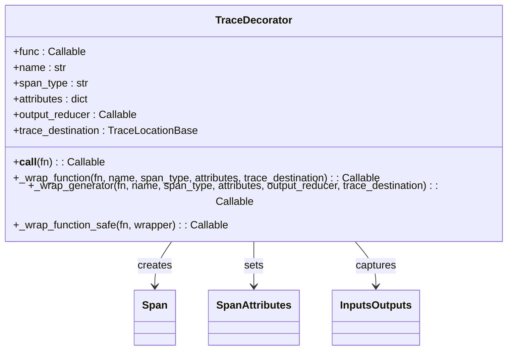
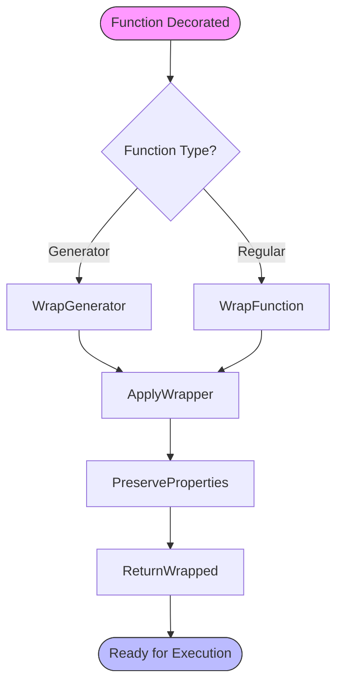
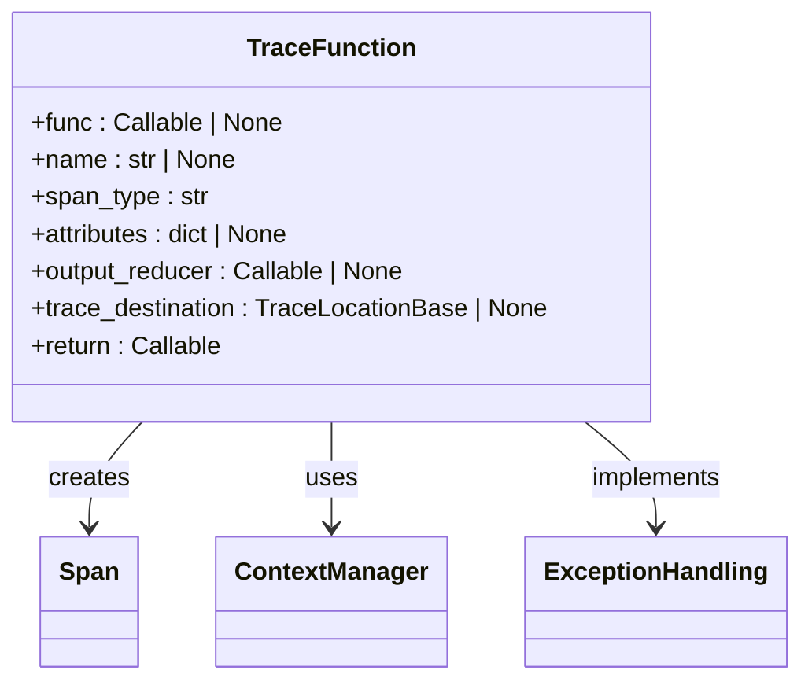
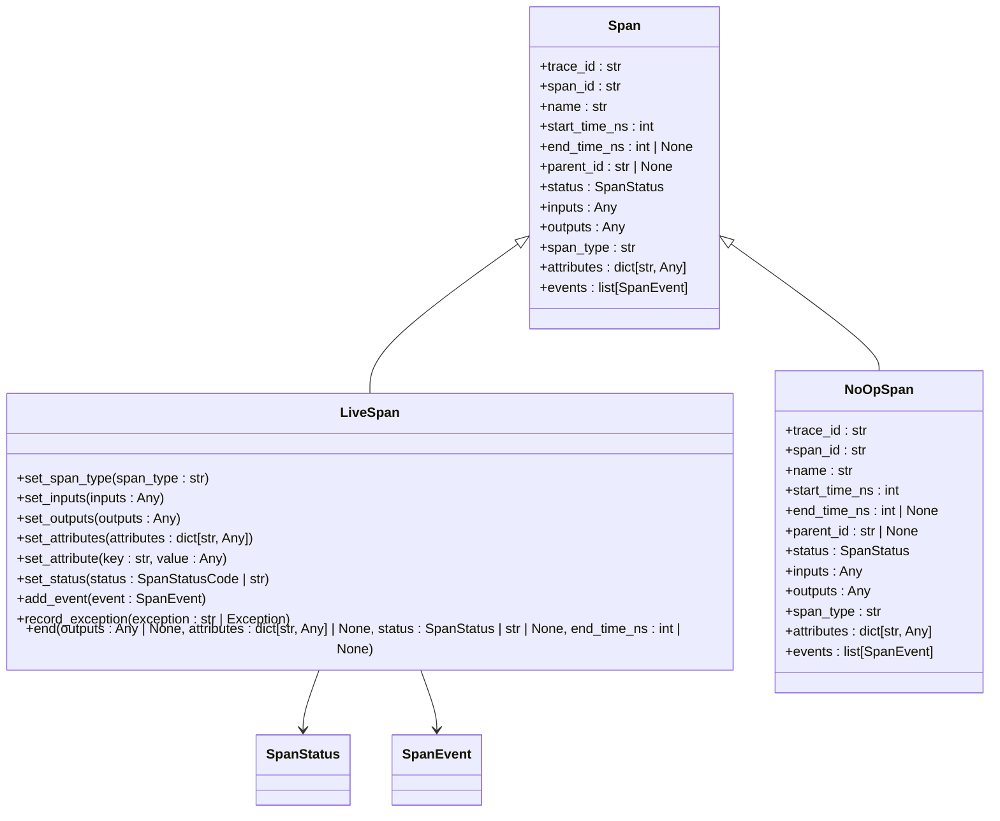
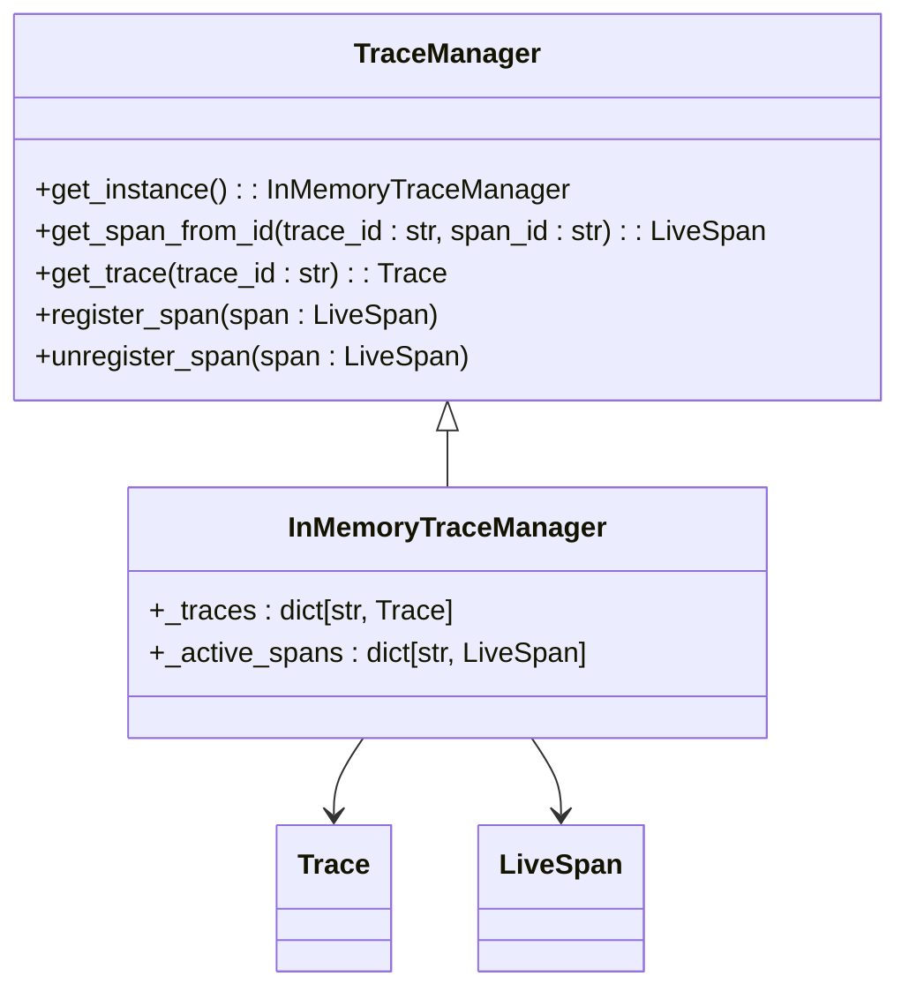

# Manual Instrumentation

<cite>
**Referenced Files in This Document**   
- [trace_manager.py](file://mlflow/tracing/trace_manager.py)
- [fluent.py](file://mlflow/tracing/fluent.py)
- [span.py](file://mlflow/entities/span.py)
- [trace.py](file://mlflow/entities/trace.py)
- [constant.py](file://mlflow/tracing/constant.py)
- [client.py](file://mlflow/tracing/client.py)
- [provider.py](file://mlflow/tracing/provider.py)
- [api.ts](file://libs/typescript/core/src/core/api.ts)
- [span.ts](file://libs/typescript/core/src/core/entities/span.ts)
- [trace.ts](file://libs/typescript/core/src/core/entities/trace.ts)
- [fluent.py](file://examples/tracing/fluent.py)
- [ag2_logger.py](file://mlflow/ag2/ag2_logger.py)
</cite>

## Table of Contents
1. [Introduction](#introduction)
2. [Core Components](#core-components)
3. [Architecture Overview](#architecture-overview)
4. [Detailed Component Analysis](#detailed-component-analysis)
5. [Dependency Analysis](#dependency-analysis)
6. [Performance Considerations](#performance-considerations)
7. [Troubleshooting Guide](#troubleshooting-guide)
8. [Conclusion](#conclusion)

## Introduction
This document provides comprehensive guidance on manual instrumentation in MLflow's tracing system. It details the implementation and usage of the `@trace` decorator and `trace()` function for manually instrumenting LLM applications. The documentation covers interfaces, parameters, and return values for creating custom spans with inputs, outputs, and metadata. It includes concrete examples from the codebase showing how to trace custom LLM workflows, agent functions, and evaluation pipelines. The relationship between manual tracing and the fluent API is explained, along with solutions for common issues such as improper span nesting. Best practices for adding meaningful metadata to traces and performance considerations for synchronous vs asynchronous tracing are also addressed.

## Core Components

The MLflow tracing system provides two primary mechanisms for manual instrumentation: the `@trace` decorator and the `trace()` function. These components enable developers to create custom spans that capture inputs, outputs, and metadata for LLM applications. The system supports various function types including synchronous, asynchronous, generator, and class methods. The tracing framework automatically captures function inputs and outputs while allowing explicit setting of attributes and span types. The implementation handles both decorator and function-based usage patterns, preserving function properties and supporting TypeScript decorator syntax.

**Section sources**
- [fluent.py](file://mlflow/tracing/fluent.py#L63-L204)
- [api.ts](file://libs/typescript/core/src/core/api.ts#L304-L417)

## Architecture Overview

```mermaid
graph TD
A[User Application] --> B[@trace Decorator]
A --> C[trace() Function]
B --> D[Span Creation]
C --> D
D --> E[Span Attributes]
D --> F[Inputs/Outputs]
D --> G[Span Type]
E --> H[Metadata Storage]
F --> H
G --> H
H --> I[Trace Export]
I --> J[MLflow Backend]
I --> K[Inference Table]
I --> L[UC Table]
```

**Diagram sources**
- [fluent.py](file://mlflow/tracing/fluent.py#L63-L204)
- [client.py](file://mlflow/tracing/client.py#L1-L50)
- [provider.py](file://mlflow/tracing/provider.py#L1-L30)

## Detailed Component Analysis

### @trace Decorator Implementation

The `@trace` decorator is implemented as a flexible function that can be used both as a decorator and as a function wrapper. It supports multiple function types including synchronous, asynchronous, generator, and class methods. The decorator automatically captures function inputs and outputs while allowing customization of span attributes and types.



**Diagram sources**
- [fluent.py](file://mlflow/tracing/fluent.py#L63-L412)
- [span.py](file://mlflow/entities/span.py#L484-L800)

#### Span Creation Process

The span creation process involves several key steps that ensure proper tracing of function execution. When a function is decorated with `@trace`, the system creates a new span that captures the function's execution context. The process begins with checking whether the function is a classmethod or staticmethod, then extracting the original function if it's a descriptor. Based on the function type, the appropriate wrapper is applied - either for regular functions or generators.



**Diagram sources**
- [fluent.py](file://mlflow/tracing/fluent.py#L171-L204)
- [span.py](file://mlflow/entities/span.py#L484-L676)

### trace() Function Interface

The `trace()` function provides a programmatic interface for creating spans, offering the same capabilities as the decorator but with more explicit control. This function can be used to wrap functions directly or as a decorator, supporting both synchronous and asynchronous execution contexts.



**Diagram sources**
- [fluent.py](file://mlflow/tracing/fluent.py#L63-L204)
- [api.ts](file://libs/typescript/core/src/core/api.ts#L304-L417)

### Span Data Structures

The span data structures define the core entities used in MLflow's tracing system. These structures capture essential information about function execution, including inputs, outputs, attributes, and execution context.



**Diagram sources**
- [span.py](file://mlflow/entities/span.py#L91-L800)
- [constant.py](file://mlflow/tracing/constant.py#L59-L64)

### Trace Management System

The trace management system coordinates the creation, storage, and export of traces across the application. It maintains the hierarchical relationship between spans and ensures proper context propagation.



**Diagram sources**
- [trace_manager.py](file://mlflow/tracing/trace_manager.py#L1-L50)
- [fluent.py](file://mlflow/tracing/fluent.py#L35-L36)

## Dependency Analysis

```mermaid
graph TD
A[@trace Decorator] --> B[Span Creation]
B --> C[Span Attributes]
C --> D[Metadata Storage]
D --> E[Trace Export]
E --> F[MLflow Backend]
A --> G[Function Wrapping]
G --> H[Context Preservation]
H --> I[Exception Handling]
I --> J[Span Status]
J --> K[Error Recording]
K --> E
L[trace() Function] --> M[Span Options]
M --> N[Parent Span]
N --> O[Span Hierarchy]
O --> E
P[Span Types] --> Q[LLM]
P --> R[CHAIN]
P --> S[AGENT]
P --> T[TOOL]
P --> U[RETRIEVER]
P --> V[EMBEDDING]
Q --> E
R --> E
S --> E
T --> E
U --> E
V --> E
```

**Diagram sources**
- [fluent.py](file://mlflow/tracing/fluent.py#L63-L412)
- [constant.py](file://mlflow/tracing/constant.py#L43-L64)
- [span.py](file://mlflow/entities/span.py#L43-L64)

## Performance Considerations

The MLflow tracing system is designed to minimize performance overhead while providing comprehensive instrumentation capabilities. The implementation uses efficient data structures and caching mechanisms to reduce the impact on application performance. For synchronous tracing, the overhead is minimal as the span creation and management occurs within the same execution context. Asynchronous tracing requires additional context management but maintains performance through optimized coroutine handling. Generator functions are handled with special care to ensure proper span lifecycle management without affecting the lazy evaluation nature of generators. The system also includes mechanisms to handle large input and output data efficiently, with configurable truncation and sampling options.

**Section sources**
- [fluent.py](file://mlflow/tracing/fluent.py#L207-L412)
- [utils.py](file://mlflow/tracing/utils/truncation.py#L1-L30)

## Troubleshooting Guide

Common issues in MLflow tracing typically involve improper span nesting, missing context propagation, and configuration problems. For improper span nesting, ensure that spans are properly closed in the correct order and that parent-child relationships are maintained. When spans appear disconnected in the trace visualization, verify that the tracing context is properly propagated across function calls and asynchronous boundaries. For missing spans, check that tracing is enabled and that the destination is properly configured. Performance issues can often be addressed by reviewing the span creation frequency and considering sampling strategies for high-volume operations. Error handling should be implemented to catch and log exceptions that might prevent span completion.

**Section sources**
- [fluent.py](file://mlflow/tracing/fluent.py#L481-L514)
- [provider.py](file://mlflow/tracing/provider.py#L1-L50)
- [ag2_logger.py](file://mlflow/ag2/ag2_logger.py#L1-L30)

## Conclusion

The MLflow tracing system provides robust manual instrumentation capabilities through the `@trace` decorator and `trace()` function. These tools enable comprehensive monitoring of LLM applications by capturing inputs, outputs, and metadata in custom spans. The system supports various function types and execution patterns, making it suitable for complex LLM workflows, agent functions, and evaluation pipelines. By combining manual tracing with the fluent API, developers can create detailed traces that provide valuable insights into application behavior. Proper implementation of best practices for metadata addition and performance optimization ensures effective tracing with minimal overhead.