# OpenTelemetry Integration

<cite>
**Referenced Files in This Document**   
- [mlflow/tracing/otel/translation/__init__.py](file://mlflow/tracing/otel/translation/__init__.py)
- [mlflow/tracing/otel/translation/base.py](file://mlflow/tracing/otel/translation/base.py)
- [mlflow/tracing/otel/translation/open_inference.py](file://mlflow/tracing/otel/translation/open_inference.py)
- [mlflow/tracing/otel/translation/genai_semconv.py](file://mlflow/tracing/otel/translation/genai_semconv.py)
- [mlflow/tracing/otel/translation/traceloop.py](file://mlflow/tracing/otel/translation/traceloop.py)
- [mlflow/tracing/otel/translation/vercel_ai.py](file://mlflow/tracing/otel/translation/vercel_ai.py)
- [mlflow/tracing/export/span_batcher.py](file://mlflow/tracing/export/span_batcher.py)
- [mlflow/tracing/processor/inference_table.py](file://mlflow/tracing/processor/inference_table.py)
- [mlflow/tracing/utils/otlp.py](file://mlflow/tracing/utils/otlp.py)
- [mlflow/environment_variables.py](file://mlflow/environment_variables.py)
- [mlflow/entities/span.py](file://mlflow/entities/span.py)
- [mlflow/entities/trace_info.py](file://mlflow/entities/trace_info.py)
</cite>

## Table of Contents
1. [Introduction](#introduction)
2. [OTEL Span Translation System](#otel-span-translation-system)
3. [Semantic Convention Interfaces](#semantic-convention-interfaces)
4. [Vendor-Specific Translators](#vendor-specific-translators)
5. [Data Pipeline Architecture](#data-pipeline-architecture)
6. [Schema Mismatch Issues and Solutions](#schema-mismatch-issues-and-solutions)
7. [Performance Considerations](#performance-considerations)
8. [OTEL Exporter Configuration](#otel-exporter-configuration)
9. [Conclusion](#conclusion)

## Introduction

MLflow's tracing system integrates with OpenTelemetry (OTEL) to provide comprehensive observability for machine learning workflows. This integration enables MLflow to consume traces from various OTEL-compliant frameworks and convert them into MLflow's native trace format. The system supports multiple semantic conventions including OpenInference, GenAI, Traceloop, and vendor-specific formats like Vercel AI. This document details the implementation of OTEL span translation, the interfaces and implementation of semantic conventions, and the data pipeline architecture that processes and exports traces to OTEL-compatible backends.

**Section sources**
- [mlflow/tracing/otel/translation/__init__.py](file://mlflow/tracing/otel/translation/__init__.py#L1-L39)

## OTEL Span Translation System

The OTEL span translation system in MLflow is designed to convert spans from various OTEL semantic conventions into MLflow's native span format. The translation process occurs at two critical points: when storing spans and when loading spans. The system uses a modular translator architecture where each semantic convention has its own translator class that inherits from a common base class.

The translation process involves several key functions that handle different aspects of span conversion:

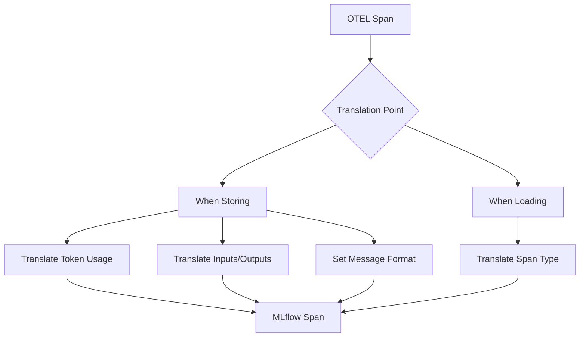

**Diagram sources**
- [mlflow/tracing/otel/translation/__init__.py](file://mlflow/tracing/otel/translation/__init__.py#L37-L259)

The core translation function `translate_span_when_storing` is responsible for converting OTEL span attributes to MLflow format when spans are stored. This function handles token usage, inputs, outputs, and message format translation. It iterates through a list of registered translators to find the appropriate one for the given span attributes.

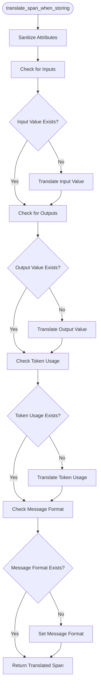

**Diagram sources**
- [mlflow/tracing/otel/translation/__init__.py](file://mlflow/tracing/otel/translation/__init__.py#L37-L80)

The translation system also includes a function `translate_loaded_span` that handles span type translation when spans are loaded. This function checks for OTEL span kind attributes and maps them to MLflow span types using the appropriate translator.

**Section sources**
- [mlflow/tracing/otel/translation/__init__.py](file://mlflow/tracing/otel/translation/__init__.py#L37-L259)
- [mlflow/tracing/otel/translation/base.py](file://mlflow/tracing/otel/translation/base.py#L1-L175)

## Semantic Convention Interfaces

MLflow supports multiple semantic conventions for OTEL spans, each with its own interface and mapping rules. The system is designed with a base translator class that provides common functionality, while specific convention translators define the attribute keys and mappings.

### Base Translator Interface

The `OtelSchemaTranslator` base class provides the foundation for all semantic convention translators. It defines the common interface and implements shared translation logic:

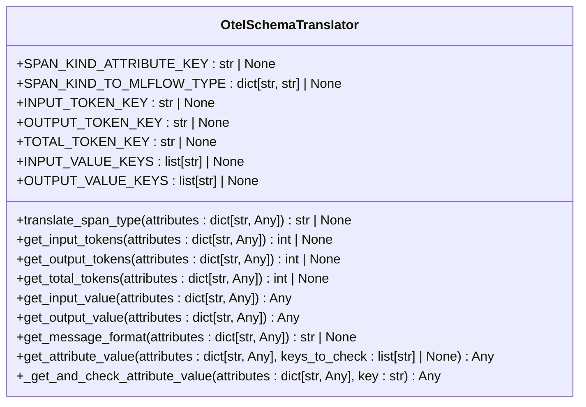

**Diagram sources**
- [mlflow/tracing/otel/translation/base.py](file://mlflow/tracing/otel/translation/base.py#L15-L175)

The base class provides methods for translating span types, token usage, inputs, outputs, and message formats. Subclasses only need to define the appropriate class attributes for their specific semantic convention.

### OpenInference Semantic Convention

The OpenInference semantic convention translator maps OTEL attributes from the OpenInference specification to MLflow span types. This translator handles the conversion of span kinds, token counts, and input/output values according to the OpenInference schema.

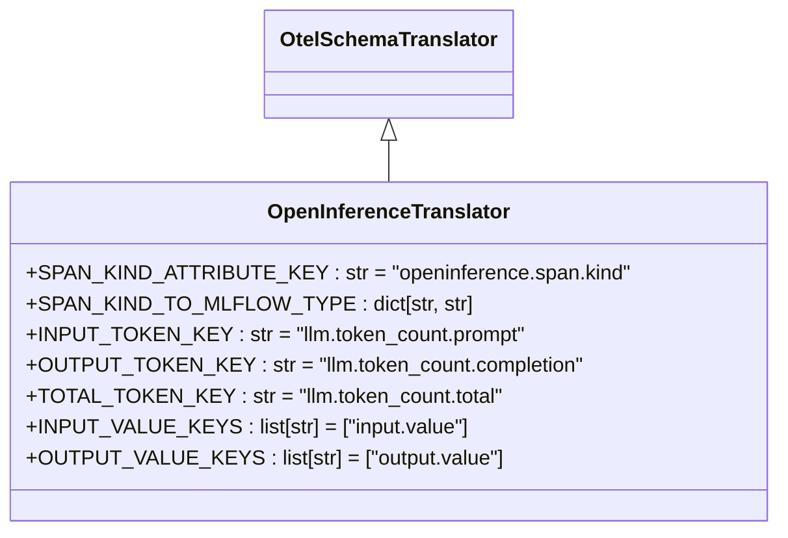

**Diagram sources**
- [mlflow/tracing/otel/translation/open_inference.py](file://mlflow/tracing/otel/translation/open_inference.py#L1-L47)

The OpenInference translator supports the following span kind mappings:
- "TOOL" → SpanType.TOOL
- "CHAIN" → SpanType.CHAIN
- "LLM" → SpanType.LLM
- "RETRIEVER" → SpanType.RETRIEVER
- "EMBEDDING" → SpanType.EMBEDDING
- "AGENT" → SpanType.AGENT
- "RERANKER" → SpanType.RERANKER
- "UNKNOWN" → SpanType.UNKNOWN
- "GUARDRAIL" → SpanType.GUARDRAIL
- "EVALUATOR" → SpanType.EVALUATOR

**Section sources**
- [mlflow/tracing/otel/translation/open_inference.py](file://mlflow/tracing/otel/translation/open_inference.py#L1-L47)

### GenAI Semantic Convention

The GenAI semantic convention translator handles spans that follow the OpenTelemetry GenAI specification. This translator converts GenAI operation names and attributes to MLflow span types and formats.

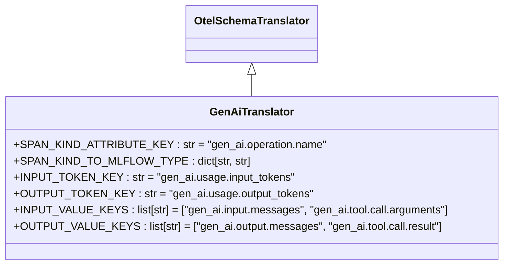

**Diagram sources**
- [mlflow/tracing/otel/translation/genai_semconv.py](file://mlflow/tracing/otel/translation/genai_semconv.py#L1-L46)

The GenAI translator supports the following span kind mappings:
- "chat" → SpanType.CHAT_MODEL
- "create_agent" → SpanType.AGENT
- "embeddings" → SpanType.EMBEDDING
- "execute_tool" → SpanType.TOOL
- "generate_content" → SpanType.LLM
- "invoke_agent" → SpanType.AGENT
- "text_completion" → SpanType.LLM
- "response" → SpanType.LLM

Note that the GenAI specification does not define a total_tokens field, so the TOTAL_TOKEN_KEY is inherited from the base class as None.

**Section sources**
- [mlflow/tracing/otel/translation/genai_semconv.py](file://mlflow/tracing/otel/translation/genai_semconv.py#L1-L46)

### Traceloop Semantic Convention

The Traceloop (OpenLLMetry) semantic convention translator handles spans from the Traceloop framework. This translator supports regular expression patterns for attribute keys, allowing it to match dynamically generated attribute names.

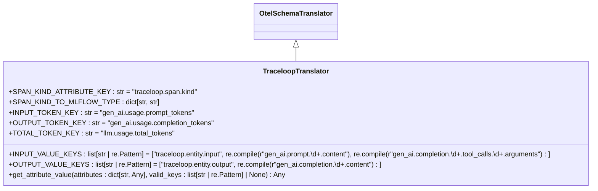

**Diagram sources**
- [mlflow/tracing/otel/translation/traceloop.py](file://mlflow/tracing/otel/translation/traceloop.py#L1-L80)

The Traceloop translator extends the base `get_attribute_value` method to handle regular expression patterns in attribute keys. This allows it to match attributes like "gen_ai.prompt.0.content" or "gen_ai.completion.0.tool_calls.0.arguments" using regex patterns.

The Traceloop translator supports the following span kind mappings:
- "workflow" → SpanType.WORKFLOW
- "task" → SpanType.TASK
- "agent" → SpanType.AGENT
- "tool" → SpanType.TOOL
- "unknown" → SpanType.UNKNOWN

**Section sources**
- [mlflow/tracing/otel/translation/traceloop.py](file://mlflow/tracing/otel/translation/traceloop.py#L1-L80)

## Vendor-Specific Translators

In addition to standard semantic conventions, MLflow provides specialized translators for vendor-specific frameworks. These translators handle the unique attribute schemas and patterns used by specific AI/ML platforms.

### Vercel AI Translator

The Vercel AI translator handles spans from the Vercel AI SDK, which has a unique attribute schema for different AI operations like text generation, tool calls, and embeddings.

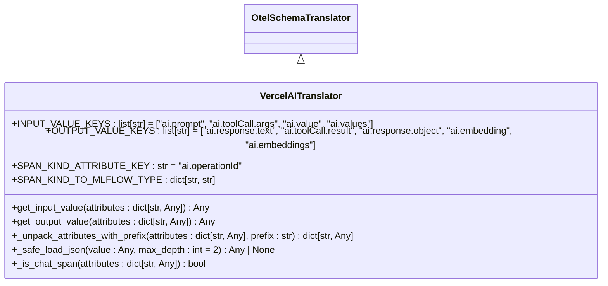

**Diagram sources**
- [mlflow/tracing/otel/translation/vercel_ai.py](file://mlflow/tracing/otel/translation/vercel_ai.py#L1-L92)

The Vercel AI translator includes several specialized methods:

1. `_is_chat_span`: Determines if a span represents a chat operation based on the operation ID
2. `_unpack_attributes_with_prefix`: Extracts attributes with a specific prefix (e.g., "ai.prompt." or "ai.response.")
3. `_safe_load_json`: Safely parses JSON values with a depth limit to prevent infinite recursion
4. `get_input_value` and `get_output_value`: Override the base methods to handle Vercel AI's specific attribute structure

The translator supports the following operation IDs:
- "ai.generateText" → SpanType.LLM
- "ai.generateText.doGenerate" → SpanType.LLM
- "ai.toolCall" → SpanType.TOOL
- "ai.streamText" → SpanType.LLM
- "ai.streamText.doStream" → SpanType.LLM
- "ai.generateObject" → SpanType.LLM
- "ai.streamObject" → SpanType.LLM
- "ai.embed" → SpanType.EMBEDDING
- "ai.embed.doEmbed" → SpanType.EMBEDDING
- "ai.embedMany" → SpanType.EMBEDDING

For chat spans (those with operation IDs "ai.generateText.doGenerate" or "ai.streamText.doStream"), the translator unpacks all attributes with the "ai.prompt." and "ai.response." prefixes into JSON objects for the inputs and outputs. It also sets the message format to "vercel_ai" for proper UI rendering.

**Section sources**
- [mlflow/tracing/otel/translation/vercel_ai.py](file://mlflow/tracing/otel/translation/vercel_ai.py#L1-L92)

## Data Pipeline Architecture

The OTEL integration in MLflow follows a structured data pipeline that processes spans from creation to export. The pipeline consists of several components that work together to ensure efficient and reliable trace processing.

### Processor System

The processor system in MLflow's tracing architecture handles the lifecycle of spans from creation to export. The main processor for OTEL integration is the `InferenceTableSpanProcessor`, which extends OpenTelemetry's `SimpleSpanProcessor`.

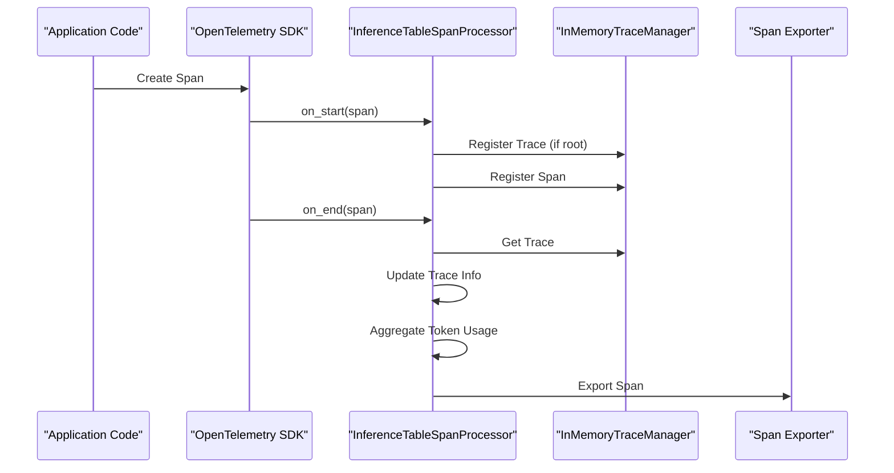

**Diagram sources**
- [mlflow/tracing/processor/inference_table.py](file://mlflow/tracing/processor/inference_table.py#L1-L176)

The processor system has two main entry points:
1. `on_start`: Called when a span is started
2. `on_end`: Called when a span is ended

During `on_start`, the processor:
- Extracts the Databricks request ID from headers or context
- Generates a trace ID using `generate_trace_id_v3`
- Sets the request ID as a span attribute
- Registers the trace (if it's a root span) with the trace manager
- Registers the span with the trace manager

During `on_end`, the processor:
- Retrieves the complete trace from the trace manager
- Updates the trace's execution duration
- Updates the trace state based on the span status
- Aggregates token usage from all spans in the trace
- Calls the parent class's `on_end` method to trigger export

**Section sources**
- [mlflow/tracing/processor/inference_table.py](file://mlflow/tracing/processor/inference_table.py#L1-L176)

### Export Queue and Batching

The export system in MLflow uses a batching mechanism to efficiently export spans to the backend. The `SpanBatcher` class implements a queue-based batching processor that groups spans into batches before exporting them.

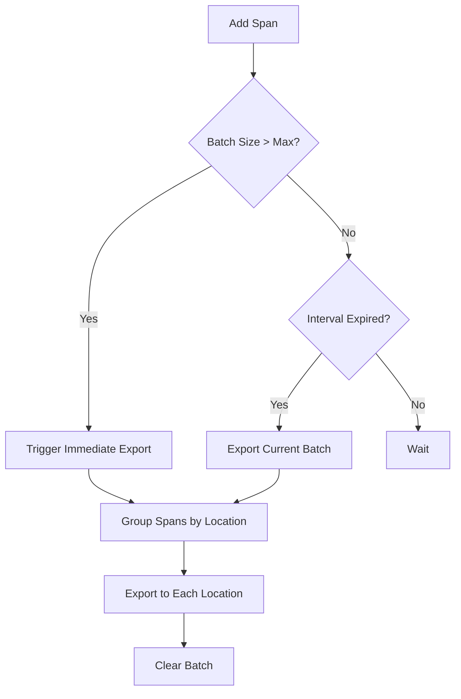

**Diagram sources**
- [mlflow/tracing/export/span_batcher.py](file://mlflow/tracing/export/span_batcher.py#L1-L123)

The `SpanBatcher` class has the following key components:
- `_span_queue`: A thread-safe queue that holds spans waiting to be exported
- `_worker`: A background thread that monitors the queue and triggers exports
- `_worker_awaken`: An event that signals the worker to export immediately when the batch size limit is reached
- `_max_span_batch_size`: The maximum number of spans to include in a single batch
- `_max_interval_ms`: The maximum time to wait before exporting a batch, even if it's not full

The batcher exports spans in two scenarios:
1. When the number of spans in the queue reaches the maximum batch size
2. When the maximum interval has elapsed since the last export

Spans are grouped by location before export, as the backend API only supports logging spans to a single location at a time.

**Section sources**
- [mlflow/tracing/export/span_batcher.py](file://mlflow/tracing/export/span_batcher.py#L1-L123)

## Schema Mismatch Issues and Solutions

When integrating with OTEL, MLflow faces several schema mismatch issues due to differences between OTEL conventions and MLflow's native format. The system provides several solutions to handle these mismatches.

### JSON-Serialized Attributes

One common issue is that some OTEL frameworks serialize attribute values as JSON strings. The translation system handles this by attempting to parse JSON values when checking for span kinds and other attributes.

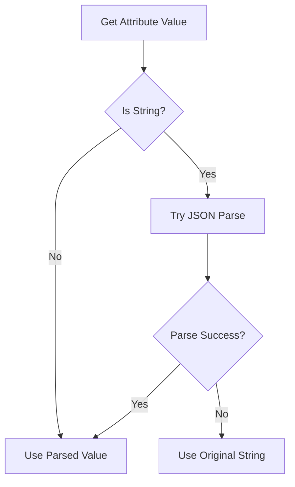

**Diagram sources**
- [mlflow/tracing/otel/translation/base.py](file://mlflow/tracing/otel/translation/base.py#L55-L71)

The `translate_span_type` method in the base translator class handles JSON-serialized values by attempting to parse them before using them for mapping:

```python
if isinstance(span_kind, str):
    try:
        span_kind = json.loads(span_kind)
    except (json.JSONDecodeError, TypeError):
        pass  # Use the string value as-is
```

This ensures that span kinds like `"\"LLM\""` (a JSON string) are properly converted to `LLM` before mapping.

### Duplicate Attribute Values

Another issue is duplicate dumped attributes, which can occur when spans are logged to the SQL store via the OTLP API. The `sanitize_attributes` function handles this by detecting and removing duplicate JSON-encoded values.

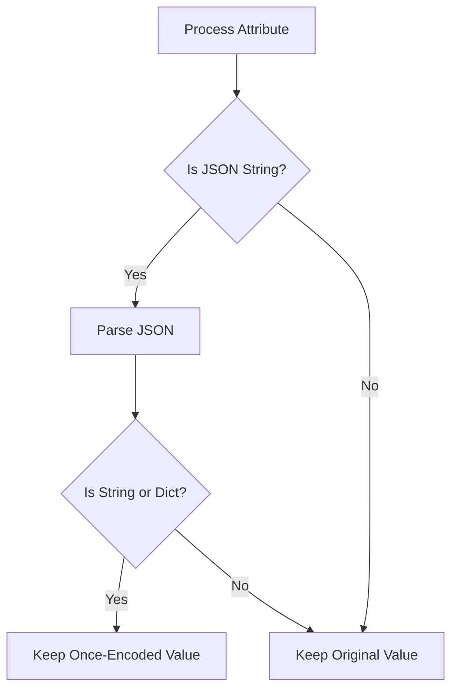

**Diagram sources**
- [mlflow/tracing/otel/translation/__init__.py](file://mlflow/tracing/otel/translation/__init__.py#L231-L258)

The `sanitize_attributes` function iterates through all attributes and checks if they are JSON strings that contain another JSON string or dictionary. If so, it keeps the once-encoded version to avoid double-encoding.

### Missing Total Token Count

Some semantic conventions like GenAI do not provide a total token count, only input and output token counts. The translation system handles this by calculating the total when needed:

```python
if input_tokens and output_tokens and (total_tokens is None):
    total_tokens = int(input_tokens) + int(output_tokens)
```

This ensures that MLflow's token usage information is complete even when the source framework doesn't provide a total count.

**Section sources**
- [mlflow/tracing/otel/translation/__init__.py](file://mlflow/tracing/otel/translation/__init__.py#L92-L94)

## Performance Considerations

The OTEL integration in MLflow includes several performance optimizations to handle high-volume trace export efficiently.

### Asynchronous Processing

The system uses asynchronous processing to avoid blocking the main application thread during trace export. The `SpanBatcher` runs in a separate worker thread that processes spans from the queue without interfering with application performance.

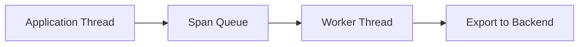

**Diagram sources**
- [mlflow/tracing/export/span_batcher.py](file://mlflow/tracing/export/span_batcher.py#L42-L48)

The worker thread uses a combination of batch size and time-based triggers to balance latency and throughput. This ensures that spans are exported promptly while minimizing the number of backend calls.

### Configuration Options

Several environment variables control the performance characteristics of the trace export system:

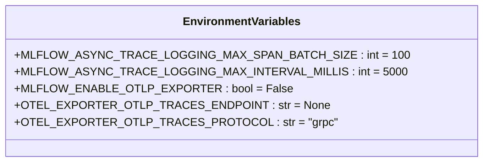

**Diagram sources**
- [mlflow/environment_variables.py](file://mlflow/environment_variables.py#L1-L200)

Key performance-related configuration options include:
- `MLFLOW_ASYNC_TRACE_LOGGING_MAX_SPAN_BATCH_SIZE`: Controls the maximum number of spans in a batch
- `MLFLOW_ASYNC_TRACE_LOGGING_MAX_INTERVAL_MILLIS`: Controls the maximum time to wait before exporting a batch
- `MLFLOW_ENABLE_OTLP_EXPORTER`: Enables or disables OTLP export
- `OTEL_EXPORTER_OTLP_TRACES_ENDPOINT`: Specifies the OTLP endpoint for trace export
- `OTEL_EXPORTER_OTLP_TRACES_PROTOCOL`: Specifies the OTLP protocol (grpc or http/protobuf)

These settings allow users to tune the system for their specific performance requirements, balancing between export latency and system overhead.

**Section sources**
- [mlflow/environment_variables.py](file://mlflow/environment_variables.py#L1-L200)

## OTEL Exporter Configuration

Configuring OTEL export in MLflow involves setting the appropriate environment variables and ensuring the correct exporter is used.

### Endpoint Configuration

The OTLP endpoint is determined by the following environment variables, in order of precedence:
1. `OTEL_EXPORTER_OTLP_TRACES_ENDPOINT`: Full URL used as-is
2. `OTEL_EXPORTER_OTLP_ENDPOINT`: Base URL, requires appending the traces path

```python
if traces_endpoint := os.environ.get("OTEL_EXPORTER_OTLP_TRACES_ENDPOINT"):
    return traces_endpoint

if base_endpoint := os.environ.get("OTEL_EXPORTER_OTLP_ENDPOINT"):
    return base_endpoint.rstrip("/") + OTLP_TRACES_PATH
```

This follows the OpenTelemetry specification for endpoint configuration.

### Protocol Selection

The OTLP protocol is determined by the following environment variables:
1. `OTEL_EXPORTER_OTLP_TRACES_PROTOCOL`: Protocol for traces
2. `OTEL_EXPORTER_OTLP_PROTOCOL`: Fallback protocol for all signals

The default protocol is "grpc", but "http/protobuf" is also supported.

### Exporter Creation

The exporter is created based on the protocol and endpoint configuration:

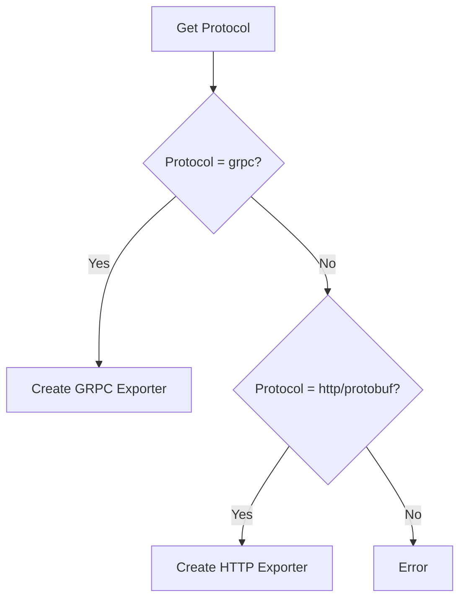

**Diagram sources**
- [mlflow/tracing/utils/otlp.py](file://mlflow/tracing/utils/otlp.py#L62-L141)

The system supports both GRPC and HTTP/protobuf protocols, allowing integration with a wide range of OTLP-compatible backends.

**Section sources**
- [mlflow/tracing/utils/otlp.py](file://mlflow/tracing/utils/otlp.py#L62-L141)

## Conclusion

MLflow's OpenTelemetry integration provides a robust system for converting OTEL spans to MLflow's native format and exporting them to various backends. The modular translator architecture supports multiple semantic conventions including OpenInference, GenAI, Traceloop, and vendor-specific formats like Vercel AI. The system handles schema mismatches through intelligent attribute parsing and provides performance optimizations for high-volume trace export. By leveraging asynchronous processing and configurable batching, MLflow ensures that trace collection has minimal impact on application performance while providing comprehensive observability for machine learning workflows.