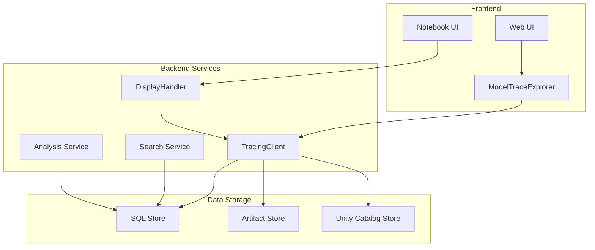
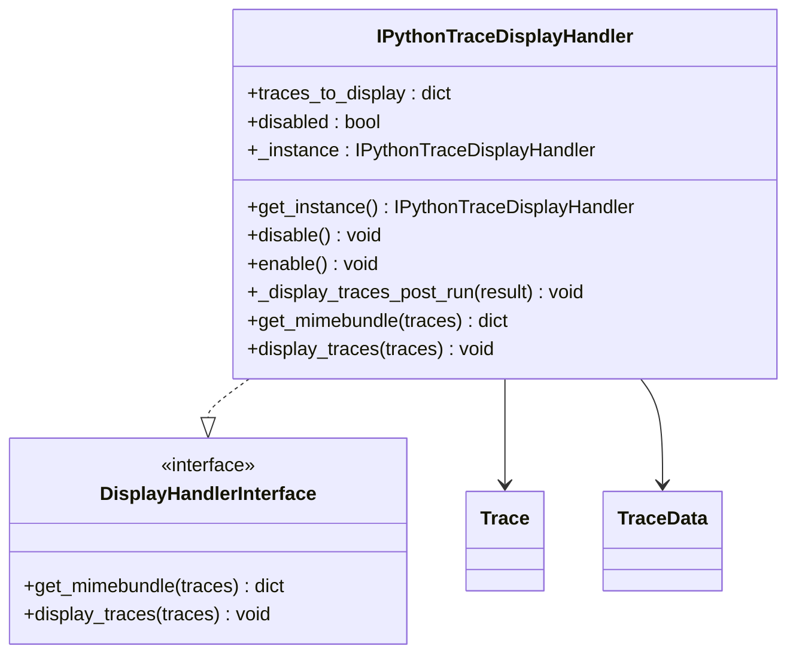
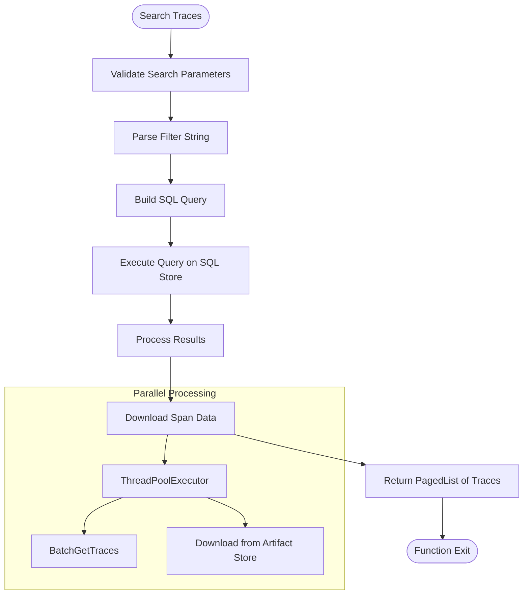
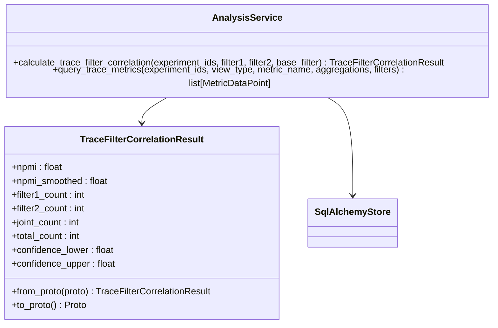

# Trace Visualization

<cite>
**Referenced Files in This Document**   
- [display_handler.py](file://mlflow/tracing/display/display_handler.py)
- [client.py](file://mlflow/tracing/client.py)
- [trace.py](file://mlflow/entities/trace.py)
- [trace_data.py](file://mlflow/entities/trace_data.py)
- [ModelTraceExplorerOSSNotebookRenderer.tsx](file://mlflow/server/js/src/shared/web-shared/model-trace-explorer/oss-notebook-renderer/ModelTraceExplorerOSSNotebookRenderer.tsx)
- [ModelTraceExplorer.tsx](file://mlflow/server/js/src/shared/web-shared/model-trace-explorer/ModelTraceExplorer.tsx)
- [search.py](file://mlflow/tracing/utils/search.py)
- [sqlalchemy_store.py](file://mlflow/store/tracking/sqlalchemy_store.py)
- [analysis.py](file://mlflow/tracing/analysis.py)
</cite>

## Table of Contents
1. [Introduction](#introduction)
2. [Architecture Overview](#architecture-overview)
3. [Core Components](#core-components)
4. [Trace Display System](#trace-display-system)
5. [Search and Filter Functionality](#search-and-filter-functionality)
6. [Performance Analysis and Correlation](#performance-analysis-and-correlation)
7. [Frontend Visualization Components](#frontend-visualization-components)
8. [Best Practices](#best-practices)
9. [Troubleshooting](#troubleshooting)
10. [Conclusion](#conclusion)

## Introduction

MLflow's trace visualization system provides comprehensive tools for exploring LLM workflows, debugging performance bottlenecks, and analyzing trace hierarchies. The system integrates backend trace storage with frontend visualization components to deliver an interactive UI for trace exploration. This document details the implementation of the display system, covering how trace data is processed and rendered in the web interface, the interfaces and implementation details of display handlers and analysis tools, and best practices for optimizing visualization efficiency.

**Section sources**
- [display_handler.py](file://mlflow/tracing/display/display_handler.py#L1-L195)
- [client.py](file://mlflow/tracing/client.py#L1-L726)

## Architecture Overview

The trace visualization system in MLflow follows a layered architecture with clear separation between data storage, processing, and presentation layers. The backend stores trace data in either a SQL database or artifact repository, while the frontend renders this data through a React-based UI component. The system supports both notebook and web UI visualization, with different rendering strategies based on the environment.



**Diagram sources**
- [display_handler.py](file://mlflow/tracing/display/display_handler.py#L1-L195)
- [client.py](file://mlflow/tracing/client.py#L1-L726)
- [ModelTraceExplorerOSSNotebookRenderer.tsx](file://mlflow/server/js/src/shared/web-shared/model-trace-explorer/oss-notebook-renderer/ModelTraceExplorerOSSNotebookRenderer.tsx#L1-L185)

## Core Components

The trace visualization system consists of several core components that work together to provide a comprehensive trace analysis experience. The `TracingClient` serves as the primary interface for interacting with trace data, while the `DisplayHandler` manages the presentation of traces in different environments. The `Trace` and `TraceData` entities represent the core data structures, and the frontend `ModelTraceExplorer` component renders the visual interface.

**Section sources**
- [trace.py](file://mlflow/entities/trace.py#L1-L333)
- [trace_data.py](file://mlflow/entities/trace_data.py#L1-L86)
- [client.py](file://mlflow/tracing/client.py#L1-L726)

## Trace Display System

The trace display system in MLflow is implemented through the `IPythonTraceDisplayHandler` class, which manages the rendering of traces in notebook environments. The system uses MIME bundle rendering to provide different display formats based on the execution environment. In Databricks notebooks, it uses a custom MIME type, while in other environments with a tracking server, it renders an iframe pointing to the MLflow UI.

The display handler registers a post-run cell hook to automatically display traces after cell execution. It maintains a buffer of traces to display and handles pagination when multiple traces are present. The system also provides controls for expanding/collapsing the trace view and links to view the trace in the full MLflow UI.



**Diagram sources**
- [display_handler.py](file://mlflow/tracing/display/display_handler.py#L106-L195)
- [trace.py](file://mlflow/entities/trace.py#L1-L333)

## Search and Filter Functionality

MLflow provides robust search and filter capabilities for traces through the `search_traces` method in the `TracingClient`. The system supports a rich query language that allows filtering by trace attributes, span properties, metadata, tags, and metrics. The search functionality is implemented at the SQL store level, enabling efficient querying of large trace datasets.

The search system supports various operators including equality, comparison, pattern matching (LIKE, ILIKE), and logical operators (AND, OR). Users can search by trace parameters such as timestamp, execution time, and end time, as well as by span type, name, and attributes. The system also supports pagination and ordering of results.



**Diagram sources**
- [client.py](file://mlflow/tracing/client.py#L220-L379)
- [sqlalchemy_store.py](file://mlflow/store/tracking/sqlalchemy_store.py#L1-L200)

## Performance Analysis and Correlation

The trace visualization system includes advanced analysis capabilities for identifying performance bottlenecks and understanding correlations between different trace characteristics. The `calculate_trace_filter_correlation` method computes the Normalized Pointwise Mutual Information (NPMI) between two trace filter conditions, providing insights into how different trace attributes co-occur.

The system also supports querying trace metrics with various aggregations such as count, sum, average, min, and max. Users can analyze span metrics filtered by span type, duration, or other attributes, enabling detailed performance analysis of LLM workflows. The correlation analysis helps identify patterns in trace data, such as whether certain span types are more likely to have high latency or whether specific user inputs correlate with particular response patterns.



**Diagram sources**
- [analysis.py](file://mlflow/tracing/analysis.py#L1-L89)
- [sqlalchemy_store.py](file://mlflow/store/tracking/sqlalchemy_store.py#L1-L200)

## Frontend Visualization Components

The frontend visualization components are implemented using React and are responsible for rendering the trace explorer UI. The `ModelTraceExplorer` component serves as the main container, while specialized components handle different views such as summary, details, and timeline. The system uses a context provider pattern to manage state across the component hierarchy.

The visualization supports multiple views of trace data, including a hierarchical tree view of spans, a timeline view showing the duration and overlap of spans, and a summary view with key metrics. The UI also provides filtering and search capabilities directly in the interface, allowing users to explore trace hierarchies and identify performance bottlenecks visually.

```mermaid
componentDiagram
[ModelTraceExplorer] --> [ModelTraceHeaderDetails]
[ModelTraceExplorer] --> [ModelTraceExplorerContent]
[ModelTraceExplorer] --> [ModelTraceExplorerComparisonView]
[ModelTraceExplorerContent] --> [ModelTraceExplorerSummaryView]
[ModelTraceExplorerContent] --> [ModelTraceExplorerDetailView]
[ModelTraceExplorer] --> [ModelTraceExplorerViewStateProvider]
[ModelTraceExplorerViewStateProvider] --> [ErrorBoundary]
```

**Diagram sources**
- [ModelTraceExplorer.tsx](file://mlflow/server/js/src/shared/web-shared/model-trace-explorer/ModelTraceExplorer.tsx#L1-L113)
- [ModelTraceExplorerContent.tsx](file://mlflow/server/js/src/shared/web-shared/model-trace-explorer/ModelTraceExplorerContent.tsx#L1-L79)

## Best Practices

To optimize trace visualization and debugging efficiency, follow these best practices:

1. **Structure traces with meaningful names and types**: Use descriptive span names and appropriate span types (LLM, TOOL, CHAIN, etc.) to make traces more navigable.

2. **Add relevant metadata and tags**: Include contextual information in trace metadata and tags to facilitate searching and filtering.

3. **Use timestamp filters**: When searching traces, use timestamp filters to limit the search space and improve query performance.

4. **Limit result sets**: Use the `max_results` parameter to limit the number of traces returned, especially when ordering is required.

5. **Implement pagination**: For large result sets, use pagination to avoid overwhelming the UI and improve load times.

6. **Monitor trace size**: Be aware of the large trace display size threshold and consider breaking down complex workflows into smaller, more focused traces.

7. **Use assessments for evaluation**: Leverage the assessment system to add feedback and expectations to traces, enabling quantitative analysis of LLM performance.

**Section sources**
- [search.py](file://mlflow/tracing/utils/search.py#L1-L199)
- [client.py](file://mlflow/tracing/client.py#L240-L379)
- [docs/docs/genai/tracing/search-traces.mdx](file://docs/docs/genai/tracing/search-traces.mdx#L401-L414)

## Troubleshooting

Common issues with trace visualization and their solutions:

1. **Incomplete trace rendering**: This can occur when span data is stored in the artifact repository and cannot be downloaded. Ensure the tracking URI is correctly configured and the artifact repository is accessible.

2. **Missing traces in search results**: Verify that the experiment IDs or locations are correctly specified in the search parameters. Check that the trace data has been properly indexed in the SQL store.

3. **Performance issues with large trace sets**: Use pagination and limit the number of results to improve performance. Consider filtering by timestamp to reduce the search space.

4. **Authentication issues in Databricks**: When using Databricks, ensure that the appropriate profile information is included in the artifact URI.

5. **Corrupted trace data**: If trace data is corrupted, the system will raise a `MlflowTraceDataCorrupted` exception. Recreate the trace or check the data source for issues.

6. **Missing span data**: If spans are stored in the artifact repository and cannot be downloaded, the system will return a trace with empty spans. Check the artifact storage configuration and network connectivity.

**Section sources**
- [client.py](file://mlflow/tracing/client.py#L149-L207)
- [display_handler.py](file://mlflow/tracing/display/display_handler.py#L146-L169)

## Conclusion

MLflow's trace visualization system provides a comprehensive solution for exploring and analyzing LLM workflows. The system integrates backend trace storage with frontend visualization components to deliver an interactive UI for trace exploration. By leveraging the search, filter, and analysis capabilities, users can effectively debug performance bottlenecks and gain insights into their LLM applications. Following the best practices outlined in this document will help optimize the visualization experience and improve debugging efficiency.