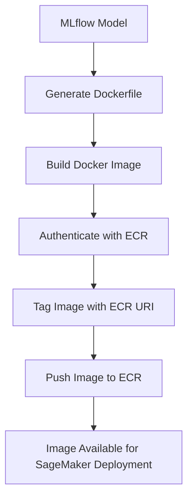
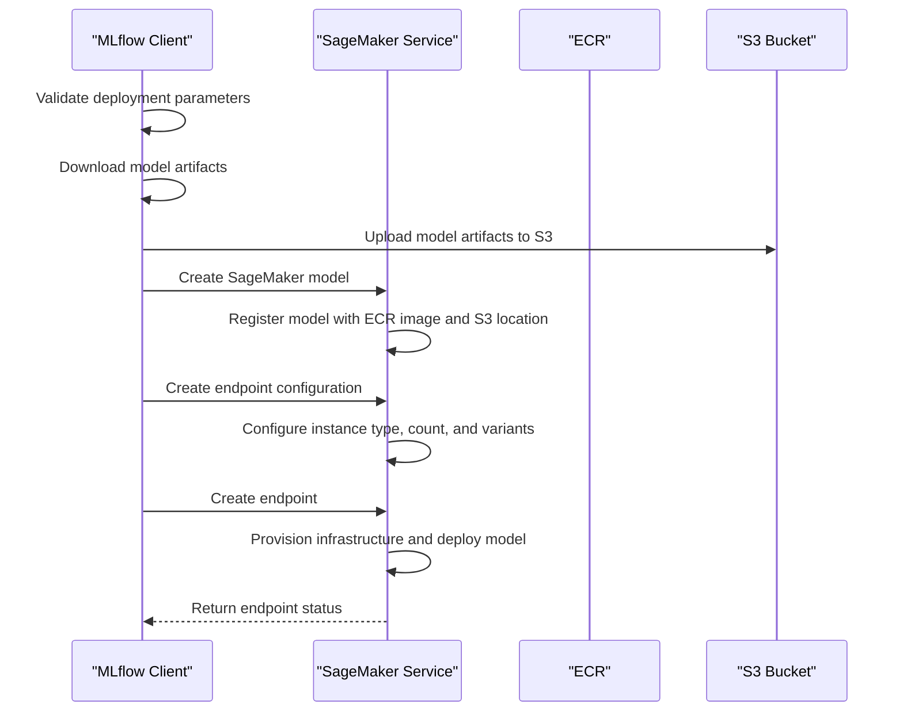
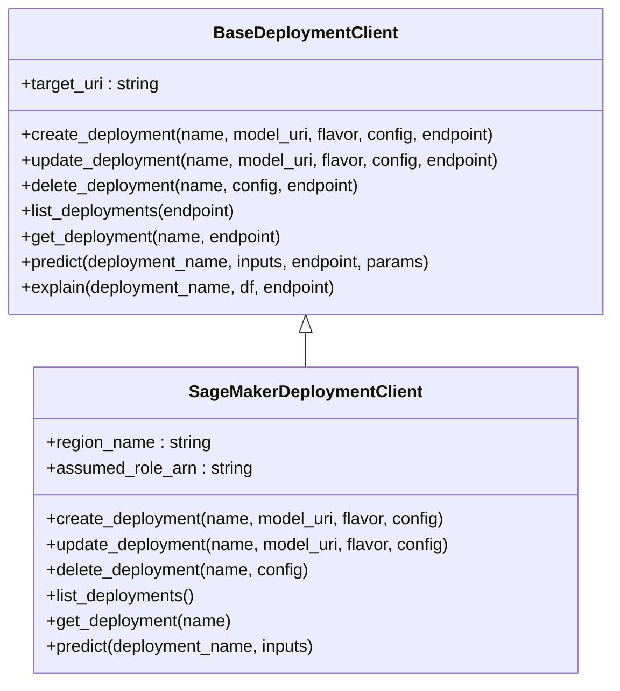

# AWS Integration

<cite>
**Referenced Files in This Document**   
- [sagemaker/__init__.py](file://mlflow/sagemaker/__init__.py)
- [sagemaker/cli.py](file://mlflow/sagemaker/cli.py)
- [sagemaker/push_image_to_ecr.sh](file://mlflow/sagemaker/push_image_to_ecr.sh)
- [docs/docs/classic-ml/deployment/deploy-model-to-sagemaker/index.mdx](file://docs/docs/classic-ml/deployment/deploy-model-to-sagemaker/index.mdx)
</cite>

## Table of Contents
1. [Introduction](#introduction)
2. [Containerization Process and ECR Management](#containerization-process-and-ecr-management)
3. [Deployment Workflow from mlflow.deploy() to SageMaker Endpoint](#deployment-workflow-from-mlflowdeploy-to-sagemaker-endpoint)
4. [SageMaker-Specific Parameters in Deployments Plugin System](#sagemaker-specific-parameters-in-deployments-plugin-system)
5. [Integration with S3 Artifact Repositories and AWS Secret Management](#integration-with-s3-artifact-repositories-and-aws-secret-management)
6. [Common Issues and Optimization Strategies](#common-issues-and-optimization-strategies)
7. [Conclusion](#conclusion)

## Introduction
The MLflow integration with Amazon SageMaker provides a comprehensive solution for deploying machine learning models as scalable inference endpoints. This integration automates the entire deployment process, from containerization to endpoint creation, while providing fine-grained control over deployment parameters. The system leverages SageMaker's Bring Your Own Container (BYOC) capability to deploy MLflow models without requiring users to manually create Docker configurations. This document details the implementation of model deployment to SageMaker, including the containerization process, ECR image management, endpoint configuration, and the complete workflow from `mlflow.deploy()` to SageMaker endpoint creation.

**Section sources**
- [sagemaker/__init__.py](file://mlflow/sagemaker/__init__.py#L1-L80)
- [docs/docs/classic-ml/deployment/deploy-model-to-sagemaker/index.mdx](file://docs/docs/classic-ml/deployment/deploy-model-to-sagemaker/index.mdx#L1-L15)

## Containerization Process and ECR Management
The containerization process in MLflow's SageMaker integration begins with the creation of a Docker image that contains all necessary dependencies for model serving. The process is initiated through the `build-and-push-container` command, which generates a Dockerfile and builds an image compatible with SageMaker's requirements. The container includes a web server that exposes REST endpoints for model inference, with the `/invocations` endpoint accepting CSV and JSON input data and returning prediction results.

ECR (Elastic Container Registry) management is handled through the `push_image_to_ecr` function, which automates the process of pushing the locally built Docker image to AWS ECR. This function first checks if the specified repository exists in ECR, creating it if necessary. It then authenticates with ECR using AWS credentials, tags the local image with the appropriate ECR repository URI, and pushes the image to the registry. The repository URI follows the format `{account}.dkr.ecr.{region}.amazonaws.com/{image}:{version}`, ensuring the image is accessible to SageMaker during endpoint creation.

**Diagram sources **
- [sagemaker/__init__.py](file://mlflow/sagemaker/__init__.py#L117-L172)
- [sagemaker/cli.py](file://mlflow/sagemaker/cli.py#L339-L387)
- [sagemaker/push_image_to_ecr.sh](file://mlflow/sagemaker/push_image_to_ecr.sh#L1-L51)

**Section sources**
- [sagemaker/__init__.py](file://mlflow/sagemaker/__init__.py#L117-L172)
- [sagemaker/cli.py](file://mlflow/sagemaker/cli.py#L339-L387)
- [sagemaker/push_image_to_ecr.sh](file://mlflow/sagemaker/push_image_to_ecr.sh#L1-L51)

## Deployment Workflow from mlflow.deploy() to SageMaker Endpoint
The deployment workflow from `mlflow.deploy()` to SageMaker endpoint creation follows a systematic process that ensures reliable and consistent model deployment. When the `create_deployment` method is called, it first validates the deployment configuration and downloads the model artifacts from their storage location (local filesystem, S3, or MLflow tracking server). The model artifacts are then packaged into a compressed tarball and uploaded to an S3 bucket, which serves as the model data source for the SageMaker endpoint.

The deployment process then creates the necessary SageMaker resources in sequence: first a SageMaker model, then an endpoint configuration, and finally the endpoint itself. The SageMaker model resource references the ECR container image and the S3 location of the model artifacts. The endpoint configuration specifies the compute resources (instance type and count), production variants, and other deployment parameters. Finally, the endpoint is created using the endpoint configuration, which triggers SageMaker to provision the necessary infrastructure and deploy the model.

**Diagram sources **
- [sagemaker/__init__.py](file://mlflow/sagemaker/__init__.py#L174-L493)
- [sagemaker/__init__.py](file://mlflow/sagemaker/__init__.py#L1569-L1668)

**Section sources**
- [sagemaker/__init__.py](file://mlflow/sagemaker/__init__.py#L174-L493)
- [sagemaker/__init__.py](file://mlflow/sagemaker/__init__.py#L1569-L1668)

## SageMaker-Specific Parameters in Deployments Plugin System
The SageMaker deployments plugin system provides a comprehensive set of parameters that allow fine-grained control over the deployment process. These parameters are exposed through both the Python API and CLI interface, enabling users to customize their deployments according to specific requirements. The plugin system is implemented through the `SageMakerDeploymentClient` class, which inherits from `BaseDeploymentClient` and implements the required deployment operations.

Key SageMaker-specific parameters include instance type and count, which determine the compute resources allocated to the endpoint. Users can select from various instance types based on their performance and cost requirements. The deployment mode parameter allows users to specify whether to create a new endpoint, replace an existing one, or add a model to a pre-existing endpoint. Additional parameters include VPC configuration for network isolation, data capture configuration for monitoring, and environment variables for customizing the serving environment.

The plugin system also supports advanced features such as asynchronous deployment, where the function returns immediately after starting the deployment process, allowing users to monitor the deployment status separately. The system validates all parameters before initiating the deployment, ensuring that invalid configurations are caught early in the process.

**Diagram sources **
- [sagemaker/__init__.py](file://mlflow/sagemaker/__init__.py#L2030-L2787)
- [sagemaker/__init__.py](file://mlflow/sagemaker/__init__.py#L2150-L2366)

**Section sources**
- [sagemaker/__init__.py](file://mlflow/sagemaker/__init__.py#L2030-L2787)
- [sagemaker/__init__.py](file://mlflow/sagemaker/__init__.py#L2150-L2366)

## Integration with S3 Artifact Repositories and AWS Secret Management
The integration with S3 artifact repositories is a fundamental aspect of the SageMaker deployment process. When a model is deployed, its artifacts are automatically uploaded to an S3 bucket, which serves as the persistent storage for the model data. The system can use either a user-specified bucket or create a default bucket following a naming convention that includes the region and account ID. This integration ensures that model artifacts are securely stored and readily accessible to SageMaker during endpoint creation and scaling operations.

For AWS secret management, the system leverages IAM roles and temporary credentials to securely access AWS resources. The deployment process uses an execution role that grants SageMaker permissions to access the ECR container image and the S3 bucket containing model artifacts. When deploying across AWS accounts, the system supports assuming cross-account roles through the `assume_role_arn` parameter. The credentials for assumed roles are obtained through STS (Security Token Service) and are used to create boto3 clients with the appropriate permissions.

The integration also supports proxy configuration through environment variables (http_proxy, https_proxy, no_proxy), which are automatically included in the deployment configuration when present. This allows deployments to work in environments with restricted network access while maintaining security best practices.

**Section sources**
- [sagemaker/__init__.py](file://mlflow/sagemaker/__init__.py#L1271-L1300)
- [sagemaker/__init__.py](file://mlflow/sagemaker/__init__.py#L1240-L1269)
- [sagemaker/__init__.py](file://mlflow/sagemaker/__init__.py#L1355-L1363)

## Common Issues and Optimization Strategies
Several common issues can arise during SageMaker deployments, along with corresponding optimization strategies. Model size limitations can be addressed by optimizing model artifacts, using model pruning techniques, or leveraging SageMaker's model parallelism features for large models. Network isolation requirements can be satisfied through VPC configuration, which allows deployment into private subnets with controlled access to other resources.

Cost optimization is achieved through careful selection of instance types and implementation of auto-scaling policies. Users should select instance types that balance performance requirements with cost considerations, such as using ml.t3 instances for development and testing, and ml.m5 or ml.c5 instances for production workloads. Auto-scaling policies can be configured to adjust the number of instances based on metrics like CPU utilization or request latency, ensuring optimal resource utilization.

Other optimization strategies include using SageMaker's serverless inference for workloads with unpredictable traffic patterns, implementing data capture for monitoring and debugging, and using asynchronous inference for long-running predictions. The system also supports deployment archiving, which preserves resources from previous deployments for rollback purposes, though this should be balanced against cost considerations.

**Section sources**
- [sagemaker/__init__.py](file://mlflow/sagemaker/__init__.py#L280-L295)
- [sagemaker/__init__.py](file://mlflow/sagemaker/__init__.py#L48-L49)
- [sagemaker/__init__.py](file://mlflow/sagemaker/__init__.py#L2220-L2223)

## Conclusion
The MLflow integration with Amazon SageMaker provides a robust and flexible solution for deploying machine learning models to production environments. By automating the containerization process and managing the deployment workflow, MLflow significantly reduces the complexity of deploying models to SageMaker. The integration supports a wide range of deployment scenarios, from simple single-model endpoints to complex multi-variant configurations with advanced networking and security requirements. With proper configuration and optimization, this integration enables organizations to efficiently deploy and manage machine learning models at scale while maintaining cost-effectiveness and operational reliability.