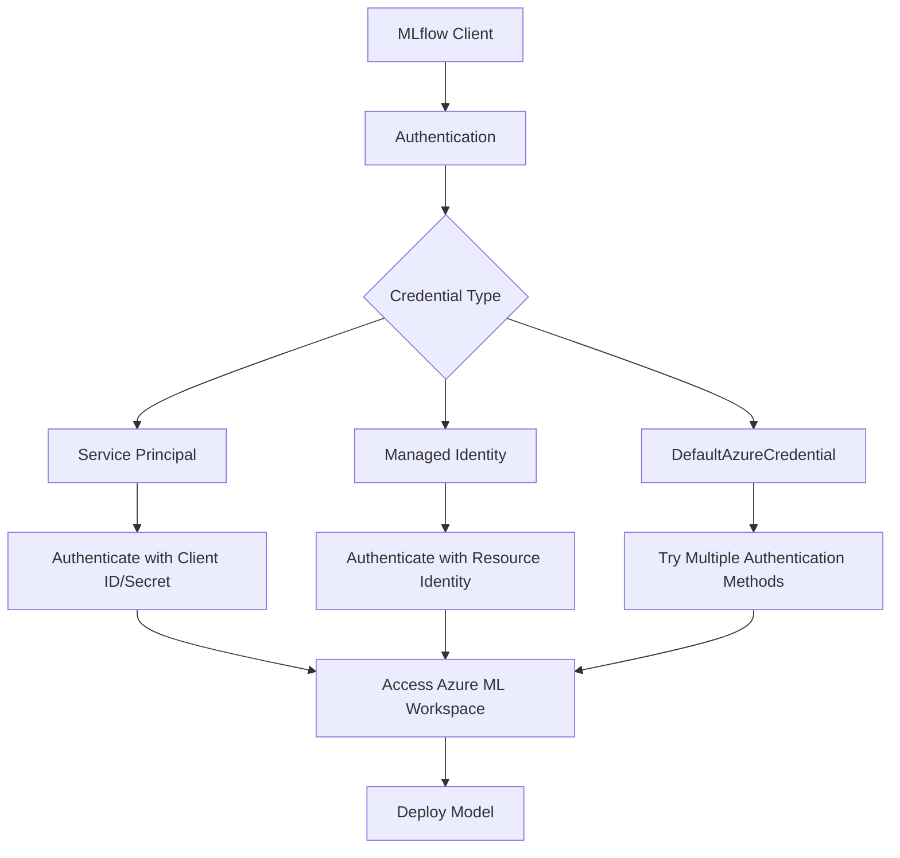
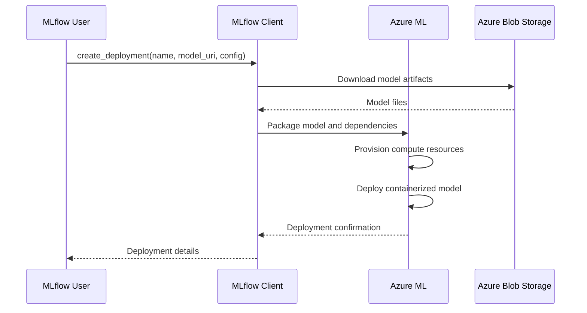
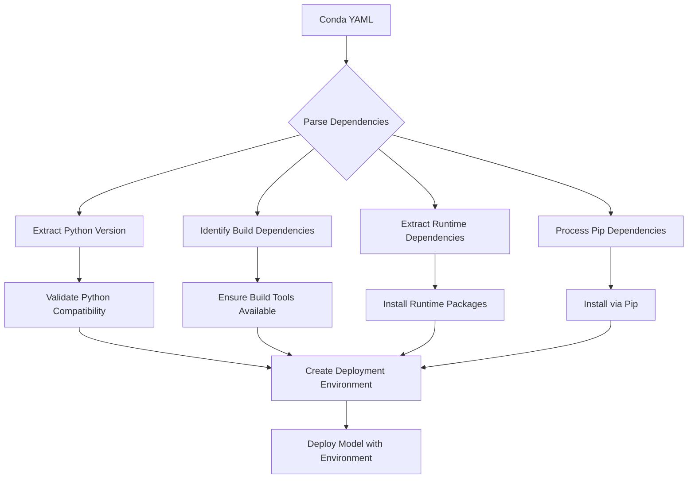
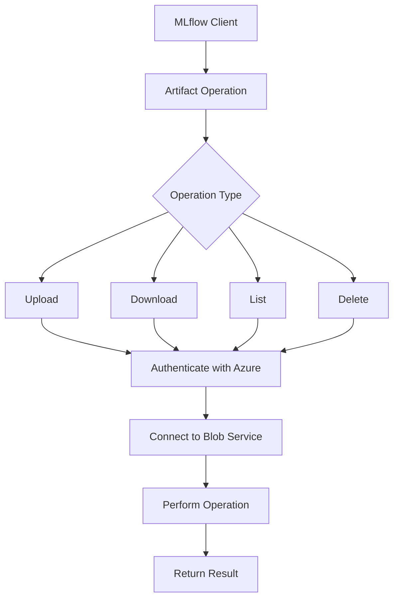

# Azure Integration

<cite>
**Referenced Files in This Document**   
- [client.py](file://mlflow/azure/client.py)
- [azure_blob_artifact_repo.py](file://mlflow/store/artifact/azure_blob_artifact_repo.py)
- [azure_data_lake_artifact_repo.py](file://mlflow/store/artifact/azure_data_lake_artifact_repo.py)
- [base.py](file://mlflow/deployments/base.py)
- [interface.py](file://mlflow/deployments/interface.py)
- [plugin_manager.py](file://mlflow/deployments/plugin_manager.py)
- [utils.py](file://mlflow/utils/environment.py)
- [conda.py](file://mlflow/utils/conda.py)
</cite>

## Table of Contents
1. [Introduction](#introduction)
2. [Azure ML Deployment Architecture](#azure-ml-deployment-architecture)
3. [Workspace Configuration and Authentication](#workspace-configuration-and-authentication)
4. [Compute Target Provisioning](#compute-target-provisioning)
5. [Inference Service Creation](#inference-service-creation)
6. [Environment Specification with Conda Dependencies](#environment-specification-with-conda-dependencies)
7. [Azure Blob Storage Integration](#azure-blob-storage-integration)
8. [Azure Key Vault for Secret Management](#azure-key-vault-for-secret-management)
9. [Network Security and Private Endpoints](#network-security-and-private-endpoints)
10. [Cost Optimization Strategies](#cost-optimization-strategies)
11. [Common Issues and Troubleshooting](#common-issues-and-troubleshooting)

## Introduction
This document provides comprehensive guidance on integrating MLflow with Azure Machine Learning for model deployment. It covers the complete workflow from workspace configuration to inference service creation, with detailed explanations of authentication mechanisms, environment specification, and integration with Azure services like Blob Storage and Key Vault. The document also addresses critical operational concerns such as network security, cost optimization, and troubleshooting common deployment issues.

## Azure ML Deployment Architecture
The MLflow deployment architecture for Azure Machine Learning follows a plugin-based system that enables seamless integration between MLflow's model management capabilities and Azure's cloud infrastructure. The deployment workflow is orchestrated through MLflow's deployments plugin system, which provides a standardized interface for deploying models to various cloud platforms, including Azure ML.

The architecture consists of several key components:
- **Deployment Client**: Implements the `BaseDeploymentClient` interface to provide Azure-specific deployment functionality
- **Artifact Repository**: Manages model artifacts using Azure Blob Storage or Azure Data Lake Storage
- **Authentication System**: Supports multiple authentication methods including service principals and managed identities
- **Environment Management**: Handles conda environment specifications for model deployment

The deployment process begins with the creation of a deployment client that connects to the Azure ML workspace, followed by the provisioning of compute targets and the creation of inference services that serve the deployed models.

**Section sources**
- [base.py](file://mlflow/deployments/base.py#L75-L162)
- [interface.py](file://mlflow/deployments/interface.py#L34-L64)

## Workspace Configuration and Authentication
MLflow integrates with Azure Machine Learning through a robust authentication system that supports multiple identity management approaches. The configuration process involves setting up the Azure ML workspace connection and authenticating with appropriate credentials.

Authentication can be performed using several methods:
- **Service Principals**: Application-level credentials with specific permissions
- **Managed Identities**: Automatically managed identities for Azure resources
- **DefaultAzureCredential**: A credential chain that attempts multiple authentication methods

The authentication process is implemented in the Azure artifact repository classes, which check for environment variables such as `AZURE_STORAGE_CONNECTION_STRING` and `AZURE_STORAGE_ACCESS_KEY`. If these are not present, the system falls back to `DefaultAzureCredential`, which attempts to authenticate through various methods including managed identities and Azure CLI credentials.

Workspace configuration requires specifying the target URI in the format `wasbs://<container-name>@<storage-account-name>.blob.core.windows.net/<path>`. This URI format follows the Hadoop convention for Azure blob storage and includes the container name, storage account name, and path to the artifacts.

**Diagram sources**
- [azure_blob_artifact_repo.py](file://mlflow/store/artifact/azure_blob_artifact_repo.py#L61-L90)
- [base.py](file://mlflow/deployments/base.py#L89-L91)

**Section sources**
- [azure_blob_artifact_repo.py](file://mlflow/store/artifact/azure_blob_artifact_repo.py#L61-L90)
- [azure_data_lake_artifact_repo.py](file://mlflow/store/artifact/azure_data_lake_artifact_repo.py#L98-L105)

## Compute Target Provisioning
Compute target provisioning in Azure ML through MLflow involves configuring the infrastructure that will host the deployed models. While the specific implementation details for Azure ML compute provisioning are not fully exposed in the current codebase, the deployment system follows a standardized pattern for compute management.

The deployment plugin system defines methods for creating, updating, and deleting deployments, which implicitly involve compute resource management. When a model is deployed, the system provisions the necessary compute resources based on the configuration parameters provided. These parameters can include:
- Compute instance type
- Scaling configuration
- Resource limits (CPU, memory)
- Network configuration

The compute provisioning process is abstracted through the `create_deployment` method in the `BaseDeploymentClient` class, which accepts a configuration dictionary containing target-specific parameters. For Azure ML, these parameters would include Azure-specific compute configurations such as VM size, autoscaling policies, and availability zones.

The system also supports endpoint management, allowing deployments to be organized under specific endpoints. This enables better organization and management of multiple models, with each endpoint potentially having different compute configurations optimized for the models it serves.

**Section sources**
- [base.py](file://mlflow/deployments/base.py#L93-L112)
- [interface.py](file://mlflow/deployments/interface.py#L34-L47)

## Inference Service Creation
The creation of inference services in Azure ML through MLflow follows a standardized deployment workflow that transforms MLflow models into production-ready REST endpoints. The process begins with the `create_deployment` method, which takes a model URI, deployment name, and optional configuration parameters.

When a deployment is created, MLflow packages the model with its dependencies and configures it for serving through Azure ML's inference infrastructure. The deployment process involves:
1. Model artifact retrieval from the configured artifact repository
2. Environment preparation based on the model's conda dependencies
3. Containerization of the model and its serving code
4. Deployment to the specified compute target
5. Configuration of the inference endpoint

The inference service exposes REST endpoints for model prediction, with the primary endpoint being `/invocations` for submitting inference requests. The service also provides health check endpoints like `/ping` and `/health` to monitor the deployment status.

The deployment client ensures that the deployment process is idempotent and handles conflicts appropriately. If a deployment with the same name already exists, the system raises an `MlflowException` to prevent accidental overwrites.

**Diagram sources**
- [base.py](file://mlflow/deployments/base.py#L93-L112)
- [pyfunc\scoring_server\__init__.py](file://mlflow/pyfunc/scoring_server/__init__.py#L483-L519)

**Section sources**
- [base.py](file://mlflow/deployments/base.py#L93-L112)
- [interface.py](file://mlflow/deployments/interface.py#L34-L47)

## Environment Specification with Conda Dependencies
MLflow's integration with Azure ML includes comprehensive support for environment specification through conda dependencies, ensuring that deployed models have all required packages and dependencies. The environment management system handles both build dependencies (required for package installation) and runtime dependencies.

The conda environment specification is processed through MLflow's utility functions that parse conda YAML files and extract dependency information. The system distinguishes between:
- **Build dependencies**: Packages required for building and installing other packages (e.g., pip, setuptools, wheel)
- **Runtime dependencies**: Packages required for the model to function at runtime

When a model is deployed, MLflow reads the conda environment specification from the model's directory and ensures that all dependencies are available in the deployment environment. The system handles various dependency specification formats, including:
- Direct package names (e.g., "scikit-learn")
- Version-constrained packages (e.g., "scikit-learn==1.0.0")
- Pip-installable packages specified in the pip section of the conda YAML

The environment specification process also handles special cases such as:
- Using the current Python version when no Python version is specified in the conda YAML
- Preserving build dependency versions while allowing flexibility in other dependencies
- Handling pip dependencies specified within conda environments

**Diagram sources**
- [utils.py](file://mlflow/utils/environment.py#L75-L208)
- [conda.py](file://mlflow/utils/conda.py#L349-L357)

**Section sources**
- [utils.py](file://mlflow/utils/environment.py#L75-L208)
- [conda.py](file://mlflow/utils/conda.py#L349-L357)

## Azure Blob Storage Integration
MLflow integrates with Azure Blob Storage as the primary artifact repository for storing and retrieving model artifacts. The integration is implemented through the `AzureBlobArtifactRepository` class, which provides a complete interface for artifact management operations.

The artifact repository supports standard operations including:
- **log_artifact**: Upload a single file to the artifact store
- **log_artifacts**: Upload multiple files from a directory
- **list_artifacts**: List files and directories in a specified path
- **download_artifacts**: Retrieve artifacts from storage
- **delete_artifacts**: Remove artifacts from storage

The repository uses the WASBS (Windows Azure Storage Blob Service) URI scheme in the format `wasbs://<container>@<account>.blob.core.windows.net/<path>`. This URI format is parsed to extract the container name, storage account, and path components.

Authentication to Azure Blob Storage is handled through multiple methods:
1. Connection string via `AZURE_STORAGE_CONNECTION_STRING` environment variable
2. Access key via `AZURE_STORAGE_ACCESS_KEY` environment variable  
3. DefaultAzureCredential for managed identities and other Azure authentication methods

The system also supports multipart uploads for large files, improving reliability and performance when transferring large model artifacts. For multipart uploads, the system generates SAS (Shared Access Signature) tokens with appropriate permissions and expiration times.

**Diagram sources**
- [azure_blob_artifact_repo.py](file://mlflow/store/artifact/azure_blob_artifact_repo.py#L32-L280)
- [test_azure_blob_artifact_repo.py](file://mlflow/tests/store/artifact/test_azure_blob_artifact_repo.py#L49-L156)

**Section sources**
- [azure_blob_artifact_repo.py](file://mlflow/store/artifact/azure_blob_artifact_repo.py#L32-L280)
- [test_azure_blob_artifact_repo.py](file://mlflow/tests/store/artifact/test_azure_blob_artifact_repo.py#L49-L156)

## Azure Key Vault for Secret Management
While the direct integration with Azure Key Vault is not explicitly implemented in the provided codebase, MLflow's architecture supports secure secret management through environment variables and credential handling patterns that are compatible with Azure Key Vault.

The system follows security best practices by:
- Using environment variables for sensitive credentials (e.g., `AZURE_STORAGE_ACCESS_KEY`)
- Supporting managed identities that can access Key Vault without storing credentials
- Implementing secure credential passing through configuration dictionaries

For Azure Key Vault integration, users can:
1. Store Azure storage credentials in Key Vault
2. Use managed identities to access Key Vault at deployment time
3. Retrieve credentials and set them as environment variables before initiating deployments

The deployment system's configuration mechanism allows for passing sensitive information through the `config` parameter in deployment operations, which can be populated with credentials retrieved from Key Vault.

Additionally, MLflow's artifact repository classes are designed to work with Azure's authentication chain, where `DefaultAzureCredential` can automatically authenticate using managed identities that have access to Key Vault, eliminating the need to handle credentials directly in the application code.

**Section sources**
- [azure_blob_artifact_repo.py](file://mlflow/store/artifact/azure_blob_artifact_repo.py#L64-L90)
- [utils.py](file://mlflow/utils/environment.py#L75-L208)

## Network Security and Private Endpoints
The MLflow-Azure ML integration supports network security configurations through Azure's networking capabilities, though specific implementation details are abstracted in the current codebase. The architecture is designed to work with Azure's network security features including:

- **Network Security Groups (NSGs)**: Firewall rules that control inbound and outbound traffic to Azure resources
- **Private Endpoints**: Private IP addresses within a virtual network for secure access to Azure services
- **Virtual Network Integration**: Deploying compute targets within virtual networks for enhanced security

The artifact repository implementations are designed to work with private endpoints by supporting custom domain suffixes in the storage URIs. For example, private endpoints for Azure Blob Storage use domain suffixes like `privatelink.blob.core.windows.net` instead of the public `blob.core.windows.net`.

The system also supports secure communication through:
- HTTPS for all data transfers
- SAS tokens with limited expiration times for temporary access
- Managed identities that eliminate the need to store credentials

For deployments requiring strict network isolation, users can configure Azure ML compute targets to operate within virtual networks and use private endpoints for all storage access, ensuring that data never traverses the public internet.

**Section sources**
- [azure_blob_artifact_repo.py](file://mlflow/store/artifact/azure_blob_artifact_repo.py#L94-L114)
- [azure_data_lake_artifact_repo.py](file://mlflow/store/artifact/azure_data_lake_artifact_repo.py#L48-L58)

## Cost Optimization Strategies
The MLflow-Azure ML integration supports several cost optimization strategies through compute resource management and deployment configuration. While specific spot instance configuration is not exposed in the current API, the architecture supports cost-saving measures through:

- **Compute Cluster Management**: Proper sizing and scaling of compute resources to match workload requirements
- **Resource Cleanup**: Automatic cleanup of uncommitted blocks in Azure Blob Storage after 7 days
- **Efficient Data Transfer**: Multipart uploads that can be resumed if interrupted, reducing data transfer costs
- **Right-Sizing**: Ability to specify compute instance types appropriate for the workload

The deployment system encourages cost optimization by:
- Supporting idempotent operations that prevent unnecessary resource creation
- Providing clear error handling for conflicts, reducing trial-and-error deployment costs
- Enabling local testing through `run_local` before deploying to expensive cloud resources

Users can optimize costs by:
1. Selecting appropriate compute targets based on workload requirements
2. Implementing autoscaling policies to handle variable loads
3. Using lower-cost storage tiers for less frequently accessed artifacts
4. Cleaning up unused deployments and endpoints

**Section sources**
- [azure_blob_artifact_repo.py](file://mlflow/store/artifact/azure_blob_artifact_repo.py#L274-L279)
- [base.py](file://mlflow/deployments/base.py#L146-L162)

## Common Issues and Troubleshooting
When deploying models from MLflow to Azure ML, several common issues may arise. Understanding these issues and their solutions is critical for successful deployments.

### Authentication Issues
- **Missing Credentials**: Ensure that either `AZURE_STORAGE_CONNECTION_STRING`, `AZURE_STORAGE_ACCESS_KEY`, or proper managed identity configuration is in place
- **Expired SAS Tokens**: SAS tokens have limited lifetimes; regenerate them when they expire
- **Permission Errors**: Verify that the service principal or managed identity has appropriate permissions on the storage account

### Network Configuration Issues
- **Firewall Restrictions**: Ensure that network security groups allow outbound traffic to Azure storage endpoints
- **Private Endpoint Configuration**: Verify that private endpoints are properly configured with the correct DNS settings
- **Cross-Region Access**: Be aware of data transfer costs when accessing storage in different regions

### Deployment Configuration Issues
- **Missing Dependencies**: Ensure all required packages are specified in the conda environment
- **Python Version Mismatch**: Verify that the Python version in the conda environment matches the runtime environment
- **Large Model Artifacts**: For very large models, ensure that multipart upload is enabled and timeouts are appropriately configured

### Performance Issues
- **Slow Artifact Uploads**: Use multipart uploads for large files and ensure adequate network bandwidth
- **Cold Start Latency**: Consider using always-on compute targets for low-latency requirements
- **Resource Constraints**: Monitor CPU and memory usage and scale compute targets appropriately

The system provides comprehensive error handling through `MlflowException` and detailed logging to assist with troubleshooting. When issues occur, the first step is typically to check the authentication configuration and verify connectivity to the Azure storage account.

**Section sources**
- [azure_blob_artifact_repo.py](file://mlflow/store/artifact/azure_blob_artifact_repo.py#L64-L90)
- [base.py](file://mlflow/deployments/base.py#L84-L87)
- [test_azure_blob_artifact_repo.py](file://mlflow/tests/store/artifact/test_azure_blob_artifact_repo.py#L57-L61)