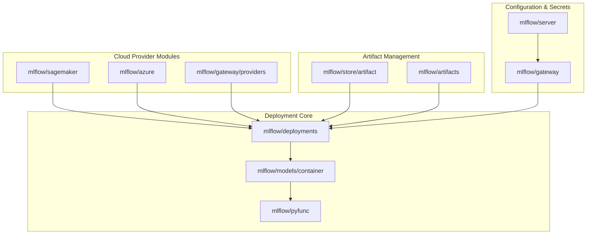
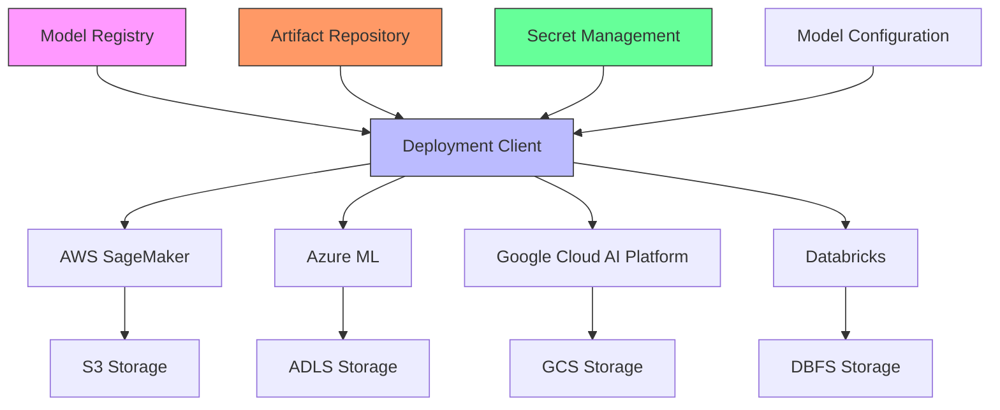
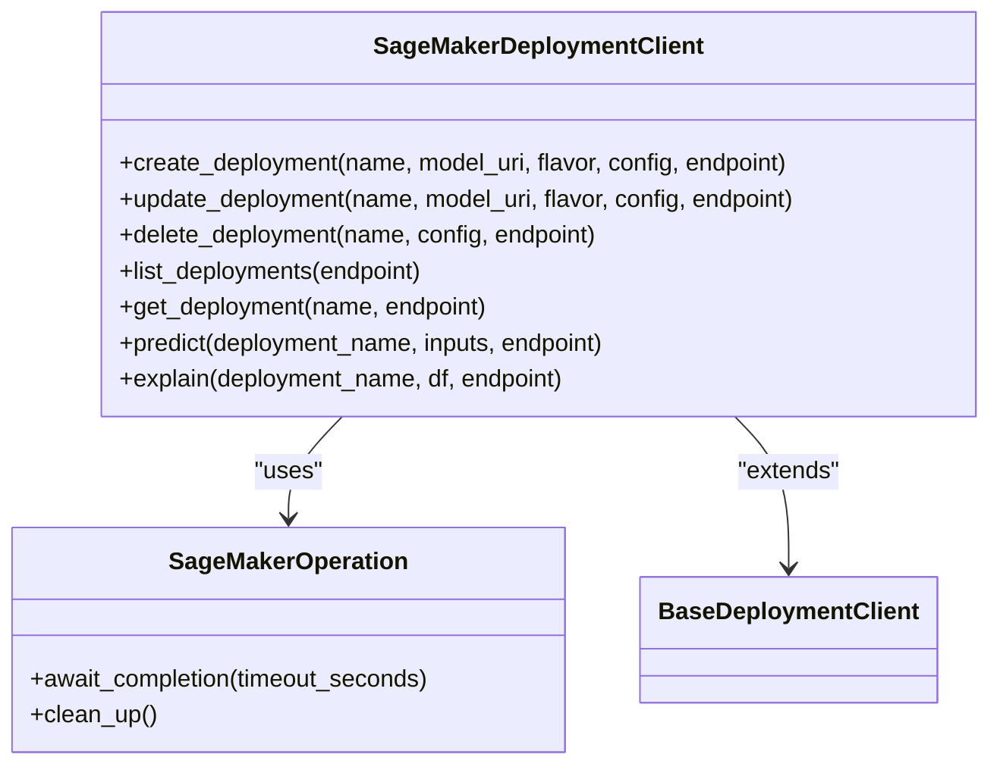
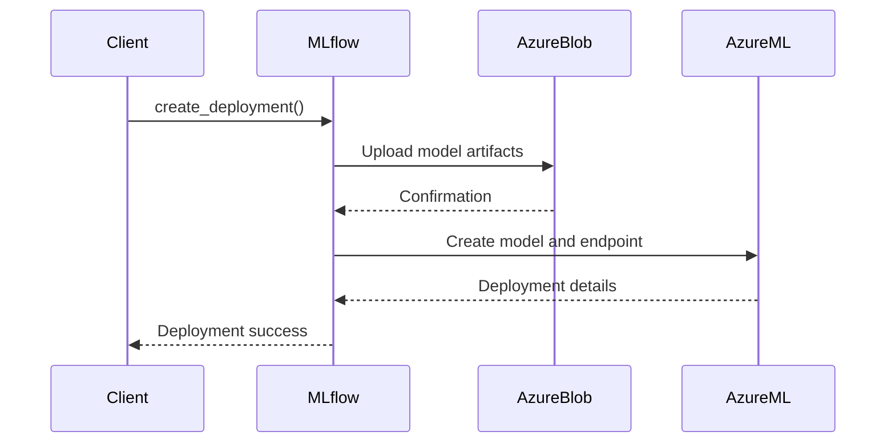
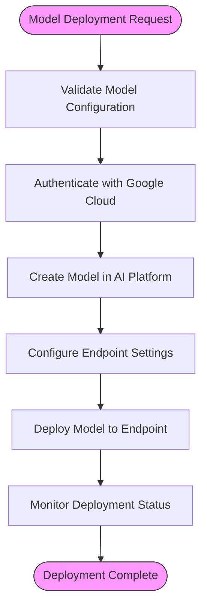
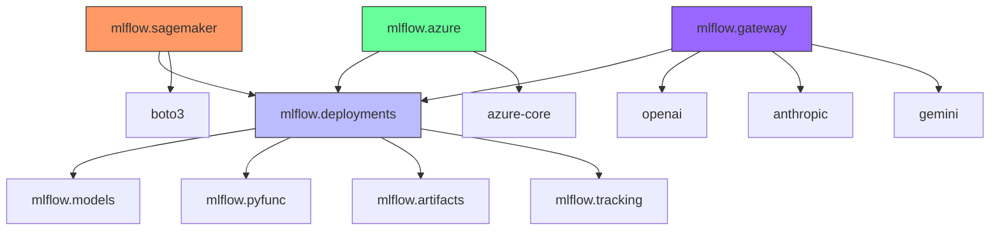

# Cloud Integration

<cite>
**Referenced Files in This Document**   
- [mlflow\sagemaker\__init__.py](file://mlflow/sagemaker/__init__.py)
- [mlflow\deployments\__init__.py](file://mlflow/deployments/__init__.py)
- [mlflow\azure\client.py](file://mlflow/azure/client.py)
- [mlflow\store\artifact\azure_blob_artifact_repo.py](file://mlflow/store/artifact/azure_blob_artifact_repo.py)
- [mlflow\store\artifact\azure_data_lake_artifact_repo.py](file://mlflow/store/artifact/azure_data_lake_artifact_repo.py)
- [mlflow\protos\model_registry_pb2.py](file://mlflow/protos/model_registry_pb2.py)
- [mlflow\entities\model_registry\registered_model.py](file://mlflow/entities/model_registry/registered_model.py)
- [mlflow\entities\model_registry\model_version_deployment_job_state.py](file://mlflow/entities/model_registry/model_version_deployment_job_state.py)
- [mlflow\gateway\config.py](file://mlflow/gateway/config.py)
- [mlflow\server\gateway_api.py](file://mlflow/server/gateway_api.py)
- [mlflow\server\js\src\gateway\types.ts](file://mlflow/server/js/src/gateway/types.ts)
</cite>

## Table of Contents
1. [Introduction](#introduction)
2. [Project Structure](#project-structure)
3. [Core Components](#core-components)
4. [Architecture Overview](#architecture-overview)
5. [Detailed Component Analysis](#detailed-component-analysis)
6. [Dependency Analysis](#dependency-analysis)
7. [Performance Considerations](#performance-considerations)
8. [Troubleshooting Guide](#troubleshooting-guide)
9. [Conclusion](#conclusion)

## Introduction
MLflow provides comprehensive cloud integration capabilities for deploying machine learning models across major cloud platforms including AWS SageMaker, Microsoft Azure ML, and Google Cloud AI Platform. This documentation details the implementation of cloud-specific deployment workflows, authentication mechanisms, infrastructure as code patterns, and monitoring capabilities. The system enables seamless model deployment from registration to cloud resource provisioning, with robust support for artifact repositories, secret management, and deployment status monitoring.

## Project Structure
The MLflow codebase is organized with dedicated modules for each cloud provider and deployment functionality. The core cloud integration components are located in specific directories that handle provider-specific implementations while maintaining a consistent deployment interface.

**Diagram sources**
- [mlflow\sagemaker\__init__.py](file://mlflow/sagemaker/__init__.py)
- [mlflow\deployments\__init__.py](file://mlflow/deployments/__init__.py)
- [mlflow\store\artifact\azure_blob_artifact_repo.py](file://mlflow/store/artifact/azure_blob_artifact_repo.py)
- [mlflow\gateway\config.py](file://mlflow/gateway/config.py)

**Section sources**
- [mlflow\sagemaker\__init__.py](file://mlflow/sagemaker/__init__.py)
- [mlflow\deployments\__init__.py](file://mlflow/deployments/__init__.py)
- [mlflow\store\artifact\azure_blob_artifact_repo.py](file://mlflow/store/artifact/azure_blob_artifact_repo.py)

## Core Components
The cloud integration in MLflow is built around several core components that enable platform-agnostic deployment capabilities. The deployment system follows a plugin architecture where each cloud provider implements specific deployment logic while adhering to a common interface. The SageMaker integration provides direct deployment capabilities through the `mlflow.sagemaker` module, while Azure ML integration leverages both native Azure SDKs and the MLflow deployments interface. The gateway component enables integration with various cloud-based AI services including Google Cloud AI Platform through standardized interfaces.

**Section sources**
- [mlflow\sagemaker\__init__.py](file://mlflow/sagemaker/__init__.py)
- [mlflow\deployments\__init__.py](file://mlflow/deployments/__init__.py)
- [mlflow\gateway\config.py](file://mlflow/gateway/config.py)

## Architecture Overview
The cloud integration architecture in MLflow follows a modular design that separates deployment logic from model management and artifact storage. The system enables deployment to multiple cloud platforms through a consistent API while handling provider-specific configurations and requirements.

**Diagram sources**
- [mlflow\sagemaker\__init__.py](file://mlflow/sagemaker/__init__.py)
- [mlflow\deployments\__init__.py](file://mlflow/deployments/__init__.py)
- [mlflow\store\artifact\azure_blob_artifact_repo.py](file://mlflow/store/artifact/azure_blob_artifact_repo.py)
- [mlflow\gateway\config.py](file://mlflow/gateway/config.py)

## Detailed Component Analysis

### AWS SageMaker Integration
The AWS SageMaker integration in MLflow provides comprehensive deployment capabilities for ML models. The implementation handles model packaging, container creation, and deployment to SageMaker endpoints with support for various deployment modes including creation, replacement, and addition of models to existing endpoints.

**Diagram sources**
- [mlflow\sagemaker\__init__.py](file://mlflow/sagemaker/__init__.py)
- [mlflow\deployments\base.py](file://mlflow/deployments/base.py)

### Azure ML Integration
The Azure ML integration in MLflow leverages both direct Azure SDK calls and the standardized deployments interface. The implementation includes specialized artifact repositories for Azure Blob Storage and Azure Data Lake, enabling efficient model artifact management.

**Diagram sources**
- [mlflow\azure\client.py](file://mlflow/azure/client.py)
- [mlflow\store\artifact\azure_blob_artifact_repo.py](file://mlflow/store/artifact/azure_blob_artifact_repo.py)
- [mlflow\deployments\__init__.py](file://mlflow/deployments/__init__.py)

### Google Cloud AI Platform Integration
The Google Cloud AI Platform integration is implemented through the MLflow Gateway component, which provides a unified interface for various cloud-based AI services. The implementation handles authentication, model deployment, and inference routing with support for Google's ADK and Gemini services.

**Diagram sources**
- [mlflow\gateway\config.py](file://mlflow/gateway/config.py)
- [mlflow\server\gateway_api.py](file://mlflow/server/gateway_api.py)
- [mlflow\tracing\otel\translation\google_adk.py](file://mlflow/tracing/otel/translation/google_adk.py)

### Deployment Workflow
The deployment workflow from model registration to cloud resource provisioning follows a standardized process across all cloud providers, with provider-specific adaptations for authentication and infrastructure configuration.

```mermaid
flowchart LR
A[Model Registered] --> B[Model Validation]
B --> C[Artifact Storage]
C --> D[Deployment Configuration]
D --> E[Cloud Authentication]
E --> F[Resource Provisioning]
F --> G[Model Deployment]
G --> H[Health Check]
H --> I[Monitoring Setup]
I --> J[Deployment Complete]
classDef process fill:#eef,stroke:#333;
class A,B,C,D,E,F,G,H,I,J process;
```

**Diagram sources**
- [mlflow\sagemaker\__init__.py](file://mlflow/sagemaker/__init__.py)
- [mlflow\deployments\__init__.py](file://mlflow/deployments/__init__.py)
- [mlflow\gateway\config.py](file://mlflow/gateway/config.py)

## Dependency Analysis
The cloud integration components in MLflow have well-defined dependencies that enable extensibility while maintaining separation of concerns. The deployment system relies on the core MLflow components for model management and artifact storage, while integrating with cloud-specific SDKs for provider-specific functionality.

**Diagram sources**
- [mlflow\deployments\__init__.py](file://mlflow/deployments/__init__.py)
- [mlflow\sagemaker\__init__.py](file://mlflow/sagemaker/__init__.py)
- [mlflow\azure\client.py](file://mlflow/azure/client.py)
- [mlflow\gateway\config.py](file://mlflow/gateway/config.py)

## Performance Considerations
The cloud integration in MLflow includes several performance optimizations for model deployment and inference. The system supports serverless configurations, async inference, and batch transform jobs to optimize resource utilization and cost. Deployment operations can be executed synchronously or asynchronously, with configurable timeout periods and resource cleanup policies. The implementation includes monitoring capabilities for tracking deployment status and performance metrics across different cloud environments.

## Troubleshooting Guide
Common issues in cloud deployments typically relate to authentication, network configuration, and resource limits. The system provides detailed error messages and logging to assist with troubleshooting deployment failures. Authentication issues can arise from incorrect credential configuration or expired tokens, while network issues may occur when deploying to private VPCs or restricted subnets. Resource limits such as instance type availability or storage quotas can also impact deployment success. The deployment status monitoring capabilities help identify and resolve these issues by providing real-time feedback on the deployment process.

**Section sources**
- [mlflow\sagemaker\__init__.py](file://mlflow/sagemaker/__init__.py)
- [mlflow\deployments\__init__.py](file://mlflow/deployments/__init__.py)
- [mlflow\gateway\config.py](file://mlflow/gateway/config.py)

## Conclusion
MLflow's cloud integration provides a comprehensive framework for deploying machine learning models across major cloud platforms. The system enables seamless deployment to AWS SageMaker, Microsoft Azure ML, and Google Cloud AI Platform through a consistent interface while handling provider-specific requirements. The architecture supports various deployment patterns, authentication methods, and infrastructure configurations, making it suitable for diverse cloud environments. The integration with artifact repositories and secret management systems ensures secure and reliable model deployments, while the monitoring capabilities provide visibility into deployment status and performance.