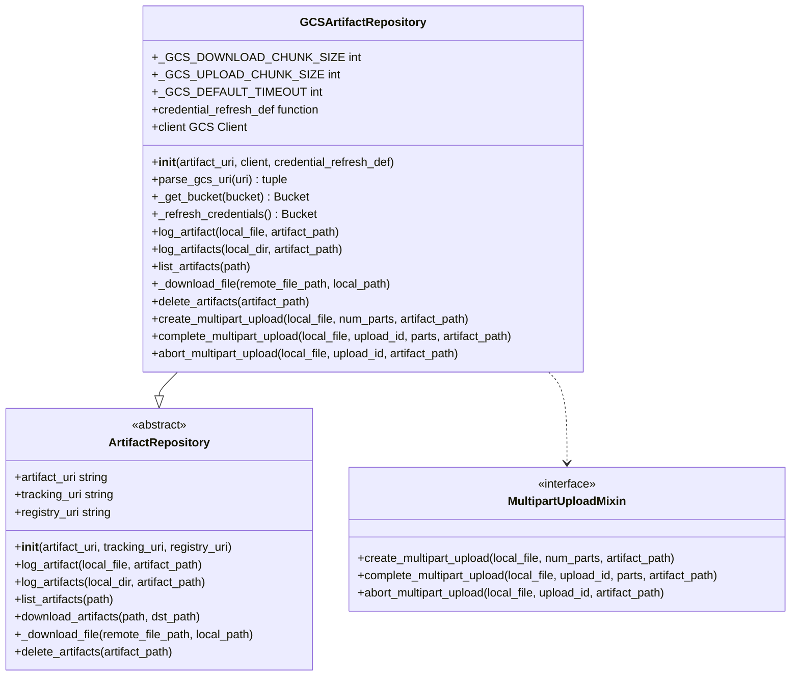
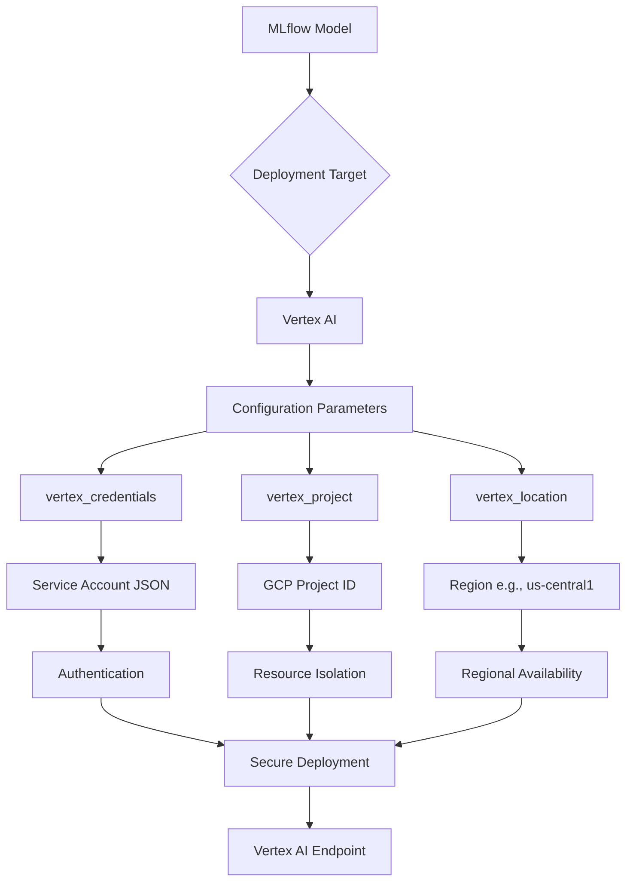
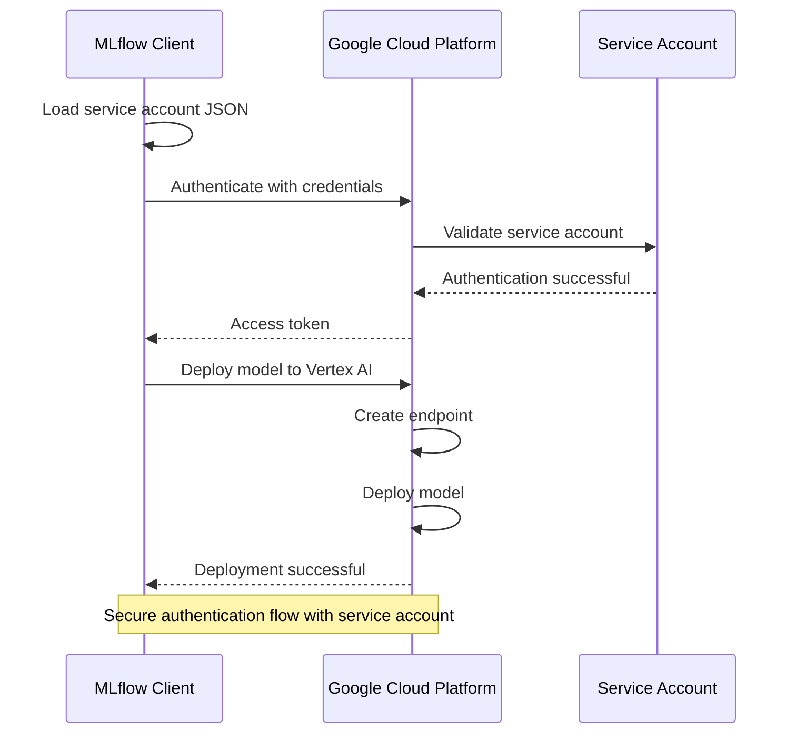
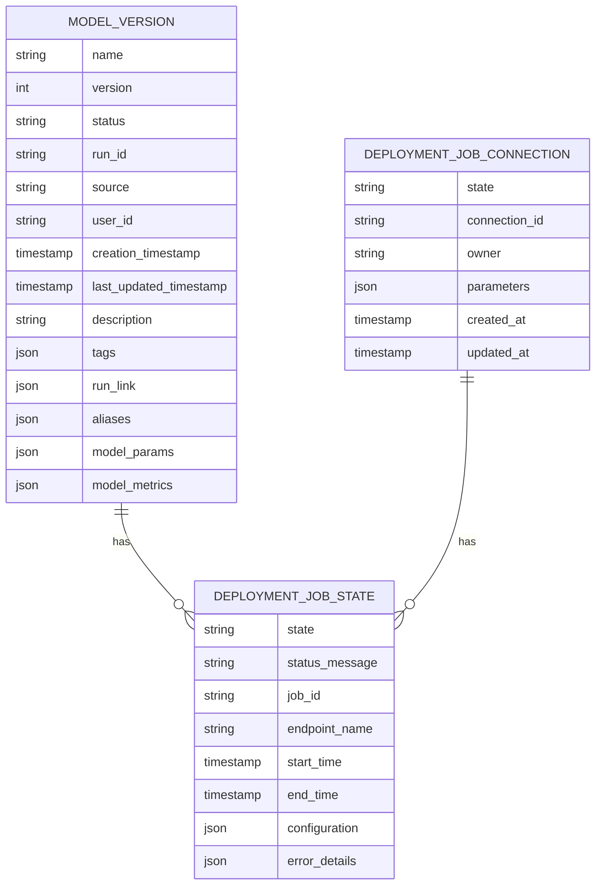
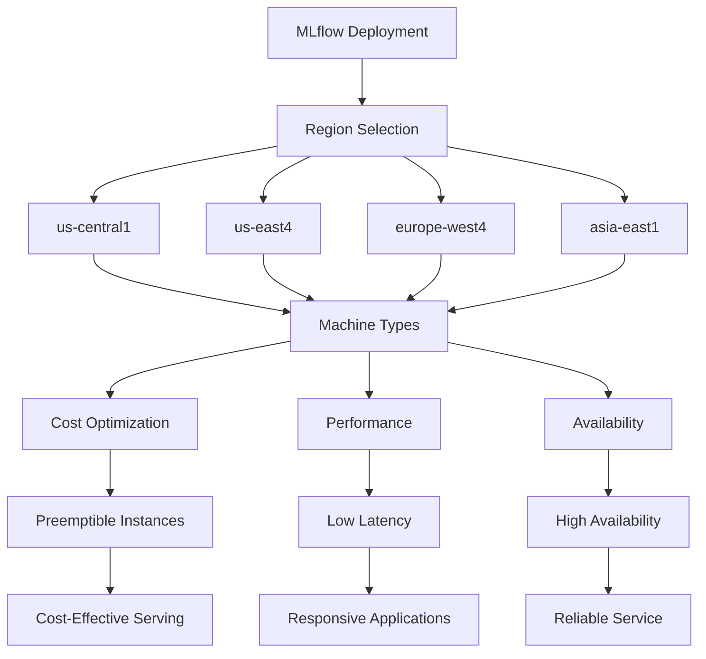
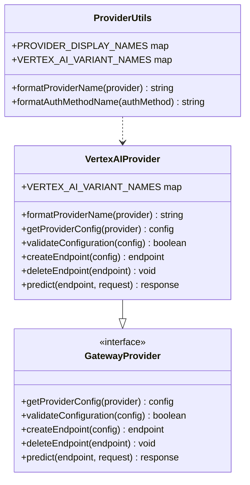

# Google Cloud Integration

<cite>
**Referenced Files in This Document**   
- [gcs_artifact_repo.py](file://mlflow/store/artifact/gcs_artifact_repo.py)
- [providers.py](file://mlflow/utils/providers.py)
- [google_adk.py](file://mlflow/tracing/otel/translation/google_adk.py)
- [providerUtils.ts](file://mlflow/server/js/src/gateway/utils/providerUtils.ts)
- [model_registry.proto](file://mlflow/protos/model_registry.proto)
- [model_registry_pb2.py](file://mlflow/protos/model_registry_pb2.py)
</cite>

## Table of Contents
1. [Introduction](#introduction)
2. [Google Cloud Storage Integration](#google-cloud-storage-integration)
3. [Vertex AI Deployment Configuration](#vertex-ai-deployment-configuration)
4. [Authentication and Service Account Management](#authentication-and-service-account-management)
5. [Model Registry and Deployment State](#model-registry-and-deployment-state)
6. [Regional Configuration and Endpoint Management](#regional-configuration-and-endpoint-management)
7. [Integration with MLflow Gateway](#integration-with-mlflow-gateway)
8. [Best Practices for Google Cloud Integration](#best-practices-for-google-cloud-integration)

## Introduction
MLflow provides comprehensive integration capabilities with Google Cloud Platform (GCP), enabling seamless model deployment to Vertex AI, artifact storage in Google Cloud Storage (GCS), and secure authentication through service accounts. This documentation details the implementation of MLflow's Google Cloud integration, focusing on Vertex AI deployment capabilities, GCS artifact repositories, and the configuration parameters that enable efficient model serving in GCP environments. The integration leverages MLflow's plugin architecture to support Google Cloud services while maintaining compatibility with the broader MLflow ecosystem.

## Google Cloud Storage Integration
MLflow integrates with Google Cloud Storage (GCS) through the `GCSArtifactRepository` class, which enables secure storage and retrieval of model artifacts. The integration supports both authenticated and anonymous access to GCS buckets, with configurable chunk sizes for upload and download operations.

The GCS artifact repository handles credential management through the `credential_refresh_def` parameter, which allows for dynamic credential refreshing during long-running operations. This is particularly important for large model deployments where credentials may expire during the upload process. The repository also supports multipart uploads for large files, ensuring reliable transfer of model artifacts.

**Diagram sources**
- [gcs_artifact_repo.py](file://mlflow/store/artifact/gcs_artifact_repo.py#L36-L301)

**Section sources**
- [gcs_artifact_repo.py](file://mlflow/store/artifact/gcs_artifact_repo.py#L1-L301)

## Vertex AI Deployment Configuration
MLflow's integration with Vertex AI is configured through the deployment plugin system, which allows for target-specific configuration parameters. The Vertex AI deployment target supports service account-based authentication, project identification, and regional configuration.

The deployment configuration includes parameters for specifying the GCP project ID, region, and service account credentials. These parameters are defined in the providers configuration and are validated during deployment creation. The integration supports both direct model deployment and deployment through the MLflow Gateway, enabling flexible deployment patterns based on organizational requirements.

**Diagram sources**
- [providers.py](file://mlflow/utils/providers.py#L212-L237)

**Section sources**
- [providers.py](file://mlflow/utils/providers.py#L212-L237)

## Authentication and Service Account Management
MLflow supports Google Cloud authentication through service account JSON credentials, which are securely managed within the deployment configuration. The authentication system is designed to handle credential refresh for long-running operations, ensuring that deployments can complete successfully even when credentials expire.

The service account configuration requires the JSON key file contents, which contain the private key and other authentication information. This approach provides fine-grained access control through IAM policies, allowing organizations to implement least-privilege security practices. The credentials are marked as secret in the configuration, ensuring they are not exposed in logs or configuration files.

**Diagram sources**
- [providers.py](file://mlflow/utils/providers.py#L213-L222)

**Section sources**
- [providers.py](file://mlflow/utils/providers.py#L212-L237)

## Model Registry and Deployment State
MLflow's model registry integration with Vertex AI includes tracking of deployment job state, which provides visibility into the deployment process. The model version deployment job state is stored as part of the model version metadata, allowing users to monitor the status of deployments.

The deployment job state includes information about the current state of the deployment process, such as pending, running, or completed. This information is used to provide feedback during deployment operations and to support troubleshooting when deployments fail. The integration also supports connection state tracking, which indicates whether the deployment job is properly configured and accessible.

**Diagram sources**
- [model_registry.proto](file://mlflow/protos/model_registry.proto#L481-L482)
- [model_registry_pb2.py](file://mlflow/protos/model_registry_pb2.py#L347-L348)

**Section sources**
- [model_registry.proto](file://mlflow/protos/model_registry.proto#L456-L496)
- [model_registry_pb2.py](file://mlflow/protos/model_registry_pb2.py#L211-L360)

## Regional Configuration and Endpoint Management
MLflow's Vertex AI integration supports regional configuration, allowing deployments to be targeted to specific GCP regions. The default region is us-central1, but users can specify alternative regions based on their requirements for latency, data residency, or service availability.

The regional configuration is important for optimizing performance and complying with data governance requirements. Different regions may have different machine types available, which affects the cost and performance of deployed models. The integration also supports network peering configurations, enabling secure connectivity between Vertex AI endpoints and other resources in a VPC network.

**Diagram sources**
- [providers.py](file://mlflow/utils/providers.py#L230-L236)

**Section sources**
- [providers.py](file://mlflow/utils/providers.py#L212-L237)

## Integration with MLflow Gateway
MLflow Gateway provides an additional layer of integration with Vertex AI, enabling proxy-based access to deployed models. The gateway supports Vertex AI as a provider, allowing users to configure endpoints that route requests to Vertex AI models.

The gateway integration includes support for various Vertex AI model types, including text, chat, embedding, and vision models. Each model type is represented as a variant in the provider configuration, allowing for specialized configuration and routing. This enables organizations to deploy multiple model types through a unified gateway interface.

**Diagram sources**
- [providerUtils.ts](file://mlflow/server/js/src/gateway/utils/providerUtils.ts#L86-L121)
- [google_adk.py](file://mlflow/tracing/otel/translation/google_adk.py#L13-L14)

**Section sources**
- [providerUtils.ts](file://mlflow/server/js/src/gateway/utils/providerUtils.ts#L83-L130)
- [google_adk.py](file://mlflow/tracing/otel/translation/google_adk.py#L1-L14)

## Best Practices for Google Cloud Integration
When integrating MLflow with Google Cloud, several best practices should be followed to ensure secure, reliable, and cost-effective deployments:

1. **Service Account Management**: Use dedicated service accounts with least-privilege permissions for MLflow deployments. Regularly rotate service account keys and monitor their usage.

2. **Regional Selection**: Choose regions based on data residency requirements, latency needs, and available machine types. Consider using regions with preemptible instances for cost optimization.

3. **Artifact Storage**: Use GCS for artifact storage with appropriate storage classes based on access patterns. Implement lifecycle policies to manage storage costs.

4. **Network Configuration**: Configure VPC peering or Private Service Connect for secure connectivity between MLflow and Vertex AI endpoints.

5. **Monitoring and Logging**: Enable Cloud Logging and Cloud Monitoring for deployed models to track performance, errors, and usage patterns.

6. **Cost Optimization**: Use appropriate machine types and consider preemptible instances for non-critical workloads. Monitor usage and set budget alerts.

7. **Security**: Enable IAM auditing and regularly review access permissions. Use VPC Service Controls to protect against data exfiltration.

8. **Deployment Strategies**: Implement canary deployments and blue-green deployment patterns to minimize risk during model updates.

These practices ensure that MLflow deployments on Google Cloud are secure, reliable, and cost-effective while maintaining compliance with organizational policies and regulatory requirements.

**Section sources**
- [providers.py](file://mlflow/utils/providers.py#L212-L237)
- [gcs_artifact_repo.py](file://mlflow/store/artifact/gcs_artifact_repo.py#L1-L301)
- [providerUtils.ts](file://mlflow/server/js/src/gateway/utils/providerUtils.ts#L83-L130)