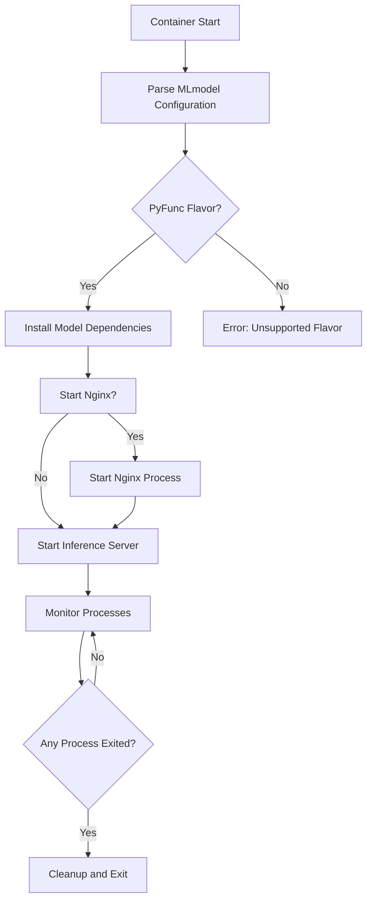
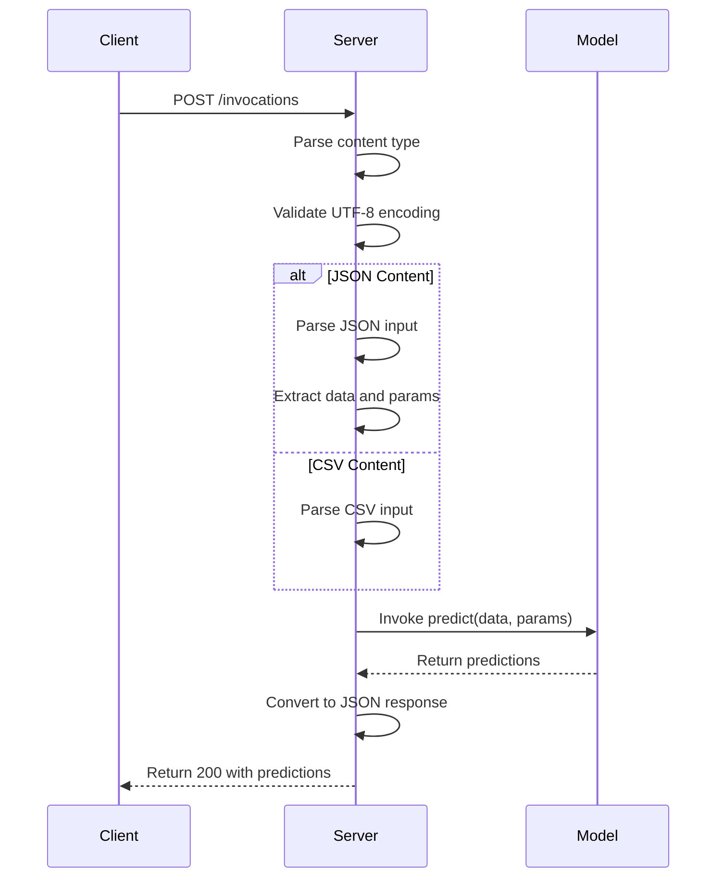
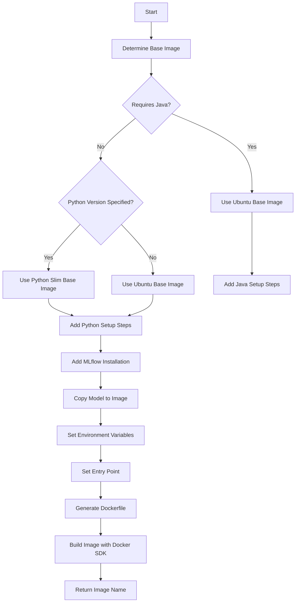
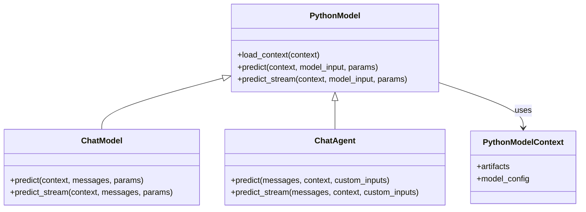

# Containerization

<cite>
**Referenced Files in This Document**   
- [mlflow/models/container/__init__.py](file://mlflow/models/container/__init__.py)
- [mlflow/pyfunc/backend.py](file://mlflow/pyfunc/backend.py)
- [mlflow/models/docker_utils.py](file://mlflow/models/docker_utils.py)
- [mlflow/pyfunc/scoring_server/__init__.py](file://mlflow/pyfunc/scoring_server/__init__.py)
- [mlflow/pyfunc/model.py](file://mlflow/pyfunc/model.py)
- [examples/docker/README.rst](file://examples/docker/README.rst)
- [examples/docker/Dockerfile](file://examples/docker/Dockerfile)
- [mlflow/sagemaker/__init__.py](file://mlflow/sagemaker/__init__.py)
- [mlflow/projects/docker.py](file://mlflow/projects/docker.py)
</cite>

## Table of Contents
1. [Introduction](#introduction)
2. [Container Lifecycle](#container-lifecycle)
3. [Scoring Server Implementation](#scoring-server-implementation)
4. [Docker Image Generation](#docker-image-generation)
5. [Model Flavors and PyFunc Integration](#model-flavors-and-pyfunc-integration)
6. [Configuration and Environment Management](#configuration-and-environment-management)
7. [Security Considerations](#security-considerations)
8. [Common Issues and Troubleshooting](#common-issues-and-troubleshooting)

## Introduction
MLflow provides a comprehensive containerization framework for packaging and deploying machine learning models. The system enables models to be packaged into Docker containers with all necessary dependencies, creating portable and reproducible deployment artifacts. This documentation details the implementation of MLflow's containerization capabilities, focusing on how models are packaged, served, and managed throughout their lifecycle. The containerization system supports various model flavors through the pyfunc interface, allowing for consistent deployment patterns across different machine learning frameworks.

**Section sources**
- [mlflow/models/container/__init__.py](file://mlflow/models/container/__init__.py#L1-L304)
- [examples/docker/README.rst](file://examples/docker/README.rst#L1-L72)

## Container Lifecycle
The container lifecycle in MLflow follows a structured process from image creation to runtime execution. When a model is deployed, MLflow initializes the container environment by loading the MLmodel configuration and determining the appropriate serving strategy. The `_init` function in the container module serves as the entry point, handling commands like "serve" or "train" (though training is currently unimplemented). For serving, the `_serve` function reads the MLmodel configuration and delegates to `_serve_pyfunc` for pyfunc-flavored models.

The serving process involves several key steps: first, the model dependencies are installed into the appropriate environment (conda, virtualenv, or local); then, supporting services like nginx are optionally started; and finally, the inference server is launched. The container manages multiple processes and ensures proper cleanup when termination signals are received. The `_await_subprocess_exit_any` function monitors subprocesses and triggers cleanup via `_sigterm_handler` when any process exits.

**Diagram sources**
- [mlflow/models/container/__init__.py](file://mlflow/models/container/__init__.py#L51-L304)

**Section sources**
- [mlflow/models/container/__init__.py](file://mlflow/models/container/__init__.py#L51-L304)

## Scoring Server Implementation
The scoring server is responsible for handling prediction requests and generating responses. It exposes four primary endpoints: `/ping` and `/health` for health checks, `/version` for retrieving the MLflow version, and `/invocations` for scoring. The server uses FastAPI to handle HTTP requests and implements a middleware for request timeout handling based on the `MLFLOW_SCORING_SERVER_REQUEST_TIMEOUT` environment variable.

Request processing follows a structured flow: the server first parses the content type and validates that UTF-8 encoding is used. For JSON content, it parses the input according to the MLflow scoring protocol, supporting formats like `dataframe_records`, `dataframe_split`, `instances`, and `inputs`. The server distinguishes between traditional JSON format (wrapped with supported keys) and unified LLM input format (unwrapped JSON payload). After parsing, the server invokes the model's predict method, passing both data and parameters when supported.

Response generation converts raw predictions to JSON format, with special handling for numpy arrays through the `NumpyEncoder`. The server supports both wrapped responses (with a "predictions" key) and unwrapped responses for unified LLM format. Error handling is comprehensive, with specific exceptions for invalid input formats and model prediction failures, including detailed stack traces when appropriate.

**Diagram sources**
- [mlflow/pyfunc/scoring_server/__init__.py](file://mlflow/pyfunc/scoring_server/__init__.py#L1-L604)

**Section sources**
- [mlflow/pyfunc/scoring_server/__init__.py](file://mlflow/pyfunc/scoring_server/__init__.py#L1-L604)

## Docker Image Generation
MLflow generates Docker images through a systematic process that begins with determining the appropriate base image. The system selects between Ubuntu and Python slim base images based on the model's requirements, with Python slim images used when the model doesn't require Java and specifies a Python version. For models requiring Java (such as Spark, H2O, or John Snow Labs models), the Ubuntu base image is used to facilitate Java installation.

The Dockerfile generation process is handled by the `generate_dockerfile` function in the docker_utils module. This function creates a Dockerfile template that includes setup steps for Python environments (using either conda or pyenv/virtualenv), Java installation when needed, and MLflow installation. The generated Dockerfile copies the model to `/opt/ml/model` and sets environment variables like `MLFLOW_DISABLE_ENV_CREATION` and `ENABLE_MLSERVER`. The entrypoint executes the container initialization script with the appropriate environment manager.

Image building is performed using the Docker SDK for Python, with special handling for platform compatibility (particularly for Apple M1 users). The build process enforces AMD64 architecture to ensure compatibility across platforms. The `build_image_from_context` function executes the docker build command with appropriate platform options based on the Docker version.

**Diagram sources**
- [mlflow/models/docker_utils.py](file://mlflow/models/docker_utils.py#L79-L217)
- [mlflow/pyfunc/backend.py](file://mlflow/pyfunc/backend.py#L390-L458)

**Section sources**
- [mlflow/models/docker_utils.py](file://mlflow/models/docker_utils.py#L1-L217)
- [mlflow/pyfunc/backend.py](file://mlflow/pyfunc/backend.py#L365-L525)

## Model Flavors and PyFunc Integration
MLflow supports multiple model flavors through the pyfunc interface, which provides a unified API for model deployment. The pyfunc flavor acts as a wrapper that standardizes the interface across different machine learning frameworks. When a model is saved with a specific flavor (such as sklearn, tensorflow, or pytorch), MLflow also adds the pyfunc flavor to enable consistent deployment capabilities.

The integration between model flavors and pyfunc is managed through the `PyFuncBackend` class, which handles environment preparation, dependency installation, and model serving. The backend determines the appropriate environment manager (conda, virtualenv, or local) based on the model configuration. For models with flavor-specific requirements, such as LightGBM or PaddlePaddle which need libgomp1, the system automatically includes the necessary APT packages during image creation.

Custom pyfunc models can be created by subclassing the `PythonModel` class, which provides a standard interface with `predict` and optional `predict_stream` methods. The `PythonModelContext` class provides access to artifacts and model configuration during inference. For specialized use cases like LLMs, MLflow provides higher-level abstractions like `ChatModel` and `ChatAgent` that build upon the pyfunc foundation while providing domain-specific interfaces.

**Diagram sources**
- [mlflow/pyfunc/model.py](file://mlflow/pyfunc/model.py#L143-L800)

**Section sources**
- [mlflow/pyfunc/model.py](file://mlflow/pyfunc/model.py#L1-L800)
- [mlflow/pyfunc/backend.py](file://mlflow/pyfunc/backend.py#L67-L364)

## Configuration and Environment Management
MLflow's containerization system provides comprehensive configuration and environment management capabilities. The system supports multiple environment managers including conda, virtualenv, and local environments, with automatic selection based on the model's requirements. When using conda or virtualenv, the system creates isolated environments and installs model dependencies as specified in the model's configuration.

Environment variables play a crucial role in configuring container behavior. Key variables include `DISABLE_NGINX` to control nginx startup, `ENABLE_MLSERVER` to use MLServer instead of the default scoring server, and `SERVING_ENVIRONMENT` to specify the deployment target. The system also propagates proxy settings (http_proxy, https_proxy, no_proxy) from the host environment to support deployments in restricted network environments.

The model configuration is managed through the MLmodel file, which contains flavor-specific configurations and dependencies. The system supports both conda and pip-based dependency management, with special handling for requirements.txt files to ensure proper path resolution. For development and testing, the system can install MLflow from a local source directory specified by the `mlflow_home` parameter, enabling testing of unreleased features.

**Section sources**
- [mlflow/models/container/__init__.py](file://mlflow/models/container/__init__.py#L42-L46)
- [mlflow/sagemaker/__init__.py](file://mlflow/sagemaker/__init__.py#L1343-L1364)
- [mlflow/pyfunc/backend.py](file://mlflow/pyfunc/backend.py#L108-L165)

## Security Considerations
MLflow's containerization system incorporates several security measures to prevent common vulnerabilities. The system includes protection against command injection attacks by carefully handling package dependencies. When installing dependencies from requirements files, the system validates and sanitizes input to prevent execution of arbitrary commands. Tests verify that various command injection techniques (using semicolons, pipes, backticks, dollar-parens, and ampersands) are properly blocked.

The system uses safe subprocess execution practices, avoiding shell=True when possible and using list arguments instead of string commands to prevent shell injection. When paths are included in commands (such as requirements.txt), the system ensures proper path resolution to prevent directory traversal attacks. The container initialization process also includes security-focused steps like setting appropriate file permissions on the /opt/mlflow directory to support deployment to AWS Sagemaker Serverless Endpoints.

Dependency management includes validation of package names to prevent modification of legitimate package names that contain substrings like "requirements.txt". The system also provides warnings when there are mismatches between the model's declared dependencies and the current Python environment, helping to prevent dependency confusion issues.

**Section sources**
- [tests/models/test_container.py](file://tests/models/test_container.py#L1-L233)
- [mlflow/models/container/__init__.py](file://mlflow/models/container/__init__.py#L81-L121)
- [mlflow/utils/requirements_utils.py](file://mlflow/utils/requirements_utils.py#L680-L708)

## Common Issues and Troubleshooting
Several common issues may arise when using MLflow's containerization system. One frequent problem is dependency conflicts, where the model's declared dependencies are incompatible with the current Python environment. This can be diagnosed using `mlflow.pyfunc.get_model_dependencies` to examine the model's requirements and comparing them with the current environment.

Another common issue is related to environment manager selection. The system may fail to create appropriate environments when the specified environment manager is incompatible with the model configuration. For example, using the local environment manager with models that require isolated environments can lead to deployment failures. Ensuring the correct environment manager is specified (conda, virtualenv, or local) based on the deployment requirements can resolve these issues.

Network-related problems may occur when deploying behind proxies. The system supports proxy configuration through environment variables (http_proxy, https_proxy, no_proxy), but these must be properly set in both the build and runtime environments. For Docker builds, proxy settings may need to be passed through the build arguments.

Platform compatibility issues, particularly with Apple M1 processors, can be addressed by ensuring Docker Desktop is properly configured with Rosetta compatibility when needed. The system's enforcement of AMD64 architecture during Docker builds helps ensure cross-platform compatibility.

**Section sources**
- [docs/docs/classic-ml/model/dependencies/index.mdx](file://docs/docs/classic-ml/model/dependencies/index.mdx#L1-L22)
- [mlflow/utils/requirements_utils.py](file://mlflow/utils/requirements_utils.py#L680-L708)
- [examples/docker/README.rst](file://examples/docker/README.rst#L53-L58)