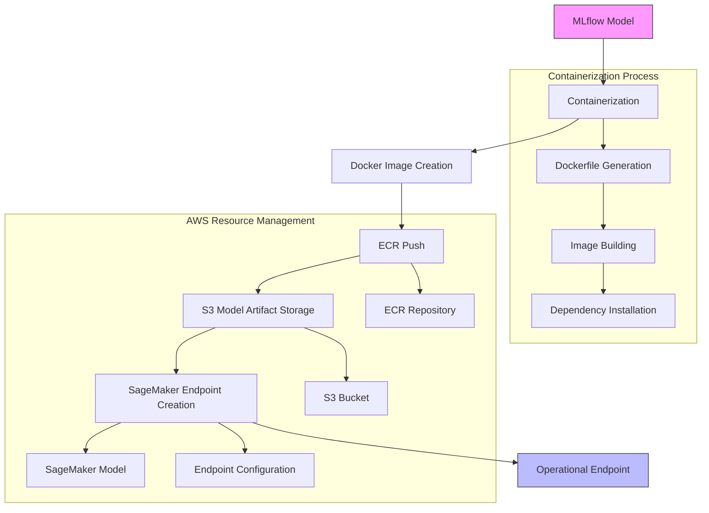
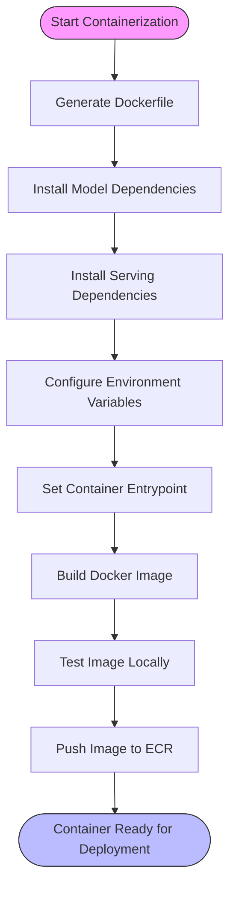
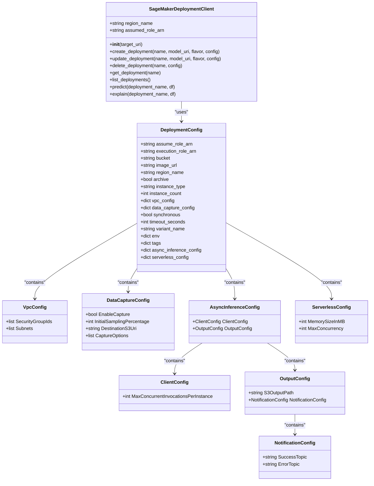
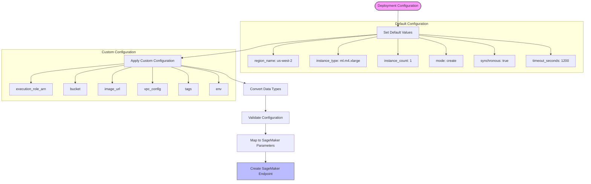
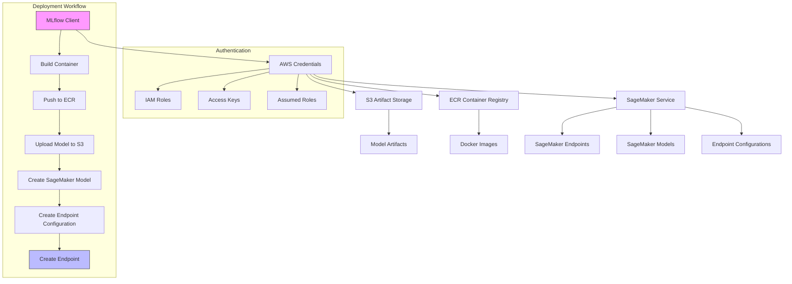
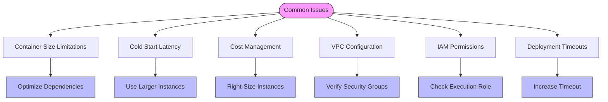

# Amazon SageMaker Deployment

<cite>
**Referenced Files in This Document**   
- [__init__.py](file://mlflow/sagemaker/__init__.py)
- [cli.py](file://mlflow/sagemaker/cli.py)
- [push_image_to_ecr.sh](file://mlflow/sagemaker/push_image_to_ecr.sh)
- [container/__init__.py](file://mlflow/models/container/__init__.py)
- [docker_utils.py](file://mlflow/models/docker_utils.py)
- [index.mdx](file://docs/docs/classic-ml/deployment/deploy-model-to-sagemaker/index.mdx)
</cite>

## Table of Contents
1. [Introduction](#introduction)
2. [Deployment Architecture](#deployment-architecture)
3. [Containerization Process](#containerization-process)
4. [Domain Model for SageMaker Deployment](#domain-model-for-sagemaker-deployment)
5. [Deployment Configuration and Parameters](#deployment-configuration-and-parameters)
6. [AWS Integration Components](#aws-integration-components)
7. [Common Issues and Troubleshooting](#common-issues-and-troubleshooting)
8. [Best Practices for Performance and Cost Efficiency](#best-practices-for-performance-and-cost-efficiency)
9. [Conclusion](#conclusion)

## Introduction

Amazon SageMaker deployment functionality in MLflow enables seamless deployment of ML models to AWS SageMaker endpoints. The integration automates the entire deployment process, from container creation to endpoint configuration, allowing data scientists and ML engineers to deploy models without deep AWS expertise. MLflow handles the complexity of creating Docker containers compatible with SageMaker's hosting services, managing S3 artifact storage, and configuring the necessary AWS resources.

The deployment process leverages SageMaker's Bring Your Own Container (BYOC) capability, allowing MLflow to package models into Docker containers that meet SageMaker's requirements for inference endpoints. This includes configuring web servers with specific REST endpoints, setting environment variables, and establishing proper container entrypoints. By automating these tasks, MLflow significantly reduces the deployment overhead and potential for configuration errors.

**Section sources**
- [__init__.py](file://mlflow/sagemaker/__init__.py#L1-L50)
- [index.mdx](file://docs/docs/classic-ml/deployment/deploy-model-to-sagemaker/index.mdx#L1-L25)

## Deployment Architecture

The MLflow SageMaker deployment architecture follows a systematic process that transforms MLflow models into fully operational SageMaker endpoints. The architecture consists of several interconnected components that work together to deploy models efficiently and reliably.

**Diagram sources **
- [__init__.py](file://mlflow/sagemaker/__init__.py#L174-L493)
- [docker_utils.py](file://mlflow/models/docker_utils.py#L79-L138)

**Section sources**
- [__init__.py](file://mlflow/sagemaker/__init__.py#L174-L493)
- [docker_utils.py](file://mlflow/models/docker_utils.py#L79-L138)

## Containerization Process

The containerization process is a critical component of MLflow's SageMaker deployment functionality. MLflow automatically generates Docker images from MLflow models, handling all the complexities of creating containers that are compatible with SageMaker's hosting services. This process begins with the generation of a Dockerfile that specifies the base image, dependencies, and entrypoint for the container.

The containerization process uses Ubuntu 22.04 as the base image and installs necessary dependencies including nginx for request routing and gunicorn for serving the model. The process also handles the installation of model-specific dependencies, which can be specified in conda environments or virtual environments. For PyFunc models, MLflow installs the required Python packages and ensures that the model can be loaded and served correctly.

The entrypoint for the container is configured to initialize the serving environment and start the inference server. This involves loading the MLflow model, setting up the serving configuration, and starting the web server that exposes the necessary REST endpoints. The container is designed to be stateless, allowing SageMaker to scale the endpoint horizontally by adding more instances as needed.

**Diagram sources **
- [docker_utils.py](file://mlflow/models/docker_utils.py#L79-L138)
- [container/__init__.py](file://mlflow/models/container/__init__.py#L51-L65)

**Section sources**
- [docker_utils.py](file://mlflow/models/docker_utils.py#L79-L138)
- [container/__init__.py](file://mlflow/models/container/__init__.py#L51-L65)

## Domain Model for SageMaker Deployment

The domain model for SageMaker deployment in MLflow consists of several key components that define the configuration and behavior of deployed models. These components work together to create a comprehensive deployment specification that can be translated into SageMaker-specific parameters.

**Diagram sources **
- [__init__.py](file://mlflow/sagemaker/__init__.py#L2030-L2631)
- [cli.py](file://mlflow/sagemaker/cli.py#L25-L337)

The SageMakerDeploymentClient class serves as the primary interface for deploying models to SageMaker. It encapsulates the AWS region and assumed role ARN, which are derived from the target URI. The client provides methods for creating, updating, deleting, and retrieving deployments, as well as making predictions and generating explanations.

The DeploymentConfig class defines the comprehensive set of parameters that can be specified when deploying a model. These parameters include the execution role ARN, which grants SageMaker permissions to access the Docker image and S3 bucket containing model artifacts. The configuration also specifies the instance type and count, which determine the compute resources allocated to the endpoint.

Additional configuration options include VPC configuration for deploying endpoints within a virtual private cloud, data capture configuration for monitoring model inputs and outputs, and environment variables for customizing the serving environment. The configuration also supports advanced features like asynchronous inference and serverless deployment, which can help optimize cost and performance.

**Section sources**
- [__init__.py](file://mlflow/sagemaker/__init__.py#L2030-L2631)
- [cli.py](file://mlflow/sagemaker/cli.py#L25-L337)

## Deployment Configuration and Parameters

The deployment configuration in MLflow's SageMaker integration translates directly to SageMaker-specific parameters, enabling fine-grained control over the deployment process. The configuration system supports both default values and customizable parameters, allowing users to balance ease of use with deployment flexibility.

**Diagram sources **
- [__init__.py](file://mlflow/sagemaker/__init__.py#L2098-L2149)
- [__init__.py](file://mlflow/sagemaker/__init__.py#L2150-L2623)

The configuration process begins with default values for key parameters such as the AWS region (us-west-2), instance type (ml.m4.xlarge), and instance count (1). These defaults can be overridden through the custom configuration, which accepts parameters as a dictionary. The system automatically converts string representations of integers and booleans to their proper types, enabling configuration through environment variables or command-line arguments.

When deploying a model, the configuration is translated into SageMaker API calls. The model artifacts are uploaded to an S3 bucket, and a Docker image is either pulled from ECR or built from scratch. The SageMaker model is created with the specified execution role, and an endpoint configuration is generated with the production variants defined by the instance type and count.

The deployment supports multiple modes: create (for new endpoints), replace (for updating existing endpoints), and add (for adding models to existing endpoints). The synchronous parameter controls whether the function blocks until deployment completes, while the timeout_seconds parameter specifies the maximum wait time for synchronous operations.

**Section sources**
- [__init__.py](file://mlflow/sagemaker/__init__.py#L2098-L2149)
- [__init__.py](file://mlflow/sagemaker/__init__.py#L2150-L2623)

## AWS Integration Components

MLflow's SageMaker deployment functionality integrates with several AWS services to provide a complete deployment solution. These integrations handle credential management, artifact storage, and resource provisioning, creating a seamless experience for users.

**Diagram sources **
- [__init__.py](file://mlflow/sagemaker/__init__.py#L118-L172)
- [__init__.py](file://mlflow/sagemaker/__init__.py#L361-L402)
- [push_image_to_ecr.sh](file://mlflow/sagemaker/push_image_to_ecr.sh#L1-L51)

The AWS integration begins with credential management, which supports multiple authentication methods including IAM roles, access keys, and assumed roles. The target URI syntax allows users to specify the AWS region and assumed role ARN, enabling cross-account deployments. When no explicit credentials are provided, the system uses the currently-assumed role from the AWS CLI configuration.

S3 is used for storing model artifacts, with MLflow automatically creating a default bucket name based on the region and account ID if no bucket is specified. The system handles the upload of model files to S3, ensuring they are accessible to SageMaker during endpoint creation. For enhanced security, the integration supports temporary credentials with scoped access, particularly when working with Unity Catalog in Databricks environments.

ECR serves as the container registry for Docker images. MLflow provides functionality to build and push images to ECR, handling the creation of repositories if they don't exist. The push_image_to_ecr function uses AWS CLI commands to authenticate with ECR and push the built image, ensuring it's available for SageMaker to pull during endpoint creation.

The integration with SageMaker service includes creating models, endpoint configurations, and endpoints. The system handles the creation of all necessary resources, with options to preserve or delete inactive resources based on the archive parameter. This comprehensive integration abstracts away the complexity of AWS service interactions, allowing users to focus on their models rather than infrastructure.

**Section sources**
- [__init__.py](file://mlflow/sagemaker/__init__.py#L118-L172)
- [__init__.py](file://mlflow/sagemaker/__init__.py#L361-L402)
- [push_image_to_ecr.sh](file://mlflow/sagemaker/push_image_to_ecr.sh#L1-L51)

## Common Issues and Troubleshooting

Deploying models to SageMaker using MLflow can encounter several common issues. Understanding these issues and their solutions is crucial for maintaining reliable deployments and minimizing downtime.

**Diagram sources **
- [__init__.py](file://mlflow/sagemaker/__init__.py#L364-L370)
- [__init__.py](file://mlflow/sagemaker/__init__.py#L533-L540)
- [__init__.py](file://mlflow/sagemaker/__init__.py#L730-L738)

Container size limitations are a common issue, as SageMaker has constraints on the size of Docker images and model artifacts. Large containers can lead to slow deployment times and potential timeouts. To address this, MLflow provides options to minimize dependencies and optimize the container size. Users should carefully manage their model dependencies, removing unnecessary packages and using lightweight base images when possible.

Cold start latency occurs when a new instance is launched to handle increased traffic, resulting in a delay before the model becomes available. This is particularly noticeable with large models or complex initialization processes. To mitigate cold start latency, users can deploy with larger instance types that have more memory and CPU, or maintain a minimum number of instances even during low-traffic periods.

Cost management is critical when deploying models to SageMaker, as costs can escalate quickly with high-traffic models or inefficient configurations. Users should right-size their instances based on actual performance requirements and consider using spot instances for non-critical workloads. Monitoring tools and cost alerts can help identify and address unexpected cost increases.

VPC configuration issues can prevent endpoints from being created or accessed properly. Common problems include incorrect security group rules, subnet configurations, or network ACLs. When deploying to a VPC, users must ensure that the specified security groups allow inbound traffic on the necessary ports and that the subnets have sufficient IP addresses available.

IAM permissions are another frequent source of deployment failures. The execution role must have permissions to access the ECR repository, S3 bucket, and SageMaker service. Users should verify that the role has the necessary policies attached and that there are no explicit deny rules that could override the permissions.

Deployment timeouts can occur when the deployment process takes longer than the specified timeout period. This is common with large models or during periods of high AWS resource demand. Users can increase the timeout period or deploy asynchronously to avoid blocking operations while the deployment completes.

**Section sources**
- [__init__.py](file://mlflow/sagemaker/__init__.py#L364-L370)
- [__init__.py](file://mlflow/sagemaker/__init__.py#L533-L540)
- [__init__.py](file://mlflow/sagemaker/__init__.py#L730-L738)

## Best Practices for Performance and Cost Efficiency

Optimizing SageMaker deployments for performance and cost efficiency requires careful consideration of several factors. By following best practices, users can achieve optimal model serving while minimizing operational costs.

```mermaid
graph TD
BestPracticesStart([Best Practices]) --> InstanceSelection["Instance Selection"]
BestPracticesStart --> AutoScaling["Auto Scaling"]
BestPracticesStart --> ModelOptimization["Model Optimization"]
BestPracticesStart --> Monitoring["Monitoring and Alerting"]
BestPracticesStart --> CostControls["Cost Controls"]
BestPracticesStart --> DeploymentStrategy["Deployment Strategy"]
InstanceSelection --> RightSizing["Right-Size Instances"]
InstanceSelection --> GPU["Use GPU Instances for Deep Learning"]
InstanceSelection --> Serverless["Consider Serverless for Variable Workloads"]
AutoScaling --> MinInstances["Set Minimum Instances"]
AutoScaling --> MaxInstances["Set Maximum Instances"]
AutoScaling --> ScalingPolicies["Configure Scaling Policies"]
ModelOptimization --> Quantization["Model Quantization"]
ModelOptimization --> Pruning["Model Pruning"]
ModelOptimization --> Caching["Implement Caching"]
Monitoring --> Metrics["Monitor Key Metrics"]
Monitoring --> Alerts["Set Up Alerts"]
Monitoring --> Logging["Enable Detailed Logging"]
CostControls --> Budgets["Set Cost Budgets"]
CostControls --> SpotInstances["Use Spot Instances"]
CostControls --> Cleanup["Automate Resource Cleanup"]
DeploymentStrategy --> BlueGreen["Blue/Green Deployments"]
DeploymentStrategy --> Canary["Canary Deployments"]
DeploymentStrategy --> Testing["Thorough Pre-Deployment Testing"]
style BestPracticesStart fill:#f9f,stroke:#333
style RightSizing fill:#bbf,stroke:#333
style GPU fill:#bbf,stroke:#333
style Serverless fill:#bbf,stroke:#333
style MinInstances fill:#bbf,stroke:#333
style MaxInstances fill:#bbf,stroke:#333
style ScalingPolicies fill:#bbf,stroke:#333
style Quantization fill:#bbf,stroke:#333
style Pruning fill:#bbf,stroke:#333
style Caching fill:#bbf,stroke:#333
style Metrics fill:#bbf,stroke:#333
style Alerts fill:#bbf,stroke:#333
style Logging fill:#bbf,stroke:#333
style Budgets fill:#bbf,stroke:#333
style SpotInstances fill:#bbf,stroke:#333
style Cleanup fill:#bbf,stroke:#333
style BlueGreen fill:#bbf,stroke:#333
style Canary fill:#bbf,stroke:#333
style Testing fill:#bbf,stroke:#333
```

**Diagram sources **
- [__init__.py](file://mlflow/sagemaker/__init__.py#L2106-L2108)
- [__init__.py](file://mlflow/sagemaker/__init__.py#L2110-L2111)
- [__init__.py](file://mlflow/sagemaker/__init__.py#L2116-L2117)

Instance selection is critical for balancing performance and cost. Users should right-size instances based on their model's resource requirements, starting with smaller instances and scaling up only when necessary. For deep learning models, GPU instances can provide significant performance improvements, while serverless options may be more cost-effective for workloads with variable traffic patterns.

Auto scaling should be configured to handle traffic fluctuations efficiently. Setting appropriate minimum and maximum instance counts ensures that the endpoint can handle baseline traffic while scaling up during peak periods. Scaling policies should be based on key metrics such as CPU utilization, memory usage, and request latency to ensure responsive scaling behavior.

Model optimization techniques like quantization and pruning can significantly reduce model size and inference time without substantially impacting accuracy. These optimizations can lead to smaller container sizes, faster cold starts, and reduced memory requirements, all contributing to better performance and lower costs.

Monitoring and alerting are essential for maintaining optimal performance. Key metrics such as invocation count, latency, error rates, and resource utilization should be monitored continuously. Alerts should be set up for abnormal conditions, allowing for proactive intervention before issues impact users.

Cost controls should include setting budgets and using cost allocation tags to track spending by project or team. Spot instances can be used for non-critical workloads to achieve significant cost savings. Automated cleanup policies should be implemented to remove unused resources and prevent cost creep.

Deployment strategies like blue/green and canary deployments can minimize risk when updating models. These approaches allow for gradual rollout and easy rollback if issues are detected. Thorough pre-deployment testing, including load testing and performance benchmarking, helps identify potential issues before they impact production.

**Section sources**
- [__init__.py](file://mlflow/sagemaker/__init__.py#L2106-L2108)
- [__init__.py](file://mlflow/sagemaker/__init__.py#L2110-L2111)
- [__init__.py](file://mlflow/sagemaker/__init__.py#L2116-L2117)

## Conclusion

MLflow's SageMaker deployment functionality provides a comprehensive solution for deploying machine learning models to AWS SageMaker. By automating the containerization process, managing AWS resources, and providing a simple interface for deployment operations, MLflow significantly reduces the complexity of serving models in production environments.

The integration handles the entire deployment lifecycle, from building Docker containers to creating and managing SageMaker endpoints. It supports advanced features like VPC deployment, data capture, and asynchronous inference, while providing sensible defaults that make it accessible to users with varying levels of AWS expertise.

By following best practices for performance and cost efficiency, users can optimize their deployments to achieve the right balance between responsiveness and operational costs. The comprehensive troubleshooting guidance helps address common issues, ensuring reliable model serving.

As machine learning continues to play a critical role in business applications, tools like MLflow's SageMaker integration will become increasingly important for bridging the gap between model development and production deployment. By standardizing the deployment process and abstracting away infrastructure complexity, MLflow enables data scientists and ML engineers to focus on what they do best: creating valuable models that drive business outcomes.

[No sources needed since this section summarizes without analyzing specific files]