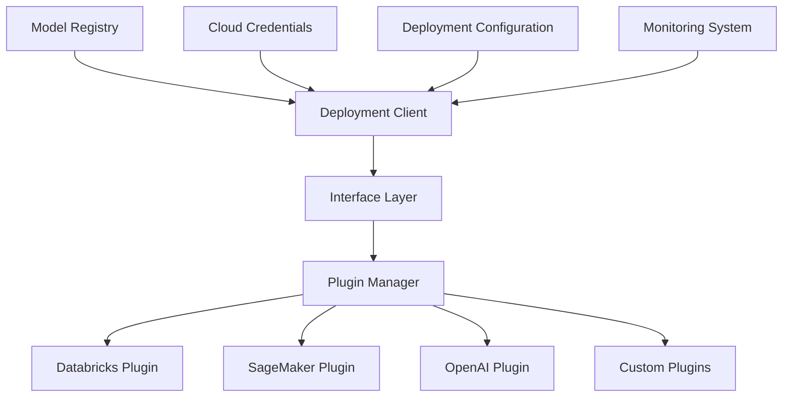
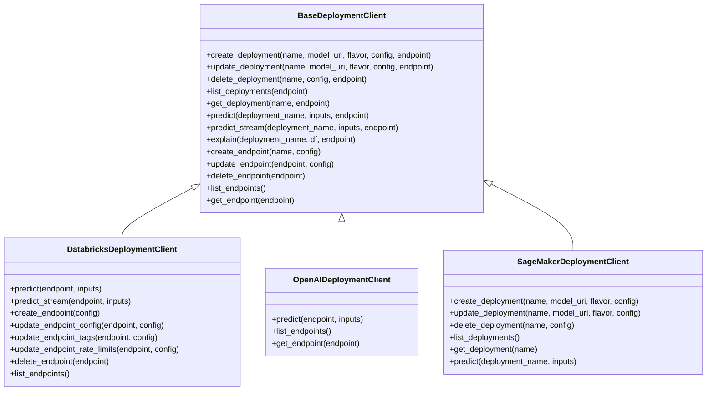
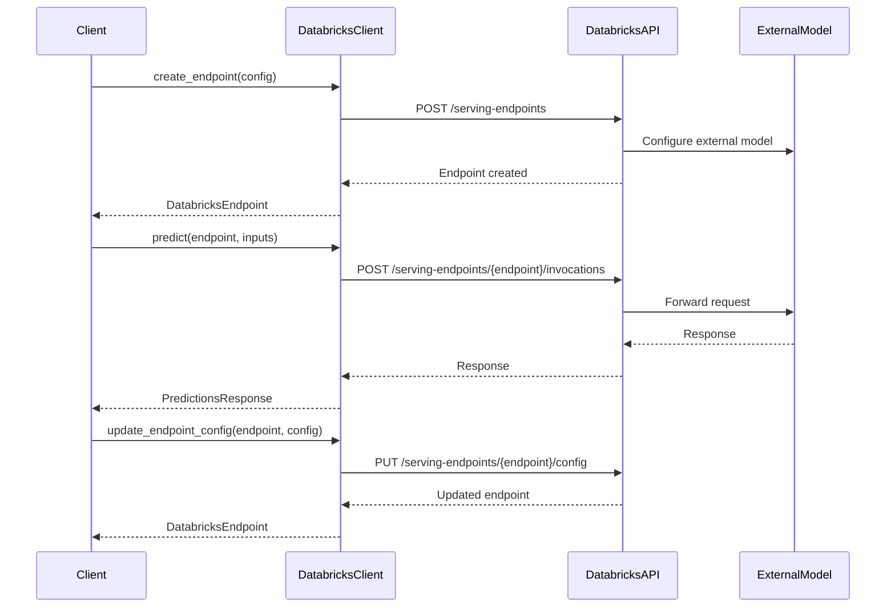
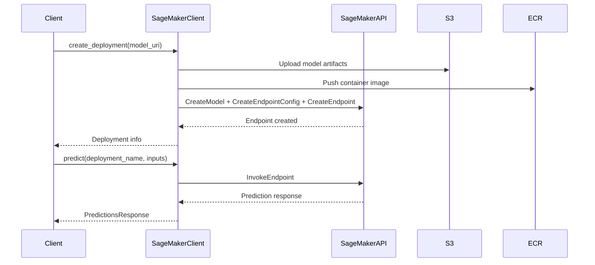
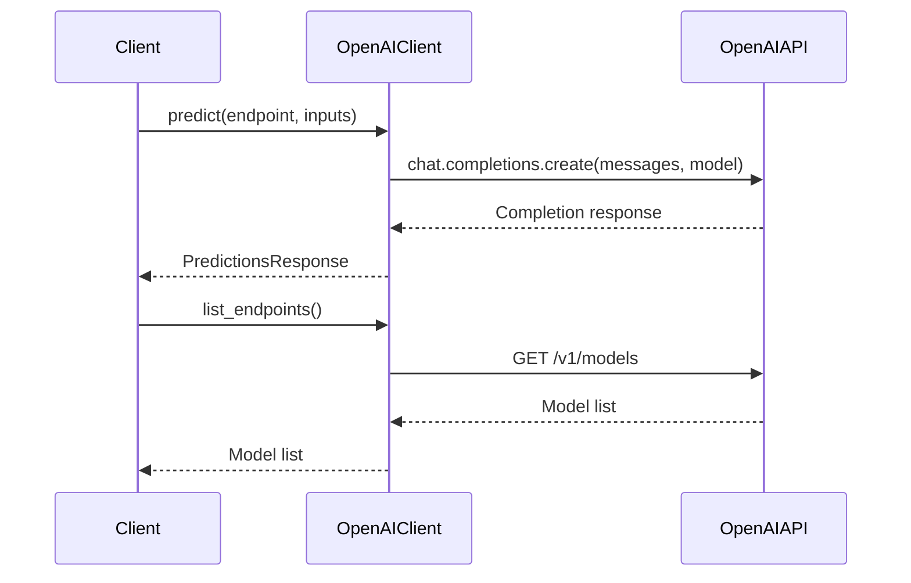
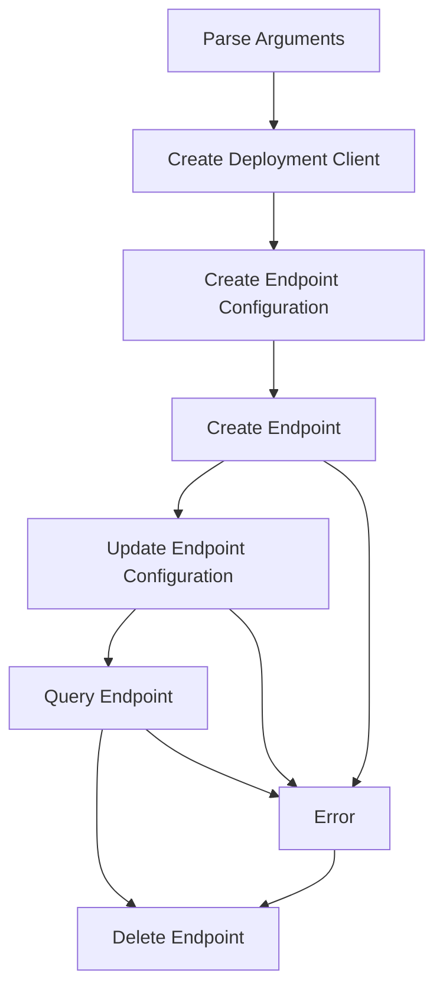
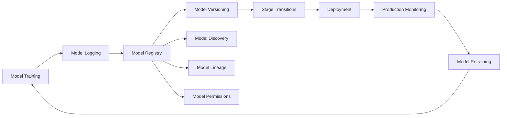

# Cloud Deployment

<cite>
**Referenced Files in This Document**   
- [mlflow/deployments/__init__.py](file://mlflow/deployments/__init__.py)
- [mlflow/deployments/base.py](file://mlflow/deployments/base.py)
- [mlflow/deployments/interface.py](file://mlflow/deployments/interface.py)
- [mlflow/deployments/databricks/__init__.py](file://mlflow/deployments/databricks/__init__.py)
- [mlflow/deployments/openai/__init__.py](file://mlflow/deployments/openai/__init__.py)
- [mlflow/sagemaker/__init__.py](file://mlflow/sagemaker/__init__.py)
- [mlflow/environment_variables.py](file://mlflow/environment_variables.py)
- [examples/deployments/databricks/databricks.py](file://examples/deployments/databricks/databricks.py)
- [examples/gateway/openai/example.py](file://examples/gateway/openai/example.py)
</cite>

## Table of Contents
1. [Introduction](#introduction)
2. [Core Architecture](#core-architecture)
3. [Standardized Deployment Interface](#standardized-deployment-interface)
4. [Cloud-Specific Deployment Plugins](#cloud-specific-deployment-plugins)
5. [Domain Model for Cloud Deployment](#domain-model-for-cloud-deployment)
6. [Implementation Examples](#implementation-examples)
7. [Integration with Model Registry](#integration-with-model-registry)
8. [Common Issues and Troubleshooting](#common-issues-and-troubleshooting)
9. [Best Practices](#best-practices)
10. [Conclusion](#conclusion)

## Introduction

MLflow provides a comprehensive framework for deploying machine learning models to various cloud platforms through a standardized interface. This document details the implementation of cloud-based model deployment in MLflow, focusing on integration with major cloud platforms including Databricks, Amazon SageMaker, and OpenAI-compatible services. The system is designed to abstract platform-specific complexities while providing consistent APIs for model deployment, management, and inference.

The deployment architecture leverages a plugin-based system that translates standardized deployment operations into platform-specific implementations. This approach enables organizations to maintain consistent deployment workflows across different cloud environments while taking advantage of platform-specific features and optimizations.

**Section sources**
- [mlflow/deployments/__init__.py](file://mlflow/deployments/__init__.py#L1-L120)
- [mlflow/deployments/base.py](file://mlflow/deployments/base.py#L1-L359)

## Core Architecture

The MLflow deployment system follows a modular architecture centered around a standardized interface with pluggable implementations for different cloud platforms. The core components include:



**Diagram sources**
- [mlflow/deployments/interface.py](file://mlflow/deployments/interface.py#L1-L103)
- [mlflow/deployments/base.py](file://mlflow/deployments/base.py#L1-L359)

The architecture consists of several key layers:

1. **Client Interface**: Provides a consistent API for deployment operations regardless of the target platform
2. **Plugin Manager**: Dynamically loads and manages deployment plugins based on the target URI
3. **Platform-Specific Plugins**: Implement the standardized interface for specific cloud platforms
4. **Configuration System**: Manages deployment parameters, authentication, and platform-specific settings
5. **Monitoring and Logging**: Tracks deployment status, performance metrics, and error conditions

This layered approach enables seamless integration with multiple cloud providers while maintaining a consistent user experience and operational model.

**Section sources**
- [mlflow/deployments/interface.py](file://mlflow/deployments/interface.py#L1-L103)
- [mlflow/deployments/plugin_manager.py](file://mlflow/deployments/plugin_manager.py)

## Standardized Deployment Interface

MLflow provides a standardized deployment interface that abstracts platform-specific details and enables consistent deployment operations across different cloud environments. The core interface is defined by the `BaseDeploymentClient` class, which specifies the contract for all deployment plugins.



**Diagram sources**
- [mlflow/deployments/base.py](file://mlflow/deployments/base.py#L76-L359)
- [mlflow/deployments/databricks/__init__.py](file://mlflow/deployments/databricks/__init__.py#L48-L852)
- [mlflow/deployments/openai/__init__.py](file://mlflow/deployments/openai/__init__.py#L14-L253)
- [mlflow/sagemaker/__init__.py](file://mlflow/sagemaker/__init__.py)

The standardized interface includes operations for:

- **Deployment Management**: Create, update, delete, and list deployments
- **Inference**: Synchronous and streaming prediction capabilities
- **Model Explanation**: Generate feature importance and model interpretation
- **Endpoint Management**: Create and manage serving endpoints (where supported)
- **Monitoring**: Retrieve deployment status and metadata

The interface is designed to be extensible, allowing platform-specific plugins to implement only the operations that are relevant to their capabilities while maintaining consistency in the core deployment workflow.

**Section sources**
- [mlflow/deployments/base.py](file://mlflow/deployments/base.py#L76-L359)
- [mlflow/deployments/interface.py](file://mlflow/deployments/interface.py#L15-L85)

## Cloud-Specific Deployment Plugins

MLflow implements cloud-specific deployment plugins that translate the standardized deployment interface into platform-specific operations. Each plugin is responsible for handling the unique requirements, APIs, and capabilities of its target platform.

### Databricks Plugin

The Databricks deployment plugin provides integration with Databricks Model Serving endpoints, enabling deployment of models to Databricks-managed infrastructure. The plugin focuses on endpoint management and inference operations rather than individual deployment management.



**Diagram sources**
- [mlflow/deployments/databricks/__init__.py](file://mlflow/deployments/databricks/__init__.py#L48-L852)

Key features of the Databricks plugin:
- Integration with Databricks Model Serving endpoints
- Support for external models (OpenAI, etc.) via endpoint configuration
- Rate limiting and traffic management capabilities
- Tag-based organization and filtering
- Streaming inference support for LLM applications

### Amazon SageMaker Plugin

The SageMaker plugin enables deployment of MLflow models to Amazon SageMaker endpoints, leveraging SageMaker's managed infrastructure for model serving.



**Diagram sources**
- [mlflow/sagemaker/__init__.py](file://mlflow/sagemaker/__init__.py)

Key features of the SageMaker plugin:
- Automatic containerization of MLflow models
- Integration with S3 for model artifact storage
- ECR integration for container image management
- Support for various instance types and scaling configurations
- VPC and network configuration options

### OpenAI Plugin

The OpenAI plugin provides a simplified interface for interacting with OpenAI-compatible endpoints, focusing on inference operations rather than model deployment.



**Diagram sources**
- [mlflow/deployments/openai/__init__.py](file://mlflow/deployments/openai/__init__.py#L14-L253)

Key features of the OpenAI plugin:
- Direct integration with OpenAI API endpoints
- Support for chat completions, embeddings, and other OpenAI services
- Azure OpenAI support through configuration
- Model listing and discovery capabilities

**Section sources**
- [mlflow/deployments/databricks/__init__.py](file://mlflow/deployments/databricks/__init__.py#L48-L852)
- [mlflow/sagemaker/__init__.py](file://mlflow/sagemaker/__init__.py)
- [mlflow/deployments/openai/__init__.py](file://mlflow/deployments/openai/__init__.py#L14-L253)

## Domain Model for Cloud Deployment

The cloud deployment system in MLflow is built around a comprehensive domain model that captures the essential concepts and relationships for model deployment across different cloud platforms.

```mermaid
erDiagram
DEPLOYMENT_CLIENT ||--o{ DEPLOYMENT : "manages"
DEPLOYMENT_CLIENT ||--o{ ENDPOINT : "manages"
DEPLOYMENT_CLIENT }|-- DEPLOYMENT_PLUGIN : "uses"
DEPLOYMENT_PLUGIN }|-- CLOUD_PROVIDER : "targets"
MODEL_REGISTRY ||--o{ MODEL_VERSION : "contains"
MODEL_VERSION }|-- DEPLOYMENT : "deployed_as"
DEPLOYMENT }|-- ENDPOINT : "belongs_to"
ENDPOINT }|-- COMPUTE_SPEC : "uses"
ENDPOINT }|-- SCALING_POLICY : "follows"
ENDPOINT }|-- AUTHENTICATION : "requires"
ENDPOINT }|-- NETWORK_CONFIG : "configured_with"
DEPLOYMENT_CLIENT {
string target_uri
string client_type
}
DEPLOYMENT_PLUGIN {
string plugin_name
string version
string supported_operations
}
CLOUD_PROVIDER {
string provider_name
string region
string account_id
}
DEPLOYMENT {
string deployment_name
string model_uri
string model_flavor
string status
datetime created_at
datetime updated_at
}
ENDPOINT {
string endpoint_name
string endpoint_type
string state
datetime created_at
datetime updated_at
}
COMPUTE_SPEC {
string instance_type
int instance_count
string accelerator_type
int memory_mb
int cpu_cores
}
SCALING_POLICY {
string policy_type
int min_instances
int max_instances
string scaling_metric
float target_value
}
AUTHENTICATION {
string auth_type
string credential_source
datetime expiration
}
NETWORK_CONFIG {
string vpc_id
string subnet_ids
string security_groups
bool public_access
string private_link
}
MODEL_REGISTRY {
string registry_uri
string organization
}
MODEL_VERSION {
string model_name
string version
string source_run
string user_id
datetime creation_timestamp
}
```

**Diagram sources**
- [mlflow/deployments/base.py](file://mlflow/deployments/base.py#L76-L359)
- [mlflow/deployments/databricks/__init__.py](file://mlflow/deployments/databricks/__init__.py#L48-L852)
- [mlflow/sagemaker/__init__.py](file://mlflow/sagemaker/__init__.py)
- [mlflow/entities/model_registry.py](file://mlflow/entities/model_registry.py)

### Authentication Requirements

Cloud deployment configurations must include appropriate authentication mechanisms for accessing cloud resources:

| Authentication Type | Configuration Parameters | Scope | Example |
|-------------------|-------------------------|-------|---------|
| Access Key | access_key_id, secret_access_key | AWS, GCP, Azure | IAM credentials for AWS |
| Service Principal | client_id, client_secret, tenant_id | Azure | Azure AD application |
| API Key | api_key | OpenAI, Anthropic | OpenAI API key |
| OAuth 2.0 | token, refresh_token, scopes | Various | Google Cloud OAuth |
| Databricks Token | host, token | Databricks | Databricks personal access token |
| Secret Reference | secret_scope, secret_key | Databricks | {{secrets/scope/key}} |

Authentication credentials can be specified directly in configuration or referenced from secure secret stores. The system supports environment variable injection and secure credential management to prevent exposure of sensitive information.

### Compute Specifications

Deployment configurations include detailed compute specifications that define the infrastructure requirements for model serving:

| Parameter | Description | Default | Platform Support |
|---------|-------------|---------|----------------|
| instance_type | Machine type for deployment | ml.m4.xlarge | SageMaker, Databricks |
| instance_count | Number of instances | 1 | SageMaker, Databricks |
| accelerator_type | GPU/TPU type | None | SageMaker, Databricks |
| memory_mb | Memory allocation | Platform default | SageMaker |
| cpu_cores | CPU core allocation | Platform default | SageMaker |
| container_image | Custom container | MLflow default | SageMaker |

Compute specifications are translated into platform-specific configurations, such as EC2 instance types for SageMaker or cluster configurations for Databricks.

### Scaling Policies

The deployment system supports various scaling policies to optimize cost and performance:

| Policy Type | Configuration | Use Case | Platform Support |
|-----------|---------------|---------|----------------|
| Fixed | instance_count | Stable workloads | All platforms |
| Auto Scaling | min_instances, max_instances, target_metric | Variable workloads | SageMaker |
| Serverless | max_concurrency, timeout | Event-driven workloads | SageMaker |
| Rate Limiting | calls_per_minute, burst_size | API protection | Databricks |
| Traffic Shifting | canary_percentage, blue_green | Gradual rollout | Databricks |

Scaling policies enable organizations to balance performance requirements with cost considerations, automatically adjusting resources based on demand patterns.

**Section sources**
- [mlflow/deployments/databricks/__init__.py](file://mlflow/deployments/databricks/__init__.py#L48-L852)
- [mlflow/sagemaker/__init__.py](file://mlflow/sagemaker/__init__.py)
- [mlflow/environment_variables.py](file://mlflow/environment_variables.py#L1-L1210)

## Implementation Examples

The following examples demonstrate how to deploy models to different cloud platforms using the same core MLflow deployment API.

### Databricks Endpoint Deployment



**Diagram sources**
- [examples/deployments/databricks/databricks.py](file://examples/deployments/databricks/databricks.py)

The Databricks deployment example shows how to create and manage a model serving endpoint that integrates with external models:

1. Initialize the deployment client with the Databricks target
2. Create an endpoint configuration that specifies an external OpenAI model
3. Create the endpoint with rate limiting and tagging
4. Update the endpoint configuration as needed
5. Perform inference against the endpoint
6. Clean up by deleting the endpoint

The example demonstrates the use of Databricks secrets for secure API key management and shows how to handle endpoint lifecycle operations.

### SageMaker Model Deployment

The SageMaker deployment process follows a similar pattern but focuses on model deployment rather than endpoint management:

1. Initialize the deployment client with the SageMaker target
2. Specify the model URI from the MLflow model registry
3. Configure instance type and count for the deployment
4. Create the deployment, which provisions the SageMaker endpoint
5. Perform inference against the deployed model
6. Clean up by deleting the deployment

The SageMaker plugin handles the underlying complexity of containerization, S3 artifact storage, and ECR image management automatically.

### OpenAI Service Integration

The OpenAI integration example demonstrates how to use the deployment API to interact with OpenAI-compatible services:

1. Initialize the deployment client with the OpenAI target
2. Set the OPENAI_API_KEY environment variable for authentication
3. Perform inference by specifying the target model and input prompts
4. Handle the response containing the model output

This example shows how the standardized deployment interface can be used for services that don't support traditional model deployment but provide inference APIs.

**Section sources**
- [examples/deployments/databricks/databricks.py](file://examples/deployments/databricks/databricks.py)
- [examples/gateway/openai/example.py](file://examples/gateway/openai/example.py)
- [mlflow/deployments/databricks/__init__.py](file://mlflow/deployments/databricks/__init__.py#L48-L852)

## Integration with Model Registry

The deployment system is tightly integrated with MLflow's Model Registry, enabling seamless promotion of models from development to production environments.



**Diagram sources**
- [mlflow/entities/model_registry.py](file://mlflow/entities/model_registry.py)
- [mlflow/tracking/_model_registry/client.py](file://mlflow/tracking/_model_registry/client.py)

Key integration points include:

- **Model Version References**: Deployments can reference specific model versions from the registry using URIs like `models:/model_name/version`
- **Stage-Based Deployment**: Models can be promoted through stages (Staging, Production, Archived) with deployment policies based on stage
- **Lineage Tracking**: Deployment operations are linked to the source model version, preserving provenance
- **Access Control**: Model registry permissions control who can deploy models
- **Automated Workflows**: CI/CD pipelines can automate deployment based on model registry events

The integration ensures that deployed models are traceable to their source, with complete lineage from training to production. This enables organizations to maintain governance and compliance while enabling rapid iteration.

**Section sources**
- [mlflow/entities/model_registry.py](file://mlflow/entities/model_registry.py)
- [mlflow/tracking/_model_registry/client.py](file://mlflow/tracking/_model_registry/client.py)
- [mlflow/deployments/base.py](file://mlflow/deployments/base.py#L76-L359)

## Common Issues and Troubleshooting

### Cloud Provider Authentication

Authentication issues are among the most common challenges in cloud deployment:

**Symptoms:**
- "Authentication failed" errors
- Permission denied messages
- Unable to access resources

**Solutions:**
- Verify credential format and scope
- Check expiration dates for time-limited credentials
- Ensure proper IAM roles and policies are attached
- Use secret management systems instead of hardcoding credentials
- Test credentials independently of MLflow

For Databricks, ensure the DATABRICKS_HOST and DATABRICKS_TOKEN environment variables are set correctly. For AWS, verify IAM roles and permissions. For OpenAI, confirm the OPENAI_API_KEY is properly configured.

### Network Configuration

Network-related issues can prevent successful deployment:

**Symptoms:**
- Timeout errors
- Connection refused
- Unable to reach endpoints

**Solutions:**
- Verify VPC and subnet configurations
- Check security group rules and firewall settings
- Ensure proper DNS resolution
- Validate private link and endpoint service configurations
- Test network connectivity independently

For SageMaker deployments, ensure the VPC configuration allows outbound internet access or configure VPC endpoints for required services.

### Cost Management

Cloud deployments can incur significant costs if not properly managed:

**Best Practices:**
- Use appropriate instance types for workload requirements
- Implement auto-scaling to match demand
- Set up monitoring and alerting for cost thresholds
- Use spot instances where appropriate
- Clean up unused deployments and endpoints
- Implement budget controls and spending limits

Monitor usage patterns and adjust configurations to optimize the cost-performance tradeoff.

### Platform-Specific Limitations

Each cloud platform has specific limitations to consider:

**Databricks:**
- Rate limits on API calls
- Maximum payload sizes for inference
- Endpoint creation quotas
- Supported external model providers

**SageMaker:**
- Model size limits
- Container image size constraints
- Instance type availability by region
- Cold start latency for serverless deployments

**OpenAI:**
- Token limits for prompts and completions
- Rate limits by model and tier
- Content filtering policies
- Regional availability of models

Understanding these limitations helps in designing robust deployment architectures that account for platform constraints.

**Section sources**
- [mlflow/deployments/databricks/__init__.py](file://mlflow/deployments/databricks/__init__.py#L48-L852)
- [mlflow/sagemaker/__init__.py](file://mlflow/sagemaker/__init__.py)
- [mlflow/deployments/openai/__init__.py](file://mlflow/deployments/openai/__init__.py#L14-L253)
- [mlflow/environment_variables.py](file://mlflow/environment_variables.py#L1-L1210)

## Best Practices

### Securing Cloud Deployments

Security is paramount in cloud deployment scenarios:

**Authentication and Authorization:**
- Use role-based access control (RBAC) for deployment operations
- Implement least privilege principles for service accounts
- Rotate credentials regularly
- Use temporary credentials instead of long-lived keys
- Integrate with enterprise identity providers

**Data Protection:**
- Encrypt data at rest and in transit
- Use private endpoints and VPCs to isolate deployments
- Implement input validation and sanitization
- Monitor for anomalous access patterns
- Use secure secret management for API keys and credentials

**Infrastructure Security:**
- Keep container images updated and patched
- Scan for vulnerabilities in dependencies
- Use minimal base images
- Implement network segmentation
- Enable logging and monitoring for security events

### Monitoring Performance

Effective monitoring ensures deployments meet performance requirements:

**Key Metrics to Track:**
- Latency: Request processing time
- Throughput: Requests per second
- Error rates: Failed requests
- Resource utilization: CPU, memory, GPU
- Queue length: Pending requests
- Cache hit rates: For cached responses

**Monitoring Strategies:**
- Implement health checks and readiness probes
- Set up alerts for performance degradation
- Use distributed tracing for request flow
- Monitor cost metrics alongside performance
- Establish baselines for normal operation
- Implement automated scaling based on metrics

**Performance Optimization:**
- Use appropriate instance types for workload characteristics
- Implement caching for frequently accessed responses
- Optimize model serialization and deserialization
- Use batch processing where appropriate
- Implement connection pooling
- Tune inference parameters for latency vs. quality

**Section sources**
- [mlflow/deployments/base.py](file://mlflow/deployments/base.py#L76-L359)
- [mlflow/deployments/databricks/__init__.py](file://mlflow/deployments/databricks/__init__.py#L48-L852)
- [mlflow/sagemaker/__init__.py](file://mlflow/sagemaker/__init__.py)

## Conclusion

MLflow's cloud deployment framework provides a powerful and flexible system for deploying machine learning models to various cloud platforms. By implementing a standardized deployment interface with pluggable cloud-specific implementations, MLflow enables organizations to maintain consistent deployment workflows while leveraging platform-specific capabilities.

The architecture supports integration with major cloud providers including Databricks, Amazon SageMaker, and OpenAI, each with their own specialized features and optimizations. The domain model for cloud deployment captures essential concepts like authentication, compute specifications, and scaling policies, providing a comprehensive framework for managing production deployments.

Key strengths of the system include:
- Consistent API across different cloud platforms
- Tight integration with MLflow's Model Registry
- Support for both traditional model serving and LLM inference
- Extensible plugin architecture for custom deployments
- Comprehensive monitoring and management capabilities

By following the best practices outlined in this document, organizations can implement secure, reliable, and cost-effective cloud deployments that meet their business requirements while maintaining governance and compliance.

The examples provided demonstrate how to use the same core API to deploy models to different platforms, highlighting the flexibility and power of MLflow's deployment system. As cloud platforms continue to evolve, the plugin-based architecture ensures that MLflow can adapt to new services and capabilities while maintaining a consistent user experience.