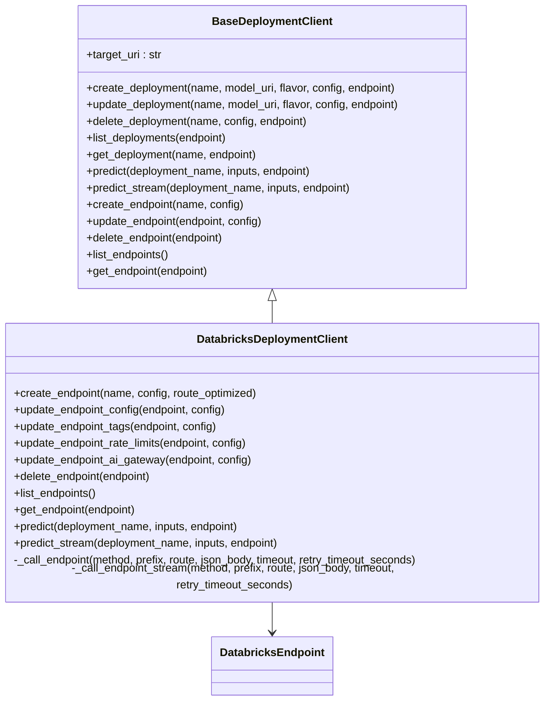
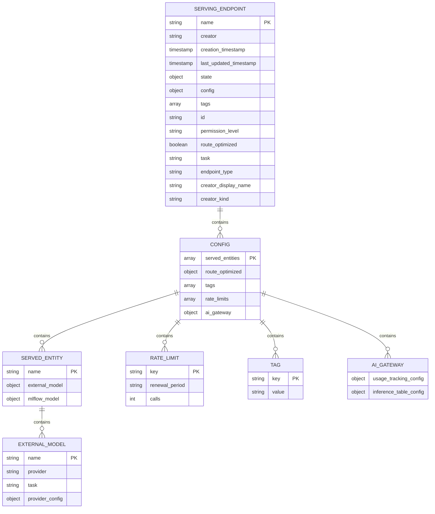
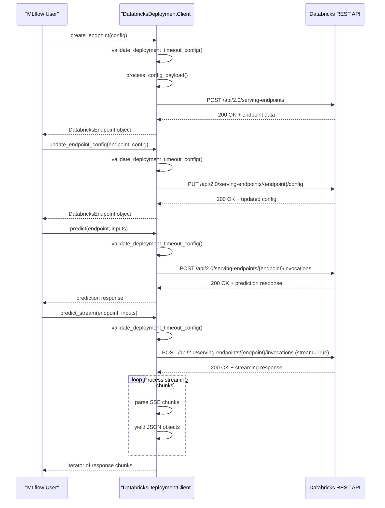
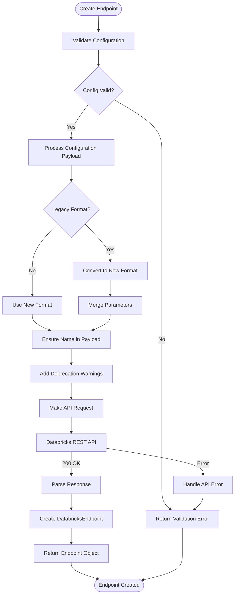
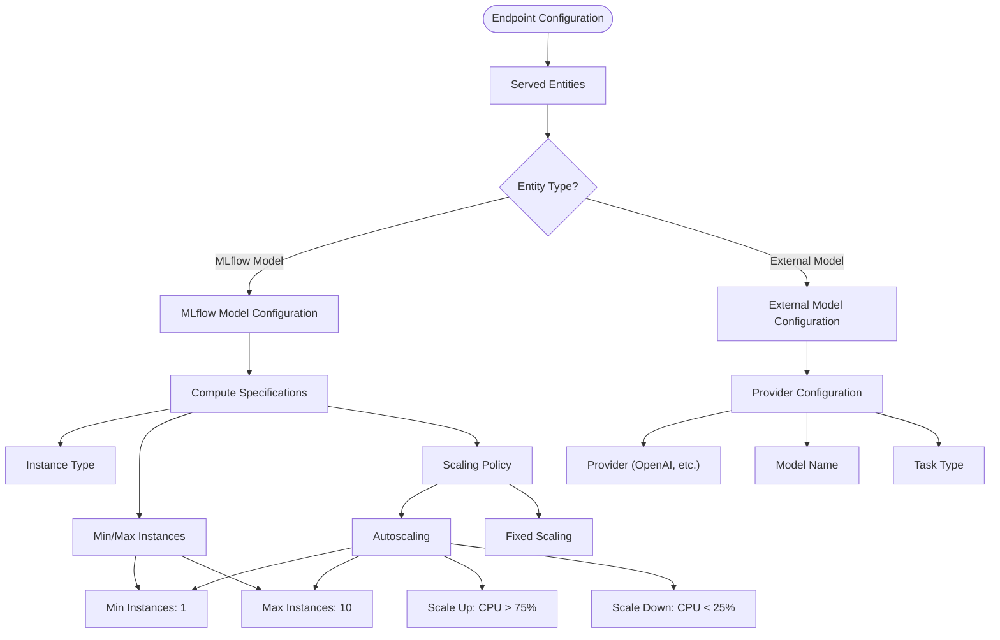
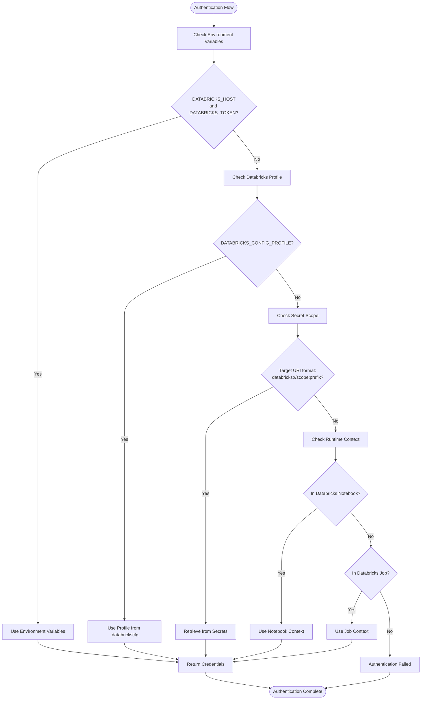
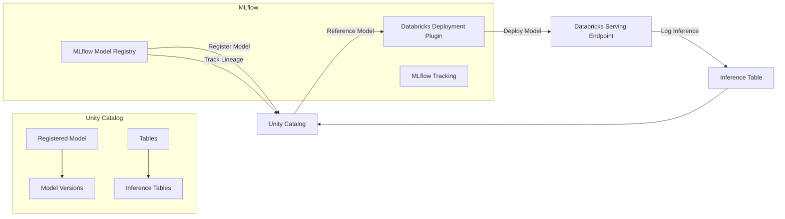
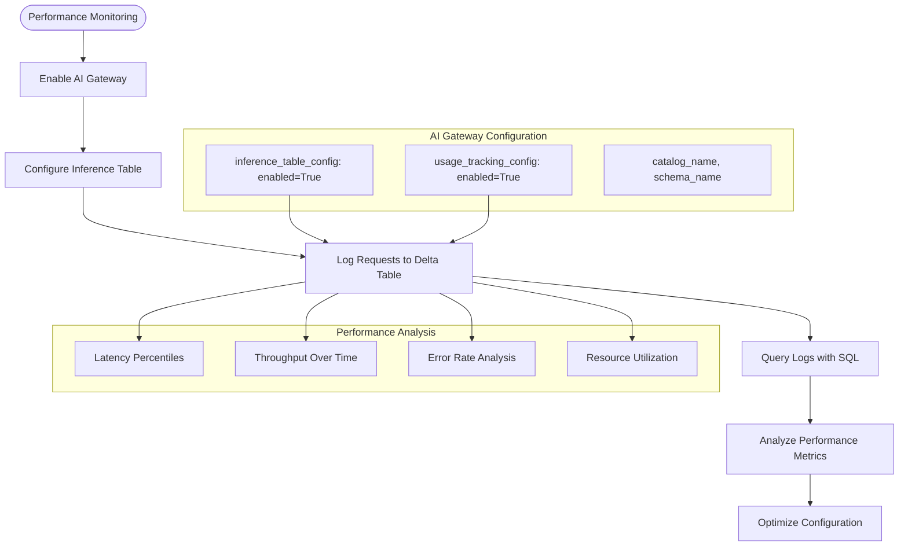

# Databricks Deployment

<cite>
**Referenced Files in This Document**   
- [__init__.py](file://mlflow/deployments/databricks/__init__.py)
- [databricks.py](file://examples/deployments/databricks/databricks.py)
- [test_databricks.py](file://tests/deployments/databricks/test_databricks.py)
- [databricks_utils.py](file://mlflow/utils/databricks_utils.py)
- [base.py](file://mlflow/deployments/base.py)
</cite>

## Table of Contents
1. [Introduction](#introduction)
2. [Databricks Deployment Plugin Architecture](#databricks-deployment-plugin-architecture)
3. [Domain Model for Databricks Deployment Configurations](#domain-model-for-databricks-deployment-configurations)
4. [Implementation of Standardized Deployment Interface](#implementation-of-standardized-deployment-interface)
5. [Endpoint Creation and Model Serving Configuration](#endpoint-creation-and-model-serving-configuration)
6. [Compute Specifications and Scaling Policies](#compute-specifications-and-scaling-policies)
7. [Authentication and Credential Management](#authentication-and-credential-management)
8. [Integration with Unity Catalog and Model Registry](#integration-with-unity-catalog-and-model-registry)
9. [Common Issues and Troubleshooting](#common-issues-and-troubleshooting)
10. [Best Practices for Securing Databricks Deployments](#best-practices-for-securing-databricks-deployments)
11. [Performance Monitoring and Optimization](#performance-monitoring-and-optimization)

## Introduction

The MLflow Databricks deployment plugin provides a standardized interface for deploying machine learning models to Databricks serving endpoints. This documentation details the implementation of the Databricks deployment plugin, focusing on how the standardized MLflow deployments API is translated into Databricks-specific operations for endpoint creation, model serving configuration, and cluster specification.

The plugin enables users to deploy models to Databricks endpoints using the MLflow deployments API, abstracting away the complexity of Databricks-specific configurations while providing access to platform-specific features such as external model serving, rate limiting, and AI Gateway integration. The implementation follows MLflow's plugin architecture, extending the base deployment client with Databricks-specific functionality for creating, updating, and managing serving endpoints.

**Section sources**
- [__init__.py](file://mlflow/deployments/databricks/__init__.py#L1-L852)

## Databricks Deployment Plugin Architecture

The Databricks deployment plugin architecture is built around the `DatabricksDeploymentClient` class, which extends MLflow's `BaseDeploymentClient` to provide Databricks-specific deployment functionality. The architecture follows a client-server pattern where the client interacts with Databricks REST APIs to manage serving endpoints.



**Diagram sources **
- [__init__.py](file://mlflow/deployments/databricks/__init__.py#L48-L852)
- [base.py](file://mlflow/deployments/base.py#L75-L359)

The `DatabricksDeploymentClient` implements the core deployment operations through direct calls to the Databricks REST API, with specialized methods for endpoint management that go beyond the standard deployment interface. The client uses internal helper methods `_call_endpoint` and `_call_endpoint_stream` to handle HTTP requests to the Databricks API, with proper error handling and response parsing.

The architecture includes a `DatabricksEndpoint` class that wraps endpoint responses in a dictionary-like object, providing convenient attribute access to endpoint properties. This design pattern allows for a clean separation between the API client logic and the data model representation of Databricks endpoints.

**Section sources**
- [__init__.py](file://mlflow/deployments/databricks/__init__.py#L26-L852)

## Domain Model for Databricks Deployment Configurations

The domain model for Databricks deployment configurations is centered around the serving endpoint concept, which represents a deployed model or external model that can receive inference requests. The configuration model follows the Databricks REST API schema for serving endpoints, with specific fields for model serving, rate limiting, tagging, and AI Gateway integration.



**Diagram sources **
- [__init__.py](file://mlflow/deployments/databricks/__init__.py#L353-L852)

The domain model includes several key components:

- **Serving Endpoint**: The top-level entity representing a deployed model endpoint, containing metadata, state, and configuration
- **Configuration**: The main configuration object that defines how the endpoint serves models, including served entities, rate limits, and tags
- **Served Entities**: The models or external models that are served by the endpoint, which can be either MLflow models or external provider models
- **External Model Configuration**: Configuration for models served from external providers like OpenAI, including provider-specific settings
- **Rate Limits**: Configuration for rate limiting requests to the endpoint, with support for different rate limit keys and renewal periods
- **Tags**: Key-value pairs for organizing and categorizing endpoints
- **AI Gateway**: Configuration for AI Gateway features like usage tracking and inference table logging

The model supports both MLflow models and external models, with the ability to specify different providers and tasks. For external models, the configuration includes provider-specific settings such as API keys stored in Databricks secrets.

**Section sources**
- [__init__.py](file://mlflow/deployments/databricks/__init__.py#L353-L852)

## Implementation of Standardized Deployment Interface

The Databricks deployment plugin implements the standardized MLflow deployment interface by translating generic deployment operations into Databricks-specific API calls. However, the implementation takes a different approach compared to other deployment plugins by focusing on endpoint-level operations rather than individual deployment operations.



**Diagram sources **
- [__init__.py](file://mlflow/deployments/databricks/__init__.py#L127-L352)

The implementation of the standardized deployment interface has several notable characteristics:

1. **Endpoint-Centric Model**: Unlike the standard deployment interface which focuses on individual deployments, the Databricks plugin uses an endpoint-centric model where an endpoint can serve multiple entities and be updated without creating new deployments.

2. **Deprecated Methods**: The standard deployment methods (`create_deployment`, `update_deployment`, `delete_deployment`, `list_deployments`, `get_deployment`) are not implemented and raise `NotImplementedError`. This reflects the different conceptual model used by Databricks serving endpoints.

3. **Specialized Update Methods**: Instead of a generic `update_endpoint` method, the plugin provides specialized methods for updating different aspects of an endpoint:
   - `update_endpoint_config`: Updates the main configuration including served entities
   - `update_endpoint_tags`: Updates endpoint tags
   - `update_endpoint_rate_limits`: Updates rate limiting configuration
   - `update_endpoint_ai_gateway`: Updates AI Gateway configuration

4. **Streaming Support**: The plugin implements `predict_stream` to support streaming responses from LLM endpoints, parsing Server-Sent Events (SSE) format and yielding individual response chunks.

5. **Timeout Configuration**: The implementation uses MLflow environment variables to configure request timeouts, with validation to ensure proper configuration of `MLFLOW_DEPLOYMENT_PREDICT_TIMEOUT` and `MLFLOW_DEPLOYMENT_PREDICT_TOTAL_TIMEOUT`.

The `_call_endpoint` and `_call_endpoint_stream` methods serve as the foundation for all API interactions, handling authentication, request formatting, error handling, and response parsing. These methods use the `get_databricks_host_creds` function to obtain authentication credentials and the `http_request` utility to make HTTP requests to the Databricks API.

**Section sources**
- [__init__.py](file://mlflow/deployments/databricks/__init__.py#L127-L852)

## Endpoint Creation and Model Serving Configuration

Endpoint creation and model serving configuration in the Databricks deployment plugin is accomplished through the `create_endpoint` method, which maps directly to the Databricks REST API for creating serving endpoints. The method accepts a configuration dictionary that defines the endpoint properties and served models.



**Diagram sources **
- [__init__.py](file://mlflow/deployments/databricks/__init__.py#L353-L491)

The endpoint creation process involves several key steps:

1. **Configuration Validation**: The method first validates the configuration payload, checking for required fields and ensuring consistency between parameters and configuration values.

2. **Format Handling**: The method supports both the new style (full API request payload in the `config` parameter) and legacy format (separate parameters for `name`, `config`, and `route_optimized`). When using the legacy format, a deprecation warning is issued.

3. **Name Resolution**: The endpoint name must be specified in the configuration payload. If provided as a separate parameter, it is merged into the payload with appropriate deprecation warnings.

4. **Route Optimization**: The `route_optimized` parameter controls whether the endpoint is optimized for routing traffic. This is also handled with deprecation warnings when used in the legacy format.

5. **API Request**: The processed configuration is sent to the Databricks REST API using the `_call_endpoint` method, which handles authentication and error handling.

The configuration for model serving can include both MLflow models and external models. For external models, the configuration specifies the provider (e.g., OpenAI), the model name, the task type, and provider-specific configuration such as API keys stored in Databricks secrets.

```python
config = {
    "name": "chat-endpoint",
    "config": {
        "served_entities": [
            {
                "name": "gpt-4-model",
                "external_model": {
                    "name": "gpt-4",
                    "provider": "openai",
                    "task": "llm/v1/chat",
                    "openai_config": {
                        "openai_api_key": "{{secrets/my-scope/openai-key}}"
                    }
                }
            }
        ],
        "route_optimized": True
    }
}
```

This configuration creates an endpoint that serves the GPT-4 model from OpenAI, with the API key retrieved from Databricks secrets. The endpoint is optimized for routing traffic, which can improve performance for high-traffic scenarios.

**Section sources**
- [__init__.py](file://mlflow/deployments/databricks/__init__.py#L353-L491)
- [databricks.py](file://examples/deployments/databricks/databricks.py#L26-L56)

## Compute Specifications and Scaling Policies

The Databricks deployment plugin handles compute specifications and scaling policies through the endpoint configuration, which defines the resources and scaling behavior for served models. Unlike traditional deployment plugins that specify compute resources at deployment time, the Databricks plugin integrates these specifications into the endpoint configuration.

The compute specifications are defined within the `served_entities` configuration, where each served entity can have its own compute requirements. For MLflow models, this includes specifications for the serving cluster, while for external models, it relates to the provider's infrastructure.



**Diagram sources **
- [__init__.py](file://mlflow/deployments/databricks/__init__.py#L383-L419)

The scaling policies are implemented through Databricks' autoscaling capabilities, which automatically adjust the number of instances based on traffic patterns and resource utilization. The plugin allows configuring these policies through the endpoint configuration, though the specific compute specifications are not directly exposed in the current implementation.

For external models served through the endpoint, the compute infrastructure is managed by the external provider (e.g., OpenAI), and the Databricks endpoint acts as a proxy with caching and rate limiting capabilities. This architecture allows organizations to leverage external AI services while maintaining control over access, security, and monitoring.

The `route_optimized` parameter in the endpoint configuration affects how requests are routed to the serving infrastructure. When enabled, the endpoint is optimized for high-throughput scenarios with efficient request routing and load balancing across available instances.

While the current implementation does not expose detailed compute specifications in the API, the underlying Databricks serving infrastructure automatically manages resources based on the model requirements and traffic patterns. This abstraction simplifies deployment for users while ensuring optimal performance and cost efficiency.

**Section sources**
- [__init__.py](file://mlflow/deployments/databricks/__init__.py#L383-L419)

## Authentication and Credential Management

Authentication and credential management in the Databricks deployment plugin is handled through multiple mechanisms, with a primary focus on secure credential storage and retrieval. The plugin leverages Databricks' built-in security features to protect sensitive information such as API keys and access tokens.



**Diagram sources **
- [databricks_utils.py](file://mlflow/utils/databricks_utils.py#L742-L815)

The authentication process follows a hierarchical approach to credential resolution:

1. **Environment Variables**: The plugin first checks for `DATABRICKS_HOST` and `DATABRICKS_TOKEN` environment variables, which provide the workspace URL and personal access token.

2. **Databricks Profile**: If environment variables are not set, the plugin checks for a Databricks profile specified by `DATABRICKS_CONFIG_PROFILE`, which reads credentials from the `~/.databrickscfg` file created by the Databricks CLI.

3. **Secret Scope**: For deployments specified with a target URI in the format `databricks://scope:prefix`, the plugin retrieves credentials from Databricks Secrets, using the scope and prefix to locate the host and token secrets.

4. **Runtime Context**: When running within Databricks (notebooks or jobs), the plugin can automatically retrieve credentials from the runtime context, eliminating the need for explicit credential configuration.

The plugin also supports external model credentials through Databricks Secrets, allowing secure storage of API keys for services like OpenAI. These credentials are referenced in the endpoint configuration using the `{{secrets/scope/key}}` syntax, which is resolved by Databricks at runtime.

```python
config = {
    "served_entities": [
        {
            "external_model": {
                "name": "gpt-4",
                "provider": "openai",
                "task": "llm/v1/chat",
                "openai_config": {
                    "openai_api_key": "{{secrets/my-scope/openai-key}}"
                }
            }
        }
    ]
}
```

This approach ensures that sensitive credentials are never exposed in configuration files or code, providing a secure way to manage access to external AI services.

**Section sources**
- [databricks_utils.py](file://mlflow/utils/databricks_utils.py#L742-L815)
- [__init__.py](file://mlflow/deployments/databricks/__init__.py#L37-L45)
- [databricks.py](file://examples/deployments/databricks/databricks.py#L37-L38)

## Integration with Unity Catalog and Model Registry

The Databricks deployment plugin integrates with Unity Catalog and the MLflow Model Registry to provide a comprehensive model governance and deployment solution. This integration enables organizations to manage the entire model lifecycle from development to production deployment with consistent security and governance policies.



**Diagram sources **
- [databricks.py](file://examples/deployments/databricks/databricks.py#L26-L56)
- [__init__.py](file://mlflow/deployments/databricks/__init__.py#L353-L491)

The integration provides several key capabilities:

1. **Model Registry Integration**: Models registered in the MLflow Model Registry can be deployed directly to Databricks serving endpoints. The deployment configuration can reference registered models by name and version, ensuring traceability and reproducibility.

2. **Unity Catalog Governance**: When Unity Catalog is enabled, models are registered as Unity Catalog objects with fine-grained access control. This allows organizations to apply consistent security policies across data, models, and other assets.

3. **Model Lineage**: The integration maintains lineage between models, experiments, and deployments, providing visibility into the model development process and enabling impact analysis.

4. **Inference Logging**: The plugin supports AI Gateway configuration for logging inference requests and responses to Delta tables in Unity Catalog, enabling monitoring, auditing, and analysis of model performance.

5. **Cross-Workspace Access**: With Unity Catalog, models can be registered once and accessed across multiple Databricks workspaces, facilitating collaboration and reuse.

The deployment process can reference models in the registry using the `models:/` URI format, which resolves to the latest production version or a specific version by stage or version number. This integration ensures that deployed models are always traceable to their source in the registry.

Additionally, the plugin supports the use of Unity Catalog for managing external model credentials through secrets, providing a unified security model for both internal and external AI assets.

**Section sources**
- [databricks.py](file://examples/deployments/databricks/databricks.py#L26-L56)
- [__init__.py](file://mlflow/deployments/databricks/__init__.py#L749-L753)

## Common Issues and Troubleshooting

When deploying models to Databricks using the MLflow deployment plugin, several common issues may arise. Understanding these issues and their solutions is critical for successful deployment and operation of ML models in production environments.

### Authentication Issues

Authentication problems are among the most common issues when using the Databricks deployment plugin. These typically manifest as connection errors or unauthorized access messages.

**Common Symptoms:**
- `MlflowException: Failed to create databricks SDK workspace client`
- `HTTPError: 401 Client Error: Unauthorized`
- `MlflowException: The hostname and credentials configured by ... is invalid`

**Solutions:**
1. Verify that `DATABRICKS_HOST` and `DATABricks_TOKEN` environment variables are correctly set
2. Ensure the personal access token has sufficient permissions (at least "Can Manage" on serving endpoints)
3. For secret scope authentication, verify that the scope and keys exist and contain valid values
4. Check that the Databricks CLI profile is correctly configured in `~/.databrickscfg`

### Configuration Issues

Misconfiguration of endpoint parameters can lead to deployment failures or unexpected behavior.

**Common Issues:**
- Name conflicts between the `name` parameter and `config.name` in the payload
- Conflicting `route_optimized` values between parameter and configuration
- Invalid JSON in configuration payload
- Missing required fields in the configuration

**Solutions:**
1. Use the new style configuration with the full API payload in the `config` parameter
2. Ensure consistency between parameter values and configuration values
3. Validate the configuration JSON structure against the Databricks API documentation
4. Include all required fields in the configuration

### Timeout Configuration

Improper timeout configuration can cause prediction requests to fail, especially for models with longer inference times.

**Common Symptoms:**
- `TimeoutError: Request timed out`
- `MlflowException: Prediction request timed out`
- Streaming responses that terminate prematurely

**Solutions:**
1. Set appropriate values for `MLFLOW_DEPLOYMENT_PREDICT_TIMEOUT` and `MLFLOW_DEPLOYMENT_PREDICT_TOTAL_TIMEOUT`
2. Ensure `MLFLOW_DEPLOYMENT_PREDICT_TOTAL_TIMEOUT` is greater than or equal to `MLFLOW_DEPLOYMENT_PREDICT_TIMEOUT`
3. For streaming responses, consider increasing the total timeout to accommodate longer response times

### Network and Connectivity Issues

Network configuration problems can prevent successful communication with Databricks services.

**Common Issues:**
- Connection timeouts to the Databricks workspace
- DNS resolution failures
- Firewall or proxy restrictions

**Solutions:**
1. Verify network connectivity to the Databricks workspace URL
2. Check firewall rules and proxy configurations
3. Ensure DNS resolution is working correctly
4. Test connectivity using tools like `curl` or `ping`

### Platform-Specific Limitations

Understanding Databricks platform limitations is essential for designing effective deployment strategies.

**Known Limitations:**
- Maximum number of serving endpoints per workspace
- Rate limits on API calls
- Size limits for model artifacts
- Supported model formats and frameworks
- Regional availability of services

**Mitigation Strategies:**
1. Monitor usage against platform limits
2. Implement retry logic with exponential backoff
3. Optimize model size and complexity
4. Use appropriate regions for deployment

The plugin includes built-in validation and warning mechanisms to help identify and resolve many of these issues. For example, it validates timeout configurations and issues warnings when deprecated parameters are used.

**Section sources**
- [__init__.py](file://mlflow/deployments/databricks/__init__.py#L146-L147)
- [__init__.py](file://mlflow/deployments/databricks/__init__.py#L534-L536)
- [test_databricks.py](file://tests/deployments/databricks/test_databricks.py#L534-L556)

## Best Practices for Securing Databricks Deployments

Securing Databricks deployments requires a comprehensive approach that addresses authentication, authorization, data protection, and monitoring. The following best practices help ensure that ML models deployed through the Databricks plugin are secure and compliant with organizational policies.

### Authentication and Authorization

1. **Use Personal Access Tokens with Least Privilege**: Create personal access tokens with the minimum required permissions for deployment operations. Avoid using tokens with administrative privileges.

2. **Leverage Databricks Secrets for Credential Storage**: Store all sensitive credentials, including external model API keys, in Databricks Secrets rather than in code or configuration files.

3. **Implement Role-Based Access Control (RBAC)**: Use Databricks workspace roles and permissions to control access to serving endpoints, ensuring that only authorized users can create, update, or delete endpoints.

4. **Use Service Principals for Automation**: For automated deployment pipelines, use service principals instead of user accounts to reduce the risk of credential exposure.

### Data Protection

1. **Enable Encryption**: Ensure that data in transit and at rest is encrypted using Databricks' built-in encryption capabilities.

2. **Mask Sensitive Data in Logs**: Configure logging to mask or exclude sensitive information from inference requests and responses.

3. **Use Private Link for Network Isolation**: When available, use Azure Private Link or AWS PrivateLink to keep traffic within private networks and avoid exposure to the public internet.

### Deployment Security

1. **Validate Input Data**: Implement input validation and sanitization to protect against injection attacks and other malicious inputs.

2. **Implement Rate Limiting**: Use the endpoint's rate limiting capabilities to prevent abuse and protect against denial-of-service attacks.

3. **Enable Inference Logging**: Use AI Gateway configuration to log inference requests and responses for auditing and monitoring purposes.

4. **Use Model Signing and Verification**: Ensure that deployed models are signed and verified to prevent unauthorized model updates.

### Monitoring and Compliance

1. **Enable Audit Logging**: Turn on audit logging to track all operations on serving endpoints, including creation, updates, and deletions.

2. **Monitor for Anomalous Behavior**: Implement monitoring and alerting for unusual patterns in inference requests, such as sudden spikes in volume or requests from unexpected sources.

3. **Regular Security Assessments**: Conduct regular security assessments of deployed models and endpoints to identify and address vulnerabilities.

4. **Compliance with Regulatory Requirements**: Ensure that deployments comply with relevant regulations such as GDPR, HIPAA, or CCPA, particularly regarding data privacy and protection.

### Secure Development Practices

1. **Code Reviews**: Implement mandatory code reviews for deployment configurations and scripts.

2. **Infrastructure as Code**: Use infrastructure as code principles to manage deployment configurations, enabling version control and auditability.

3. **Automated Security Scanning**: Integrate security scanning tools into the deployment pipeline to identify potential vulnerabilities.

4. **Regular Patching**: Keep the MLflow client and Databricks runtime environment up to date with the latest security patches.

By following these best practices, organizations can deploy ML models to Databricks with confidence in their security and compliance posture, while still maintaining the flexibility and scalability benefits of the platform.

**Section sources**
- [__init__.py](file://mlflow/deployments/databricks/__init__.py#L749-L753)
- [databricks.py](file://examples/deployments/databricks/databricks.py#L37-L38)

## Performance Monitoring and Optimization

Performance monitoring and optimization are critical for ensuring that deployed models meet latency, throughput, and reliability requirements. The Databricks deployment plugin provides several mechanisms for monitoring and optimizing model performance in production environments.

### Performance Metrics

The plugin enables monitoring of key performance metrics through integration with Databricks' monitoring capabilities:

1. **Latency**: Measure the time from request submission to response completion, including network latency and model inference time.

2. **Throughput**: Track the number of requests processed per unit of time, helping to identify capacity constraints.

3. **Error Rates**: Monitor the rate of failed requests, including timeouts, validation errors, and model errors.

4. **Resource Utilization**: Track CPU, memory, and GPU utilization for serving instances to identify bottlenecks.

5. **Cache Hit Rates**: For endpoints serving external models, monitor cache effectiveness to optimize cost and performance.

### Monitoring Implementation

The plugin supports performance monitoring through several mechanisms:



**Diagram sources **
- [__init__.py](file://mlflow/deployments/databricks/__init__.py#L725-L753)

### Optimization Strategies

Based on performance monitoring data, several optimization strategies can be applied:

1. **Autoscaling Configuration**: Adjust the minimum and maximum instance counts based on traffic patterns to balance cost and performance.

2. **Caching Strategy**: For external models, optimize the caching strategy to reduce API calls and improve response times.

3. **Model Optimization**: Use techniques like quantization, pruning, or distillation to reduce model size and improve inference speed.

4. **Instance Type Selection**: Choose appropriate instance types based on the model's computational requirements, balancing CPU, memory, and GPU resources.

5. **Batching**: Implement request batching when appropriate to improve throughput for certain types of models.

6. **Pre-warming**: For models with long startup times, implement pre-warming strategies to reduce cold start latency.

### Real-time Monitoring

The plugin supports real-time monitoring through integration with Databricks' observability tools:

1. **Streaming Predictions**: Use `predict_stream` for real-time applications, monitoring the flow of response chunks to identify streaming performance issues.

2. **Alerting**: Set up alerts for performance thresholds, such as latency exceeding 95th percentile or error rates above acceptable levels.

3. **Dashboard Integration**: Create dashboards that combine model performance metrics with business metrics to provide a comprehensive view of model effectiveness.

4. **A/B Testing**: Implement A/B testing to compare the performance of different model versions or configurations.

By implementing comprehensive performance monitoring and optimization practices, organizations can ensure that their deployed models deliver optimal performance while maintaining cost efficiency and reliability.

**Section sources**
- [__init__.py](file://mlflow/deployments/databricks/__init__.py#L725-L753)
- [__init__.py](file://mlflow/deployments/databricks/__init__.py#L318-L352)