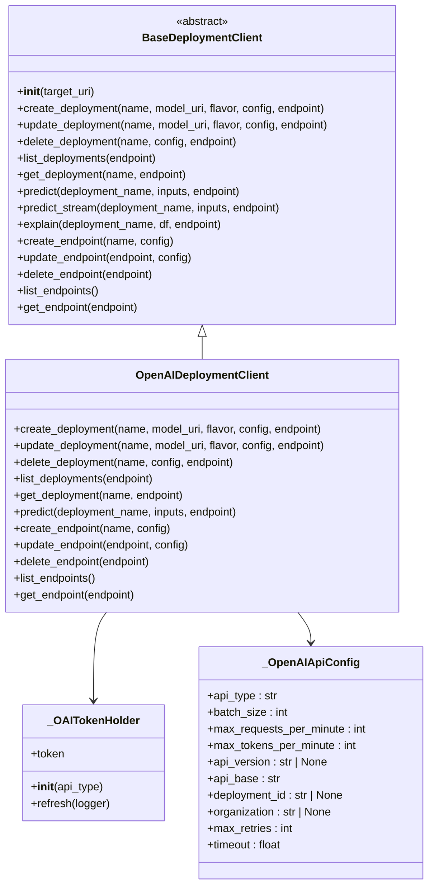
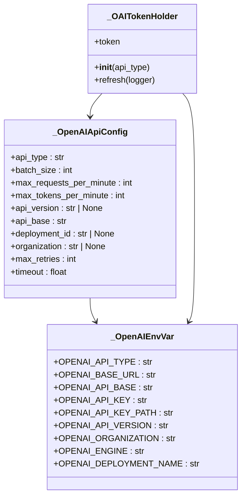
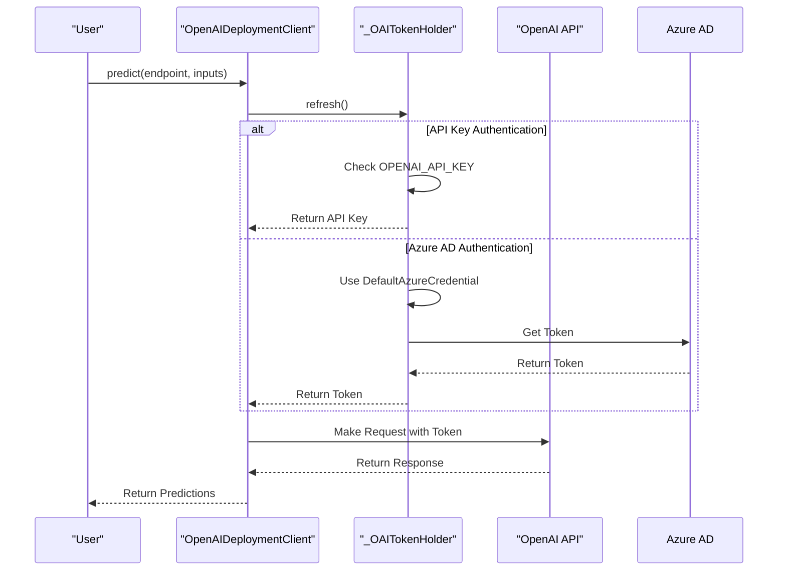
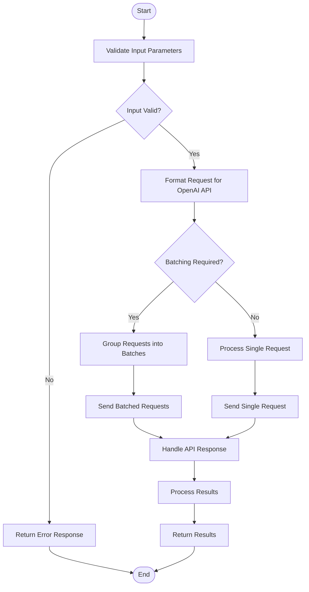
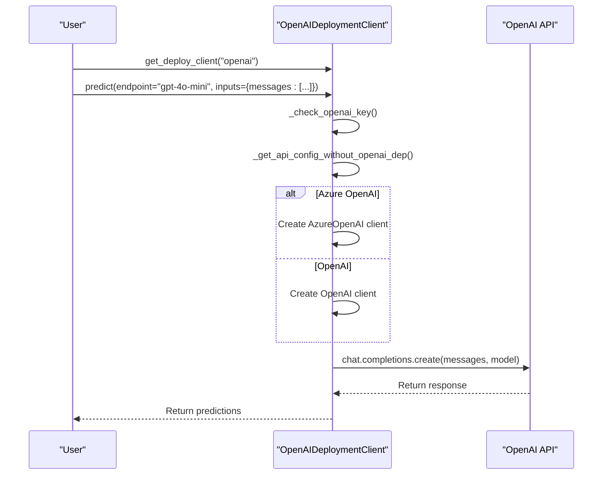
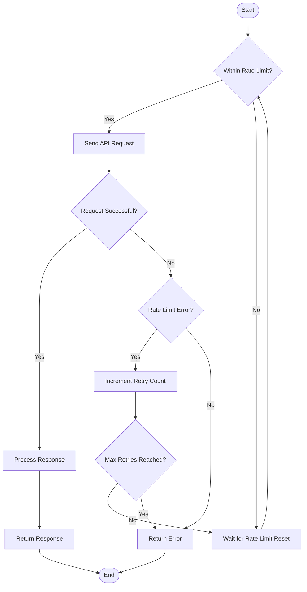
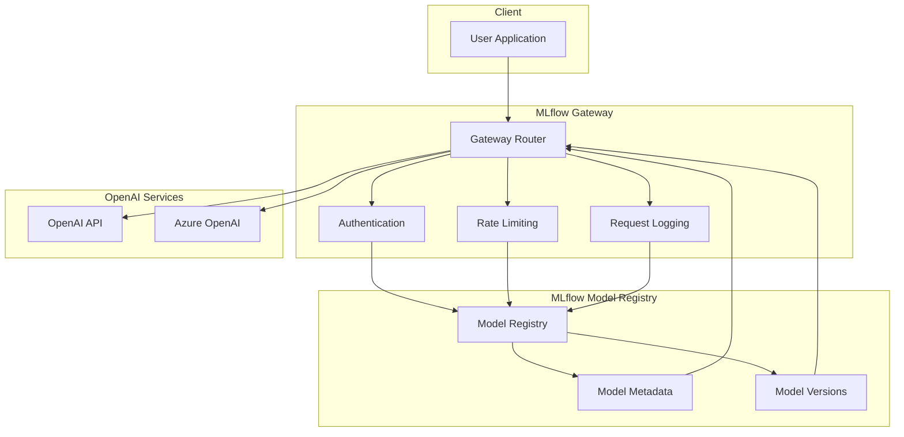
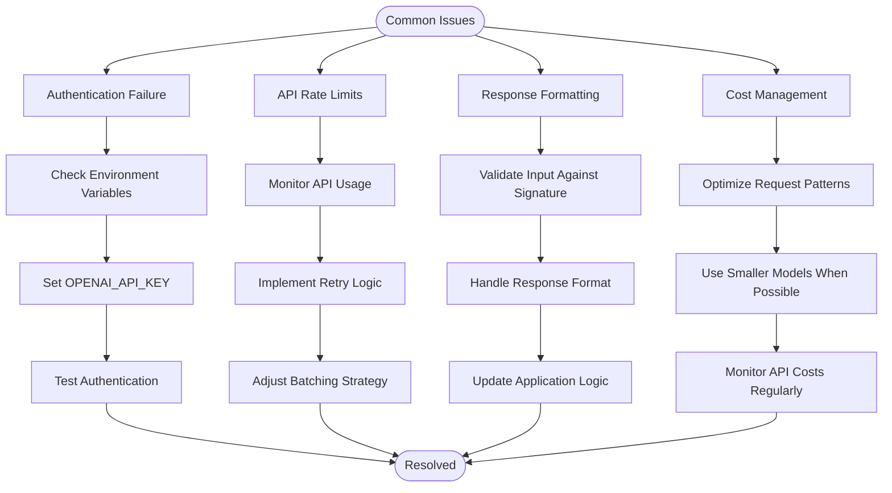

# OpenAI-Compatible Deployment

<cite>
**Referenced Files in This Document**   
- [openai.py](file://mlflow/deployments/openai/__init__.py)
- [base.py](file://mlflow/deployments/base.py)
- [interface.py](file://mlflow/deployments/interface.py)
- [openai_utils.py](file://mlflow/utils/openai_utils.py)
- [openai.py](file://mlflow/gateway/providers/openai.py)
- [model.py](file://mlflow/openai/model.py)
- [api_request_parallel_processor.py](file://mlflow/openai/api_request_parallel_processor.py)
- [chat_completions.py](file://examples/openai/chat_completions.py)
- [azure_openai.py](file://examples/openai/azure_openai.py)
- [example.py](file://examples/gateway/openai/example.py)
</cite>

## Table of Contents
1. [Introduction](#introduction)
2. [OpenAI Deployment Plugin Architecture](#openai-deployment-plugin-architecture)
3. [Domain Model for OpenAI Deployment Configurations](#domain-model-for-openai-deployment-configurations)
4. [Authentication and API Key Management](#authentication-and-api-key-management)
5. [Model Specification and Request Formatting](#model-specification-and-request-formatting)
6. [Deployment and Inference Workflow](#deployment-and-inference-workflow)
7. [Rate Limiting and Cost Management](#rate-limiting-and-cost-management)
8. [Integration with Model Registry and Gateway Routing](#integration-with-model-registry-and-gateway-routing)
9. [Common Issues and Troubleshooting](#common-issues-and-troubleshooting)
10. [Best Practices for Reliable and Cost-Efficient Deployments](#best-practices-for-reliable-and-cost-efficient-deployments)
11. [Conclusion](#conclusion)

## Introduction

MLflow provides a standardized deployment interface that enables interaction with OpenAI-compatible services for model deployment and inference. This documentation details the implementation of the OpenAI deployment plugin, which allows users to deploy and query models through OpenAI's API using MLflow's unified deployment framework. The plugin supports both OpenAI and Azure OpenAI services, providing a consistent interface for authentication, model specification, and request formatting.

The OpenAI deployment functionality in MLflow is designed to work seamlessly with the model registry, gateway routing, and other MLflow components. It enables users to deploy models to OpenAI-compatible endpoints, manage API keys securely, and handle rate limiting considerations. The implementation leverages MLflow's standardized deployment interface, allowing for consistent interactions across different deployment targets.

This document will explore the architecture of the OpenAI deployment plugin, the domain model for deployment configurations, authentication mechanisms, model specification, and request formatting. It will also cover integration with other MLflow components, common issues, and best practices for optimizing deployments for reliability and cost efficiency.

**Section sources**
- [openai.py](file://mlflow/deployments/openai/__init__.py#L1-L253)
- [base.py](file://mlflow/deployments/base.py#L1-L359)
- [interface.py](file://mlflow/deployments/interface.py#L1-L103)

## OpenAI Deployment Plugin Architecture

The OpenAI deployment plugin in MLflow follows a modular architecture that implements the standardized deployment interface. The core component is the `OpenAIDeploymentClient` class, which extends the `BaseDeploymentClient` abstract base class. This client provides methods for interacting with OpenAI endpoints, including prediction, listing endpoints, and retrieving endpoint information.

The architecture is designed to be extensible and follows the plugin pattern, allowing for easy integration with different deployment targets. The `BaseDeploymentClient` class defines the abstract interface that all deployment plugins must implement, ensuring consistency across different deployment targets. The OpenAI deployment client implements this interface while providing OpenAI-specific functionality.

The plugin architecture separates concerns between the deployment client, configuration management, and API interaction. The `OpenAIDeploymentClient` handles the high-level deployment operations, while utility classes like `_OAITokenHolder` and `_OpenAIApiConfig` manage authentication and API configuration. This separation of concerns makes the codebase more maintainable and easier to extend.

The deployment plugin also integrates with MLflow's gateway system, allowing for routing of requests to OpenAI-compatible endpoints. The gateway provider for OpenAI handles the translation between MLflow's standardized API and the OpenAI API, ensuring compatibility and consistency.

**Diagram sources **
- [openai.py](file://mlflow/deployments/openai/__init__.py#L14-L153)
- [base.py](file://mlflow/deployments/base.py#L75-L359)
- [openai_utils.py](file://mlflow/utils/openai_utils.py#L71-L164)

**Section sources**
- [openai.py](file://mlflow/deployments/openai/__init__.py#L14-L153)
- [base.py](file://mlflow/deployments/base.py#L75-L359)
- [openai_utils.py](file://mlflow/utils/openai_utils.py#L71-L164)

## Domain Model for OpenAI Deployment Configurations

The domain model for OpenAI deployment configurations in MLflow is designed to capture the essential parameters and settings required for interacting with OpenAI-compatible services. The core configuration is represented by the `_OpenAIApiConfig` named tuple, which encapsulates the API type, base URL, version, deployment ID, organization, and rate limiting parameters.

The configuration model supports both OpenAI and Azure OpenAI services through the `api_type` parameter, which can be set to "openai", "azure", "azure_ad", or "azuread". This flexibility allows the same deployment interface to work with different OpenAI-compatible services. The configuration also includes parameters for rate limiting, such as `max_requests_per_minute` and `max_tokens_per_minute`, which are used to manage API usage and prevent rate limit errors.

Authentication is managed through environment variables, with the `_OpenAIEnvVar` enum defining the standard OpenAI environment variables. These include `OPENAI_API_KEY`, `OPENAI_API_TYPE`, `OPENAI_API_BASE`, `OPENAI_API_VERSION`, and `OPENAI_DEPLOYMENT_NAME`. The configuration model reads these environment variables to set up the API connection, ensuring secure handling of sensitive credentials.

The domain model also includes parameters for request handling, such as `max_retries` and `timeout`, which control the behavior of API requests. These parameters help ensure reliable communication with the OpenAI service, even in the face of transient network issues or API errors.

**Diagram sources **
- [openai_utils.py](file://mlflow/utils/openai_utils.py#L126-L164)
- [openai.py](file://mlflow/deployments/openai/__init__.py#L219-L244)

**Section sources**
- [openai_utils.py](file://mlflow/utils/openai_utils.py#L126-L164)
- [openai.py](file://mlflow/deployments/openai/__init__.py#L219-L244)

## Authentication and API Key Management

Authentication and API key management in the MLflow OpenAI deployment plugin is designed to be secure and flexible. The primary authentication mechanism is through the `OPENAI_API_KEY` environment variable, which must be set before making any API requests. The plugin checks for the presence of this environment variable in the `_check_openai_key` function, raising an `MlflowException` if it is not set.

For Azure OpenAI services, the plugin supports additional authentication methods, including Azure Active Directory (Azure AD) authentication. The `_OAITokenHolder` class manages the authentication token, refreshing it when necessary. For Azure AD authentication, it uses the `DefaultAzureCredential` from the `azure-identity` package to acquire a token, which is then used for API requests.

The plugin also supports specifying the API key through a file path using the `OPENAI_API_KEY_PATH` environment variable. This allows for secure storage of API keys in files, which can be particularly useful in production environments where environment variables might not be the preferred method for storing sensitive information.

To enhance security, the plugin validates the API key and other configuration parameters before making requests. It also provides mechanisms for handling authentication failures, such as retrying with a refreshed token or providing detailed error messages to help users diagnose authentication issues.

**Diagram sources **
- [openai.py](file://mlflow/deployments/openai/__init__.py#L101-L105)
- [openai_utils.py](file://mlflow/utils/openai_utils.py#L71-L124)

**Section sources**
- [openai.py](file://mlflow/deployments/openai/__init__.py#L101-L105)
- [openai_utils.py](file://mlflow/utils/openai_utils.py#L71-L124)

## Model Specification and Request Formatting

Model specification and request formatting in the MLflow OpenAI deployment plugin are designed to be intuitive and flexible. The plugin supports various OpenAI tasks, including chat completions, text completions, and embeddings. Each task has specific requirements for input formatting, which are handled by the plugin to ensure compatibility with the OpenAI API.

For chat completions, the input is formatted as a list of message dictionaries, each containing a "role" and "content" field. The plugin validates these messages to ensure they conform to the expected format. For text completions, the input is a prompt string, which can include format placeholders for dynamic content. The plugin uses Python's string formatting to substitute values into the prompt before sending it to the API.

The model specification includes parameters such as temperature, max_tokens, and top_p, which control the behavior of the model during inference. These parameters can be specified in the request or set as defaults in the model configuration. The plugin validates these parameters to ensure they are within acceptable ranges and compatible with the specified model.

Request formatting also includes handling of batch requests, where multiple inputs are processed in a single API call. The plugin manages batching automatically, grouping requests to optimize API usage while respecting rate limits. This is particularly important for embeddings, where large batches can be processed more efficiently.

**Diagram sources **
- [openai.py](file://mlflow/deployments/openai/__init__.py#L128-L130)
- [model.py](file://mlflow/openai/model.py#L579-L663)
- [api_request_parallel_processor.py](file://mlflow/openai/api_request_parallel_processor.py#L92-L132)

**Section sources**
- [openai.py](file://mlflow/deployments/openai/__init__.py#L128-L130)
- [model.py](file://mlflow/openai/model.py#L579-L663)
- [api_request_parallel_processor.py](file://mlflow/openai/api_request_parallel_processor.py#L92-L132)

## Deployment and Inference Workflow

The deployment and inference workflow in the MLflow OpenAI deployment plugin follows a standardized process that ensures consistency and reliability. The workflow begins with creating a deployment client using the `get_deploy_client` function, which returns an instance of the `OpenAIDeploymentClient` class. This client is then used to interact with OpenAI endpoints for prediction, listing endpoints, and retrieving endpoint information.

The inference workflow starts with the `predict` method, which takes an endpoint name and input data. The method first validates the presence of the API key, then retrieves the API configuration from environment variables. It creates an OpenAI client instance using the configuration and makes a request to the specified endpoint. The response is then returned to the caller in a standardized format.

For chat completions, the workflow involves formatting the input messages, creating an OpenAI client, and making a request to the chat completions endpoint. The response is processed to extract the generated text, which is then returned to the caller. The plugin handles error cases, such as rate limit errors or authentication failures, by raising appropriate exceptions.

The workflow also supports streaming responses for chat completions, allowing for real-time processing of generated text. This is particularly useful for applications that need to display generated content as it is produced, such as chatbots or interactive assistants.

**Diagram sources **
- [openai.py](file://mlflow/deployments/openai/__init__.py#L88-L130)
- [interface.py](file://mlflow/deployments/interface.py#L15-L48)

**Section sources**
- [openai.py](file://mlflow/deployments/openai/__init__.py#L88-L130)
- [interface.py](file://mlflow/deployments/interface.py#L15-L48)

## Rate Limiting and Cost Management

Rate limiting and cost management are critical aspects of deploying models to OpenAI-compatible services. The MLflow OpenAI deployment plugin includes several mechanisms to handle rate limits and optimize API usage to minimize costs. The plugin uses the `max_requests_per_minute` and `max_tokens_per_minute` parameters from the `_OpenAIApiConfig` to manage request rates and prevent exceeding API limits.

The plugin implements a parallel request processor that batches requests to optimize API usage. The `process_api_requests` function in `api_request_parallel_processor.py` uses a thread pool to process multiple requests concurrently, while respecting rate limits. It includes a status tracker that monitors the number of requests in progress, succeeded, and failed, allowing for intelligent throttling of requests.

For cost management, the plugin provides mechanisms to monitor and control API usage. The `max_tokens_per_minute` parameter helps prevent excessive token usage, which can lead to high costs. The plugin also includes logging and error handling for rate limit errors, allowing users to adjust their usage patterns to stay within budget.

The plugin supports retry logic for rate limit errors, with a configurable number of retries. This helps ensure that requests are not lost due to temporary rate limit issues, while also preventing infinite retry loops that could exacerbate the problem.

**Diagram sources **
- [api_request_parallel_processor.py](file://mlflow/openai/api_request_parallel_processor.py#L33-L90)
- [openai_utils.py](file://mlflow/utils/openai_utils.py#L126-L137)

**Section sources**
- [api_request_parallel_processor.py](file://mlflow/openai/api_request_parallel_processor.py#L33-L90)
- [openai_utils.py](file://mlflow/utils/openai_utils.py#L126-L137)

## Integration with Model Registry and Gateway Routing

The OpenAI deployment plugin in MLflow integrates seamlessly with the model registry and gateway routing system. This integration allows for centralized management of models and routing of requests to appropriate endpoints. The model registry stores metadata about deployed models, including their configuration, version, and performance metrics.

When a model is deployed to an OpenAI-compatible service, its metadata is registered in the model registry. This includes information such as the model name, version, and deployment configuration. The registry also stores the model's signature, which defines the input and output schema, allowing for validation of requests and responses.

The gateway routing system acts as an intermediary between clients and OpenAI endpoints. It receives requests from clients, determines the appropriate endpoint based on the request, and forwards the request to the OpenAI service. The gateway also handles authentication, rate limiting, and logging, providing a unified interface for interacting with multiple OpenAI-compatible services.

The integration with the model registry and gateway routing enables features such as A/B testing, canary deployments, and model versioning. Users can deploy multiple versions of a model and route traffic between them based on various criteria, such as user segments or performance metrics.

**Diagram sources **
- [openai.py](file://mlflow/gateway/providers/openai.py#L255-L678)
- [model.py](file://mlflow/openai/model.py#L237-L392)

**Section sources**
- [openai.py](file://mlflow/gateway/providers/openai.py#L255-L678)
- [model.py](file://mlflow/openai/model.py#L237-L392)

## Common Issues and Troubleshooting

When deploying models to OpenAI-compatible services through MLflow, several common issues may arise. Understanding these issues and their solutions is crucial for maintaining reliable and efficient deployments. The most frequent issues include authentication failures, API rate limits, response formatting problems, and cost management challenges.

Authentication failures typically occur when the `OPENAI_API_KEY` environment variable is not set or contains an invalid key. To troubleshoot this issue, verify that the environment variable is correctly set and contains a valid API key. For Azure OpenAI services, ensure that all required environment variables (`OPENAI_API_KEY`, `OPENAI_API_BASE`, `OPENAI_API_VERSION`, and `OPENAI_DEPLOYMENT_NAME`) are properly configured.

API rate limits can cause requests to fail with rate limit errors. To address this, implement retry logic with exponential backoff and monitor your API usage to stay within the allowed limits. The MLflow plugin includes built-in support for handling rate limit errors and retrying requests, but you may need to adjust the retry parameters based on your specific use case.

Response formatting issues can occur when the input or output format does not match the expected schema. To prevent this, validate your input data against the model's signature and ensure that your application can handle the expected response format. Use the model registry to access the model's signature and validate requests and responses.

Cost management challenges can arise from excessive API usage or inefficient request patterns. To optimize costs, implement batching for multiple requests, use appropriate model sizes for your use case, and monitor your API usage regularly. Consider using smaller models for less complex tasks and larger models only when necessary.

**Diagram sources **
- [openai.py](file://mlflow/deployments/openai/__init__.py#L247-L253)
- [api_request_parallel_processor.py](file://mlflow/openai/api_request_parallel_processor.py#L77-L89)

**Section sources**
- [openai.py](file://mlflow/deployments/openai/__init__.py#L247-L253)
- [api_request_parallel_processor.py](file://mlflow/openai/api_request_parallel_processor.py#L77-L89)

## Best Practices for Reliable and Cost-Efficient Deployments

To ensure reliable and cost-efficient deployments of models to OpenAI-compatible services through MLflow, several best practices should be followed. These practices cover aspects such as authentication, rate limiting, request optimization, and monitoring.

First, implement secure authentication practices by using environment variables or secure key management systems to store API keys. Avoid hardcoding API keys in your code or configuration files. For production deployments, consider using Azure AD authentication for Azure OpenAI services, which provides additional security benefits.

Second, optimize your request patterns to minimize costs and improve performance. Use batching to group multiple requests into a single API call, especially for embeddings or other tasks that can benefit from parallel processing. Implement caching for frequently requested content to reduce API calls and associated costs.

Third, implement robust error handling and retry logic to handle transient issues such as network errors or rate limit errors. Use exponential backoff in your retry strategy to avoid overwhelming the API with repeated requests. Monitor your error rates and adjust your retry parameters accordingly.

Fourth, monitor your API usage and costs regularly. Set up alerts for unusual usage patterns or cost spikes. Use the model registry to track performance metrics and compare different model versions to identify the most cost-effective options.

Finally, leverage MLflow's built-in features for model management and deployment. Use the model registry to version your models and track their performance over time. Implement A/B testing to compare different models or configurations and make data-driven decisions about which models to deploy.

```mermaid
flowchart TD
Start([Best Practices]) --> SecureAuth["Secure Authentication"]
Start --> OptimizeRequests["Optimize Request Patterns"]
Start --> RobustErrorHandling["Robust Error Handling"]
Start --> MonitorUsage["Monitor Usage and Costs"]
Start --> LeverageMLflow["Leverage MLflow Features"]
SecureAuth --> UseEnvVars["Use Environment Variables for API Keys"]
SecureAuth --> ConsiderAzureAD["Consider Azure AD Authentication"]
OptimizeRequests --> ImplementBatching["Implement Batching"]
OptimizeRequests --> UseCaching["Use Caching for Frequent Requests"]
OptimizeRequests --> ChooseAppropriateModel["Choose Appropriate Model Size"]
RobustErrorHandling --> ImplementRetry["Implement Retry Logic"]
RobustErrorHandling --> UseExponentialBackoff["Use Exponential Backoff"]
RobustErrorHandling --> MonitorErrors["Monitor Error Rates"]
MonitorUsage --> TrackUsage["Track API Usage Regularly"]
MonitorUsage --> SetAlerts["Set Up Cost Alerts"]
MonitorUsage --> CompareModels["Compare Model Performance"]
LeverageMLflow --> UseModelRegistry["Use Model Registry for Versioning"]
LeverageMLflow --> ImplementABTesting["Implement A/B Testing"]
LeverageMLflow --> TrackMetrics["Track Performance Metrics"]
UseEnvVars --> End([Best Practices Implemented])
ConsiderAzureAD --> End
ImplementBatching --> End
UseCaching --> End
ChooseAppropriateModel --> End
ImplementRetry --> End
UseExponentialBackoff --> End
MonitorErrors --> End
TrackUsage --> End
SetAlerts --> End
CompareModels --> End
UseModelRegistry --> End
ImplementABTesting --> End
TrackMetrics --> End
```

**Diagram sources **
- [openai.py](file://mlflow/deployments/openai/__init__.py#L101-L105)
- [api_request_parallel_processor.py](file://mlflow/openai/api_request_parallel_processor.py#L77-L89)
- [model.py](file://mlflow/openai/model.py#L237-L392)

**Section sources**
- [openai.py](file://mlflow/deployments/openai/__init__.py#L101-L105)
- [api_request_parallel_processor.py](file://mlflow/openai/api_request_parallel_processor.py#L77-L89)
- [model.py](file://mlflow/openai/model.py#L237-L392)

## Conclusion

The MLflow OpenAI deployment plugin provides a robust and flexible framework for deploying models to OpenAI-compatible services. By implementing the standardized deployment interface, it enables seamless integration with OpenAI and Azure OpenAI services, allowing users to leverage the power of large language models within the MLflow ecosystem.

The plugin's architecture, based on the `BaseDeploymentClient` abstract class, ensures consistency across different deployment targets while providing OpenAI-specific functionality. The domain model for deployment configurations captures essential parameters for API interaction, including authentication, rate limiting, and request handling.

Key features of the plugin include secure authentication management, flexible model specification, and efficient request formatting. The integration with MLflow's model registry and gateway routing system enables centralized model management and intelligent request routing. The plugin also includes mechanisms for handling rate limits and optimizing API usage to minimize costs.

By following best practices for authentication, request optimization, error handling, and monitoring, users can ensure reliable and cost-efficient deployments. The examples provided in the codebase demonstrate practical usage patterns for common scenarios, such as chat completions and embeddings.

Overall, the MLflow OpenAI deployment plugin simplifies the process of deploying and managing models on OpenAI-compatible services, providing a unified interface that integrates seamlessly with the broader MLflow ecosystem.

**Section sources**
- [openai.py](file://mlflow/deployments/openai/__init__.py#L1-L253)
- [model.py](file://mlflow/openai/model.py#L1-L872)
- [example.py](file://examples/gateway/openai/example.py#L1-L47)